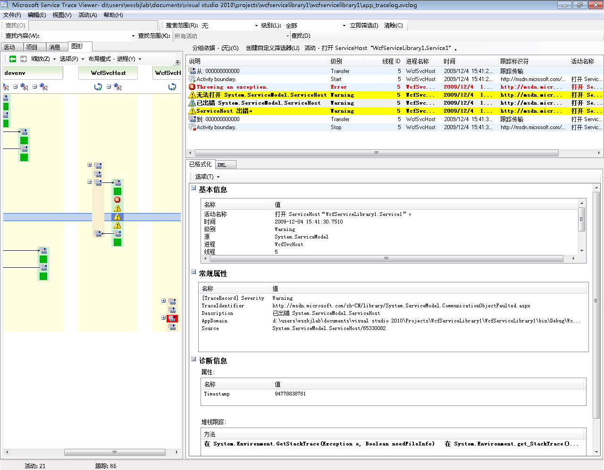

# <a name="using-service-trace-viewer-for-viewing-correlated-traces-and-troubleshooting"></a>使用服务跟踪查看器查看相关跟踪和进行故障诊断
本主题介绍跟踪数据的格式，如何查看它，以及使用服务跟踪查看器对应用程序进行故障诊断的方法。  
  
## <a name="using-the-service-trace-viewer-tool"></a>使用服务跟踪查看器工具  
 Windows Communication Foundation (WCF) 服务跟踪查看器工具可帮助您将生成 WCF 侦听器，以找到错误的根本原因的诊断跟踪相关联。 该工具，可以轻松地查看、 分组和筛选跟踪，以便可以诊断、 修复和验证 WCF 服务的问题。 有关使用此工具的详细信息，请参阅[Service Trace Viewer Tool (SvcTraceViewer.exe)](../../../../../docs/framework/wcf/service-trace-viewer-tool-svctraceviewer-exe.md)。  
  
 本主题包含通过运行生成的跟踪的屏幕截图[跟踪和消息日志记录](../../../../../docs/framework/wcf/samples/tracing-and-message-logging.md)采样，请使用查看时[Service Trace Viewer Tool (SvcTraceViewer.exe)](../../../../../docs/framework/wcf/service-trace-viewer-tool-svctraceviewer-exe.md)。 本主题演示如何了解跟踪内容、活动及其关联，以及进行故障诊断时如何分析大量跟踪。  
  
## <a name="viewing-trace-content"></a>查看跟踪内容  
 跟踪事件包含以下最重要的信息：  
  
-   设置时的活动名称。  
  
-   发出时间。  
  
-   跟踪级别。  
  
-   跟踪源名称。  
  
-   进程名称。  
  
-   线程 ID。  
  
-   一个唯一跟踪标识符，它是指向 Microsoft 文档，可以从其获取与跟踪相关的详细信息中的目标 URL。  
  
 所有这些可在服务跟踪查看器，或在上部的右侧面板中查看**基本信息**选择跟踪时在右下面板的格式化视图中的部分。  
  
> [!NOTE]
>  如果客户端和服务位于同一计算机上，则将显示针对这两个应用程序的跟踪。 可以使用筛选这些**进程名称**列。  
  
 此外，格式化视图还提供了跟踪说明和其他可用的详细信息。 后者可以包括异常类型和消息、调用堆栈、消息操作、从/到字段以及其他异常信息。  
  
 在 XML 视图中，有用的 xml 标记包括：  
  
-   `<SubType>` （跟踪级别）。  
  
-   `<TimeCreated>`。  
  
-   `<Source>` （跟踪源名称）。  
  
-   `<Correlation>` （发出跟踪时设置的活动 id）。  
  
-   `<Execution>` (进程和线程 id)。  
  
-   `<Computer>`。  
  
-   `<ExtendedData>`其中包括`<Action>`，`<MessageID>`和`<ActivityId>`发送一条消息时消息标头中设置。  
  
 如果检查“通过通道发送消息”跟踪，则可能会看到以下内容。  
  
```xml  
<E2ETraceEvent xmlns="http://schemas.microsoft.com/2004/06/E2ETraceEvent">  
   <System xmlns="http://schemas.microsoft.com/2004/06/windows/eventlog/system">  
      <EventID>262163</EventID>  
      <Type>3</Type>  
      <SubType Name="Information">0</SubType>  
      <Level>8</Level>  
      <TimeCreated SystemTime="2006-08-04T18:45:30.8491051Z" />  
      <Source Name="System.ServiceModel" />  
       <Correlation ActivityID="{27c6331d-8998-43aa-a382-03239013a6bd}"/>  
       <Execution ProcessName="client" ProcessID="1808" ThreadID="1" />  
       <Channel />  
       <Computer>TEST1</Computer>  
   </System>  
   <ApplicationData>  
       <TraceData>  
          <DataItem>  
             <TraceRecord xmlns="http://schemas.microsoft.com/2004/10/E2ETraceEvent/TraceRecord" Severity="Information">  
                 <TraceIdentifier>http://msdn.microsoft.com/library/System.ServiceModel.Channels.MessageSent.aspx</TraceIdentifier>  
                 <Description>Sent a message over a channel.</Description>  
                 <AppDomain>client.exe</AppDomain>  
                 <Source>System.ServiceModel.Channels.ClientFramingDuplexSessionChannel/35191196</Source>  
                <ExtendedData xmlns="http://schemas.microsoft.com/2006/08/ServiceModel/MessageTransmitTraceRecord">  
  
                  <MessageProperties>  
                     <AllowOutputBatching>False</AllowOutputBatching>  
                  </MessageProperties>  
                  <MessageHeaders>  
                     <Action d4p1:mustUnderstand="1" xmlns:d4p1="http://www.w3.org/2003/05/soap-envelope" xmlns="http://www.w3.org/2005/08/addressing">http://Microsoft.ServiceModel.Samples/ICalculator/Multiply</Action>  
                     <MessageID xmlns="http://www.w3.org/2005/08/addressing">urn:uuid:7c6670d8-4c9c-496e-b6a0-2ceb6db35338</MessageID>  
                     <ActivityId CorrelationId="b02e2189-0816-4387-980c-dd8e306440f5" xmlns="http://schemas.microsoft.com/2004/09/ServiceModel/Diagnostics">27c6331d-8998-43aa-a382-03239013a6bd</ActivityId>  
                     <ReplyTo xmlns="http://www.w3.org/2005/08/addressing">  
                        <Address>http://www.w3.org/2005/08/addressing/anonymous</Address>  
                    </ReplyTo>  
                    <To d4p1:mustUnderstand="1" xmlns:d4p1="http://www.w3.org/2003/05/soap-envelope" xmlns="http://www.w3.org/2005/08/addressing">net.tcp://localhost/servicemodelsamples/service</To>  
                  </MessageHeaders>  
                  <RemoteAddress>net.tcp://localhost/servicemodelsamples/service</RemoteAddress>  
                </ExtendedData>  
            </TraceRecord>  
          </DataItem>  
       </TraceData>  
   </ApplicationData>  
</E2ETraceEvent>  
```  
  
## <a name="servicemodel-e2e-tracing"></a>ServiceModel E2E 跟踪  
 当`System.ServiceModel`跟踪源设置`switchValue`除 Off 之外和`ActivityTracing`，WCF 创建活动和传输，WCF 处理。  
  
 活动是一个逻辑处理单元，将与该处理单元相关的所有跟踪组合在一起。 例如，可以为每个请求定义一个活动。 传输在终结点内的活动之间创建因果关系。 通过传播活动 ID，可以跨终结点使活动相关。 这可以通过设置`propagateActivity` = `true`在每个终结点的配置中。 活动、传输和传播允许您执行错误关联。 这样，可以更快地找到错误的根本原因。  
  
 在客户端上一个 WCF 活动创建为每个对象模型调用 （例如，打开 ChannelFactory、 添加、 除等。）每个操作调用中的"进程操作"活动进行处理。  
  
 在以下屏幕截图中，从提取[跟踪和消息日志记录](../../../../../docs/framework/wcf/samples/tracing-and-message-logging.md)示例左面板中显示的活动在按创建时间排序的客户端进程中创建的列表。 以下是活动的时间顺序列表：  
  
-   构造了通道工厂 (ClientBase)。  
  
-   打开了通道工厂。  
  
-   处理了加操作。  
  
-   设置安全会话 （这发生在首次请求） 和已处理的三个安全基础结构响应消息：RST、 RSTR、 SCT （处理消息 1，2，3）。  
  
-   处理了减、乘和除请求。  
  
-   关闭了通道工厂，这样做还关闭了安全会话并处理安全消息响应 Cancel。  
  
 我们看到由于 wsHttpBinding 所致的安全基础结构消息。  
  
> [!NOTE]
>  我们显示最初在单独的活动 （处理消息） 中处理的响应消息在 WCF 中，我们将其关联到相应的处理操作活动，其中包括请求消息，通过传输之前。 这发生在基础结构消息和异步请求中，并且归因于以下事实：必须检查消息、读取 activityId 标头以及识别具有该 ID 的现有“处理操作”活动以便与它相关。 对于同步请求，我们将为响应截留这些信息，因此可以知道响应与哪个处理操作相关。  
  
下图显示了按创建时间 （左面板） 及其嵌套的活动和跟踪 （右上面板） 列出的 WCF 客户端活动：

   
  
 在左面板中选择一个活动时，可以在右上面板上看到其嵌套活动和跟踪。 因此，这是左侧活动列表的简化分层视图（基于所选的父活动）。 因为所选处理操作“加”是发出的第一个请求，所以此活动包含“设置安全会话”活动（传输到，再传输回）和对“加”操作实际处理的跟踪。  
  
 如果双击左面板中添加活动的处理操作，我们可以看到添加到与相关的客户端 WCF 活动的图形表示形式。 左侧的第一个活动是根活动 (0000)，它是默认活动。 环境活动之外的 WCF 传输。 如果未定义，WCF 将到 0000 之外传输。 在这里，第二个活动“处理操作添加”在 0 之外传输。 然后可看到“设置安全会话”。  

 下图显示了 WCF 客户端的关系图视图，特别是在环境活动 (此处为 0)，处理操作，并设置安全会话：   

    
  
 在右上面板中，可以看到与“处理操作添加”活动相关的所有跟踪。 具体说来，已发送请求消息（“通过通道发送消息”）并在同一活动中收到了响应（“通过通道收到消息”）。 如下图所示。 为清楚起见，在图形中折叠了“设置安全会话”活动。  
  
 下图显示了一系列处理操作活动的跟踪。 我们发送请求，并在同一活动中接收的响应。
 
   
  
 在这里，我们加载客户端跟踪仅仅是为了清楚起见，但它们也是在该工具中加载，服务跟踪 （收到请求消息和发送响应消息） 将出现在同一活动中并`propagateActivity`已设置为`true.`这更高版本的图中所示。  
  
 在服务上，活动模型映射到 WCF 概念，如下所示：  
  
1.  构造并打开 ServiceHost（这可能创建几个与主机相关的活动，例如在出于安全性的情况下）。  
  
2.  在 ServiceHost 中为每个侦听器创建“侦听”活动（包括传入和传出“打开 ServiceHost”）。  
  
3.  当侦听器检测到由客户端发起的通信请求时，它将传输到"接收字节"活动，在其中处理从客户端发送的所有字节。 在此活动中，可以看到在客户端-服务交互期间发生的任何连接错误。  
  
4.  对于每个组接收的字节对应一条消息，我们处理这些字节在"进程内消息"活动中，我们在其中创建 WCF 消息对象。 在此活动中，可看到与错误信封或格式不正确的消息相关的错误。  
  
5.  形成消息后，传输到“处理操作”活动。 如果在客户端和服务上 `propagateActivity` 都设置为 `true`，则此活动具有与客户端中定义的活动相同的 ID，如前所述。 此阶段中我们将受益于直接关联的跨终结点，因为在 WCF 中发出的与请求相关的所有跟踪都都位于该同一活动，包括响应消息的处理。  
  
6.  对于进程外操作，我们将创建"执行用户代码"活动以隔离在 WCF 中的用户代码中发出的跟踪。 在前面的示例中，"服务发送添加响应"跟踪有可能的话将不在客户端传播的活动的"执行用户代码"活动中发出。  
  
 在下图中，左侧的第一个活动是根活动 (0000)，它是默认活动。 接下来的三个活动用于打开 ServiceHost。 第 5 列中的活动是侦听器，剩余的活动（6 到 8）说明消息的 WCF 处理，从字节处理到用户代码激活。  

 下图显示了 WCF 服务活动的关系图视图：   

   
  
  
 下面的屏幕快照显示客户端和服务的活动，并突出显示跨进程的“处理操作添加”活动（橙色）。 箭头使客户端和服务发送和接收的请求和响应消息相关。 跨进程处理操作的跟踪在图形中单独显示，但在右上面板中作为同一活动的一部分显示。 在此面板中，可以看到已发送消息的客户端跟踪，后跟已接收和已处理消息的服务跟踪。  
  
 下图显示了这两个 WCF 客户端和服务活动的关系图视图  
 
    
  
 在下面的错误情形中，服务和客户端上的错误和警告跟踪是相关的。 在服务上的用户代码中首先引发异常（最右侧的绿色活动，包括异常“服务无法处理用户代码中的此请求。”的警告跟踪）。 将响应发送到客户端时，会再次发出警告跟踪以指示错误消息（左侧的粉红色活动）。 然后客户端关闭其 WCF 客户端（左下侧的黄色活动），这将中止与服务的连接。 服务引发一个错误（右侧最长的粉红色活动）。  
  
   
跨服务和客户端的错误关联  
  
 用于生成这些跟踪的示例是使用 wsHttpBinding 的一系列同步请求。 对于没有安全性或具有异步请求的情形，与此图形存在偏差，其中处理操作活动包括造成异步调用的开始操作和结束操作，并显示到回调活动的传输。 有关其他方案的详细信息，请参阅[端到端跟踪方案](../../../../../docs/framework/wcf/diagnostics/tracing/end-to-end-tracing-scenarios.md)。  
  
## <a name="troubleshooting-using-the-service-trace-viewer"></a>使用服务跟踪查看器进行故障诊断  
 在服务跟踪查看器工具中加载跟踪文件时，可以在左面板上选择任何红色或黄色的活动，以追踪应用程序中问题的原因。 000 活动通常具有最终归因于用户的未经处理的异常。  
  
  下图显示了如何选择红色或黄色活动，以找到问题的根源。   
   
 
  
 在右上面板上，可以检查在左侧选择的活动的跟踪。 然后，可以检查该面板中的红色或黄色跟踪以及查看它们是如何相关的。 在前面的图形中，我们看到客户端和服务的警告跟踪都在同一处理操作活动中。  
  
 如果这些跟踪未提供错误的根本原因，则可以通过双击左面板上的所选活动（此处为处理操作）来利用图形。 随后将显示具有相关活动的图形。 您可以展开相关的活动 （通过单击"+"符号） 查找红色或黄色的相关活动中的第一个发出的跟踪。 在传输到相关活动或跨终结点的消息流之后，一直展开刚好在相关的红色或黄色跟踪之前发生的活动，直到查明问题的根本原因为止。  
  
   
展开活动以查明问题的根本原因  
  
 如果已关闭 ServiceModel `ActivityTracing` 但打开了 ServiceModel 跟踪，则可以看到在 0000 活动中发出的 ServiceModel 跟踪。 但是，这需要进行更多的工作才能了解这些跟踪的关联。  
  
 如果启用了“消息日志记录”，则可以使用“消息”选项卡查看受错误影响的消息。 通过双击红色或黄色的消息，可以看到相关活动的图形视图。 这些活动是与发生错误的请求最紧密相关的活动。  
  
   

若要开始进行故障排除，还可以选择红色或黄色的消息跟踪并双击它以查明根本原因。  
  
## <a name="see-also"></a>请参阅
- [端到端跟踪方案](../../../../../docs/framework/wcf/diagnostics/tracing/end-to-end-tracing-scenarios.md)
- [服务跟踪查看器工具 (SvcTraceViewer.exe)](../../../../../docs/framework/wcf/service-trace-viewer-tool-svctraceviewer-exe.md)
- [跟踪](../../../../../docs/framework/wcf/diagnostics/tracing/index.md)
