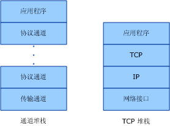
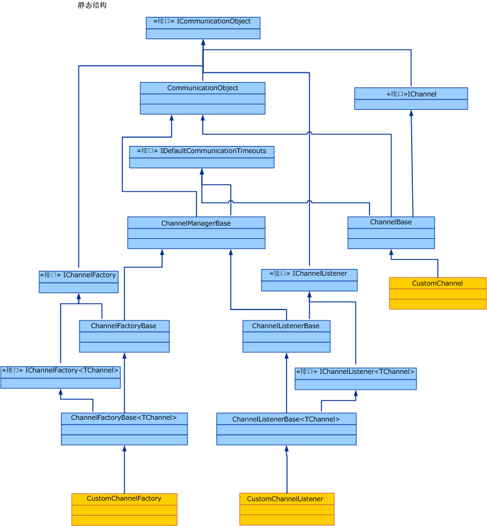

# 通道模型概述Channel Model Overview
Windows Communication Foundation (WCF) 通道堆栈是分层的通信堆栈处理消息的一个或多个频道。The Windows Communication Foundation (WCF) channel stack is a layered communication stack with one or more channels that process messages. 堆栈底部是传输通道，它负责使通道堆栈适应基础传输（例如，TCP、HTTP、SMTP 和其他类型的传输）。At the bottom of the stack is a transport channel that is responsible for adapting the channel stack to the underlying transport (for example, TCP, HTTP, SMTP and other types of transport.). 通道为消息的发送和接收提供了一个低级编程模型。Channels provide a low-level programming model for sending and receiving messages. 此编程模型依赖于多个接口和其他类型统称为 WCF 通道模型。This programming model relies on several interfaces and other types collectively known as the WCF channel model. 本主题讨论通道形状、基本通道侦听器（在服务上）和通道工厂（在客户端上）的构造。This topic discusses channel shapes, the construction of a basic channel listener (on the service) and channel factory (on the client).  
  
## 通道堆栈Channel Stack  
 WCF 终结点与世界上使用称为通道堆栈的通信堆栈的通信。WCF endpoints communicate with the world using a communication stack called the channel stack. 下图对通道堆栈和其他通信堆栈（如 TCP/IP）进行了比较。The following diagram compares the channel stack with other communication stacks, for example TCP/IP.  
  
   
  
 首先，相似之处：在这两种情况下，堆栈中的每个层提供该层下面的层和公开该抽象仅向其上的一层的一些抽象。First, the similarities: In both cases, each layer of the stack provides some abstraction of the world below that layer and exposed that abstraction only to the layer directly above it. 每一层只使用其下面一层的抽象。Each layer uses the abstraction of only the layer directly below it. 而且在这两种情况下，两个堆栈通信时，每个层均与另一个堆栈中的相应层通信，例如，IP 层与 IP 层通信，TCP 层与 TCP 层通信，依此类推。Also in both cases, when two stacks communicate, each layer communicates with the corresponding layer in the other stack, for example, the IP layer communicates with the IP layer and the TCP layer with the TCP layer, and so on.  
  
 现在说明区别：虽然 TCP 堆栈旨在提供物理网络的抽象，通道堆栈旨在提供一种抽象的如何传递消息，即、 传输，不仅还等什么是在邮件或其他功能协议用于通信，包括但不仅仅的传输。Now, the differences: While the TCP stack was designed to provide an abstraction of the physical network, the channel stack is designed to provide an abstraction of not only how the message is delivered, that is, the transport, but also other features such as what is in the message or what protocol is used for communication, including the transport but much more than that. 例如，可靠的会话绑定元素是通道堆栈的一部分，但却不在传输下面或传输本身中。For example, reliable session binding element is part of the channel stack but is not below the transport or the transport itself. 此抽象是通过要求堆栈中的底部通道使基础传输协议适应通道堆栈体系结构，然后依赖堆栈中更上层的通道提供通信功能（比如可靠性保证和安全）来实现的。This abstraction is achieved by requiring the bottom channel in the stack to adapt the underlying transport protocol to the channel stack architecture and then relying on channels further up in the stack to provide communication features such as reliability guarantees and security.  
  
 消息作为 <xref:System.ServiceModel.Channels.Message> 对象流过通信堆栈。Messages flow through the communication stack as <xref:System.ServiceModel.Channels.Message> objects. 如上图所示，底部通道称为传输通道。As shown in figure above, the bottom channel is called a transport channel. 它是负责与其他方之间发送和接收消息的通道。It is the channel that is responsible for sending and receiving messages to and from other parties. 这包括负责在与用于和其他方通信的格式之间转换 <xref:System.ServiceModel.Channels.Message> 对象。This includes the responsibility of transforming the <xref:System.ServiceModel.Channels.Message> object to and from the format used to communicate with other parties. 传输通道上面可以有任意个协议通道，每个协议通道负责提供一种通信功能（如可靠的传递保证）。Above the transport channel there can be any number of protocol channels each responsible for providing a communication function such as reliable delivery guarantees. 协议通道对以 <xref:System.ServiceModel.Channels.Message> 对象的形式流过其中的消息执行操作。Protocol channels operate on messages flowing through them in the form of the <xref:System.ServiceModel.Channels.Message> object. 协议通道通常会转换消息（例如，通过添加标头或加密正文），或者发送和接收协议通道自己的控制消息（例如回执确认）。They typically either transform the message, for example, by adding headers or encrypting the body, or send and receive their own protocol control messages, for example, receipt acknowledgments.  
  
## 通道形状Channel Shapes  
 每个通道均实现一个或多个接口，称为通道形状接口或通道形状。Each channel implements one or more interfaces known as channel shape interfaces or channel shapes. 这些通道形状提供面向通信的方法（如通道实现的发送和接收或请求和答复）和通道调用的用户。Those channel shapes provide the communication-oriented methods such as send and receive or request and reply that the channel implements and the user of the channel calls. 通道形状的底部是<xref:System.ServiceModel.Channels.IChannel>接口，这是一个接口，提供`GetProperty` \<T > 方法，用作访问由通道堆栈中的任意功能的分层机制。At the base of the channel shapes is the <xref:System.ServiceModel.Channels.IChannel> interface, which is an interface that provides a `GetProperty`\<T> method intended as a layered mechanism to access arbitrary features exposed by channels in the stack. 扩展 <xref:System.ServiceModel.Channels.IChannel> 的五种通道形状为：The five channel shapes that extend <xref:System.ServiceModel.Channels.IChannel> are:  
  
- <xref:System.ServiceModel.Channels.IInputChannel>  
  
- <xref:System.ServiceModel.Channels.IOutputChannel>  
  
- <xref:System.ServiceModel.Channels.IRequestChannel>  
  
- <xref:System.ServiceModel.Channels.IReplyChannel>  
  
- <xref:System.ServiceModel.Channels.IDuplexChannel>  
  
 另外，这些形状中的每个形状均有一个扩展 <xref:System.ServiceModel.Channels.ISessionChannel%601?displayProperty=nameWithType> 以支持会话的等效项。Further, each of these shapes has an equivalent that extends <xref:System.ServiceModel.Channels.ISessionChannel%601?displayProperty=nameWithType> to support sessions. 这些是：These are:  
  
- <xref:System.ServiceModel.Channels.IInputSessionChannel>  
  
- <xref:System.ServiceModel.Channels.IOutputSessionChannel>  
  
- <xref:System.ServiceModel.Channels.IRequestSessionChannel>  
  
- <xref:System.ServiceModel.Channels.IReplySessionChannel>  
  
- <xref:System.ServiceModel.Channels.IDuplexSessionChannel>  
  
 在现有的传输协议支持某些基本消息交换模式后，通道形状可以实现模式化。The channel shapes are patterned after some of the fundamental message exchange patterns supported by existing transport protocols. 例如，单向消息传递对应于<xref:System.ServiceModel.Channels.IInputChannel> / <xref:System.ServiceModel.Channels.IOutputChannel>对，请求-答复对应于<xref:System.ServiceModel.Channels.IRequestChannel> / <xref:System.ServiceModel.Channels.IReplyChannel>对和双向双工通信对应于<xref:System.ServiceModel.Channels.IDuplexChannel>(同时扩展<xref:System.ServiceModel.Channels.IInputChannel>和<xref:System.ServiceModel.Channels.IOutputChannel>)。For example, one-way messaging corresponds to an <xref:System.ServiceModel.Channels.IInputChannel>/<xref:System.ServiceModel.Channels.IOutputChannel> pair, request-reply corresponds to <xref:System.ServiceModel.Channels.IRequestChannel>/<xref:System.ServiceModel.Channels.IReplyChannel> pairs and two-way duplex communications corresponds to <xref:System.ServiceModel.Channels.IDuplexChannel> (which extends both <xref:System.ServiceModel.Channels.IInputChannel> and <xref:System.ServiceModel.Channels.IOutputChannel>).  
  
## 通道堆栈的编程Programming with the Channel Stack  
 通道堆栈通常是使用工厂模式创建的，在这种模式中，绑定创建通道堆栈。Channel stacks are typically created using a factory pattern where a binding creates the channel stack. 在发送端，使用绑定生成 <xref:System.ServiceModel.ChannelFactory>，而后者生成通道堆栈并返回对堆栈中顶部通道的引用。On the send side, a binding is used to build a <xref:System.ServiceModel.ChannelFactory>, which in turn builds a channel stack and returns a reference to the top channel in the stack. 之后，应用程序可以使用此通道发送消息。The application can then use this channel to send messages. 有关详细信息，请参阅[客户端通道级编程](../../../../docs/framework/wcf/extending/client-channel-level-programming.md)。For more information, see [Client Channel-Level Programming](../../../../docs/framework/wcf/extending/client-channel-level-programming.md).  
  
 在接收端，使用绑定生成 <xref:System.ServiceModel.Channels.IChannelListener>，用于侦听传入消息。On the receive side a binding is used to build a <xref:System.ServiceModel.Channels.IChannelListener>, which listens for incoming messages. <xref:System.ServiceModel.Channels.IChannelListener> 通过创建通道堆栈并将应用程序引用传递给顶部通道，将消息提供给侦听应用程序。The <xref:System.ServiceModel.Channels.IChannelListener> provides messages to the listening application by creating channel stacks and handing the application reference to the top channel. 之后，应用程序使用此通道接收传入消息。The application then uses this channel to receive incoming messages. 有关详细信息，请参阅[服务通道级编程](../../../../docs/framework/wcf/extending/service-channel-level-programming.md)。For more information, see [Service Channel-Level Programming](../../../../docs/framework/wcf/extending/service-channel-level-programming.md).  
  
## 通道对象模型The Channel Object Model  
 通道对象模型是实现通道、通道侦听器和通道工厂所必需的一组核心接口。The channel object model is the core set of interfaces required to implement channels, channel listeners and channel factories. 还提供一些基类以辅助自定义实现。There are also some base classes provided to assist in custom implementations.  
  
 通道侦听器负责侦听传入消息，然后通过由通道侦听器创建的通道将这些消息传送到上面的层。Channel listeners are responsible for listening for incoming messages, then delivering them to the layer above through channels created by the channel listener.  
  
 通道工厂负责创建通道，这些通道用于发送消息，并在通道工厂关闭时，关闭通道工厂创建的所有通道。Channel factories are responsible for creating channels that are used for sending messages and for closing all channels they created when the channel factory is closed.  
  
 <xref:System.ServiceModel.ICommunicationObject> 是定义所有通信对象实现的基本状态机的核心接口。<xref:System.ServiceModel.ICommunicationObject> is the core interface that defines the basic state machine that all communication objects implement. <xref:System.ServiceModel.Channels.CommunicationObject> 提供此核心接口的实现，其他通道类可以派生自该核心接口，而不是重新实现该接口。<xref:System.ServiceModel.Channels.CommunicationObject> provides an implementation of this core interface that other channel classes can derive from rather than re-implementing the interface. 但这并不是必需的：自定义通道可以直接实现 <xref:System.ServiceModel.ICommunicationObject> 而不继承自 <xref:System.ServiceModel.Channels.CommunicationObject>。However, this is not required: a custom channel can implement <xref:System.ServiceModel.ICommunicationObject> directly and not inherit from <xref:System.ServiceModel.Channels.CommunicationObject>. 图 3 中的任何类都不是通道模型的部分；它们是想要生成通道的自定义通道实施者可以使用的帮助器。None of the classes in Figure 3 are considered part of the channel model; they are helpers available to custom channel implementers who want to build channels.  
  
   
  
 以下主题说明通道对象模型以及可帮助生成自定义通道的各个开发领域。The following topics describe the channel object model as well as various development areas that help build custom channels.  
  
|主题Topic|描述Description|  
|-----------|-----------------|  
|[服务：通道侦听器和通道Service: Channel Listeners and Channels](../../../../docs/framework/wcf/extending/service-channel-listeners-and-channels.md)|说明用于侦听服务应用程序中传入通道的通道侦听器。Describes channel listeners, which listen for incoming channels in a service application.|  
|[客户端：通道工厂和通道Client: Channel Factories and Channels](../../../../docs/framework/wcf/extending/client-channel-factories-and-channels.md)|说明用于创建通道以连接到服务应用程序的通道工厂。Describes channel factories, which create channels to connect to a service application.|  
|[了解状态更改Understanding State Changes](../../../../docs/framework/wcf/extending/understanding-state-changes.md)|说明 <xref:System.ServiceModel.ICommunicationObject?displayProperty=nameWithType> 接口如何模拟通道中的状态变化。Describes how the <xref:System.ServiceModel.ICommunicationObject?displayProperty=nameWithType> interface models state changes in channels.|  
|[选择消息交换模式Choosing a Message Exchange Pattern](../../../../docs/framework/wcf/extending/choosing-a-message-exchange-pattern.md)|说明通道可以支持的六种基本消息交换模式。Describes the six basic message exchange patterns that channels can support.|  
|[处理异常和错误Handling Exceptions and Faults](../../../../docs/framework/wcf/extending/handling-exceptions-and-faults.md)|说明如何处理自定义通道中的错误和异常。Describes how to handle faults and exceptions in custom channels.|  
|[配置和元数据支持Configuration and Metadata Support](../../../../docs/framework/wcf/extending/configuration-and-metadata-support.md)|说明如何支持从应用程序模型中使用自定义通道以及如何使用绑定和绑定元素导出和导入元数据。Describes how to support the use of custom channels from the application model and how to export and import metadata using bindings and binding elements.|
