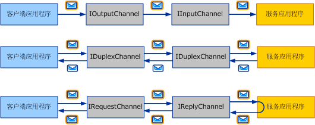
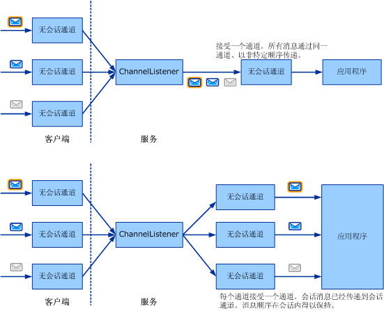

# 选择消息交换模式
编写自定义传输的第一步是确定哪个*消息交换模式*（或 Mep） 所需的正在开发的通道。 本主题说明可用的选项，并讨论各种不同的需求。 这是通道开发任务列表中所述的第一个任务[开发通道](../../../../docs/framework/wcf/extending/developing-channels.md)。  
  
## 六种消息交换模式  
 有三种 MEP 可供选择：  
  
-   数据报（<xref:System.ServiceModel.Channels.IInputChannel> 和 <xref:System.ServiceModel.Channels.IOutputChannel>）  
  
     在使用数据报 MEP 时，客户端发送消息使用*发后不理*exchange。 “发后不理”交换形式是一种要求带外确认成功传递的交换形式。 消息在传输过程中可能会丢失，而永远不能到达服务。 如果在客户端成功完成发送操作，这并不保证远程终结点已经收到消息。 数据报是消息传递的基本构造块，因为您可以在它上面构建自己的协议，包括可靠的协议和安全的协议。 客户端数据报通道实现 <xref:System.ServiceModel.Channels.IOutputChannel> 接口，而服务数据报通道实现 <xref:System.ServiceModel.Channels.IInputChannel> 接口。  
  
-   请求-响应（<xref:System.ServiceModel.Channels.IRequestChannel> 和 <xref:System.ServiceModel.Channels.IReplyChannel>）  
  
     在此 MEP 中，将发送一个消息并接收一个答复。 此模式由请求-响应对组成。 请求-响应调用的示例包括远程过程调用 (RPC) 和浏览器的 GET 请求。 此模式也称为半双工。 在此 MEP 中，客户端通道实现 <xref:System.ServiceModel.Channels.IRequestChannel>，而服务通道实现 <xref:System.ServiceModel.Channels.IReplyChannel>。  
  
-   双工 (<xref:System.ServiceModel.Channels.IDuplexChannel>)  
  
     通过双工 MEP，客户端可以发送任意数目的消息，并以任意顺序接收消息。 双工 MEP 就像电话通话，所说的每一个字都是一条消息。 由于在这种 MEP 中两端都可发送和接收，因此，由客户端和服务通道实现的接口为 <xref:System.ServiceModel.Channels.IDuplexChannel>。  
  
   
三种基本的消息交换模式。 从上到下：数据报、请求-响应和双工。  
  
 每个 Mep 还可以支持*会话*。 会话（和 <xref:System.ServiceModel.Channels.ISessionChannel%601?displayProperty=nameWithType><xref:System.ServiceModel.Channels.ISession?displayProperty=nameWithType>类型的 的实现）会将通道上发送和接收的所有消息关联在一起。 请求-响应模式是一种由两个消息组成的独立会话，因为请求和响应是相关的。 与此形成对照的是，支持会话的请求-响应模式意味着该通道上的所有请求-响应对都是相关的。 这使您总共有六种 MEP 可以选择：  
  
-   数据报  
  
-   请求-响应  
  
-   双工  
  
-   带会话的数据报  
  
-   带会话的请求-响应  
  
-   带会话的双工  
  
> [!NOTE]
>  对于 UDP 传输，所支持的唯一 MEP 是数据报，因为 UDP 的性质是一个“启动后不管”协议。  
  
## 会话和会话通道  
 在网络世界中，有面向连接的协议（例如 TCP）和无连接的协议（例如 UDP）。 WCF 使用术语会话来表示类似于连接的逻辑抽象。 会话 WCF 协议类似于面向连接的网络协议，而无会话 WCF 协议则类似于无连接的网络协议。  
  
 在通道目标模型中，每个逻辑会话都表现为一个会话通道的实例。 因此，由客户端创建并在服务端接受的每个新会话都与每一端的一个新会话通道相对应。 下面的关系图的上部显示无会话通道的结构，下部显示会话通道的结构。  
  
   
  
 客户端创建新的会话通道并发送消息。 在服务端，通道侦听器收到此消息并检测到它属于新会话，于是就创建新的会话通道，并将其交给应用程序（以响应在通道侦听器上调用 AcceptChannel 的应用程序）。 然后应用程序会收到此消息，以及通过同一个会话通道在同一个会话中发送的所有后续消息。  
  
 另一个客户端（或同一个客户端）创建新的会话通道并发送消息。 通道侦听器检测到此消息属于新的会话，于是便创建新会话通道；此过程不断重复。  
  
 没有会话，就没有通道和会话之间的相关性。 因此通道侦听器只创建一个通道，接收到的所有消息都通过该通道传递给应用程序。 也不会有消息的排序，因为没有会话可供在其中维护消息顺序。 上图的上部描述了无会话消息交换。  
  
## 开始和终止会话  
 只需创建一个新的会话通道，即可在客户端开始会话。 当服务收到在新会话中发送的消息时，会话即在服务上开始。 同样，关闭或中止会话通道即可终止会话。  
  
 这种情况的例外是 <xref:System.ServiceModel.Channels.IDuplexSessionChannel>，它用于以双工会话通信模式发送和接收消息。 有可能一端希望停止发送消息，但是希望继续接收消息，因此在使用 <xref:System.ServiceModel.Channels.IDuplexSessionChannel> 时，有一种机制能让您关闭输出会话，显示您不再发送更多消息，但是保持输入会话打开，以允许您继续接收消息。  
  
 通常是在传出端关闭对话，而不在传入端关闭对话。 也就是说，会话输出通道可能关闭，从而完全终止会话。 关闭会话输出通道会使相应的会话输入通道向在 <xref:System.ServiceModel.Channels.IInputChannel.Receive%2A?displayProperty=nameWithType> 上调用 <xref:System.ServiceModel.Channels.IDuplexSessionChannel> 的应用程序返回空值。  
  
 然而会话输入通道不应该关闭，除非 <xref:System.ServiceModel.Channels.IInputChannel.Receive%2A?displayProperty=nameWithType> 上的 <xref:System.ServiceModel.Channels.IDuplexSessionChannel> 返回空值，指示该会话已经关闭。 如果 <xref:System.ServiceModel.Channels.IInputChannel.Receive%2A?displayProperty=nameWithType> 上的 <xref:System.ServiceModel.Channels.IDuplexSessionChannel> 没有返回空值，则关闭会话输入通道可能引发异常，因为当通道关闭时可能收到意外的消息。 如果在发送方终止会话之前接收方希望终止会话，接收方应该在输入通道上调用 <xref:System.ServiceModel.ICommunicationObject.Abort%2A>，这可以突然终止会话。  
  
## 编写会话通道  
 作为会话通道作者，有几件事是您的通道为了提供会话所必须做的。 在发送端，您的通道需要：  
  
-   为每个新通道创建一个新会话，并将其与一个新的会话标识关联，该标识是一个唯一的字符串。 或者从堆栈中位于您下方的会话通道获取一个新会话。  
  
-   对于用此通道发送的每条消息，如果您的通道创建了会话（而不是从您下面的层获取会话），您需要将此消息与会话关联。 对于协议通道，这通常通过添加 SOAP 标头来完成。 对于传输通道，这通常通过创建一个新的传输连接或向组帧协议添加会话信息来完成。  
  
-   对于每个使用此通道发送的消息，都需要提供上面提到的传递保证。 如果依靠位于您下面的通道来提供会话，该通道也应提供传递保证。 如果您自己提供会话，您需要把这些保证作为您的协议的一部分加以实现。 通常，如果您编写在两端都采用 WCF 的协议通道，您可能需要 TCP 传输或可靠消息通道，并依靠其中一种方法来提供会话。  
  
-   当在您的通道上调用 <xref:System.ServiceModel.ICommunicationObject.Close%2A?displayProperty=nameWithType> 时，应使用指定的或默认的超时值执行必要的工作来关闭该会话。 这可能很简单，只需在位于您下面的通道上调用 <xref:System.ServiceModel.ICommunicationObject.Close%2A>（如果您只从它获取了会话）、发送特殊 SOAP 消息或关闭传输连接。  
  
-   当在您的通道上调用 <xref:System.ServiceModel.ICommunicationObject.Abort%2A> 时，应立即终止会话而不必执行 I/O。 这可能意味着不执行任何操作，或者可能涉及中止一个网络连接或某个其他资源。  
  
 在接收端，您的通道需要：  
  
-   对于每个传入消息，通道侦听器必须检测到消息所属的会话。 如果这是会话中的第一个消息，通道侦听器必须创建一个新通道，并将其从调用返回到 <xref:System.ServiceModel.Channels.IChannelListener%601.AcceptChannel%2A?displayProperty=nameWithType>。 否则，通道侦听器必须找到与该会话对应的现有通道，并通过该通道传递消息。  
  
-   如果您的通道正在提供会话（连同所要求的传递保证），可能会要求接收方执行某些操作，例如重新排列消息或发送确认消息。  
  
-   当在您的通道上调用 <xref:System.ServiceModel.ICommunicationObject.Close%2A> 时，应使用指定的或默认的超时值执行必要的工作来关闭该会话。 如果通道在等待关闭超时到期时收到消息，则可能会导致异常。 这是因为通道将处于关闭状态，却突然收到消息，所以会引发异常。  
  
-   当在您的通道上调用 <xref:System.ServiceModel.ICommunicationObject.Abort%2A> 时，应立即终止会话而不必执行 I/O。 同样，这可能意味着不执行任何操作，或者可能涉及中止一个网络连接或某个其他资源。  
  
## 请参阅  
 [通道模型概述](../../../../docs/framework/wcf/extending/channel-model-overview.md)
