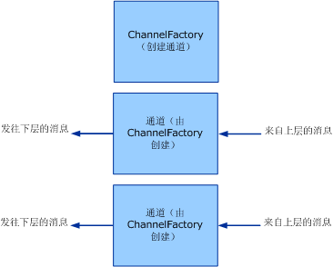

# <a name="client-channel-factories-and-channels"></a>客户端：通道工厂和通道
本主题介绍通道工厂和通道的创建。  
  
## <a name="channel-factories-and-channels"></a>通道工厂和通道  
 通道工厂负责创建通道。 由通道工厂创建的通道用于发送消息。 这些通道负责获取来自上一层的消息，对消息进行必要的处理，然后将消息发送到下一层。 下图演示此过程。  
  
   
通道工厂创建通道。  
  
 通道工厂在关闭时负责关闭其创建的但尚未关闭的所有通道。 请注意，此处的模型是非对称的，原因是当通道侦听器关闭时，它仅停止接受新通道，而使现有通道保持打开状态以便继续接收消息。  
  
 [!INCLUDE[indigo2](../../../../includes/indigo2-md.md)] 为上述过程提供基类帮助器。 (本主题中讨论的通道帮助程序类关系图，请参阅[通道模型概述](../../../../docs/framework/wcf/extending/channel-model-overview.md)。)  
  
-   <xref:System.ServiceModel.Channels.CommunicationObject>类实现<xref:System.ServiceModel.ICommunicationObject>并强制执行的步骤 2 中所述的状态机[开发通道](../../../../docs/framework/wcf/extending/developing-channels.md)。  
  
-   '<xref:System.ServiceModel.Channels.ChannelManagerBase>类实现<xref:System.ServiceModel.Channels.CommunicationObject>并提供的统一的基类<xref:System.ServiceModel.Channels.ChannelFactoryBase?displayProperty=nameWithType>和<xref:System.ServiceModel.Channels.ChannelListenerBase?displayProperty=nameWithType>。 <xref:System.ServiceModel.Channels.ChannelManagerBase> 类与 <xref:System.ServiceModel.Channels.ChannelBase>（用来实现 <xref:System.ServiceModel.Channels.IChannel> 的基类）结合使用。  
  
-   '<xref:System.ServiceModel.Channels.ChannelFactoryBase>类实现<xref:System.ServiceModel.Channels.ChannelManagerBase>和<xref:System.ServiceModel.Channels.IChannelFactory>，并将整合`CreateChannel`成一个重载`OnCreateChannel`抽象方法。  
  
-   '<xref:System.ServiceModel.Channels.ChannelListenerBase>类实现<xref:System.ServiceModel.Channels.IChannelListener>。 它负责执行基本状态管理。  
  
 以下讨论基于[传输： UDP](../../../../docs/framework/wcf/samples/transport-udp.md)示例。  
  
### <a name="creating-a-channel-factory"></a>创建通道工厂  
 `UdpChannelFactory` 派生自 <xref:System.ServiceModel.Channels.ChannelFactoryBase>。 该示例重写 <xref:System.ServiceModel.Channels.ChannelFactoryBase.GetProperty%2A> 以提供对消息编码器的消息版本的访问。 该示例还重写 <xref:System.ServiceModel.Channels.ChannelFactoryBase.OnClose%2A> 以在状态机转变时拆开 <xref:System.ServiceModel.Channels.BufferManager> 的实例。  
  
#### <a name="the-udp-output-channel"></a>UDP 输出通道  
 `UdpOutputChannel` 实现 <xref:System.ServiceModel.Channels.IOutputChannel>。 构造函数对参数进行验证，并基于传入的 <xref:System.Net.EndPoint> 来构造目标 <xref:System.ServiceModel.EndpointAddress> 对象。  
  
 重写 <xref:System.ServiceModel.Channels.CommunicationObject.OnOpen%2A> 将创建用于向此 <xref:System.Net.EndPoint> 发送消息的套接字。  
  
 `this.socket = new Socket(`  
  
 `this.remoteEndPoint.AddressFamily,`  
  
 `SocketType.Dgram,`  
  
 `ProtocolType.Udp`  
  
 `);`  
  
 通道可以正常关闭或非正常关闭。 如果通道正常关闭，则套接字也将关闭，并调用基类 `OnClose` 方法。 如果引发异常，则基础结构将调用 `Abort` 以确保清理该通道。  
  
```  
this.socket.Close();  
base.OnClose(timeout);  
```  
  
 实现`Send()`和`BeginSend()` / `EndSend()`。 这将分解为两个主要部分。 首先，将消息序列化为字节数组：  
  
```  
ArraySegment<byte> messageBuffer = EncodeMessage(message);  
```  
  
 然后，在网络上发送生成的数据：  
  
```  
this.socket.SendTo(  
  messageBuffer.Array,   
  messageBuffer.Offset,   
  messageBuffer.Count,   
  SocketFlags.None,   
  this.remoteEndPoint  
);  
```  
  
## <a name="see-also"></a>另请参阅  
 [开发通道](../../../../docs/framework/wcf/extending/developing-channels.md)
