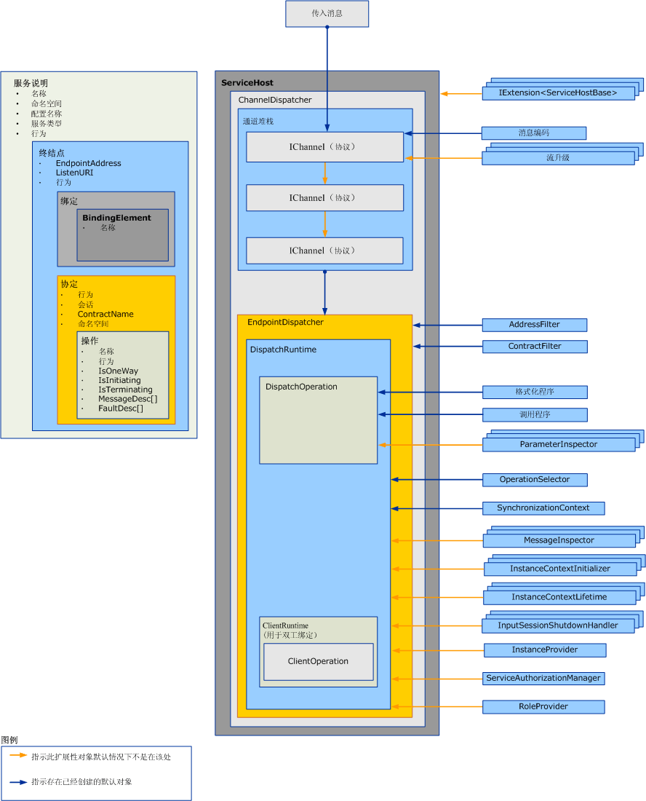

# 扩展调度程序
调度程序负责从基础通道提取出传入的消息，将它们翻译成应用程序代码形式的方法调用，并将结果发送回调用方。 调度程序扩展允许您修改此过程。  您可以实现消息或参数检查器，用来检查或修改消息或参数的内容。  您也可以更改将消息路由到操作的方式或提供其他功能。  
  
 本主题介绍如何使用<xref:System.ServiceModel.Dispatcher.DispatchRuntime>和<xref:System.ServiceModel.Dispatcher.DispatchOperation>类在 Windows Communication Foundation (WCF) 服务应用程序来修改调度程序的默认执行行为或以截获或修改消息、 参数或返回之前或之后发送或从通道层检索它们的值。 有关等效客户端运行时消息处理的详细信息，请参阅[扩展客户端](../../../../docs/framework/wcf/extending/extending-clients.md)。 若要了解该角色的<xref:System.ServiceModel.IExtensibleObject%601>类型在各种运行时自定义对象之间访问共享的状态中播放，请参阅[可扩展对象](../../../../docs/framework/wcf/extending/extensible-objects.md)。  
  
## 调度程序  
 服务模型层执行开发人员的编程模型与基础消息交换（通常称为通道层）之间的转换。 在 WCF 通道和终结点调度程序 (<xref:System.ServiceModel.Dispatcher.ChannelDispatcher>和<xref:System.ServiceModel.Dispatcher.EndpointDispatcher>分别) 均为服务组件负责接受新通道，接收消息、 操作调度和调用和响应处理。 调度程序对象是接收方对象，但双工服务中的回调协定实现还公开其用于检查、修改或扩展的调度程序对象。  
  
 通道调度程序（和伴随 <xref:System.ServiceModel.Channels.IChannelListener>）从基础通道中提取出消息，然后将消息传递到各自的终结点调用程序。 每个终结点调度程序都有一个 <xref:System.ServiceModel.Dispatcher.DispatchRuntime>，用于将消息路由到相应的、负责调用实现操作的方法的 <xref:System.ServiceModel.Dispatcher.DispatchOperation>。 在此过程中，将会调用各种可选的和必选的扩展类。 本主题说明这些部分如何组合在一起，以及如何修改属性和插入自己的代码以扩展基本功能。  
  
 通过使用服务、终结点、协定或操作行为对象插入调度程序属性和修改的自定义对象。 本主题不介绍如何使用行为。 有关使用用于插入调度程序修改的类型的详细信息，请参阅[配置和扩展的运行时行为带有](../../../../docs/framework/wcf/extending/configuring-and-extending-the-runtime-with-behaviors.md)。  
  
 下图提供了服务中的体系结构项的高级别视图。  
  
   
  
### 通道调度程序  
 创建 <xref:System.ServiceModel.Dispatcher.ChannelDispatcher> 对象以将特定 URI（称为侦听 URI）处的 <xref:System.ServiceModel.Channels.IChannelListener> 与服务的实例相关联。 每个 <xref:System.ServiceModel.ServiceHost> 对象都可以具有许多 <xref:System.ServiceModel.Dispatcher.ChannelDispatcher> 对象，其中的每个对象都只与一个侦听器和侦听 URI 相关联。 当消息到达时，<xref:System.ServiceModel.Dispatcher.ChannelDispatcher> 会查询每个相关的 <xref:System.ServiceModel.Dispatcher.EndpointDispatcher> 对象以确定终结点是否可以接受消息，并将该消息传递到可以接受消息的终结点。  
  
 控制通道会话的生存期和行为的所有属性都可以在 <xref:System.ServiceModel.Dispatcher.ChannelDispatcher> 对象上检查或修改。 这些属性包括自定义通道初始值设定项、通道侦听器、主机、关联的 <xref:System.ServiceModel.InstanceContext>，等等。  
  
### 终结点调度程序  
 当消息的目标地址与 <xref:System.ServiceModel.Dispatcher.EndpointDispatcher> 相匹配并且消息操作与 <xref:System.ServiceModel.Dispatcher.ChannelDispatcher> 属性相匹配时，<xref:System.ServiceModel.Dispatcher.EndpointDispatcher.AddressFilter%2A> 对象负责处理来自 <xref:System.ServiceModel.Dispatcher.EndpointDispatcher.ContractFilter%2A> 的消息。 如果两个 <xref:System.ServiceModel.Dispatcher.EndpointDispatcher> 对象可以接受一个消息，则 <xref:System.ServiceModel.Dispatcher.EndpointDispatcher.FilterPriority%2A> 属性值确定具有较高优先级的终结点。  
  
 使用 <xref:System.ServiceModel.Dispatcher.EndpointDispatcher> 以获取两个主服务模型扩展点（<xref:System.ServiceModel.Dispatcher.DispatchRuntime> 和 <xref:System.ServiceModel.Dispatcher.DispatchOperation> 类），可以使用这两个主服务模型扩展点来自定义调度程序的处理。 <xref:System.ServiceModel.Dispatcher.DispatchRuntime> 类允许用户在协定范围内（即，针对协定中的所有消息）截获并扩展调度程序。 <xref:System.ServiceModel.Dispatcher.DispatchOperation> 类允许用户在操作范围内（即，针对操作中的所有消息）截获并扩展调度程序。  
  
## 方案  
 可以有很多理由来扩展调度程序：  
  
-   自定义消息验证。 用户可以强制消息对某个架构有效。 这可以通过实现消息拦截器接口来完成。 有关示例，请参阅[消息检查器](../../../../docs/framework/wcf/samples/message-inspectors.md)。  
  
-   自定义消息日志记录。 用户可以检查并记录流过某个终结点的应用程序消息集。 此操作也可以使用消息拦截器接口完成。  
  
-   自定义消息转换。 用户可以在运行时对消息应用某些转换（例如，用于版本控制）。 此操作也可以使用消息拦截器接口完成。  
  
-   自定义数据模型。 用户可以不支持默认情况下，WCF 中的数据序列化模型 (即<xref:System.Runtime.Serialization.DataContractSerializer?displayProperty=nameWithType>， <xref:System.Xml.Serialization.XmlSerializer?displayProperty=nameWithType>，和原始消息)。 这可以通过实现消息格式化程序接口来完成。 有关示例，请参阅[操作格式化程序和操作选择器](../../../../docs/framework/wcf/samples/operation-formatter-and-operation-selector.md)。  
  
-   自定义参数验证。 用户可以强制类型化参数有效（与 XML 相对）。 可以使用参数检查器来完成此操作。  
  
-   自定义操作调度。 用户可以对操作之外的内容（例如，对正文元素或自定义消息属性）实现调度。 这可以使用 <xref:System.ServiceModel.Dispatcher.IDispatchOperationSelector> 接口来完成。 有关示例，请参阅[操作格式化程序和操作选择器](../../../../docs/framework/wcf/samples/operation-formatter-and-operation-selector.md)。  
  
-   对象池。 用户可以将实例放入池中，而不是为每个调用分配一个新的实例。 这可以使用实例提供程序接口来实现。 有关示例，请参阅[池](../../../../docs/framework/wcf/samples/pooling.md)。  
  
-   实例租约。 用户可以实现实例生存期的租约模式，类似于 .NET Framework 远程处理的租约模式。 这可以使用实例上下文生存期接口来完成。  
  
-   自定义错误处理。 用户可以控制如何处理两个本地错误以及如何将错误发送回客户端。 这可以使用 <xref:System.ServiceModel.Dispatcher.IErrorHandler> 接口来实现。  
  
-   自定义授权行为。 通过扩展“协定”或“操作”的运行时部分并添加基于消息中呈现的标记的安全检查，用户可以实现自定义访问控制。 这可以使用消息拦截器接口或参数拦截器接口来完成。 有关示例，请参阅[安全扩展性](../../../../docs/framework/wcf/samples/security-extensibility.md)。  
  
    > [!CAUTION]
    >  由于更改安全属性有可能危及安全的 WCF 应用程序，强烈建议您采取谨慎的与安全相关的修改，并在部署之前全面测试。  
  
-   自定义 WCF 运行时验证程序。 你可以安装自定义验证程序检查服务、 协定和绑定来强制实施有关 WCF 应用程序的企业级策略。 (有关示例，请参阅[如何：在企业中的锁定终结点](../../../../docs/framework/wcf/extending/how-to-lock-down-endpoints-in-the-enterprise.md)。)  
  
### 使用 DispatchRuntime 类  
 使用 <xref:System.ServiceModel.Dispatcher.DispatchRuntime> 类可修改服务或单个终结点的默认行为，或将实现自定义修改的对象插入到以下一个或全部两个服务进程中（对于双工客户端则为客户端进程）：  
  
-   将传入消息转换为对象并在服务对象上以方法调用形式释放这些对象。  
  
-   将响应服务操作调用后收到的对象转换为出站消息。  
  
 通过 <xref:System.ServiceModel.Dispatcher.DispatchRuntime>，即使在无法识别消息的情况下，您也可以为特定协定中的所有消息截获和扩展通道或终结点调度程序。 当到达的消息与协定中声明的任何消息均不匹配时，就会将该消息调度到由 <xref:System.ServiceModel.Dispatcher.DispatchRuntime.UnhandledDispatchOperation%2A> 属性返回的操作。 若要截获或扩展针对特定操作的所有消息，请参见 <xref:System.ServiceModel.Dispatcher.DispatchOperation> 类。  
  
 由 <xref:System.ServiceModel.Dispatcher.DispatchRuntime> 类公开的调度程序扩展性主要包括以下四个方面：  
  
1. 通道组件可使用 <xref:System.ServiceModel.Dispatcher.DispatchRuntime> 的属性和由 <xref:System.ServiceModel.Dispatcher.DispatchRuntime.ChannelDispatcher%2A> 属性返回的关联通道调度程序的属性，来自定义通道调度程序接受和关闭通道的方式。 此类别包括 <xref:System.ServiceModel.Dispatcher.ChannelDispatcher.ChannelInitializers%2A> 和 <xref:System.ServiceModel.Dispatcher.DispatchRuntime.InputSessionShutdownHandlers%2A> 属性。  
  
2. 可为处理的每个消息自定义消息组件。 此类别包括 <xref:System.ServiceModel.Dispatcher.DispatchRuntime.MessageInspectors%2A>、<xref:System.ServiceModel.Dispatcher.DispatchRuntime.OperationSelector%2A>、<xref:System.ServiceModel.Dispatcher.DispatchRuntime.Operations%2A> 和 <xref:System.ServiceModel.Dispatcher.ChannelDispatcher.ErrorHandlers%2A> 属性。  
  
3. 实例组件可自定义服务类型实例的创建、生存期和处理。 有关服务对象生存期的更多信息，请参见 <xref:System.ServiceModel.ServiceBehaviorAttribute.InstanceContextMode%2A> 属性。 此类别包括 <xref:System.ServiceModel.Dispatcher.DispatchRuntime.InstanceContextInitializers%2A> 和 <xref:System.ServiceModel.Dispatcher.DispatchRuntime.InstanceProvider%2A> 属性。  
  
4. 与安全相关的组件可使用以下属性：  
  
    -   <xref:System.ServiceModel.Dispatcher.DispatchRuntime.SecurityAuditLogLocation%2A> 可指示写入审核事件的位置。  
  
    -   <xref:System.ServiceModel.Dispatcher.DispatchRuntime.ImpersonateCallerForAllOperations%2A> 可控制服务是否尝试使用传入消息所提供的凭据进行模拟。  
  
    -   <xref:System.ServiceModel.Dispatcher.DispatchRuntime.MessageAuthenticationAuditLevel%2A> 可控制是否将成功消息身份验证事件写入由 <xref:System.ServiceModel.Dispatcher.DispatchRuntime.SecurityAuditLogLocation%2A> 指定的事件日志。  
  
    -   <xref:System.ServiceModel.Dispatcher.DispatchRuntime.PrincipalPermissionMode%2A> 可控制如何设置 <xref:System.Threading.Thread.CurrentPrincipal%2A> 属性。  
  
    -   <xref:System.ServiceModel.Dispatcher.DispatchRuntime.ServiceAuthorizationAuditLevel%2A> 可指定如何执行授权事件的审核。  
  
    -   <xref:System.ServiceModel.Dispatcher.DispatchRuntime.SuppressAuditFailure%2A> 可指定是否要取消显示记录过程中出现的非关键异常。  
  
 通常，服务行为（可实现 <xref:System.ServiceModel.Dispatcher.DispatchRuntime> 的对象）、协定行为（可实现 <xref:System.ServiceModel.Description.IServiceBehavior> 的对象）或终结点行为（可实现 <xref:System.ServiceModel.Description.IContractBehavior> 的对象）会将自定义扩展对象分配给 <xref:System.ServiceModel.Description.IEndpointBehavior> 属性或将其插入集合。 然后，以编程方式或通过实现自定义 <xref:System.ServiceModel.Configuration.BehaviorExtensionElement> 对象来将安装行为对象添加到相应的行为集合中，这样便能使用应用程序配置文件插入该行为。  
  
 双工客户端（实现由双工服务指定的回调协定的客户端）也拥有一个可使用 <xref:System.ServiceModel.Dispatcher.DispatchRuntime> 属性访问的 <xref:System.ServiceModel.Dispatcher.ClientRuntime.CallbackDispatchRuntime%2A> 对象。  
  
### 使用 DispatchOperation 类  
 <xref:System.ServiceModel.Dispatcher.DispatchOperation> 类是运行时修改位置，并且是仅限定为一个服务操作的自定义扩展的位置。 （若要修改协定中的所有消息的服务运行时行为，请使用 <xref:System.ServiceModel.Dispatcher.DispatchRuntime> 类。）  
  
 使用自定义服务行为对象安装 <xref:System.ServiceModel.Dispatcher.DispatchOperation> 修改。  
  
 使用 <xref:System.ServiceModel.Dispatcher.DispatchRuntime.Operations%2A> 属性可以查找表示特定服务操作的 <xref:System.ServiceModel.Dispatcher.DispatchOperation> 对象。  
  
 下面的属性控制操作级别上的运行时执行：  
  
-   <xref:System.ServiceModel.Dispatcher.DispatchOperation.Action%2A>、<xref:System.ServiceModel.Dispatcher.DispatchOperation.ReplyAction%2A>、<xref:System.ServiceModel.Dispatcher.DispatchOperation.FaultContractInfos%2A>、<xref:System.ServiceModel.Dispatcher.DispatchOperation.IsOneWay%2A>、<xref:System.ServiceModel.Dispatcher.DispatchOperation.IsTerminating%2A> 和 <xref:System.ServiceModel.Dispatcher.DispatchOperation.Name%2A> 属性可获取该操作的各个值。  
  
-   <xref:System.ServiceModel.Dispatcher.DispatchOperation.TransactionAutoComplete%2A> 和 <xref:System.ServiceModel.Dispatcher.DispatchOperation.TransactionRequired%2A> 指定事务行为。  
  
-   <xref:System.ServiceModel.Dispatcher.DispatchOperation.ReleaseInstanceBeforeCall%2A> 和 <xref:System.ServiceModel.Dispatcher.DispatchOperation.ReleaseInstanceAfterCall%2A> 属性可以控制用户定义的服务对象的、相对于 <xref:System.ServiceModel.InstanceContext> 的生存期。  
  
-   使用 <xref:System.ServiceModel.Dispatcher.DispatchOperation.DeserializeRequest%2A>, <xref:System.ServiceModel.Dispatcher.DispatchOperation.SerializeReply%2A> 和 <xref:System.ServiceModel.Dispatcher.DispatchOperation.Formatter%2A> 属性可以显式控制从消息到对象以及从对象到消息的转换。  
  
-   <xref:System.ServiceModel.Dispatcher.DispatchOperation.Impersonation%2A> 属性指定操作模拟级别。  
  
-   <xref:System.ServiceModel.Dispatcher.DispatchOperation.CallContextInitializers%2A> 属性插入操作的自定义调用上下文扩展。  
  
-   <xref:System.ServiceModel.Dispatcher.DispatchOperation.AutoDisposeParameters%2A> 属性控制销毁参数对象的时间。  
  
-   使用 <xref:System.ServiceModel.Dispatcher.DispatchOperation.Invoker%2A> 属性可以插入自定义调用程序对象。  
  
-   使用 <xref:System.ServiceModel.Dispatcher.DispatchOperation.ParameterInspectors%2A> 属性可以插入自定义参数检查器，您可以使用该检查器来检查或修改参数以及返回值。  
  
## 请参阅

- <xref:System.ServiceModel.Dispatcher.DispatchRuntime>
- <xref:System.ServiceModel.Dispatcher.DispatchOperation>
- [如何：检查和修改服务上的消息](../../../../docs/framework/wcf/extending/how-to-inspect-and-modify-messages-on-the-service.md)
- [如何：检查或修改参数](../../../../docs/framework/wcf/extending/how-to-inspect-or-modify-parameters.md)
- [如何：在企业中的锁定终结点](../../../../docs/framework/wcf/extending/how-to-lock-down-endpoints-in-the-enterprise.md)
