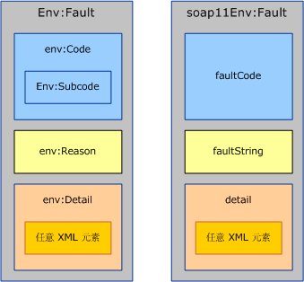
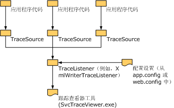

# <a name="handling-exceptions-and-faults"></a>处理异常和错误
异常用来在服务或客户端实现中在本地传达错误， 而错误则用来跨服务边界传达错误，如在服务器与客户端之间传达。 除了错误以外，传输通道也常常使用传输特定的机制来传达传输级错误。 例如，HTTP 传输机制使用状态码（如 404）来传达不存在的终结点 URL（不存在发回错误的终结点）。 本文档由三部分组成，它们为自定义通道的作者提供指南。 第一部分提供关于何时以及如何定义和引发异常的指南。 第二部分提供关于生成和使用错误的指南。 第三部分说明如何提供跟踪信息来帮助自定义通道用户对所运行的应用程序进行疑难解答。  
  
## <a name="exceptions"></a>异常  
 在引发异常时需要牢记两件事情：第一，异常的类型必须允许用户编写能对异常做出适当反应的正确代码。 第二，异常必须为用户提供足够的信息，使用户能了解究竟哪里出现了故障，该故障带来的影响以及如何修复该故障。 后面几节提供关于 [!INCLUDE[indigo1](../../../../includes/indigo1-md.md)] 通道的异常类型和消息的指南， “异常的设计准则”文档中也有关于 .NET 中的异常的一般性指南。  
  
### <a name="exception-types"></a>异常类型  
 由通道引发的所有异常都必须是 <xref:System.TimeoutException?displayProperty=nameWithType>、<xref:System.ServiceModel.CommunicationException?displayProperty=nameWithType> 或者是派生自 <xref:System.ServiceModel.CommunicationException> 的类型 （还可能会引发诸如 <xref:System.ObjectDisposedException> 之类的异常，但这仅仅是为了指示调用代码误用了通道。 如果某个通道的使用正确无误，则它只能引发给定的异常）。[!INCLUDE[indigo2](../../../../includes/indigo2-md.md)] 提供了七个派生自 <xref:System.ServiceModel.CommunicationException> 的异常类型，它们设计为供通道使用。 还存在其他从 <xref:System.ServiceModel.CommunicationException> 派生的异常，这些异常设计用于系统的其他部分。 这些异常类型包括：  
  
|异常类型|含义|内部异常的内容|恢复策略|  
|--------------------|-------------|-----------------------------|-----------------------|  
|<xref:System.ServiceModel.AddressAlreadyInUseException>|为进行侦听而指定的终结点地址已在使用。|如果存在，则提供有关引起此异常的传输错误的更多详细信息。 例如， <xref:System.IO.PipeException>, <xref:System.Net.HttpListenerException> 或 <xref:System.Net.Sockets.SocketException>。|请尝试使用其他地址。|  
|<xref:System.ServiceModel.AddressAccessDeniedException>|不允许该进程访问为进行侦听而指定的终结点地址。|如果存在，则提供有关引起此异常的传输错误的更多详细信息。 例如，<xref:System.IO.PipeException> 或 <xref:System.Net.HttpListenerException>。|请尝试使用其他凭据。|  
|<xref:System.ServiceModel.CommunicationObjectFaultedException>|<xref:System.ServiceModel.ICommunicationObject>正在使用处于出错状态 (有关详细信息，请参阅[了解状态更改](../../../../docs/framework/wcf/extending/understanding-state-changes.md))。 请注意，当具有多个挂起调用的对象转变为“出错”状态时，只有一个调用引发与该故障有关的异常，而其余调用都引发 <xref:System.ServiceModel.CommunicationObjectFaultedException>。 引发此异常的原因通常在于，应用程序忽略了某个异常并尝试使用已出错的对象，而在其中使用该对象的线程可能不是捕获原始异常的线程。|如果存在，则提供有关内部异常的详细信息。|新建一个对象。 请注意，根据首先导致 <xref:System.ServiceModel.ICommunicationObject> 出错的原因，可能还需要完成其他工作来进行恢复。|  
|<xref:System.ServiceModel.CommunicationObjectAbortedException>|<xref:System.ServiceModel.ICommunicationObject>正在使用已中止 (有关详细信息，请参阅[了解状态更改](../../../../docs/framework/wcf/extending/understanding-state-changes.md))。 与 <xref:System.ServiceModel.CommunicationObjectFaultedException> 相似，此异常指示应用程序已在该对象上调用了 <xref:System.ServiceModel.ICommunicationObject.Abort%2A>（有可能是从另一个线程调用的），而且该对象会因此而不再可用。|如果存在，则提供有关内部异常的详细信息。|新建一个对象。 请注意，根据首先导致 <xref:System.ServiceModel.ICommunicationObject> 中止的原因，可能还需要完成其他工作来进行恢复。|  
|<xref:System.ServiceModel.EndpointNotFoundException>|目标远程终结点未在进行侦听。 这可能是由于终结点地址的任何部分不正确、无法解析或者终结点已关闭。 这方面的例子有 DNS 错误、队列管理器不可用以及服务未在运行。|内部异常提供通常来自基础传输的详细信息。|请尝试使用其他地址。 或者，对于服务已关闭的情况，发送方可以稍等片刻再重试。|  
|<xref:System.ServiceModel.ProtocolException>|终结点策略中所描述的通信协议在终结点之间不符。 例如，组帧内容类型不匹配或者超过了最大消息大小。|如果存在，则提供有关特定协议错误的更多信息。 例如，如果出错原因是由于超过了 MaxReceivedMessageSize，则 <xref:System.ServiceModel.QuotaExceededException> 为内部异常。|恢复：请确保发送方的协议设置与接收方的协议设置相匹配。 保证这一点的一种方法是，重新导入服务终结点的元数据（策略）并使用所生成的绑定来重新创建通道。|  
|<xref:System.ServiceModel.ServerTooBusyException>|远程终结点正在侦听，但不准备处理消息。|如果存在，则该内部异常提供有关 SOAP 错误或传输级错误的详细信息。|恢复：请稍等片刻再重试该操作。|  
|<xref:System.TimeoutException>|该操作未能在超时期限内完成。|可能会提供有关超时的详细信息。|请稍等片刻再重试该操作。|  
  
 只有在该类型所对应的特定恢复策略不同于现有的全部异常类型时，才定义新的异常类型。 如果您非要确定义新的异常类型，则必须从 <xref:System.ServiceModel.CommunicationException> 或其派生类之一来派生该新类型。  
  
### <a name="exception-messages"></a>异常消息  
 异常消息面向用户（而非程序），因此它们应提供足以帮助用户了解和解决问题的信息。 好的异常消息应包括以下三个基本部分：  
  
 所发生的情况。 使用与用户体验相关的术语明确说明问题所在。 例如，“Invalid configuration section”（配置节无效）是糟糕的异常消息。 这会令用户想知道哪个配置节有误以及它为何有误。 改进的邮件将为"Invalid configuration section 节\<customBinding >"。 “Cannot add the transport named myTransport to the binding named myBinding because the binding already has a transport named myTransport”（无法将名为 myTransport 的传输添加到名为 myBinding 的绑定中，因为该绑定已经有一个名为 myTransport 的传输）是较好的消息。 这个消息非常具体，用户可以在应用程序的配置文件中方便地标识该消息中所使用的术语和名称。 但是，仍缺少几个关键部分。  
  
 错误的重要性。 除非该消息明确声明了错误的含义，否则用户很可能想知道它是否为致命错误，或者是否可以忽略它。 通常，消息中应首先声明错误的含义或重要性。 为了改善上面的示例，可以将消息改为“ServiceHost failed to Open due to a configuration error: Cannot add the transport named myTransport to the binding named myBinding because the binding already has a transport named myTransport”（ServiceHost 因配置错误而未能打开: 无法将名为 myTransport 的传输添加到名为 myBinding 的绑定中，因为该绑定已经有一个名为 myTransport 的传输）。  
  
 用户应如何更正问题。 消息中最重要部分就是帮助用户修复问题。 消息中应包括为纠正相关问题而需要检查或修复的内容的一些指南或提示。 例如，“ServiceHost failed to Open due to a configuration error: Cannot add the transport named myTransport to the binding named myBinding because the binding already has a transport named myTransport. Please ensure there is only one transport in the binding”（ServiceHost 因配置错误而未能打开: 无法将名为 myTransport 的传输添加到名为 myBinding 的绑定中，因为该绑定已经有一个名为 myTransport 的传输。请确保该绑定中只有一个传输）。  
  
## <a name="communicating-faults"></a>传达错误  
 SOAP 1.1 和 SOAP 1.2 均为错误定义了一个特定的结构。 这两个规范之间存在一些差异，但是，在创建和使用错误时通常使用 Message 和 MessageFault 类型。  
  
   
SOAP 1.2 错误（左）和 SOAP 1.1 错误（右）。 请注意，在 SOAP 1.1 中，只有 Fault 元素受到命名空间的限定。  
  
 SOAP 将错误消息定义为一个仅包含错误元素（名称为 `<env:Fault>` 的元素）的消息，该错误元素作为 `<env:Body>` 的子元素。 错误元素的内容在 SOAP 1.1 和 SOAP 1.2 之间略有不同，如图 1 中所示。 但是，<xref:System.ServiceModel.Channels.MessageFault?displayProperty=nameWithType> 类会将这些差异标准化到一个对象模型中：  
  
```  
public abstract class MessageFault  
{  
    protected MessageFault();  
  
    public virtual string Actor { get; }  
    public virtual string Node { get; }  
    public static string DefaultAction { get; }  
    public abstract FaultCode Code { get; }  
    public abstract bool HasDetail { get; }  
    public abstract FaultReason Reason { get; }  
  
    public T GetDetail<T>();  
    public T GetDetail<T>( XmlObjectSerializer serializer);  
    public System.Xml.XmlDictionaryReader GetReaderAtDetailContents();  
  
    // other methods omitted  
}  
```  
  
 `Code` 属性对应于 `env:Code`（或 SOAP 1.1 中的 `faultCode`），可用来标识错误的类型。 SOAP 1.2 定义了五个 `faultCode` 所允许的值（例如，Sender（发送方）和 Receiver（接收方）），并定义了一个可以包含任何子代码值的 `Subcode` 元素 (请参阅[SOAP 1.2 规范](http://go.microsoft.com/fwlink/?LinkId=95176)有关允许的错误代码及其含义的列表。)SOAP 1.1 具有略微不同的机制：它定义了四个 `faultCode` 值（例如，Client（客户端）和 Server（服务器）），这些值可以通过定义全新的值来扩展，也可以通过使用点表示法来创建更具体的 `faultCodes`（例如，Client.Authentication）。  
  
 在使用 MessageFault 对错误进行编程时，FaultCode.Name 和 FaultCode.Namespace 会映射到 `env:Code`（在 SOAP 1.2 中）或 `faultCode`（在 SOAP 1.1 中）的名称和命名空间。 FaultCode.SubCode 会映射到 `env:Subcode`（在 SOAP 1.2 中）或为 null（在 SOAP 1.1 中）。  
  
 如果想要以编程方式区分某个错误，则应创建新的错误子代码（如果使用的是 SOAP 1.1，则应创建新的错误代码）。 这与创建新的异常类型相似。 应避免在 SOAP 1.1 错误代码中使用点表示法 ( [WS-我的基本配置文件](http://go.microsoft.com/fwlink/?LinkId=95177)还不鼓励使用错误代码点表示法。)  
  
```  
public class FaultCode  
{  
    public FaultCode(string name);  
    public FaultCode(string name, FaultCode subCode);  
    public FaultCode(string name, string ns);  
    public FaultCode(string name, string ns, FaultCode subCode);  
  
    public bool IsPredefinedFault { get; }  
    public bool IsReceiverFault { get; }  
    public bool IsSenderFault { get; }  
    public string Name { get; }  
    public string Namespace { get; }  
    public FaultCode SubCode { get; }  
  
//  methods omitted  
  
}  
```  
  
 `Reason` 属性对应于 `env:Reason`（在 SOAP 1.1 中为 `faultString`），这是关于错误条件的可读说明，与异常消息相似。 `FaultReason` 类（和 SOAP `env:Reason/faultString`）对于为实现全球化而提供多种翻译具有内置的支持。  
  
```  
public class FaultReason  
{  
    public FaultReason(FaultReasonText translation);  
    public FaultReason(IEnumerable<FaultReasonText> translations);  
    public FaultReason(string text);  
  
    public SynchronizedReadOnlyCollection<FaultReasonText> Translations   
    {   
       get;   
    }  
  
 }  
```  
  
 错误详细信息内容公开在 MessageFault 上借助于各种方法包括`GetDetail` \<T > 和`GetReaderAtDetailContents`（)。 错误详细信息是一个不透明的元素，其中包含有关错误的附加详细信息。 如果您希望错误中包含一些任意的结构化详细信息，则这非常有用。  
  
### <a name="generating-faults"></a>生成错误  
 本节介绍为响应在通道中或通道所创建的消息属性中检测到的错误条件而生成错误的过程。 典型的示例是发回错误以响应包含无效数据的请求消息。  
  
 在生成错误时，自定义通道不应直接发送错误，而是应引发异常，并让上一层决定是否将该异常转换为错误以及如何发送它。 为了帮助进行此转换，该通道应提供一个 `FaultConverter` 实现，以便可以将自定义通道所引发的异常转换为相应的错误。 `FaultConverter` 定义为：  
  
```  
public class FaultConverter  
{  
    public static FaultConverter GetDefaultFaultConverter(  
                                   MessageVersion version);  
    protected abstract bool OnTryCreateFaultMessage(  
                                   Exception exception,   
                                   out Message message);  
    public bool TryCreateFaultMessage(  
                                   Exception exception,   
                                   out Message message);  
}  
```  
  
 用来生成自定义错误的每个通道都必须实现 `FaultConverter` 并通过调用 `GetProperty<FaultConverter>` 来返回它。 自定义 `OnTryCreateFaultMessage` 实现必须将异常转换为错误或者将异常委托给内部通道的 `FaultConverter`。 如果该通道是传输通道，则该实现要么必须转换异常，要么必须将异常委托给编码器的 `FaultConverter` 或者委托给 `FaultConverter` 中提供的默认 [!INCLUDE[indigo2](../../../../includes/indigo2-md.md)]。 默认的 `FaultConverter` 会转换与 WS-Addressing 和 SOAP 所指定的错误消息相对应的错误。 下面是一个示例 `OnTryCreateFaultMessage` 实现。  
  
```  
public override bool OnTryCreateFaultMessage(Exception exception,   
                                             out Message message)  
{  
    if (exception is ...)  
    {  
        message = ...;  
        return true;  
    }  
  
#if IMPLEMENTING_TRANSPORT_CHANNEL  
    FaultConverter encoderConverter =   
                    this.encoder.GetProperty<FaultConverter>();  
    if ((encoderConverter != null) &&               
        (encoderConverter.TryCreateFaultMessage(  
         exception, out message)))  
    {  
        return true;  
    }  
  
    FaultConverter defaultConverter =   
                   FaultConverter.GetDefaultFaultConverter(  
                   this.channel.messageVersion);  
    return defaultConverter.TryCreateFaultMessage(  
                   exception,   
                   out message);  
#else  
    FaultConverter inner =   
                   this.innerChannel.GetProperty<FaultConverter>();  
    if (inner != null)  
    {  
        return inner.TryCreateFaultMessage(exception, out message);  
    }  
    else  
    {  
        message = null;  
        return false;  
    }  
#endif  
}  
```  
  
 此模式的含意为，在各层之间针对那些要求错误的错误条件而引发的异常必须包含足够的信息，以使相应的错误生成器能创建正确的错误。 自定义通道的作者可以定义与不同错误条件相对应的异常类型（如果此类异常还不存在）。 请注意，穿越通道层的异常应传达错误条件（而非不透明的错误数据）。  
  
### <a name="fault-categories"></a>错误类别  
 通常有三种类别的错误：  
  
1.  遍布整个堆栈的错误。 在通道堆栈中的任何一层都有可能遇到这些错误（如，InvalidCardinalityAddressingException）。  
  
2.  可能会在堆栈中某层之上的任何一层遇到的错误，例如，与流事务或安全角色相关的某些错误。  
  
3.  针对堆栈中单个层的错误，例如，像 WS-RM 序列号错误之类的错误。  
  
 类别 1。 的错误通常是 WS-Addressing 和 SOAP 错误。 由 `FaultConverter` 提供的基类 [!INCLUDE[indigo2](../../../../includes/indigo2-md.md)] 会转换与 WS-Addressing 和 SOAP 所指定的错误消息相对应的错误，这样您就不必亲自处理对这些异常的转换。  
  
 类别 2。 的错误在以下情况下出现：某个层向消息中添加一个属性，而该消息不完全使用与此层有关的消息信息。 当高层以后请求消息属性进一步处理消息信息时，则可能会检测到错误。 这样的通道应实现以前指定的 `GetProperty`，以使高层可以发回正确的错误。 TransactionMessageProperty 就是这方面的一个示例。 此属性会添加到消息中，而不会完全验证标头中的所有数据（完全验证可能涉及到与分布式事务处理协调器 (DTC) 联系）。  
  
 属于类别 3 的错误仅通过处理器中的单个层来生成和发送。 因此，所有的异常都包含在该层中。 为了提高通道之间的一致性和维护方便性，自定义通道应使用以前指定的模式来生成错误消息，即使对于内部错误也是如此。  
  
### <a name="interpreting-received-faults"></a>解释收到的错误  
 本节提供关于接收错误消息时生成相应异常的指南。 下面是用来在堆栈中的每一层处理消息的决策树：  
  
1.  如果该层认为消息无效，则该层应进行“无效消息”处理。 此类处理特定于该层，但是可以包括丢弃消息、跟踪或引发已转换为错误的异常。 这方面的示例包括对未正确保护的消息的安全接收，或者对序列号有误的消息的 RM 接收。  
  
2.  否则，如果此消息是该层特有的错误消息，而且此消息在该层的交互外部没有意义，则该层应处理错误条件。 这方面的示例包括“RM 序列被拒绝”错误，这类错误对于 RM 通道上方的各层没有意义，表示从挂起操作引发的 RM 通道错误。  
  
3.  否则，该消息应从 Request() 或 Receive() 返回。 这包括如下情况：该层能够识别此错误，但是此错误仅指示请求失败，而不表示从挂起操作引发的通道错误。 若要在类似情况下提高可用性，该层应实现 `GetProperty<FaultConverter>`，并返回一个可以通过重写 `FaultConverter` 将错误转换为异常的 `OnTryCreateException` 派生类。  
  
 下面的对象模型支持将消息转换为异常：  
  
```  
public class FaultConverter  
{  
    public static FaultConverter GetDefaultFaultConverter(  
                                  MessageVersion version);  
    protected abstract bool OnTryCreateException(  
                                 Message message,   
                                 MessageFault fault,   
                                 out Exception exception);  
    public bool TryCreateException(  
                                 Message message,   
                                 MessageFault fault,   
                                 out Exception exception);  
}  
```  
  
 通道层可以实现 `GetProperty<FaultConverter>` 来支持将错误消息转换为异常。 为此，需要重写 `OnTryCreateException` 并检查错误消息。 如果识别出错误消息，请执行转换，否则可以让内部通道转换它。 传输通道应委托给 `FaultConverter.GetDefaultFaultConverter`，以便获取默认的 SOAP/WS-Addressing FaultConverter。  
  
 典型的实现应如下所示：  
  
```  
public override bool OnTryCreateException(  
                            Message message,   
                            MessageFault fault,   
                            out Exception exception)  
{  
    if (message.Action == "...")  
    {  
        exception = ...;  
        return true;  
    }  
    // OR  
    if ((fault.Code.Name == "...") && (fault.Code.Namespace == "..."))  
    {  
        exception = ...;  
        return true;  
    }  
  
    if (fault.IsMustUnderstand)  
    {  
        if (fault.WasHeaderNotUnderstood(  
                   message.Headers, "...", "..."))  
        {  
            exception = new ProtocolException(...);  
            return true;  
        }  
    }  
  
#if IMPLEMENTING_TRANSPORT_CHANNEL  
    FaultConverter encoderConverter =   
              this.encoder.GetProperty<FaultConverter>();  
    if ((encoderConverter != null) &&   
        (encoderConverter.TryCreateException(  
                              message, fault, out exception)))  
    {  
        return true;  
    }  
  
    FaultConverter defaultConverter =  
             FaultConverter.GetDefaultFaultConverter(  
                             this.channel.messageVersion);  
    return defaultConverter.TryCreateException(  
                             message, fault, out exception);  
#else  
    FaultConverter inner =   
                    this.innerChannel.GetProperty<FaultConverter>();  
    if (inner != null)  
    {  
        return inner.TryCreateException(message, fault, out exception);  
    }  
    else  
    {  
        exception = null;  
        return false;  
    }  
#endif  
}  
```  
  
 对于具有不同恢复方案的特定错误条件，请考虑定义 `ProtocolException` 的派生类。  
  
### <a name="mustunderstand-processing"></a>MustUnderstand 处理  
 SOAP 定义一个用于指示接收方未理解必需的标头的通用错误。 此错误称为 `mustUnderstand` 错误。 在 [!INCLUDE[indigo2](../../../../includes/indigo2-md.md)] 中，自定义通道从不生成 `mustUnderstand` 错误， 而是由 [!INCLUDE[indigo2](../../../../includes/indigo2-md.md)] Dispatcher（位于 [!INCLUDE[indigo2](../../../../includes/indigo2-md.md)] 通信堆栈的顶部）来查看基础堆栈是否理解了标记为 MustUndestand=true 的所有标头。 如果均未理解，则此时会生成一个 `mustUnderstand` 错误 （用户可以选择关闭此 `mustUnderstand` 处理，并让应用程序接收所有消息头。 在这种情况下，应用程序负责执行 `mustUnderstand` 处理)。所生成的错误包括一个 NotUnderstood 标头，其中包含未理解且 MustUnderstand=true 的所有标头的名称。  
  
 如果协议通道发送一个 MustUnderstand=true 的自定义标头，并收到一个 `mustUnderstand` 错误，则这个协议通道必须确定该错误是否起因它所发送的标头。 `MessageFault` 类有两个可用来执行此操作的成员：  
  
```  
public class MessageFault  
{  
    ...  
    public bool IsMustUnderstandFault { get; }  
    public static bool WasHeaderNotUnderstood(MessageHeaders headers,   
        string name, string ns) { }  
    ...  
  
}  
```  
  
 如果故障是 `IsMustUnderstandFault` 故障，`true` 返回 `mustUnderstand`。 如果具有指定名称和命名空间的标头以 NotUnderstood 标头的形式包括在该错误中，则 `WasHeaderNotUnderstood` 将返回 `true`。  否则，它将返回 `false`。  
  
 如果某个通道发出一个带有 MustUnderstand = true 标记的标头，则该层还应实现异常生成 API 模式，而且应按照前面的说明将该头所引起的 `mustUnderstand` 错误转换为更为有用的异常。  
  
## <a name="tracing"></a>跟踪  
 .NET Framework 提供了一种用来跟踪程序执行情况的机制，使用此机制，可以在无法简单地附加一个调试器并逐句通过代码时帮助诊断成品应用程序或中间问题。 此机制的核心组件位于 <xref:System.Diagnostics?displayProperty=nameWithType> 命名空间中，此机制中包含下列组件：  
  
-   <xref:System.Diagnostics.TraceSource?displayProperty=nameWithType>（要写入的跟踪信息的源）、<xref:System.Diagnostics.TraceListener?displayProperty=nameWithType>（具体侦听器的抽象基类，具体侦听器接收要从 <xref:System.Diagnostics.TraceSource> 跟踪的信息并将其输出到侦听器特定的目标， 例如，<xref:System.Diagnostics.XmlWriterTraceListener> 将跟踪信息输出到 XML 文件中。) 以及 <xref:System.Diagnostics.TraceSwitch?displayProperty=nameWithType>（允许应用程序用户控制跟踪的详细级别，通常在配置中指定）。  
  
-   除了的核心组件，你可以使用[服务跟踪查看器工具 (SvcTraceViewer.exe)](../../../../docs/framework/wcf/service-trace-viewer-tool-svctraceviewer-exe.md)来查看和搜索[!INCLUDE[indigo2](../../../../includes/indigo2-md.md)]跟踪。 该工具专门设计用于由 [!INCLUDE[indigo2](../../../../includes/indigo2-md.md)] 生成且借助于 <xref:System.Diagnostics.XmlWriterTraceListener> 写出的跟踪文件。 下图演示了跟踪中涉及到的各种组件。  
  
   
  
### <a name="tracing-from-a-custom-channel"></a>从自定义通道跟踪  
 自定义通道应写出跟踪消息，以便在无法向正在运行的应用程序附加调试器时帮助诊断问题。 这涉及到两个高级任务：实例化 <xref:System.Diagnostics.TraceSource> 和调用其方法来写入跟踪。  
  
 在实例化 <xref:System.Diagnostics.TraceSource> 时，所指定的字符串将成为该源的名称。 此名称用来配置（启用/禁用/设置跟踪级别）跟踪源。 此名称还显示在跟踪输出本身当中。 自定义通道应使用唯一的源名称来帮助该跟踪输出的读取器了解跟踪信息的出处。 常见的做法是将正在写入信息的程序集的名称用作跟踪源的名称。 例如，[!INCLUDE[indigo2](../../../../includes/indigo2-md.md)] 将 System.ServiceModel 用作从 System.ServiceModel 程序集写入的信息的跟踪源。  
  
 有了跟踪源之后，就可以调用它的 <xref:System.Diagnostics.TraceSource.TraceData%2A>、<xref:System.Diagnostics.TraceSource.TraceEvent%2A> 或 <xref:System.Diagnostics.TraceSource.TraceInformation%2A> 方法将跟踪项写入跟踪侦听器。 对于所写入的每个跟踪项，需要将事件归为 <xref:System.Diagnostics.TraceEventType> 中所定义的事件类型之一。 是否将跟踪项输出到侦听器取决于该分类以及配置中的跟踪级别设置。 例如，如果将配置中的跟踪级别设置为 `Warning`，则将允许写入 `Warning`、`Error` 和 `Critical` 跟踪项，但会阻止 Information（信息）和 Verbose（详细）项。 下面的示例关于在 Information（信息）级别实例化跟踪源和写出项：  
  
```  
using System.Diagnostics;  
//...  
TraceSource udpSource=new TraceSource("Microsoft.Samples.Udp");  
//...  
udpsource.TraceInformation("UdpInputChannel received a message");  
```  
  
> [!IMPORTANT]
>  强烈建议您指定一个对于自定义通道保持唯一的跟踪源名称，以帮助跟踪输出读取器了解该输出的出处。  
  
#### <a name="integrating-with-the-trace-viewer"></a>与跟踪查看器集成  
 由您的通道生成的跟踪可能会通过可读格式输出[服务跟踪查看器工具 (SvcTraceViewer.exe)](../../../../docs/framework/wcf/service-trace-viewer-tool-svctraceviewer-exe.md)使用<xref:System.Diagnostics.XmlWriterTraceListener?displayProperty=nameWithType>作为跟踪侦听器。 此操作无需由通道开发人员来执行， 而是应由应用程序用户（或者对应用程序进行疑难解答的人员）在应用程序的配置文件中配置该跟踪侦听器。 例如，下面的配置将 <xref:System.ServiceModel?displayProperty=nameWithType> 和 `Microsoft.Samples.Udp` 中的跟踪信息均输出到名为 `TraceEventsFile.e2e` 的文件中：  
  
```xml  
<configuration>  
  <system.diagnostics>  
    <sources>  
      <!-- configure System.ServiceModel trace source -->  
      <source name="System.ServiceModel" switchValue="Verbose"   
              propagateActivity="true">  
        <listeners>  
          <add name="e2e" />  
        </listeners>  
      </source>  
      <!-- configure Microsoft.Samples.Udp trace source -->  
      <source name="Microsoft.Samples.Udp" switchValue="Verbose" >  
        <listeners>  
          <add name="e2e" />  
        </listeners>  
      </source>  
    </sources>  
    <!--   
    Define a shared trace listener that outputs to TraceFile.e2e  
    The listener name is e2e   
    -->  
    <sharedListeners>  
      <add name="e2e" type="System.Diagnostics.XmlWriterTraceListener"  
        initializeData=".\TraceFile.e2e"/>  
    </sharedListeners>  
    <trace autoflush="true" />  
  </system.diagnostics>  
</configuration>  
```  
  
#### <a name="tracing-structured-data"></a>跟踪结构化数据  
 <xref:System.Diagnostics.TraceSource?displayProperty=nameWithType> 具有一个 <xref:System.Diagnostics.TraceSource.TraceData%2A> 方法，该方法采用一个或多个要包括在跟踪项中的对象。 通常，会在每个对象上调用 <xref:System.Object.ToString%2A?displayProperty=nameWithType> 方法，而且所生成的字符串会作为跟踪项的一部分来写入。 在使用 <xref:System.Diagnostics.XmlWriterTraceListener?displayProperty=nameWithType> 来输出跟踪内容时，可以将 <xref:System.Xml.XPath.IXPathNavigable?displayProperty=nameWithType> 作为数据对象传递给 <xref:System.Diagnostics.TraceSource.TraceData%2A>。 所生成的跟踪项包括由 <xref:System.Xml.XPath.XPathNavigator?displayProperty=nameWithType> 提供的 XML。 下面是 XML 应用程序数据的示例项：  
  
```xml  
<E2ETraceEvent xmlns="http://schemas.microsoft.com/2004/06/E2ETraceEvent">  
  <System xmlns="...">  
    <EventID>12</EventID>  
    <Type>3</Type>  
    <SubType Name="Information">0</SubType>  
    <Level>8</Level>  
    <TimeCreated SystemTime="2006-01-13T22:58:03.0654832Z" />  
    <Source Name="Microsoft.ServiceModel.Samples.Udp" />  
    <Correlation ActivityID="{00000000-0000-0000-0000-000000000000}" />  
    <Execution  ProcessName="UdpTestConsole"   
                ProcessID="3348" ThreadID="4" />  
    <Channel />  
    <Computer>COMPUTER-LT01</Computer>  
  </System>  
<!-- XML application data -->  
  <ApplicationData>  
  <TraceData>  
   <DataItem>  
   <TraceRecord   
     Severity="Information"  
     xmlns="…">  
        <TraceIdentifier>some trace id</TraceIdentifier>  
        <Description>EndReceive called</Description>  
        <AppDomain>UdpTestConsole.exe</AppDomain>  
        <Source>UdpInputChannel</Source>  
      </TraceRecord>  
    </DataItem>  
  </TraceData>  
  </ApplicationData>  
</E2ETraceEvent>  
```  
  
 [!INCLUDE[indigo2](../../../../includes/indigo2-md.md)] 跟踪查看器理解上面所演示的 `TraceRecord` 元素的架构，并从其子元素中提取数据，然后将提取的数据以表格形式显示。 在跟踪结构化应用程序数据以帮助 Svctraceviewer.exe 用户读取数据时，通道应使用此架构。
