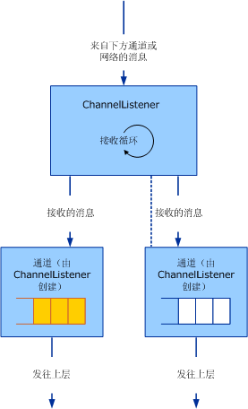

# <a name="service-channel-listeners-and-channels"></a>服务： 通道侦听器和通道

有三个类别的通道对象： 通道、 通道侦听器和通道工厂。 通道是应用程序和通道堆栈之间的接口。 通道侦听器负责在接收（即侦听）端创建通道，这通常是为了响应新传入的消息或连接。 通道工厂负责在发送端创建通道，以便启动与终结点的通信。

## <a name="channel-listeners-and-channels"></a>通道侦听器和通道

通道侦听器负责创建通道并从下面的层或者从网络接收消息。 收到的消息将借助于通道侦听器所创建的通道传送到上面的层中。

下面的关系图阐释了接收消息并将其传送到上面的层的过程。



通道侦听器接收消息并借助于通道将收到的消息传送到上面的层。

该过程在概念上可建模为每个通道中的一个队列，尽管在具体实现中可能并不实际使用队列。 通道侦听器负责从下面的层或者从网络接收消息，并将收到的消息放入队列。 通道负责从队列中获取消息，并在上面的层请求消息（例如通过对通道调用 `Receive`）时将收到的消息传送到该层。

WCF 为此过程提供基类帮助器。 (在本文中讨论的通道帮助器类的一个关系图，请参阅[通道模型概述](channel-model-overview.md)。)

- <xref:System.ServiceModel.Channels.CommunicationObject>类实现<xref:System.ServiceModel.ICommunicationObject>并强制执行的步骤 2 中所述的状态机[开发通道](developing-channels.md)。

- <xref:System.ServiceModel.Channels.ChannelManagerBase> 类实现 <xref:System.ServiceModel.Channels.CommunicationObject> 并为 <xref:System.ServiceModel.Channels.ChannelFactoryBase> 和 <xref:System.ServiceModel.Channels.ChannelListenerBase> 提供统一的基类。 <xref:System.ServiceModel.Channels.ChannelManagerBase> 类与 <xref:System.ServiceModel.Channels.ChannelBase>（用来实现 <xref:System.ServiceModel.Channels.IChannel> 的基类）结合使用。

- <xref:System.ServiceModel.Channels.ChannelFactoryBase>类实现<xref:System.ServiceModel.Channels.ChannelManagerBase>并<xref:System.ServiceModel.Channels.IChannelFactory>并将合并`CreateChannel`成一个重载`OnCreateChannel`抽象方法。

- <xref:System.ServiceModel.Channels.ChannelListenerBase> 类实现 <xref:System.ServiceModel.Channels.IChannelListener>。 它负责执行基本状态管理。

下面的讨论基于[传输： UDP](../../../../docs/framework/wcf/samples/transport-udp.md)示例。

## <a name="creating-a-channel-listener"></a>创建通道侦听器

`UdpChannelListener`该示例实现派生自<xref:System.ServiceModel.Channels.ChannelListenerBase>类。 它使用单个 UDP 套接字来接收数据报。 `OnOpen` 方法使用该 UDP 套接字以异步循环形式接收数据。 收到的数据随后将借助于消息编码系统转换为消息：

```csharp
message = UdpConstants.MessageEncoder.ReadMessage(
  new ArraySegment<byte>(buffer, 0, count),
  bufferManager
);
```

由于可以用同一个数据报通道来表示来自多个源的消息，因此 `UdpChannelListener` 是一个单一实例侦听器。 最多一个活动没有<xref:System.ServiceModel.Channels.IChannel>一次与此侦听器相关联。 只有当随后释放了由 <xref:System.ServiceModel.Channels.ChannelListenerBase%601.AcceptChannel%2A> 方法返回的通道时，该示例才生成另一个通道。 收到一条消息后，它是此单一实例通道中的排队。

### <a name="udpinputchannel"></a>UdpInputChannel

`UdpInputChannel` 类实现 <xref:System.ServiceModel.Channels.IInputChannel>。 该类包括一个传入消息队列，该队列由 `UdpChannelListener` 的套接字来填充。 这些消息可以由 <xref:System.ServiceModel.Channels.IInputChannel.Receive%2A> 方法取消排队。
