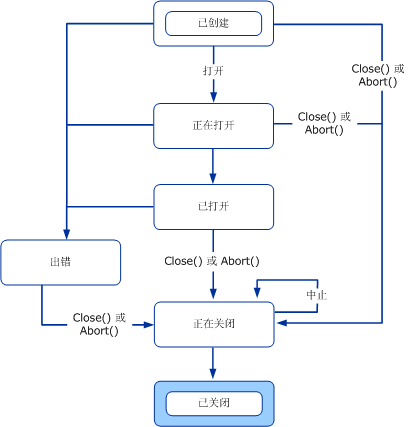
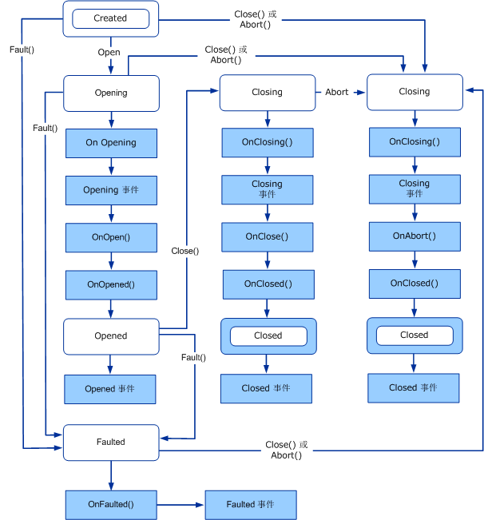
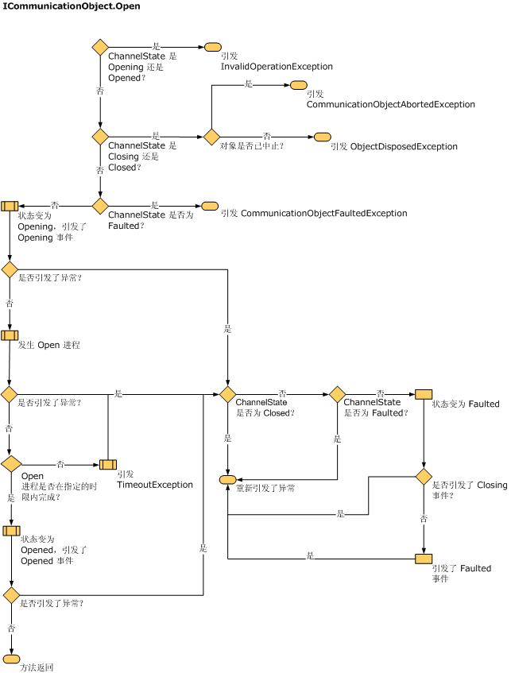
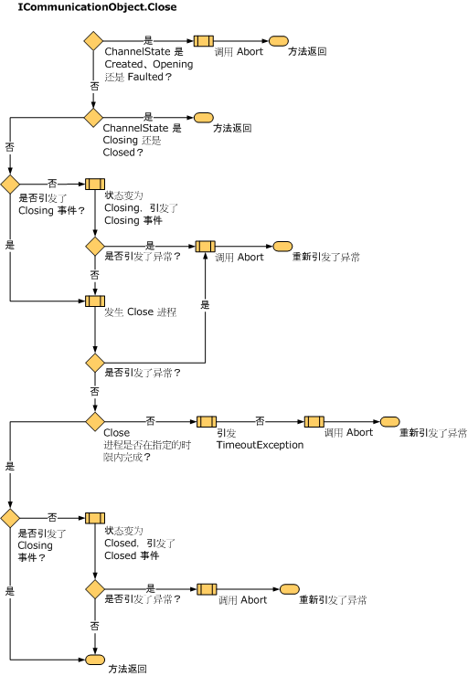
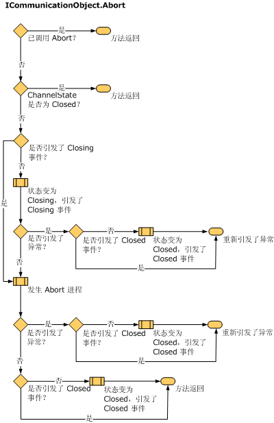

# 了解状态更改
本节讨论的内容包括通道具有的状态和转换、用于结构通道状态的类型以及实现它们的方式。  
  
## 状态机和通道  
 处理通信的对象（例如套接字）通常提供一个状态机，其状态转换与分配网络资源、生成或接受连接、关闭连接以及终止通信有关。 通道状态机提供通信对象状态的统一模型，用于抽象该对象的基础实现。 <xref:System.ServiceModel.ICommunicationObject> 接口提供一组状态、状态转换方法和状态转换事件。 所有通道、通道工厂和通道侦听器都实现通道状态机。  
  
 Closed、Closing、Faulted、Opened 和 Opening 事件在发生状态转换后向外部观察者发出信号。  
  
 Abort、Close 和 Open 方法（以及它们的异步等效方法）产生状态转换。  
  
 状态属性返回如 <xref:System.ServiceModel.CommunicationState> 所定义的当前状态：  
  
## ICommunicationObject、CommunicationObject 和状态及状态转换  
 <xref:System.ServiceModel.ICommunicationObject> 的初始状态是“已创建”，此时可以配置它的各种属性。 一旦处于“已打开”状态，对象就可用于发送和接收消息，但它的属性将视为不可变。 一旦处在“正在关闭”状态，对象就不能再处理新的发送或接收请求，但在到达“关闭”超时前有可能完成现有的请求。  如果发生不可恢复的错误，则对象将转换到“出错”状态，此时可以检查该对象以获取有关错误的信息，该对象最终将关闭。 处于“已关闭”状态时，该对象实质上已到达状态机的终点。 对象一旦从一个状态转换到下一个状态，它将不会返回至前一状态。  
  
 下面的关系图演示 <xref:System.ServiceModel.ICommunicationObject> 状态和状态转换。 状态转换可能引起调用三种方法之一：Abort、 Open 或关闭。 通过调用其他特定于实现的方法也会导致状态转换。 转换至“出错”状态可能是因为在打开通信对象过程中或在打开通信对象之后发生了错误。  
  
 每个 <xref:System.ServiceModel.ICommunicationObject> 的初始状态都是“已创建”。 在此状态下，应用程序可以通过设置对象的属性来配置对象。 一旦对象所处的状态不是“已创建”，它将被视为不可变。  
  
   
图 1。 ICommunicationObject 状态机。  
  
 Windows Communication Foundation (WCF) 提供了名为的抽象基类<xref:System.ServiceModel.Channels.CommunicationObject>实现<xref:System.ServiceModel.ICommunicationObject>和通道状态机。 下图是特定于 <xref:System.ServiceModel.Channels.CommunicationObject> 的已修改状态关系图。 除了 <xref:System.ServiceModel.ICommunicationObject> 状态机，它还显示调用附加 <xref:System.ServiceModel.Channels.CommunicationObject> 方法时的计时。  
  
   
图 2. ICommunicationObject 状态机的 CommunicationObject 实现，包括对事件和受保护方法的调用。  
  
### ICommunicationObject 事件  
 <xref:System.ServiceModel.Channels.CommunicationObject> 公开由 <xref:System.ServiceModel.ICommunicationObject> 定义的五个事件。 这些事件是为使用通信对象接收状态转换通知的代码而设计的。 如上面的图 2 所示，每个事件都在对象的状态转换到按事件命名的状态后激发一次。 五个事件全部属于 `EventHandler` 类型，该类型定义如下：  
  
 `public delegate void EventHandler(object sender, EventArgs e);`  
  
 在 <xref:System.ServiceModel.Channels.CommunicationObject> 实现中，发送方是 <xref:System.ServiceModel.Channels.CommunicationObject> 本身或作为发送方传递至 <xref:System.ServiceModel.Channels.CommunicationObject> 构造函数（如果使用了该构造函数重载）中的任何内容。 EventArgs 参数 `e` 始终为 `EventArgs.Empty`。  
  
### 派生对象回调  
 除了五个事件，<xref:System.ServiceModel.Channels.CommunicationObject> 还声明八个受保护的虚方法，用于在发生状态转换前后回调派生对象。  
  
 <xref:System.ServiceModel.Channels.CommunicationObject.Open%2A?displayProperty=nameWithType> 和 <xref:System.ServiceModel.Channels.CommunicationObject.Close%2A?displayProperty=nameWithType> 方法各自有三个与它们分别相关联的此类回调。 例如，对应于 <xref:System.ServiceModel.Channels.CommunicationObject.Open%2A?displayProperty=nameWithType>，有 <xref:System.ServiceModel.Channels.CommunicationObject.OnOpening%2A?displayProperty=nameWithType>、<xref:System.ServiceModel.Channels.CommunicationObject.OnOpen%2A?displayProperty=nameWithType> 和 <xref:System.ServiceModel.Channels.CommunicationObject.OnOpened%2A?displayProperty=nameWithType>。 与 <xref:System.ServiceModel.Channels.CommunicationObject.Close%2A?displayProperty=nameWithType> 相关联的是 <xref:System.ServiceModel.Channels.CommunicationObject.OnClose%2A?displayProperty=nameWithType>、<xref:System.ServiceModel.Channels.CommunicationObject.OnClosing%2A?displayProperty=nameWithType> 和 <xref:System.ServiceModel.Channels.CommunicationObject.OnClosed%2A?displayProperty=nameWithType> 方法。  
  
 与此类似，<xref:System.ServiceModel.Channels.CommunicationObject.Abort%2A?displayProperty=nameWithType> 方法具有相应的 <xref:System.ServiceModel.Channels.CommunicationObject.OnAbort%2A?displayProperty=nameWithType>。  
  
 <xref:System.ServiceModel.Channels.CommunicationObject.OnOpen%2A?displayProperty=nameWithType>、<xref:System.ServiceModel.Channels.CommunicationObject.OnClose%2A?displayProperty=nameWithType> 和 <xref:System.ServiceModel.Channels.CommunicationObject.OnAbort%2A?displayProperty=nameWithType> 没有默认实现，而其他回调却具有确保状态机正确性所必需的默认实现。 如果重写这些方法，请确保调用基实现或正确替换它。  
  
 <xref:System.ServiceModel.Channels.CommunicationObject.OnOpening%2A?displayProperty=nameWithType>、<xref:System.ServiceModel.Channels.CommunicationObject.OnClosing%2A?displayProperty=nameWithType> 和 <xref:System.ServiceModel.Channels.CommunicationObject.OnFaulted%2A?displayProperty=nameWithType> 激发相应的 <xref:System.ServiceModel.Channels.CommunicationObject.Opening?displayProperty=nameWithType>、<xref:System.ServiceModel.Channels.CommunicationObject.Closing?displayProperty=nameWithType> 和 <xref:System.ServiceModel.Channels.CommunicationObject.Faulted?displayProperty=nameWithType> 事件。 <xref:System.ServiceModel.Channels.CommunicationObject.OnOpened%2A?displayProperty=nameWithType> 和 <xref:System.ServiceModel.Channels.CommunicationObject.OnClosed%2A?displayProperty=nameWithType> 分别将对象状态设置为“已打开”和“已关闭”，然后激发相应的 <xref:System.ServiceModel.Channels.CommunicationObject.Opened?displayProperty=nameWithType> 和 <xref:System.ServiceModel.Channels.CommunicationObject.Closed?displayProperty=nameWithType> 事件。  
  
### 状态转换方法  
 <xref:System.ServiceModel.Channels.CommunicationObject> 提供 Abort、Close 和 Open 的实现。 它还提供 Fault 方法，该方法可以将状态转换至“出错”状态。 图 2 显示的是 <xref:System.ServiceModel.ICommunicationObject> 状态机，其每个转换都是由导致该转换的方法标记的（未标记转换发生在导致上一个标记转换的方法的实现内部）。  
  
> [!NOTE]
>  通信状态获取/设置的所有 <xref:System.ServiceModel.Channels.CommunicationObject> 实现都是线程同步的。  
  
 构造函数  
  
 <xref:System.ServiceModel.Channels.CommunicationObject> 提供三个构造函数，它们都使对象保持“已创建”状态。 构造函数定义如下：  
  
 第一个构造函数是委托给采用对象的构造函数重载的默认构造函数：  
  
 `protected CommunicationObject() : this(new object()) { … }`  
  
 采用对象的构造函数将该参数用作在同步对通信对象状态的访问时锁定的对象：  
  
 `protected CommunicationObject(object mutex) { … }`  
  
 最后，第三个构造函数采用一个在激发 <xref:System.ServiceModel.ICommunicationObject> 事件时用作发送方自变量的附加参数。  
  
 `protected CommunicationObject(object mutex, object eventSender) { … }`  
  
 前两个构造函数将发送方设置为此对象。  
  
 Open 方法  
  
 前置条件：创建状态。  
  
 后置条件：状态为打开或出错。 可能引发异常。  
  
 Open() 方法将尝试打开通信对象，并将状态设置为“已打开”。 如果遇到错误，它会将状态设置为“出错”。  
  
 该方法首先检查当前状态是否是“已创建”。 如果当前状态是“正在打开”或“已打开”，则它将引发 <xref:System.InvalidOperationException>。 在当前状态是“正在关闭”或“已关闭”的情况下，如果对象已终止，则该方法将引发 <xref:System.ServiceModel.CommunicationObjectAbortedException>，否则将引发 <xref:System.ObjectDisposedException>。 如果当前状态是“出错”，则它将引发 <xref:System.ServiceModel.CommunicationObjectFaultedException>。  
  
 然后，它将状态设置为“正在打开”并依次调用 OnOpening()（将引发 Opening 事件）、OnOpen() 和 OnOpened()。 OnOpened() 将状态设置为“已打开”并引发 Opened 事件。 如果这其中有任何一项引发异常，Open() 将调用 Fault() 并使异常向上冒泡。 下面的关系图更详细地演示了“打开”过程。  
  
   
重写 OnOpen 方法以实现自定义打开逻辑，例如，打开内部通信对象。  
  
 Close 方法  
  
 前置条件：无。  
  
 后置条件：状态为已关闭。 可能引发异常。  
  
 Close() 方法可以在任何状态下调用。 它将尝试正常关闭对象。 如果遇到错误，它将终止对象。 如果当前状态为“正在关闭”或“已关闭”，则该方法将不执行任何操作。 否则，它将状态设置为“正在关闭”。 如果初始状态为“已创建”、“正在打开”或“出错”，它将调用 Abort()（请参见下面的关系图）。 如果初始状态为“已打开”，它将依次调用 OnClosing()（将引发 Closing 事件）、OnClose() 和 OnClosed()。 如果这其中有任何一项引发异常，Close() 将调用 Abort() 并使异常向上冒泡。 OnClosed() 将状态设置为“已关闭”并引发 Closed 事件。 下面的关系图更详细地演示了“关闭”过程。  
  
   
重写 OnClose 方法以实现自定义关闭逻辑，例如，关闭内部通信对象。 可能长时间阻塞的所有正常关闭逻辑（例如，等待他方响应）应在 OnClose() 中实现，原因有两个，一是它采用超时参数，二是它不是作为 Abort() 的一部分调用的。  
  
 中止  
  
 前置条件：无。  
后置条件：状态为已关闭。 可能引发异常。  
  
 如果当前状态是“已关闭”或之前已终止对象（例如，可能通过在其他线程上执行 Abort()），则 Abort() 方法将不执行任何操作。 否则，它将状态设置为“正在关闭”并依次调用 OnClosing()（将引发 Closing 事件）、OnAbort() 和 OnClosed()（因为是正在终止对象而非关闭，所以不调用 OnClose）。 OnClosed() 将状态设置为“已关闭”并引发 Closed 事件。 如果这其中的任何一项引发异常，它都将被重新引发至 Abort 的调用方。 OnClosing()、OnClosed() 和 OnAbort() 的实现不应阻塞（例如，在输入/输出上）。 下面的关系图更详细地演示了“中止”过程。  
  
   
重写 OnAbort 方法以实现自定义终止逻辑，例如，终止内部通信对象。  
  
 Fault  
  
 Fault 方法特定于 <xref:System.ServiceModel.Channels.CommunicationObject> 且不是 <xref:System.ServiceModel.ICommunicationObject> 接口的一部分。 在此处对其介绍是出于完整性的考虑。  
  
 前置条件：无。  
  
 后置条件：出错状态。 可能引发异常。  
  
 如果当前状态为“出错”或“已关闭”，则 Fault() 方法不执行任何操作。 否则，它将状态设置为“出错”并调用 OnFaulted()（将引发 Faulted 事件）。 如果 OnFaulted 引发异常，则将重新引发它。  
  
### ThrowIfXxx 方法  
 CommunicationObject 具有三个受保护的方法，可以用于在对象处于特定状态时引发异常。  
  
 如果状态为“正在关闭”、“已关闭”或“出错”，则 <xref:System.ServiceModel.Channels.CommunicationObject.ThrowIfDisposed%2A> 将引发异常。  
  
 如果状态不是“已创建”，则 <xref:System.ServiceModel.Channels.CommunicationObject.ThrowIfDisposedOrImmutable%2A> 将引发异常。  
  
 如果状态不是“已打开”，则 <xref:System.ServiceModel.Channels.CommunicationObject.ThrowIfDisposedOrNotOpen%2A> 将引发异常。  
  
 根据状态引发异常。 下表显示不同的状态以及通过调用在该状态引发的 ThrowIfXxx 所引发的相应异常类型。  
  
|状态|已调用 Abort？|例外|  
|-----------|----------------------------|---------------|  
|创建时间|不适用|<xref:System.InvalidOperationException?displayProperty=nameWithType>|  
|正在打开|不适用|<xref:System.InvalidOperationException?displayProperty=nameWithType>|  
|已打开|不适用|<xref:System.InvalidOperationException?displayProperty=nameWithType>|  
|Closing|是|<xref:System.ServiceModel.CommunicationObjectAbortedException?displayProperty=nameWithType>|  
|Closing|否|<xref:System.ObjectDisposedException?displayProperty=nameWithType>|  
|Closed|是|如果通过前一个对 Abort 的显式调用来关闭对象，将引发 <xref:System.ServiceModel.CommunicationObjectAbortedException?displayProperty=nameWithType>。 如果对对象调用 Close，将引发 <xref:System.ObjectDisposedException?displayProperty=nameWithType>。|  
|Closed|否|<xref:System.ObjectDisposedException?displayProperty=nameWithType>|  
|已出错|不适用|<xref:System.ServiceModel.CommunicationObjectFaultedException?displayProperty=nameWithType>|  
  
### 超时  
 在我们讨论的方法中，有一些方法采用超时参数。 它们是 Close、Open（某些重载和异步版本）、OnClose 和 OnOpen。 这些方法旨在允许长时间的操作（例如，在正常断开连接时阻塞输入/输出），以使超时参数指示此类操作在被中断前要耗费多长时间。 任何此类方法的实现都应使用提供的超时值，以此确保它在超时之前返回至调用方。 其他不采用超时的方法的实现不适用于长时间的操作，不应阻塞输入/输出。  
  
 但是不采用超时的 Open() 和 Close() 重载除外。 它们使用由派生类提供的默认超时值。 <xref:System.ServiceModel.Channels.CommunicationObject>公开两个名为 <xref:System.ServiceModel.Channels.CommunicationObject.DefaultCloseTimeout%2A> 和 <xref:System.ServiceModel.Channels.CommunicationObject.DefaultOpenTimeout%2A> 的受保护抽象属性，定义如下：  
  
 `protected abstract TimeSpan DefaultCloseTimeout { get; }`  
  
 `protected abstract TimeSpan DefaultOpenTimeout { get; }`  
  
 派生类实现这些属性来为不采用超时值的 Open() 和 Close() 重载提供默认超时。 然后，Open() 和 Close() 实现委托给采用超时为它传递默认超时值的重载，例如：  
  
 `public void Open()`  
  
 `{`  
  
 `this.Open(this.DefaultOpenTimeout);`  
  
 `}`  
  
#### IDefaultCommunicationTimeouts  
 该接口有四个用于为 open、send、receive 和 close 提供默认超时值的只读属性。 每个实现都负责以任何适当的方式获取默认值。 为方便起见，<xref:System.ServiceModel.Channels.ChannelFactoryBase> 和 <xref:System.ServiceModel.Channels.ChannelListenerBase> 默认将这些值中的每个值都设置为 1 分钟。
