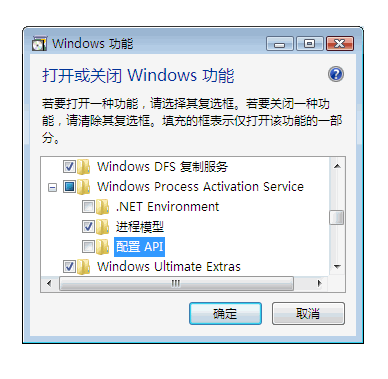
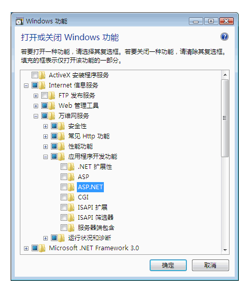
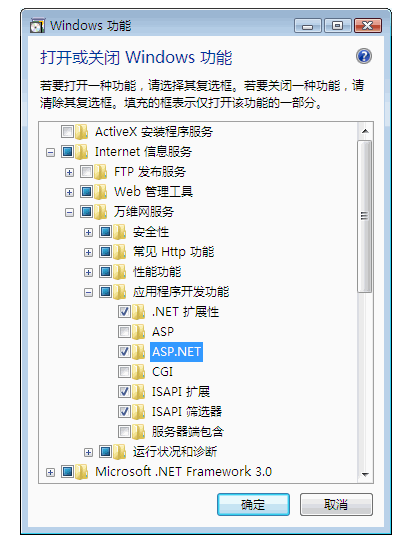
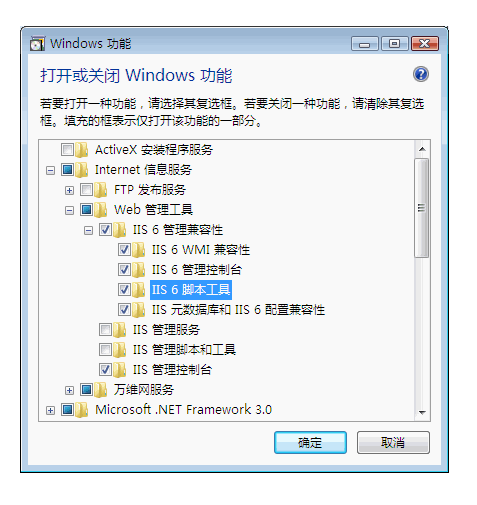

# 为 Windows Communication Foundation 配置 Internet Information Services 7.0
Internet Information Services (IIS) 7.0 具有模块化设计，允许有选择地安装需要的组件。 此设计基于在 [!INCLUDE[wv](../../../../includes/wv-md.md)] 中引入的新清单驱动的组件化技术。 [!INCLUDE[iisver](../../../../includes/iisver-md.md)] 有 40 多个独立功能组件可以独立安装。 这使 IT 专业人士能够轻松地按需要自定义安装。 本主题讨论如何配置 [!INCLUDE[iisver](../../../../includes/iisver-md.md)] 以便与 [!INCLUDE[indigo1](../../../../includes/indigo1-md.md)] 一起使用，以及如何确定所需的组件。  
  
## 最小安装：安装 WAS  
 整个 [!INCLUDE[iisver](../../../../includes/iisver-md.md)] 软件包的最小安装是安装 Windows Process Activation Service (WAS)。 WAS 是一种独立的功能，是 [!INCLUDE[iisver](../../../../includes/iisver-md.md)] 中唯一可用于所有 [!INCLUDE[wv](../../../../includes/wv-md.md)] 操作系统（Home Basic、Home Premium、Business 以及 Ultimate 和 Enterprise）的功能。  
  
 从控制面板中，单击**程序**，然后单击**打开或关闭 Windows 功能**下面列出**程序和功能**，WAS 组件显示在如下图所示的列表。  
  
   
  
 此功能具有下列子组件：  
  
-   .NET Environment  
  
-   配置 API  
  
-   进程模型  
  
 如果选择 WAS 的根节点仅**进程模型**默认选中子节点。 请注意，使用此安装时，你将只安装 WAS，因为没有用于 Web 服务器的支持功能。  
  
 若要使[!INCLUDE[indigo2](../../../../includes/indigo2-md.md)]或任何[!INCLUDE[vstecasp](../../../../includes/vstecasp-md.md)]应用程序，以检查**.NET 环境**复选框。 这意味着需要所有 WAS 组件才能使 [!INCLUDE[indigo2](../../../../includes/indigo2-md.md)] 和 [!INCLUDE[vstecasp](../../../../includes/vstecasp-md.md)] 正常工作。 您安装其中任何组件后，会自动选中这些组件。  
  
## IIS 7.0：默认安装  
 通过检查**Internet Information Services**功能，某些子节点会自动选中下面的插图中所示。  
  
   
  
 这是 [!INCLUDE[iisver](../../../../includes/iisver-md.md)] 的默认安装。 使用此安装时，您可以使用 [!INCLUDE[iisver](../../../../includes/iisver-md.md)] 提供静态内容（如 HTML 页面和其他内容）。 但是，您不能运行 [!INCLUDE[vstecasp](../../../../includes/vstecasp-md.md)] 或 CGI 应用程序，或承载 [!INCLUDE[indigo2](../../../../includes/indigo2-md.md)] 服务。  
  
## IIS 7.0：带 ASP.NET 支持的安装  
 您必须安装 [!INCLUDE[vstecasp](../../../../includes/vstecasp-md.md)] 才能使 [!INCLUDE[vstecasp](../../../../includes/vstecasp-md.md)] 在 IIS 7.0 上正常工作。 在检查后**ASP.NET**，你的屏幕应类似下图。  
  
   
  
 这是使 [!INCLUDE[indigo2](../../../../includes/indigo2-md.md)] 和 [!INCLUDE[vstecasp](../../../../includes/vstecasp-md.md)] 应用程序在 [!INCLUDE[iisver](../../../../includes/iisver-md.md)] 中正常工作的最低环境。  
  
## IIS 7.0：带 IIS 6.0 兼容组件的安装  
 在安装时[!INCLUDE[iisver](../../../../includes/iisver-md.md)]具有 Visual Studio 2005 或某些其他自动化的脚本或工具 （如 Adsutil.vbs) 配置虚拟应用程序使用的系统上[!INCLUDE[iis601](../../../../includes/iis601-md.md)]元数据库 API，一定要检查[!INCLUDE[iis601](../../../../includes/iis601-md.md)] **脚本工具**。 这将自动检查其他子节点[!INCLUDE[iis601](../../../../includes/iis601-md.md)]**管理兼容性**。 下面的插图显示此操作完成后的屏幕。  
  
   
  
 使用此安装时，您具备使用 [!INCLUDE[iisver](../../../../includes/iisver-md.md)]、[!INCLUDE[vstecasp](../../../../includes/vstecasp-md.md)] 和 [!INCLUDE[indigo2](../../../../includes/indigo2-md.md)] 功能以及 Web 上可用的所有示例的一切条件。  
  
## 请求限制  
 在带有 IIS 7 的 [!INCLUDE[wv](../../../../includes/wv-md.md)] 上，`maxUri` 和 `maxQueryStringSize` 设置的默认值均已更改。 默认情况下，IIS 7.0 中的请求筛选功能允许 URL 的长度为 4096 个字符，查询字符串的长度为 2048 个字符。 更改这些默认值，可将以下 XML 添加到 App.config 文件中。  
  
 `<system.webServer>`  
  
 `<security>`  
  
 `<requestFiltering>`  
  
 `<requestLimits maxUrl="8192" maxQueryString="8192" />`  
  
 `</requestFiltering>`  
  
 `</security>`  
  
 `</system.webServer>`  
  
## 请参阅  
 [WAS 激活体系结构](../../../../docs/framework/wcf/feature-details/was-activation-architecture.md)  
 [配置 WAS 以用于 WCF](../../../../docs/framework/wcf/feature-details/configuring-the-wpa--service-for-use-with-wcf.md)  
 [如何：安装和配置 WCF 激活组件](../../../../docs/framework/wcf/feature-details/how-to-install-and-configure-wcf-activation-components.md)  
 [Windows Server App Fabric 承载功能](http://go.microsoft.com/fwlink/?LinkId=201276)
