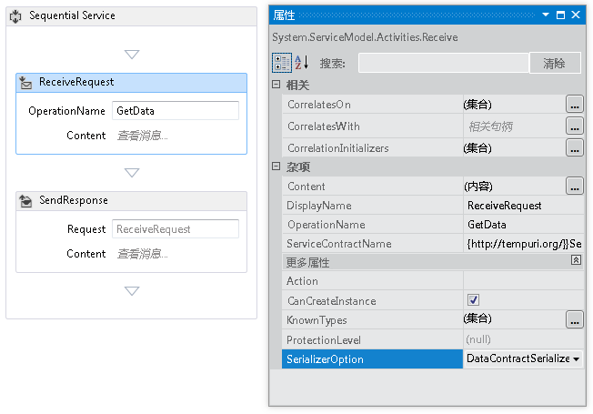
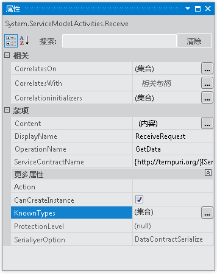
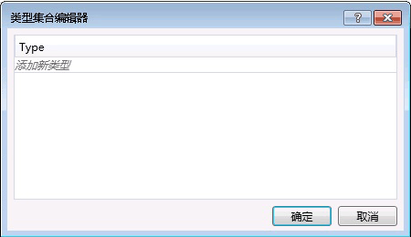

# <a name="configuring-serialization-in-a-workflow-service"></a><span data-ttu-id="e1766-102">配置工作流服务中的序列化</span><span class="sxs-lookup"><span data-stu-id="e1766-102">Configuring Serialization in a Workflow Service</span></span>
<span data-ttu-id="e1766-103">工作流服务是 [!INCLUDE[indigo1](../../../../includes/indigo1-md.md)] 服务，因此可以选择使用 <xref:System.Runtime.Serialization.DataContractSerializer>（默认）或 <xref:System.Xml.Serialization.XmlSerializer>。</span><span class="sxs-lookup"><span data-stu-id="e1766-103">Workflow services are [!INCLUDE[indigo1](../../../../includes/indigo1-md.md)] services and so have the option of using either the <xref:System.Runtime.Serialization.DataContractSerializer> (the default) or the <xref:System.Xml.Serialization.XmlSerializer>.</span></span> <span data-ttu-id="e1766-104">编写非工作流服务时，将在服务或操作协定上指定要使用的序列化程序的类型。</span><span class="sxs-lookup"><span data-stu-id="e1766-104">When writing non-workflow services the type of serializer to use is specified on the service or operation contract.</span></span> <span data-ttu-id="e1766-105">创建 [!INCLUDE[indigo2](../../../../includes/indigo2-md.md)] 工作流服务时，不会在代码中指定这些协定，而是在运行时通过协定推理生成这些协定。</span><span class="sxs-lookup"><span data-stu-id="e1766-105">When creating [!INCLUDE[indigo2](../../../../includes/indigo2-md.md)] workflow services you don’t specify these contracts in code, but rather they are generated at runtime by contract inference.</span></span> [!INCLUDE[crabout](../../../../includes/crabout-md.md)]<span data-ttu-id="e1766-106">协定推理，请参阅[工作流中使用协定](../../../../docs/framework/wcf/feature-details/using-contracts-in-workflow.md)。</span><span class="sxs-lookup"><span data-stu-id="e1766-106"> contract inference, see  [Using Contracts in Workflow](../../../../docs/framework/wcf/feature-details/using-contracts-in-workflow.md).</span></span>  <span data-ttu-id="e1766-107">序列化程序是使用 <xref:System.ServiceModel.Activities.Receive.SerializerOption%2A> 属性指定的。</span><span class="sxs-lookup"><span data-stu-id="e1766-107">The serializer is specified using the <xref:System.ServiceModel.Activities.Receive.SerializerOption%2A> property.</span></span> <span data-ttu-id="e1766-108">这可在设计器中进行设置，如下图所示。</span><span class="sxs-lookup"><span data-stu-id="e1766-108">This can be set in the designer as shown in the following illustration.</span></span>  
  
 <span data-ttu-id="e1766-109"></span><span class="sxs-lookup"><span data-stu-id="e1766-109"></span></span>  
  
 <span data-ttu-id="e1766-110">序列化程序也可在代码中进行设置，如下面的示例所示。</span><span class="sxs-lookup"><span data-stu-id="e1766-110">The serializer can also be set in code as shown in the following example,</span></span>  
  
```  
Receive approveExpense = new Receive  
            {  
                OperationName = "ApproveExpense",  
                CanCreateInstance = true,  
                ServiceContractName = "FinanceService",  
                SerializerOption = SerializerOption.DataContractSerializer,  
                Content = ReceiveContent.Create(new OutArgument<Expense>(expense))  
            };  
```  
  
 <span data-ttu-id="e1766-111">也可在工作流服务上指定已知类型。</span><span class="sxs-lookup"><span data-stu-id="e1766-111">Known types can be specified on Workflow services as well.</span></span> [!INCLUDE[crabout](../../../../includes/crabout-md.md)]<span data-ttu-id="e1766-112">已知类型，请参阅[数据协定已知类型](../../../../docs/framework/wcf/feature-details/data-contract-known-types.md)。</span><span class="sxs-lookup"><span data-stu-id="e1766-112"> Known Types see [Data Contract Known Types](../../../../docs/framework/wcf/feature-details/data-contract-known-types.md).</span></span> <span data-ttu-id="e1766-113">可在设计器或代码中指定已知类型。</span><span class="sxs-lookup"><span data-stu-id="e1766-113">Known types can be specified in the designer or in code.</span></span> <span data-ttu-id="e1766-114">若要在设计器中指定已知类型，请在属性窗口中单击 <xref:System.ServiceModel.Activities.Receive> 活动的 KnownTypes 属性旁边的省略号按钮，如下图所示。</span><span class="sxs-lookup"><span data-stu-id="e1766-114">To specify known types in the designer, click the ellipsis button next to the KnownTypes property in the properties window for a <xref:System.ServiceModel.Activities.Receive> activity as shown in the following illustration.</span></span>  
  
 <span data-ttu-id="e1766-115"></span><span class="sxs-lookup"><span data-stu-id="e1766-115"></span></span>  
  
 <span data-ttu-id="e1766-116">这将显示“类型集合编辑器”，您可以在其中搜索和指定已知类型。</span><span class="sxs-lookup"><span data-stu-id="e1766-116">This will display the Type Collections Editor that will allow you to search for and specify known types.</span></span>  
  
 <span data-ttu-id="e1766-117"></span><span class="sxs-lookup"><span data-stu-id="e1766-117"></span></span>  
  
 <span data-ttu-id="e1766-118">单击**添加新类型**链接，并使用下拉菜单选择或搜索某个类型添加到已知的类型集合。</span><span class="sxs-lookup"><span data-stu-id="e1766-118">Click the **Add new type** link and use the drop down to select or search for a type to add to the known types collection.</span></span> <span data-ttu-id="e1766-119">若要在代码中指定已知类型，请使用 <xref:System.ServiceModel.Activities.Receive.KnownTypes%2A> 属性，如下面的示例所示。</span><span class="sxs-lookup"><span data-stu-id="e1766-119">To specify known types in code use the <xref:System.ServiceModel.Activities.Receive.KnownTypes%2A> property as shown in the following example.</span></span>  
  
```  
Receive approveExpense = new Receive  
            {  
                OperationName = "ApproveExpense",  
                CanCreateInstance = true,  
                ServiceContractName = "FinanceService",  
                SerializerOption = SerializerOption.DataContractSerializer,  
                Content = ReceiveContent.Create(new OutArgument<Expense>(expense))  
            };  
            approveExpense.KnownTypes.Add(typeof(Travel));  
            approveExpense.KnownTypes.Add(typeof(Meal));  
```  
  
 <span data-ttu-id="e1766-120">若要查看完整的代码示例显示如何配置工作流服务的序列化请参阅[设置工作流服务中的消息格式](../../../../docs/framework/windows-workflow-foundation/samples/formatting-messages-in-workflow-services.md)。</span><span class="sxs-lookup"><span data-stu-id="e1766-120">To see a complete code example showing how to configure serialization for a workflow service see [Formatting messages in Workflow Services](../../../../docs/framework/windows-workflow-foundation/samples/formatting-messages-in-workflow-services.md).</span></span>
