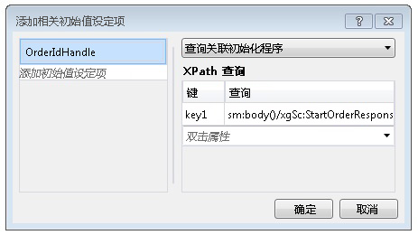

# 基于内容的相关性
当工作流服务与客户端和其他服务通信时，交换的消息中通常包含一些数据，用于以唯一方式使消息和特定实例相关。 基于内容的相关使用消息中的此数据（如客户编号或订单 ID）将消息路由到正确的工作流实例。 本主题说明如何在工作流中使用基于内容的相关。  
  
## 使用基于内容的相关  
 当工作流服务具有多个由单个客户端访问的方法，且交换消息中的一段数据标识了所需实例时，将使用基于内容的相关。  
  
> [!NOTE]
>  当因绑定不是支持的上下文交换绑定之一而导致无法使用上下文相关时，基于内容的相关非常有用。 有关上下文相关的详细信息，请参阅[上下文交换](../../../../docs/framework/wcf/feature-details/context-exchange-correlation.md)。  
  
 这些通信中使用的每个消息传递活动都必须指定唯一标识实例的数据在消息中的位置。 通过提供 <xref:System.ServiceModel.MessageQuerySet>，并使用 <xref:System.ServiceModel.Activities.QueryCorrelationInitializer> 或 <xref:System.ServiceModel.Activities.Receive.CorrelatesOn%2A>（在消息中查询唯一标识实例的一段或几段数据）可以实现此操作。  
  
> [!WARNING]
>  用于标识实例的数据经过哈希运算之后即可成为相关键。 必须小心确保用于相关的数据是唯一的，否则经过哈希运算的键中可能会出现冲突，从而导致错误路由消息。 例如，仅基于客户姓名的相关可能会导致冲突，因为可能存在多个具有相同姓名的客户。 在使消息彼此相关所采用的数据中，不得使用冒号 (`:`)，因为冒号已用于分隔消息查询的键和值以便构成将在随后进行哈希运算的字符串。  
  
 在下面的示例中，初始<xref:System.ServiceModel.Activities.Receive> / <xref:System.ServiceModel.Activities.SendReply>在工作流服务返回`OrderId`，后者再通过客户端重新在以下调用传递<xref:System.ServiceModel.Activities.Receive>工作流服务中的活动。  
  
 [!code-csharp[CFX_ContentCorrelation#1](../../../../samples/snippets/csharp/VS_Snippets_CFX/cfx_contentcorrelation/cs/program.cs#1)]  
  
 上面的示例演示了由 <xref:System.ServiceModel.Activities.SendReply> 初始化的基于内容的相关。 <xref:System.ServiceModel.MessageQuerySet> 指定用于向此服务标识后续消息的数据是 `OrderId`。  
  
 [!code-csharp[CFX_ContentCorrelation#2](../../../../samples/snippets/csharp/VS_Snippets_CFX/cfx_contentcorrelation/cs/program.cs#2)]  
  
 工作流中 <xref:System.ServiceModel.Activities.Receive> 后面的 <xref:System.ServiceModel.Activities.SendReply> 活动遵循由 <xref:System.ServiceModel.Activities.SendReply> 初始化的相关。 这两个活动共享相同的 <xref:System.ServiceModel.Activities.CorrelationHandle>，但每个活动都具有其自己的 <xref:System.ServiceModel.MessageQuerySet> 和 <xref:System.ServiceModel.XPathMessageQuery>，用于指定标识数据在该特定消息中的位置。 在初始化相关的活动中，此 <xref:System.ServiceModel.MessageQuerySet> 在 <xref:System.ServiceModel.Activities.Receive.CorrelationInitializers%2A> 属性中指定，而对于下面的任何 <xref:System.ServiceModel.Activities.Receive> 活动，则使用 <xref:System.ServiceModel.Activities.Receive.CorrelatesOn%2A> 属性指定。  
  
 [!code-csharp[CFX_ContentCorrelation#3](../../../../samples/snippets/csharp/VS_Snippets_CFX/cfx_contentcorrelation/cs/program.cs#3)]  
  
 如果数据作为消息的一部分流动，则可以通过任何消息传递活动（<xref:System.ServiceModel.Activities.Send>、<xref:System.ServiceModel.Activities.Receive>、<xref:System.ServiceModel.Activities.SendReply> 和 <xref:System.ServiceModel.Activities.ReceiveReply>）来初始化基于内容的相关。 如果特定数据段未作为消息的一部分流动，则可以使用 <xref:System.ServiceModel.Activities.InitializeCorrelation> 活动显式初始化该数据段。 如果需要多个数据段来唯一标识消息，则可以向 <xref:System.ServiceModel.MessageQuerySet> 添加多个查询。 在这些示例中，使用 <xref:System.ServiceModel.Activities.CorrelationHandle> 或 `CorrelatesWith` 属性向每个活动显式提供了 `CorrelationHandle`，但是，如果整个工作流只需要一个相关（例如，在此示例中，所有内容都基于 `OrderId` 相关），则 <xref:System.ServiceModel.Activities.WorkflowServiceHost> 提供的隐式相关句柄管理足以满足需求。  
  
## 使用 InitializeCorrelation 活动  
 在上面的示例中，`OrderId` 通过 <xref:System.ServiceModel.Activities.SendReply> 活动流至调用方，该活动是相关的初始化位置。 使用 <xref:System.ServiceModel.Activities.InitializeCorrelation> 活动可以完成相同行为。 <xref:System.ServiceModel.Activities.InitializeCorrelation> 活动采用 <xref:System.ServiceModel.Activities.CorrelationHandle> 和表示将消息映射到正确实例所采用的数据的项字典。 若要在上面示例中使用 <xref:System.ServiceModel.Activities.InitializeCorrelation> 活动，请从 <xref:System.ServiceModel.Activities.SendReply.CorrelationInitializers%2A> 活动中移除 <xref:System.ServiceModel.Activities.SendReply>，并使用 <xref:System.ServiceModel.Activities.InitializeCorrelation> 活动初始化相关。  
  
 [!code-csharp[CFX_ContentCorrelation#4](../../../../samples/snippets/csharp/VS_Snippets_CFX/cfx_contentcorrelation/cs/program.cs#4)]  
  
 然后在工作流中使用 <xref:System.ServiceModel.Activities.InitializeCorrelation> 活动，该活动在工作流中位于保存所填充数据的变量之后，与初始化的 <xref:System.ServiceModel.Activities.Receive> 相关的 <xref:System.ServiceModel.Activities.CorrelationHandle> 活动之前。  
  
 [!code-csharp[CFX_ContentCorrelation#5](../../../../samples/snippets/csharp/VS_Snippets_CFX/cfx_contentcorrelation/cs/program.cs#5)]  
  
## 使用工作流设计器配置 XPath 查询  
 在前面的示例中，消息查询中使用的活动和 XPath 查询都是在代码中指定的。 [!INCLUDE[vs_current_long](../../../../includes/vs-current-long-md.md)] 中的工作流设计器还提供了一种功能，可以根据 `DataContract` 类型为基于内容的相关生成 XPath。 上面示例中配置的第一个 XPath 是为 <xref:System.ServiceModel.Activities.SendReply> 配置的。  
  
 [!code-csharp[CFX_ContentCorrelation#2](../../../../samples/snippets/csharp/VS_Snippets_CFX/cfx_contentcorrelation/cs/program.cs#2)]  
  
 若要为工作流设计器中的消息传递活动配置 XPath，请在工作流设计器中选择该活动。 如果该活动将初始化相关，与前面的示例中，单击省略号按钮**CorrelationInitializers**中的属性**属性**窗口。 此时将显示**添加相关初始值设定项**对话框窗口。 从该对话框中，您可以指定相关类型并选择用于相关的内容。 <xref:System.ServiceModel.Activities.CorrelationHandle>中指定变量**添加初始值设定项**从选择框中的相关类型和用于相关的数据**XPath 查询**的对话框中的部分。  
  
   
  
 上面示例中的第二个 XPath 查询是在 <xref:System.ServiceModel.Activities.Receive> 活动中配置的。  
  
 [!code-csharp[CFX_ContentCorrelation#3](../../../../samples/snippets/csharp/VS_Snippets_CFX/cfx_contentcorrelation/cs/program.cs#3)]  
  
 要配置未初始化相关的消息传递活动的 XPath 查询，在工作流设计器中选择活动，然后单击的省略号按钮**CorrelatesOn**中的属性**属性**窗口。 此时将显示**CorrelatesOn 定义**对话框窗口。  
  
   
  
 从该对话框中，你将指定<xref:System.ServiceModel.Activities.CorrelationHandle>和中选择项**XPath 查询**列表来生成 XPath 查询。
