# <a name="creating-a-long-running-workflow-service"></a><span data-ttu-id="18a0e-102">创建长时间运行的工作流服务</span><span class="sxs-lookup"><span data-stu-id="18a0e-102">Creating a Long-running Workflow Service</span></span>
<span data-ttu-id="18a0e-103">本主题描述如何创建长时间运行的工作流服务。</span><span class="sxs-lookup"><span data-stu-id="18a0e-103">This topic describes how to create a long-running workflow service.</span></span> <span data-ttu-id="18a0e-104">长时间运行的工作流服务可能会运行很长一段时间。</span><span class="sxs-lookup"><span data-stu-id="18a0e-104">Long running workflow services may run for long periods of time.</span></span> <span data-ttu-id="18a0e-105">在某一时刻，工作流可能会转入空闲状态，等待一些附加信息。</span><span class="sxs-lookup"><span data-stu-id="18a0e-105">At some point the workflow may go idle waiting for some additional information.</span></span> <span data-ttu-id="18a0e-106">当这种情况发生时，工作流将保存到 SQL 数据库并从内存中删除。</span><span class="sxs-lookup"><span data-stu-id="18a0e-106">When this occurs the workflow is persisted to a SQL database and is removed from memory.</span></span> <span data-ttu-id="18a0e-107">当附加信息变得可用时，工作流实例将重新加载回内存，继续执行。</span><span class="sxs-lookup"><span data-stu-id="18a0e-107">When the additional information becomes available the workflow instance is loaded back into memory and continues executing.</span></span>  <span data-ttu-id="18a0e-108">在此方案中，您将实现一个非常简化的订单系统。</span><span class="sxs-lookup"><span data-stu-id="18a0e-108">In this scenario you are implementing a very simplified ordering system.</span></span>  <span data-ttu-id="18a0e-109">客户端向工作流服务发送初始消息以启动订单。</span><span class="sxs-lookup"><span data-stu-id="18a0e-109">The client sends an initial message to the workflow service to start the order.</span></span> <span data-ttu-id="18a0e-110">此服务将订单 ID 返回给客户端。</span><span class="sxs-lookup"><span data-stu-id="18a0e-110">It returns an order ID to the client.</span></span> <span data-ttu-id="18a0e-111">此时，工作流服务要等待来自客户端的另一条消息，它转入空闲状态并保存到 SQL Server 数据库。</span><span class="sxs-lookup"><span data-stu-id="18a0e-111">At this point the workflow service is waiting for another message from the client and goes into the idle state and is persisted to a SQL Server database.</span></span>  <span data-ttu-id="18a0e-112">当客户端发送下一条消息订购项目时，工作流服务将重新加载回内存，完成处理此订单。</span><span class="sxs-lookup"><span data-stu-id="18a0e-112">When the client sends the next message to order an item, the workflow service is loaded back into memory and finishes processing the order.</span></span> <span data-ttu-id="18a0e-113">在代码示例中它将返回一个字符串，指示项目已添加到订单中。</span><span class="sxs-lookup"><span data-stu-id="18a0e-113">In the code sample it returns a string stating the item has been added to the order.</span></span> <span data-ttu-id="18a0e-114">代码示例并不是技术的现实应用，而是作为一个简单的示例来说明长时间运行的工作流服务。</span><span class="sxs-lookup"><span data-stu-id="18a0e-114">The code sample is not meant to be a real world application of the technology, but rather a simple sample that illustrates long running workflow services.</span></span> <span data-ttu-id="18a0e-115">本主题假定你知道如何创建 [!INCLUDE[vs_current_long](../../../../includes/vs-current-long-md.md)] 项目和解决方案。</span><span class="sxs-lookup"><span data-stu-id="18a0e-115">This topic assumes you know how to create [!INCLUDE[vs_current_long](../../../../includes/vs-current-long-md.md)] projects and solutions.</span></span>  
  
## <a name="prerequisites"></a><span data-ttu-id="18a0e-116">先决条件</span><span class="sxs-lookup"><span data-stu-id="18a0e-116">Prerequisites</span></span>  
 <span data-ttu-id="18a0e-117">您必须安装了下列软件才能使用本演练：</span><span class="sxs-lookup"><span data-stu-id="18a0e-117">You must have the following software installed to use this walkthrough:</span></span>  
  
1.  <span data-ttu-id="18a0e-118">Microsoft SQL Server 2008</span><span class="sxs-lookup"><span data-stu-id="18a0e-118">Microsoft SQL Server 2008</span></span>  
  
2.  [!INCLUDE[vs_current_long](../../../../includes/vs-current-long-md.md)]  
  
3.  <span data-ttu-id="18a0e-119">Microsoft [!INCLUDE[netfx_current_long](../../../../includes/netfx-current-long-md.md)]</span><span class="sxs-lookup"><span data-stu-id="18a0e-119">Microsoft  [!INCLUDE[netfx_current_long](../../../../includes/netfx-current-long-md.md)]</span></span>  
  
4.  <span data-ttu-id="18a0e-120">您熟悉 WCF 和 [!INCLUDE[vs_current_long](../../../../includes/vs-current-long-md.md)] 并且知道如何创建项目/解决方案。</span><span class="sxs-lookup"><span data-stu-id="18a0e-120">You are familiar with WCF and [!INCLUDE[vs_current_long](../../../../includes/vs-current-long-md.md)] and know how to create projects/solutions.</span></span>  
  
### <a name="to-setup-the-sql-database"></a><span data-ttu-id="18a0e-121">设置 SQL 数据库</span><span class="sxs-lookup"><span data-stu-id="18a0e-121">To Setup the SQL Database</span></span>  
  
1.  <span data-ttu-id="18a0e-122">为了使工作流服务实例能够持久化，您必须安装 Microsoft SQL Server，并配置一个数据库来存储持久化工作流实例。</span><span class="sxs-lookup"><span data-stu-id="18a0e-122">In order for workflow service instances to be persisted you must have Microsoft SQL Server installed and you must configure a database to store the persisted workflow instances.</span></span> <span data-ttu-id="18a0e-123">通过单击运行 Microsoft SQL Management Studio**启动**按钮，选择**所有程序**， **Microsoft SQL Server 2008**，和**Microsoft SQLManagement Studio**。</span><span class="sxs-lookup"><span data-stu-id="18a0e-123">Run Microsoft SQL Management Studio by clicking the **Start** button, selecting **All Programs**, **Microsoft SQL Server 2008**, and **Microsoft SQL Management Studio**.</span></span>  
  
2.  <span data-ttu-id="18a0e-124">单击**连接**按钮以登录到 SQL Server 实例</span><span class="sxs-lookup"><span data-stu-id="18a0e-124">Click the **Connect** button to log on to the SQL Server instance</span></span>  
  
3.  <span data-ttu-id="18a0e-125">右键单击**数据库**在树视图，选择**新数据库...**</span><span class="sxs-lookup"><span data-stu-id="18a0e-125">Right click **Databases** in the tree view and select **New Database..**</span></span> <span data-ttu-id="18a0e-126">若要创建名为的新数据库`SQLPersistenceStore`。</span><span class="sxs-lookup"><span data-stu-id="18a0e-126">to create a new database called `SQLPersistenceStore`.</span></span>  
  
4.  <span data-ttu-id="18a0e-127">在 SQLPersistenceStore 数据库上运行位于 C:\Windows\Microsoft.NET\Framework\v4.0\SQL\en 目录中的 SqlWorkflowInstanceStoreSchema.sql 脚本文件，以设置所需的数据库架构。</span><span class="sxs-lookup"><span data-stu-id="18a0e-127">Run the SqlWorkflowInstanceStoreSchema.sql script file located in the C:\Windows\Microsoft.NET\Framework\v4.0\SQL\en directory on the SQLPersistenceStore database to set up the needed database schemas.</span></span>  
  
5.  <span data-ttu-id="18a0e-128">在 SQLPersistenceStore 数据库上运行位于 C:\Windows\Microsoft.NET\Framework\v4.0\SQL\en 目录中的 SqlWorkflowInstanceStoreLogic.sql 脚本文件，以设置所需的数据库逻辑。</span><span class="sxs-lookup"><span data-stu-id="18a0e-128">Run the SqlWorkflowInstanceStoreLogic.sql script file located in the C:\Windows\Microsoft.NET\Framework\v4.0\SQL\en directory on the SQLPersistenceStore database to set up the needed database logic.</span></span>  
  
### <a name="to-create-the-web-hosted-workflow-service"></a><span data-ttu-id="18a0e-129">创建 Web 承载的工作流服务</span><span class="sxs-lookup"><span data-stu-id="18a0e-129">To Create the Web Hosted Workflow Service</span></span>  
  
1.  <span data-ttu-id="18a0e-130">创建一个空 [!INCLUDE[vs_current_long](../../../../includes/vs-current-long-md.md)] 解决方案并将其命名为 `OrderProcessing`。</span><span class="sxs-lookup"><span data-stu-id="18a0e-130">Create an empty [!INCLUDE[vs_current_long](../../../../includes/vs-current-long-md.md)] solution, name it `OrderProcessing`.</span></span>  
  
2.  <span data-ttu-id="18a0e-131">向该解决方案中添加一个名为 [!INCLUDE[indigo2](../../../../includes/indigo2-md.md)] 的新 `OrderService` 工作流服务应用程序项目。</span><span class="sxs-lookup"><span data-stu-id="18a0e-131">Add a new [!INCLUDE[indigo2](../../../../includes/indigo2-md.md)] Workflow Service Application project called `OrderService` to the solution.</span></span>  
  
3.  <span data-ttu-id="18a0e-132">在项目属性对话框中，选择**Web**选项卡。</span><span class="sxs-lookup"><span data-stu-id="18a0e-132">In the project properties dialog, select the **Web** tab.</span></span>  
  
    1.  <span data-ttu-id="18a0e-133">下**启动操作**选择**特定页**并指定`Service1.xamlx`。</span><span class="sxs-lookup"><span data-stu-id="18a0e-133">Under **Start Action** select **Specific Page** and specify `Service1.xamlx`.</span></span>  
  
         <span data-ttu-id="18a0e-134">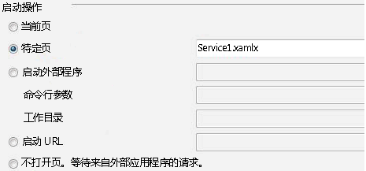</span><span class="sxs-lookup"><span data-stu-id="18a0e-134"></span></span>  
  
    2.  <span data-ttu-id="18a0e-135">下**服务器**选择**使用本地 IIS Web 服务器**。</span><span class="sxs-lookup"><span data-stu-id="18a0e-135">Under **Servers** select **Use Local IIS Web server**.</span></span>  
  
         <span data-ttu-id="18a0e-136">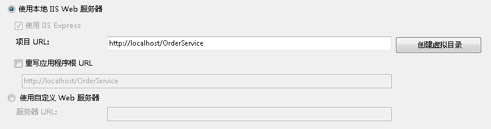</span><span class="sxs-lookup"><span data-stu-id="18a0e-136"></span></span>  
  
        > [!WARNING]
        >  <span data-ttu-id="18a0e-137">您必须在管理员模式下运行 [!INCLUDE[vs_current_long](../../../../includes/vs-current-long-md.md)] 才能进行此设置。</span><span class="sxs-lookup"><span data-stu-id="18a0e-137">You must run [!INCLUDE[vs_current_long](../../../../includes/vs-current-long-md.md)] in administrator mode to make this setting.</span></span>  
  
         <span data-ttu-id="18a0e-138">这两个步骤将工作流服务项目配置为由 IIS 承载。</span><span class="sxs-lookup"><span data-stu-id="18a0e-138">These two steps configure the workflow service project to be hosted by IIS.</span></span>  
  
4.  <span data-ttu-id="18a0e-139">打开`Service1.xamlx`是否不已打开并删除现有**ReceiveRequest**和**SendResponse**活动。</span><span class="sxs-lookup"><span data-stu-id="18a0e-139">Open `Service1.xamlx` if it is not open already and delete the existing **ReceiveRequest** and **SendResponse** activities.</span></span>  
  
5.  <span data-ttu-id="18a0e-140">选择**顺序服务**活动，然后单击**变量**链接，然后添加下图中显示的变量。</span><span class="sxs-lookup"><span data-stu-id="18a0e-140">Select the **Sequential Service** activity and click the **Variables** link and add the variables shown in the following illustration.</span></span> <span data-ttu-id="18a0e-141">通过执行此操作，会添加一些稍后将在工作流服务中使用的变量。</span><span class="sxs-lookup"><span data-stu-id="18a0e-141">Doing this adds some variables that will be used later on in the workflow service.</span></span>  
  
    > [!NOTE]
    >  <span data-ttu-id="18a0e-142">如果 CorrelationHandle 不在变量类型下拉列表中，选择**浏览类型**从下拉列表。</span><span class="sxs-lookup"><span data-stu-id="18a0e-142">If CorrelationHandle is not in the Variable Type drop-down, select **Browse for types** from the drop-down.</span></span> <span data-ttu-id="18a0e-143">键入 CorrelationHandle 中的**类型名称**中，从列表框中选择 CorrelationHandle 并单击**确定**。</span><span class="sxs-lookup"><span data-stu-id="18a0e-143">Type CorrelationHandle in the **Type name** box, select CorrelationHandle from the listbox and click **OK**.</span></span>  
  
     <span data-ttu-id="18a0e-144"></span><span class="sxs-lookup"><span data-stu-id="18a0e-144"></span></span>  
  
6.  <span data-ttu-id="18a0e-145">拖放式**ReceiveAndSendReply**到的活动模板**顺序服务**活动。</span><span class="sxs-lookup"><span data-stu-id="18a0e-145">Drag and drop a **ReceiveAndSendReply** activity template into the **Sequential Service** activity.</span></span> <span data-ttu-id="18a0e-146">这组活动将接收来自客户端的消息，并发送回复。</span><span class="sxs-lookup"><span data-stu-id="18a0e-146">This set of activities will receive a message from a client and send a reply back.</span></span>  
  
    1.  <span data-ttu-id="18a0e-147">选择**接收**活动，并在下图中突出显示的属性的设置。</span><span class="sxs-lookup"><span data-stu-id="18a0e-147">Select the **Receive** activity and set the properties highlighted in the following illustration.</span></span>  
  
         <span data-ttu-id="18a0e-148">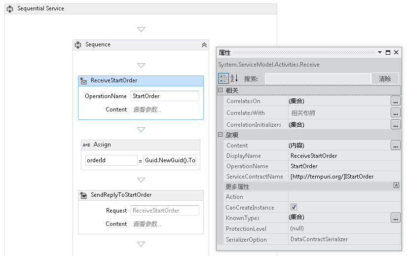</span><span class="sxs-lookup"><span data-stu-id="18a0e-148"></span></span>  
  
         <span data-ttu-id="18a0e-149">DisplayName 属性设置在设计器中显示的 Receive 活动的名称。</span><span class="sxs-lookup"><span data-stu-id="18a0e-149">The DisplayName property sets the name displayed for the Receive activity in the designer.</span></span> <span data-ttu-id="18a0e-150">ServiceContractName 和 OperationName 属性指定 Receive 活动实现的服务协定和操作的名称。</span><span class="sxs-lookup"><span data-stu-id="18a0e-150">The ServiceContractName and OperationName properties specify the name of the service contract and operation that are implemented by the Receive activity.</span></span> [!INCLUDE[crabout](../../../../includes/crabout-md.md)]<span data-ttu-id="18a0e-151">如何在工作流中使用协定服务，请参见[工作流中使用协定](../../../../docs/framework/wcf/feature-details/using-contracts-in-workflow.md)。</span><span class="sxs-lookup"><span data-stu-id="18a0e-151"> how contracts are used in Workflow services see [Using Contracts in Workflow](../../../../docs/framework/wcf/feature-details/using-contracts-in-workflow.md).</span></span>  
  
    2.  <span data-ttu-id="18a0e-152">单击**定义...**中链接**ReceiveStartOrder**活动并设置下图中所示的属性。</span><span class="sxs-lookup"><span data-stu-id="18a0e-152">Click the **Define...** link in the **ReceiveStartOrder** activity and set the properties shown in the following illustration.</span></span>  <span data-ttu-id="18a0e-153">请注意，**参数**选择单选按钮时，一个名为参数`p_customerName`绑定到`customerName`变量。</span><span class="sxs-lookup"><span data-stu-id="18a0e-153">Notice that the **Parameters** radio button is selected, a parameter named `p_customerName` is bound to the `customerName` variable.</span></span> <span data-ttu-id="18a0e-154">这会将配置**接收**活动来接收某种数据并将该数据绑定到本地变量。</span><span class="sxs-lookup"><span data-stu-id="18a0e-154">This configures the **Receive** activity to receive some data and bind that data to local variables.</span></span>  
  
         <span data-ttu-id="18a0e-155">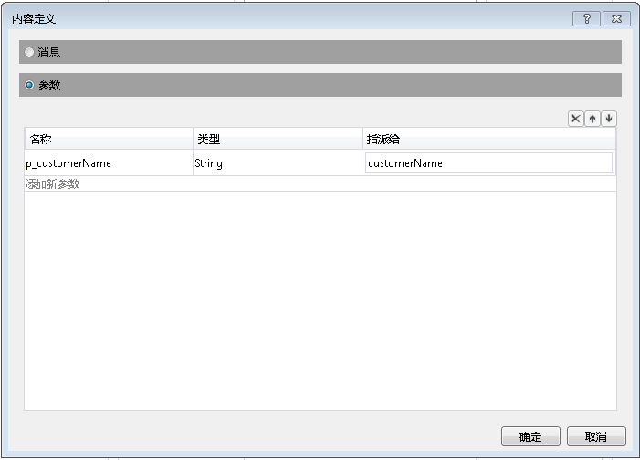</span><span class="sxs-lookup"><span data-stu-id="18a0e-155"></span></span>  
  
    3.  <span data-ttu-id="18a0e-156">选择**SendReplyToReceive**活动，并设置下图中所示的突出显示属性。</span><span class="sxs-lookup"><span data-stu-id="18a0e-156">Select The **SendReplyToReceive** activity and set the highlighted property shown in the following illustration.</span></span>  
  
         <span data-ttu-id="18a0e-157">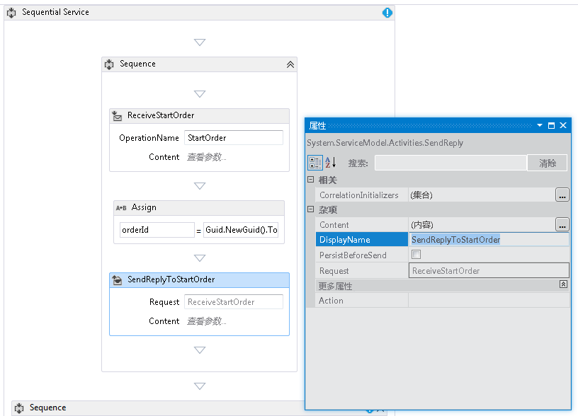</span><span class="sxs-lookup"><span data-stu-id="18a0e-157"></span></span>  
  
    4.  <span data-ttu-id="18a0e-158">单击**定义...**中链接**SendReplyToStartOrder**活动并设置下图中所示的属性。</span><span class="sxs-lookup"><span data-stu-id="18a0e-158">Click the **Define...** link in the **SendReplyToStartOrder** activity and set the properties shown in the following illustration.</span></span> <span data-ttu-id="18a0e-159">请注意，**参数**单选按钮处于选中状态; 参数名为`p_orderId`绑定到`orderId`变量。</span><span class="sxs-lookup"><span data-stu-id="18a0e-159">Notice that the **Parameters** radio button is selected; a parameter named `p_orderId` is bound to the `orderId` variable.</span></span> <span data-ttu-id="18a0e-160">此设置指定 SendReplyToStartOrder 活动将类型字符串的值返回给调用方。</span><span class="sxs-lookup"><span data-stu-id="18a0e-160">This setting specifies that the SendReplyToStartOrder activity will return a value of type string to the caller.</span></span>  
  
         <span data-ttu-id="18a0e-161">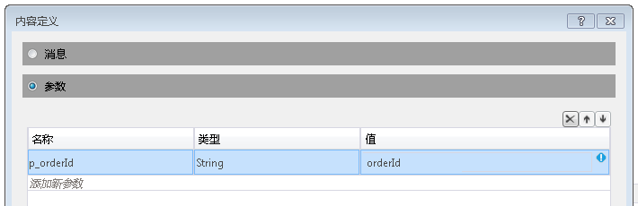</span><span class="sxs-lookup"><span data-stu-id="18a0e-161"></span></span>  
  
    5.  <span data-ttu-id="18a0e-162">拖放 Assign 活动之间**接收**和**SendReply**活动和设置的属性，如下面的插图中所示：</span><span class="sxs-lookup"><span data-stu-id="18a0e-162">Drag and drop an Assign activity in between the **Receive** and **SendReply** activities and set the properties as shown in the following illustration:</span></span>  
  
         <span data-ttu-id="18a0e-163">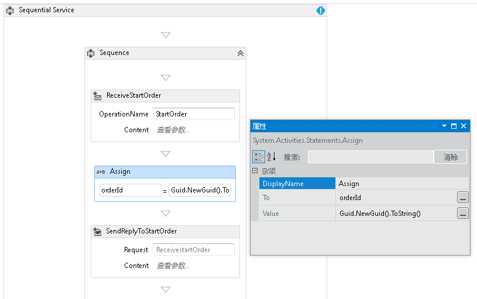</span><span class="sxs-lookup"><span data-stu-id="18a0e-163"></span></span>  
  
         <span data-ttu-id="18a0e-164">这将创建一个新的订单 ID，并将该值放在 orderId 变量中。</span><span class="sxs-lookup"><span data-stu-id="18a0e-164">This creates a new order ID and places the value in the orderId variable.</span></span>  
  
    6.  <span data-ttu-id="18a0e-165">选择**replytostartorder**活动。</span><span class="sxs-lookup"><span data-stu-id="18a0e-165">Select the **ReplyToStartOrder** activity.</span></span> <span data-ttu-id="18a0e-166">在属性窗口中单击的省略号按钮**CorrelationInitializers**。</span><span class="sxs-lookup"><span data-stu-id="18a0e-166">In the properties window click the ellipsis button for **CorrelationInitializers**.</span></span> <span data-ttu-id="18a0e-167">选择**添加初始值设定项**链接，输入`orderIdHandle`在初始值设定项文本框中，选择查询相关初始值设定项为相关类型，并在 XPATH 查询下拉框中选择 p_orderId。</span><span class="sxs-lookup"><span data-stu-id="18a0e-167">Select the **Add initializer** link, enter `orderIdHandle` in the Initializer text box, select Query correlation initializer for the Correlation type, and select p_orderId under the XPATH Queries dropdown box.</span></span> <span data-ttu-id="18a0e-168">这些设置如下图所示。</span><span class="sxs-lookup"><span data-stu-id="18a0e-168">These settings are shown in the following illustration.</span></span> <span data-ttu-id="18a0e-169">单击“确定”。</span><span class="sxs-lookup"><span data-stu-id="18a0e-169">Click **OK**.</span></span>  <span data-ttu-id="18a0e-170">这将初始化客户端与此工作流服务实例之间的相关性。</span><span class="sxs-lookup"><span data-stu-id="18a0e-170">This initializes a correlation between the client and this instance of the workflow service.</span></span> <span data-ttu-id="18a0e-171">当接收到包含此订单 ID 的消息时，将该消息路由至此工作流服务实例。</span><span class="sxs-lookup"><span data-stu-id="18a0e-171">When a message containing this order ID is received it is routed to this instance of the workflow service.</span></span>  
  
         <span data-ttu-id="18a0e-172">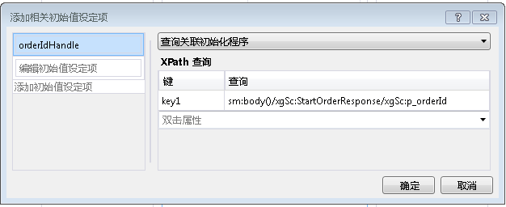</span><span class="sxs-lookup"><span data-stu-id="18a0e-172"></span></span>  
  
7.  <span data-ttu-id="18a0e-173">另一个拖放式**ReceiveAndSendReply**到工作流末尾的活动 (外部**序列**包含第一个**接收**和**SendReply**活动)。</span><span class="sxs-lookup"><span data-stu-id="18a0e-173">Drag and drop another **ReceiveAndSendReply** activity to the end of the workflow (outside the **Sequence** containing the first **Receive** and **SendReply** activities).</span></span> <span data-ttu-id="18a0e-174">这将接收客户端发送的第二条消息，并对它做出响应。</span><span class="sxs-lookup"><span data-stu-id="18a0e-174">This will receive the second message sent by the client and respond to it.</span></span>  
  
    1.  <span data-ttu-id="18a0e-175">选择**序列**，其中包含新添加**接收**和**SendReply**活动和单击**变量**按钮。</span><span class="sxs-lookup"><span data-stu-id="18a0e-175">Select the **Sequence** that contains the newly added **Receive** and **SendReply** activities and click the **Variables** button.</span></span> <span data-ttu-id="18a0e-176">添加下图中突出显示的变量：</span><span class="sxs-lookup"><span data-stu-id="18a0e-176">Add the variable highlighted in the following illustration:</span></span>  
  
         <span data-ttu-id="18a0e-177">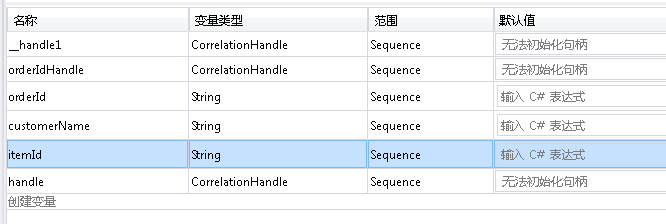</span><span class="sxs-lookup"><span data-stu-id="18a0e-177"></span></span>  
  
    2.  <span data-ttu-id="18a0e-178">选择**接收**活动并设置下图中所示的属性：</span><span class="sxs-lookup"><span data-stu-id="18a0e-178">Select the **Receive** activity and set the properties shown in the following illustration:</span></span>  
  
         <span data-ttu-id="18a0e-179">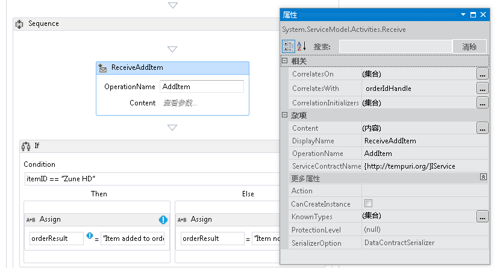</span><span class="sxs-lookup"><span data-stu-id="18a0e-179"></span></span>  
  
    3.  <span data-ttu-id="18a0e-180">单击**定义...**中链接**ReceiveAddItem**活动并添加下图中所示的参数： 这会将配置接收活动，以接受两个参数，即订单 ID 和订购的项的 ID。</span><span class="sxs-lookup"><span data-stu-id="18a0e-180">Click the **Define...** link in the **ReceiveAddItem** activity and add the parameters shown in the following illustration:This configures the receive activity to accept two parameters, the order ID and the ID of the item being ordered.</span></span>  
  
         <span data-ttu-id="18a0e-181">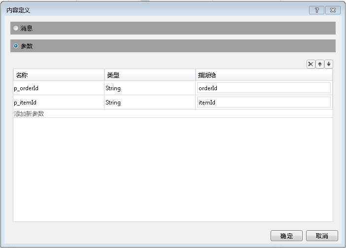</span><span class="sxs-lookup"><span data-stu-id="18a0e-181"></span></span>  
  
    4.  <span data-ttu-id="18a0e-182">单击**CorrelateOn**省略号按钮，然后输入`orderIdHandle`。</span><span class="sxs-lookup"><span data-stu-id="18a0e-182">Click the **CorrelateOn** ellipsis button and enter `orderIdHandle`.</span></span> <span data-ttu-id="18a0e-183">下**XPath 查询**，单击下拉箭头并选择`p_orderId`。</span><span class="sxs-lookup"><span data-stu-id="18a0e-183">Under **XPath Queries**, click the drop down arrow and select `p_orderId`.</span></span> <span data-ttu-id="18a0e-184">这将对第二个接收活动配置相关性。</span><span class="sxs-lookup"><span data-stu-id="18a0e-184">This configures the correlation on the second receive activity.</span></span> [!INCLUDE[crabout](../../../../includes/crabout-md.md)]<span data-ttu-id="18a0e-185">相关，请参阅[相关](../../../../docs/framework/wcf/feature-details/correlation.md)。</span><span class="sxs-lookup"><span data-stu-id="18a0e-185"> correlation see [Correlation](../../../../docs/framework/wcf/feature-details/correlation.md).</span></span>  
  
         <span data-ttu-id="18a0e-186">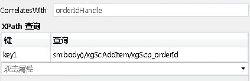</span><span class="sxs-lookup"><span data-stu-id="18a0e-186"></span></span>  
  
    5.  <span data-ttu-id="18a0e-187">拖放式**如果**活动后立即**ReceiveAddItem**活动。</span><span class="sxs-lookup"><span data-stu-id="18a0e-187">Drag and drop an **If** activity immediately after the **ReceiveAddItem** activity.</span></span> <span data-ttu-id="18a0e-188">此活动的行为与 if 语句类似。</span><span class="sxs-lookup"><span data-stu-id="18a0e-188">This activity acts just like an if statement.</span></span>  
  
        1.  <span data-ttu-id="18a0e-189">设置**条件**属性`itemId=="Zune HD" (itemId="Zune HD" for Visual Basic)`</span><span class="sxs-lookup"><span data-stu-id="18a0e-189">Set the **Condition** property to `itemId=="Zune HD" (itemId="Zune HD" for Visual Basic)`</span></span>  
  
        2.  <span data-ttu-id="18a0e-190">拖放式**分配**到中的活动**然后**部分，另一个到**Else**部分设置的属性**分配**下图中所示的活动。</span><span class="sxs-lookup"><span data-stu-id="18a0e-190">Drag and drop an **Assign** activity in to the **Then** section and another into the **Else** section set the properties of the **Assign** activities as shown in the following illustration.</span></span>  
  
             <span data-ttu-id="18a0e-191">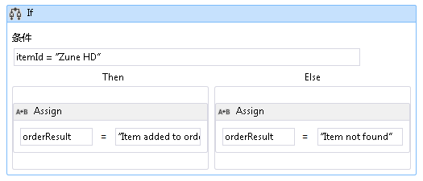</span><span class="sxs-lookup"><span data-stu-id="18a0e-191"></span></span>  
  
             <span data-ttu-id="18a0e-192">如果条件为`true`**然后**将执行部分。</span><span class="sxs-lookup"><span data-stu-id="18a0e-192">If the condition is `true` the **Then** section will be executed.</span></span> <span data-ttu-id="18a0e-193">如果条件为`false` **Else**执行部分。</span><span class="sxs-lookup"><span data-stu-id="18a0e-193">If the condition is `false` the **Else** section is executed.</span></span>  
  
        3.  <span data-ttu-id="18a0e-194">选择**SendReplyToReceive**活动，并设置**DisplayName**下图中所示的属性。</span><span class="sxs-lookup"><span data-stu-id="18a0e-194">Select the **SendReplyToReceive** activity and set the **DisplayName** property shown in the following illustration.</span></span>  
  
             <span data-ttu-id="18a0e-195"></span><span class="sxs-lookup"><span data-stu-id="18a0e-195"></span></span>  
  
        4.  <span data-ttu-id="18a0e-196">单击**定义...**中链接**SetReplyToAddItem**活动并将其配置如下图中所示。</span><span class="sxs-lookup"><span data-stu-id="18a0e-196">Click the **Define ...** link in the **SetReplyToAddItem** activity and configure it as shown in the following illustration.</span></span> <span data-ttu-id="18a0e-197">这会将配置**SendReplyToAddItem**活动可返回中的值`orderResult`变量。</span><span class="sxs-lookup"><span data-stu-id="18a0e-197">This configures the **SendReplyToAddItem** activity to return the value in the `orderResult` variable.</span></span>  
  
             <span data-ttu-id="18a0e-198">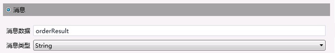</span><span class="sxs-lookup"><span data-stu-id="18a0e-198"></span></span>  
  
8.  <span data-ttu-id="18a0e-199">打开 web.config 文件并添加以下元素中的\<行为 > 节，以启用工作流持久性。</span><span class="sxs-lookup"><span data-stu-id="18a0e-199">Open the web.config file and add the following elements in the \<behavior> section to enable workflow persistence.</span></span>  
  
    ```xml  
    <sqlWorkflowInstanceStore connectionString="Data Source=your-machine\SQLExpress;Initial Catalog=SQLPersistenceStore;Integrated Security=True;Asynchronous Processing=True" instanceEncodingOption="None" instanceCompletionAction="DeleteAll" instanceLockedExceptionAction="BasicRetry" hostLockRenewalPeriod="00:00:30" runnableInstancesDetectionPeriod="00:00:02" />  
              <workflowIdle timeToUnload="0"/>  
    ```  
  
    > [!WARNING]
    >  <span data-ttu-id="18a0e-200">确保替换上面代码段中的主机和 SQL Server 实例名称。</span><span class="sxs-lookup"><span data-stu-id="18a0e-200">Make sure to replace your host and SQL server instance name in the previous code snippet.</span></span>  
  
9. <span data-ttu-id="18a0e-201">生成解决方案。</span><span class="sxs-lookup"><span data-stu-id="18a0e-201">Build the solution.</span></span>  
  
### <a name="to-create-a-client-application-to-call-the-workflow-service"></a><span data-ttu-id="18a0e-202">创建客户端应用程序以调用工作流服务</span><span class="sxs-lookup"><span data-stu-id="18a0e-202">To Create a Client Application to Call the Workflow Service</span></span>  
  
1.  <span data-ttu-id="18a0e-203">将一个名为 `OrderClient` 的新控制台应用程序项目添加到解决方案中。</span><span class="sxs-lookup"><span data-stu-id="18a0e-203">Add a new Console application project called `OrderClient` to the solution.</span></span>  
  
2.  <span data-ttu-id="18a0e-204">向 `OrderClient` 项目中添加对以下程序集的引用：</span><span class="sxs-lookup"><span data-stu-id="18a0e-204">Add references to the following assemblies to the `OrderClient` project</span></span>  
  
    1.  <span data-ttu-id="18a0e-205">System.ServiceModel.dll</span><span class="sxs-lookup"><span data-stu-id="18a0e-205">System.ServiceModel.dll</span></span>  
  
    2.  <span data-ttu-id="18a0e-206">System.ServiceModel.Activities.dll</span><span class="sxs-lookup"><span data-stu-id="18a0e-206">System.ServiceModel.Activities.dll</span></span>  
  
3.  <span data-ttu-id="18a0e-207">添加对工作流服务的服务引用，并将 `OrderService` 指定为命名空间。</span><span class="sxs-lookup"><span data-stu-id="18a0e-207">Add a service reference to the workflow service and specify `OrderService` as the namespace.</span></span>  
  
4.  <span data-ttu-id="18a0e-208">在客户端项目的 `Main()` 方法中，添加以下代码：</span><span class="sxs-lookup"><span data-stu-id="18a0e-208">In the `Main()` method of the client project add the following code:</span></span>  
  
    ```  
    static void Main(string[] args)  
    {  
       // Send initial message to start the workflow service  
       Console.WriteLine("Sending start message");  
       StartOrderClient startProxy = new StartOrderClient();  
       string orderId = startProxy.StartOrder("Kim Abercrombie");  
  
       // The workflow service is now waiting for the second message to be sent  
       Console.WriteLine("Workflow service is idle...");  
       Console.WriteLine("Press [ENTER] to send an add item message to reactivate the workflow service...");  
       Console.ReadLine();  
  
       // Send the second message  
       Console.WriteLine("Sending add item message");  
       AddItemClient addProxy = new AddItemClient();  
       AddItem item = new AddItem();  
       item.p_itemId = "Zune HD";  
       item.p_orderId = orderId;  
  
       string orderResult = addProxy.AddItem(item);  
       Console.WriteLine("Service returned: " + orderResult);  
    }  
    ```  
  
5.  <span data-ttu-id="18a0e-209">生成解决方案，并运行 `OrderClient` 应用程序。</span><span class="sxs-lookup"><span data-stu-id="18a0e-209">Build the solution and run the `OrderClient` application.</span></span> <span data-ttu-id="18a0e-210">客户端将显示以下文本：</span><span class="sxs-lookup"><span data-stu-id="18a0e-210">The client will display the following text:</span></span>  
  
    ```Output  
    Sending start messageWorkflow service is idle...Press [ENTER] to send an add item message to reactivate the workflow service...  
    ```  
  
6.  <span data-ttu-id="18a0e-211">若要验证工作流服务是否已持久化，启动 SQL Server Management Studio，通过转到**启动**菜单上，选择**所有程序**， **Microsoft SQL Server 2008**， **SQL Server Management Studio**。</span><span class="sxs-lookup"><span data-stu-id="18a0e-211">To verify that the workflow service has been persisted, start the SQL Server Management Studio by going to the **Start** menu, Selecting **All Programs**, **Microsoft SQL Server 2008**, **SQL Server Management Studio**.</span></span>  
  
    1.  <span data-ttu-id="18a0e-212">在左侧窗格中，依次展开**数据库**， **SQLPersistenceStore**，**视图**然后右键单击**System.Activities.DurableInstancing.Instances**和选择**选择前 1000年行**。</span><span class="sxs-lookup"><span data-stu-id="18a0e-212">In the left hand pane expand, **Databases**, **SQLPersistenceStore**, **Views** and right click **System.Activities.DurableInstancing.Instances** and select **Select Top 1000 Rows**.</span></span> <span data-ttu-id="18a0e-213">在**结果**窗格中，确认你看到列出的至少一个实例。</span><span class="sxs-lookup"><span data-stu-id="18a0e-213">In the **Results** pane verify you see at least one instance listed.</span></span> <span data-ttu-id="18a0e-214">如果运行时出现异常，则可能存在先前运行的其他实例。</span><span class="sxs-lookup"><span data-stu-id="18a0e-214">There may be other instances from prior runs if an exception occurred while running.</span></span> <span data-ttu-id="18a0e-215">你可以通过右键单击删除现有行**System.Activities.DurableInstancing.Instances**并选择**编辑前 200 行**、 紧迫**执行**按钮，在结果窗格中选择所有行并都选择**删除**。</span><span class="sxs-lookup"><span data-stu-id="18a0e-215">You can delete existing rows by right clicking **System.Activities.DurableInstancing.Instances** and selecting **Edit Top 200 rows**, pressing the **Execute** button, selecting all rows in the results pane and selecting **delete**.</span></span>  <span data-ttu-id="18a0e-216">若要验证数据库中显示的实例是否为应用程序创建的实例，请在运行客户端之前验证实例视图是否为空。</span><span class="sxs-lookup"><span data-stu-id="18a0e-216">To verify the instance displayed in the database is the instance your application created, verify the instances view is empty prior to running the client.</span></span> <span data-ttu-id="18a0e-217">客户端开始运行后，重新运行查询（选择前 1000 行），并确认已添加新实例。</span><span class="sxs-lookup"><span data-stu-id="18a0e-217">Once the client is running re-run the query (Select Top 1000 Rows) and verify a new instance has been added.</span></span>  
  
7.  <span data-ttu-id="18a0e-218">按 Enter 将添加项目消息发送至工作流服务。</span><span class="sxs-lookup"><span data-stu-id="18a0e-218">Press enter to send the add item message to the workflow service.</span></span> <span data-ttu-id="18a0e-219">客户端将显示以下文本：</span><span class="sxs-lookup"><span data-stu-id="18a0e-219">The client will display the following text:</span></span>  
  
    ```Output  
    Sending add item messageService returned: Item added to orderPress any key to continue . . .  
    ```  
  
## <a name="see-also"></a><span data-ttu-id="18a0e-220">另请参阅</span><span class="sxs-lookup"><span data-stu-id="18a0e-220">See Also</span></span>  
 [<span data-ttu-id="18a0e-221">工作流服务</span><span class="sxs-lookup"><span data-stu-id="18a0e-221">Workflow Services</span></span>](../../../../docs/framework/wcf/feature-details/workflow-services.md)
