# <a name="flowing-transactions-into-and-out-of-workflow-services"></a>使事务流入和流出工作流服务
工作流服务和客户端可以参与事务。  对于将成为环境事务一部分的服务操作，将 <xref:System.ServiceModel.Activities.Receive> 活动放到 <xref:System.ServiceModel.Activities.TransactedReceiveScope> 活动内。 由 <xref:System.ServiceModel.Activities.Send> 内的 <xref:System.ServiceModel.Activities.SendReply> 或 <xref:System.ServiceModel.Activities.TransactedReceiveScope> 活动所做的任何调用也将在环境事务中进行。 工作流客户端应用程序可以通过使用 <xref:System.Activities.Statements.TransactionScope> 活动来创建环境事务，并通过使用该环境事务来调用服务操作。 本主题将指导您创建参与事务的工作流服务和工作流客户端。  
  
> [!WARNING]
>  如果某个工作流服务实例在事务中加载且该工作流包含 <xref:System.Activities.Statements.Persist> 活动，则该工作流实例会挂起，直到事务超时。  
  
> [!IMPORTANT]
>  无论何时使用 <xref:System.ServiceModel.Activities.TransactedReceiveScope>，都建议将所有接收都置于工作流内的 <xref:System.ServiceModel.Activities.TransactedReceiveScope> 活动中。  
  
> [!IMPORTANT]
>  如果 <xref:System.ServiceModel.Activities.TransactedReceiveScope> 且消息按错误顺序到达，则在尝试提交第一个不按顺序的消息时，工作流会中止。 必须确保工作流在空闲时始终处于一致的停止点。 这会使您可以在工作流中止时，从以前的持久点重新启动工作流。  
  
### <a name="create-a-shared-library"></a>创建共享库  
  
1.  创建新的空 Visual Studio 解决方案。  
  
2.  添加一个名为 `Common` 的新类库项目。 添加对下列程序集的引用：  
  
    -   System.Activities.dll  
  
    -   System.ServiceModel.dll  
  
    -   System.ServiceModel.Activities.dll  
  
    -   System.Transactions.dll  
  
3.  将一个名为 `PrintTransactionInfo` 的新类添加到 `Common` 项目。 此类派生自 <xref:System.Activities.NativeActivity>，并重载 <xref:System.Activities.NativeActivity.Execute%2A> 方法。  
  
    ```  
    using System;  
    using System;  
    using System.Activities;  
    using System.Transactions;  
  
    namespace Common  
    {  
        public class PrintTransactionInfo : NativeActivity  
        {  
            protected override void Execute(NativeActivityContext context)  
            {  
                RuntimeTransactionHandle rth = context.Properties.Find(typeof(RuntimeTransactionHandle).FullName) as RuntimeTransactionHandle;  
  
                if (rth == null)  
                {  
                    Console.WriteLine("There is no ambient RuntimeTransactionHandle");  
                }  
  
                Transaction t = rth.GetCurrentTransaction(context);  
  
                if (t == null)  
                {  
                    Console.WriteLine("There is no ambient transaction");  
                }  
                else  
                {  
                    Console.WriteLine("Transaction: {0} is {1}", t.TransactionInformation.DistributedIdentifier, t.TransactionInformation.Status);  
                }  
            }  
        }  
  
    }  
    ```  
  
     这是一个本机活动，用于显示有关环境事务的信息，它将在本主题中使用的服务工作流和客户端工作流中使用。 生成解决方案以使此活动可的**常见**部分**工具箱**。  
  
### <a name="implement-the-workflow-service"></a>实现工作流服务  
  
1.  添加新[!INCLUDE[indigo2](../../../../includes/indigo2-md.md)]称为工作流服务`WorkflowService`到`Common`项目。 为此，右击`Common`项目，依次选择**添加**，**新建项...**，选择**工作流**下**已安装的模板**和选择**WCF 工作流服务**。  
  
     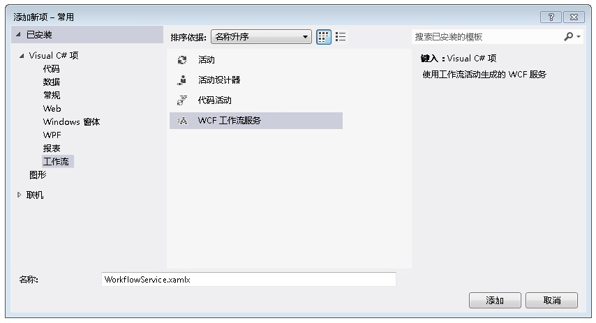  
  
2.  删除默认的 `ReceiveRequest` 和 `SendResponse` 活动。  
  
3.  将 <xref:System.Activities.Statements.WriteLine> 活动拖放到 `Sequential Service` 活动中。 将文本属性设置为 `"Workflow Service starting ..."`，如下面的示例所示。  
  
       
  
4.  将 <xref:System.ServiceModel.Activities.TransactedReceiveScope> 拖放到 <xref:System.Activities.Statements.WriteLine> 活动后面。 <xref:System.ServiceModel.Activities.TransactedReceiveScope>在找不到活动**消息**部分**工具箱**。 <xref:System.ServiceModel.Activities.TransactedReceiveScope>活动组成两个部分**请求**和**正文**。 **请求**部分包含<xref:System.ServiceModel.Activities.Receive>活动。 **正文**部分包含收到消息后将在事务中执行的活动。  
  
     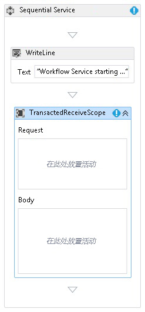  
  
5.  选择<xref:System.ServiceModel.Activities.TransactedReceiveScope>活动，然后单击**变量**按钮。 添加以下变量。  
  
       
  
    > [!NOTE]
    >  可以删除默认情况下在该处的数据变量。 还可以使用现有句柄变量。  
  
6.  拖放式<xref:System.ServiceModel.Activities.Receive>中的活动**请求**部分<xref:System.ServiceModel.Activities.TransactedReceiveScope>活动。 设置以下属性：  
  
    |属性|“值”|  
    |--------------|-----------|  
    |CanCreateInstance|True（选中复选框）|  
    |OperationName|StartSample|  
    |ServiceContractName|ITransactionSample|  
  
     该工作流应如下所示：  
  
     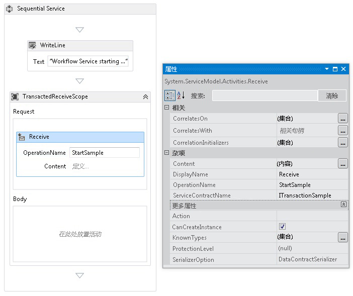  
  
7.  单击**定义...**中链接<xref:System.ServiceModel.Activities.Receive>活动，然后进行以下设置：  
  
       
  
8.  将 <xref:System.Activities.Statements.Sequence> 活动拖放到 <xref:System.ServiceModel.Activities.TransactedReceiveScope> 的“正文”部分内。 在 <xref:System.Activities.Statements.Sequence> 活动内，拖放两个 <xref:System.Activities.Statements.WriteLine> 活动并设置 <xref:System.Activities.Statements.WriteLine.Text%2A> 属性，如下表所示。  
  
    |活动|“值”|  
    |--------------|-----------|  
    |第一个 WriteLine|"服务： 接收已完成"|  
    |第二个 WriteLine|"Service: Received = " + requestMessage|  
  
     现在，该工作流应如下所示：  
  
       
  
9. 拖放式`PrintTransactionInfo`后第二个活动<xref:System.Activities.Statements.WriteLine>中的活动**正文**中<xref:System.ServiceModel.Activities.TransactedReceiveScope>活动。  
  
     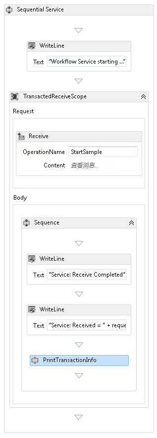  
  
10. 将 <xref:System.Activities.Statements.Assign> 活动拖放到 `PrintTransactionInfo` 活动后面，然后根据下表设置其属性。  
  
    |属性|“值”|  
    |--------------|-----------|  
    |到|replyMessage|  
    |“值”|"Service: Sending reply."|  
  
11. 将 <xref:System.Activities.Statements.WriteLine> 活动拖放到 <xref:System.Activities.Statements.Assign> 活动后面，然后将它的 <xref:System.Activities.Statements.WriteLine.Text%2A> 属性设置为 "Service: Begin reply."  
  
     现在，该工作流应如下所示：  
  
     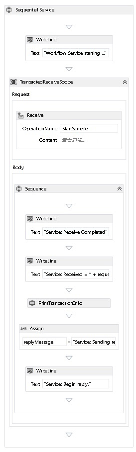  
  
12. 右键单击<xref:System.ServiceModel.Activities.Receive>活动，并选择**创建 SendReply**并将其粘贴上次<xref:System.Activities.Statements.WriteLine>活动。 单击**定义...**中链接`SendReplyToReceive`活动，然后进行以下设置。  
  
     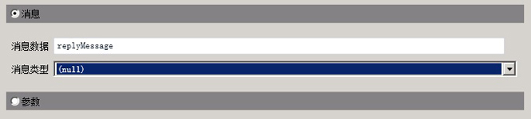  
  
13. 拖放式<xref:System.Activities.Statements.WriteLine>活动后的`SendReplyToReceive`活动，并设置它具有<xref:System.Activities.Statements.WriteLine.Text%2A>属性设置为"服务： Reply sent。"  
  
14. 将 <xref:System.Activities.Statements.WriteLine> 活动拖放到工作流底部，然后将它的 <xref:System.Activities.Statements.WriteLine.Text%2A> 属性设置为 "Service: Workflow ends, press ENTER to exit."  
  
     完成的服务工作流应如下所示：  
  
     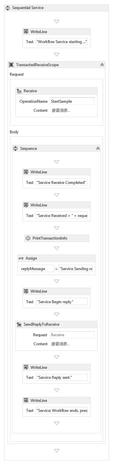  
  
### <a name="implement-the-workflow-client"></a>实现工作流客户端  
  
1.  将一个名为 `WorkflowClient` 的新 WCF 工作流应用程序添加到 `Common` 项目。 为此，右击`Common`项目，依次选择**添加**，**新建项...**，选择**工作流**下**已安装的模板**和选择**活动**。  
  
     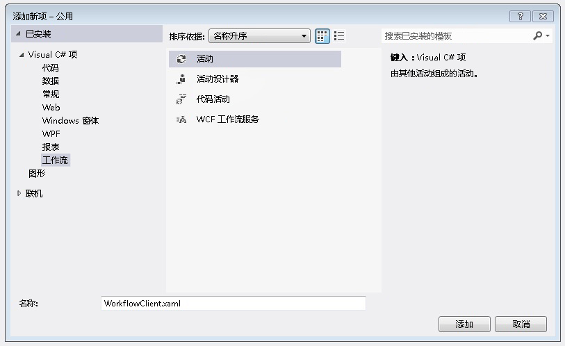  
  
2.  将 <xref:System.Activities.Statements.Sequence> 活动拖放到设计图面上。  
  
3.  在 <xref:System.Activities.Statements.Sequence> 活动内拖放一个 <xref:System.Activities.Statements.WriteLine> 活动，然后将它的 <xref:System.Activities.Statements.WriteLine.Text%2A> 属性设置为 `"Client: Workflow starting"`。 现在，该工作流应如下所示：  
  
       
  
4.  将 <xref:System.Activities.Statements.TransactionScope> 活动拖放到 <xref:System.Activities.Statements.WriteLine> 活动后面。  选择 <xref:System.Activities.Statements.TransactionScope> 活动，单击“变量”按钮，然后添加以下变量。  
  
     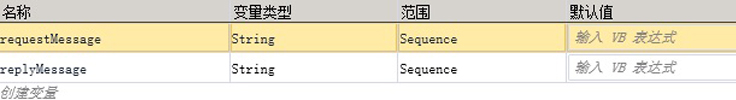  
  
5.  将 <xref:System.Activities.Statements.Sequence> 活动拖放到 <xref:System.Activities.Statements.TransactionScope> 活动的正文内。  
  
6.  在 `PrintTransactionInfo` 内拖放 <xref:System.Activities.Statements.Sequence> 活动  
  
7.  拖放式<xref:System.Activities.Statements.WriteLine>活动后的`PrintTransactionInfo`活动，并设置其<xref:System.Activities.Statements.WriteLine.Text%2A>属性设置为"Client: Beginning Send"。 现在，该工作流应如下所示：  
  
       
  
8.  将 <xref:System.ServiceModel.Activities.Send> 活动拖放到 <xref:System.Activities.Statements.Assign> 活动后面，并设置以下属性：  
  
    |属性|“值”|  
    |--------------|-----------|  
    |EndpointConfigurationName|workflowServiceEndpoint|  
    |OperationName|StartSample|  
    |ServiceContractName|ITransactionSample|  
  
     现在，该工作流应如下所示：  
  
     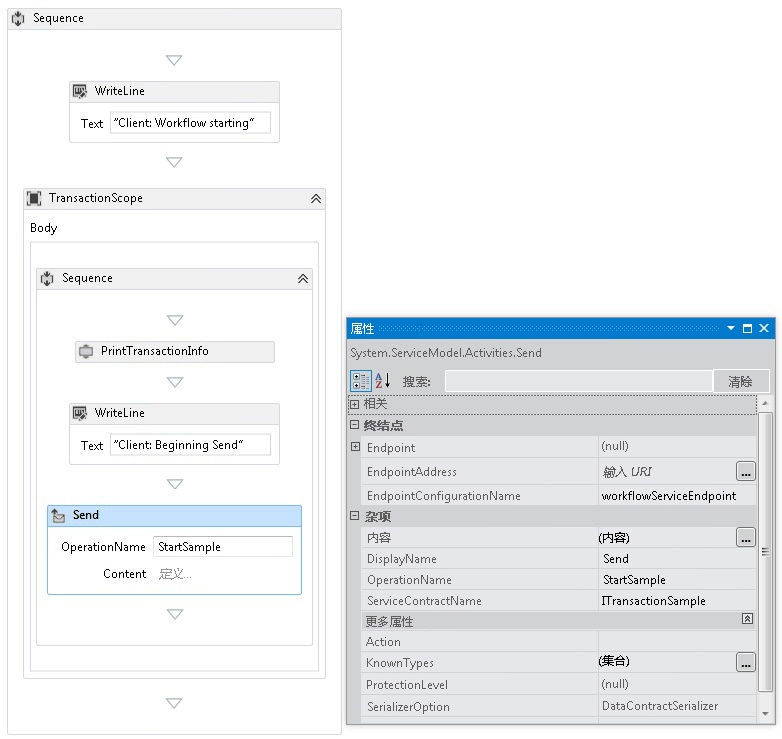  
  
9. 单击**定义...**链接，然后进行以下设置：  
  
     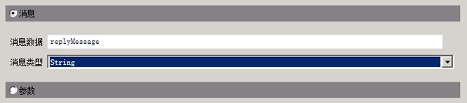  
  
10. 右键单击<xref:System.ServiceModel.Activities.Send>活动，并选择**创建 ReceiveReply**。 <xref:System.ServiceModel.Activities.ReceiveReply> 活动将自动放在 <xref:System.ServiceModel.Activities.Send> 活动后面。  
  
11. 单击 ReceiveReplyForSend 活动上的“定义...”链接，然后进行以下设置：  
  
     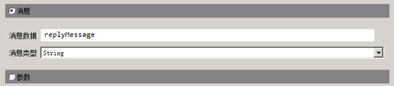  
  
12. 将 <xref:System.Activities.Statements.WriteLine> 活动拖放到 <xref:System.ServiceModel.Activities.Send> 和 <xref:System.ServiceModel.Activities.ReceiveReply> 活动之间，然后将它的 <xref:System.Activities.Statements.WriteLine.Text%2A> 属性设置为 "Client: Send complete."  
  
13. 将 <xref:System.Activities.Statements.WriteLine> 活动拖放到 <xref:System.ServiceModel.Activities.ReceiveReply> 活动后面，然后将它的 <xref:System.Activities.Statements.WriteLine.Text%2A> 属性设置为 "Client side: Reply received = " + replyMessage  
  
14. 将 `PrintTransactionInfo` 活动拖放到 <xref:System.Activities.Statements.WriteLine> 活动后面。  
  
15. 将 <xref:System.Activities.Statements.WriteLine> 活动拖放到工作流末尾，然后将它的 <xref:System.Activities.Statements.WriteLine.Text%2A> 属性设置为 "Client workflow ends." 完成的客户端工作流应如下图所示。  
  
     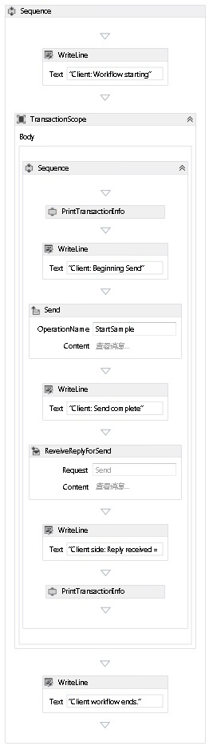  
  
16. 生成解决方案。  
  
### <a name="create-the-service-application"></a>创建服务应用程序  
  
1.  将一个名为 `Service` 的新控制台应用程序项目添加到该解决方案。 添加对下列程序集的引用：  
  
    1.  System.Activities.dll  
  
    2.  System.ServiceModel.dll  
  
    3.  System.ServiceModel.Activities.dll  
  
2.  打开生成的 Program.cs 文件并添加以下代码：  
  
    ```  
    static void Main()  
          {  
              Console.WriteLine("Building the server.");  
              using (WorkflowServiceHost host = new WorkflowServiceHost(new DeclarativeServiceWorkflow(), new Uri("net.tcp://localhost:8000/TransactedReceiveService/Declarative")))  
              {                
                  //Start the server  
                  host.Open();  
                  Console.WriteLine("Service started.");  
  
                  Console.WriteLine();  
                  Console.ReadLine();  
                  //Shutdown  
                  host.Close();  
              };         
          }  
    ```  
  
3.  将以下 app.config 文件添加到项目。  
  
    ```xml  
    <?xml version="1.0" encoding="utf-8" ?>  
    <!-- Copyright © Microsoft Corporation.  All rights reserved. -->  
    <configuration>  
        <system.serviceModel>  
            <bindings>  
                <netTcpBinding>  
                    <binding transactionFlow="true" />  
                </netTcpBinding>  
            </bindings>  
        </system.serviceModel>  
    </configuration>  
    ```  
  
### <a name="create-the-client-application"></a>创建客户端应用程序  
  
1.  将一个名为 `Client` 的新控制台应用程序项目添加到该解决方案。 添加对 System.Activities.dll 的引用。  
  
2.  打开 program.cs 文件并添加以下代码。  
  
    ```  
    class Program  
        {  
  
            private static AutoResetEvent syncEvent = new AutoResetEvent(false);  
  
            static void Main(string[] args)  
            {  
                //Build client  
                Console.WriteLine("Building the client.");  
                WorkflowApplication client = new WorkflowApplication(new DeclarativeClientWorkflow());  
                client.Completed = Program.Completed;  
                client.Aborted = Program.Aborted;  
                client.OnUnhandledException = Program.OnUnhandledException;  
  
                //Wait for service to start  
                Console.WriteLine("Press ENTER once service is started.");  
                Console.ReadLine();  
  
                //Start the client              
                Console.WriteLine("Starting the client.");  
                client.Run();  
                syncEvent.WaitOne();  
  
                //Sample complete  
                Console.WriteLine();  
                Console.WriteLine("Client complete. Press ENTER to exit.");  
                Console.ReadLine();  
            }  
  
            private static void Completed(WorkflowApplicationCompletedEventArgs e)  
            {  
                Program.syncEvent.Set();  
            }  
  
            private static void Aborted(WorkflowApplicationAbortedEventArgs e)  
            {  
                Console.WriteLine("Client Aborted: {0}", e.Reason);  
                Program.syncEvent.Set();  
            }  
  
            private static UnhandledExceptionAction OnUnhandledException(WorkflowApplicationUnhandledExceptionEventArgs e)  
            {  
                Console.WriteLine("Client had an unhandled exception: {0}", e.UnhandledException);  
                return UnhandledExceptionAction.Cancel;  
            }  
        }  
    ```  
  
## <a name="see-also"></a>请参阅  
 [工作流服务](../../../../docs/framework/wcf/feature-details/workflow-services.md)  
 [Windows Communication Foundation 事务概述](../../../../docs/framework/wcf/feature-details/transactions-overview.md)  
 [使用 TransactedReceiveScope](../../../../docs/framework/windows-workflow-foundation/samples/use-of-transactedreceivescope.md)
