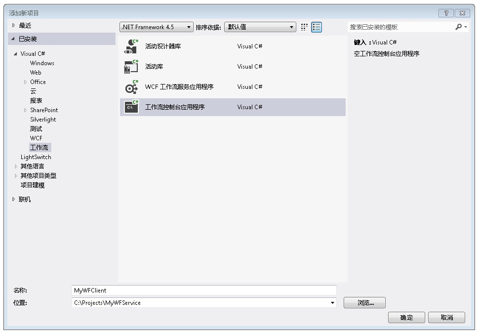
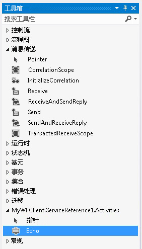
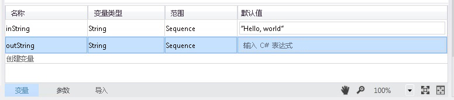
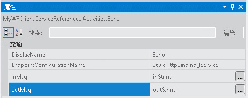
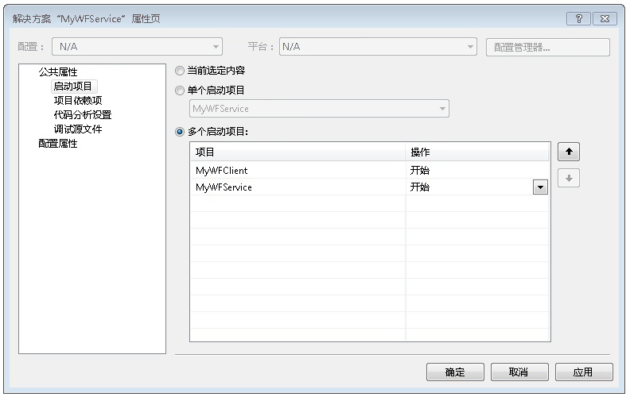

# 如何：从工作流应用程序访问服务
本主题说明如何从工作流控制台应用程序调用工作流服务。 这取决于完成[如何： 使用消息传递活动创建工作流服务](../../../../docs/framework/wcf/feature-details/how-to-create-a-workflow-service-with-messaging-activities.md)主题。 虽然本主题介绍如何从工作流应用程序调用工作流服务，但是相同的方法可以用于从工作流应用程序中调用任何 Windows Communication Foundation (WCF) 服务。

### 创建工作流控制台应用程序项目

1.  启动 [!INCLUDE[vs_current_long](../../../../includes/vs-current-long-md.md)]。

2.  加载中创建的 MyWFService 项目[如何： 使用消息传递活动创建工作流服务](../../../../docs/framework/wcf/feature-details/how-to-create-a-workflow-service-with-messaging-activities.md)主题。

3.  右键单击**MyWFService**中的解决方案**解决方案资源管理器**，然后选择**添加**，**新项目**。 选择**工作流**中**已安装的模板**并**工作流控制台应用程序**从项目类型列表。 将项目命名为 MyWFClient 并保存在默认位置，如以下插图所示。

     

     单击**确定**按钮以关闭**添加新项目对话框**。

4.  创建项目以后，将在设计器中打开 Workflow1.xaml 文件。 单击**工具箱**选项卡以打开工具箱中，如果不是已打开，然后单击图钉保持工具箱窗口打开。

5.  按**Ctrl**+**F5**生成和启动该服务。 与以前一样，将启动 ASP.NET Development Server，并且 Internet Explorer 将显示 WCF 帮助页。 请注意该页面的 URI，因为在下一步中，您必须使用它。

     

6.  右键单击**MyWFClient**项目中**解决方案资源管理器**，然后选择**添加** > **服务引用**。 单击**发现**按钮搜索任何服务的当前解决方案。 在“服务”列表中，单击 Service1.xamlx 旁边的三角形。 单击 Service1 旁边的三角形列出由 Service1 服务实现的约定。 展开**Service1**中的节点**服务**列表。 Echo 操作显示在**操作**列表如下图中所示。

     

     保留默认命名空间，然后单击**确定**以关闭**添加服务引用**对话框。 将显示以下对话框。

     

     单击**确定**关闭对话框。 接下来，按 Ctrl+Shift+B 生成解决方案。 请注意，在工具箱中添加一个新节名为**MyWFClient.ServiceReference1.Activities**。 展开此部分，请注意，此时已添加“Echo”活动，如以下插图所示。

     

7.  拖放到<!--zz <xref:System.ServiceModel.Activities.Sequence>-->`System.ServiceModel.Activities.Sequence`活动拖动到设计器图面。 它位于**控制流**工具箱的部分。

8.  与<!--zz <xref:System.ServiceModel.Activities.Sequence>-->`System.ServiceModel.Activities.Sequence`活动处于焦点模式，请单击**变量**链接，然后添加一个名为的字符串变量`inString`。 为该变量的默认值为`"Hello, world"`以及一个名为的字符串变量`outString`以下关系图中所示。

     

9. 拖放到**Echo**到活动<!--zz <xref:System.ServiceModel.Activities.Sequence>--> `System.ServiceModel.Activities.Sequence`。 在属性窗口中将绑定`inMsg`自变量`inString`变量并`outMsg`参数`outString`变量，如以下插图所示。 这样会将 `inString` 变量的值传入操作中，然后获取返回值，并将返回值放到 `outString` 变量中。

     

10. 拖放到**WriteLine**活动下面**Echo**活动来显示服务调用所返回的字符串。 **WriteLine**活动位于**基元**工具箱中的节点。 绑定**文本**的参数**WriteLine**活动`outString`通过键入变量`outString`上文本框**WriteLine**活动。 现在，此工作流应该如以下插图所示。

     

11. 右击 MyWFService 解决方案，然后选择**设置启动项目...**.选择**多个启动项目**单选按钮，然后选择**启动**中每个项目**操作**列，如下图中所示。

     

12. 按 Ctrl+F5 启动服务和客户端。 ASP.NET Development Server 承载服务，Internet Explorer 显示 WCF 帮助页中，和客户端工作流应用程序在控制台窗口中启动并显示从服务 （"Hello，world"） 返回的字符串。

## 请参阅

- [工作流服务](../../../../docs/framework/wcf/feature-details/workflow-services.md)
- [如何：使用消息传递活动创建工作流服务](../../../../docs/framework/wcf/feature-details/how-to-create-a-workflow-service-with-messaging-activities.md)
- [使用 WCF 服务工作流中的 Web 项目](https://go.microsoft.com/fwlink/?LinkId=207725)