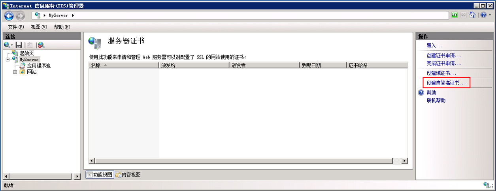
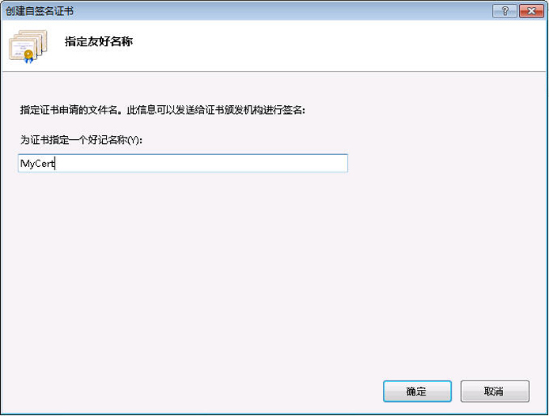
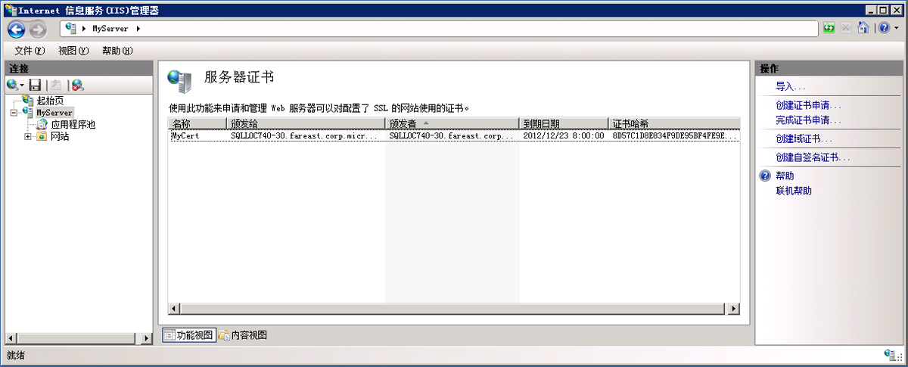
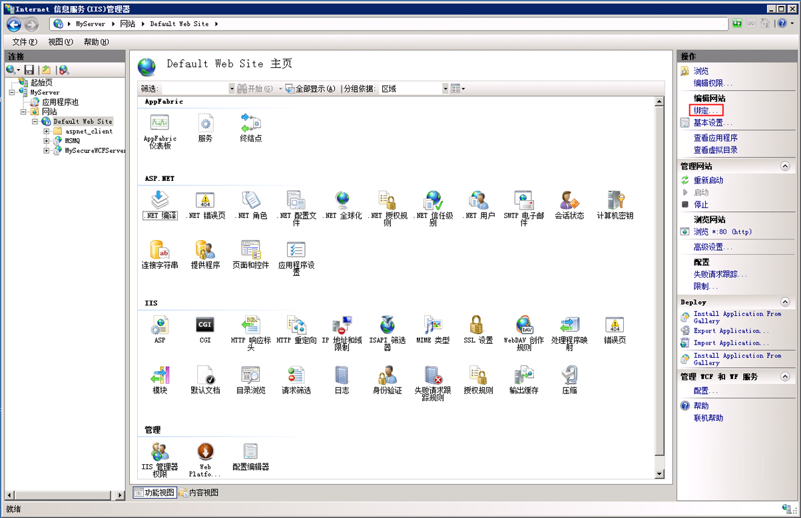
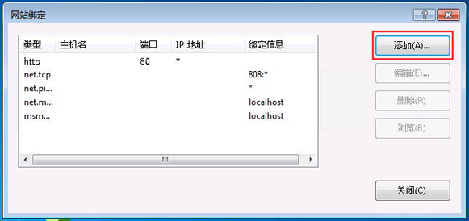
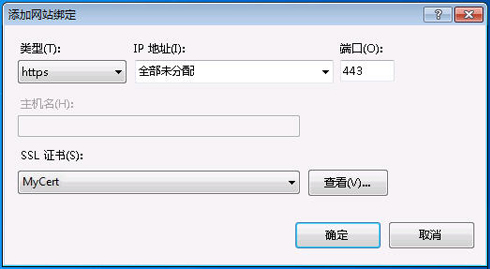
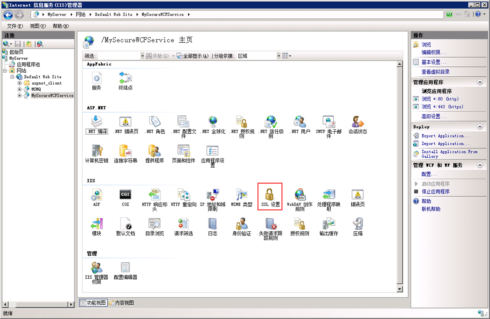
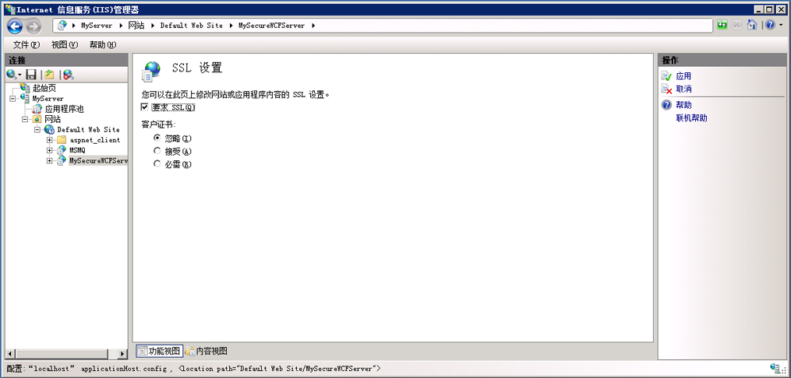

# <a name="how-to-configure-an-iis-hosted-wcf-service-with-ssl"></a><span data-ttu-id="e5e91-102">如何：使用 SSL 配置承载 IIS 的 WCF 服务</span><span class="sxs-lookup"><span data-stu-id="e5e91-102">How to: Configure an IIS-hosted WCF service with SSL</span></span>
<span data-ttu-id="e5e91-103">本主题介绍如何设置 IIS 承载的 WCF 服务以使用 HTTP 传输安全性。</span><span class="sxs-lookup"><span data-stu-id="e5e91-103">This topic describes how to set up an IIS-hosted WCF service to use HTTP transport security.</span></span> <span data-ttu-id="e5e91-104">HTTP 传输安全性要求 SSL 证书以便向 IIS 注册。</span><span class="sxs-lookup"><span data-stu-id="e5e91-104">HTTP transport security requires an SSL certificate to be registered with IIS.</span></span> <span data-ttu-id="e5e91-105">如果你没有 SSL 证书，则可以使用 IIS 生成测试证书。</span><span class="sxs-lookup"><span data-stu-id="e5e91-105">If you do not have an SSL certificate you can use IIS to generate a test certificate.</span></span> <span data-ttu-id="e5e91-106">接下来，您必须将一个 SSL 绑定添加到网站，并且配置该网站的身份验证属性。</span><span class="sxs-lookup"><span data-stu-id="e5e91-106">Next you must add an SSL binding to the web site and configure the web site’s authentication properties.</span></span> <span data-ttu-id="e5e91-107">最后，您需要配置 WCF 服务以使用 HTTPS。</span><span class="sxs-lookup"><span data-stu-id="e5e91-107">Finally you need to configure the WCF service to use HTTPS.</span></span>  
  
### <a name="creating-a-self-signed-certificate"></a><span data-ttu-id="e5e91-108">创建自签名证书</span><span class="sxs-lookup"><span data-stu-id="e5e91-108">Creating a Self-Signed Certificate</span></span>  
  
1. <span data-ttu-id="e5e91-109">打开 Internet 信息服务管理器 (inetmgr.exe)，在左侧树视图中选择您的计算机名称。</span><span class="sxs-lookup"><span data-stu-id="e5e91-109">Open Internet Information Services Manager (inetmgr.exe), and select your computer name in the left-hand tree view.</span></span> <span data-ttu-id="e5e91-110">在屏幕的右侧选择“服务器证书”</span><span class="sxs-lookup"><span data-stu-id="e5e91-110">On the right-hand side of the screen select Server Certificates</span></span>  
  
     <span data-ttu-id="e5e91-111"></span><span class="sxs-lookup"><span data-stu-id="e5e91-111"></span></span>  
  
2. <span data-ttu-id="e5e91-112">在服务器证书窗口中单击**创建自签名证书...**</span><span class="sxs-lookup"><span data-stu-id="e5e91-112">In the Server Certificates window click the **Create Self-Signed Certificate….**</span></span> <span data-ttu-id="e5e91-113">链接。</span><span class="sxs-lookup"><span data-stu-id="e5e91-113">Link.</span></span>  
  
     <span data-ttu-id="e5e91-114"></span><span class="sxs-lookup"><span data-stu-id="e5e91-114"></span></span>  
  
3. <span data-ttu-id="e5e91-115">输入的自签名证书的友好名称，然后单击**确定**。</span><span class="sxs-lookup"><span data-stu-id="e5e91-115">Enter a friendly name for the self-signed certificate and click **OK**.</span></span>  
  
     <span data-ttu-id="e5e91-116"></span><span class="sxs-lookup"><span data-stu-id="e5e91-116"></span></span>  
  
     <span data-ttu-id="e5e91-117">新创建的自签名的证书的详细信息现在可显示**服务器证书**窗口。</span><span class="sxs-lookup"><span data-stu-id="e5e91-117">The newly created self-signed certificate details are now shown in the **Server Certificates** window.</span></span>  
  
     <span data-ttu-id="e5e91-118"></span><span class="sxs-lookup"><span data-stu-id="e5e91-118"></span></span>  
  
     <span data-ttu-id="e5e91-119">生成的证书将安装在“受信任的根证书颁发机构”存储区中。</span><span class="sxs-lookup"><span data-stu-id="e5e91-119">The generated certificate is installed in the Trusted Root Certification Authorities store.</span></span>  
  
### <a name="add-ssl-binding"></a><span data-ttu-id="e5e91-120">添加 SSL 绑定</span><span class="sxs-lookup"><span data-stu-id="e5e91-120">Add SSL Binding</span></span>  
  
1. <span data-ttu-id="e5e91-121">仍在 Internet 信息服务管理器中，展开**站点**文件夹，然后**Default Web Site**屏幕左侧树视图中的文件夹。</span><span class="sxs-lookup"><span data-stu-id="e5e91-121">Still in Internet Information Services Manager, expand the **Sites** folder and then the **Default Web Site** folder in the tree view on the left-hand side of the screen.</span></span>  
  
2. <span data-ttu-id="e5e91-122">单击**绑定...**</span><span class="sxs-lookup"><span data-stu-id="e5e91-122">Click the **Bindings….**</span></span> <span data-ttu-id="e5e91-123">中的链接**操作**窗口的右上部分中的部分。</span><span class="sxs-lookup"><span data-stu-id="e5e91-123">Link in the **Actions** section in the upper right hand portion of the window.</span></span>  
  
     <span data-ttu-id="e5e91-124"></span><span class="sxs-lookup"><span data-stu-id="e5e91-124"></span></span>  
  
3. <span data-ttu-id="e5e91-125">在网站绑定窗口中单击**添加**按钮。</span><span class="sxs-lookup"><span data-stu-id="e5e91-125">In the Site Bindings window click the **Add** button.</span></span>  
  
     <span data-ttu-id="e5e91-126"></span><span class="sxs-lookup"><span data-stu-id="e5e91-126"></span></span>  
  
4. <span data-ttu-id="e5e91-127">在中**添加网站绑定**对话框中，选择 https 的类型和您刚的自签名证书的友好名称创建。</span><span class="sxs-lookup"><span data-stu-id="e5e91-127">In the **Add Site Binding** dialog, select https for the type and the friendly name of the self-signed certificate you just created.</span></span>  
  
     <span data-ttu-id="e5e91-128"></span><span class="sxs-lookup"><span data-stu-id="e5e91-128"></span></span>  
  
### <a name="configure-virtual-directory-for-ssl"></a><span data-ttu-id="e5e91-129">配置 SSL 的虚拟目录</span><span class="sxs-lookup"><span data-stu-id="e5e91-129">Configure Virtual Directory for SSL</span></span>  
  
1. <span data-ttu-id="e5e91-130">仍在 Internet 信息服务管理器中，选择包含您 WCF 安全服务的虚拟目录。</span><span class="sxs-lookup"><span data-stu-id="e5e91-130">Still in Internet Information Services Manager, select the virtual directory that contains your WCF secure service.</span></span>  
  
2. <span data-ttu-id="e5e91-131">在窗口的中心窗格中，选择**SSL 设置**的 IIS 部分中。</span><span class="sxs-lookup"><span data-stu-id="e5e91-131">In the center pane of the window, select **SSL Settings** in the IIS section.</span></span>  
  
     <span data-ttu-id="e5e91-132"></span><span class="sxs-lookup"><span data-stu-id="e5e91-132"></span></span>  
  
3. <span data-ttu-id="e5e91-133">在 SSL 设置窗格中，选择**要求 SSL**复选框，单击**应用**中的链接**操作**屏幕的右侧部分。</span><span class="sxs-lookup"><span data-stu-id="e5e91-133">In the SSL Settings pane, select the **Require SSL** checkbox and click the **Apply** link in the **Actions** section on the right hand side of the screen.</span></span>  
  
     <span data-ttu-id="e5e91-134"></span><span class="sxs-lookup"><span data-stu-id="e5e91-134"></span></span>  
  
### <a name="configure-wcf-service-for-http-transport-security"></a><span data-ttu-id="e5e91-135">为 HTTP 传输安全配置 WCF 服务</span><span class="sxs-lookup"><span data-stu-id="e5e91-135">Configure WCF Service for HTTP Transport Security</span></span>  
  
1. <span data-ttu-id="e5e91-136">在 WCF 服务的 web.config 中，配置 HTTP 绑定以便使用传输安全，如下面的 XML 中所示。</span><span class="sxs-lookup"><span data-stu-id="e5e91-136">In the WCF service’s web.config configure the HTTP binding to use transport security as shown in the following XML.</span></span>  
  
    ```xml  
    <bindings>  
          <basicHttpBinding>  
            <binding name="secureHttpBinding">  
              <security mode="Transport">  
                <transport clientCredentialType="None"/>  
              </security>  
            </binding>  
          </basicHttpBinding>  
    </bindings>  
    ```  
  
2. <span data-ttu-id="e5e91-137">指定您的服务和服务终结点，如下面的 XML 中所示。</span><span class="sxs-lookup"><span data-stu-id="e5e91-137">Specify your service and service endpoint as shown in the following XML.</span></span>  
  
    ```xml  
    <services>  
          <service name="MySecureWCFService.Service1">  
            <endpoint address=""  
                      binding="basicHttpBinding"  
                      bindingConfiguration="secureHttpBinding"  
                      contract="MySecureWCFService.IService1"/>  
  
            <endpoint address="mex"  
                      binding="mexHttpsBinding"  
                      contract="IMetadataExchange" />  
          </service>  
    </services>  
    ```  
  
## <a name="example"></a><span data-ttu-id="e5e91-138">示例</span><span class="sxs-lookup"><span data-stu-id="e5e91-138">Example</span></span>  
 <span data-ttu-id="e5e91-139">以下是使用 HTTP 传输安全的 WCF 服务的 web.config 文件的完整示例</span><span class="sxs-lookup"><span data-stu-id="e5e91-139">The following is a complete example of a web.config file for a WCF service using HTTP transport security</span></span>  
  
```xml  
<?xml version="1.0"?>  
<configuration>  
  
  <system.web>  
    <compilation debug="true" targetFramework="4.0" />  
  </system.web>  
  <system.serviceModel>  
    <services>  
      <service name="MySecureWCFService.Service1">  
        <endpoint address=""  
                  binding="basicHttpBinding"  
                  bindingConfiguration="secureHttpBinding"  
                  contract="MySecureWCFService.IService1"/>  
  
        <endpoint address="mex"  
                  binding="mexHttpsBinding"  
                  contract="IMetadataExchange" />  
      </service>  
    </services>  
    <bindings>  
      <basicHttpBinding>  
        <binding name="secureHttpBinding">  
          <security mode="Transport">  
            <transport clientCredentialType="None"/>  
          </security>  
        </binding>  
      </basicHttpBinding>  
    </bindings>  
    <behaviors>  
      <serviceBehaviors>  
        <behavior>  
          <!-- To avoid disclosing metadata information, set the value below to false and remove the metadata endpoint above before deployment -->  
          <serviceMetadata httpsGetEnabled="true"/>  
          <!-- To receive exception details in faults for debugging purposes, set the value below to true.  Set to false before deployment to avoid disclosing exception information -->  
          <serviceDebug includeExceptionDetailInFaults="false"/>  
        </behavior>  
      </serviceBehaviors>  
    </behaviors>  
    <serviceHostingEnvironment multipleSiteBindingsEnabled="true" />  
  </system.serviceModel>  
  <system.webServer>  
    <modules runAllManagedModulesForAllRequests="true"/>  
  </system.webServer>  
  
</configuration>  
```  
  
## <a name="see-also"></a><span data-ttu-id="e5e91-140">请参阅</span><span class="sxs-lookup"><span data-stu-id="e5e91-140">See also</span></span>

- [<span data-ttu-id="e5e91-141">在 Internet Information Services 中承载</span><span class="sxs-lookup"><span data-stu-id="e5e91-141">Hosting in Internet Information Services</span></span>](../../../../docs/framework/wcf/feature-details/hosting-in-internet-information-services.md)
- [<span data-ttu-id="e5e91-142">Internet 信息服务承载说明</span><span class="sxs-lookup"><span data-stu-id="e5e91-142">Internet Information Service Hosting Instructions</span></span>](../../../../docs/framework/wcf/samples/internet-information-service-hosting-instructions.md)
- [<span data-ttu-id="e5e91-143">Internet Information Services 承载最佳做法</span><span class="sxs-lookup"><span data-stu-id="e5e91-143">Internet Information Services Hosting Best Practices</span></span>](../../../../docs/framework/wcf/feature-details/internet-information-services-hosting-best-practices.md)
- [<span data-ttu-id="e5e91-144">使用内联代码的 IIS 承载</span><span class="sxs-lookup"><span data-stu-id="e5e91-144">IIS Hosting Using Inline Code</span></span>](../../../../docs/framework/wcf/samples/iis-hosting-using-inline-code.md)
