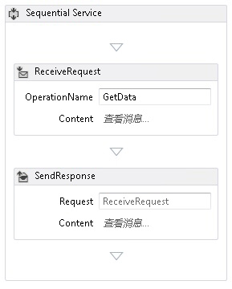
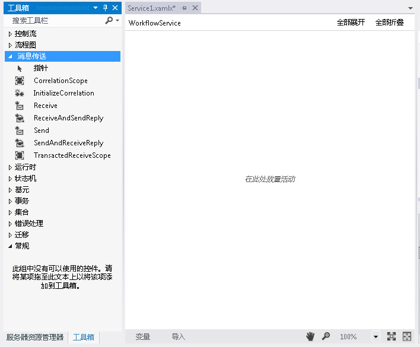
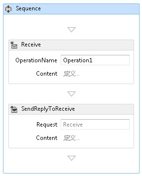
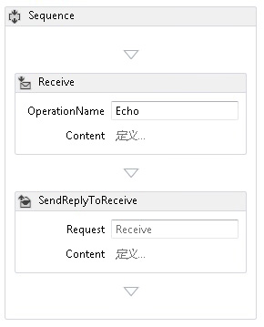
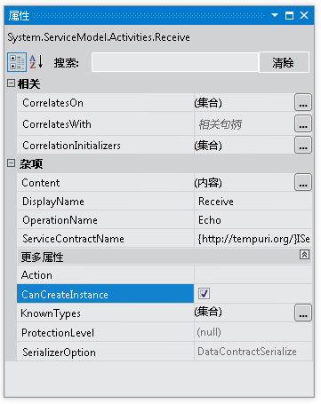
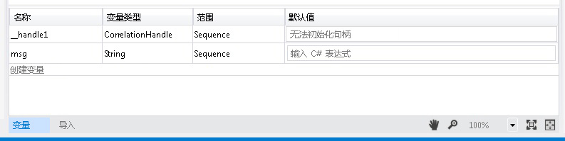
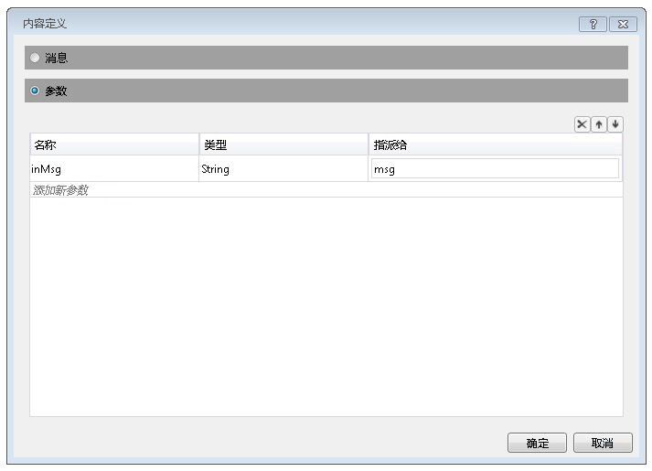
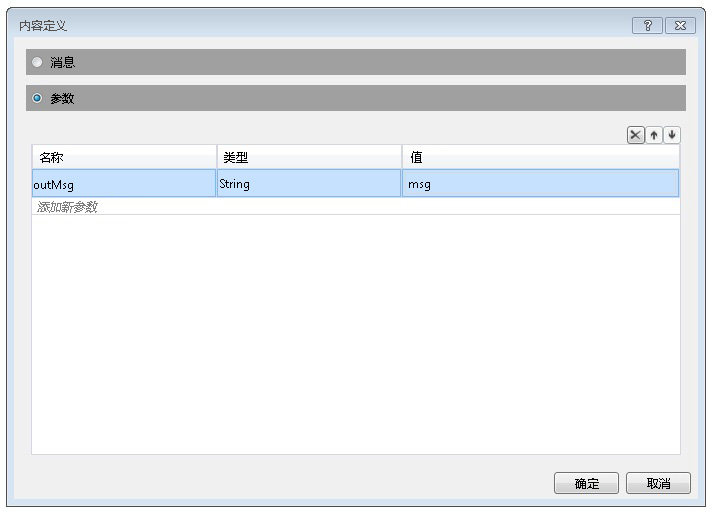
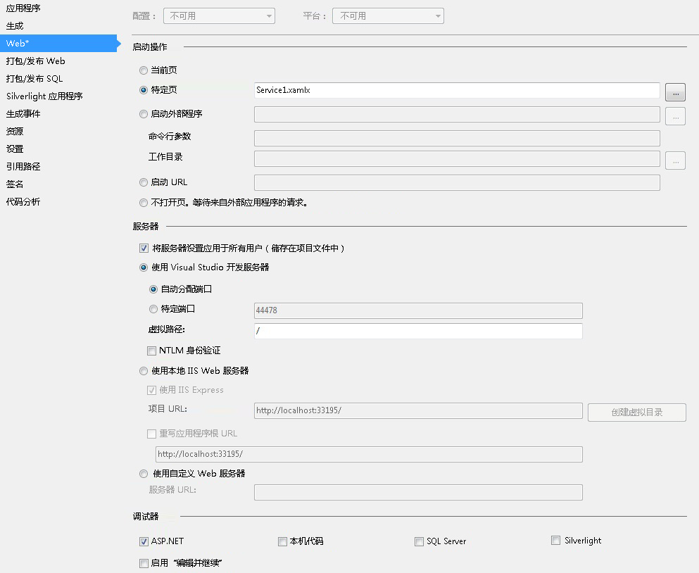

# 如何：使用消息传递活动创建工作流服务
此主题说明如何使用消息传递活动创建简单工作流服务， 本主题着重介绍工作流服务的创建机制，其中的服务仅包含消息传递活动。 在实际服务中，工作流包含其他许多活动。 该服务实现一个名为 Echo 的操作，来获取一个字符串并将该字符串返回到调用方。 本主题是一系列主题（包含两个主题）中的第一个。 下一主题[How To: 服务从工作流应用程序访问](../../../../docs/framework/wcf/feature-details/how-to-access-a-service-from-a-workflow-application.md)讨论如何创建工作流应用程序可以调用在本主题中创建服务。  
  
### 创建工作流服务项目  
  
1.  启动 [!INCLUDE[vs_current_long](../../../../includes/vs-current-long-md.md)]。  
  
2.  单击**文件**菜单上，选择**新建**，，然后**项目**以显示**新建项目对话框**。 选择**工作流**从已安装模板列表和**WCF 工作流服务应用程序**从项目类型列表。 将项目`MyWFService`，并且使用默认位置，如下面的插图中所示。  
  
     单击**确定**按钮以关闭**新建项目对话框**。  
  
3.  创建项目之后，将在设计器中打开 Service1.xamlx 文件，如以下插图所示。  
  
       
  
     右键单击标记为活动**顺序服务**和选择**删除**。  
  
### 实现工作流服务  
  
1.  选择**工具箱**屏幕显示工具箱，然后单击图钉保持窗口打开左侧的选项卡。 展开**消息**部分的工具箱以显示消息传递活动和消息传递活动模板，如在下图中所示。  
  
       
  
2.  拖放式**ReceiveAndSendReply**到工作流设计器的模板。 这将创建<!--zz <xref:System.ServiceModel.Activities.Sequence>-->`System.ServiceModel.Activities.Sequence`活动**接收**活动跟<xref:System.ServiceModel.Activities.SendReply>活动下图中所示。  
  
       
  
     请注意，已将 <xref:System.ServiceModel.Activities.SendReply> 活动的<xref:System.ServiceModel.Activities.SendReply.Request%2A> 属性设置为 `Receive`，即<xref:System.ServiceModel.Activities.Receive> 活动要答复的<xref:System.ServiceModel.Activities.SendReply> 活动的名称。  
  
3.  在<xref:System.ServiceModel.Activities.Receive>活动类型`Echo`标记为文本框**OperationName**。 此步骤定义服务所实现操作的名称。  
  
       
  
4.  与<xref:System.ServiceModel.Activities.Receive>活动选择，打开属性窗口如果不是通过单击已打开**视图**菜单并选择**属性窗口**。 在**属性窗口**向下滚动，直到你看到**CanCreateInstance**单击复选框，如在下图中所示。 此设置使工作流服务主机可以在接收消息时创建服务的新实例（如果需要）。  
  
       
  
5.  选择<!--zz <xref:System.ServiceModel.Activities.Sequence>-->`System.ServiceModel.Activities.Sequence`活动，然后单击**变量**中的设计器左下角的按钮。 这样将显示变量编辑器。 单击**创建变量**链接添加变量来存储发送到操作的字符串。 将变量命名`msg`并设置其**变量**类型到字符串，如下面的插图中所示。  
  
       
  
     单击**变量**按钮以关闭变量编辑器。  
  
6.  单击**定义...** 在链接**内容**文本框中<xref:System.ServiceModel.Activities.Receive>活动来显示**内容定义**对话框。 选择**参数**单选按钮，单击**添加新参数**链接，键入`inMsg`中**名称**文本框中，选择**字符串**中**类型**下拉列表框中，并键入`msg`中**分配到**文本框中，如下面的插图中所示。  
  
       
  
     此步骤指定由 Receive 活动接收字符串参数，并且将该数据绑定到 `msg` 变量。 单击**确定**关闭**内容定义**对话框。  
  
7.  单击**定义...**中链接**内容**框中<xref:System.ServiceModel.Activities.SendReply>活动来显示**内容定义**对话框。 选择**参数**单选按钮，单击**添加新参数**链接，键入`outMsg`中**名称**文本框中，选择**字符串**中**类型**下拉列表框中，和`msg`中**值**文本框中，如下面的插图中所示。  
  
       
  
     此步骤指定由 <xref:System.ServiceModel.Activities.SendReply> 活动发送消息或消息协定类型，并且将该数据绑定到 `msg` 变量。 由于此活动是 <xref:System.ServiceModel.Activities.SendReply> 活动，因此这意味着 `msg` 中的数据用于填充活动发送回客户端的消息。 单击**确定**关闭**内容定义**对话框。  
  
8.  保存并生成解决方案，通过单击**生成**菜单并选择**生成解决方案**。  
  
## 配置工作流服务项目  
 现在工作流服务是完整的。 本节介绍如何配置工作流服务解决方案以易于承载和运行。 此解决方案使用 ASP.NET Development Server 承载服务。  
  
#### 设置项目启动选项  
  
1.  在**解决方案资源管理器**，右键单击**MyWFService**和选择**属性**以显示**项目属性**对话框。  
  
2.  选择**Web**选项卡并选择**特定页**下**启动操作**和类型`Service1.xamlx`在文本框中，如下面的插图中所示。  
  
       
  
     此步骤在 ASP.NET Development Server 中承载 Service1.xamlx 中定义的服务。  
  
3.  按 Ctrl + F5 启动服务。 ASP.NET Development Server 图标显示在桌面的右下角，如以下图像所示。  
  
       
  
     此外，Internet Explorer 显示服务的 WCF 服务帮助页。  
  
       
  
4.  继续[How To: 服务从工作流应用程序访问](../../../../docs/framework/wcf/feature-details/how-to-access-a-service-from-a-workflow-application.md)主题，以创建调用此服务的工作流客户端。  
  
## 请参阅  
 [工作流服务](../../../../docs/framework/wcf/feature-details/workflow-services.md)  
 [承载工作流服务概述](../../../../docs/framework/wcf/feature-details/hosting-workflow-services-overview.md)  
 [消息传递活动](../../../../docs/framework/wcf/feature-details/messaging-activities.md)
