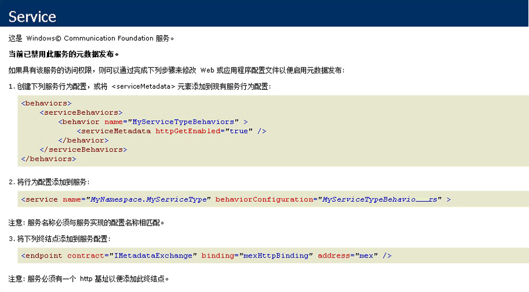

# <a name="how-to-host-a-non-service-workflow-in-iis"></a>如何：在 IIS 中承载非服务工作流
可在 IIS/WAS 下承载不属于工作流服务的工作流。 这在您需要承载他人编写的工作流时非常有用。 例如，如果您重新承载工作流设计器，并允许用户创建自己的工作流。  通过在 IIS 中承载非服务工作流，可支持进程回收、空闲时关闭、进程运行状况监视和基于消息的激活等功能。 承载于 IIS 的工作流服务包含 <xref:System.ServiceModel.Activities.Receive> 活动，并在 IIS 接收到消息时激活。 非服务工作流不包含消息传递活动，默认情况下无法通过发送消息激活这些工作流。  您必须从 <xref:System.ServiceModel.Activities.WorkflowHostingEndpoint> 派生一个类，并定义包含创建工作流实例的操作的服务协定。 本主题将指导你完成创建简单工作流、 定义客户端可用来激活工作流服务协定和派生类从<xref:System.ServiceModel.Activities.WorkflowHostingEndpoint>它使用服务协定侦听工作流创建请求。  
  
### <a name="create-a-simple-workflow"></a>创建简单工作流  
  
1.  新建一个名为 [!INCLUDE[vs_current_long](../../../../includes/vs-current-long-md.md)] 的新的空 `CreationEndpointTest` 解决方案。  
  
2.  向该解决方案添加一个名为 `SimpleWorkflow` 的新 WCF 工作流服务应用程序项目。 工作流设计器将打开。  
  
3.  删除 ReceiveRequest 和 SendResponse 活动。 这些是使工作流成为工作流服务的活动。 由于我们没有使用工作流服务，因此不再需要它们。  
  
4.  设置为"顺序工作流"的序列活动的 DisplayName。  
  
5.  将 Service1.xamlx 重命名为 Workflow1.xamlx。  
  
6.  单击顺序活动外部的设计器并将设置为"Workflow1"的 Name 和 ConfigurationName 属性  
  
7.  将 <xref:System.Activities.Statements.WriteLine> 活动拖到 <xref:System.Activities.Statements.Sequence> 中。 <xref:System.Activities.Statements.WriteLine>在找不到活动**基元**工具箱的部分。 设置<xref:System.Activities.Statements.WriteLine.Text%2A>属性<xref:System.Activities.Statements.WriteLine>活动"Hello，world"。  
  
     现在，此工作流应该如下图所示。  
  
       
  
### <a name="create-the-workflow-creation-service-contract"></a>创建工作流创建服务协定  
  
1.  向 `Shared` 解决方案中添加一个名为 `CreationEndpointTest` 的新类库项目。  
  
2.  向 `Shared` 项目中添加对 System.ServiceModel.dll、System.Configuration 和 System.ServiceModel.Activities 的引用。  
  
3.  将 Class1.cs 文件重命名为 IWorkflowCreation.cs，并将以下代码添加到此文件中。  
  
    ```  
    using System;  
    using System.Collections.Generic;  
    using System.Linq;  
    using System.Text;  
    using System.ServiceModel;  
  
    namespace Shared  
    {  
        //service contract exposed from the endpoint  
        [ServiceContract(Name = "IWorkflowCreation")]  
        public interface IWorkflowCreation  
        {  
            [OperationContract(Name = "Create")]  
            Guid Create(IDictionary<string, object> inputs);  
  
            [OperationContract(Name = "CreateWithInstanceId", IsOneWay = true)]  
            void CreateWithInstanceId(IDictionary<string, object> inputs, Guid instanceId);  
        }  
    }  
    ```  
  
     此协定定义两个操作，用于创建您刚刚创建的非服务工作流的新实例。 一个操作创建具有生成的实例 ID 的新实例，另一个操作允许您为新工作流实例指定实例 ID。  两种方法都允许您向新工作流实例传入参数。 此协定将由公开<xref:System.ServiceModel.Activities.WorkflowHostingEndpoint>以允许客户端创建非服务工作流的新实例。  
  
### <a name="derive-a-class-from-workflowhostingendpoint"></a>从 WorkflowHostingEndpoint 派生类  
  
1.  添加新的类调用`CreationEndpoint`派生自<xref:System.ServiceModel.Activities.WorkflowHostingEndpoint>到`Shared`项目。  
  
    ```  
    using System;  
    using System.Collections.Generic;  
    using System.Diagnostics;  
    using System.Globalization;  
    using System.ServiceModel;  
    using System.ServiceModel.Activities;  
    using System.ServiceModel.Channels;  
  
    namespace Shared  
    {  
        public class CreationEndpoint : WorkflowHostingEndpoint  
        {  
        }  
    }  
    ```  
  
2.  将名为 <xref:System.Uri> 的本地静态 `defaultBaseUri` 变量添加到 `CreationEndpoint` 类。  
  
    ```  
    public class CreationEndpoint : WorkflowHostingEndpoint  
    {  
        static Uri defaultBaseUri;  
    }  
    ```  
  
3.  将下面的构造函数添加到 `CreationEndpoint` 类。 请注意，在对基构造函数的调用中指定 `IWorkflowCreation` 服务协定。  
  
    ```  
    public CreationEndpoint(Binding binding, EndpointAddress address)  
       : base(typeof(IWorkflowCreation), binding, address)  
       {  
       }  
    ```  
  
4.  将下面的默认构造函数添加到 `CreationEndpoint` 类。  
  
    ```  
    public CreationEndpoint()  
       : this(GetDefaultBinding(),  
       new EndpointAddress(new Uri(DefaultBaseUri, new Uri(Guid.NewGuid().ToString(), UriKind.Relative))))  
       {  
       }  
    ```  
  
5.  将静态 `DefaultBaseUri` 属性添加到 `CreationEndpoint` 类。 此属性将用于保留默认的基 URL（如未提供）。  
  
    ```  
    static Uri DefaultBaseUri  
    {  
       get  
       {  
          if (defaultBaseUri == null)  
          {  
             defaultBaseUri = new Uri(string.Format(CultureInfo.InvariantCulture, "net.pipe://localhost/workflowCreationEndpoint/{0}/{1}",  
                Process.GetCurrentProcess().Id,  
                AppDomain.CurrentDomain.Id));  
          }  
          return defaultBaseUri;  
       }  
     }  
    ```  
  
6.  创建下面的方法来获取默认绑定，以供创建终结点使用。  
  
    ```  
    //defaults to NetNamedPipeBinding  
    public static Binding GetDefaultBinding()  
    {  
       return new NetNamedPipeBinding(NetNamedPipeSecurityMode.None) { TransactionFlow = true };  
    }  
    ```  
  
7.  重写 <xref:System.ServiceModel.Activities.WorkflowHostingEndpoint.OnGetInstanceId%2A> 方法以返回工作流实例 ID。 如果`Action`标头"创建"以返回一个空 GUID，如果`Action`标头以"CreateWithInstanceId"返回 GUID 传递到方法。 否则，将引发 <xref:System.InvalidOperationException>。 这些 `Action` 标头与 `IWorkflowCreation` 服务协定中定义的两个操作相对应。  
  
    ```  
    protected override Guid OnGetInstanceId(object[] inputs, OperationContext operationContext)  
    {  
       //Create was called by client  
       if (operationContext.IncomingMessageHeaders.Action.EndsWith("Create"))  
       {  
          return Guid.Empty;  
       }  
       //CreateWithInstanceId was called by client  
       else if (operationContext.IncomingMessageHeaders.Action.EndsWith("CreateWithInstanceId"))  
       {  
          return (Guid)inputs[1];  
       }  
       else  
       {  
          throw new InvalidOperationException("Invalid Action: " + operationContext.IncomingMessageHeaders.Action);  
       }  
    }  
    ```  
  
8.  重写 <xref:System.ServiceModel.Activities.WorkflowHostingEndpoint.OnGetCreationContext%2A> 方法以创建 <xref:System.ServiceModel.Activities.WorkflowCreationContext> 并为工作流添加任何参数，将实例 ID 发送到客户端，然后返回 <xref:System.ServiceModel.Activities.WorkflowCreationContext>。  
  
    ```  
    protected override WorkflowCreationContext OnGetCreationContext(object[] inputs, OperationContext operationContext, Guid instanceId, WorkflowHostingResponseContext responseContext)  
    {  
       WorkflowCreationContext creationContext = new WorkflowCreationContext();  
       if (operationContext.IncomingMessageHeaders.Action.EndsWith("Create") || (operationContext.IncomingMessageHeaders.Action.EndsWith("CreateWithInstanceId")))  
       {  
          Dictionary<string, object> arguments = (Dictionary<string, object>)inputs[0];  
          if (arguments != null && arguments.Count > 0)  
          {  
             foreach (KeyValuePair<string, object> pair in arguments)  
             {  
                //arguments to pass to the workflow  
                creationContext.WorkflowArguments.Add(pair.Key, pair.Value);  
             }  
          }  
          //reply to client with instanceId  
          responseContext.SendResponse(instanceId, null);  
       }  
       else  
       {  
          throw new InvalidOperationException("Invalid Action: " + operationContext.IncomingMessageHeaders.Action);  
       }  
       return creationContext;  
    }  
    ```  
  
### <a name="create-a-standard-endpoint-element-to-allow-you-to-configure-the-workflowcreationendpoint"></a>创建标准终结点元素以允许您配置 WorkflowCreationEndpoint  
  
1.  添加对 `CreationEndpoint` 项目中的 Shared 的引用。  
  
2.  向 `CreationEndpointElement` 项目中添加一个派生自 <xref:System.ServiceModel.Configuration.StandardEndpointElement> 的名为 `CreationEndpoint` 的新类。 此类将表示 web.config 文件中的 `CreationEndpoint`。  
  
    ```  
    using System;  
    using System.Configuration;  
    using System.ServiceModel.Activities;  
    using System.ServiceModel.Configuration;  
    using System.ServiceModel.Description;  
    using Shared;  
  
    namespace CreationEndpointTest  
    {  
        //config element for CreationEndpoint  
        public class CreationEndpointElement : StandardEndpointElement  
        {  
       }  
    ```  
  
3.  添加名为 `EndpointType` 的属性以返回终结点的类型。  
  
    ```  
    protected override Type EndpointType  
    {  
       get { return typeof(CreationEndpoint); }  
    }  
    ```  
  
4.  重写 <xref:System.ServiceModel.Configuration.StandardEndpointElement.CreateServiceEndpoint%2A> 方法并返回新的 `CreationEndpoint`。  
  
    ```  
    protected override ServiceEndpoint CreateServiceEndpoint(ContractDescription contractDescription)  
    {  
       return new CreationEndpoint();  
    }  
    ```  
  
5.  重载 <xref:System.ServiceModel.Configuration.StandardEndpointElement.OnApplyConfiguration%2A>、<xref:System.ServiceModel.Configuration.StandardEndpointElement.OnApplyConfiguration%2A>、<xref:System.ServiceModel.Configuration.StandardEndpointElement.OnInitializeAndValidate%2A> 和 <xref:System.ServiceModel.Configuration.StandardEndpointElement.OnInitializeAndValidate%2A> 方法。 只需定义这些方法，无需向其中添加任何代码。  
  
    ```  
    protected override void OnApplyConfiguration(ServiceEndpoint endpoint, ChannelEndpointElement channelEndpointElement)  
    {  
    }  
  
    protected override void OnApplyConfiguration(ServiceEndpoint endpoint, ServiceEndpointElement serviceEndpointElement)  
    {  
    }  
  
    protected override void OnInitializeAndValidate(ChannelEndpointElement channelEndpointElement)  
    {  
    }  
  
    protected override void OnInitializeAndValidate(ServiceEndpointElement serviceEndpointElement)  
    {  
    }  
    ```  
  
6.  将 `CreationEndpoint` 的集合类添加到 `CreationEndpoint` 项目的 CreationEndpointElement.cs 文件中。 配置使用此类来保留 web.config 文件中的大量 `CreationEndpoint` 实例。  
  
    ```  
    public class CreationEndpointCollection : StandardEndpointCollectionElement<CreationEndpoint, CreationEndpointElement>  
    {  
    }  
    ```  
  
7.  生成解决方案。  
  
### <a name="host-the-workflow-in-iis"></a>在 IIS 中承载工作流  
  
1.  在 IIS 中新建一个名为 `MyCreationEndpoint` 的应用程序。  
  
2.  将工作流设计器生成的 workflow1.xaml 文件复制到应用程序目录中，并将此文件重命名为 workflow1.xamlx。  
  
3.  将 shared.dll 和 CreationEndpoint.dll 文件复制到应用程序的 bin 目录（如果 bin 目录不存在，则创建它）。  
  
4.  用下面的代码替换 `CreationEndpoint` 项目中 Web.config 文件的内容。  
  
    ```xaml  
    <?xml version="1.0" encoding="utf-8" ?>  
    <configuration>  
      <system.web>  
        <compilation debug="true" targetFramework="4.0" />  
      </system.web>   
    </configuration>  
    ```  
  
5.  在 `<system.web>` 元素后，通过添加下面的配置代码来注册 `CreationEndpoint`。  
  
    ```xml  
    <system.serviceModel>  
        <!--register CreationEndpoint-->  
        <serviceHostingEnvironment multipleSiteBindingsEnabled="true" />  
        <extensions>  
          <endpointExtensions>  
            <add name="creationEndpoint" type="CreationEndpointTest.CreationEndpointCollection, CreationEndpoint, Version=1.0.0.0, Culture=neutral, PublicKeyToken=null" />  
          </endpointExtensions>  
        </extensions>  
    </system.serviceModel>  
    ```  
  
     这将注册 `CreationEndpointCollection` 类，以便您可以在 web.config 文件中配置 `CreationEndpoint`。  
  
6.  添加`<service>`元素 (后\</extensions > 标记) 与`CreationEndpoint`终结点将侦听传入消息。  
  
    ```xml  
    <services>  
          <!-- add endpoint to service-->  
          <service name="Workflow1" behaviorConfiguration="basicConfig" >  
            <endpoint kind="creationEndpoint" binding="basicHttpBinding" address=""/>  
          </service>  
        </services>  
    ```  
  
7.  添加\<行为 > 元素 (后 \< /> 标记) 以启用服务元数据。  
  
    ```xml  
    <behaviors>  
          <serviceBehaviors>  
            <behavior name="basicConfig">  
              <serviceMetadata httpGetEnabled="true" />  
            </behavior>  
          </serviceBehaviors>  
        </behaviors>  
    ```  
  
8.  将 web.config 复制到你的 IIS 应用程序目录。  
  
9. 通过启动 Internet Explorer 并浏览到 http://localhost/MyCreationEndpoint/Workflow1.xamlx，测试创建终结点是否在工作。 Internet Explorer 应显示下面的屏幕：  
  
       
  
### <a name="create-a-client-that-will-call-the-creationendpoint"></a>创建将调用 CreationEndpoint 的客户端。  
  
1.  将新控制台应用程序添加到 `CreationEndpointTest` 解决方案。  
  
2.  添加对 System.ServiceModel.dll、System.ServiceModel.Activities 和 `Shared` 项目的引用。  
  
3.  在`Main`方法创建<xref:System.ServiceModel.ChannelFactory%601>类型的`IWorkflowCreation`并调用<xref:System.ServiceModel.ChannelFactory%601.CreateChannel%2A>。 这将返回一个代理。 然后，您可以对此代理调用 `Create` 以创建在 IIS 下承载的工作流实例：  
  
    ```  
    using System.Text;  
    using Shared;  
    using System.ServiceModel;  
  
    namespace CreationEndpointClient  
    {  
        class Program  
        {  
            static void Main(string[] args)  
            {  
                try  
                {  
                    //client using BasicHttpBinding  
                    IWorkflowCreation client = new ChannelFactory<IWorkflowCreation>(new BasicHttpBinding(), new EndpointAddress("http://localhost/CreationEndpoint/Workflow1.xamlx")).CreateChannel();  
  
                    Console.WriteLine("Workflow Instance created using CreationEndpoint added in config. Instance Id: {0}", client.Create(null));  
                    Console.WriteLine("Press return to exit ...");  
                    Console.ReadLine();  
                }  
                catch (Exception ex)  
                {  
                    Console.WriteLine(ex);  
                    Console.ReadLine();  
                }  
            }  
        }  
    }  
    ```  
  
4.  运行 CreationEndpointClient。 输出应如下所示：  
  
    ```Output  
    Workflow Instance created using CreationEndpoint added in config. Instance Id: 0875dac0-2b8b-473e-b3cc-abcb235e9693Press return to exit ...  
    ```  
  
    > [!NOTE]
    >  您将看不到工作流的输出，因为它正在 IIS 下运行，而 IIS 没有控制台输出。  
  
## <a name="example"></a>示例  
 以下是此示例的完整代码。  
  
```xaml  
<!-— workflow1.xamlx -->  
<WorkflowService mc:Ignorable="sap"   
                 ConfigurationName="Workflow1"   
                 sap:VirtualizedContainerService.HintSize="263,230"   
                 Name="Workflow1"   
                 mva:VisualBasic.Settings="Assembly references and imported namespaces serialized as XML namespaces"   
                 xmlns="http://schemas.microsoft.com/netfx/2009/xaml/servicemodel"   
                 xmlns:mc="http://schemas.openxmlformats.org/markup-compatibility/2006"   
                 xmlns:mv="clr-namespace:Microsoft.VisualBasic;assembly=System"   
                 xmlns:mva="clr-namespace:Microsoft.VisualBasic.Activities;assembly=System.Activities"   
                 xmlns:p="http://schemas.microsoft.com/netfx/2009/xaml/activities"   
                 xmlns:s="clr-namespace:System;assembly=mscorlib"   
                 xmlns:s1="clr-namespace:System;assembly=System"   
                 xmlns:s2="clr-namespace:System;assembly=System.Xml"   
                 xmlns:s3="clr-namespace:System;assembly=System.Core"   
                 xmlns:sad="clr-namespace:System.Activities.Debugger;assembly=System.Activities"   
                 xmlns:sap="http://schemas.microsoft.com/netfx/2009/xaml/activities/presentation"   
                 xmlns:scg="clr-namespace:System.Collections.Generic;assembly=System"   
                 xmlns:scg1="clr-namespace:System.Collections.Generic;assembly=System.ServiceModel"   
                 xmlns:scg2="clr-namespace:System.Collections.Generic;assembly=System.Core"   
                 xmlns:scg3="clr-namespace:System.Collections.Generic;assembly=mscorlib"   
                 xmlns:sd="clr-namespace:System.Data;assembly=System.Data"   
                 xmlns:sl="clr-namespace:System.Linq;assembly=System.Core"   
                 xmlns:st="clr-namespace:System.Text;assembly=mscorlib"   
                 xmlns:x="http://schemas.microsoft.com/winfx/2006/xaml">  
  <p:Sequence DisplayName="Sequential Service"   
              sad:XamlDebuggerXmlReader.FileName="c:\projects\CreationEndpointTest\CreationEndpoint\Service1.xamlx"   
              sap:VirtualizedContainerService.HintSize="233,200"   
              mva:VisualBasic.Settings="Assembly references and imported namespaces serialized as XML namespaces">  
    <p:Sequence.Variables>  
      <p:Variable x:TypeArguments="CorrelationHandle" Name="handle" />  
      <p:Variable x:TypeArguments="x:Int32" Name="data" />  
    </p:Sequence.Variables>  
    <sap:WorkflowViewStateService.ViewState>  
      <scg3:Dictionary x:TypeArguments="x:String, x:Object">  
        <x:Boolean x:Key="IsExpanded">True</x:Boolean>  
      </scg3:Dictionary>  
    </sap:WorkflowViewStateService.ViewState>  
    <p:WriteLine sap:VirtualizedContainerService.HintSize="211,61" Text="Hello, world" />  
  </p:Sequence>  
</WorkflowService>  
```  
  
```csharp  
// CreationEndpointElement.cs  
using System;  
using System.Configuration;  
using System.ServiceModel.Activities;  
using System.ServiceModel.Configuration;  
using System.ServiceModel.Description;  
using Shared;  
  
namespace CreationEndpointTest  
{  
    //config element for CreationEndpoint  
    public class CreationEndpointElement : StandardEndpointElement  
    {  
        protected override Type EndpointType  
        {  
            get { return typeof(CreationEndpoint); }  
        }  
  
        protected override ConfigurationPropertyCollection Properties  
        {  
            get  
            {  
                ConfigurationPropertyCollection properties = base.Properties;  
                properties.Add(new ConfigurationProperty("name", typeof(String), null, ConfigurationPropertyOptions.IsRequired));  
                return properties;  
            }  
        }  
  
        protected override ServiceEndpoint CreateServiceEndpoint(ContractDescription contractDescription)  
        {  
            return new CreationEndpoint();  
        }  
  
        protected override void OnApplyConfiguration(ServiceEndpoint endpoint, ChannelEndpointElement channelEndpointElement)  
        {  
        }  
  
        protected override void OnApplyConfiguration(ServiceEndpoint endpoint, ServiceEndpointElement serviceEndpointElement)  
        {  
        }  
  
        protected override void OnInitializeAndValidate(ChannelEndpointElement channelEndpointElement)  
        {  
        }  
  
        protected override void OnInitializeAndValidate(ServiceEndpointElement serviceEndpointElement)  
        {  
        }  
    }  
  
    public class CreationEndpointCollection : StandardEndpointCollectionElement<CreationEndpoint, CreationEndpointElement>  
    {  
    }  
}  
```  
  
```xml  
<!-- web.config -->  
<?xml version="1.0" encoding="utf-8" ?>  
<configuration>  
  <system.web>  
    <compilation debug="true" targetFramework="4.0" />  
  </system.web>  
  <system.serviceModel>  
    <!--register CreationEndpoint-->  
    <serviceHostingEnvironment multipleSiteBindingsEnabled="true" />  
    <extensions>  
      <endpointExtensions>  
        <add name="creationEndpoint" type="CreationEndpointTest.CreationEndpointCollection, Shared, Version=1.0.0.0, Culture=neutral, PublicKeyToken=null" />  
      </endpointExtensions>  
    </extensions>  
    <services>  
      <!-- add endpoint to service-->  
      <service name="Workflow1" behaviorConfiguration="basicConfig" >  
        <endpoint kind="creationEndpoint" binding="basicHttpBinding" address=""/>  
      </service>  
    </services>  
    <behaviors>  
      <serviceBehaviors>  
        <behavior name="basicConfig">  
          <serviceMetadata httpGetEnabled="true" />  
        </behavior>  
      </serviceBehaviors>  
    </behaviors>  
  </system.serviceModel>  
</configuration>  
```  
  
```csharp  
// IWorkflowCreation.cs  
using System;  
using System.Collections.Generic;  
using System.Linq;  
using System.Text;  
using System.ServiceModel;  
  
namespace Shared  
{  
    //service contract exposed from the endpoint  
    [ServiceContract(Name = "IWorkflowCreation")]  
    public interface IWorkflowCreation  
    {  
        [OperationContract(Name = "Create")]  
        Guid Create(IDictionary<string, object> inputs);  
  
        [OperationContract(Name = "CreateWithInstanceId", IsOneWay = true)]  
        void CreateWithInstanceId(IDictionary<string, object> inputs, Guid instanceId);  
    }  
}  
```  
  
```csharp  
// CreationEndpoint.cs  
using System;  
using System.Collections.Generic;  
using System.Linq;  
using System.Text;  
using System.ServiceModel.Activities;  
using System.ServiceModel.Channels;  
using System.ServiceModel;  
using System.Globalization;  
using System.Diagnostics;  
  
namespace Shared  
{  
    public class CreationEndpoint : WorkflowHostingEndpoint  
    {  
        static Uri defaultBaseUri;  
  
        public CreationEndpoint(Binding binding, EndpointAddress address)  
            : base(typeof(IWorkflowCreation), binding, address) { }  
  
        public CreationEndpoint()  
            : this(GetDefaultBinding(),  
                new EndpointAddress(new Uri(DefaultBaseUri, new Uri(Guid.NewGuid().ToString(), UriKind.Relative)))) { }  
  
        static Uri DefaultBaseUri  
        {  
            get  
            {  
                if (defaultBaseUri == null)  
                {  
                    defaultBaseUri = new Uri(string.Format(CultureInfo.InvariantCulture, "net.pipe://localhost/workflowCreationEndpoint/{0}/{1}",  
                        Process.GetCurrentProcess().Id,  
                        AppDomain.CurrentDomain.Id));  
                }  
                return defaultBaseUri;  
            }  
        }  
  
        //defaults to NetNamedPipeBinding  
        public static Binding GetDefaultBinding()  
        {  
            return new NetNamedPipeBinding(NetNamedPipeSecurityMode.None) { TransactionFlow = true };  
        }  
  
        protected override Guid OnGetInstanceId(object[] inputs, OperationContext operationContext)  
        {  
            //Create was called by client  
            if (operationContext.IncomingMessageHeaders.Action.EndsWith("Create"))  
            {  
                return Guid.Empty;  
            }  
  
            //CreateWithInstanceId was called by client  
            else if (operationContext.IncomingMessageHeaders.Action.EndsWith("CreateWithInstanceId"))  
            {  
                return (Guid)inputs[1];  
            }  
            else  
            {  
                throw new InvalidOperationException("Invalid Action: " + operationContext.IncomingMessageHeaders.Action);  
            }  
        }  
  
        protected override WorkflowCreationContext OnGetCreationContext(object[] inputs, OperationContext operationContext, Guid instanceId, WorkflowHostingResponseContext responseContext)  
        {  
            WorkflowCreationContext creationContext = new WorkflowCreationContext();  
            if (operationContext.IncomingMessageHeaders.Action.EndsWith("Create"))  
            {  
                Dictionary<string, object> arguments = (Dictionary<string, object>)inputs[0];  
                if (arguments != null && arguments.Count > 0)  
                {  
                    foreach (KeyValuePair<string, object> pair in arguments)  
                    {  
                        //arguments to pass to the workflow  
                        creationContext.WorkflowArguments.Add(pair.Key, pair.Value);  
                    }  
                }  
                //reply to client with instanceId  
                responseContext.SendResponse(instanceId, null);  
            }  
            else if (operationContext.IncomingMessageHeaders.Action.EndsWith("CreateWithInstanceId"))  
            {  
                Dictionary<string, object> arguments = (Dictionary<string, object>)inputs[0];  
                if (arguments != null && arguments.Count > 0)  
                {  
                    foreach (KeyValuePair<string, object> pair in arguments)  
                    {  
                        //arguments to pass to workflow  
                        creationContext.WorkflowArguments.Add(pair.Key, pair.Value);  
                    }  
                }  
            }  
            else  
            {  
                throw new InvalidOperationException("Invalid Action: " + operationContext.IncomingMessageHeaders.Action);  
            }  
            return creationContext;  
        }  
    }  
}  
```  
  
```csharp  
// CreationEndpointClient.cs  
using System;  
using System.Collections.Generic;  
using System.Linq;  
using System.Text;  
using Shared;  
using System.ServiceModel;  
  
namespace CreationClient  
{  
    class Program  
    {  
        static void Main(string[] args)  
        {  
            try  
            {  
                //client using BasicHttpBinding  
                IWorkflowCreation client = new ChannelFactory<IWorkflowCreation>(new BasicHttpBinding(), new EndpointAddress("http://localhost/MyCreationEndpoint/Workflow1.xamlx")).CreateChannel();  
  
                Console.WriteLine("Workflow Instance created using CreationEndpoint added in config. Instance Id: {0}", client.Create(null));  
                Console.WriteLine("Press return to exit ...");  
                Console.ReadLine();  
            }  
            catch (Exception ex)  
            {  
                Console.WriteLine(ex);  
                Console.ReadLine();  
            }  
  
        }  
    }  
  
}  
```  
  
 此示例可能看起来使人迷惑，因为您从未实现能实现 `IWorkflowCreation` 的服务。 这是因为 `CreationEndpoint` 为您这么做了。  
  
## <a name="see-also"></a>另请参阅  
 [工作流服务](../../../../docs/framework/wcf/feature-details/workflow-services.md)  
 [在 Internet 信息服务中承载](../../../../docs/framework/wcf/feature-details/hosting-in-internet-information-services.md)  
 [Internet 信息服务承载最佳实践](../../../../docs/framework/wcf/feature-details/internet-information-services-hosting-best-practices.md)  
 [Internet 信息服务承载说明](../../../../docs/framework/wcf/samples/internet-information-service-hosting-instructions.md)  
 [Windows Workflow 体系结构](../../../../docs/framework/windows-workflow-foundation/architecture.md)  
 [WorkflowHostingEndpoint 恢复书签](../../../../docs/framework/windows-workflow-foundation/samples/workflowhostingendpoint-resume-bookmark.md)  
 [重新托管工作流设计器](../../../../docs/framework/windows-workflow-foundation/rehosting-the-workflow-designer.md)  
 [Windows Workflow 概述](../../../../docs/framework/windows-workflow-foundation/overview.md)
