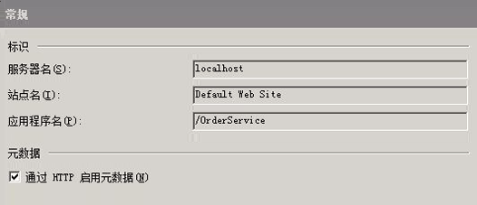
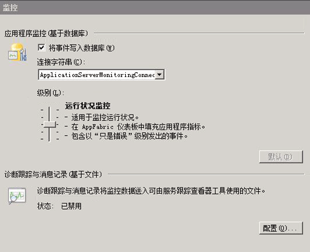
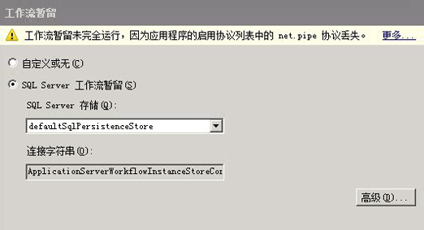
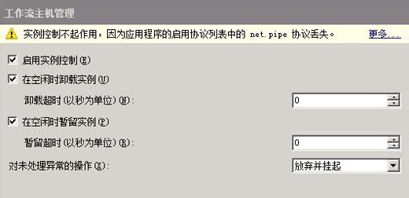
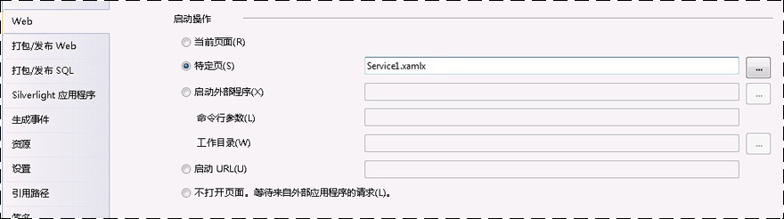
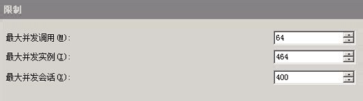
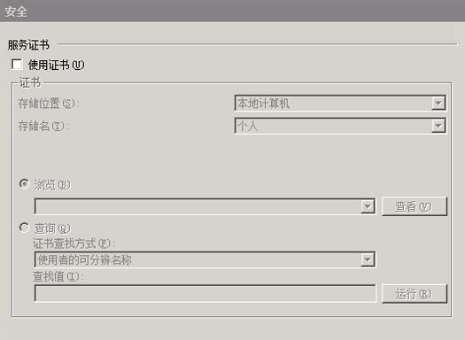
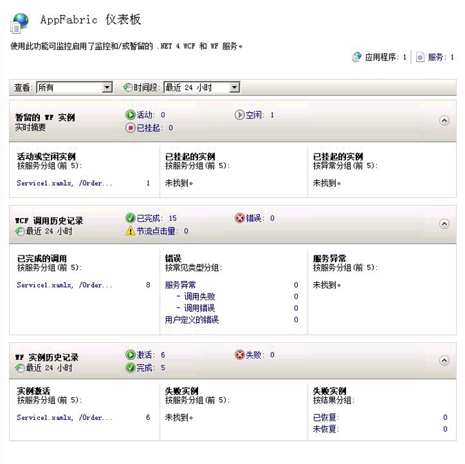

# 如何：使用 Windows Server App Fabric 承载工作流服务How to: Host a Workflow Service with Windows Server App Fabric
在 App Fabric 中承载工作流服务类似于在 IIS/WAS 下承载。Hosting workflow services in App Fabric is similar to hosting under IIS/WAS. 唯一的区别在于 App Fabric 提供的用于部署、监控和管理工作流服务的工具。The only difference is the tools App Fabric provides for deploying, monitoring, and managing workflow services. 本主题使用在创建的工作流服务[创建长时间运行工作流服务](../../../../docs/framework/wcf/feature-details/creating-a-long-running-workflow-service.md)。This topic uses the workflow service created in the [Creating a Long-running Workflow Service](../../../../docs/framework/wcf/feature-details/creating-a-long-running-workflow-service.md). 本主题将指导您创建工作流服务。That topic will walk you through creating a workflow service. 本主题将介绍如何使用 App Fabric 承载工作流服务。This topic will explain how to host the workflow service using App Fabric. 有关 Windows Server App Fabric 的详细信息，请参阅[Windows Server App Fabric 文档](http://go.microsoft.com/fwlink/?LinkID=193037&clcid=0x409)。For more information about Windows Server App Fabric, see [Windows Server App Fabric Documentation](http://go.microsoft.com/fwlink/?LinkID=193037&clcid=0x409). 完成以下步骤之前，请确保已安装 Windows Server App Fabric。Before completing the steps below make sure you have Windows Server App Fabric installed.  为此，请打开 Internet Information services (inetmgr.exe)，请单击服务器名称**连接**查看，单击站点，然后单击**Default Web Site**。To do this open up Internet Information Services (inetmgr.exe), click your server name in the **Connections** view, click Sites, and click **Default Web Site**. 在屏幕的右侧，你应该看到名为一节**App Fabric**。In the right-hand side of the screen you should see a section called **App Fabric**. 如果您看不到这一部分（它位于右侧窗格的顶部），则表示您还未安装 App Fabric。If you don’t see this section (it will be on the top of the right-hand pane) you do not have App Fabric installed. 有关安装 Windows Server App Fabric 的详细信息请参阅[安装 Windows Server App Fabric](http://go.microsoft.com/fwlink/?LinkId=193136)。For more information about installing Windows Server App Fabric see [Installing Windows Server App Fabric](http://go.microsoft.com/fwlink/?LinkId=193136).  
  
### 创建简单工作流服务Creating a Simple Workflow Service  
  
1.  打开[!INCLUDE[vs_current_long](../../../../includes/vs-current-long-md.md)]和加载 OrderProcessing 解决方案中创建[创建长时间运行工作流服务](../../../../docs/framework/wcf/feature-details/creating-a-long-running-workflow-service.md)主题。Open [!INCLUDE[vs_current_long](../../../../includes/vs-current-long-md.md)] and load the OrderProcessing solution you created in the [Creating a Long-running Workflow Service](../../../../docs/framework/wcf/feature-details/creating-a-long-running-workflow-service.md) topic.  
  
2.  右键单击**OrderService**项目，然后选择**属性**和选择**Web**选项卡。Right click the **OrderService** project and select **Properties** and select the **Web** tab.  
  
3.  在**启动操作**部分的属性页上，选择**特定页**和编辑框中键入 Service1.xamlx。In the **Start Action** section of the property page select **Specific Page** and type Service1.xamlx in the edit box.  
  
4.  在**服务器**部分的属性页上，选择**使用本地 IIS Web 服务器**并键入以下 URL: `http://localhost/OrderService`。In the **Servers** section of the property page select **Use Local IIS Web Server** and type in the following URL: `http://localhost/OrderService`.  
  
5.  单击**创建虚拟目录**按钮。Click the **Create Virtual Directory** button. 这将新建一个虚拟目录，并将项目设置为在生成项目时将所需文件复制到此虚拟目录。This will create a new virtual directory and set up the project to copy the needed files to the virtual directory when the project is built.  或者，你也可以手动将 .xamlx、web.config 以及任何所需的 DLL 复制到此虚拟目录。Alternatively you could manually copy the .xamlx, the web.config, and any needed DLLs to the virtual directory.  
  
### 配置承载于 Windows Server App Fabric 中的工作流服务Configuring a Workflow Service Hosted in Windows Server App Fabric  
  
1.  打开 Internet 信息服务管理器 (inetmgr.exe)。Open Internet Information Services Manager (inetmgr.exe).  
  
2.  导航到 OrderService 虚拟目录中**连接**窗格。Navigate to the OrderService virtual directory in the **Connections** pane.  
  
3.  右击 OrderService 并选择**管理 WCF 和 WF 服务**，**配置...**.Right click OrderService and select **Manage WCF and WF Services**, **Configure…**. **为应用程序配置 WCF 和 WF**对话框随即显示。The **Configure WCF and WF for Application** dialog box is displayed.  
  
4.  选择**常规**选项卡以显示有关应用程序的常规信息，如下面的屏幕快照中所示。Select the **General** tab to display general information about the application as shown in the following screen shot.  
  
       
  
5.  选择**监视**选项卡。这将显示各种监控设置，如下面的屏幕快照所示。Select the **Monitoring** tab. This shows various monitoring settings as shown in the following screen shot.  
  
       
  
     有关配置工作流服务的详细信息中 App Fabric 监视请参阅[配置使用 App Fabric 监视](http://go.microsoft.com/fwlink/?LinkId=193153)。For more information about configuring workflow service monitoring in App Fabric see [Configuring monitoring with App Fabric](http://go.microsoft.com/fwlink/?LinkId=193153).  
  
6.  选择**工作流持久性**选项卡。这样，您可以将应用程序配置为使用 App Fabric 的默认暂留提供程序，如下面的屏幕快照所示。Select the **Workflow Persistence** tab. This allows you to configure your application to use App Fabric’s default persistence provider as shown in the following screen shot.  
  
       
  
     有关在 Windows Server App Fabric 中配置工作流持久性的详细信息请参阅[App Fabric 中配置工作流持久性](http://go.microsoft.com/fwlink/?LinkId=193148)。For more information about configuring workflow persistence in Windows Server App Fabric see [Configuring Workflow Persistence in App Fabric](http://go.microsoft.com/fwlink/?LinkId=193148).  
  
7.  选择**工作流主机管理**选项卡。这样，您可以指定何时应卸载和暂留空闲的工作流服务实例，如下面的屏幕快照所示。Select the **Workflow Host Management** tab. This allows you to specify when idle workflow service instances should be unloaded and persisted as shown in the following screen shot.  
  
       
  
     有关工作流主机管理配置的详细信息请参阅[App Fabric 中配置工作流主机管理](http://go.microsoft.com/fwlink/?LinkId=193151)。For more information about workflow host management configuration see [Configuring Workflow Host Management in App Fabric](http://go.microsoft.com/fwlink/?LinkId=193151).  
  
8.  选择**自动启动**选项卡。这样，您可以为应用程序中的工作流服务指定自动启动设置，如下面的屏幕快照所示。Select the **Auto-Start** tab. This allows you to specify auto-start settings for the workflow services in the application as shown in the following screen shot.  
  
       
  
     有关配置自动启动的详细信息请参阅[使用 App Fabric 配置的自动启动](http://go.microsoft.com/fwlink/?LinkId=193150)。For more information about configuring Auto-Start see [Configuring Auto-Start with App Fabric](http://go.microsoft.com/fwlink/?LinkId=193150).  
  
9. 选择**限制**选项卡。这样，您可以为工作流服务配置限制设置，如下面的屏幕快照所示。Select the **Throttling** tab. This allows you to configure throttling settings for the workflow service as shown in the following screen shot.  
  
       
  
     有关配置限制的详细信息请参阅[配置限制使用 App Fabric](http://go.microsoft.com/fwlink/?LinkId=193149)。For more information about configuring throttling see [Configuring Throttling with App Fabric](http://go.microsoft.com/fwlink/?LinkId=193149).  
  
10. 选择**安全**选项卡。这样，您可以为应用程序配置安全设置，如下面的屏幕快照所示。Select the **Security** tab. This allows you to configure security settings for the application as shown in the following screen shot.  
  
       
  
     有关使用 Windows Server App Fabric 中配置安全性的详细信息请参阅[使用 App Fabric 中配置安全性](http://go.microsoft.com/fwlink/?LinkId=193152)。For more information about configuring security with Windows Server App Fabric see [Configuring Security with App Fabric](http://go.microsoft.com/fwlink/?LinkId=193152).  
  
### 使用 Windows Server App FabricUsing Windows Server App Fabric  
  
1.  生成解决方案以便将所需的文件复制到虚拟目录。Build the solution to copy the necessary files to the virtual directory.  
  
2.  右键单击 OrderClient 项目，然后选择**调试**，**启动新实例**以启动客户端应用程序。Right click the OrderClient project and select **Debug**, **Start New Instance** to launch the client application.  
  
3.  客户端的运行时间以及 Visual Studio 将显示**附加安全警告**对话框中，单击**不附加**按钮。The client will run and Visual Studio will display an **Attach Security Warning** dialog box, click the **Don’t Attach** button. 这会告知 Visual Studio 不要附加到 IIS 进程进行调试。This tells Visual Studio to not attach to the IIS process for debugging.  
  
4.  客户端应用程序将立即调用工作流服务，然后等待。The client application will immediately call the Workflow service and then wait. 工作流服务将转为空闲暂留状态。The workflow service will go idle and be persisted. 通过启动 Internet 信息服务 (inetmgr.exe)，在“连接”窗格中导航至 OrderService 并将其选中，可以对此进行验证。You can verify this by starting Internet Information Services (inetmgr.exe), navigating to the OrderService in the Connections pane and selecting it. 接下来，单击右侧窗格中的“App Fabric 仪表板”图标。Next, click the App Fabric Dashboard icon in the right-hand pane. 在“暂留的 WF 实例”下，您将看到存在一个暂留的工作流服务实例，如下面的屏幕快照所示。Under Persisted WF Instances you will see there is one persisted workflow service instance as shown in the following screen shot.  
  
       
  
     **WF 实例历史记录**列出有关工作流服务的工作流服务激活次数、 工作流服务实例的完成数等包含失败操作的工作流实例数的信息。The **WF Instance History** lists information about the workflow service such as the number of workflow service activations, the number of workflow service instance completions, and the number of workflow instances with failures. 在活动或空闲实例下将显示一个链接，单击此链接将显示更多有关空闲工作流实例的信息，如下面的屏幕快照所示。Under Active or Idle instances a link will be displayed, clicking on the link will display more information about the idle workflow instances as shown in the following screen shot.  
  
       
  
     有关 Windows Server App Fabric 功能以及如何使用它们查看[Windows Server App Fabric 承载功能](http://go.microsoft.com/fwlink/?LinkID=193143&clcid=0x409)For more information about Windows Server App Fabric features and how to use them see [Windows Server App Fabric Hosting Features](http://go.microsoft.com/fwlink/?LinkID=193143&clcid=0x409)  
  
## 请参阅See Also  
 [创建长时间运行的工作流服务Creating a Long-running Workflow Service](../../../../docs/framework/wcf/feature-details/creating-a-long-running-workflow-service.md)  
 [Windows Server App Fabric 承载功能Windows Server App Fabric Hosting Features](http://go.microsoft.com/fwlink/?LinkId=193143)  
 [安装 Windows Server App FabricInstalling Windows Server App Fabric](http://go.microsoft.com/fwlink/?LinkId=193136)  
 [Windows Server App Fabric 文档Windows Server App Fabric Documentation](http://go.microsoft.com/fwlink/?LinkID=193037&clcid=0x409)
