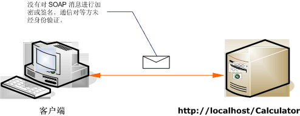

# <a name="internet-unsecured-client-and-service"></a><span data-ttu-id="29376-102">不安全的 Internet 客户端和服务</span><span class="sxs-lookup"><span data-stu-id="29376-102">Internet Unsecured Client and Service</span></span>
<span data-ttu-id="29376-103">下面的插图演示了一个公共的、不安全的 [!INCLUDE[indigo1](../../../../includes/indigo1-md.md)] 客户端和服务的示例。</span><span class="sxs-lookup"><span data-stu-id="29376-103">The following illustration shows an example of a public, unsecured [!INCLUDE[indigo1](../../../../includes/indigo1-md.md)] client and service.</span></span>  
  
 <span data-ttu-id="29376-104"></span><span class="sxs-lookup"><span data-stu-id="29376-104"></span></span>  
  
|<span data-ttu-id="29376-105">特征</span><span class="sxs-lookup"><span data-stu-id="29376-105">Characteristic</span></span>|<span data-ttu-id="29376-106">描述</span><span class="sxs-lookup"><span data-stu-id="29376-106">Description</span></span>|  
|--------------------|-----------------|  
|<span data-ttu-id="29376-107">安全模式</span><span class="sxs-lookup"><span data-stu-id="29376-107">Security Mode</span></span>|<span data-ttu-id="29376-108">无</span><span class="sxs-lookup"><span data-stu-id="29376-108">None</span></span>|  
|<span data-ttu-id="29376-109">传输</span><span class="sxs-lookup"><span data-stu-id="29376-109">Transport</span></span>|<span data-ttu-id="29376-110">HTTP</span><span class="sxs-lookup"><span data-stu-id="29376-110">HTTP</span></span>|  
|<span data-ttu-id="29376-111">绑定</span><span class="sxs-lookup"><span data-stu-id="29376-111">Binding</span></span>|<span data-ttu-id="29376-112"><xref:System.ServiceModel.BasicHttpBinding>在代码中，或[ \<basicHttpBinding >](../../../../docs/framework/configure-apps/file-schema/wcf/basichttpbinding.md)配置中的元素。</span><span class="sxs-lookup"><span data-stu-id="29376-112"><xref:System.ServiceModel.BasicHttpBinding> in code, or the [\<basicHttpBinding>](../../../../docs/framework/configure-apps/file-schema/wcf/basichttpbinding.md) element in configuration.</span></span>|  
|<span data-ttu-id="29376-113">互操作性</span><span class="sxs-lookup"><span data-stu-id="29376-113">Interoperability</span></span>|<span data-ttu-id="29376-114">与现有的 Web 服务客户端和服务进行互操作</span><span class="sxs-lookup"><span data-stu-id="29376-114">With existing Web service clients and services</span></span>|  
|<span data-ttu-id="29376-115">身份验证</span><span class="sxs-lookup"><span data-stu-id="29376-115">Authentication</span></span>|<span data-ttu-id="29376-116">无</span><span class="sxs-lookup"><span data-stu-id="29376-116">None</span></span>|  
|<span data-ttu-id="29376-117">完整性</span><span class="sxs-lookup"><span data-stu-id="29376-117">Integrity</span></span>|<span data-ttu-id="29376-118">无</span><span class="sxs-lookup"><span data-stu-id="29376-118">None</span></span>|  
|<span data-ttu-id="29376-119">保密性</span><span class="sxs-lookup"><span data-stu-id="29376-119">Confidentiality</span></span>|<span data-ttu-id="29376-120">无</span><span class="sxs-lookup"><span data-stu-id="29376-120">None</span></span>|  
  
## <a name="service"></a><span data-ttu-id="29376-121">服务</span><span class="sxs-lookup"><span data-stu-id="29376-121">Service</span></span>  
 <span data-ttu-id="29376-122">下面的代码和配置应独立运行。</span><span class="sxs-lookup"><span data-stu-id="29376-122">The following code and configuration are meant to run independently.</span></span> <span data-ttu-id="29376-123">执行下列操作之一：</span><span class="sxs-lookup"><span data-stu-id="29376-123">Do one of the following:</span></span>  
  
-   <span data-ttu-id="29376-124">使用代码（而不使用配置）创建独立服务。</span><span class="sxs-lookup"><span data-stu-id="29376-124">Create a stand-alone service using the code with no configuration.</span></span>  
  
-   <span data-ttu-id="29376-125">使用提供的配置创建服务，但不定义任何终结点。</span><span class="sxs-lookup"><span data-stu-id="29376-125">Create a service using the supplied configuration, but do not define any endpoints.</span></span>  
  
### <a name="code"></a><span data-ttu-id="29376-126">代码</span><span class="sxs-lookup"><span data-stu-id="29376-126">Code</span></span>  
 <span data-ttu-id="29376-127">下面的代码演示如何创建不安全的终结点。</span><span class="sxs-lookup"><span data-stu-id="29376-127">The following code shows how to create an endpoint with no security.</span></span> <span data-ttu-id="29376-128">默认情况下，<xref:System.ServiceModel.BasicHttpBinding> 将安全模式设置为 <xref:System.ServiceModel.BasicHttpSecurityMode.None>。</span><span class="sxs-lookup"><span data-stu-id="29376-128">By default, the <xref:System.ServiceModel.BasicHttpBinding> has the security mode set to <xref:System.ServiceModel.BasicHttpSecurityMode.None>.</span></span>  
  
 [!code-csharp[C_UnsecuredService#1](../../../../samples/snippets/csharp/VS_Snippets_CFX/c_unsecuredservice/cs/source.cs#1)]
 [!code-vb[C_UnsecuredService#1](../../../../samples/snippets/visualbasic/VS_Snippets_CFX/c_unsecuredservice/vb/source.vb#1)]  
  
### <a name="service-configuration"></a><span data-ttu-id="29376-129">服务配置</span><span class="sxs-lookup"><span data-stu-id="29376-129">Service Configuration</span></span>  
 <span data-ttu-id="29376-130">下面的代码使用配置设置相同的终结点。</span><span class="sxs-lookup"><span data-stu-id="29376-130">The following code sets up the same endpoint using configuration.</span></span>  
  
```xml  
<?xml version="1.0" encoding="utf-8"?>  
<configuration>  
  <system.serviceModel>  
    <behaviors />  
    <services>  
      <service behaviorConfiguration="" name="ServiceModel.Calculator">  
        <endpoint address="http://localhost/Calculator"   
                  binding="basicHttpBinding"  
                  bindingConfiguration="Basic_Unsecured"   
                  name="BasicHttp_ICalculator"  
                  contract="ServiceModel.ICalculator" />  
      </service>  
    </services>  
    <bindings>  
      <basicHttpBinding>  
        <binding name="Basic_Unsecured" />  
      </basicHttpBinding>  
    </bindings>  
    <client />  
  </system.serviceModel>  
</configuration>  
```  
  
## <a name="client"></a><span data-ttu-id="29376-131">客户端</span><span class="sxs-lookup"><span data-stu-id="29376-131">Client</span></span>  
 <span data-ttu-id="29376-132">下面的代码和配置应独立运行。</span><span class="sxs-lookup"><span data-stu-id="29376-132">The following code and configuration are meant to run independently.</span></span> <span data-ttu-id="29376-133">执行下列操作之一：</span><span class="sxs-lookup"><span data-stu-id="29376-133">Do one of the following:</span></span>  
  
-   <span data-ttu-id="29376-134">使用代码（和客户端代码）创建独立客户端。</span><span class="sxs-lookup"><span data-stu-id="29376-134">Create a stand-alone client using the code (and client code).</span></span>  
  
-   <span data-ttu-id="29376-135">创建不定义任何终结点地址的客户端。</span><span class="sxs-lookup"><span data-stu-id="29376-135">Create a client that does not define any endpoint addresses.</span></span> <span data-ttu-id="29376-136">而使用将配置名称作为参数的客户端构造函数。</span><span class="sxs-lookup"><span data-stu-id="29376-136">Instead, use the client constructor that takes the configuration name as an argument.</span></span> <span data-ttu-id="29376-137">例如：</span><span class="sxs-lookup"><span data-stu-id="29376-137">For example:</span></span>  
  
     [!code-csharp[C_SecurityScenarios#0](../../../../samples/snippets/csharp/VS_Snippets_CFX/c_securityscenarios/cs/source.cs#0)]
     [!code-vb[C_SecurityScenarios#0](../../../../samples/snippets/visualbasic/VS_Snippets_CFX/c_securityscenarios/vb/source.vb#0)]  
  
### <a name="code"></a><span data-ttu-id="29376-138">代码</span><span class="sxs-lookup"><span data-stu-id="29376-138">Code</span></span>  
 <span data-ttu-id="29376-139">下面的代码演示一个访问不安全终结点的基本 [!INCLUDE[indigo2](../../../../includes/indigo2-md.md)] 客户端。</span><span class="sxs-lookup"><span data-stu-id="29376-139">The following code shows a basic [!INCLUDE[indigo2](../../../../includes/indigo2-md.md)] client that accesses an unsecured endpoint.</span></span>  
  
 [!code-csharp[C_UnsecuredClient#1](../../../../samples/snippets/csharp/VS_Snippets_CFX/c_unsecuredclient/cs/source.cs#1)]
 [!code-vb[C_UnsecuredClient#1](../../../../samples/snippets/visualbasic/VS_Snippets_CFX/c_unsecuredclient/vb/source.vb#1)]  
  
### <a name="client-configuration"></a><span data-ttu-id="29376-140">客户端配置</span><span class="sxs-lookup"><span data-stu-id="29376-140">Client Configuration</span></span>  
 <span data-ttu-id="29376-141">下面的代码将配置客户端。</span><span class="sxs-lookup"><span data-stu-id="29376-141">The following code configures the client.</span></span>  
  
```xml  
<?xml version="1.0" encoding="utf-8"?>  
<configuration>  
  <system.serviceModel>  
    <bindings>  
      <basicHttpBinding>  
        <binding name="BasicHttpBinding_ICalculator" >  
          <security mode="None">  
          </security>  
        </binding>  
      </basicHttpBinding>  
    </bindings>  
    <client>  
      <endpoint address="http://localhost/Calculator/Unsecured"  
          binding="basicHttpBinding"   
          bindingConfiguration="BasicHttpBinding_ICalculator"  
          contract="ICalculator"   
          name="BasicHttpBinding_ICalculator" />  
    </client>  
  </system.serviceModel>  
</configuration>  
```  
  
## <a name="see-also"></a><span data-ttu-id="29376-142">请参阅</span><span class="sxs-lookup"><span data-stu-id="29376-142">See Also</span></span>  
 [<span data-ttu-id="29376-143">常用安全方案</span><span class="sxs-lookup"><span data-stu-id="29376-143">Common Security Scenarios</span></span>](../../../../docs/framework/wcf/feature-details/common-security-scenarios.md)  
 [<span data-ttu-id="29376-144">安全性概述</span><span class="sxs-lookup"><span data-stu-id="29376-144">Security Overview</span></span>](../../../../docs/framework/wcf/feature-details/security-overview.md)  
 [<span data-ttu-id="29376-145">Windows Server App Fabric 的安全模型</span><span class="sxs-lookup"><span data-stu-id="29376-145">Security Model for Windows Server App Fabric</span></span>](http://go.microsoft.com/fwlink/?LinkID=201279&clcid=0x409)
