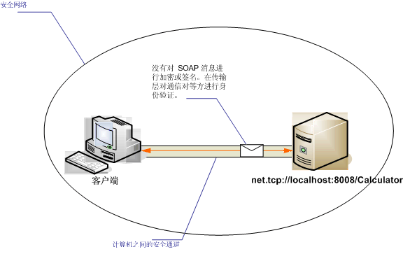

# <a name="intranet-unsecured-client-and-service"></a>不安全的 Intranet 客户端和服务
下面的插图描述了一种简单的 [!INCLUDE[indigo1](../../../../includes/indigo1-md.md)] 服务，开发此服务的目的是为了向 [!INCLUDE[indigo2](../../../../includes/indigo2-md.md)] 应用程序提供有关安全专用网络的信息。 在以下情况下无需提供安全性：数据重要性较低、网络在本质上是安全的，或者由 [!INCLUDE[indigo2](../../../../includes/indigo2-md.md)] 基础结构的下层提供安全性。  
  
   
  
|特征|描述|  
|--------------------|-----------------|  
|安全模式|无|  
|传输|TCP|  
|绑定|<xref:System.ServiceModel.NetTcpBinding>|  
|互操作性|仅 [!INCLUDE[indigo2](../../../../includes/indigo2-md.md)]|  
|身份验证|无|  
|完整性|无|  
|保密性|无|  
  
## <a name="service"></a>服务  
 下面的代码和配置应独立运行。 执行下列操作之一：  
  
-   使用代码（而不使用配置）创建独立服务。  
  
-   使用提供的配置创建服务，但不定义任何终结点。  
  
### <a name="code"></a>代码  
 下面的代码演示如何创建不安全的终结点：  
  
 [!code-csharp[C_UnsecuredService#2](../../../../samples/snippets/csharp/VS_Snippets_CFX/c_unsecuredservice/cs/source.cs#2)]
 [!code-vb[C_UnsecuredService#2](../../../../samples/snippets/visualbasic/VS_Snippets_CFX/c_unsecuredservice/vb/source.vb#2)]  
  
### <a name="configuration"></a>配置  
 下面的代码使用配置设置相同的终结点：  
  
```xml  
<?xml version="1.0" encoding="utf-8"?>  
<configuration>  
  <system.serviceModel>  
    <behaviors />  
    <services>  
      <service behaviorConfiguration=""   
               name="ServiceModel.Calculator">  
        <endpoint address="net.tcp://localhost:8008/Calculator"   
                  binding="netTcpBinding"  
                  bindingConfiguration="tcp_Unsecured"   
                  name="netTcp_ICalculator"  
                  contract="ServiceModel.ICalculator" />  
      </service>  
    </services>  
    <bindings>  
      <netTcpBinding>  
        <binding name="tcp_Unsecured">  
          <security mode="None" />  
        </binding>  
      </netTcpBinding>  
    </bindings>  
    <client />  
  </system.serviceModel>  
</configuration>  
```  
  
## <a name="client"></a>客户端  
 下面的代码和配置应独立运行。 执行下列操作之一：  
  
-   使用代码（和客户端代码）创建独立客户端。  
  
-   创建不定义任何终结点地址的客户端。 而使用将配置名称作为参数的客户端构造函数。 例如：  
  
     [!code-csharp[C_SecurityScenarios#0](../../../../samples/snippets/csharp/VS_Snippets_CFX/c_securityscenarios/cs/source.cs#0)]
     [!code-vb[C_SecurityScenarios#0](../../../../samples/snippets/visualbasic/VS_Snippets_CFX/c_securityscenarios/vb/source.vb#0)]  
  
### <a name="code"></a>代码  
 以下代码演示一个使用 TCP 协议访问不安全终结点的基本 [!INCLUDE[indigo2](../../../../includes/indigo2-md.md)] 客户端。  
  
 [!code-csharp[C_UnsecuredClient#2](../../../../samples/snippets/csharp/VS_Snippets_CFX/c_unsecuredclient/cs/source.cs#2)]
 [!code-vb[C_UnsecuredClient#2](../../../../samples/snippets/visualbasic/VS_Snippets_CFX/c_unsecuredclient/vb/source.vb#2)]  
  
### <a name="configuration"></a>配置  
 下面的配置代码应用于客户端：  
  
```xml  
<?xml version="1.0" encoding="utf-8"?>  
<configuration>  
  <system.serviceModel>  
    <bindings>  
      <netTcpBinding>  
        <binding name="NetTcpBinding_ICalculator" >  
          <security mode="None">  
          </security>  
        </binding>  
      </netTcpBinding>  
    </bindings>  
    <client>  
      <endpoint address="net.tcp://machineName:8008/Calculator "  
                binding="netTcpBinding"   
                bindingConfiguration="NetTcpBinding_ICalculator"  
                contract="ICalculator"   
                name="NetTcpBinding_ICalculator" />  
    </client>  
  </system.serviceModel>  
</configuration>  
```  
  
## <a name="see-also"></a>请参阅  
 <xref:System.ServiceModel.NetTcpBinding>  
 [安全性概述](../../../../docs/framework/wcf/feature-details/security-overview.md)  
 [Windows Server App Fabric 的安全模型](http://go.microsoft.com/fwlink/?LinkID=201279&clcid=0x409)
