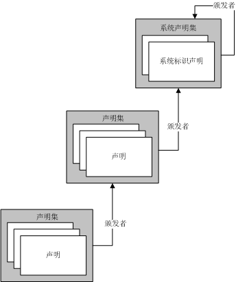
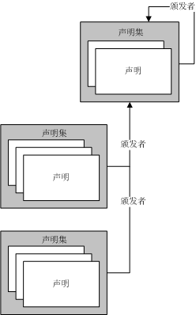
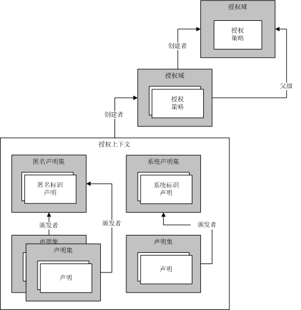

# 使用标识模型管理声明和授权
授权是确定哪些实体具有更改、查看或其他访问计算机资源权限的过程。 例如，在一个企业中，可能只有经理们才可以访问其员工的文件。 Windows Communication Foundation (WCF) 执行授权处理支持两种机制。 第一种机制使您能够使用现有的公共语言运行库 (CLR) 构造来控制授权。 第二个是名为基于声明的模型*标识模型*。 WCF 使用标识模型创建的声明从传入消息;可以扩展标识模型类以支持自定义授权方案的新声明类型。 本主题概述标识模型功能的主要编程概念，并提供此功能使用的最重要的类的列表。  
  
## 标识模型方案  
 以下方案演示标识模型的使用方式。  
  
### 方案 1:支持标识、 角色和组声明  
 用户向 Web 服务发送消息。 Web 服务的访问控制需求使用标识、角色或组。 消息发送方映射到一个角色或组的集中。 角色或组信息用于执行访问检查。  
  
### 方案 2:支持多信息声明  
 用户向 Web 服务发送消息。 Web 服务的访问控制要求需要比标识、角色或组更丰富的模型。 Web 服务确定给定的用户是否有权使用基于多信息声明的模型访问特定的受保护资源。 例如，某个用户也许能读取特定信息（如薪金信息），而其他用户无此权限。  
  
### 方案 3:映射完全不同的声明  
 某个用户向 Web 服务发送一条消息。 用户可以在多种不同方式指定其凭据：X.509 证书、 用户名令牌或 Kerberos 令牌。 无论用户采用何种凭据类型，Web 服务都需要以相同的方式执行访问控制检查。 如果随着时间的推移可以支持其他凭据类型，则系统应获得相应的能力。  
  
### 方案 4:确定多个资源的访问权限  
 Web 服务试图访问多个资源。 它通过比较与给定用户关联的声明和访问资源所需的声明，确定该用户有权访问哪些受保护资源。  
  
## 标识模型术语  
 下面的列表定义用于描述标识模型概念的关键术语。  
  
 授权策略  
 用于将一组输入声明映射到一组输出声明中的一组规则。 对授权策略进行评估会将声明集添加到评估上下文，并随后添加到授权上下文。  
  
 授权上下文  
 一组声明集和零个或多个属性。 评估一个或多个授权策略时所得到的结果。  
  
 声明  
 声明类型、权限和值的组合。  
  
 声明集  
 特定颁发者颁发的一组声明。  
  
 声明类型  
 一种声明。 标识模型 API 定义的声明是 <xref:System.IdentityModel.Claims.Claim.ClaimType%2A> 类的属性。 系统提供的声明类型的示例有 <xref:System.IdentityModel.Claims.ClaimTypes.Dns%2A>、<xref:System.IdentityModel.Claims.ClaimTypes.Email%2A>、<xref:System.IdentityModel.Claims.ClaimTypes.Hash%2A>、<xref:System.IdentityModel.Claims.ClaimTypes.Name%2A>、<xref:System.IdentityModel.Claims.ClaimTypes.Rsa%2A>、<xref:System.IdentityModel.Claims.ClaimTypes.Sid%2A>、<xref:System.IdentityModel.Claims.ClaimTypes.Spn%2A>、<xref:System.IdentityModel.Claims.ClaimTypes.System%2A>、<xref:System.IdentityModel.Claims.ClaimTypes.Thumbprint%2A>、<xref:System.IdentityModel.Claims.ClaimTypes.Uri%2A> 和 <xref:System.IdentityModel.Claims.ClaimTypes.X500DistinguishedName%2A>。  
  
 评估上下文  
 在其中评估授权策略的上下文。 包含属性和声明集。 一旦评估完成即成为授权上下文的基础。  
  
 标识声明  
 其权限为标识的声明。  
  
 颁发者  
 一个声明集，它至少包含一个标识声明，并且被认为已颁发另一个声明集。  
  
 Properties  
 与评估上下文或授权上下文关联的一组信息。  
  
 受保护的资源  
 系统中仅在首先满足某些要求的情况下才可以使用、访问或操作的资源。  
  
 右  
 对于某个资源拥有的能力。 标识模型 API 定义的权限是 <xref:System.IdentityModel.Claims.Rights> 类的属性。 系统提供的权限的示例有 <xref:System.IdentityModel.Claims.Rights.Identity%2A> 和 <xref:System.IdentityModel.Claims.Rights.PossessProperty%2A>。  
  
 “值”  
 用以声明权限的信息。  
  
## 声明  
 标识模型是基于声明的系统。 声明描述与系统中某个实体关联的功能，该实体通常为该系统中的某个用户。 与给定实体关联的声明集可视为密钥。 特定的声明定义该密钥的形状，类似于现实中用于打开门锁的钥匙。 声明用于获取访问资源的权限。 通过比较访问该资源所需的声明和与试图进行访问的实体关联的声明，确定对给定的受保护资源的权限。  
  
 声明是针对特定值的权限表达式。 权限可能类似于“Read”（读取）、“Write”（写入）或“Execute”（执行）。 值可以是数据库、文件、邮箱或属性。 声明还具有声明类型。 声明类型和权限的组合提供用于指定针对该值的功能的机制。 例如，如果一个声明的类型为“File”（文件），对值“Biography.doc”具有“Read”（读取）权限，则指示与此声明关联的实体具有读取 Biography.doc 文件的权限。一个声明的类型为“Name”,对值“Martin”具有“PossessProperty”权限,指示与这种声明关联的实体拥有值为“Martin”的 Name 属性。  
  
 尽管有各种声明类型和权限被定义为标识模型的一部分，但系统仍可以扩展，允许构建于标识模型基础结构之上的各种系统根据需要定义其他声明类型和权限。  
  
### 标识声明  
 一种特定权限是标识权限。 拥有此权限的声明对实体的标识进行声明。 例如，"用户主体名称"类型的声明 (UPN) 值为"someone@example.com"，并标识的权限指示特定域中的特定标识。  
  
#### System 标识声明  
 标识模型定义了一个标识声明：系统。 System 标识声明指示实体为当前应用程序或系统。  
  
### 声明集  
 代表标识的声明的模型很重要，因为总是由系统中的某个实体颁发声明，即使该实体最终是某种“自我”的概念。 声明以集的形式组合在一起，每个集具有一个颁发者。 颁发者只是一个声明集。 这样一种递归关系最终必须结束，任何声明集都可以是其自己的颁发者。  
  
 下图显示了一个包含三个声明集的示例，其中一个声明集以另一个声明集为其颁发者，而那个声明集又以 System 声明集为其颁发者。 因此，声明集形成一个任意深度的层次结构。  
  
   
  
 多个声明集具有相同的颁发声明集，如下图所示。  
  
   
  
 除了是自已的颁发者的声明集之外，标识模型绝不支持声明集形成循环。 这样永远不会出现声明集 A 由声明集 B 颁发，而声明集 B 本身又由声明集 A 颁发的情况。 而且，标识模型也绝不支持声明集具有多个颁发者。 如果两个或多个颁发者都必须颁发某个给定的声明集，那么必须使用多个声明集，使每个声明集包含相同的声明，但具有不同的颁发者。  
  
### 声明的起源  
 声明可以来自各种源。 一个常见声明来源是用户提供的凭据，例如作为发送到 Web 服务的消息的一部分提供的凭据。 系统会验证这样的声明，而这些声明会成为与用户关联的声明集的组成部分。 其他系统组件也可能是声明的来源，包括但不限于操作系统、网络堆栈、运行时环境或应用程序。 此外，远程服务也可能是声明的来源。  
  
### 授权策略  
 在标识模型中，声明是在对授权策略进行评估的过程中生成的。 授权策略会检查（可能为空的）现有声明集，并且可能选择根据已有的声明和所掌握的其他信息添加其他声明。 这提供了在声明之间进行映射的基础。 系统中是否存在声明将对授权策略是否添加其他声明产生影响。  
  
 例如，授权策略具有访问一个数据库的权限，该数据库中包括使用此系统的各个实体的生日。 授权策略使用此信息将一个“Over18”声明添加到上下文。 请注意，此 Over18 声明除了实体年龄大于 18 岁的事实之外，未泄漏有关实体的任何信息。 还请注意，要解释“Over18”声明，需要理解该声明的语义。 添加声明的授权策略在某种程度上理解这些语义。 还会将这些语义通知随后对策略评估所产生的声明进行检查的代码。  
  
 一个给定的授权策略可能要求对它进行多次评估，因为当其他授权策略添加声明时，该授权策略还可能添加更多的声明。 标识模型设计为不断进行评估，直到任何有效的授权策略都不再向上下文中添加声明为止。 这种持续的授权策略评估可阻止针对授权策略实施任何特定评估顺序的需求；可以按任何顺序对它们进行评估。 例如，如果在策略 A 已添加声明 B 的情况下策略 X 仅添加声明 Z，那么如果首先评估 X，则最初不会添加声明 Z。随后，会评估 A 并添加声明 B。然后再次评估 X，此时会添加声明 Z。  
  
 给定的系统可能有许多有效的授权策略。  
  
### 钥匙加工机  
 评估一组关联的授权策略类似于使用加工钥匙的机器。 会对授权策略逐一进行评估并生成声明集，打造出钥匙的形状。 一旦钥匙的形状完成，就可以使用它尝试打开某些锁。 钥匙的形状存储在“授权上下文”中，授权上下文由授权管理器创建。  
  
### 授权上下文  
 授权管理器按说明来评估各个授权策略，结果是产生一个授权上下文（一组声明集和一些关联的属性）。 可以检查授权上下文以确定该上下文中存在的声明和这些不同的声明（例如，颁发声明集）之间的关系，最后将它们与其访问资源时必须满足的要求进行比较。  
  
### 锁  
 如果授权上下文（一组声明）是一把钥匙，那么授予对特定的受保护资源的访问权限时所必须满足的要求便构成了该钥匙必须相适合的锁。 标识模型不会规定这些要求的表达形式，但鉴于系统在本质上是基于声明的，所以它们确实涉及了将授权上下文中的声明与某一必需的声明集进行比较。  
  
### 扼要重述  
 标识模型基于声明的概念。 声明以集的形式进行组合并在授权上下文中聚合。 授权上下文包含一组声明，它是对一个或多个与授权管理器关联的授权策略进行评估所取得的结果。 可以检查这些声明集以确定是否符合访问要求。 下图显示了这些不同的标识模型概念之间的关系。  
  
   
  
## WCF 和标识模型  
 执行授权的情况下，WCF 使用作为基础的标识模型基础结构。 在 WCF 中，<xref:System.ServiceModel.Description.ServiceAuthorizationBehavior>类，可指定*授权*策略作为服务的一部分。 这种授权策略称为*外部授权策略*，并且它们可以执行声明处理根据本地策略或与远程服务的交互。 授权管理器中，由<xref:System.ServiceModel.ServiceAuthorizationManager>类外部授权策略，以及能够识别各种凭据类型 （令牌） 的计算结果并填充所谓*授权上下文*适用于传入消息的声明。 授权上下文由 <xref:System.IdentityModel.Policy.AuthorizationContext> 类表示。  
  
## 标识模型编程  
 下表说明了用于对标识模型扩展进行编程的对象模型 这些类全部存在于 <xref:System.IdentityModel.Policy> 或 <xref:System.IdentityModel.Claims> 命名空间中。  
  
|类|描述|  
|-----------|-----------------|  
|授权组件|实现 <xref:System.IdentityModel.Policy.IAuthorizationComponent> 接口的标识模型类。|  
|<xref:System.IdentityModel.Policy.IAuthorizationComponent>|提供单一只读字符串属性的接口：Id。在实现此接口的系统中，每个实例的此属性值都是唯一的。|  
|<xref:System.IdentityModel.Policy.AuthorizationContext>|*授权组件*包含一组`ClaimSet`具有零个或多个属性的实例; 对一个或多个授权策略进行评估的结果。|  
|<xref:System.IdentityModel.Claims.Claim>|声明类型、权限和值的组合。 权限和值部分受声明类型约束。|  
|<xref:System.IdentityModel.Claims.ClaimSet>|一个抽象基类。 `Claim` 实例的集合。|  
|<xref:System.IdentityModel.Claims.DefaultClaimSet>|一个密封类。 `ClaimSet` 类的一个实现。|  
|<xref:System.IdentityModel.Policy.EvaluationContext>|一个抽象基类。 在策略评估期间传递给授权策略。|  
|<xref:System.IdentityModel.Policy.IAuthorizationPolicy>|一个接口，派生从`IAuthorizationComponent`并由授权策略类实现。|  
|<xref:System.IdentityModel.Claims.Rights>|一个静态类，包含预定义的权限值。|  
  
 以下类也用于标识模型编程，但不存在于 <xref:System.IdentityModel.Policy> 或 <xref:System.IdentityModel.Claims> 命名空间中。  
  
|类|描述|  
|-----------|-----------------|  
|<xref:System.ServiceModel.ServiceAuthorizationManager>|一个类，提供一种方法（<xref:System.ServiceModel.ServiceAuthorizationManager.CheckAccessCore%2A>），为服务中的每项操作执行基于声明的授权检查。 必须从此类派生，并重写此方法。|  
|<xref:System.ServiceModel.Description.ServiceAuthorizationBehavior>|一个密封类，提供与授权有关的服务行为的各种相关属性。|  
|<xref:System.ServiceModel.ServiceSecurityContext>|一个类，为当前正在运行（或将要运行）的操作提供安全上下文（包括授权上下文）。 此类的实例是 <xref:System.ServiceModel.OperationContext> 的一部分。|  
  
### 重要成员  
 以下成员通常用于创建新声明类型。  
  
|成员|描述|  
|------------|-----------------|  
|<xref:System.ServiceModel.ServiceAuthorizationManager.CheckAccessCore%2A>|派生类实现此方法以在服务中运行操作之前执行基于声明的访问检查。 在做出访问检查决定时，可以检查提供的 <xref:System.ServiceModel.OperationContext> 中（或其他位置）的所有信息。 如果 <xref:System.ServiceModel.ServiceAuthorizationManager.CheckAccessCore%2A> 返回 `true`，则允许进行访问和执行操作。 如果 `CheckAccessCore` 返回 `false`，则拒绝访问并且不执行操作。 有关示例，请参见 [如何：创建自定义授权管理器服务](../../../../docs/framework/wcf/extending/how-to-create-a-custom-authorization-manager-for-a-service.md)。|  
|<xref:System.ServiceModel.Description.ServiceAuthorizationBehavior.ServiceAuthorizationManager%2A>|返回服务的 <xref:System.ServiceModel.ServiceAuthorizationManager>。 <xref:System.ServiceModel.ServiceAuthorizationManager> 负责做出授权决定。|  
|<xref:System.ServiceModel.Description.ServiceAuthorizationBehavior.ExternalAuthorizationPolicies%2A>|为服务指定的自定义授权策略的集合。 除了评估与传入消息中的凭据关联的策略外，还评估这些策略。|  
  
## 请参阅
- <xref:System.IdentityModel.Policy.AuthorizationContext>
- <xref:System.IdentityModel.Claims.Claim>
- <xref:System.IdentityModel.Policy.EvaluationContext>
- <xref:System.IdentityModel.Policy.IAuthorizationComponent>
- <xref:System.IdentityModel.Policy.IAuthorizationPolicy>
- <xref:System.IdentityModel.Claims.Rights>
- <xref:System.IdentityModel.Claims>
- <xref:System.IdentityModel.Policy>
- <xref:System.IdentityModel.Tokens>
- <xref:System.IdentityModel.Selectors>
- [声明和令牌](../../../../docs/framework/wcf/feature-details/claims-and-tokens.md)
- [声明和拒绝访问资源](../../../../docs/framework/wcf/feature-details/claims-and-denying-access-to-resources.md)
- [声明创建和资源值](../../../../docs/framework/wcf/feature-details/claim-creation-and-resource-values.md)
- [如何：创建自定义声明](../../../../docs/framework/wcf/extending/how-to-create-a-custom-claim.md)
- [如何：比较声明](../../../../docs/framework/wcf/extending/how-to-compare-claims.md)
- [如何：创建自定义授权策略](../../../../docs/framework/wcf/extending/how-to-create-a-custom-authorization-policy.md)
- [如何：创建自定义授权管理器服务](../../../../docs/framework/wcf/extending/how-to-create-a-custom-authorization-manager-for-a-service.md)
- [安全性概述](../../../../docs/framework/wcf/feature-details/security-overview.md)
- [授权](../../../../docs/framework/wcf/feature-details/authorization-in-wcf.md)
