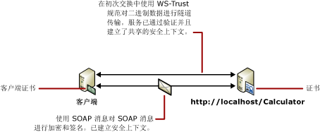

# <a name="message-security-with-a-certificate-client"></a><span data-ttu-id="2cc09-102">使用证书客户端的消息安全</span><span class="sxs-lookup"><span data-stu-id="2cc09-102">Message Security with a Certificate Client</span></span>
<span data-ttu-id="2cc09-103">以下方案演示了 Windows Communication Foundation (WCF) 客户端和服务使用消息安全模式保护。</span><span class="sxs-lookup"><span data-stu-id="2cc09-103">The following scenario shows a Windows Communication Foundation (WCF) client and service secured using message security mode.</span></span> <span data-ttu-id="2cc09-104">使用证书对客户端和服务进行身份验证。</span><span class="sxs-lookup"><span data-stu-id="2cc09-104">Both the client and the service are authenticated with certificates.</span></span> <span data-ttu-id="2cc09-105">有关详细信息，请参阅[分布式应用程序安全性](../../../../docs/framework/wcf/feature-details/distributed-application-security.md)。</span><span class="sxs-lookup"><span data-stu-id="2cc09-105">For more information, see [Distributed Application Security](../../../../docs/framework/wcf/feature-details/distributed-application-security.md).</span></span>  
  
 <span data-ttu-id="2cc09-106">示例应用程序，请参阅[消息安全证书](../../../../docs/framework/wcf/samples/message-security-certificate.md)。</span><span class="sxs-lookup"><span data-stu-id="2cc09-106">For a sample application, see [Message Security Certificate](../../../../docs/framework/wcf/samples/message-security-certificate.md).</span></span>  
  
 <span data-ttu-id="2cc09-107"></span><span class="sxs-lookup"><span data-stu-id="2cc09-107"></span></span>  
  
|<span data-ttu-id="2cc09-108">特征</span><span class="sxs-lookup"><span data-stu-id="2cc09-108">Characteristic</span></span>|<span data-ttu-id="2cc09-109">描述</span><span class="sxs-lookup"><span data-stu-id="2cc09-109">Description</span></span>|  
|--------------------|-----------------|  
|<span data-ttu-id="2cc09-110">安全模式</span><span class="sxs-lookup"><span data-stu-id="2cc09-110">Security Mode</span></span>|<span data-ttu-id="2cc09-111">消息</span><span class="sxs-lookup"><span data-stu-id="2cc09-111">Message</span></span>|  
|<span data-ttu-id="2cc09-112">互操作性</span><span class="sxs-lookup"><span data-stu-id="2cc09-112">Interoperability</span></span>|<span data-ttu-id="2cc09-113">WCF 仅</span><span class="sxs-lookup"><span data-stu-id="2cc09-113">WCF only</span></span>|  
|<span data-ttu-id="2cc09-114">身份验证（服务器）</span><span class="sxs-lookup"><span data-stu-id="2cc09-114">Authentication (Server)</span></span>|<span data-ttu-id="2cc09-115">使用服务证书</span><span class="sxs-lookup"><span data-stu-id="2cc09-115">Using service certificate</span></span>|  
|<span data-ttu-id="2cc09-116">身份验证（客户端）</span><span class="sxs-lookup"><span data-stu-id="2cc09-116">Authentication (Client)</span></span>|<span data-ttu-id="2cc09-117">使用客户端证书</span><span class="sxs-lookup"><span data-stu-id="2cc09-117">Using client certificate</span></span>|  
|<span data-ttu-id="2cc09-118">完整性</span><span class="sxs-lookup"><span data-stu-id="2cc09-118">Integrity</span></span>|<span data-ttu-id="2cc09-119">是</span><span class="sxs-lookup"><span data-stu-id="2cc09-119">Yes</span></span>|  
|<span data-ttu-id="2cc09-120">保密性</span><span class="sxs-lookup"><span data-stu-id="2cc09-120">Confidentiality</span></span>|<span data-ttu-id="2cc09-121">是</span><span class="sxs-lookup"><span data-stu-id="2cc09-121">Yes</span></span>|  
|<span data-ttu-id="2cc09-122">传输</span><span class="sxs-lookup"><span data-stu-id="2cc09-122">Transport</span></span>|<span data-ttu-id="2cc09-123">HTTP</span><span class="sxs-lookup"><span data-stu-id="2cc09-123">HTTP</span></span>|  
|<span data-ttu-id="2cc09-124">绑定</span><span class="sxs-lookup"><span data-stu-id="2cc09-124">Binding</span></span>|<xref:System.ServiceModel.WSHttpBinding>|  
  
## <a name="service"></a><span data-ttu-id="2cc09-125">服务</span><span class="sxs-lookup"><span data-stu-id="2cc09-125">Service</span></span>  
 <span data-ttu-id="2cc09-126">下面的代码和配置应独立运行。</span><span class="sxs-lookup"><span data-stu-id="2cc09-126">The following code and configuration are meant to run independently.</span></span> <span data-ttu-id="2cc09-127">执行下列操作之一：</span><span class="sxs-lookup"><span data-stu-id="2cc09-127">Do one of the following:</span></span>  
  
-   <span data-ttu-id="2cc09-128">使用代码（而不使用配置）创建独立服务。</span><span class="sxs-lookup"><span data-stu-id="2cc09-128">Create a stand-alone service using the code with no configuration.</span></span>  
  
-   <span data-ttu-id="2cc09-129">使用提供的配置创建服务，但不定义任何终结点。</span><span class="sxs-lookup"><span data-stu-id="2cc09-129">Create a service using the supplied configuration, but do not define any endpoints.</span></span>  
  
### <a name="code"></a><span data-ttu-id="2cc09-130">代码</span><span class="sxs-lookup"><span data-stu-id="2cc09-130">Code</span></span>  
 <span data-ttu-id="2cc09-131">下面的代码演示如何创建一个使用消息安全来建立安全上下文的服务终结点。</span><span class="sxs-lookup"><span data-stu-id="2cc09-131">The following code shows how to create a service endpoint that uses message security to establish a secure context.</span></span>  
  
 [!code-csharp[C_SecurityScenarios#10](../../../../samples/snippets/csharp/VS_Snippets_CFX/c_securityscenarios/cs/source.cs#10)]
 [!code-vb[C_SecurityScenarios#10](../../../../samples/snippets/visualbasic/VS_Snippets_CFX/c_securityscenarios/vb/source.vb#10)]  
  
### <a name="configuration"></a><span data-ttu-id="2cc09-132">配置</span><span class="sxs-lookup"><span data-stu-id="2cc09-132">Configuration</span></span>  
 <span data-ttu-id="2cc09-133">以下配置可代替代码使用。</span><span class="sxs-lookup"><span data-stu-id="2cc09-133">The following configuration can be used instead of the code.</span></span>  
  
```xml  
<?xml version="1.0" encoding="utf-8"?>  
<configuration>  
  <system.serviceModel>  
    <behaviors>  
      <serviceBehaviors>  
        <behavior name="ServiceCredentialsBehavior">  
          <serviceCredentials>  
            <serviceCertificate findValue="Contoso.com"  
                                x509FindType="FindBySubjectName" />  
          </serviceCredentials>  
        </behavior>  
      </serviceBehaviors>  
    </behaviors>  
    <services>  
      <service behaviorConfiguration="ServiceCredentialsBehavior"   
               name="ServiceModel.Calculator">  
        <endpoint address="http://localhost/Calculator"   
                  binding="wsHttpBinding"  
                  bindingConfiguration="MessageAndCerficiateClient"   
                  name="SecuredByClientCertificate"  
                  contract="ServiceModel.ICalculator" />  
      </service>  
    </services>  
    <bindings>  
      <wsHttpBinding>  
        <binding name="WSHttpBinding_ICalculator">  
          <security mode="Message">  
            <message clientCredentialType="Certificate" />  
          </security>  
        </binding>  
      </wsHttpBinding>  
    </bindings>  
    <client />  
  </system.serviceModel>  
</configuration>  
```  
  
## <a name="client"></a><span data-ttu-id="2cc09-134">客户端</span><span class="sxs-lookup"><span data-stu-id="2cc09-134">Client</span></span>  
 <span data-ttu-id="2cc09-135">下面的代码和配置应独立运行。</span><span class="sxs-lookup"><span data-stu-id="2cc09-135">The following code and configuration are meant to run independently.</span></span> <span data-ttu-id="2cc09-136">执行下列操作之一：</span><span class="sxs-lookup"><span data-stu-id="2cc09-136">Do one of the following:</span></span>  
  
-   <span data-ttu-id="2cc09-137">使用代码（和客户端代码）创建独立客户端。</span><span class="sxs-lookup"><span data-stu-id="2cc09-137">Create a stand-alone client using the code (and client code).</span></span>  
  
-   <span data-ttu-id="2cc09-138">创建不定义任何终结点地址的客户端。</span><span class="sxs-lookup"><span data-stu-id="2cc09-138">Create a client that does not define any endpoint addresses.</span></span> <span data-ttu-id="2cc09-139">而使用将配置名称作为参数的客户端构造函数。</span><span class="sxs-lookup"><span data-stu-id="2cc09-139">Instead, use the client constructor that takes the configuration name as an argument.</span></span> <span data-ttu-id="2cc09-140">例如：</span><span class="sxs-lookup"><span data-stu-id="2cc09-140">For example:</span></span>  
  
     [!code-csharp[C_SecurityScenarios#0](../../../../samples/snippets/csharp/VS_Snippets_CFX/c_securityscenarios/cs/source.cs#0)]
     [!code-vb[C_SecurityScenarios#0](../../../../samples/snippets/visualbasic/VS_Snippets_CFX/c_securityscenarios/vb/source.vb#0)]  
  
### <a name="code"></a><span data-ttu-id="2cc09-141">代码</span><span class="sxs-lookup"><span data-stu-id="2cc09-141">Code</span></span>  
 <span data-ttu-id="2cc09-142">下面的代码创建客户端。</span><span class="sxs-lookup"><span data-stu-id="2cc09-142">The following code creates the client.</span></span> <span data-ttu-id="2cc09-143">绑定设置为消息模式安全，客户端凭据类型设置为 `Certificate`。</span><span class="sxs-lookup"><span data-stu-id="2cc09-143">The binding is to message mode security, and the client credential type is set to `Certificate`.</span></span>  
  
 [!code-csharp[C_SecurityScenarios#17](../../../../samples/snippets/csharp/VS_Snippets_CFX/c_securityscenarios/cs/source.cs#17)]
 [!code-vb[C_SecurityScenarios#17](../../../../samples/snippets/visualbasic/VS_Snippets_CFX/c_securityscenarios/vb/source.vb#17)]  
  
### <a name="configuration"></a><span data-ttu-id="2cc09-144">配置</span><span class="sxs-lookup"><span data-stu-id="2cc09-144">Configuration</span></span>  
 <span data-ttu-id="2cc09-145">下面的配置使用终结点行为指定客户端证书。</span><span class="sxs-lookup"><span data-stu-id="2cc09-145">The following configuration specifies the client certificate using an endpoint behavior.</span></span> <span data-ttu-id="2cc09-146">有关证书的详细信息，请参阅[使用证书](../../../../docs/framework/wcf/feature-details/working-with-certificates.md)。</span><span class="sxs-lookup"><span data-stu-id="2cc09-146">For more information about certificates, see [Working with Certificates](../../../../docs/framework/wcf/feature-details/working-with-certificates.md).</span></span> <span data-ttu-id="2cc09-147">该代码还使用 <`identity`> 元素来指定域名系统 (DNS) 的预期的服务器标识。</span><span class="sxs-lookup"><span data-stu-id="2cc09-147">The code also uses an <`identity`> element to specify a Domain Name System (DNS) of the expected server identity.</span></span> <span data-ttu-id="2cc09-148">有关标识的详细信息，请参阅[服务标识和身份验证](../../../../docs/framework/wcf/feature-details/service-identity-and-authentication.md)。</span><span class="sxs-lookup"><span data-stu-id="2cc09-148">For more information about identity, see [Service Identity and Authentication](../../../../docs/framework/wcf/feature-details/service-identity-and-authentication.md).</span></span>  
  
```xml  
<?xml version="1.0" encoding="utf-8"?>  
<configuration>  
  <system.serviceModel>  
    <behaviors>  
      <endpointBehaviors>  
        <behavior name="endpointCredentialsBehavior">  
          <clientCredentials>  
            <clientCertificate findValue="Cohowinery.com"   
               storeLocation="LocalMachine"  
              x509FindType="FindBySubjectName" />  
          </clientCredentials>  
        </behavior>  
      </endpointBehaviors>  
    </behaviors>  
    <bindings>  
      <wsHttpBinding>  
        <binding name="WSHttpBinding_ICalculator" >  
          <security mode="Message">  
            <message clientCredentialType="Certificate" />  
          </security>  
        </binding>  
      </wsHttpBinding>  
    </bindings>  
    <client>  
      <endpoint address="http://machineName/Calculator"   
                behaviorConfiguration="endpointCredentialsBehavior"  
                binding="wsHttpBinding"  
                bindingConfiguration="WSHttpBinding_ICalculator"  
                contract="ICalculator"  
                name="WSHttpBinding_ICalculator">  
        <identity>  
          <dns value="Contoso.com" />  
        </identity>  
      </endpoint>  
    </client>  
  </system.serviceModel>  
</configuration>  
```  
  
## <a name="see-also"></a><span data-ttu-id="2cc09-149">请参阅</span><span class="sxs-lookup"><span data-stu-id="2cc09-149">See Also</span></span>  
 [<span data-ttu-id="2cc09-150">安全性概述</span><span class="sxs-lookup"><span data-stu-id="2cc09-150">Security Overview</span></span>](../../../../docs/framework/wcf/feature-details/security-overview.md)  
 [<span data-ttu-id="2cc09-151">服务标识和身份验证</span><span class="sxs-lookup"><span data-stu-id="2cc09-151">Service Identity and Authentication</span></span>](../../../../docs/framework/wcf/feature-details/service-identity-and-authentication.md)  
 [<span data-ttu-id="2cc09-152">使用证书</span><span class="sxs-lookup"><span data-stu-id="2cc09-152">Working with Certificates</span></span>](../../../../docs/framework/wcf/feature-details/working-with-certificates.md)  
 [<span data-ttu-id="2cc09-153">Windows Server App Fabric 的安全模型</span><span class="sxs-lookup"><span data-stu-id="2cc09-153">Security Model for Windows Server App Fabric</span></span>](https://go.microsoft.com/fwlink/?LinkID=201279&clcid=0x409)
