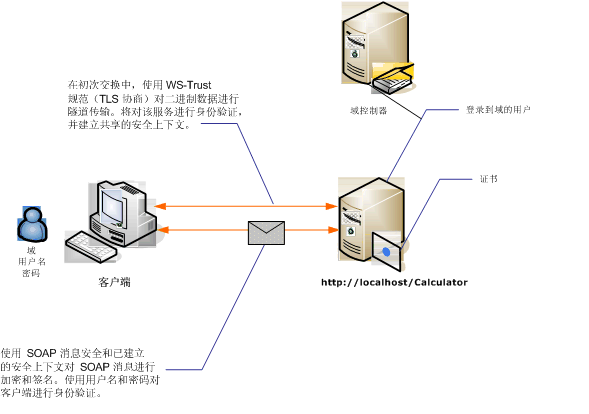

# <a name="message-security-with-a-user-name-client"></a><span data-ttu-id="2df71-102">用户名客户端的消息安全</span><span class="sxs-lookup"><span data-stu-id="2df71-102">Message Security with a User Name Client</span></span>
<span data-ttu-id="2df71-103">下图显示 Windows Communication Foundation (WCF) 服务和客户端使用消息级别安全保护。</span><span class="sxs-lookup"><span data-stu-id="2df71-103">The following illustration shows an Windows Communication Foundation (WCF) service and client secured using message-level security.</span></span> <span data-ttu-id="2df71-104">服务使用 X.509 证书进行身份验证。</span><span class="sxs-lookup"><span data-stu-id="2df71-104">The service is authenticated with an X.509 certificate.</span></span> <span data-ttu-id="2df71-105">客户端使用用户名和密码进行身份验证。</span><span class="sxs-lookup"><span data-stu-id="2df71-105">The client authenticates using a user name and password.</span></span>  
  
 <span data-ttu-id="2df71-106">有关示例应用程序，请参阅[消息安全用户名称](../../../../docs/framework/wcf/samples/message-security-user-name.md)。</span><span class="sxs-lookup"><span data-stu-id="2df71-106">For a sample application, see [Message Security User Name](../../../../docs/framework/wcf/samples/message-security-user-name.md).</span></span>  
  
 <span data-ttu-id="2df71-107"></span><span class="sxs-lookup"><span data-stu-id="2df71-107"></span></span>  
  
|<span data-ttu-id="2df71-108">特征</span><span class="sxs-lookup"><span data-stu-id="2df71-108">Characteristic</span></span>|<span data-ttu-id="2df71-109">描述</span><span class="sxs-lookup"><span data-stu-id="2df71-109">Description</span></span>|  
|--------------------|-----------------|  
|<span data-ttu-id="2df71-110">安全模式</span><span class="sxs-lookup"><span data-stu-id="2df71-110">Security Mode</span></span>|<span data-ttu-id="2df71-111">消息</span><span class="sxs-lookup"><span data-stu-id="2df71-111">Message</span></span>|  
|<span data-ttu-id="2df71-112">互操作性</span><span class="sxs-lookup"><span data-stu-id="2df71-112">Interoperability</span></span>|<span data-ttu-id="2df71-113">Windows Communication Foundation (WCF) 仅</span><span class="sxs-lookup"><span data-stu-id="2df71-113">Windows Communication Foundation (WCF) only</span></span>|  
|<span data-ttu-id="2df71-114">身份验证（服务器）</span><span class="sxs-lookup"><span data-stu-id="2df71-114">Authentication (Server)</span></span>|<span data-ttu-id="2df71-115">初始协商需要服务器身份验证</span><span class="sxs-lookup"><span data-stu-id="2df71-115">Initial negotiation requires server authentication</span></span>|  
|<span data-ttu-id="2df71-116">身份验证（客户端）</span><span class="sxs-lookup"><span data-stu-id="2df71-116">Authentication (Client)</span></span>|<span data-ttu-id="2df71-117">用户名/密码</span><span class="sxs-lookup"><span data-stu-id="2df71-117">User name/password</span></span>|  
|<span data-ttu-id="2df71-118">完整性</span><span class="sxs-lookup"><span data-stu-id="2df71-118">Integrity</span></span>|<span data-ttu-id="2df71-119">是，使用共享安全上下文</span><span class="sxs-lookup"><span data-stu-id="2df71-119">Yes, using shared security context</span></span>|  
|<span data-ttu-id="2df71-120">保密性</span><span class="sxs-lookup"><span data-stu-id="2df71-120">Confidentiality</span></span>|<span data-ttu-id="2df71-121">是，使用共享安全上下文</span><span class="sxs-lookup"><span data-stu-id="2df71-121">Yes, using shared security context</span></span>|  
|<span data-ttu-id="2df71-122">传输</span><span class="sxs-lookup"><span data-stu-id="2df71-122">Transport</span></span>|<span data-ttu-id="2df71-123">HTTP</span><span class="sxs-lookup"><span data-stu-id="2df71-123">HTTP</span></span>|  
|<span data-ttu-id="2df71-124">绑定</span><span class="sxs-lookup"><span data-stu-id="2df71-124">Binding</span></span>|<xref:System.ServiceModel.WSHttpBinding>|  
  
## <a name="service"></a><span data-ttu-id="2df71-125">服务</span><span class="sxs-lookup"><span data-stu-id="2df71-125">Service</span></span>  
 <span data-ttu-id="2df71-126">下面的代码和配置应独立运行。</span><span class="sxs-lookup"><span data-stu-id="2df71-126">The following code and configuration are meant to run independently.</span></span> <span data-ttu-id="2df71-127">执行下列操作之一：</span><span class="sxs-lookup"><span data-stu-id="2df71-127">Do one of the following:</span></span>  
  
-   <span data-ttu-id="2df71-128">使用代码（而不使用配置）创建独立服务。</span><span class="sxs-lookup"><span data-stu-id="2df71-128">Create a stand-alone service using the code with no configuration.</span></span>  
  
-   <span data-ttu-id="2df71-129">使用提供的配置创建服务，但不定义任何终结点。</span><span class="sxs-lookup"><span data-stu-id="2df71-129">Create a service using the supplied configuration, but do not define any endpoints.</span></span>  
  
### <a name="code"></a><span data-ttu-id="2df71-130">代码</span><span class="sxs-lookup"><span data-stu-id="2df71-130">Code</span></span>  
 <span data-ttu-id="2df71-131">下面的代码演示如何创建使用消息安全的服务终结点。</span><span class="sxs-lookup"><span data-stu-id="2df71-131">The following code shows how to create a service endpoint that uses message security.</span></span>  
  
 [!code-csharp[C_SecurityScenarios#9](../../../../samples/snippets/csharp/VS_Snippets_CFX/c_securityscenarios/cs/source.cs#9)]
 [!code-vb[C_SecurityScenarios#9](../../../../samples/snippets/visualbasic/VS_Snippets_CFX/c_securityscenarios/vb/source.vb#9)]  
  
### <a name="configuration"></a><span data-ttu-id="2df71-132">配置</span><span class="sxs-lookup"><span data-stu-id="2df71-132">Configuration</span></span>  
 <span data-ttu-id="2df71-133">以下配置可代替代码使用：</span><span class="sxs-lookup"><span data-stu-id="2df71-133">The following configuration can be used instead of the code:</span></span>  
  
```xml  
<?xml version="1.0" encoding="utf-8"?>  
<configuration>  
  <system.serviceModel>  
    <behaviors>  
      <serviceBehaviors>  
        <behavior name="ServiceCredentialsBehavior">  
          <serviceCredentials>  
            <serviceCertificate findValue="Contoso.com"   
                                storeLocation="LocalMachine"  
                                storeName="My"     
                                x509FindType="FindBySubjectName" />  
          </serviceCredentials>  
        </behavior>  
      </serviceBehaviors>  
    </behaviors>  
    <services>  
      <service behaviorConfiguration="ServiceCredentialsBehavior"  
               name="ServiceModel.Calculator">  
        <endpoint address="http://localhost/Calculator"  
                  binding="wsHttpBinding"  
                  bindingConfiguration="MessageAndUserName"  
                  name="SecuredByTransportEndpoint"  
                  contract="ServiceModel.ICalculator" />  
      </service>  
    </services>  
    <bindings>  
      <wsHttpBinding>  
        <binding name="MessageAndUserName">  
          <security mode="Message">              
            <message clientCredentialType="UserName" />  
          </security>  
        </binding>  
      </wsHttpBinding>  
    </bindings>  
    <client />  
  </system.serviceModel>  
</configuration>  
```  
  
## <a name="client"></a><span data-ttu-id="2df71-134">客户端</span><span class="sxs-lookup"><span data-stu-id="2df71-134">Client</span></span>  
  
### <a name="code"></a><span data-ttu-id="2df71-135">代码</span><span class="sxs-lookup"><span data-stu-id="2df71-135">Code</span></span>  
 <span data-ttu-id="2df71-136">下面的代码创建客户端。</span><span class="sxs-lookup"><span data-stu-id="2df71-136">The following code creates the client.</span></span> <span data-ttu-id="2df71-137">绑定设置为消息模式安全，客户端凭据类型设置为 `UserName`。</span><span class="sxs-lookup"><span data-stu-id="2df71-137">The binding is to message mode security, and the client credential type is set to `UserName`.</span></span> <span data-ttu-id="2df71-138">用户名和密码只能使用代码指定（不可配置）。</span><span class="sxs-lookup"><span data-stu-id="2df71-138">The user name and password can only be specified using code (it is not configurable).</span></span> <span data-ttu-id="2df71-139">返回用户名和密码的代码未在此处显示，因为这必须在应用程序级完成。</span><span class="sxs-lookup"><span data-stu-id="2df71-139">The code to return the user name and password is not shown here because it must be done at the application level.</span></span> <span data-ttu-id="2df71-140">例如，使用 Windows 窗体对话框查询用户以获得这些数据。</span><span class="sxs-lookup"><span data-stu-id="2df71-140">For example, use a Windows Forms dialog box to query the user for the data.</span></span>  
  
 [!code-csharp[C_SecurityScenarios#16](../../../../samples/snippets/csharp/VS_Snippets_CFX/c_securityscenarios/cs/source.cs#16)]
 [!code-vb[C_SecurityScenarios#16](../../../../samples/snippets/visualbasic/VS_Snippets_CFX/c_securityscenarios/vb/source.vb#16)]  
  
### <a name="configuration"></a><span data-ttu-id="2df71-141">配置</span><span class="sxs-lookup"><span data-stu-id="2df71-141">Configuration</span></span>  
 <span data-ttu-id="2df71-142">下面的代码将配置客户端。</span><span class="sxs-lookup"><span data-stu-id="2df71-142">The following code configures the client.</span></span> <span data-ttu-id="2df71-143">绑定设置为消息模式安全，客户端凭据类型设置为 `UserName`。</span><span class="sxs-lookup"><span data-stu-id="2df71-143">The binding is to message mode security, and the client credential type is set to `UserName`.</span></span> <span data-ttu-id="2df71-144">用户名和密码只能使用代码指定（不可配置）。</span><span class="sxs-lookup"><span data-stu-id="2df71-144">The user name and password can only be specified using code (it is not configurable).</span></span>  
  
```xml  
<?xml version="1.0" encoding="utf-8"?>  
<configuration>  
  <system.serviceModel>  
    <bindings>  
      <wsHttpBinding>  
        <binding name="WSHttpBinding_ICalculator" >  
          <security mode="Message">  
            <message clientCredentialType="UserName" />  
          </security>  
        </binding>  
      </wsHttpBinding>  
    </bindings>  
    <client>  
      <endpoint address="http://machineName/Calculator"   
                binding="wsHttpBinding"  
                bindingConfiguration="WSHttpBinding_ICalculator"   
                contract="ICalculator"  
                name="WSHttpBinding_ICalculator">  
        <identity>  
          <dns value ="Contoso.com" />  
        </identity>  
      </endpoint>  
    </client>  
  </system.serviceModel>  
</configuration>  
```  
  
## <a name="see-also"></a><span data-ttu-id="2df71-145">请参阅</span><span class="sxs-lookup"><span data-stu-id="2df71-145">See Also</span></span>  
 [<span data-ttu-id="2df71-146">安全性概述</span><span class="sxs-lookup"><span data-stu-id="2df71-146">Security Overview</span></span>](../../../../docs/framework/wcf/feature-details/security-overview.md)  
 [<span data-ttu-id="2df71-147">用户名消息安全</span><span class="sxs-lookup"><span data-stu-id="2df71-147">Message Security User Name</span></span>](../../../../docs/framework/wcf/samples/message-security-user-name.md)  
 [<span data-ttu-id="2df71-148">服务标识和身份验证</span><span class="sxs-lookup"><span data-stu-id="2df71-148">Service Identity and Authentication</span></span>](../../../../docs/framework/wcf/feature-details/service-identity-and-authentication.md)  
 [<span data-ttu-id="2df71-149">\<标识 ></span><span class="sxs-lookup"><span data-stu-id="2df71-149">\<identity></span></span>](../../../../docs/framework/configure-apps/file-schema/wcf/identity.md)  
 [<span data-ttu-id="2df71-150">Windows Server App Fabric 的安全模型</span><span class="sxs-lookup"><span data-stu-id="2df71-150">Security Model for Windows Server App Fabric</span></span>](http://go.microsoft.com/fwlink/?LinkID=201279&clcid=0x409)
