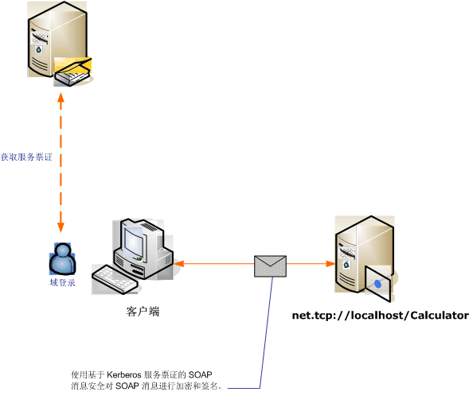

# <a name="message-security-with-a-windows-client-without-credential-negotiation"></a>没有凭据协商的 Windows 客户端的消息安全
以下方案显示了 Windows Communication Foundation (WCF) 客户端和受保护的 Kerberos 协议的服务。  
  
 服务和客户端位于相同的域或可信域。  
  
> [!NOTE]
>  此方案之间的差异并[使用 Windows 客户端的消息安全](../../../../docs/framework/wcf/feature-details/message-security-with-a-windows-client.md)是此方案中不协商服务凭据与之前发送应用程序消息服务。 此外，由于这需要 Kerberos 协议，所以此方案需要一个 Windows 域环境。  
  
   
  
|特征|描述|  
|--------------------|-----------------|  
|安全模式|消息|  
|互操作性|是，WS-Security 使用 Kerberos 令牌配置文件兼容的客户端|  
|身份验证（服务器）|服务器和客户端的相互身份验证|  
|身份验证（客户端）|服务器和客户端的相互身份验证|  
|完整性|是|  
|保密性|是|  
|传输|HTTP|  
|绑定|<xref:System.ServiceModel.WSHttpBinding>|  
  
## <a name="service"></a>服务  
 下面的代码和配置应独立运行。 执行下列操作之一：  
  
-   使用代码（而不使用配置）创建独立服务。  
  
-   使用提供的配置创建服务，但不定义任何终结点。  
  
### <a name="code"></a>代码  
 下面的代码创建使用消息安全的服务终结点。 代码禁用了服务凭据协商并禁止建立安全上下文令牌 (SCT)。  
  
> [!NOTE]
>  若要使用没有协商的 Windows 凭据类型，则服务的用户帐户必须能够访问在 Active Directory 域注册的服务主体名称 (SPN)。 可以通过以下两种方式执行此操作：  
  
1.  使用 `NetworkService` 或 `LocalSystem` 帐户运行服务。 因为这些帐户有权访问的计算机加入 Active Directory 域时，将建立计算机 SPN，WCF 自动服务的终结点内正确的 SPN 元素中生成服务的元数据 （Web Services 说明语言中或 WSDL）。  
  
2.  使用任意 Active Directory 域帐户运行服务。 在这种情况下，您需要为该域帐户建立一个 SPN。 执行此操作的一种方法是使用 Setspn.exe 实用工具。 为服务的帐户创建 SPN 后，配置 WCF，以将该 SPN 发布到服务的客户端通过其元数据 (WSDL)。 通过为公开的终结点设置终结点标识（或通过应用程序配置文件或代码）也可完成此操作。 下面的示例以编程方式发布标识。  
  
 有关 Spn 的详细信息，Kerberos 协议和 Active Directory，请参阅[Kerberos 技术补充程序用于 Windows](https://go.microsoft.com/fwlink/?LinkId=88330)。 有关终结点标识的详细信息，请参阅[SecurityBindingElement 身份验证模式](../../../../docs/framework/wcf/feature-details/securitybindingelement-authentication-modes.md)。  
  
 [!code-csharp[C_SecurityScenarios#12](../../../../samples/snippets/csharp/VS_Snippets_CFX/c_securityscenarios/cs/source.cs#12)]
 [!code-vb[C_SecurityScenarios#12](../../../../samples/snippets/visualbasic/VS_Snippets_CFX/c_securityscenarios/vb/source.vb#12)]  
  
### <a name="configuration"></a>配置  
 以下配置可代替代码使用。  
  
```xml  
<?xml version="1.0" encoding="utf-8"?>  
<configuration>  
  <system.serviceModel>  
    <behaviors />  
    <services>  
      <service behaviorConfiguration="" name="ServiceModel.Calculator">  
        <endpoint address="http://localhost/Calculator"   
                  binding="wsHttpBinding"  
                  bindingConfiguration="KerberosBinding"  
                  name="WSHttpBinding_ICalculator"  
                  contract="ServiceModel.ICalculator"   
                  listenUri="net.tcp://localhost/metadata" >  
         <identity>  
            <servicePrincipalName value="service_spn_name" />  
         </identity>  
        </endpoint>  
      </service>  
    </services>  
    <bindings>  
      <wsHttpBinding>  
        <binding name="KerberosBinding">  
          <security>  
            <message negotiateServiceCredential="false"   
                     establishSecurityContext="false" />  
          </security>  
        </binding>  
      </wsHttpBinding>  
    </bindings>  
    <client />  
  </system.serviceModel>  
</configuration>  
```  
  
## <a name="client"></a>客户端  
 下面的代码和配置应独立运行。 执行下列操作之一：  
  
-   使用代码（和客户端代码）创建独立客户端。  
  
-   创建不定义任何终结点地址的客户端。 而使用将配置名称作为参数的客户端构造函数。 例如：  
  
     [!code-csharp[C_SecurityScenarios#0](../../../../samples/snippets/csharp/VS_Snippets_CFX/c_securityscenarios/cs/source.cs#0)]
     [!code-vb[C_SecurityScenarios#0](../../../../samples/snippets/visualbasic/VS_Snippets_CFX/c_securityscenarios/vb/source.vb#0)]  
  
### <a name="code"></a>代码  
 下面的代码将配置客户端。 安全模式设置为 Message，客户端凭据类型设置为 Windows。 请注意，<xref:System.ServiceModel.MessageSecurityOverHttp.NegotiateServiceCredential%2A> 和 <xref:System.ServiceModel.NonDualMessageSecurityOverHttp.EstablishSecurityContext%2A> 属性设置为 `false`。  
  
> [!NOTE]
>  若要使用没有协商的 Windows 凭据类型，则必须在开始与服务进行通信前使用服务的帐户 SPN 配置客户端。 客户端使用 SPN 获取 Kerberos 令牌对与服务的通信进行身份验证和保护。 下面的示例演示如何使用服务的 SPN 配置客户端。 如果使用的[ServiceModel Metadata Utility Tool (Svcutil.exe)](../../../../docs/framework/wcf/servicemodel-metadata-utility-tool-svcutil-exe.md)生成客户端，服务的 SPN 将自动传播到客户端从服务的元数据 (WSDL)，如果服务的元数据包含该信息。 有关如何将服务配置为包含在服务的元数据服务的 SPN 的详细信息，请参阅本主题后面的"服务"部分。  
>   
>  有关 Spn、 Kerberos 和 Active Directory 的详细信息，请参阅[Kerberos 技术补充程序用于 Windows](https://go.microsoft.com/fwlink/?LinkId=88330)。 有关终结点标识的详细信息，请参阅[SecurityBindingElement 身份验证模式](../../../../docs/framework/wcf/feature-details/securitybindingelement-authentication-modes.md)主题。  
  
 [!code-csharp[C_SecurityScenarios#19](../../../../samples/snippets/csharp/VS_Snippets_CFX/c_securityscenarios/cs/source.cs#19)]
 [!code-vb[C_SecurityScenarios#19](../../../../samples/snippets/visualbasic/VS_Snippets_CFX/c_securityscenarios/vb/source.vb#19)]  
  
### <a name="configuration"></a>配置  
 下面的代码将配置客户端。 请注意， [ \<servicePrincipalName >](../../../../docs/framework/configure-apps/file-schema/wcf/serviceprincipalname.md)元素必须设置为与服务的 SPN 相匹配，因为注册中的 Active Directory 域服务的帐户。  
  
```xml  
<?xml version="1.0" encoding="utf-8"?>  
<configuration>  
  <system.serviceModel>  
    <bindings>  
      <wsHttpBinding>  
        <binding name="WSHttpBinding_ICalculator" >  
          <security mode="Message">  
            <message clientCredentialType="Windows"   
                     negotiateServiceCredential="false"  
                     establishSecurityContext="false" />  
          </security>  
        </binding>  
      </wsHttpBinding>  
    </bindings>  
    <client>  
      <endpoint address="http://localhost/Calculator"   
                binding="wsHttpBinding"  
                bindingConfiguration="WSHttpBinding_ICalculator"  
                contract="ICalculator"  
                name="WSHttpBinding_ICalculator">  
        <identity>  
          <servicePrincipalName value="service_spn_name" />  
        </identity>  
      </endpoint>  
    </client>  
  </system.serviceModel>  
</configuration>  
```  
  
## <a name="see-also"></a>请参阅  
 [安全性概述](../../../../docs/framework/wcf/feature-details/security-overview.md)  
 [服务标识和身份验证](../../../../docs/framework/wcf/feature-details/service-identity-and-authentication.md)  
 [Windows Server App Fabric 的安全模型](https://go.microsoft.com/fwlink/?LinkID=201279&clcid=0x409)
