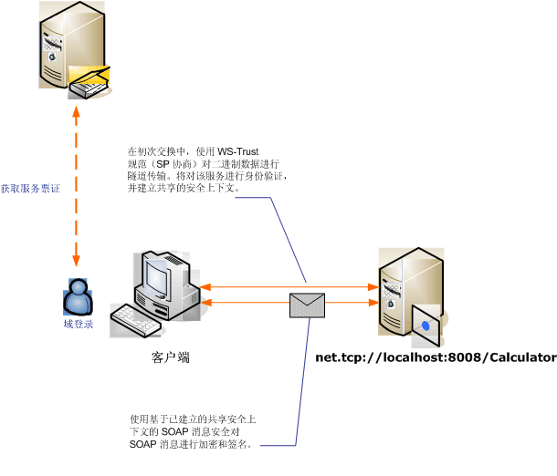

# <a name="message-security-with-a-windows-client"></a><span data-ttu-id="14782-102">Windows 客户端的消息安全</span><span class="sxs-lookup"><span data-stu-id="14782-102">Message Security with a Windows Client</span></span>
<span data-ttu-id="14782-103">此方案显示了 Windows Communication Foundation (WCF) 客户端和服务器保护的消息安全模式。</span><span class="sxs-lookup"><span data-stu-id="14782-103">This scenario shows a Windows Communication Foundation (WCF) client and server secured by message security mode.</span></span> <span data-ttu-id="14782-104">客户端和服务使用 Windows 凭据进行身份验证。</span><span class="sxs-lookup"><span data-stu-id="14782-104">The client and service are authenticated using Windows credentials.</span></span>  
  
 <span data-ttu-id="14782-105"></span><span class="sxs-lookup"><span data-stu-id="14782-105"></span></span>  
  
|<span data-ttu-id="14782-106">特征</span><span class="sxs-lookup"><span data-stu-id="14782-106">Characteristic</span></span>|<span data-ttu-id="14782-107">描述</span><span class="sxs-lookup"><span data-stu-id="14782-107">Description</span></span>|  
|--------------------|-----------------|  
|<span data-ttu-id="14782-108">安全模式</span><span class="sxs-lookup"><span data-stu-id="14782-108">Security Mode</span></span>|<span data-ttu-id="14782-109">消息</span><span class="sxs-lookup"><span data-stu-id="14782-109">Message</span></span>|  
|<span data-ttu-id="14782-110">互操作性</span><span class="sxs-lookup"><span data-stu-id="14782-110">Interoperability</span></span>|<span data-ttu-id="14782-111">WCF 仅</span><span class="sxs-lookup"><span data-stu-id="14782-111">WCF Only</span></span>|  
|<span data-ttu-id="14782-112">身份验证（服务器）</span><span class="sxs-lookup"><span data-stu-id="14782-112">Authentication (Server)</span></span>|<span data-ttu-id="14782-113">服务器和客户端的相互身份验证</span><span class="sxs-lookup"><span data-stu-id="14782-113">Mutual authentication of the server and client</span></span>|  
|<span data-ttu-id="14782-114">身份验证（客户端）</span><span class="sxs-lookup"><span data-stu-id="14782-114">Authentication (Client)</span></span>|<span data-ttu-id="14782-115">服务器和客户端的相互身份验证</span><span class="sxs-lookup"><span data-stu-id="14782-115">Mutual authentication of the server and client</span></span>|  
|<span data-ttu-id="14782-116">完整性</span><span class="sxs-lookup"><span data-stu-id="14782-116">Integrity</span></span>|<span data-ttu-id="14782-117">是，使用共享安全上下文</span><span class="sxs-lookup"><span data-stu-id="14782-117">Yes, using shared security context</span></span>|  
|<span data-ttu-id="14782-118">保密性</span><span class="sxs-lookup"><span data-stu-id="14782-118">Confidentiality</span></span>|<span data-ttu-id="14782-119">是，使用共享安全上下文</span><span class="sxs-lookup"><span data-stu-id="14782-119">Yes, using shared security context</span></span>|  
|<span data-ttu-id="14782-120">传输</span><span class="sxs-lookup"><span data-stu-id="14782-120">Transport</span></span>|<span data-ttu-id="14782-121">NET.TCP</span><span class="sxs-lookup"><span data-stu-id="14782-121">NET.TCP</span></span>|  
|<span data-ttu-id="14782-122">绑定</span><span class="sxs-lookup"><span data-stu-id="14782-122">Binding</span></span>|<xref:System.ServiceModel.NetTcpBinding>|  
  
## <a name="service"></a><span data-ttu-id="14782-123">服务</span><span class="sxs-lookup"><span data-stu-id="14782-123">Service</span></span>  
 <span data-ttu-id="14782-124">下面的代码和配置应独立运行。</span><span class="sxs-lookup"><span data-stu-id="14782-124">The following code and configuration are meant to run independently.</span></span> <span data-ttu-id="14782-125">执行下列操作之一：</span><span class="sxs-lookup"><span data-stu-id="14782-125">Do one of the following:</span></span>  
  
-   <span data-ttu-id="14782-126">使用代码（而不使用配置）创建独立服务。</span><span class="sxs-lookup"><span data-stu-id="14782-126">Create a stand-alone service using the code with no configuration.</span></span>  
  
-   <span data-ttu-id="14782-127">使用提供的配置创建服务，但不定义任何终结点。</span><span class="sxs-lookup"><span data-stu-id="14782-127">Create a service using the supplied configuration, but do not define any endpoints.</span></span>  
  
### <a name="code"></a><span data-ttu-id="14782-128">代码</span><span class="sxs-lookup"><span data-stu-id="14782-128">Code</span></span>  
 <span data-ttu-id="14782-129">下面的代码演示如何创建一个使用消息安全来建立 Windows 计算机安全上下文的服务终结点。</span><span class="sxs-lookup"><span data-stu-id="14782-129">The following code shows how to create a service endpoint that uses message security to establish a secure context with a Windows machine.</span></span>  
  
 [!code-csharp[C_SecurityScenarios#11](../../../../samples/snippets/csharp/VS_Snippets_CFX/c_securityscenarios/cs/source.cs#11)]
 [!code-vb[C_SecurityScenarios#11](../../../../samples/snippets/visualbasic/VS_Snippets_CFX/c_securityscenarios/vb/source.vb#11)]  
  
### <a name="configuration"></a><span data-ttu-id="14782-130">配置</span><span class="sxs-lookup"><span data-stu-id="14782-130">Configuration</span></span>  
 <span data-ttu-id="14782-131">下面的配置可代替代码用于设置服务：</span><span class="sxs-lookup"><span data-stu-id="14782-131">The following configuration can be used instead of the code to set up the service:</span></span>  
  
```xml  
<?xml version="1.0" encoding="utf-8"?>  
<configuration>  
  <system.serviceModel>  
    <services>  
      <service behaviorConfiguration=""  
               name="ServiceModel.Calculator">  
        <endpoint address="net.tcp://localhost:8008/Calculator"  
                  binding="netTcpBinding"  
                  bindingConfiguration="Windows"  
                  name="WindowsOverMessage"  
                  contract="ServiceModel.ICalculator" />  
      </service>  
    </services>  
    <bindings>  
      <netTcpBinding>  
        <binding name="Windows">  
          <security mode="Message">  
            <message clientCredentialType="Windows" />  
          </security>  
        </binding>  
      </netTcpBinding>  
    </bindings>  
    <client />  
  </system.serviceModel>  
</configuration>  
```  
  
## <a name="client"></a><span data-ttu-id="14782-132">客户端</span><span class="sxs-lookup"><span data-stu-id="14782-132">Client</span></span>  
 <span data-ttu-id="14782-133">下面的代码和配置应独立运行。</span><span class="sxs-lookup"><span data-stu-id="14782-133">The following code and configuration are meant to run independently.</span></span> <span data-ttu-id="14782-134">执行下列操作之一：</span><span class="sxs-lookup"><span data-stu-id="14782-134">Do one of the following:</span></span>  
  
-   <span data-ttu-id="14782-135">使用代码（和客户端代码）创建独立客户端。</span><span class="sxs-lookup"><span data-stu-id="14782-135">Create a stand-alone client using the code (and client code).</span></span>  
  
-   <span data-ttu-id="14782-136">创建不定义任何终结点地址的客户端。</span><span class="sxs-lookup"><span data-stu-id="14782-136">Create a client that does not define any endpoint addresses.</span></span> <span data-ttu-id="14782-137">而使用将配置名称作为参数的客户端构造函数。</span><span class="sxs-lookup"><span data-stu-id="14782-137">Instead, use the client constructor that takes the configuration name as an argument.</span></span> <span data-ttu-id="14782-138">例如：</span><span class="sxs-lookup"><span data-stu-id="14782-138">For example:</span></span>  
  
     [!code-csharp[C_SecurityScenarios#0](../../../../samples/snippets/csharp/VS_Snippets_CFX/c_securityscenarios/cs/source.cs#0)]
     [!code-vb[C_SecurityScenarios#0](../../../../samples/snippets/visualbasic/VS_Snippets_CFX/c_securityscenarios/vb/source.vb#0)]  
  
### <a name="code"></a><span data-ttu-id="14782-139">代码</span><span class="sxs-lookup"><span data-stu-id="14782-139">Code</span></span>  
 <span data-ttu-id="14782-140">下面的代码创建客户端。</span><span class="sxs-lookup"><span data-stu-id="14782-140">The following code creates a client.</span></span> <span data-ttu-id="14782-141">绑定设置为 Message 安全模式，客户端凭据类型设置为 `Windows`。</span><span class="sxs-lookup"><span data-stu-id="14782-141">The binding is to Message mode security, and the client credential type is set to `Windows`.</span></span>  
  
 [!code-csharp[C_SecurityScenarios#18](../../../../samples/snippets/csharp/VS_Snippets_CFX/c_securityscenarios/cs/source.cs#18)]
 [!code-vb[C_SecurityScenarios#18](../../../../samples/snippets/visualbasic/VS_Snippets_CFX/c_securityscenarios/vb/source.vb#18)]  
  
### <a name="configuration"></a><span data-ttu-id="14782-142">配置</span><span class="sxs-lookup"><span data-stu-id="14782-142">Configuration</span></span>  
 <span data-ttu-id="14782-143">下面的配置用于设置客户端属性。</span><span class="sxs-lookup"><span data-stu-id="14782-143">The following configuration is used to set the client properties.</span></span>  
  
```xml  
<?xml version="1.0" encoding="utf-8"?>  
<configuration>  
  <system.serviceModel>  
    <bindings>  
      <netTcpBinding>  
        <binding name="NetTcpBinding_ICalculator" >  
         <security mode="Message">  
            <message clientCredentialType="Windows" />  
          </security>  
        </binding>  
      </netTcpBinding>  
    </bindings>  
    <client>  
      <endpoint address="net.tcp://machineName:8008/Calculator"   
                binding="netTcpBinding"  
                bindingConfiguration="NetTcpBinding_ICalculator"  
                contract="ICalculator"  
                name="NetTcpBinding_ICalculator">          
      </endpoint>  
    </client>  
  </system.serviceModel>  
</configuration>  
```  
  
## <a name="see-also"></a><span data-ttu-id="14782-144">请参阅</span><span class="sxs-lookup"><span data-stu-id="14782-144">See Also</span></span>  
 [<span data-ttu-id="14782-145">安全性概述</span><span class="sxs-lookup"><span data-stu-id="14782-145">Security Overview</span></span>](../../../../docs/framework/wcf/feature-details/security-overview.md)  
 [<span data-ttu-id="14782-146">Windows Server App Fabric 的安全模型</span><span class="sxs-lookup"><span data-stu-id="14782-146">Security Model for Windows Server App Fabric</span></span>](https://go.microsoft.com/fwlink/?LinkID=201279&clcid=0x409)
