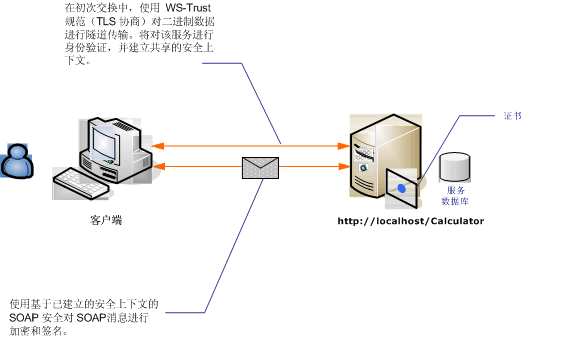

# <a name="message-security-with-an-anonymous-client"></a>匿名客户端的消息安全
下面的方案演示客户端和受 Windows Communication Foundation (WCF) 消息安全的服务。 设计目标是使用消息安全而非传输安全，以便将来可支持更加丰富的基于声明的模型。 有关使用丰富的声明进行授权的详细信息，请参阅[管理声明和使用标识模型的授权](../../../../docs/framework/wcf/feature-details/managing-claims-and-authorization-with-the-identity-model.md)。  
  
 有关示例应用程序，请参阅[匿名消息安全](../../../../docs/framework/wcf/samples/message-security-anonymous.md)。  
  
   
  
|特征|描述|  
|--------------------|-----------------|  
|安全模式|消息|  
|互操作性|WCF 仅|  
|身份验证（服务器）|初始协商要求服务器身份验证，而不是客户端身份验证|  
|身份验证（客户端）|无|  
|完整性|是，使用共享安全上下文|  
|保密性|是，使用共享安全上下文|  
|传输|HTTP|  
  
## <a name="service"></a>服务  
 下面的代码和配置应独立运行。 执行下列操作之一：  
  
-   使用代码（而不使用配置）创建独立服务。  
  
-   使用提供的配置创建服务，但不定义任何终结点。  
  
### <a name="code"></a>代码  
 下面的代码演示如何创建使用消息安全的服务终结点。  
  
 [!code-csharp[C_SecurityScenarios#8](../../../../samples/snippets/csharp/VS_Snippets_CFX/c_securityscenarios/cs/source.cs#8)]
 [!code-vb[C_SecurityScenarios#8](../../../../samples/snippets/visualbasic/VS_Snippets_CFX/c_securityscenarios/vb/source.vb#8)]  
  
### <a name="configuration"></a>配置  
 以下配置可代替代码使用。 服务行为元素用于指定用来向客户端验证服务身份的证书。 服务元素必须使用 `behaviorConfiguration` 属性指定行为。 绑定元素指定客户端凭据类型为 `None`，这将允许匿名客户端使用该服务。  
  
```xml  
<?xml version="1.0" encoding="utf-8"?>  
<configuration>  
  <system.serviceModel>  
    <behaviors>  
      <serviceBehaviors>  
        <behavior name="ServiceCredentialsBehavior">  
          <serviceCredentials>  
            <serviceCertificate findValue="contoso.com"   
                                storeLocation="LocalMachine"  
                                storeName="My" />  
          </serviceCredentials>  
        </behavior>  
      </serviceBehaviors>  
    </behaviors>  
    <services>  
      <service behaviorConfiguration="ServiceCredentialsBehavior"   
               name="ServiceModel.Calculator">  
        <endpoint address="http://localhost/Calculator"   
                  binding="wsHttpBinding"  
                  bindingConfiguration="WSHttpBinding_ICalculator"   
                  name="CalculatorService"  
                  contract="ServiceModel.ICalculator" />  
      </service>  
    </services>  
    <bindings>  
      <wsHttpBinding>  
        <binding name="WSHttpBinding_ICalculator" >  
          <security mode="Message">  
            <message clientCredentialType="None" />  
          </security>  
        </binding>  
      </wsHttpBinding>  
    </bindings>  
    <client />  
  </system.serviceModel>  
</configuration>  
```  
  
## <a name="client"></a>客户端  
 下面的代码和配置应独立运行。 执行下列操作之一：  
  
-   使用代码（和客户端代码）创建独立客户端。  
  
-   创建不定义任何终结点地址的客户端。 而使用将配置名称作为参数的客户端构造函数。 例如：  
  
     [!code-csharp[C_SecurityScenarios#0](../../../../samples/snippets/csharp/VS_Snippets_CFX/c_securityscenarios/cs/source.cs#0)]
     [!code-vb[C_SecurityScenarios#0](../../../../samples/snippets/visualbasic/VS_Snippets_CFX/c_securityscenarios/vb/source.vb#0)]  
  
### <a name="code"></a>代码  
 下面的代码创建客户端的一个实例。 绑定使用消息模式安全，客户端凭据类型设置为 None。  
  
 [!code-csharp[C_SecurityScenarios#15](../../../../samples/snippets/csharp/VS_Snippets_CFX/c_securityscenarios/cs/source.cs#15)]
 [!code-vb[C_SecurityScenarios#15](../../../../samples/snippets/visualbasic/VS_Snippets_CFX/c_securityscenarios/vb/source.vb#15)]  
  
### <a name="configuration"></a>配置  
 下面的代码将配置客户端。  
  
```xml  
<?xml version="1.0" encoding="utf-8"?>  
<configuration>  
  <system.serviceModel>  
    <bindings>  
      <wsHttpBinding>  
        <binding name="WSHttpBinding_ICalculator" >  
          <security mode="Message">  
            <message clientCredentialType="None" />  
          </security>  
        </binding>  
      </wsHttpBinding>  
    </bindings>  
    <client>  
      <endpoint address="http://machineName/Calculator"  
        binding="wsHttpBinding"  
        bindingConfiguration="WSHttpBinding_ICalculator"   
        contract="ICalculator"  
        name="WSHttpBinding_ICalculator">  
        <identity>  
          <dns value="contoso.com" />  
        </identity>  
      </endpoint>  
    </client>  
  </system.serviceModel>  
</configuration>  
```  
  
## <a name="see-also"></a>请参阅  
 [安全性概述](../../../../docs/framework/wcf/feature-details/security-overview.md)  
 [分布式应用程序安全](../../../../docs/framework/wcf/feature-details/distributed-application-security.md)  
 [匿名消息安全](../../../../docs/framework/wcf/samples/message-security-anonymous.md)  
 [服务标识和身份验证](../../../../docs/framework/wcf/feature-details/service-identity-and-authentication.md)  
 [Windows Server App Fabric 的安全模型](http://go.microsoft.com/fwlink/?LinkID=201279&clcid=0x409)
