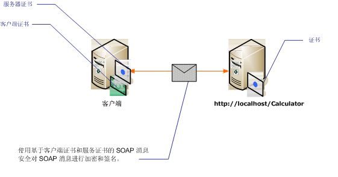

# <a name="message-security-with-mutual-certificates"></a>使用相互证书的消息安全
以下方案显示了 Windows Communication Foundation (WCF) 服务和使用消息安全模式保护的客户端。 使用证书对客户端和服务进行身份验证。  
  
 本方案是可互操作的，因为它使用具有 X.509 证书令牌配置文件的 WS-Security。  
  
> [!NOTE]
>  本方案不对服务证书执行协商。 在进行任何通信之前，必须先向客户端提供服务证书。 服务器证书可以随应用程序一起分发，也可以通过带外通信来提供。  
  
   
  
|特征|描述|  
|--------------------|-----------------|  
|安全模式|消息|  
|互操作性|是，使用 WS-Security 和 X.509 证书令牌配置文件兼容的客户端和服务。|  
|身份验证|服务器和客户端的相互身份验证。|  
|完整性|是|  
|保密性|是|  
|传输|HTTP|  
|绑定|<xref:System.ServiceModel.WSHttpBinding>|  
  
## <a name="service"></a>服务  
 下面的代码和配置应独立运行。 执行下列操作之一：  
  
- 使用代码（而不使用配置）创建独立服务。  
  
- 使用提供的配置创建服务，但不定义任何终结点。  
  
### <a name="code"></a>代码  
 下面的代码演示如何创建使用消息安全的服务终结点。 服务请求一个证书来使自己通过身份验证。  
  
 [!code-csharp[C_SecurityScenarios#13](../../../../samples/snippets/csharp/VS_Snippets_CFX/c_securityscenarios/cs/source.cs#13)]
 [!code-vb[C_SecurityScenarios#13](../../../../samples/snippets/visualbasic/VS_Snippets_CFX/c_securityscenarios/vb/source.vb#13)]  
  
### <a name="configuration"></a>配置  
 可以使用下面的配置，而不使用代码来创建同样的服务。  
  
```xml  
<?xml version="1.0" encoding="utf-8"?>  
<configuration>  
  <system.serviceModel>  
    <behaviors>  
      <serviceBehaviors>  
        <behavior name="serviceCredentialBehavior">  
          <serviceCredentials>  
            <serviceCertificate findValue="Contoso.com"   
                                storeLocation="LocalMachine"  
                                storeName="My"   
                                x509FindType="FindBySubjectName" />  
          </serviceCredentials>  
        </behavior>  
      </serviceBehaviors>  
    </behaviors>  
    <services>  
      <service behaviorConfiguration="serviceCredentialBehavior"   
               name="ServiceModel.Calculator">  
        <endpoint address="http://localhost/Calculator"   
                  binding="wsHttpBinding"  
                  bindingConfiguration="InteropCertificateBinding"  
                  name="WSHttpBinding_ICalculator"  
                  contract="ServiceModel.ICalculator" />  
      </service>  
    </services>  
    <bindings>  
      <wsHttpBinding>  
        <binding name="InteropCertificateBinding">  
          <security mode="Message">  
            <message clientCredentialType="Certificate"  
                     negotiateServiceCredential="false"  
                     establishSecurityContext="false" />  
          </security>  
        </binding>  
      </wsHttpBinding>  
    </bindings>  
    <client />  
  </system.serviceModel>  
</configuration>  
```  
  
## <a name="client"></a>客户端  
 下面的代码和配置应独立运行。 执行下列操作之一：  
  
- 使用代码（和客户端代码）创建独立客户端。  
  
- 创建不定义任何终结点地址的客户端。 而使用将配置名称作为自变量的客户端构造函数。 例如：  
  
     [!code-csharp[C_SecurityScenarios#0](../../../../samples/snippets/csharp/VS_Snippets_CFX/c_securityscenarios/cs/source.cs#0)]
     [!code-vb[C_SecurityScenarios#0](../../../../samples/snippets/visualbasic/VS_Snippets_CFX/c_securityscenarios/vb/source.vb#0)]  
  
### <a name="code"></a>代码  
 下面的代码创建客户端。 安全模式设置为“消息”，客户端凭据类型设置为“证书”。  
  
 [!code-csharp[C_SecurityScenarios#20](../../../../samples/snippets/csharp/VS_Snippets_CFX/c_securityscenarios/cs/source.cs#20)]
 [!code-vb[C_SecurityScenarios#20](../../../../samples/snippets/visualbasic/VS_Snippets_CFX/c_securityscenarios/vb/source.vb#20)]  
  
### <a name="configuration"></a>配置  
 下面配置客户端。 必须使用指定的客户端证书[ \<clientCertificate >](../../../../docs/framework/configure-apps/file-schema/wcf/clientcertificate-of-clientcredentials-element.md)。 此外，使用指定的服务证书[ \<defaultCertificate >](../../../../docs/framework/configure-apps/file-schema/wcf/defaultcertificate-element.md)。  
  
```xml  
<?xml version="1.0" encoding="utf-8"?>  
<configuration>  
  <system.serviceModel>  
    <behaviors>  
      <endpointBehaviors>  
        <behavior name="ClientCredentialsBehavior">  
          <clientCredentials>  
            <clientCertificate findValue="Cohowinery.com"   
                 storeLocation="CurrentUser"  
                 storeName="My"  
                 x509FindType="FindBySubjectName" />  
            <serviceCertificate>  
              <defaultCertificate findValue="Contoso.com"   
                                  storeLocation="CurrentUser"  
                                  storeName="TrustedPeople"  
                                  x509FindType="FindBySubjectName" />  
            </serviceCertificate>  
          </clientCredentials>  
        </behavior>  
      </endpointBehaviors>  
    </behaviors>  
    <bindings>  
      <wsHttpBinding>  
        <binding name="WSHttpBinding_ICalculator" >  
          <security mode="Message">  
            <message clientCredentialType="Certificate"   
                     negotiateServiceCredential="false"  
                     establishSecurityContext="false" />  
          </security>  
        </binding>  
      </wsHttpBinding>  
    </bindings>  
    <client>  
      <endpoint address="http://machineName/Calculator"   
                behaviorConfiguration="ClientCredentialsBehavior"  
                binding="wsHttpBinding"   
                bindingConfiguration="WSHttpBinding_ICalculator"  
                contract="ICalculator"  
                name="WSHttpBinding_ICalculator">  
        <identity>  
          <certificate encodedValue="Encoded_Value_Not_Shown" />  
        </identity>  
      </endpoint>  
    </client>  
  </system.serviceModel>  
</configuration>  
```  
  
## <a name="see-also"></a>请参阅

- [安全性概述](../../../../docs/framework/wcf/feature-details/security-overview.md)
- [Windows Server App Fabric 的安全模型](https://go.microsoft.com/fwlink/?LinkID=201279&clcid=0x409)
- [如何：创建和安装临时证书在 WCF 中的传输安全模式在开发过程](https://go.microsoft.com/fwlink/?LinkId=244264)
