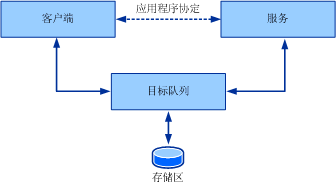
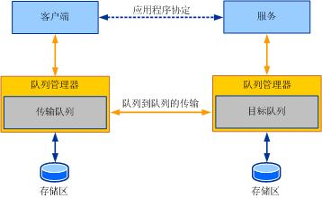
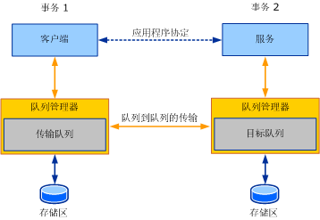

# 队列概述
本节介绍与排队通信相关的一般概念和核心概念。 后续各节将有关此处所述的队列概念中如何显示在 Windows Communication Foundation (WCF) 的详细信息。  
  
## 基本的队列概念  
 设计分布式应用程序时，在服务和客户端之间选择正确的通信传输是非常重要的。 使用的传输种类受几个因素影响。 一个重要的因素是服务、客户端和传输之间的隔离，它可确定是使用排队传输，还是使用直接传输（如 TCP 或 HTTP）。 由于直接传输（如 TCP 和 HTTP）的特性，如果服务或客户端停止工作或网络发生故障时，通信就会停止。 服务、客户端和网络必须同时运行，应用程序才能工作。 排队传输可提供隔离，即如果服务或客户端发生故障或它们之间的通信链接出现问题，客户端和服务还可以继续工作。  
  
 即使通信方或网络出现故障，队列也可以提供可靠的通信。 队列捕获和传送在通信方之间交换的消息。 通常，某些种类的存储（可变或持久）可支持队列。 队列存储来自代表服务的客户端的消息，然后将这些消息转发给该服务。 间接寻址队列可确保隔离出现故障的任意一方，因此可将它作为高可用性系统和断开服务的首选通信机制。 间接寻址会产生因高延迟而引起的成本。 *延迟*是客户端发送一条消息的时间和服务接收的时间之间的时间延迟。 这表示发送消息后，不知道何时会处理该消息。 大多数的排队应用程序都需要处理高延迟。 下面的插图显示了排队通信的概念模型。  
  
   
  
 排队通信概念模型  
  
 实际上，队列是一个分布式概念。 因此，它们可以是任意一方的本地队列，也可以是双方的远程队列。 通常，对于服务而言，队列是本地的。 在此配置中，客户端不会因连接到远程队列而持续可用。 同样，队列必须在独立于从队列读取的服务的可用性时才可用。 队列管理器管理队列集合。 它负责接收其他队列管理器发送给它的队列的消息。 它还负责管理连接远程队列并将消息传输至这些远程队列。 在客户端或服务应用程序出现故障时，要确保队列的可用性，队列管理器通常会作为外部服务运行。  
  
 客户端将消息发送至队列时，队列管理器会将该消息定址到由服务队列管理器管理的目标队列。 客户端上的队列管理器将消息发送至传输（或传出）队列。 传输队列是客户端队列管理器（将传输的消息存储至目标队列）上的队列。 然后队列管理器查找一个拥有目标队列的队列管理器的路径并将消息传输给它。 要确保可靠通信，队列管理器将实现可靠传输协议以避免数据丢失。 目标队列管理器接受定址到目标队列的消息，该管理器可拥有并存储消息。 服务发出从目标队列读取的请求时，队列管理器将消息传送至目标应用程序。 下面的插图显示了四方之间的通信。  
  
   
  
 典型的部署方案中的排队通信  
  
 因此，队列管理器可提供所需的隔离，这样在发送方和接收方单独出现故障时，不会影响实际的通信。 队列提供的额外间接寻址的优点还可以启用多个应用程序实例，以从同一队列中进行读取操作，这样节点间场工作的吞吐量可以更高。 因此，队列用于实现较高的缩放和吞吐量要求的情况并不少见。  
  
## 队列和事务  
 事务允许您将一组操作组合到一起，这样如果一个操作失败，所有的操作都将失败。 事务使用方法的一个示例：某人使用 ATM 将存款帐户中的 1,000 美元转存到他的支票帐户中。 需要的操作如下：  
  
-   从存款帐户中取出 1,000 美元。  
  
-   将 1,000 美元存入支票帐户中。  
  
 如果第一步操作成功完成，即从存款帐户中取出了 1,000 美元，但没有完成第二步操作，则将会丢失 1,000 美元，因为这笔钱已经从存款帐户中取出。 为了保持帐户处于有效状态，如果一个操作失败，则两个操作都必须无效。  
  
 在事务性消息处理中，将消息发送至事务的队列并从该队列接收消息。 因此，如果在事务中发送消息后并且该事务被回滚，则结果就像从未将消息发送至队列一样。 同样，如果在事务中接收消息并且该事务被回滚，则结果就像从未接收过消息一样。 消息会保留在要读取的队列中。  
  
 由于高延迟，因此发送消息后，您无法知道需要多长时间消息才能到达它的目标队列，也不会知道需要多长时间服务才能处理该消息。 因此，不要使用单个事务来发送消息、接收消息以及处理消息。 这样创建的事务才不会出现不确定的时间量。 客户端和服务通过队列使用事务进行通信时，会涉及两个事务：一个在客户端上，另一个在服务上。 下面的插图显示了在典型排队通信中的事务边界。  
  
   
  
 排队通信，其中分别显示了捕获和传送事务  
  
 客户端事务处理并发送消息。 提交事务时，消息位于传输队列。 在服务上，事务读取来自目标队列的消息，处理消息，然后提交事务。 如果在处理期间发生错误，则消息将被回滚并置于目标队列中。  
  
## 使用队列的异步通信  
 队列提供一个异步通信的方法。 由于队列管理器引起的高延迟，使用队列发送消息的应用程序无法等待接收方要接收并处理的消息。 消息保留在队列中的时间可能远长于应用程序期望的时间。 为了避免这种情况发生，应用程序可以为消息指定一个生存时间值。 此值指定消息应该保留在传输队列中的时间。 如果超出了此时间值，而消息仍然未发送至目标队列，则可以将消息传输到死信队列。  
  
 当发送方发送消息时，来自发送操作的返回表示消息只能被传送到发送方的传输队列中。 因此，如果在将消息传送至目标队列时失败，则发送应用程序不能立即知道该情况。 为了记录这些失败情况，失败消息将被传输到死信队列中。  
  
 任何错误，例如消息无法到达目标队列或生存时间即将过期，都必须单独处理。 因此通常情况下，排队应用程序会写入两组逻辑：  
  
-   发送和接收消息的普通客户端和服务逻辑。  
  
-   处理失败传输或传送中的消息的补偿逻辑。  
  
 下面的部分讨论以下概念。  
  
## 死信队列编程  
 死信队列包含由于各种原因无法到达目标队列的消息。 原因可能是消息过期、阻止消息传输到目标队列的连接问题等各种原因。  
  
 通常情况下，应用程序可以从系统级死信队列中读取消息以确定发生了什么错误，并执行适当的操作，例如更正错误并重新发送消息或者记录该消息。  
  
## 病毒消息队列编程  
 在将消息传送到目标队列后，服务在处理该消息时可能会反复出现故障。 例如，从事务的队列中读取消息和更新数据库的应用程序可能会发现数据库暂时已断开连接。 在这种情况下，事务将回滚，会创建一个新的事务，并从队列中重新读取消息。 第二次尝试可能成功，也可能失败。 在某些情况下，根据错误产生的原因，消息传送到应用程序时可能会反复出现故障。 在这种情况下，该消息被认为是“病毒”。 这些消息将移动到可以通过病毒处理应用程序读取的病毒队列中。  
  
## 请参阅  
 [在 WCF 中排队](../../../../docs/framework/wcf/feature-details/queuing-in-wcf.md)  
 [在 WCF 中排队](../../../../docs/framework/wcf/feature-details/queuing-in-wcf.md)  
 [会话和队列](../../../../docs/framework/wcf/samples/sessions-and-queues.md)  
 [死信队列](../../../../docs/framework/wcf/samples/dead-letter-queues.md)  
 [可变排队通信](../../../../docs/framework/wcf/samples/volatile-queued-communication.md)  
 [Windows Communication Foundation 到消息队列](../../../../docs/framework/wcf/samples/wcf-to-message-queuing.md)  
 [安装消息队列 (MSMQ)](../../../../docs/framework/wcf/samples/installing-message-queuing-msmq.md)  
 [消息队列集成绑定示例](https://msdn.microsoft.com/library/997d11cb-f2c5-4ba0-9209-92843d4d0e1a)  
 [到 Windows Communication Foundation 的消息队列](../../../../docs/framework/wcf/samples/message-queuing-to-wcf.md)  
 [基于消息队列的消息安全性](../../../../docs/framework/wcf/samples/message-security-over-message-queuing.md)
