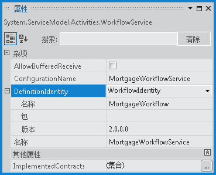

# <a name="side-by-side-versioning-in-workflowservicehost"></a><span data-ttu-id="2ea2c-102">WorkflowServiceHost 中的并行版本控制</span><span class="sxs-lookup"><span data-stu-id="2ea2c-102">Side by Side Versioning in WorkflowServiceHost</span></span>
<span data-ttu-id="2ea2c-103"><xref:System.ServiceModel.Activities.WorkflowServiceHost> 中引入的 [!INCLUDE[net_v45](../../../../includes/net-v45-md.md)] 并行版本控制功能提供了在单个终结点上承载工作流服务的多个版本的能力。</span><span class="sxs-lookup"><span data-stu-id="2ea2c-103">The <xref:System.ServiceModel.Activities.WorkflowServiceHost> side-by-side versioning introduced in [!INCLUDE[net_v45](../../../../includes/net-v45-md.md)] provides the capability to host multiple versions of a workflow service on a single endpoint.</span></span> <span data-ttu-id="2ea2c-104">所提供的并行功能允许配置工作流服务，以便使用新的工作流定义来创建工作流服务的新实例，而对于正在运行的实例则使用现有的定义来完成。</span><span class="sxs-lookup"><span data-stu-id="2ea2c-104">The side-by-side functionality provided allows a workflow service to be configured so that new instances of the workflow service are created using the new workflow definition, while running instances complete using the existing definition.</span></span> <span data-ttu-id="2ea2c-105">本主题概述了使用 <xref:System.ServiceModel.Activities.WorkflowServiceHost> 的工作流服务并行执行。</span><span class="sxs-lookup"><span data-stu-id="2ea2c-105">This topic provides an overview of workflow service side-by-side execution using <xref:System.ServiceModel.Activities.WorkflowServiceHost>.</span></span>  
  
> [!NOTE]
>  <span data-ttu-id="2ea2c-106">若要下载示例并观看工作流服务的并行版本控制的视频演练，请参阅[web 承载的 Xamlx 工作流服务并行版本控制](http://go.microsoft.com/fwlink/?LinkId=393746)。</span><span class="sxs-lookup"><span data-stu-id="2ea2c-106">To download a sample and watch a video walkthrough of workflow service side-by-side versioning, see [Side by Side Versioning with a Web-Hosted Xamlx Workflow Service](http://go.microsoft.com/fwlink/?LinkId=393746).</span></span>  
  
## <a name="hosting-multiple-versions-in-a-workflow-service"></a><span data-ttu-id="2ea2c-107">在工作流服务中承载多个版本</span><span class="sxs-lookup"><span data-stu-id="2ea2c-107">Hosting Multiple Versions in a Workflow Service</span></span>  
 <span data-ttu-id="2ea2c-108"><xref:System.ServiceModel.Activities.WorkflowServiceHost> 包含两个属性，它们可配置为允许工作流的多个版本并行执行：<xref:System.ServiceModel.Activities.WorkflowServiceHost.SupportedVersions%2A> 和 <xref:System.ServiceModel.Activities.WorkflowService.DefinitionIdentity%2A>。</span><span class="sxs-lookup"><span data-stu-id="2ea2c-108"><xref:System.ServiceModel.Activities.WorkflowServiceHost> contains two properties that can be configured to allow multiple versions of a workflow to execute side-by-side: <xref:System.ServiceModel.Activities.WorkflowServiceHost.SupportedVersions%2A> and <xref:System.ServiceModel.Activities.WorkflowService.DefinitionIdentity%2A>.</span></span> <span data-ttu-id="2ea2c-109"><xref:System.ServiceModel.Activities.WorkflowServiceHost.SupportedVersions%2A> 包含所支持的工作流服务版本，而 <xref:System.ServiceModel.Activities.WorkflowService.DefinitionIdentity%2A> 用于唯一地标识每个工作流服务。</span><span class="sxs-lookup"><span data-stu-id="2ea2c-109"><xref:System.ServiceModel.Activities.WorkflowServiceHost.SupportedVersions%2A> contains the supported versions of the workflow service, and <xref:System.ServiceModel.Activities.WorkflowService.DefinitionIdentity%2A> is used to uniquely identify each workflow service.</span></span> <span data-ttu-id="2ea2c-110">这一点通过将 <xref:System.Activities.WorkflowIdentity> 与工作流服务关联来实现。</span><span class="sxs-lookup"><span data-stu-id="2ea2c-110">This is done by associating a <xref:System.Activities.WorkflowIdentity> with the workflow service.</span></span> <span data-ttu-id="2ea2c-111"><xref:System.Activities.WorkflowIdentity> 包含三条标识信息。</span><span class="sxs-lookup"><span data-stu-id="2ea2c-111">A <xref:System.Activities.WorkflowIdentity> contains three identifying pieces of information.</span></span> <span data-ttu-id="2ea2c-112"><xref:System.Activities.WorkflowIdentity.Name%2A> 和 <xref:System.Activities.WorkflowIdentity.Version%2A> 包含一个名称和一个 <xref:System.Version>，并且是必需的；而 <xref:System.Activities.WorkflowIdentity.Package%2A> 则是可选的，可用于指定包含如程序集名称或其他所需信息的附加字符串。</span><span class="sxs-lookup"><span data-stu-id="2ea2c-112"><xref:System.Activities.WorkflowIdentity.Name%2A> and <xref:System.Activities.WorkflowIdentity.Version%2A> contain a name and a <xref:System.Version> and are required, and <xref:System.Activities.WorkflowIdentity.Package%2A> is optional and can be used to specify an additional string containing information such as assembly name or other desired information.</span></span> <span data-ttu-id="2ea2c-113"><xref:System.ServiceModel.Activities.WorkflowServiceHost.SupportedVersions%2A> 集合中包含的每个工作流服务都必须具有唯一的 <xref:System.Activities.WorkflowIdentity>。</span><span class="sxs-lookup"><span data-stu-id="2ea2c-113">Each workflow service contained in the <xref:System.ServiceModel.Activities.WorkflowServiceHost.SupportedVersions%2A> collection must have a unique <xref:System.Activities.WorkflowIdentity>.</span></span> <span data-ttu-id="2ea2c-114">如果 <xref:System.Activities.WorkflowIdentity> 的三个属性中有任一属性不同于其他 <xref:System.Activities.WorkflowIdentity>，则它是唯一的。</span><span class="sxs-lookup"><span data-stu-id="2ea2c-114">A <xref:System.Activities.WorkflowIdentity> is unique if any of its three properties are different from another <xref:System.Activities.WorkflowIdentity>.</span></span> <span data-ttu-id="2ea2c-115">A `null` <xref:System.Activities.WorkflowIdentity>是允许的值<xref:System.ServiceModel.Activities.WorkflowService.DefinitionIdentity%2A>，但只有一个以前版本的工作流服务可能有`null` <xref:System.Activities.WorkflowIdentity>。</span><span class="sxs-lookup"><span data-stu-id="2ea2c-115">A `null` <xref:System.Activities.WorkflowIdentity> is an allowable value for <xref:System.ServiceModel.Activities.WorkflowService.DefinitionIdentity%2A>, but only one previous version of a workflow service may have a `null` <xref:System.Activities.WorkflowIdentity>.</span></span>  
  
> [!IMPORTANT]
>  <span data-ttu-id="2ea2c-116"><xref:System.Activities.WorkflowIdentity> 不应包含任何个人身份信息 (PII)。</span><span class="sxs-lookup"><span data-stu-id="2ea2c-116">A <xref:System.Activities.WorkflowIdentity> should not contain any personally identifiable information (PII).</span></span> <span data-ttu-id="2ea2c-117"><xref:System.Activities.WorkflowIdentity> 由三部分组成：<xref:System.Activities.WorkflowIdentity.Name%2A> (<xref:System.String>)、<xref:System.Activities.WorkflowIdentity.Version%2A> (<xref:System.Version>) 和 <xref:System.Activities.WorkflowIdentity.Package%2A> (<xref:System.String>)。</span><span class="sxs-lookup"><span data-stu-id="2ea2c-117"><xref:System.Activities.WorkflowIdentity> is composed of three parts: a <xref:System.Activities.WorkflowIdentity.Name%2A> (<xref:System.String>), a <xref:System.Activities.WorkflowIdentity.Version%2A> (<xref:System.Version>), and a <xref:System.Activities.WorkflowIdentity.Package%2A> (<xref:System.String>).</span></span> <span data-ttu-id="2ea2c-118">在几个不同活动生命周期点，运行时将向任何已配置的跟踪服务发出有关用于创建实例的 <xref:System.Activities.WorkflowIdentity> 的信息。</span><span class="sxs-lookup"><span data-stu-id="2ea2c-118">Information about the <xref:System.Activities.WorkflowIdentity> used to create an instance is emitted to any configured tracking services at several different points of the activity life-cycle by the runtime.</span></span> <span data-ttu-id="2ea2c-119">WF 跟踪没有任何隐藏 PII（敏感用户信息）的机制。</span><span class="sxs-lookup"><span data-stu-id="2ea2c-119">WF Tracking does not have any mechanism to hide PII (sensitive user data).</span></span> <span data-ttu-id="2ea2c-120">因此，<xref:System.Activities.WorkflowIdentity> 实例不应该包含任何 PII 数据，因为运行时将在跟踪记录中发出这些数据，任何有权查看跟踪记录的人都能够看到这些数据。</span><span class="sxs-lookup"><span data-stu-id="2ea2c-120">Therefore, a <xref:System.Activities.WorkflowIdentity> instance should not contain any PII data as it will be emitted by the runtime in tracking records and may be visible to anyone with access to view the tracking records.</span></span>  
  
### <a name="rules-for-hosting-multiple-versions-of-a-workflow-service"></a><span data-ttu-id="2ea2c-121">承载工作流服务的多个版本的规则</span><span class="sxs-lookup"><span data-stu-id="2ea2c-121">Rules for Hosting Multiple Versions of a Workflow Service</span></span>  
 <span data-ttu-id="2ea2c-122">当用户向 <xref:System.ServiceModel.Activities.WorkflowServiceHost> 添加其他版本时，必须满足几个条件，以便以相同的一组终结点和说明来承载工作流服务。</span><span class="sxs-lookup"><span data-stu-id="2ea2c-122">When a user adds an additional version to the <xref:System.ServiceModel.Activities.WorkflowServiceHost>, there are several conditions that must be met in order for a workflow service to be hosted with the same set of endpoints and description.</span></span> <span data-ttu-id="2ea2c-123">如果任何其他版本未能满足这些条件，则 <xref:System.ServiceModel.Activities.WorkflowServiceHost> 在调用 `Open` 时会引发异常。</span><span class="sxs-lookup"><span data-stu-id="2ea2c-123">If any of the additional versions fail to meet these conditions, the <xref:System.ServiceModel.Activities.WorkflowServiceHost> throws an exception when `Open` is called.</span></span> <span data-ttu-id="2ea2c-124">作为附加版本向主机提供的每个工作流定义必须满足以下要求（其中，主版本是提供给主机构造函数的工作流服务定义）。</span><span class="sxs-lookup"><span data-stu-id="2ea2c-124">Each workflow definition provided to the host as an additional version must meet the following requirements (where the primary version is the workflow service definition that is provided to the host constructor).</span></span> <span data-ttu-id="2ea2c-125">附加的工作流版本必须：</span><span class="sxs-lookup"><span data-stu-id="2ea2c-125">The additional workflow version must:</span></span>  
  
-   <span data-ttu-id="2ea2c-126">具有与工作流服务的主版本相同的 <xref:System.ServiceModel.Activities.WorkflowService.Name%2A>。</span><span class="sxs-lookup"><span data-stu-id="2ea2c-126">Have the same the <xref:System.ServiceModel.Activities.WorkflowService.Name%2A> as the primary version of the workflow service.</span></span>  
  
-   <span data-ttu-id="2ea2c-127">在其 <xref:System.ServiceModel.Activities.Receive> 中不得有主版本中不存在的任何 <xref:System.ServiceModel.Activities.SendReply> 或 <xref:System.ServiceModel.Activities.WorkflowService.Body%2A> 活动，并且这些活动必须与操作协定相匹配。</span><span class="sxs-lookup"><span data-stu-id="2ea2c-127">Must not have any <xref:System.ServiceModel.Activities.Receive> or <xref:System.ServiceModel.Activities.SendReply> activities in its <xref:System.ServiceModel.Activities.WorkflowService.Body%2A> that are not in the primary version, and they must match the operation contract.</span></span>  
  
-   <span data-ttu-id="2ea2c-128">具有唯一的 <xref:System.ServiceModel.Activities.WorkflowService.DefinitionIdentity%2A>。</span><span class="sxs-lookup"><span data-stu-id="2ea2c-128">Have a unique <xref:System.ServiceModel.Activities.WorkflowService.DefinitionIdentity%2A>.</span></span> <span data-ttu-id="2ea2c-129">有且仅有一个工作流定义可以具有 `null`<xref:System.ServiceModel.Activities.WorkflowService.DefinitionIdentity%2A>。</span><span class="sxs-lookup"><span data-stu-id="2ea2c-129">One and only one workflow definition may have a `null`<xref:System.ServiceModel.Activities.WorkflowService.DefinitionIdentity%2A>.</span></span>  
  
 <span data-ttu-id="2ea2c-130">允许进行一些更改。</span><span class="sxs-lookup"><span data-stu-id="2ea2c-130">Some changes are permitted.</span></span> <span data-ttu-id="2ea2c-131">以下各项在各版本间可能有所不同：</span><span class="sxs-lookup"><span data-stu-id="2ea2c-131">The following items may be different between the versions:</span></span>  
  
-   <span data-ttu-id="2ea2c-132"><xref:System.ServiceModel.Activities.WorkflowService.DefinitionIdentity%2A> 可能有与主版本不同的名称和包。</span><span class="sxs-lookup"><span data-stu-id="2ea2c-132">The <xref:System.ServiceModel.Activities.WorkflowService.DefinitionIdentity%2A> may have a different Name and Package than the primary version.</span></span>  
  
-   <span data-ttu-id="2ea2c-133"><xref:System.ServiceModel.Activities.WorkflowService.AllowBufferedReceive%2A> 值可能不同于主版本。</span><span class="sxs-lookup"><span data-stu-id="2ea2c-133">The <xref:System.ServiceModel.Activities.WorkflowService.AllowBufferedReceive%2A> value may be different than the primary version.</span></span>  
  
-   <span data-ttu-id="2ea2c-134"><xref:System.ServiceModel.Activities.WorkflowService.ConfigurationName%2A> 可能不同于主版本。</span><span class="sxs-lookup"><span data-stu-id="2ea2c-134">The <xref:System.ServiceModel.Activities.WorkflowService.ConfigurationName%2A> may be different than the primary version.</span></span>  
  
-   <span data-ttu-id="2ea2c-135"><xref:System.ServiceModel.Activities.WorkflowService.ImplementedContracts%2A> 可能不同于主版本。</span><span class="sxs-lookup"><span data-stu-id="2ea2c-135">The <xref:System.ServiceModel.Activities.WorkflowService.ImplementedContracts%2A> may be different than the primary version.</span></span>  
  
### <a name="configuring-the-definitionidentity"></a><span data-ttu-id="2ea2c-136">配置 DefinitionIdentity</span><span class="sxs-lookup"><span data-stu-id="2ea2c-136">Configuring the DefinitionIdentity</span></span>  
 <span data-ttu-id="2ea2c-137">使用工作流设计器中，创建工作流服务时<xref:System.ServiceModel.Activities.WorkflowService.DefinitionIdentity%2A>使用设置**属性**窗口。</span><span class="sxs-lookup"><span data-stu-id="2ea2c-137">When a workflow service is created using the workflow designer, the <xref:System.ServiceModel.Activities.WorkflowService.DefinitionIdentity%2A> is set using the **Properties** window.</span></span> <span data-ttu-id="2ea2c-138">在设计器中选择工作流服务，然后选择服务的根活动外单击**属性窗口**从**视图**菜单。</span><span class="sxs-lookup"><span data-stu-id="2ea2c-138">Click outside of the service’s root activity in the designer to select the workflow service, and choose **Properties Window** from the **View** menu.</span></span> <span data-ttu-id="2ea2c-139">选择**WorkflowIdentity**旁边显示的下拉列表从**DefinitionIdentity**属性，然后展开，并指定所需<xref:System.Activities.WorkflowIdentity>属性。</span><span class="sxs-lookup"><span data-stu-id="2ea2c-139">Select **WorkflowIdentity** from the drop-down list that appears beside the **DefinitionIdentity** property, and then expand and specify the desired <xref:System.Activities.WorkflowIdentity> properties.</span></span> <span data-ttu-id="2ea2c-140">在下面的示例<xref:System.ServiceModel.Activities.WorkflowService.DefinitionIdentity%2A>使用配置<xref:System.Activities.WorkflowIdentity.Name%2A>`MortgageWorkflow`和<xref:System.Activities.WorkflowIdentity.Version%2A>的`1.0.0.0`。</span><span class="sxs-lookup"><span data-stu-id="2ea2c-140">In the following example the <xref:System.ServiceModel.Activities.WorkflowService.DefinitionIdentity%2A> is configured with the <xref:System.Activities.WorkflowIdentity.Name%2A> `MortgageWorkflow` and a <xref:System.Activities.WorkflowIdentity.Version%2A> of `1.0.0.0`.</span></span> <span data-ttu-id="2ea2c-141"><xref:System.Activities.WorkflowIdentity.Package%2A> 是可选的，在此示例中是 `null`。</span><span class="sxs-lookup"><span data-stu-id="2ea2c-141"><xref:System.Activities.WorkflowIdentity.Package%2A> is optional and in this example is `null`.</span></span>  
  
 <span data-ttu-id="2ea2c-142"></span><span class="sxs-lookup"><span data-stu-id="2ea2c-142"></span></span>  
  
 <span data-ttu-id="2ea2c-143">如果工作流服务是自承载的，则 <xref:System.ServiceModel.Activities.WorkflowService.DefinitionIdentity%2A> 在构造工作流服务时配置。</span><span class="sxs-lookup"><span data-stu-id="2ea2c-143">When a workflow service is self-hosted, the <xref:System.ServiceModel.Activities.WorkflowService.DefinitionIdentity%2A> is configured when the workflow service is constructed.</span></span> <span data-ttu-id="2ea2c-144">在下面的示例中，<xref:System.ServiceModel.Activities.WorkflowService.DefinitionIdentity%2A>配置了与前面的示例中，相同的值有<xref:System.Activities.WorkflowIdentity.Name%2A>`MortgageWorkflow`和<xref:System.Activities.WorkflowIdentity.Name%2A>的`1.0.0.0`。</span><span class="sxs-lookup"><span data-stu-id="2ea2c-144">In the following example, the <xref:System.ServiceModel.Activities.WorkflowService.DefinitionIdentity%2A> is configured with the same values as the previous example, with the <xref:System.Activities.WorkflowIdentity.Name%2A> `MortgageWorkflow` and a <xref:System.Activities.WorkflowIdentity.Name%2A> of `1.0.0.0`.</span></span>  
  
```csharp  
WorkflowService service = new WorkflowService  
{  
    Name = "MortgageWorkflowService",  
    Body = new MortgageWorkflow(),  
    DefinitionIdentity = new WorkflowIdentity  
    {  
        Name = "MortgageWorkflow",  
        Version = new Version(1, 0, 0, 0)  
    }  
};  
```  
  
```vb  
Dim service As New WorkflowService  
With service  
    .Name = "MortgageWorkflowService"  
    .Body = New MortgageWorkflow  
    .DefinitionIdentity = New WorkflowIdentity With _  
    { _  
        .Name = "MortgageWorkflow", _  
        .Version = New Version(1, 0, 0, 0) _  
    }  
End With  
```  
  
 <span data-ttu-id="2ea2c-145">A<xref:System.ServiceModel.Activities.WorkflowService.DefinitionIdentity%2A>不必需的但只有一个版本的工作流服务可能有**null**<xref:System.ServiceModel.Activities.WorkflowService.DefinitionIdentity%2A>。</span><span class="sxs-lookup"><span data-stu-id="2ea2c-145">A <xref:System.ServiceModel.Activities.WorkflowService.DefinitionIdentity%2A> is not required, although only one version of the workflow service may have a **null**<xref:System.ServiceModel.Activities.WorkflowService.DefinitionIdentity%2A>.</span></span>  
  
> [!NOTE]
>  <span data-ttu-id="2ea2c-146">如果最初部署服务时未配置 <xref:System.ServiceModel.Activities.WorkflowService.DefinitionIdentity%2A>，则这一点非常有用，然后会创建一个更新的版本。</span><span class="sxs-lookup"><span data-stu-id="2ea2c-146">This is useful if the service was deployed initially without a <xref:System.ServiceModel.Activities.WorkflowService.DefinitionIdentity%2A> configured, and then an updated version is created.</span></span>  
  
### <a name="adding-a-new-version-to-a-web-hosted-workflow-service"></a><span data-ttu-id="2ea2c-147">将新版本添加到 Web 承载的工作流服务</span><span class="sxs-lookup"><span data-stu-id="2ea2c-147">Adding a New Version to a Web-hosted Workflow Service</span></span>  
 <span data-ttu-id="2ea2c-148">在 Web 承载的服务中配置新版本工作流服务的第一步是：在与服务文件同名的 `App_Code` 文件夹中创建一个新的文件夹。</span><span class="sxs-lookup"><span data-stu-id="2ea2c-148">The first step in configuring a new version of a workflow service in a web-hosted service is to create a new folder in the `App_Code` folder that has the same name as the service file.</span></span> <span data-ttu-id="2ea2c-149">如果服务的 `xamlx` 文件命名为 `MortgageWorkflow.xamlx`，则必须将该文件夹命名为 `MortgageWorkflow`。</span><span class="sxs-lookup"><span data-stu-id="2ea2c-149">If the service’s `xamlx` file is named `MortgageWorkflow.xamlx`, then the folder must be named `MortgageWorkflow`.</span></span> <span data-ttu-id="2ea2c-150">将原始服务的 `xamlx` 文件的副本放到此文件夹中，并将其重命名为新名称，如 `MortgageWorkflowV1.xamlx`。</span><span class="sxs-lookup"><span data-stu-id="2ea2c-150">Place a copy of the original service’s `xamlx` file into this folder and rename it to a new name, such as `MortgageWorkflowV1.xamlx`.</span></span> <span data-ttu-id="2ea2c-151">对主服务进行所需的更改，更新其 <xref:System.ServiceModel.Activities.WorkflowService.DefinitionIdentity%2A>，然后部署服务。</span><span class="sxs-lookup"><span data-stu-id="2ea2c-151">Make the desired changes to the primary service, update its <xref:System.ServiceModel.Activities.WorkflowService.DefinitionIdentity%2A>, and then deploy the service.</span></span> <span data-ttu-id="2ea2c-152">在下面的示例中，使用 <xref:System.ServiceModel.Activities.WorkflowService.DefinitionIdentity%2A> <xref:System.Activities.WorkflowIdentity.Name%2A> 和 `MortageWorkflow` <xref:System.Activities.WorkflowIdentity.Version%2A> 更新了 `2.0.0.0`。</span><span class="sxs-lookup"><span data-stu-id="2ea2c-152">In the following example the <xref:System.ServiceModel.Activities.WorkflowService.DefinitionIdentity%2A> has been updated with a <xref:System.Activities.WorkflowIdentity.Name%2A> of `MortageWorkflow` and a <xref:System.Activities.WorkflowIdentity.Version%2A> of `2.0.0.0`.</span></span>  
  
 <span data-ttu-id="2ea2c-153"></span><span class="sxs-lookup"><span data-stu-id="2ea2c-153"></span></span>  
  
 <span data-ttu-id="2ea2c-154">当该服务重新启动时，以前的版本会自动添加到 <xref:System.ServiceModel.Activities.WorkflowServiceHost.SupportedVersions%2A> 集合，因为它位于指定的 `App_Code` 子文件夹中。</span><span class="sxs-lookup"><span data-stu-id="2ea2c-154">When the service restarts, the previous version will automatically be added to the <xref:System.ServiceModel.Activities.WorkflowServiceHost.SupportedVersions%2A> collection because it is located in the designated `App_Code` subfolder.</span></span> <span data-ttu-id="2ea2c-155">请注意，如果工作流服务的主版本具有`null`<xref:System.ServiceModel.Activities.WorkflowService.DefinitionIdentity%2A>将不会添加以前的版本。</span><span class="sxs-lookup"><span data-stu-id="2ea2c-155">Note that if the primary version of the workflow service has a `null` <xref:System.ServiceModel.Activities.WorkflowService.DefinitionIdentity%2A> the previous versions will not be added.</span></span> <span data-ttu-id="2ea2c-156">一个版本可能有 `null`<xref:System.ServiceModel.Activities.WorkflowService.DefinitionIdentity%2A>，但如果有多个版本，则主版本不得是具有 `null`<xref:System.ServiceModel.Activities.WorkflowService.DefinitionIdentity%2A> 的版本，否则以前的版本不会添加到 <xref:System.ServiceModel.Activities.WorkflowServiceHost.SupportedVersions%2A> 集合。</span><span class="sxs-lookup"><span data-stu-id="2ea2c-156">One version may have a `null`<xref:System.ServiceModel.Activities.WorkflowService.DefinitionIdentity%2A>, but if there are multiple versions the primary version must not be the one with the `null`<xref:System.ServiceModel.Activities.WorkflowService.DefinitionIdentity%2A> or else the previous versions will not be added to the <xref:System.ServiceModel.Activities.WorkflowServiceHost.SupportedVersions%2A> collection.</span></span>  
  
### <a name="adding-a-new-version-to-a-self-hosted-workflow-service"></a><span data-ttu-id="2ea2c-157">将新版本添加到自承载的工作流服务</span><span class="sxs-lookup"><span data-stu-id="2ea2c-157">Adding a New Version to a Self-hosted Workflow Service</span></span>  
 <span data-ttu-id="2ea2c-158">将新版本添加到自承载的工作流服务时，使用主版本的工作流服务对 <xref:System.ServiceModel.Activities.WorkflowServiceHost> 进行配置，以前的版本必须显式添加到 <xref:System.ServiceModel.Activities.WorkflowServiceHost.SupportedVersions%2A> 集合。</span><span class="sxs-lookup"><span data-stu-id="2ea2c-158">When adding a new version to a self-hosted workflow service, the <xref:System.ServiceModel.Activities.WorkflowServiceHost> is configured with the primary version of the workflow service, and previous versions must be explicitly added to the <xref:System.ServiceModel.Activities.WorkflowServiceHost.SupportedVersions%2A> collection.</span></span> <span data-ttu-id="2ea2c-159">在以下示例中，使用主工作流服务对 <xref:System.ServiceModel.Activities.WorkflowServiceHost> 进行配置（工作流服务使用 `MortgageWorkflowV2` 工作流定义），并且将使用 `MortgageWorkflowV1` 工作流定义配置的工作流服务添加到 <xref:System.ServiceModel.Activities.WorkflowServiceHost.SupportedVersions%2A> 集合。</span><span class="sxs-lookup"><span data-stu-id="2ea2c-159">In the following example, a <xref:System.ServiceModel.Activities.WorkflowServiceHost> is configured with a primary workflow service that uses a `MortgageWorkflowV2` workflow definition, and a workflow service configured with a `MortgageWorkflowV1` workflow definition is added to the <xref:System.ServiceModel.Activities.WorkflowServiceHost.SupportedVersions%2A> collection.</span></span> <span data-ttu-id="2ea2c-160">每个工作流服务均配置一个反映工作流定义版本的唯一 <xref:System.ServiceModel.Activities.WorkflowService.DefinitionIdentity%2A>。</span><span class="sxs-lookup"><span data-stu-id="2ea2c-160">Each workflow service is configured with a unique <xref:System.ServiceModel.Activities.WorkflowService.DefinitionIdentity%2A> that reflects the version of the workflow definition.</span></span>  
  
```csharp  
// Create the primary version of the workflow service.  
WorkflowService serviceV2 = new WorkflowService  
{  
    Name = "MortgageWorkflowService",  
    Body = new MortgageWorkflowV2(),  
    DefinitionIdentity = new WorkflowIdentity  
    {  
        Name = "MortgageWorkflow",  
        Version = new Version(2, 0, 0, 0)  
    }  
};  
  
// Configure the WorkflowServiceHost with the current version  
// of the workflow service. This code requires Administrator  
// privileges to function correctly. If running from Visual  
// Studio, Visual Studio must be run with Administrator privileges.  
WorkflowServiceHost host = new WorkflowServiceHost(serviceV2,   
    new Uri("http://localhost:8080/MortgageWorkflowService"));  
  
// Create the previous version of the workflow service.  
WorkflowService serviceV1 = new WorkflowService  
{  
    Name = "MortgageWorkflowService",  
    Body = new MortgageWorkflowV1(),  
    DefinitionIdentity = new WorkflowIdentity  
    {  
        Name = "MortgageWorkflow",  
        Version = new Version(1, 0, 0, 0)  
    }  
};  
  
// Add the previous version of the service to the SupportedVersions collection.  
host.SupportedVersions.Add(serviceV1);  
```  
  
```vb  
'Create the primary version of the workflow service  
Dim serviceV2 As New WorkflowService  
With serviceV2  
    .Name = "MortgageWorkflowService"  
    .Body = New MortgageWorkflowV2  
    .DefinitionIdentity = New WorkflowIdentity With _  
    { _  
        .Name = "MortgageWorkflow", _  
        .Version = New Version(2, 0, 0, 0) _  
    }  
End With  
  
'Configure the WorkflowServiceHost with the current version  
'of the workflow service. This code requires Administrator  
'privileges to function correctly. If running from Visual  
'Studio, Visual Studio must be run with Administrator privileges.  
  
Dim host As New WorkflowServiceHost(serviceV2, _  
    New Uri("http://localhost:8080/MortgageWorkflowService"))  
  
'Create the previous version of the workflow service.  
Dim serviceV1 As New WorkflowService  
With serviceV1  
    .Name = "MortgageWorkflowService"  
    .Body = New MortgageWorkflowV1  
    .DefinitionIdentity = New WorkflowIdentity With _  
    { _  
        .Name = "MortgageWorkflow", _  
        .Version = New Version(1, 0, 0, 0) _  
    }  
End With  
  
'Add the previous version of the service to the SupportedVersions collection.  
host.SupportedVersions.Add(serviceV1)  
```
