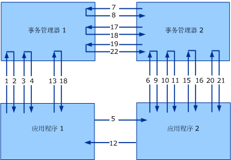

# <a name="transaction-protocols-version-10"></a>事务协议版本 1.0
[!INCLUDE[indigo1](../../../../includes/indigo1-md.md)] 版本 1 实现 WS-Atomic Transaction 和 WS-Coordination 协议的版本 1.0。 [!INCLUDE[crabout](../../../../includes/crabout-md.md)]1.1 版中，请参阅[事务协议](../../../../docs/framework/wcf/feature-details/transaction-protocols.md)。  
  
|规范/文档|Link|  
|-----------------------------|----------|  
|WS-Coordination|http://msdn.microsoft.com/ws/2005/08/ws-coordination/|  
|WS-AtomicTransaction|http://msdn.microsoft.com/ws/2005/08/ws-atomictransaction/|  
  
 这些协议规范需要在两种级别提供互操作性：在应用程序之间和在事务管理器之间（请参见下图）。 规范详细说明两个互操作性级别的消息格式和消息交换。 用于应用程序间交换的特定安全性、可靠性和编码与常规应用程序交换一样适用。 但是，在事务管理器之间的成功互操作还需要特定绑定的协议，因为它通常不由用户进行配置。  
  
 本主题说明 WS-Atomic Transaction (WS-AT) 规范与安全性的组合，并说明用于事务管理器间通信的安全绑定。 本文档中介绍的方法已经使用 WS-AT 和 WS-Coordination 的其他实现（包括 IBM、IONA、Sun Microsystems 等）成功进行了测试。  
  
 下图描述了两个事务管理器（事务管理器 1 和事务管理器 2）和两个应用程序（应用程序 1 和应用程序 2）之间的互操作性。  
  
   
  
 假设一个典型的 WS-Coordination/WS-Atomic Transaction 方案具有一个发起方 (I) 和一个参与者 (P)。 发起方和参与者都有事务管理器（分别为 ITM 和 PTM）。 两阶段提交在本主题中称为 2PC。  
  
|||  
|-|-|  
|1.CreateCoordinationContext|12.应用程序消息响应|  
|2.CreateCoordinationContextResponse|13.提交（完成）|  
|3.注册（完成）|14.准备 (2PC)|  
|4.RegisterResponse|15.准备 (2PC)|  
|5.应用程序消息|16.已准备 (2PC)|  
|6.使用上下文的 CreateCoordinationContext|17.已准备 (2PC)|  
|7.注册（持久）|18.已提交（完成）|  
|8.RegisterResponse|19.提交 (2PC)|  
|9.CreateCoordinationContextResponse|20.提交 (2PC)|  
|10.注册（持久）|21.已提交 (2PC)|  
|11.RegisterResponse|22.已提交 (2PC)|  
  
 本文档说明 WS-AtomicTransaction 规范与安全性的组合，并说明用于事务管理器间通信的安全绑定。 本文档中介绍的方法已经使用 WS-AT 和 WS-Coordination 的其他实现成功进行了测试。  
  
 图和表从安全性的角度演示了四种消息类：  
  
-   激活消息（CreateCoordinationContext 和 CreateCoordinationContextResponse）。  
  
-   注册消息（Register 和 RegisterResponse）  
  
-   协议消息（Prepare、Rollback、Commit、Aborted 等）。  
  
-   应用程序消息。  
  
 前三种消息类可视为事务管理器消息，本主题后面的“应用程序消息交换”将说明它们的绑定配置。 第四种消息类是应用程序间消息，本主题后面的“消息示例”一节将对它进行说明。 本节说明 [!INCLUDE[indigo2](../../../../includes/indigo2-md.md)] 对这些类中每个类使用的协议绑定。  
  
 本文档中使用以下 XML 命名空间和关联的前缀。  
  
|前缀|命名空间 URI|  
|------------|-------------------|  
|s11|http://schemas.xmlsoap.org/soap/envelope|  
|wsa|http://www.w3.org/2004/08/addressing|  
|wscoor|http://schemas.xmlsoap.org/ws/2004/10/wscoor|  
|wsat|http://schemas.xmlsoap.org/ws/2004/10/wsat|  
|t|http://schemas.xmlsoap.org/ws/2005/02/trust|  
|o|http://docs.oasis-open.org/wss/2004/01/oasis-200401-wss-wssecurity-secext-1.0.xsd|  
|xsd|http://www.w3.org/2001/XMLSchema|  
  
## <a name="transaction-manager-bindings"></a>事务管理器绑定  
 R1001：事务管理器必须使用 SOAP 1.1 和 WS-Addressing 2004/08 进行 WS-Atomic Transaction 和 WS-Coordination 消息交换。  
  
 应用程序消息并不限于这些绑定，将在后面进行说明。  
  
### <a name="transaction-manager-https-binding"></a>事务管理器 HTTPS 绑定  
 事务管理器 HTTPS 绑定仅依赖于传输安全以在事务树中的每个发送方-接收方对之间实现安全性和建立信任。  
  
#### <a name="https-transport-configuration"></a>HTTPS 传输配置  
 X.509 证书用于建立事务管理器标识。 要求对客户端/服务器进行身份验证，客户端/服务器授权作为实现详细信息保留：  
  
-   R1111：通过网络提供的 X.509 证书必须具有与发起方计算机的完全限定域名 (FQDN) 匹配的主题名称。  
  
-   B1112：DNS 必须在系统中每个发送方-接收方对之间都有效，才能使 X.509 主题名称检查成功。  
  
#### <a name="activation-and-registration-binding-configuration"></a>激活和注册绑定配置  
 [!INCLUDE[indigo2](../../../../includes/indigo2-md.md)] 要求具有通过 HTTPS 关联的请求/答复双工绑定。 （有关关联的更多信息和请求/答复消息交换模式的说明，请参见 WS-Atomic Transaction，第 8 节。）  
  
#### <a name="2pc-protocol-binding-configuration"></a>2PC 协议绑定配置  
 [!INCLUDE[indigo2](../../../../includes/indigo2-md.md)] 支持通过 HTTPS 发送单向（数据报）消息。 消息中的关联作为实现详细信息保留。  
  
 B2131: 实现必须支持`wsa:ReferenceParameters`WS 寻址，若要实现的相关中所述[!INCLUDE[indigo2](../../../../includes/indigo2-md.md)]的 2PC 消息。  
  
### <a name="transaction-manager-mixed-security-binding"></a>事务管理器混合安全绑定  
 这是一个备选 （混合模式） 绑定，它使用传输安全和 Ws-coordination 颁发的令牌模型标识建立目的的组合。  激活和注册是在两个绑定间存在差异的仅有元素。  
  
#### <a name="https-transport-configuration"></a>HTTPS 传输配置  
 X.509 证书用于建立事务管理器标识。 要求对客户端/服务器进行身份验证，客户端/服务器授权作为实现详细信息保留。  
  
#### <a name="activation-message-binding-configuration"></a>激活消息绑定配置  
 激活消息通常不参与互操作，因为他们一般出现在应用程序及其本地事务管理器之间。  
  
 B1221:[!INCLUDE[indigo2](../../../../includes/indigo2-md.md)]使用双工 HTTPS 绑定 (中所述[消息传送协议](../../../../docs/framework/wcf/feature-details/messaging-protocols.md)) 激活消息。 请求消息和答复消息是使用 WS-Addressing 2004/08 进行关联的。  
  
 WS-Atomic Transaction 规范第 8 节更详尽地说明了关联和消息交换模式。  
  
-   R1222：接收到 `CreateCoordinationContext` 后，协调程序必须颁发与机密 `SecurityContextToken` 关联的 `STx`。 在遵循 WS-Trust 规范的 `t:IssuedTokens` 标头中返回此令牌。  
  
-   R1223：如果激活出现在现有的协调上下文中，则具有与现有上下文关联的 `t:IssuedTokens` 的 `SecurityContextToken` 标头必须对 `CreateCoordinationContext` 消息进行流处理。  
  
 一个新`t:IssuedTokens`标头应为附加到传出生成`wscoor:CreateCoordinationContextResponse`消息。  
  
#### <a name="registration-message-binding-configuration"></a>注册消息绑定配置  
 B1231:[!INCLUDE[indigo2](../../../../includes/indigo2-md.md)]使用双工 HTTPS 绑定 (中所述[消息传送协议](../../../../docs/framework/wcf/feature-details/messaging-protocols.md))。 请求消息和答复消息是使用 WS-Addressing 2004/08 进行关联的。  
  
 WS-AtomicTransaction 第 8 节更详尽地说明了关联和消息交换模式。  
  
 R1232： 传出`wscoor:Register`的消息必须使用`IssuedTokenOverTransport`身份验证模式中所述[安全协议](../../../../docs/framework/wcf/feature-details/security-protocols.md)。  
  
 `wsse:Timestamp`必须使用对元素进行签名`SecurityContextToken``STx`颁发。 此签名是拥有与特定事务关联的令牌的证明，用于对登记事务的参与者进行身份验证。 RegistrationResponse 消息通过 HTTPS 发回。  
  
#### <a name="2pc-protocol-binding-configuration"></a>2PC 协议绑定配置  
 [!INCLUDE[indigo2](../../../../includes/indigo2-md.md)] 支持通过 HTTPS 发送单向（数据报）消息。 消息中的关联作为实现详细信息保留。  
  
 B2131: 实现必须支持`wsa:ReferenceParameters`WS 寻址，若要实现的相关中所述[!INCLUDE[indigo2](../../../../includes/indigo2-md.md)]的 2PC 消息。  
  
## <a name="application-message-exchange"></a>应用程序消息交换  
 只要绑定满足下面的安全要求，应用程序就可以对应用程序间消息随意使用任何特定的绑定：  
  
-   R2001：应用程序间消息必须对 `t:IssuedTokens` 标头与消息头中的 `CoordinationContext` 一起进行流处理。  
  
-   R2002：必须提供 `t:IssuedToken` 的完整性和保密性。  
  
 `CoordinationContext` 标头包含 `wscoor:Identifier`。 尽管 `xsd:AnyURI` 的定义允许使用绝对和相对 URI，可是 [!INCLUDE[indigo2](../../../../includes/indigo2-md.md)] 仅支持 `wscoor:Identifiers`（它是绝对 URI）。  
  
 如果 `wscoor:Identifier` 的 `wscoor:CoordinationContext` 是相对 URI，则将从事务性 [!INCLUDE[indigo2](../../../../includes/indigo2-md.md)] 服务返回错误。  
  
## <a name="message-examples"></a>消息示例  
  
### <a name="createcoordinationcontext-requestresponse-messages"></a>CreateCoordinationContext 请求/响应消息  
 下面的消息遵循请求/响应模式。  
  
#### <a name="createcoordinationcontext"></a>CreateCoordinationContext  
  
```xml  
<s:Envelope>  
  <s:Header>  
    <a:Action>http://.../ws/2004/10/wscoor/CreateCoordinationContext</Action>  
    <a:MessageID>urn:uuid:069f5104-fd88-4264-9f99-60032a82854e</MessageID>  
    <a:ReplyTo>  
      <Address>https://...</a:Address>  
    </a:ReplyTo>  
    <a:To>https://...</a:To>  
    <wsse:Security>  
      <u:Timestamp>  
        <wsu:Created>2005-12-15T23:36:09.921Z</u:Created>  
        <wsu:Expires>2005-12-15T23:41:09.921Z</u:Expires>  
      </u:Timestamp>  
    </wsse:Security>  
  </s:Header>  
  <s:Body xmlns:s="http://schemas.xmlsoap.org/soap/envelope/">  
    <wscoor:CreateCoordinationContext>  
      <wscoor:CoordinationType>...</wscoor:CoordinationType>  
    </wscoor:CreateCoordinationContext>  
  </s:Body>  
</s11:Envelope>  
```  
  
#### <a name="createcoordinationcontextresponse"></a>CreateCoordinationContextResponse  
  
```xml  
<s:Envelope>  
  <!-- Data below is shown in the clear for  
       illustration purposes only. -->  
  <s:Header>  
    <a:Action>./ws/2004/10/wscoor/CreateCoordinationContextResponse </a:Action>  
    <a:RelatesTo>urn:uuid:069f5104-fd88-4264-9f99-60032a82854e</a:RelatesTo>  
    <a:To s:mustUnderstand="1">https://... </a:To>  
    <t:IssuedTokens>  
 <wst:RequestSecurityTokenResponse     
    xmlns:wsse="http://docs.oasis-open.org/wss/2004/01/oasis-200401-wss-wssecurity-secext-1.0.xsd"  
    xmlns:wssu="http://docs.oasis-open.org/wss/2004/01/oasis-200401-wss-wssecurity-utility-1.0.xsd"   
    xmlns:wst="http://schemas.xmlsoap.org/ws/2005/02/trust"  
    xmlns:wsc="http://schemas.xmlsoap.org/ws/2005/02/sc"  
    xmlns:wsp="http://schemas.xmlsoap.org/ws/2004/09/policy">  
    <wst:TokenType>http://schemas.xmlsoap.org/ws/2005/02/sc/sct</wst:TokenType>  
    <wst:RequestedSecurityToken>  
      <wsc:SecurityContextToken>  
        <wssu:Identifier>  
          http://fabrikam123.com/SCTi  
        </wssu:Identifier>  
      </wsc:SecurityContextToken>   
    </wst:RequestedSecurityToken>  
    <wsp:AppliesTo>  
        http://fabrikam123.com/CCi  
    </wsp:AppliesTo>    
    <wst:RequestedAttachedReference>  
      <wsse:SecurityTokenReference >  
        <wsse:Reference   
           ValueType="http://schemas.xmlsoap.org/ws/2005/02/sc/sct"  
           URI="http://fabrikam123.com/SCTi"/>  
      </wsse:SecurityTokenReference>  
    </wst:RequestedAttachedReference>  
    <wst:RequestedUnattachedReference>  
      <wsse:SecurityTokenReference>  
        <wsse:Reference   
          ValueType="http://schemas.xmlsoap.org/ws/2005/02/sc/sct"  
          URI="http://fabrikam123.com/SCTi"/>  
      </wsse:SecurityTokenReference>  
    </wst:RequestedUnattachedReference>  
    <wst:RequestedProofToken>  
      <wst:BinarySecret   
        Type="http://schemas.xmlsoap.org/ws/2005/02/trust/SymmetricKey">  
        <!-- base64 encoded value -->  
      </wst:BinarySecret>  
    </wst:RequestedProofToken>  
    <wst:Lifetime>  
      <wssu:Created>2005-10-24T20:19:26.526Z</wssu:Created>  
      <wssu:Expires>2005-10-25T06:24:26.526Z</wssu:Expires>  
    </wst:Lifetime>  
    <wst:KeySize>256</wst:KeySize>  
</wst:RequestSecurityTokenResponse>  
    </t:IssuedTokens>  
    <o:Security xmlns:o="http://docs.oasis-open.org/wss/2004/01/oasis-200401-wss-wssecurity-secext-1.0.xsd">  
      <u:Timestamp u:Id="_0">  
        <u:Created>2005-12-15T23:36:12.015Z</u:Created>  
        <u:Expires>2005-12-15T23:41:12.015Z</u:Expires>  
      </u:Timestamp>  
    </o:Security>  
  </s:Header>  
  <s:Body>  
    <wscoor:CreateCoordinationContextResponse>  
      <wscoor:CoordinationContext>  
        <wscoor:Identifier>  
     http://fabrikam123.com/CCi  
      </wscoor:Identifier>  
        <wscoor:Expires>...</wscoor:Expires>  
        <wscoor:CoordinationType>...</wscoor:CoordinationType>  
        <wscoor:RegistrationService>  
          <a:Address>https://...</a:Address>  
          <a:ReferenceParameters>  
             ...  
          </a:ReferenceParameters>  
        </wscoor:RegistrationService>  
      </wscoor:CoordinationContext>  
    </wscoor:CreateCoordinationContextResponse>  
  </s:Body>  
</s:Envelope>  
```  
  
### <a name="registration-messages"></a>注册消息  
 下面的消息是注册消息。  
  
#### <a name="register"></a>寄存器  
  
```xml  
<s:Envelope>  
  <s:Header>  
    <a:Action>http://schemas.xmlsoap.org/ws/2004/10/wscoor/Register</a:Action>  
    <a:MessageID>urn:uuid:ed418b86-a75e-4aea-9d4e-a5d0cb5c088e</a:MessageID>  
    <a:ReplyTo>  
      <a:Address>https://...</a:Address>        
    </a:ReplyTo>  
    <a:To>https://...</a:To>  
    <wsse:Security   
      s:mustUnderstand="1"   
      xmlns:wsse="http://docs.oasis-open.org/wss/2004/01/oasis-200401-wss-wssecurity-secext-1.0.xsd"  
      xmlns:wssu="http://docs.oasis-open.org/wss/2004/01/oasis-200401-wss-wssecurity-utility-1.0.xsd">  
      <wssu:Timestamp wssu:Id="_0" >  
        <wssu:Created>2005-12-15T23:36:13.827Z</wssu:Created>  
        <wssu:Expires>2005-12-15T23:41:13.827Z</wssu:Expires>  
      </wssu:Timestamp>  
      <wsc:SecurityContextToken>  
      <wssu:Identifier>  
          http://fabrikam123.com/SCTi  
      </wssu:Identifier>  
      </wsc:SecurityContextToken>  
      <!-- supporting signature over the timestamp -->  
      <wsse:Signature xmlns:ds="http://www.w3.org/2000/09/xmldsig#">  
        <ds:SignedInfo>  
          <ds:CanonicalizationMethod Algorithm="http://www.w3.org/2001/10/xml-exc-c14n#"/>  
          <ds:SignatureMethod Algorithm="http://www.w3.org/2000/09/xmldsig#hmac-sha1"/>  
          <ds:Reference URI="#_0">  
            <ds:Transforms>  
              <ds:Transform Algorithm="http://www.w3.org/2001/10/xml-exc-c14n#"/>  
            </ds:Transforms>  
            <ds:DigestMethod Algorithm="http://www.w3.org/2000/09/xmldsig#sha1"/>  
            <ds:DigestValue>  
              alRzyhjLgoUOYoh8cx4n75eTcUk=  
            </ds:DigestValue>  
          </ds:Reference>  
        </ds:SignedInfo>  
        <ds:SignatureValue>YZYjnVvSOVasAQqQxaaviTSWtqI=</ds:SignatureValue>  
        <ds:KeyInfo>  
          <wsse:SecurityTokenReference  
            xmlns:wsse="http://docs.oasis-open.org/wss/2004/01/oasis-200401-wss-wssecurity-secext-1.0.xsd">  
            <wsse:Reference   
              URI="http://fabrikam123.com/SCTi"/>  
          </wsse:SecurityTokenReference>  
        </ds:KeyInfo>  
      </wsse:Signature>  
    </wsse:Security>  
  </s:Header>  
  <s:Body xmlns:s="http://schemas.xmlsoap.org/soap/envelope/">  
    <wscoor:Register>  
      <wscoor:ProtocolIdentifier>...</wscoor:ProtocolIdentifier>  
      <wscoor:ParticipantProtocolService>  
        <a:Address>https://... </a:Address>  
      </wscoor:ParticipantProtocolService>  
    </wscoor:Register>  
  </s:Body>  
</s:Envelope>  
```  
  
#### <a name="register-response"></a>注册响应  
  
```xml  
<s:Envelope>  
  <s:Header>  
    <a:Action>  
      http://schemas.xmlsoap.org/ws/2004/10/wscoor/RegisterResponse  
    </a:Action>  
    <a:MessageID>urn:uuid:ed418b86-a75e-4aea-9d4e-a5d0cb5c088d</a:MessageID>  
    <a:RelatesTo>  
      urn:uuid:ed418b86-a75e-4aea-9d4e-a5d0cb5c088e        
    </a:RelatesTo>  
    <a:To>https://...</a:To>  
    <wsse:Security   
      s:mustUnderstand="1"   
      xmlns:wsse="http://docs.oasis-open.org/wss/2004/01/oasis-200401-wss-wssecurity-secext-1.0.xsd"  
      xmlns:wssu="http://docs.oasis-open.org/wss/2004/01/oasis-200401-wss-wssecurity-utility-1.0.xsd">  
      <wssu:Timestamp>  
        <wssu:Created>2005-12-15T23:36:13.827Z</wssu:Created>  
        <wssu:Expires>2005-12-15T23:41:13.827Z</wssu:Expires>  
      </wssu:Timestamp>  
    </wsse:Security>  
  </s:Header>  
  <s:Body xmlns:s="http://schemas.xmlsoap.org/soap/envelope/">  
    <wscoor:RegisterResponse>  
      <wscoor:CoordinatorProtocolService>  
        <a:Address>https://...</a:Address>  
        <a:ReferenceParameters>  
          ...  
        </a:ReferenceParameters>  
      </wscoor:CoordinatorProtocolService>  
    </wscoor:RegisterResponse>  
  </s:Body>  
</s:Envelope>  
```  
  
### <a name="two-phase-commit-protocol-messages"></a>两阶段提交协议消息  
 下面的消息与两阶段提交 (2PC) 协议相关。  
  
#### <a name="commit"></a>提交  
  
```xml  
<s:Envelope>  
  <s:Header>  
    <a:Action>http://.../ws/2004/10/wsat/Commit</a:Action>  
    <a:To>https://...</a:To>  
    <wsse:Security   
      s:mustUnderstand="1"   
      xmlns:wsse="http://docs.oasis-open.org/wss/2004/01/oasis-200401-wss-wssecurity-secext-1.0.xsd"  
      xmlns:wssu="http://docs.oasis-open.org/wss/2004/01/oasis-200401-wss-wssecurity-utility-1.0.xsd">  
      <wssu:Timestamp wssu:Id="_0" >  
        <wssu:Created>2005-12-15T23:36:13.827Z</wssu:Created>  
        <wssu:Expires>2005-12-15T23:41:13.827Z</wssu:Expires>  
      </wssu:Timestamp>  
   </wsse:Security>  
  </s:Header>  
  <s:Body xmlns:s="http://schemas.xmlsoap.org/soap/envelope/">  
    <wsat:Commit />  
  </s:Body>  
</s:Envelope>  
```  
  
### <a name="application-messages"></a>应用程序消息。  
 下面的消息是应用程序消息。  
  
#### <a name="application-message-request"></a>应用程序消息请求  
  
```xml  
<s:Envelope>  
  <s:Header>  
<!-- Addressing headers, all signed-->  
    <wsse:Security s:mustUnderstand="1">  
      <wssu:Timestamp wssu:Id="timestamp">   
        <wssu:Created>2005-10-25T06:29:18.703Z</wssu:Created>  
        <wssu:Expires>2005-10-25T06:34:18.703Z</wssu:Expires>  
      </wssu:Timestamp>  
      <wsse:BinarySecurityToken   
          wssu:Id="IA_Certificate"   
          ValueType="...#X509v3"   
          EncodingType="...#Base64Binary">  
        <!-- IA certificate -->  
      </wsse:BinarySecurityToken>  
      <e:EncryptedKey Id="encrypted_key">  
            <!-- ephemeral key encrypted for PA certificate -->    
        <e:ReferenceList xmlns:e="http://www.w3.org/2001/04/xmlenc#">  
          <e:DataReference URI="#encrypted_body"/>  
          <e:DataReference URI="#encrypted_CCi"/>  
          <e:DataReference URI="#encrypted_issuedtokens"/>  
        </e:ReferenceList>  
      </e:EncryptedKey>  
      <Signature xmlns="http://www.w3.org/2000/09/xmldsig#">  
        <!-- signature over Addressing headers, Timestamp, and Body -->  
      </Signature>  
    </wsse:Security>  
    <wsse11:EncryptedHeader >  
     <!-- encrypted wscoor:CoordinationContext header containing CCi -->  
    </wsse11:EncryptedHeader>  
    <wsse11:EncryptedHeader   
      <!-- encrypted wst:IssuedTokens header containing SCTi -->  
      <!-- wst:IssuedTokens header is taken verbatim from message #2 above, omitted for brevity -->  
    </wsse11:EncryptedHeader>  
  </s:Header>  
  <s:Body wssu:Id="body">  
    <!-- encrypted content of the Body element of the application message -->      
    <e:EncryptedData Id="encrypted_body"   
           Type="http://www.w3.org/2001/04/xmlenc#Content"   
           xmlns:e="http://www.w3.org/2001/04/xmlenc#">  
...  
    </e:EncryptedData>  
  </s:Body>  
</s:Envelope>  
```
