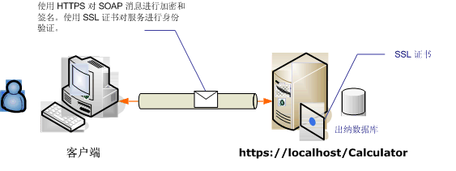

# <a name="transport-security-with-an-anonymous-client"></a><span data-ttu-id="edf9d-102">匿名客户端的传输安全</span><span class="sxs-lookup"><span data-stu-id="edf9d-102">Transport Security with an Anonymous Client</span></span>
<span data-ttu-id="edf9d-103">此 Windows Communication Foundation (WCF) 方案中使用传输安全 (HTTPS) 确保保密性和完整性。</span><span class="sxs-lookup"><span data-stu-id="edf9d-103">This Windows Communication Foundation (WCF) scenario uses transport security (HTTPS) to ensure confidentiality and integrity.</span></span> <span data-ttu-id="edf9d-104">必须使用安全套接字层 (SSL) 证书对服务器进行身份验证，并且客户端必须信任服务器的证书。</span><span class="sxs-lookup"><span data-stu-id="edf9d-104">The server must be authenticated with a Secure Sockets Layer (SSL) certificate, and the clients must trust the server's certificate.</span></span> <span data-ttu-id="edf9d-105">客户端不通过任何机制进行身份验证，因此是匿名的。</span><span class="sxs-lookup"><span data-stu-id="edf9d-105">The client is not authenticated by any mechanism and is, therefore, anonymous.</span></span>  
  
 <span data-ttu-id="edf9d-106">示例应用程序，请参阅[WS 传输安全性](../../../../docs/framework/wcf/samples/ws-transport-security.md)。</span><span class="sxs-lookup"><span data-stu-id="edf9d-106">For a sample application, see [WS Transport Security](../../../../docs/framework/wcf/samples/ws-transport-security.md).</span></span> <span data-ttu-id="edf9d-107">有关传输安全性的详细信息，请参阅[传输安全概述](../../../../docs/framework/wcf/feature-details/transport-security-overview.md)。</span><span class="sxs-lookup"><span data-stu-id="edf9d-107">For more information about transport security, see [Transport Security Overview](../../../../docs/framework/wcf/feature-details/transport-security-overview.md).</span></span>  
  
 <span data-ttu-id="edf9d-108">有关与服务使用的证书的详细信息，请参阅[Working with Certificates](../../../../docs/framework/wcf/feature-details/working-with-certificates.md)并[如何： 使用 SSL 证书配置端口](../../../../docs/framework/wcf/feature-details/how-to-configure-a-port-with-an-ssl-certificate.md)。</span><span class="sxs-lookup"><span data-stu-id="edf9d-108">For more information about using a certificate with a service, see [Working with Certificates](../../../../docs/framework/wcf/feature-details/working-with-certificates.md) and [How to: Configure a Port with an SSL Certificate](../../../../docs/framework/wcf/feature-details/how-to-configure-a-port-with-an-ssl-certificate.md).</span></span>  
  
 <span data-ttu-id="edf9d-109"></span><span class="sxs-lookup"><span data-stu-id="edf9d-109"></span></span>  
  
|<span data-ttu-id="edf9d-110">特征</span><span class="sxs-lookup"><span data-stu-id="edf9d-110">Characteristic</span></span>|<span data-ttu-id="edf9d-111">描述</span><span class="sxs-lookup"><span data-stu-id="edf9d-111">Description</span></span>|  
|--------------------|-----------------|  
|<span data-ttu-id="edf9d-112">安全模式</span><span class="sxs-lookup"><span data-stu-id="edf9d-112">Security Mode</span></span>|<span data-ttu-id="edf9d-113">传输</span><span class="sxs-lookup"><span data-stu-id="edf9d-113">Transport</span></span>|  
|<span data-ttu-id="edf9d-114">互操作性</span><span class="sxs-lookup"><span data-stu-id="edf9d-114">Interoperability</span></span>|<span data-ttu-id="edf9d-115">与现有 Web 服务和客户端</span><span class="sxs-lookup"><span data-stu-id="edf9d-115">With existing Web services and clients</span></span>|  
|<span data-ttu-id="edf9d-116">身份验证（服务器）</span><span class="sxs-lookup"><span data-stu-id="edf9d-116">Authentication (Server)</span></span><br /><br /> <span data-ttu-id="edf9d-117">身份验证（客户端）</span><span class="sxs-lookup"><span data-stu-id="edf9d-117">Authentication (Client)</span></span>|<span data-ttu-id="edf9d-118">是</span><span class="sxs-lookup"><span data-stu-id="edf9d-118">Yes</span></span><br /><br /> <span data-ttu-id="edf9d-119">应用程序级别 （无 WCF 支持）</span><span class="sxs-lookup"><span data-stu-id="edf9d-119">Application level (no WCF support)</span></span>|  
|<span data-ttu-id="edf9d-120">完整性</span><span class="sxs-lookup"><span data-stu-id="edf9d-120">Integrity</span></span>|<span data-ttu-id="edf9d-121">是</span><span class="sxs-lookup"><span data-stu-id="edf9d-121">Yes</span></span>|  
|<span data-ttu-id="edf9d-122">保密性</span><span class="sxs-lookup"><span data-stu-id="edf9d-122">Confidentiality</span></span>|<span data-ttu-id="edf9d-123">是</span><span class="sxs-lookup"><span data-stu-id="edf9d-123">Yes</span></span>|  
|<span data-ttu-id="edf9d-124">传输</span><span class="sxs-lookup"><span data-stu-id="edf9d-124">Transport</span></span>|<span data-ttu-id="edf9d-125">HTTPS</span><span class="sxs-lookup"><span data-stu-id="edf9d-125">HTTPS</span></span>|  
|<span data-ttu-id="edf9d-126">绑定</span><span class="sxs-lookup"><span data-stu-id="edf9d-126">Binding</span></span>|<span data-ttu-id="edf9d-127"><<!--zz xref:System.ServiceModel.WsHttpBinding --> `xref:System.ServiceModel.WsHttpBinding`></span><span class="sxs-lookup"><span data-stu-id="edf9d-127"><<!--zz xref:System.ServiceModel.WsHttpBinding --> `xref:System.ServiceModel.WsHttpBinding`></span></span>|  
  
## <a name="service"></a><span data-ttu-id="edf9d-128">服务</span><span class="sxs-lookup"><span data-stu-id="edf9d-128">Service</span></span>  
 <span data-ttu-id="edf9d-129">下面的代码和配置应独立运行。</span><span class="sxs-lookup"><span data-stu-id="edf9d-129">The following code and configuration are meant to run independently.</span></span> <span data-ttu-id="edf9d-130">执行下列操作之一：</span><span class="sxs-lookup"><span data-stu-id="edf9d-130">Do one of the following:</span></span>  
  
-   <span data-ttu-id="edf9d-131">使用代码（而不使用配置）创建独立服务。</span><span class="sxs-lookup"><span data-stu-id="edf9d-131">Create a stand-alone service using the code with no configuration.</span></span>  
  
-   <span data-ttu-id="edf9d-132">使用提供的配置创建服务，但不定义任何终结点。</span><span class="sxs-lookup"><span data-stu-id="edf9d-132">Create a service using the supplied configuration, but do not define any endpoints.</span></span>  
  
### <a name="code"></a><span data-ttu-id="edf9d-133">代码</span><span class="sxs-lookup"><span data-stu-id="edf9d-133">Code</span></span>  
 <span data-ttu-id="edf9d-134">下面的代码演示如何使用传输安全创建终结点：</span><span class="sxs-lookup"><span data-stu-id="edf9d-134">The following code shows how to create an endpoint using transport security:</span></span>  
  
 [!code-csharp[c_SecurityScenarios#5](../../../../samples/snippets/csharp/VS_Snippets_CFX/c_securityscenarios/cs/source.cs#5)]
 [!code-vb[c_SecurityScenarios#5](../../../../samples/snippets/visualbasic/VS_Snippets_CFX/c_securityscenarios/vb/source.vb#5)]  
  
### <a name="configuration"></a><span data-ttu-id="edf9d-135">配置</span><span class="sxs-lookup"><span data-stu-id="edf9d-135">Configuration</span></span>  
 <span data-ttu-id="edf9d-136">下面的代码使用配置设置相同的终结点。</span><span class="sxs-lookup"><span data-stu-id="edf9d-136">The following code sets up the same endpoint using configuration.</span></span> <span data-ttu-id="edf9d-137">客户端不通过任何机制进行身份验证，因此是匿名的。</span><span class="sxs-lookup"><span data-stu-id="edf9d-137">The client is not authenticated by any mechanism, and is therefore anonymous.</span></span>  
  
```xml  
<?xml version="1.0" encoding="utf-8"?>  
<configuration>  
  <system.serviceModel>  
    <services>  
      <service name="ServiceModel.Calculator">  
        <endpoint address="http://localhost/Calculator"   
                  binding="wsHttpBinding"  
                  bindingConfiguration="WSHttpBinding_ICalculator"   
                  name="SecuredByTransportEndpoint"  
                  contract="ServiceModel.ICalculator" />  
      </service>  
    </services>  
    <bindings>  
      <wsHttpBinding>  
        <binding name="WSHttpBinding_ICalculator">  
          <security mode="Transport">  
            <transport clientCredentialType="None" />  
          </security>  
        </binding>  
      </wsHttpBinding>  
    </bindings>  
    <client />  
  </system.serviceModel>  
</configuration>  
```  
  
## <a name="client"></a><span data-ttu-id="edf9d-138">客户端</span><span class="sxs-lookup"><span data-stu-id="edf9d-138">Client</span></span>  
 <span data-ttu-id="edf9d-139">下面的代码和配置应独立运行。</span><span class="sxs-lookup"><span data-stu-id="edf9d-139">The following code and configuration are meant to run independently.</span></span> <span data-ttu-id="edf9d-140">执行下列操作之一：</span><span class="sxs-lookup"><span data-stu-id="edf9d-140">Do one of the following:</span></span>  
  
-   <span data-ttu-id="edf9d-141">使用代码（和客户端代码）创建独立客户端。</span><span class="sxs-lookup"><span data-stu-id="edf9d-141">Create a stand-alone client using the code (and client code).</span></span>  
  
-   <span data-ttu-id="edf9d-142">创建不定义任何终结点地址的客户端。</span><span class="sxs-lookup"><span data-stu-id="edf9d-142">Create a client that does not define any endpoint addresses.</span></span> <span data-ttu-id="edf9d-143">而使用将配置名称作为参数的客户端构造函数。</span><span class="sxs-lookup"><span data-stu-id="edf9d-143">Instead, use the client constructor that takes the configuration name as an argument.</span></span> <span data-ttu-id="edf9d-144">例如：</span><span class="sxs-lookup"><span data-stu-id="edf9d-144">For example:</span></span>  
  
     [!code-csharp[C_SecurityScenarios#0](../../../../samples/snippets/csharp/VS_Snippets_CFX/c_securityscenarios/cs/source.cs#0)]
     [!code-vb[C_SecurityScenarios#0](../../../../samples/snippets/visualbasic/VS_Snippets_CFX/c_securityscenarios/vb/source.vb#0)]  
  
### <a name="code"></a><span data-ttu-id="edf9d-145">代码</span><span class="sxs-lookup"><span data-stu-id="edf9d-145">Code</span></span>  
 [!code-csharp[c_SecurityScenarios#6](../../../../samples/snippets/csharp/VS_Snippets_CFX/c_securityscenarios/cs/source.cs#6)]
 [!code-vb[c_SecurityScenarios#6](../../../../samples/snippets/visualbasic/VS_Snippets_CFX/c_securityscenarios/vb/source.vb#6)]  
  
### <a name="configuration"></a><span data-ttu-id="edf9d-146">配置</span><span class="sxs-lookup"><span data-stu-id="edf9d-146">Configuration</span></span>  
 <span data-ttu-id="edf9d-147">下面的配置可代替代码用于设置服务。</span><span class="sxs-lookup"><span data-stu-id="edf9d-147">The following configuration can be used instead of the code to set up the service.</span></span>  
  
```xml  
<configuration>  
  <system.serviceModel>  
    <bindings>  
      <wsHttpBinding>  
        <binding name="WSHttpBinding_ICalculator" >  
          <security mode="Transport">  
            <transport clientCredentialType="None" />  
          </security>  
        </binding>  
      </wsHttpBinding>  
    </bindings>  
    <client>  
      <endpoint address="https://machineName/Calculator"   
                binding="wsHttpBinding"  
                bindingConfiguration="WSHttpBinding_ICalculator"   
                contract="ICalculator"  
                name="WSHttpBinding_ICalculator" />  
    </client>  
  </system.serviceModel>  
</configuration>  
```  
  
## <a name="see-also"></a><span data-ttu-id="edf9d-148">请参阅</span><span class="sxs-lookup"><span data-stu-id="edf9d-148">See Also</span></span>  
 [<span data-ttu-id="edf9d-149">安全性概述</span><span class="sxs-lookup"><span data-stu-id="edf9d-149">Security Overview</span></span>](../../../../docs/framework/wcf/feature-details/security-overview.md)  
 [<span data-ttu-id="edf9d-150">WS 传输安全性</span><span class="sxs-lookup"><span data-stu-id="edf9d-150">WS Transport Security</span></span>](../../../../docs/framework/wcf/samples/ws-transport-security.md)  
 [<span data-ttu-id="edf9d-151">传输安全性概述</span><span class="sxs-lookup"><span data-stu-id="edf9d-151">Transport Security Overview</span></span>](../../../../docs/framework/wcf/feature-details/transport-security-overview.md)  
 [<span data-ttu-id="edf9d-152">Windows Server App Fabric 的安全模型</span><span class="sxs-lookup"><span data-stu-id="edf9d-152">Security Model for Windows Server App Fabric</span></span>](https://go.microsoft.com/fwlink/?LinkID=201279&clcid=0x409)
