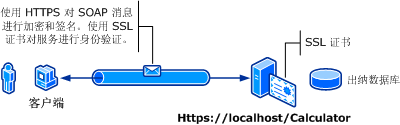

# <a name="transport-security-with-basic-authentication"></a>通过基本身份验证确保的传输安全
下图显示了 Windows Communication Foundation (WCF) 服务和客户端。 服务器需要一个有效的可用于安全套接字层 (SSL) 的 X.509 证书，并且客户端必须信任此服务器证书。 而且，Web 服务已经有了一个可以使用的 SSL 实现。 有关详细信息启用基本身份验证在 Internet 信息服务 (IIS)，请参阅[ https://go.microsoft.com/fwlink/?LinkId=83822 ](https://go.microsoft.com/fwlink/?LinkId=83822)。  
  
   
  
|特征|描述|  
|--------------------|-----------------|  
|安全模式|传输|  
|互操作性|与现有的 Web 服务客户端和服务进行互操作|  
|身份验证（服务器）<br /><br /> 身份验证（客户端）|是（使用 HTTPS）<br /><br /> 是（通过用户名/密码）|  
|完整性|是|  
|保密性|是|  
|传输|HTTPS|  
|绑定|<xref:System.ServiceModel.WSHttpBinding>|  
  
## <a name="service"></a>服务  
 下面的代码和配置应独立运行。 执行下列操作之一：  
  
-   使用代码（而不使用配置）创建独立服务。  
  
-   使用提供的配置创建服务，但不定义任何终结点。  
  
### <a name="code"></a>代码  
 下面的代码演示如何创建使用 Windows 域用户名和密码确保传输安全的服务终结点。 请注意，此服务要求使用 X.509 证书向客户端进行身份验证。 有关详细信息，请参阅[Working with Certificates](../../../../docs/framework/wcf/feature-details/working-with-certificates.md)并[如何： 使用 SSL 证书配置端口](../../../../docs/framework/wcf/feature-details/how-to-configure-a-port-with-an-ssl-certificate.md)。  
  
 [!code-csharp[C_SecurityScenarios#1](../../../../samples/snippets/csharp/VS_Snippets_CFX/c_securityscenarios/cs/source.cs#1)]
 [!code-vb[C_SecurityScenarios#1](../../../../samples/snippets/visualbasic/VS_Snippets_CFX/c_securityscenarios/vb/source.vb#1)]  
  
## <a name="configuration"></a>配置  
 下面将配置一个服务以使用具有传输级安全的基本身份验证：  
  
```xml  
<?xml version="1.0" encoding="utf-8"?>  
<configuration>  
    <system.serviceModel>  
        <bindings>  
            <wsHttpBinding>  
                <binding name="UsernameWithTransport">  
                    <security mode="Transport">  
                        <transport clientCredentialType="Basic" />  
                    </security>  
                </binding>  
            </wsHttpBinding>  
        </bindings>  
        <services>  
            <service name="BasicAuthentication.Calculator">  
                <endpoint address="https://localhost/Calculator"  
                          binding="wsHttpBinding"   
                          bindingConfiguration="UsernameWithTransport"  
                          name="BasicEndpoint"   
                          contract="BasicAuthentication.ICalculator" />  
            </service>  
        </services>  
    </system.serviceModel>  
</configuration>  
```  
  
## <a name="client"></a>客户端  
  
### <a name="code"></a>代码  
 下面的代码演示包括用户名和密码在内的客户端代码。 请注意，此用户必须提供一个有效的 Windows 用户名和密码。 此处不显示用于返回用户名和密码的代码。 使用对话框或其他界面来查询用户的相关信息。  
  
> [!NOTE]
>  用户名和密码只能使用代码进行设置。  
  
 [!code-csharp[C_SecurityScenarios#2](../../../../samples/snippets/csharp/VS_Snippets_CFX/c_securityscenarios/cs/source.cs#2)]
 [!code-vb[C_SecurityScenarios#2](../../../../samples/snippets/visualbasic/VS_Snippets_CFX/c_securityscenarios/vb/source.vb#2)]  
  
### <a name="configuration"></a>配置  
 下面的代码演示客户端配置。  
  
> [!NOTE]
>  不能使用配置来设置用户名和密码。 此处显示的配置必须使用代码进行扩充以设置用户名和密码。  
  
```xml  
<?xml version="1.0" encoding="utf-8"?>  
<configuration>  
  <system.serviceModel>  
    <bindings>  
      <wsHttpBinding>  
        <binding name="WSHttpBinding_ICalculator" >  
          <security mode="Transport">  
            <transport clientCredentialType="Basic" />  
          </security>  
        </binding>  
      </wsHttpBinding>  
    </bindings>  
    <client>  
      <endpoint address="https://machineName/Calculator"   
                binding="wsHttpBinding"  
                bindingConfiguration="WSHttpBinding_ICalculator"   
                contract="ICalculator"  
                name="WSHttpBinding_ICalculator" />  
    </client>  
  </system.serviceModel>  
</configuration>  
```  
  
## <a name="see-also"></a>请参阅  
 <xref:System.ServiceModel.ClientBase%601.ClientCredentials%2A>  
 <xref:System.ServiceModel.Security.UserNamePasswordClientCredential>  
 [使用证书](../../../../docs/framework/wcf/feature-details/working-with-certificates.md)  
 [如何：使用 SSL 证书配置端口](../../../../docs/framework/wcf/feature-details/how-to-configure-a-port-with-an-ssl-certificate.md)  
 [安全性概述](../../../../docs/framework/wcf/feature-details/security-overview.md)  
 [\<clientCredentials>](../../../../docs/framework/configure-apps/file-schema/wcf/clientcredentials.md)  
 [Windows Server App Fabric 的安全模型](https://go.microsoft.com/fwlink/?LinkID=201279&clcid=0x409)
