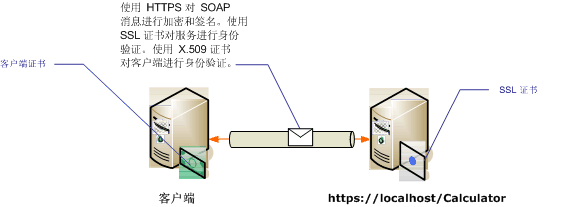

# <a name="transport-security-with-certificate-authentication"></a>利用证书身份验证的传输安全
本主题探讨使用传输安全性时如何使用 X.509 证书进行服务器和客户端身份验证。 有关 X.509 证书的详细信息，请参阅 [X.509 公钥证书](https://msdn.microsoft.com/library/bb540819\(VS.85\).aspx)。 证书必须由证书颁发，这通常是第三方证书颁发机构颁发。 在 Windows Server 域中，可以使用 Active Directory 证书服务向域中的客户端计算机颁发证书。 有关详细信息请参阅[Windows 2008 R2 证书服务](https://go.microsoft.com/fwlink/?LinkID=209949&clcid=0x409)。 在此方案中，该服务承载在使用安全套接字层 (SSL) 配置的 Internet Information Services (IIS) 之下。 该服务使用 SSL (X.509) 证书进行配置，以允许客户端验证服务器的身份。 客户端也使用 X.509 证书进行配置，以允许服务验证客户端的身份。 客户端必须信任服务器的证书，服务器也必须信任客户端的证书。 服务和客户端如何验证彼此身份的实际机制不在本主题讨论范围之内。 有关详细信息请参阅[Wikipedia 上的数字签名](https://go.microsoft.com/fwlink/?LinkId=253157)。  
  
 该方案实现一个请求/回复消息模式，如下图所示。  
  
   
  
 有关与服务使用的证书的详细信息，请参阅[Working with Certificates](../../../../docs/framework/wcf/feature-details/working-with-certificates.md)并[如何： 使用 SSL 证书配置端口](../../../../docs/framework/wcf/feature-details/how-to-configure-a-port-with-an-ssl-certificate.md)。 下表描述了该方案的各项特征。  
  
|特征|描述|  
|--------------------|-----------------|  
|安全模式|传输|  
|互操作性|与现有 Web 服务客户端和服务。|  
|身份验证（服务器）<br /><br /> 身份验证（客户端）|是（使用 SSL 证书）<br /><br /> 是（使用 X.509 证书）|  
|数据完整性|是|  
|数据保密性|是|  
|传输|HTTPS|  
|绑定|<xref:System.ServiceModel.WSHttpBinding>|  
  
## <a name="configure-the-service"></a>配置服务  
 由于该方案中的服务承载于 IIS 之下，因此它是使用 web.config 文件配置的。 以下 web.config 揭示了如何配置  <xref:System.ServiceModel.WSHttpBinding> 以使用传输安全性和 X.509 客户端凭据。  
  
```xml  
<configuration>  
  <system.serviceModel>  
    <protocolMapping>  
      <add scheme="https" binding="wsHttpBinding" />  
    </protocolMapping>  
    <bindings>  
      <wsHttpBinding>  
        <!-- configure wsHttp binding with Transport security mode and clientCredentialType as Certificate -->  
        <binding>  
          <security mode="Transport">  
            <transport clientCredentialType="Certificate"/>              
          </security>  
        </binding>  
      </wsHttpBinding>  
    </bindings>  
    <!--For debugging purposes set the includeExceptionDetailInFaults attribute to true-->  
    <behaviors>  
      <serviceBehaviors>  
        <behavior>            
           <serviceDebug includeExceptionDetailInFaults="True" />  
        </behavior>  
      </serviceBehaviors>  
    </behaviors>  
  </system.serviceModel>  
</configuration>  
```  
  
## <a name="configure-the-client"></a>配置客户端  
 可以在代码中或在 app.config 文件中配置客户端。 下例揭示了如何在代码中配置客户端。  
  
```vb  
// Create the binding.  
WSHttpBinding myBinding = new WSHttpBinding();  
myBinding.Security.Mode = SecurityMode.Transport;  
myBinding.Security.Transport.ClientCredentialType =  
   HttpClientCredentialType.Certificate;  
  
// Create the endpoint address. Note that the machine name   
// must match the subject or DNS field of the X.509 certificate  
// used to authenticate the service.   
EndpointAddress ea = new  
   EndpointAddress("https://localhost/CalculatorService/service.svc");  
  
// Create the client. The code for the calculator   
// client is not shown here. See the sample applications  
// for examples of the calculator code.  
CalculatorClient cc =  
   new CalculatorClient(myBinding, ea);  
  
// The client must specify a certificate trusted by the server.  
cc.ClientCredentials.ClientCertificate.SetCertificate(  
    StoreLocation.CurrentUser,  
    StoreName.My,  
    X509FindType.FindBySubjectName,  
    "contoso.com");  
  
// Begin using the client.  
Console.WriteLine(cc.Add(100, 1111));  
//...  
cc.Close();  
```  
  
 也可以在 app.config 文件中配置客户端，如下例所示：  
  
```xml  
<configuration>  
  <system.serviceModel>  
    <client>  
      <!-- this endpoint has an https: address -->  
      <endpoint address=" https://localhost/CalculatorService/service.svc "   
                behaviorConfiguration="endpointCredentialBehavior"  
                binding="wsHttpBinding"   
                bindingConfiguration="Binding1"   
                contract="Microsoft.Samples.TransportSecurity.ICalculator"/>  
    </client>  
    <behaviors>  
      <endpointBehaviors>  
        <behavior name="endpointCredentialBehavior">  
          <clientCredentials>  
            <clientCertificate findValue="contoso.com"  
                               storeLocation="CurrentUser"  
                               storeName="My"  
                               x509FindType="FindBySubjectName" />  
          </clientCredentials>  
        </behavior>  
      </endpointBehaviors>  
    </behaviors>  
    <bindings>  
      <wsHttpBinding>  
        <!-- configure wsHttpbinding with Transport security mode  
                   and clientCredentialType as Certificate -->  
        <binding name="Binding1">  
          <security mode="Transport">  
            <transport clientCredentialType="Certificate"/>  
          </security>  
        </binding>  
      </wsHttpBinding>  
    </bindings>  
  </system.serviceModel>  
  
<startup><supportedRuntime version="v4.0" sku=".NETFramework,Version=v4.0"/></startup></configuration>  
```  
  
## <a name="see-also"></a>请参阅  
 [安全性概述](../../../../docs/framework/wcf/feature-details/security-overview.md)  
 [Windows Server App Fabric 的安全模型](https://go.microsoft.com/fwlink/?LinkID=201279&clcid=0x409)
