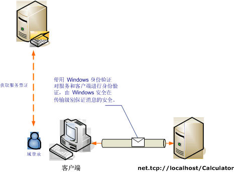

# <a name="transport-security-with-windows-authentication"></a><span data-ttu-id="5da9a-102">通过 Windows 身份验证确保的传输安全</span><span class="sxs-lookup"><span data-stu-id="5da9a-102">Transport Security with Windows Authentication</span></span>
<span data-ttu-id="5da9a-103">下面的方案演示通过 Windows 安全性进行保护的 [!INCLUDE[indigo1](../../../../includes/indigo1-md.md)] 客户端和服务。</span><span class="sxs-lookup"><span data-stu-id="5da9a-103">The following scenario shows a [!INCLUDE[indigo1](../../../../includes/indigo1-md.md)] client and service secured by Windows security.</span></span> [!INCLUDE[crabout](../../../../includes/crabout-md.md)]<span data-ttu-id="5da9a-104">编程，请参阅[如何： 使用 Windows 凭据来保护服务](../../../../docs/framework/wcf/how-to-secure-a-service-with-windows-credentials.md)。</span><span class="sxs-lookup"><span data-stu-id="5da9a-104"> programming, see [How to: Secure a Service with Windows Credentials](../../../../docs/framework/wcf/how-to-secure-a-service-with-windows-credentials.md).</span></span>  
  
 <span data-ttu-id="5da9a-105">Intranet Web 服务显示了人力资源信息。</span><span class="sxs-lookup"><span data-stu-id="5da9a-105">An intranet Web service displays human resources information.</span></span> <span data-ttu-id="5da9a-106">客户端是 Windows 窗体应用程序。</span><span class="sxs-lookup"><span data-stu-id="5da9a-106">The client is a Windows Form application.</span></span> <span data-ttu-id="5da9a-107">该应用程序部署在具有 Kerberos 控制器保护的域中。</span><span class="sxs-lookup"><span data-stu-id="5da9a-107">The application is deployed in a domain with a Kerberos controller securing the domain.</span></span>  
  
 <span data-ttu-id="5da9a-108"></span><span class="sxs-lookup"><span data-stu-id="5da9a-108"></span></span>  
  
|<span data-ttu-id="5da9a-109">特征</span><span class="sxs-lookup"><span data-stu-id="5da9a-109">Characteristic</span></span>|<span data-ttu-id="5da9a-110">描述</span><span class="sxs-lookup"><span data-stu-id="5da9a-110">Description</span></span>|  
|--------------------|-----------------|  
|<span data-ttu-id="5da9a-111">安全模式</span><span class="sxs-lookup"><span data-stu-id="5da9a-111">Security Mode</span></span>|<span data-ttu-id="5da9a-112">传输</span><span class="sxs-lookup"><span data-stu-id="5da9a-112">Transport</span></span>|  
|<span data-ttu-id="5da9a-113">互操作性</span><span class="sxs-lookup"><span data-stu-id="5da9a-113">Interoperability</span></span>|<span data-ttu-id="5da9a-114">仅 [!INCLUDE[indigo2](../../../../includes/indigo2-md.md)]</span><span class="sxs-lookup"><span data-stu-id="5da9a-114">[!INCLUDE[indigo2](../../../../includes/indigo2-md.md)] only</span></span>|  
|<span data-ttu-id="5da9a-115">身份验证（服务器）</span><span class="sxs-lookup"><span data-stu-id="5da9a-115">Authentication (Server)</span></span><br /><br /> <span data-ttu-id="5da9a-116">身份验证（客户端）</span><span class="sxs-lookup"><span data-stu-id="5da9a-116">Authentication (Client)</span></span>|<span data-ttu-id="5da9a-117">是（使用 Windows 集成身份验证）</span><span class="sxs-lookup"><span data-stu-id="5da9a-117">Yes (using Windows integrated authentication)</span></span><br /><br /> <span data-ttu-id="5da9a-118">是（使用 Windows 集成身份验证）</span><span class="sxs-lookup"><span data-stu-id="5da9a-118">Yes (using Windows integrated authentication)</span></span>|  
|<span data-ttu-id="5da9a-119">完整性</span><span class="sxs-lookup"><span data-stu-id="5da9a-119">Integrity</span></span>|<span data-ttu-id="5da9a-120">是</span><span class="sxs-lookup"><span data-stu-id="5da9a-120">Yes</span></span>|  
|<span data-ttu-id="5da9a-121">保密性</span><span class="sxs-lookup"><span data-stu-id="5da9a-121">Confidentiality</span></span>|<span data-ttu-id="5da9a-122">是</span><span class="sxs-lookup"><span data-stu-id="5da9a-122">Yes</span></span>|  
|<span data-ttu-id="5da9a-123">传输</span><span class="sxs-lookup"><span data-stu-id="5da9a-123">Transport</span></span>|<span data-ttu-id="5da9a-124">NET.TCP</span><span class="sxs-lookup"><span data-stu-id="5da9a-124">NET.TCP</span></span>|  
|<span data-ttu-id="5da9a-125">绑定</span><span class="sxs-lookup"><span data-stu-id="5da9a-125">Binding</span></span>|<xref:System.ServiceModel.NetTcpBinding>|  
  
## <a name="service"></a><span data-ttu-id="5da9a-126">服务</span><span class="sxs-lookup"><span data-stu-id="5da9a-126">Service</span></span>  
 <span data-ttu-id="5da9a-127">下面的代码和配置应独立运行。</span><span class="sxs-lookup"><span data-stu-id="5da9a-127">The following code and configuration are meant to run independently.</span></span> <span data-ttu-id="5da9a-128">执行下列操作之一：</span><span class="sxs-lookup"><span data-stu-id="5da9a-128">Do one of the following:</span></span>  
  
-   <span data-ttu-id="5da9a-129">使用代码（而不使用配置）创建独立服务。</span><span class="sxs-lookup"><span data-stu-id="5da9a-129">Create a stand-alone service using the code with no configuration.</span></span>  
  
-   <span data-ttu-id="5da9a-130">使用提供的配置创建服务，但不定义任何终结点。</span><span class="sxs-lookup"><span data-stu-id="5da9a-130">Create a service using the supplied configuration, but do not define any endpoints.</span></span>  
  
### <a name="code"></a><span data-ttu-id="5da9a-131">代码</span><span class="sxs-lookup"><span data-stu-id="5da9a-131">Code</span></span>  
 <span data-ttu-id="5da9a-132">下面的代码演示如何创建使用 Windows 安全的服务终结点。</span><span class="sxs-lookup"><span data-stu-id="5da9a-132">The following code shows how to create a service endpoint that uses a Windows security.</span></span>  
  
 [!code-csharp[C_SecurityScenarios#3](../../../../samples/snippets/csharp/VS_Snippets_CFX/c_securityscenarios/cs/source.cs#3)]
 [!code-vb[C_SecurityScenarios#3](../../../../samples/snippets/visualbasic/VS_Snippets_CFX/c_securityscenarios/vb/source.vb#3)]  
  
### <a name="configuration"></a><span data-ttu-id="5da9a-133">配置</span><span class="sxs-lookup"><span data-stu-id="5da9a-133">Configuration</span></span>  
 <span data-ttu-id="5da9a-134">可以使用下面的配置代替代码来设置服务终结点：</span><span class="sxs-lookup"><span data-stu-id="5da9a-134">The following configuration can be used instead of the code to set up the service endpoint:</span></span>  
  
```xml  
<?xml version="1.0" encoding="utf-8"?>  
<configuration>  
  <system.serviceModel>  
    <behaviors />  
    <services>  
      <service behaviorConfiguration="" name="ServiceModel.Calculator">  
        <endpoint address="net.tcp://localhost:8008/Calculator"   
                  binding="netTcpBinding"  
          bindingConfiguration="WindowsClientOverTcp"   
                  name="WindowsClientOverTcp"  
                  contract="ServiceModel.ICalculator" />  
      </service>  
    </services>  
    <bindings>  
      <netTcpBinding>  
        <binding name="WindowsClientOverTcp">  
          <security mode="Transport">  
            <transport clientCredentialType="Windows" />  
          </security>  
        </binding>  
      </netTcpBinding>  
    </bindings>  
    <client />  
  </system.serviceModel>  
</configuration>  
```  
  
## <a name="client"></a><span data-ttu-id="5da9a-135">客户端</span><span class="sxs-lookup"><span data-stu-id="5da9a-135">Client</span></span>  
 <span data-ttu-id="5da9a-136">下面的代码和配置应独立运行。</span><span class="sxs-lookup"><span data-stu-id="5da9a-136">The following code and configuration are meant to run independently.</span></span> <span data-ttu-id="5da9a-137">执行下列操作之一：</span><span class="sxs-lookup"><span data-stu-id="5da9a-137">Do one of the following:</span></span>  
  
-   <span data-ttu-id="5da9a-138">使用代码（和客户端代码）创建独立客户端。</span><span class="sxs-lookup"><span data-stu-id="5da9a-138">Create a stand-alone client using the code (and client code).</span></span>  
  
-   <span data-ttu-id="5da9a-139">创建不定义任何终结点地址的客户端。</span><span class="sxs-lookup"><span data-stu-id="5da9a-139">Create a client that does not define any endpoint addresses.</span></span> <span data-ttu-id="5da9a-140">而使用将配置名称作为参数的客户端构造函数。</span><span class="sxs-lookup"><span data-stu-id="5da9a-140">Instead, use the client constructor that takes the configuration name as an argument.</span></span> <span data-ttu-id="5da9a-141">例如：</span><span class="sxs-lookup"><span data-stu-id="5da9a-141">For example:</span></span>  
  
     [!code-csharp[C_SecurityScenarios#0](../../../../samples/snippets/csharp/VS_Snippets_CFX/c_securityscenarios/cs/source.cs#0)]
     [!code-vb[C_SecurityScenarios#0](../../../../samples/snippets/visualbasic/VS_Snippets_CFX/c_securityscenarios/vb/source.vb#0)]  
  
### <a name="code"></a><span data-ttu-id="5da9a-142">代码</span><span class="sxs-lookup"><span data-stu-id="5da9a-142">Code</span></span>  
 <span data-ttu-id="5da9a-143">下面的代码创建客户端。</span><span class="sxs-lookup"><span data-stu-id="5da9a-143">The following code creates the client.</span></span> <span data-ttu-id="5da9a-144">绑定配置为使用传输模式安全（采用 TCP 传输协议），并且客户端凭据类型设置为 Windows。</span><span class="sxs-lookup"><span data-stu-id="5da9a-144">The binding is configured to use the Transport mode security, with the TCP transport, with the client credential type set to Windows.</span></span>  
  
 [!code-csharp[C_SecurityScenarios#4](../../../../samples/snippets/csharp/VS_Snippets_CFX/c_securityscenarios/cs/source.cs#4)]
 [!code-vb[C_SecurityScenarios#4](../../../../samples/snippets/visualbasic/VS_Snippets_CFX/c_securityscenarios/vb/source.vb#4)]  
  
### <a name="configuration"></a><span data-ttu-id="5da9a-145">配置</span><span class="sxs-lookup"><span data-stu-id="5da9a-145">Configuration</span></span>  
 <span data-ttu-id="5da9a-146">可以使用下面的配置代替代码来创建客户端。</span><span class="sxs-lookup"><span data-stu-id="5da9a-146">The following configuration can be used instead of the code to create the client.</span></span>  
  
```xml  
<?xml version="1.0" encoding="utf-8"?>  
<configuration>  
  <system.serviceModel>  
    <bindings>  
      <netTcpBinding>  
        <binding name="NetTcpBinding_ICalculator" >  
          <security mode="Transport">  
            <transport clientCredentialType="Windows" />  
          </security>  
        </binding>  
      </netTcpBinding>  
    </bindings>  
    <client>  
      <endpoint address="net.tcp://localhost:8008/Calculator"   
                binding="netTcpBinding"            
                bindingConfiguration="NetTcpBinding_ICalculator"   
                contract="ICalculator"  
                name="NetTcpBinding_ICalculator">  
      </endpoint>  
    </client>  
  </system.serviceModel>  
</configuration>  
```  
  
## <a name="see-also"></a><span data-ttu-id="5da9a-147">请参阅</span><span class="sxs-lookup"><span data-stu-id="5da9a-147">See Also</span></span>  
 [<span data-ttu-id="5da9a-148">安全性概述</span><span class="sxs-lookup"><span data-stu-id="5da9a-148">Security Overview</span></span>](../../../../docs/framework/wcf/feature-details/security-overview.md)  
 [<span data-ttu-id="5da9a-149">如何：使用 Windows 凭据保护服务</span><span class="sxs-lookup"><span data-stu-id="5da9a-149">How to: Secure a Service with Windows Credentials</span></span>](../../../../docs/framework/wcf/how-to-secure-a-service-with-windows-credentials.md)  
 [<span data-ttu-id="5da9a-150">Windows Server App Fabric 的安全模型</span><span class="sxs-lookup"><span data-stu-id="5da9a-150">Security Model for Windows Server App Fabric</span></span>](http://go.microsoft.com/fwlink/?LinkID=201279&clcid=0x409)
