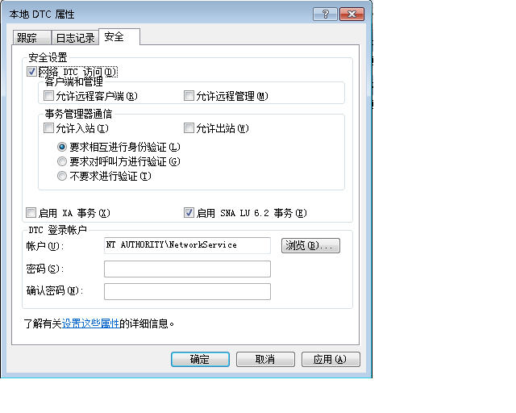

# <a name="troubleshooting-queued-messaging"></a>排队消息处理疑难解答
本部分包含常见的问题和故障排除帮助使用 Windows Communication Foundation (WCF) 中的队列。  
  
## <a name="common-questions"></a>常见问题  
 **问：** 我使用了 WCF Beta 1 和我安装了 MSMQ 修补程序。 现在，是否需要移除此修补程序？  
  
 **答：** 可以。 此修补程序不再受支持。 WCF 现在在 MSMQ 上工作，而无需修补程序要求。  
  
 **问：** 有两种 MSMQ 绑定：<xref:System.ServiceModel.NetMsmqBinding>和<xref:System.ServiceModel.MsmqIntegration.MsmqIntegrationBinding>。 我应该使用哪一种绑定以及在什么情况下使用？  
  
 **答：** 使用<xref:System.ServiceModel.NetMsmqBinding>当你想要将 MSMQ 用作传输两个 WCF 应用程序之间的排队通信。 使用<xref:System.ServiceModel.MsmqIntegration.MsmqIntegrationBinding>时想要使用现有 MSMQ 应用程序与新的 WCF 应用程序进行通信。  
  
 **问：** 是否必须升级 MSMQ 才能使用<xref:System.ServiceModel.NetMsmqBinding>和`MsmqIntegration`绑定？  
  
 **答：** 不是。 在 [!INCLUDE[wxp](../../../../includes/wxp-md.md)] 和 [!INCLUDE[ws2003](../../../../includes/ws2003-md.md)] 中，这两种绑定都可以与 MSMQ 3.0 一起使用。 在 [!INCLUDE[wv](../../../../includes/wv-md.md)] 中，只有升级到 MSMQ 4.0，绑定的某些功能才可用。  
  
 **问：** 哪些功能<xref:System.ServiceModel.NetMsmqBinding>和<xref:System.ServiceModel.MsmqIntegration.MsmqIntegrationBinding>绑定是可在 MSMQ 4.0 但不是在 MSMQ 3.0 中？  
  
 **答：** MSMQ 4.0，但不是在 MSMQ 3.0 中提供了以下功能：  
  
-   只有 MSMQ 4.0 才支持自定义死信队列。  
  
-   MSMQ 3.0 和 MSMQ 4.0 处理病毒消息的方式不同。  
  
-   只有 MSMQ 4.0 才支持远程事务处理读取。  
  
 有关详细信息，请参阅[队列功能在 Windows Vista、 Windows Server 2003 和 Windows XP 中的功能差异](../../../../docs/framework/wcf/feature-details/diff-in-queue-in-vista-server-2003-windows-xp.md)。  
  
 **问：** 可以一侧的排队的通信和 MSMQ 4.0 的另一端使用 MSMQ 3.0？  
  
 **答：** 可以。  
  
 **问：** 我想要将现有 MSMQ 应用程序与新的 WCF 客户端或服务器集成。 是否需要升级两端的 MSMQ 基础结构？  
  
 **答：** 不是。 您不必将任何一端升级到 MSMQ 4.0。  
  
## <a name="troubleshooting"></a>疑难解答  
 此部分包含大多数常见疑难问题的答案。 某些已知限制问题还将在发行说明中进行介绍。  
  
 **问：** 我尝试使用专用队列，我会得到以下异常： `System.InvalidOperationException`:URL 无效。 队列的 URL 不能包含“$”字符。 使用 net.msmq://machine/private/queueName 中的语法指定专有队列的地址。  
  
 **答：** 请检查你的配置和代码中的队列统一资源标识符 (URI)。 不要在 URI 中使用“$”字符。 例如，若要为名为 OrdersQueue 的专有队列指定地址，可以将 URI 指定为 net.msmq://localhost/private/ordersQueue。  
  
 **问：** 调用`ServiceHost.Open()`排队应用程序将引发以下异常： `System.ArgumentException`:基址中不能包含 URI 查询字符串。 为什么？  
  
 **答：** 检查队列在配置文件，并在代码中的 URI。 虽然 MSMQ 队列支持使用“?”字符，但 URI 将此字符解释为字符串查询的开头。 若要避免此问题，请使用不包含“?”字符的队列名称。  
  
 **问：** 我发送成功，但在接收方上调用任何服务操作。 为什么？  
  
 **答：** 若要确定答案，工作通过下面的检查列表：  
  
-   检查事务性队列需求是否与指定的保证相符。 请注意下面的原则：  
  
    -   您可以发送持久性消息 （数据报和会话） 具有"一次性"保证 (<xref:System.ServiceModel.MsmqBindingBase.ExactlyOnce%2A> = `true`) 只向事务性队列。  
  
    -   可以发送只具有“一次性”保证的会话。  
  
    -   需要使用事务从事务性队列接收会话中的消息。  
  
    -   可以发送或接收可变或持久性消息 （仅限于数据报） 没有保证 (<xref:System.ServiceModel.MsmqBindingBase.ExactlyOnce%2A> = `false`) 仅为非事务性队列。  
  
-   检查死信队列。 如果在此处找到消息，则确定没有传送这些消息的原因。  
  
-   检查传出队列的连通性或寻址问题。  
  
 **问：** 我已经指定了自定义死信队列，但当我启动发送方应用程序时，我收到异常，找不到死信队列，或发送应用程序不具有权限到死信队列。 为什么会出现这种情况？  
  
 **答：** 自定义死信队列 URI 必须包含一个"localhost"或计算机名称中的第一个段，例如，net.msmq: //localhost/private/myappdead-letter 队列。  
  
 **问：** 不总是需要定义自定义死信队列，或是否有默认死信队列？  
  
 **答：** 如果保证为"exactly once"(<xref:System.ServiceModel.MsmqBindingBase.ExactlyOnce%2A> = `true`)，如果未指定自定义死信队列，默认值是系统级事务性死信队列。  
  
 如果保证为无 (<xref:System.ServiceModel.MsmqBindingBase.ExactlyOnce%2A> = `false`)，则默认值为没有死信队列功能。  
  
 **问：** 我的服务引发异常，显示与消息"EndpointListener 无法满足要求，调用"。 为什么？  
  
 答： 请检查您的服务协定。 你忘记将"IsOneWay =`true`"对所有服务操作。 队列仅支持单向服务操作。  
  
 **问：** 在队列中有消息但任何服务操作进行调用。 有什么问题？  
  
 **答：** 确定是否服务主机出现故障。 可以通过查看跟踪情况或实现 `IErrorHandler` 进行检查。 默认情况下，如果检测到病毒消息，则服务主机将出现故障。  
  
 **问：** 在队列中消息，但我 Web 承载的排队的服务并未激活。 为什么？  
  
 **答：** 最常见原因是权限。  
  
1. 确保 `NetMsmqActivator` 进程正在运行，并为 `NetMsmqActivator` 进程的标识提供对此队列的读取和查找权限。  
  
2. 如果 `NetMsmqActivator` 正在监视远程计算机上的队列，请确保 `NetMsmqActivator` 不使用受限制的令牌运行。 若要使用不受限制的令牌运行 `NetMsmqActivator`，请执行以下操作：  
  
    ```  
    sc sidtype NetMsmqActivator unrestricted  
    ```  
  
 有关与安全相关的 Web 宿主问题请参阅：[承载排队应用程序的 web](../../../../docs/framework/wcf/feature-details/web-hosting-a-queued-application.md)。  
  
 **问：** 访问会话的最简单方法是什么？  
  
 **答：** 设置自动完成 =`true`对应于上次对操作消息在会话中，并设置自动完成 =`false`上所有其余服务操作。  
  
 **问：** 在哪里找到 msmq 常见问题解答？  
  
 **答：** 有关 MSMQ 的详细信息，请参阅[Microsoft 消息队列](https://go.microsoft.com/fwlink/?LinkId=87810)。  
  
 **问：** 我的服务是为什么要弃用`ProtocolException`时从同时包含一个队列读取排队会话消息和排队数据报消息？  
  
 **答：** 没有本质上的区别在方式排队的会话消息和排队数据报消息的构成。 因此，要读取排队会话消息的服务无法接收排队数据报消息，而要读取排队数据报消息的服务也无法接收会话消息。 试图从同一个队列读取这两种消息时将引发以下异常：  
  
```  
System.ServiceModel.MsmqPoisonMessageException: The transport channel detected a poison message. This occurred because the message exceeded the maximum number of delivery attempts or because the channel detected a fundamental problem with the message. The inner exception may contain additional information.   
---> System.ServiceModel.ProtocolException: An incoming MSMQ message contained invalid or unexpected .NET Message Framing information in its body. The message cannot be received. Ensure that the sender is using a compatible service contract with a matching SessionMode.  
```  
  
 当应用程序从同一台计算机既发送排队会话消息又发送排队数据报消息时，系统死信队列以及任何自定义死信队列对这种问题尤其敏感。 如果消息无法成功发送，则会被移入死信队列。 在这些情况下，很有可能将会话消息和数据报消息都移入死信队列。 从队列进行读取时，无法在运行时将两种消息分开。因此，应用程序不应从同一台计算机既发送排队会话消息又发送排队数据报消息。  
  
### <a name="msmq-integration-specific-troubleshooting"></a>MSMQ 集成：特定故障排除  
 **问：** 当我发送一条消息，或打开服务主机时，遇到错误，指示方案有误。 为什么？  
  
 **答：** 当使用 MSMQ 集成绑定时，必须使用 msmq.formatname 方案。 例如，msmq.formatname:DIRECT=OS:.\private$\OrdersQueue。 但是，如果您指定自定义死信队列，则必须使用 net.msmq 方案。  
  
 **问：** 我使用公共或专用格式名称并打开服务主机上[!INCLUDE[wv](../../../../includes/wv-md.md)]，出现错误。 为什么？  
  
 **答：** WCF 集成通道上的[!INCLUDE[wv](../../../../includes/wv-md.md)]检查，以查看是否可以打开主应用程序来处理病毒消息队列的子队列。 子队列名称派生自传递到侦听器的 msmq.formatname URI。 MSMQ 中的子队列名只能是直接格式名。 因此，您会发现以上错误。 将队列 URI 改为直接格式名。  
  
 **问：** 当从 MSMQ 应用程序收到一条消息，消息滞留在队列和接收 WCF 应用程序将不读取。 为什么？  
  
 **答：** 检查消息是否具有一个主体。 如果消息没有正文，则 MSMQ 集成通道会忽略此消息。 实现向其通知异常的 `IErrorHandler` 并检查跟踪情况。  
  
### <a name="security-related-troubleshooting"></a>与安全相关的疑难解答  
 **问：** 当我运行在工作组模式下使用默认绑定的示例时，消息看起来发送，但从未收到的接收方。  
  
 **答：** 默认情况下，使用 MSMQ 内部证书需要 Active Directory 目录服务对消息进行签名。 在工作组模式下，因为 Active Directory 不可用，所以对消息的签名会失败。 因此消息便进入死信队列，以及指示故障原因，诸如"签名错误"。  
  
 解决方法是关闭安全性。 这是通过设置<xref:System.ServiceModel.NetMsmqSecurity.Mode%2A>  =  <xref:System.ServiceModel.NetMsmqSecurityMode.None>以使其在工作组模式下工作。  
  
 另一个解决方法是从 <xref:System.ServiceModel.MsmqTransportSecurity> 属性获取 <xref:System.ServiceModel.NetMsmqSecurity.Transport%2A> 并将其设置为 <xref:System.ServiceModel.MsmqAuthenticationMode.Certificate>，然后设置客户端证书。  
  
 还有一种解决方法就是安装集成了 Active Directory 的 MSMQ。  
  
 **问：** 当我发送一封默认绑定 （传输安全处于打开状态） 在 Active Directory 到队列中收到"找不到内部证书"消息。 如何修复此问题？  
  
 **答：** 这意味着必须续订发送方在 Active Directory 中的证书。 若要执行此操作，打开**Control Panel**，**管理工具**，**计算机管理**，右键单击**MSMQ**，并选择**属性**。 选择**用户证书**选项卡，单击**续订**按钮。  
  
 **问：** 当我发送邮件时使用<xref:System.ServiceModel.MsmqAuthenticationMode.Certificate>并指定要使用的证书，我收到消息"无效证书"。 如何修复此问题？  
  
 **答：** 使用证书模式，不能使用本地计算机证书存储。 必须使用证书管理单元将证书从计算机证书存储区复制到当前用户存储区。 若要打开证书管理单元，请执行以下操作：  
  
1. 单击**启动**，选择**运行**，类型`mmc`，然后单击**确定**。  
  
2. 在中**Microsoft 管理控制台**，打开**文件**菜单，然后选择**添加/删除管理单元中**。  
  
3. 在中**添加/删除管理单元**对话框中，单击**添加**按钮。  
  
4. 在中**添加独立管理单元**对话框中，选择证书，单击**添加**。  
  
5. 在中**证书**管理单元对话框中，选择**我的用户帐户，** 然后单击**完成**。  
  
6. 接下来，添加第二个证书管理单元中使用前面的步骤，但这次选择**计算机帐户**然后单击**下一步**。  
  
7. 选择**本地计算机**然后单击**完成**。 现在，可以将证书从计算机证书存储区拖放到当前用户存储区。  
  
 **问：** 当我的服务读取从一个队列，另一台计算机在工作组模式下时，我收到"拒绝访问"异常。  
  
 **答：** 在工作组模式下，远程应用程序来访问队列，应用程序必须有权访问队列。 将"匿名登录"添加到队列的访问控制列表 (ACL) 并授予其读权限。  
  
 **问：** 时的网络服务客户端 （或不具有域帐户的任何客户端） 发送排队的消息时，发送失败的无效证书。 如何修复此问题？  
  
 **答：** 检查绑定配置。 默认绑定会打开 MSMQ 传输安全以对消息进行签名。 关闭该传输安全。  
  
### <a name="remote-transacted-receives"></a>远程事务处理接收  
 **问：** 上有一个队列时机器，并从计算机 B （远程事务处理接收方案） 上的队列中读取消息的 WCF 服务，消息是未从队列中读取。 跟踪信息指示接收失败，出现消息"无法导入事务。" 若要解决此问题，我该做什么？  
  
 **答：** 原因可能有以下三种：  
  
-   如果处于域模式下，则远程事务处理接收要求 Microsoft 分布式事务协调器 (MSDTC) 网络访问。 您可以启用此功能使用**添加/删除组件**。  
  
       
  
-   检查与事务管理器进行通信的身份验证模式。 如果要在工作组模式下，必须选择"不要求进行验证"。 如果处于域模式下，必须选择"要求相互身份验证"。  
  
       
  
-   请确保 MSDTC 在列表中的异常**Internet 连接防火墙**设置。  
  
-   确保您使用的是 [!INCLUDE[wv](../../../../includes/wv-md.md)]。 [!INCLUDE[wv](../../../../includes/wv-md.md)] 上的 MSMQ 支持远程事务处理读取。 早期的 Windows 版本上的 MSMQ 不支持远程事务处理读取。  
  
 **问：** 从队列中读取的服务时的网络服务，例如，在 Web 主机，为什么收到访问拒绝异常时引发从队列中读取？  
  
 **答：** 网络服务读访问权限必须添加到队列 ACL 以确保网络服务可从队列读取。  
  
 **问：** 可以使用 MSMQ 激活服务激活基于远程计算机上的队列中消息的应用程序？  
  
 **答：** 可以。 为此，您必须将 MSMQ 激活服务配置为以网络服务方式运行，并将网络服务访问权限添加到远程计算机上的队列中。  
  
## <a name="using-custom-msmq-bindings-with-receivecontext-enabled"></a>使用已启用 ReceiveContext 的自定义 MSMQ 绑定  
 当将自定义 MSMQ 绑定用于已启用 <xref:System.ServiceModel.Channels.ReceiveContext> 的处理时，传入消息将使用一个线程池线程，这是因为本机 MSMQ 不支持异步 <xref:System.ServiceModel.Channels.ReceiveContext> 接收的 I/O 完成。 这是因为处理此类消息需使用 <xref:System.ServiceModel.Channels.ReceiveContext> 的内部事务，并且 MSMQ 不支持异步处理。 若要解决此问题，可将 <xref:System.ServiceModel.Description.SynchronousReceiveBehavior> 添加到终结点以强制进行同步处理或将 <xref:System.ServiceModel.Description.DispatcherSynchronizationBehavior.MaxPendingReceives%2A> 设置为 1。
