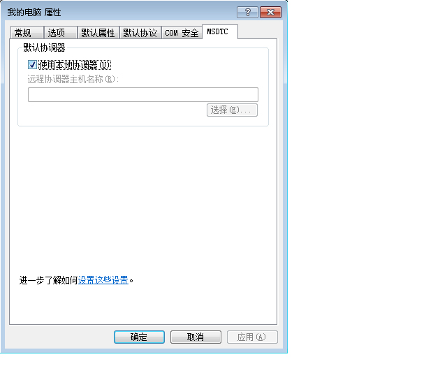

# 排队消息处理疑难解答
本节包含在 [!INCLUDE[indigo1](../../../../includes/indigo1-md.md)] 中使用队列时出现的常见问题以及疑难解答帮助。  
  
## 常见问题  
 **问：**我用过 [!INCLUDE[indigo2](../../../../includes/indigo2-md.md)] Beta 1 并且安装了 MSMQ 修补程序。现在，是否需要移除此修补程序？  
  
 **答：**是。此修补程序不再受支持。[!INCLUDE[indigo2](../../../../includes/indigo2-md.md)] 无需修补程序便可以在 MSMQ 上工作。  
  
 **问：**有以下两种 MSMQ 绑定：<xref:System.ServiceModel.NetMsmqBinding> 和 <xref:System.ServiceModel.MsmqIntegration.MsmqIntegrationBinding>。我应该使用哪一种绑定以及在什么情况下使用？  
  
 **答：**如果您想要将 MSMQ 用作两个 [!INCLUDE[indigo2](../../../../includes/indigo2-md.md)] 应用程序之间的排队通信的传输工具，请使用 <xref:System.ServiceModel.NetMsmqBinding>。如果您想要使用现有的 MSMQ 应用程序与新的 [!INCLUDE[indigo2](../../../../includes/indigo2-md.md)] 应用程序进行通信，请使用 <xref:System.ServiceModel.MsmqIntegration.MsmqIntegrationBinding>。  
  
 **问：**是否必须升级 MSMQ 才能使用 <xref:System.ServiceModel.NetMsmqBinding> 和 `MsmqIntegration` 绑定？  
  
 **答：**否。在 [!INCLUDE[wxp](../../../../includes/wxp-md.md)] 和 [!INCLUDE[ws2003](../../../../includes/ws2003-md.md)] 中这两种绑定都可以与 MSMQ 3.0 一起使用。在 [!INCLUDE[wv](../../../../includes/wv-md.md)] 中，只有升级到 MSMQ 4.0，绑定的某些功能才可用。  
  
 **问：** <xref:System.ServiceModel.NetMsmqBinding> 和 <xref:System.ServiceModel.MsmqIntegration.MsmqIntegrationBinding> 绑定的哪些功能在 MSMQ 4.0 中可用但在 MSMQ 3.0 中不可用？  
  
 **答：**以下功能在 MSMQ 4.0 中可用但在 MSMQ 3.0 中不可用：  
  
-   只有 MSMQ 4.0 才支持自定义死信队列。  
  
-   MSMQ 3.0 和 MSMQ 4.0 处理病毒消息的方式不同。  
  
-   只有 MSMQ 4.0 才支持远程事务处理读取。  
  
 [!INCLUDE[crdefault](../../../../includes/crdefault-md.md)] [Windows Vista、Windows Server 2003 和 Windows XP 在排队功能方面的差异](../../../../docs/framework/wcf/feature-details/diff-in-queue-in-vista-server-2003-windows-xp.md).  
  
 **问：**是否可以在排队通信的一端使用 MSMQ 3.0 而在另一端使用 MSMQ 4.0？  
  
 **答：**是。  
  
 **问：**我想要将现有的 MSMQ 应用程序与新的 [!INCLUDE[indigo2](../../../../includes/indigo2-md.md)] 客户端或服务器集成。是否需要升级两端的 MSMQ 基础结构？  
  
 **答：**否。您不必将任何一端升级到 MSMQ 4.0。  
  
## 疑难解答  
 此部分包含大多数常见疑难问题的答案。某些已知限制问题还将在发行说明中进行介绍。  
  
 **问：**尝试使用专有队列时出现以下异常：“`System.InvalidOperationException`: URL 无效”。队列的 URL 不能包含“$”字符。使用 net.msmq:\/\/machine\/private\/queueName 中的语法指定专有队列的地址。  
  
 **答：**请在配置和代码中检查队列的统一资源标识符 \(URI\)。不要在 URI 中使用“$”字符。例如，若要为名为 OrdersQueue 的专有队列指定地址，可以将 URI 指定为 net.msmq:\/\/localhost\/private\/ordersQueue。  
  
 **问：**在对排队应用程序调用 `ServiceHost.Open()` 时引发下面的异常：“`System.ArgumentException`: 基地址中不能包含 URI 查询字符串”。为什么？  
  
 **答：**请检查配置文件和代码中的队列 URI。虽然 MSMQ 队列支持使用“?”字符，但 URI 将此字符解释为字符串查询的开头。若要避免此问题，请使用不包含“?”字符的队列名称。  
  
 **问：**发送操作已成功，但未在接收方调用任何服务操作。为什么？  
  
 **答：**若要确定答案，请按照下面的检查列表进行操作：  
  
-   检查事务性队列要求是否与指定的保证相符。请注意下面的原则：  
  
    -   可以只向事务性队列发送具有“一次性”保证 \(<xref:System.ServiceModel.MsmqBindingBase.ExactlyOnce%2A> \= `true`\) 的持久性消息（数据报和会话）。  
  
    -   可以发送只具有“一次性”保证的会话。  
  
    -   需要使用事务从事务性队列接收会话中的消息。  
  
    -   可以只与非事务性队列收发无任何保证 \(<xref:System.ServiceModel.MsmqBindingBase.ExactlyOnce%2A> \= `false`\) 的可变或持久性消息（仅限于数据报）。  
  
-   检查死信队列。如果在此处找到消息，则确定没有传送这些消息的原因。  
  
-   检查传出队列的连通性或寻址问题。  
  
 **问：**尽管我已经指定了一个自定义死信队列，但是当我启动发送方应用程序时，却出现异常，即要么找不到死信队列，要么发送应用程序没有死信队列的权限。为什么会出现这种情况？  
  
 **答：**自定义死信队列 URI 的第一个段中必须包括一个“localhost”或计算机名，例如 net.msmq:\/\/localhost\/private\/myAppdead\-letter 队列。  
  
 **问：**是否总是需要定义自定义死信队列？有没有默认的死信队列？  
  
 **答：**如果保证为“一次性”\(<xref:System.ServiceModel.MsmqBindingBase.ExactlyOnce%2A> \= `true`\)，并且您没有指定自定义死信队列，则默认为系统级事务性死信队列。  
  
 如果保证为无 \(<xref:System.ServiceModel.MsmqBindingBase.ExactlyOnce%2A> \= `false`\)，则默认情况下没有死信队列功能。  
  
 **问：**调用 SvcHost.Open 时我的服务引发异常，显示消息“ListenerFactory 无法满足 EndpointListener 要求”。为什么？  
  
 答：请检查您的服务协定。您可能忘记针对所有服务操作设置“IsOneWay\=`true`”。队列仅支持单向服务操作。  
  
 **问：**队列中存在消息但未调用任何服务操作。有什么问题？  
  
 **答：**确定服务主机是否出现故障。可以通过查看跟踪情况或实现 `IErrorHandler` 进行检查。默认情况下，如果检测到病毒消息，则服务主机将出现故障。  
  
 **问：**队列中存在消息但是 Web 承载的排队服务并未激活。为什么？  
  
 **答：**最常见的原因是权限问题。  
  
1.  确保 `NetMsmqActivator` 进程正在运行，并为 `NetMsmqActivator` 进程的标识提供对此队列的读取和查找权限。  
  
2.  如果 `NetMsmqActivator` 正在监视远程计算机上的队列，请确保 `NetMsmqActivator` 不使用受限制的令牌运行。若要使用不受限制的令牌运行 `NetMsmqActivator`，请执行以下操作：  
  
    ```  
    sc sidtype NetMsmqActivator unrestricted  
    ```  
  
 有关非安全相关的 Web 宿主问题，请参阅：[承载排队应用程序的 Web](../../../../docs/framework/wcf/feature-details/web-hosting-a-queued-application.md)。  
  
 **问：**访问会话的最简便的方法是什么？  
  
 **答：**针对会话中最后一个消息所对应的操作设置 AutoComplete\=`true`，并针对所有其余服务操作设置 AutoComplete\=`false`。  
  
 **问：**哪里可以找到 MSMQ 常见问题解答？  
  
 **答：** [!INCLUDE[crabout](../../../../includes/crabout-md.md)] MSMQ 的更多信息，请参见 [Microsoft 消息队列](http://go.microsoft.com/fwlink/?LinkId=87810)（可能为英文网页）。  
  
 **问：**从同时包含排队会话消息和排队数据报消息的队列进行读取时，为什么我的服务引发 `ProtocolException`？  
  
 **答：**排队会话消息和排队数据报消息的构成方式有本质上的区别。因此，要读取排队会话消息的服务无法接收排队数据报消息，而要读取排队数据报消息的服务也无法接收会话消息。试图从同一个队列读取这两种消息时将引发以下异常：  
  
```  
System.ServiceModel.MsmqPoisonMessageException: The transport channel detected a poison message. This occurred because the message exceeded the maximum number of delivery attempts or because the channel detected a fundamental problem with the message. The inner exception may contain additional information.   
---> System.ServiceModel.ProtocolException: An incoming MSMQ message contained invalid or unexpected .NET Message Framing information in its body. The message cannot be received. Ensure that the sender is using a compatible service contract with a matching SessionMode.  
```  
  
 当应用程序从同一台计算机既发送排队会话消息又发送排队数据报消息时，系统死信队列以及任何自定义死信队列对这种问题尤其敏感。如果消息无法成功发送，则会被移入死信队列。在这些情况下，很有可能将会话消息和数据报消息都移入死信队列。从队列进行读取时，无法在运行时将两种消息分开。因此，应用程序不应从同一台计算机既发送排队会话消息又发送排队数据报消息。  
  
### MSMQ 集成：特定的疑难解答  
 **问：**发送消息或打开服务主机时，系统报错，指示方案有误。为什么？  
  
 **答：**如果您使用 MSMQ 集成绑定，则必须使用 msmq.formatname 方案。例如，msmq.formatname:DIRECT\=OS:.\\private$\\OrdersQueue。但是，如果您指定自定义死信队列，则必须使用 net.msmq 方案。  
  
 **问：**当我使用公共或专用格式名并在 [!INCLUDE[wv](../../../../includes/wv-md.md)] 上打开服务主机时，出现错误。为什么？  
  
 **答：** [!INCLUDE[wv](../../../../includes/wv-md.md)] 上的 [!INCLUDE[indigo2](../../../../includes/indigo2-md.md)] 集成通道会检查能否打开主应用程序队列的子队列来处理病毒消息。子队列名称派生自传递到侦听器的 msmq.formatname URI。MSMQ 中的子队列名只能是直接格式名。因此，您会发现以上错误。将队列 URI 改为直接格式名。  
  
 **问：**接收来自 MSMQ 应用程序的消息时，该消息滞留在队列中，不会由接收 [!INCLUDE[indigo2](../../../../includes/indigo2-md.md)] 应用程序读取。为什么？  
  
 **答：**查看该消息是否有正文。如果消息没有正文，则 MSMQ 集成通道会忽略此消息。实现向其通知异常的 `IErrorHandler` 并检查跟踪情况。  
  
### 与安全相关的疑难解答  
 **问：**运行以工作组模式使用默认绑定的示例时，消息好像已发送但接收方从未收到这些消息。  
  
 **答：**默认情况下会使用 MSMQ 内部证书对消息进行签名，而此证书需要 Active Directory 目录服务。在工作组模式下，因为 Active Directory 不可用，所以对消息的签名会失败。这样，消息便进入死信队列，同时指示诸如“签名错误”之类的故障原因。  
  
 解决方法是关闭安全性。这可以通过设置 <xref:System.ServiceModel.NetMsmqSecurity.Mode%2A> \= <xref:System.ServiceModel.NetMsmqSecurityMode> 使其在工作组模式下运行来实现。  
  
 另一个解决方法是从 <xref:System.ServiceModel.NetMsmqSecurity.Transport%2A> 属性获取 <xref:System.ServiceModel.MsmqTransportSecurity> 并将其设置为 <xref:System.ServiceModel.MsmqAuthenticationMode>，然后设置客户端证书。  
  
 还有一种解决方法就是安装集成了 Active Directory 的 MSMQ。  
  
 **问：**向队列发送具有 Active Directory 中的默认绑定（传输安全处于打开状态）的消息时，收到消息“找不到内部证书”。如何修复此问题？  
  
 **答：**这意味着必须续订发送方在 Active Directory 中的证书。为此，请依次打开**“控制面板”**、**“管理工具”**和**“计算机管理”**，然后右击**“MSMQ”**并选择**“属性”**。选择**“用户证书”**选项卡，然后单击**“续订”**按钮。  
  
 **问：**在使用 <xref:System.ServiceModel.MsmqAuthenticationMode> 发送消息和指定要使用的证书时，收到消息“证书无效”。如何修复此问题？  
  
 **答：**您不能使用证书模式的本地计算机证书存储区。必须使用证书管理单元将证书从计算机证书存储区复制到当前用户存储区。若要打开证书管理单元，请执行以下操作：  
  
1.  单击**“开始”**，选择**“运行”**，键入 `mmc`，然后单击**“确定”**。  
  
2.  在**“Microsoft 管理控制台”**中，打开**“文件”**菜单，然后选择**“添加\/删除管理单元”**。  
  
3.  在**“添加\/删除管理单元”**对话框中，单击**“添加”**按钮。  
  
4.  在**“添加独立管理单元”**对话框选择“证书”，然后单击**“添加”**。  
  
5.  在**“证书”**管理单元对话框中，选择**“我的用户帐户”**，然后单击**“完成”**。  
  
6.  然后，按照上述步骤再添加第二个证书管理单元，但这次是选择**“计算机帐户”**并单击**“下一步”**。  
  
7.  选择**“本地计算机”**，然后单击**“完成”**。现在，可以将证书从计算机证书存储区拖放到当前用户存储区。  
  
 **问：**当我的服务在工作组模式下从另一台计算机上的队列进行读取时，收到异常“拒绝访问”。  
  
 **答：**在工作组模式下，远程应用程序若要访问队列，此应用程序必须具有访问该队列的权限。将“匿名登录”添加到队列的访问控制列表 \(ACL\) 并授予其读权限。  
  
 **问：**当网络服务客户端（或者没有域帐户的任何客户端）发送排队消息时，发送会因证书无效而失败。如何修复此问题？  
  
 **答：**请检查绑定配置。默认绑定会打开 MSMQ 传输安全以对消息进行签名。关闭该传输安全。  
  
### 远程事务处理接收  
 **问：**我在计算机 A 上有一个队列，另外有一个从计算机 B 上的队列读取消息的 [!INCLUDE[indigo2](../../../../includes/indigo2-md.md)] 服务（远程事务处理接收方案），但却不能从该队列中读取消息。跟踪信息指示接收失败并显示消息“无法导入事务”。如何修复此问题？  
  
 **答：**出现此错误可能有以下三种原因：  
  
-   如果处于域模式下，则远程事务处理接收要求 Microsoft 分布式事务协调器 \(MSDTC\) 网络访问。可以使用**“添加\/删除组件”**来启用它。  
  
       
  
-   检查与事务管理器进行通信的身份验证模式。如果处于工作组模式下，则必须选择“不要求身份验证”。如果您处于域模式下，则必须选择“要求相互身份验证”。  
  
       
  
-   确保 MSDTC 在**“Internet 连接防火墙”**设置的异常列表中。  
  
-   确保您使用的是 [!INCLUDE[wv](../../../../includes/wv-md.md)]。[!INCLUDE[wv](../../../../includes/wv-md.md)] 上的 MSMQ 支持远程事务处理读取。早期的 Windows 版本上的 MSMQ 不支持远程事务处理读取。  
  
 **问：**如果从队列进行读取的服务为网络服务（例如，Web 宿主中的服务），为什么从队列进行读取时会引发拒绝访问异常？  
  
 **答：**必须将网络服务读访问权限添加到队列 ACL 中，以确保网络服务可以从该队列进行读取。  
  
 **问：**是否可以使用 MSMQ 激活服务来基于远程计算机上的队列中的消息激活应用程序？  
  
 **答：**是。为此，您必须将 MSMQ 激活服务配置为以网络服务方式运行，并将网络服务访问权限添加到远程计算机上的队列中。  
  
## 使用已启用 ReceiveContext 的自定义 MSMQ 绑定  
 当将自定义 MSMQ 绑定用于已启用 <xref:System.ServiceModel.Channels.ReceiveContext> 的处理时，传入消息将使用一个线程池线程，这是因为本机 MSMQ 不支持异步 <xref:System.ServiceModel.Channels.ReceiveContext> 接收的 I\/O 完成。这是因为处理此类消息需使用 <xref:System.ServiceModel.Channels.ReceiveContext> 的内部事务，并且 MSMQ 不支持异步处理。若要解决此问题，可将 <xref:System.ServiceModel.Description.SynchronousReceiveBehavior> 添加到终结点以强制进行同步处理或将 <xref:System.ServiceModel.Description.DispatcherSynchronizationBehavior.MaxPendingReceives%2A> 设置为 1。