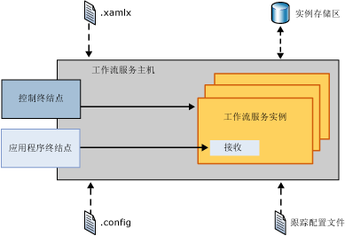
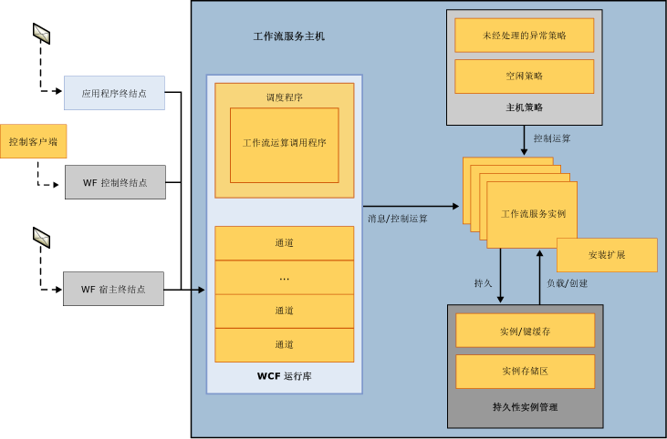
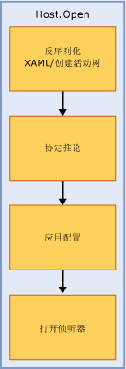
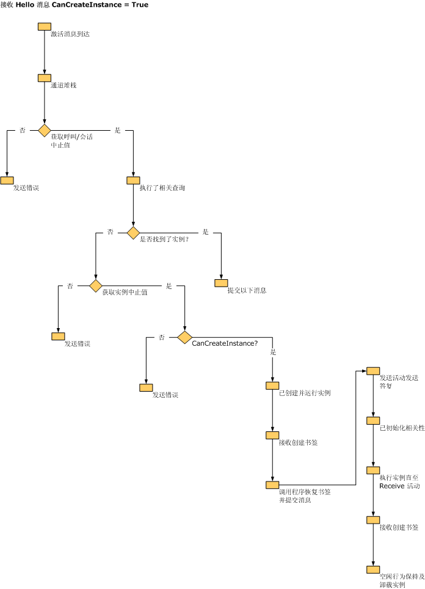
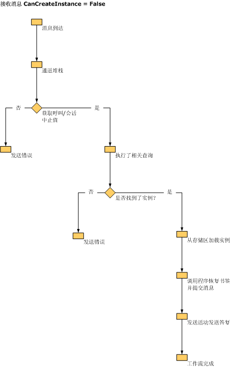

# 工作流服务主机内部机制
<xref:System.ServiceModel.WorkflowServiceHost> 为工作流服务提供主机。 它负责侦听传入消息并将这些消息路由到相应的工作流服务实例，控制空闲工作流的卸载与持久保留，等等。 本主题说明 WorkflowServiceHost 如何处理传入消息。  
  
## WorkflowServiceHost 概述  
 <xref:System.ServiceModel.WorkflowServiceHost> 类用于承载工作流服务。 它侦听传入消息并将这些消息路由到相应的服务实例，创建新实例，或者根据需要从持久存储区加载现有实例。  下图从高级别演示了 <xref:System.ServiceModel.WorkflowServiceHost> 的工作方式。  
  
   
  
 此图演示 <xref:System.ServiceModel.WorkflowServiceHost> 从 .xamlx 文件加载工作流服务定义，并从配置文件加载配置信息。 它还会从跟踪配置文件加载跟踪配置。 <xref:System.ServiceModel.WorkflowServiceHost> 公开允许您将控制操作发送到工作流实例的工作流控制终结点。  有关详细信息请参阅[流控制终结点示例](../../../../docs/framework/wcf/feature-details/workflow-control-endpoint.md)。  
  
 <xref:System.ServiceModel.WorkflowServiceHost> 还公开侦听传入应用程序消息的应用程序终结点。 当一个传入消息到达时，它将被发送到相应的工作流服务实例（如果当前已加载该实例）。 如果需要，还将创建一个新的工作流实例。 或者，如果某个现有实例已持久保留，则将从持久存储区加载它。  
  
## WorkflowServiceHost 详细信息  
 下图更详细地演示了 <xref:System.ServiceModel.WorkflowServiceHost> 如何处理消息。  
  
   
  
 此图演示了三个不同的终结点：应用程序终结点、工作流控制终结点和工作流承载终结点。 应用程序终结点可接收针对特定工作流实例绑定的消息。 工作流控制终结点可侦听控制操作。 工作流承载终结点可侦听导致 <xref:System.ServiceModel.WorkflowServiceHost> 加载和执行非服务工作流的消息。 如图所示，通过 WCF 运行时处理所有消息。  使用 <xref:System.ServiceModel.Description.ServiceThrottlingBehavior.MaxConcurrentInstances%2A> 属性实现工作流服务实例限制。 此属性将限制并发工作流服务实例的数量。 超过此限制后，对新工作流服务实例的任何其他请求或激活持久性工作流实例的请求将进行排队。 按 FIFO 顺序处理排队的请求，无论是对新实例的请求还是对正在运行的持久性实例的请求。 加载主机策略信息，用于确定如何处理未处理的异常以及如何卸载和持久保留空闲工作流服务。 有关这些主题的详细信息请参阅[如何：配置工作流未经处理的异常行为使用 WorkflowServiceHost](../../../../docs/framework/wcf/feature-details/config-workflow-unhandled-exception-workflowservicehost.md)和[如何：使用 WorkflowServiceHost 配置空闲行为](../../../../docs/framework/wcf/feature-details/how-to-configure-idle-behavior-with-workflowservicehost.md)。 根据主机策略持久化工作流实例，并在需要时重新加载这些实例。 工作流暂留，请参阅有关的详细信息：[如何：使用 WorkflowServiceHost 配置永久性](../../../../docs/framework/wcf/feature-details/how-to-configure-persistence-with-workflowservicehost.md)，[创建一个长时间运行的工作流服务](../../../../docs/framework/wcf/feature-details/creating-a-long-running-workflow-service.md)，和[工作流持久性](../../../../docs/framework/windows-workflow-foundation/workflow-persistence.md)。  
  
 下图演示 WorkflowServiceHost.Open 调用的内容。  
  
   
  
 从 XAML 加载工作流并创建活动树。 <xref:System.ServiceModel.WorkflowServiceHost> 将沿着活动树并创建服务描述。 将配置应用到主机。 最后，主机开始侦听传入消息。  
  
 下图演示了当 <xref:System.ServiceModel.WorkflowServiceHost> 接收到针对 CanCreateInstance 设置为 `true` 的 Receive 活动绑定的消息时，它所执行的操作。  
  
   
  
 消息到达，并由 WCF 通道堆栈进行处理。 检查控制器并执行相关查询。 如果为现有实例绑定消息，则传递此消息。 如果需要创建新实例，则检查 Receive 活动的 CanCreateInstance 属性。 如果此属性设置为 True，则将创建新实例并传递消息。  
  
 下图演示了当 <xref:System.ServiceModel.WorkflowServiceHost> 接收到针对 CanCreateInstance 设置为 false 的 Receive 活动绑定的消息时，它所执行的操作。  
  
   
  
 消息到达，并由 WCF 通道堆栈进行处理。 检查控制器并执行相关查询。 为某个现有实例绑定消息（因为 CanCreateInstance 为 False），以便从持久存储区加载该实例，恢复书签并执行工作流。  
  
> [!WARNING]
> 如果 SQL Server 配置为仅侦听 NamedPipe 协议，则工作流服务主机将打开失败。  
  
## 请参阅

- [工作流服务](../../../../docs/framework/wcf/feature-details/workflow-services.md)
- [承载工作流服务](../../../../docs/framework/wcf/feature-details/hosting-workflow-services.md)
- [工作流控制终结点](../../../../docs/framework/wcf/feature-details/workflow-control-endpoint.md)
- [如何：配置工作流未经处理的异常行为使用 WorkflowServiceHost](../../../../docs/framework/wcf/feature-details/config-workflow-unhandled-exception-workflowservicehost.md)
- [创建长时间运行的工作流服务](../../../../docs/framework/wcf/feature-details/creating-a-long-running-workflow-service.md)
- [工作流暂留](../../../../docs/framework/windows-workflow-foundation/workflow-persistence.md)
