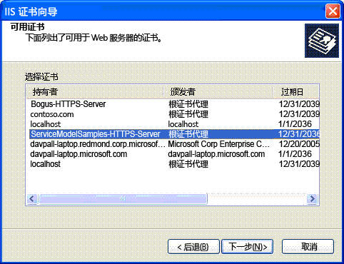

# <a name="internet-information-services-iis-server-certificate-installation-instructions"></a>Internet Information Services (IIS) 服务器证书安装说明
若要运行可与 Internet 信息服务 (IIS) 安全通信的示例，您必须创建和安装服务器证书。  
  
## <a name="step-1-creating-certificates"></a>步骤 1。 创建证书  
 若要创建您的计算机的证书，请使用管理员特权打开 Visual Studio 开发人员命令提示符并运行包含在每个示例中使用的 IIS 安全通信的 Setup.bat。 在运行此批处理文件之前，确保路径包括其中包含 Makecert.exe 的文件夹。 以下命令用于在 Setup.bat 中创建证书。  
  
```  
makecert -sr LocalMachine -ss My -n CN=ServiceModelSamples-HTTPS-Server -sky exchange -sk ServiceModelSamples-HTTPS-Key  
```  
  
## <a name="step-2-installing-certificates"></a>步骤 2。 安装证书  
 安装刚刚创建的证书所需执行的步骤取决于您所使用的 IIS 版本。  
  
#### <a name="to-install-iis-on-iis-51-windows-xp-and-iis-60-windows-server-2003"></a>在 IIS 5.1 (Windows XP) 和 IIS 6.0 (Windows Server 2003) 上安装 IIS  
  
1. 打开 Internet 信息服务管理器 MMC 管理单元。  
  
2. 右键单击默认网站，然后选择**属性**。  
  
3. 选择**目录安全性**选项卡。  
  
4. 单击**服务器证书**按钮。 Web 服务器证书向导将启动。  
  
5. 完成向导。 选择用于分配证书的选项。 从显示的证书列表中选择 ServiceModelSamples-HTTPS-Server 证书。  
  
       
  
6. 通过使用 HTTPS 地址在浏览器中测试对服务的访问`https://localhost/servicemodelsamples/service.svc`。  
  
#### <a name="if-ssl-was-previously-configured-by-using-httpcfgexe"></a>如果以前使用 Httpcfg.exe 配置了 SSL  
  
1. 使用 Makecert.exe（或运行 Setup.bat）创建服务器证书。  
  
2. 按照前面的步骤运行 IIS 管理器并安装证书。  
  
3. 将以下代码行添加到客户端程序。  
  
> [!IMPORTANT]
>  只有测试证书（比如通过 Makecert.exe 创建的那些证书）才需要此代码。 建议不要为成品代码执行此操作。  
  
```  
PermissiveCertificatePolicy.Enact("CN=ServiceModelSamples-HTTPS-Server");  
```  
  
#### <a name="to-install-iis-on-iis-70-windows-vista-and-windows-server-2008"></a>在 IIS 7.0（Windows Vista 和 Windows Server 2008）上安装 IIS  
  
1. 从**启动**菜单上，单击**运行**，然后键入**inetmgr**以打开 Internet 信息服务 (IIS) MMC 管理单元。  
  
2. 右键单击**Default Web Site** ，然后选择**编辑绑定...**  
  
3. 单击**外**的按钮**站点绑定**对话框。  
  
4. 选择**HTTPS**从**类型**下拉列表。  
  
5. 选择**ServiceModelSamples HTTPS 服务器**从**SSL 证书**下拉列表，然后单击**确定**。  
  
6. 通过使用 HTTPS 地址在浏览器中测试对服务的访问`https://localhost/servicemodelsamples/service.svc`。  
  
> [!NOTE]
>  由于刚刚安装的测试证书不是受信任的证书，因此，在浏览用此证书保护的本地 Web 地址时，你可能会遇到其他 Internet Explorer 安全警告。  
  
## <a name="removing-certificates"></a>移除证书  
  
- 按照前面的指引使用 Internet Information Services 管理器，但要移除（而不是添加）证书或绑定。  
  
- 使用以下命令移除计算机证书。  
  
    ```  
    httpcfg delete ssl -i 0.0.0.0:443  
    ```
