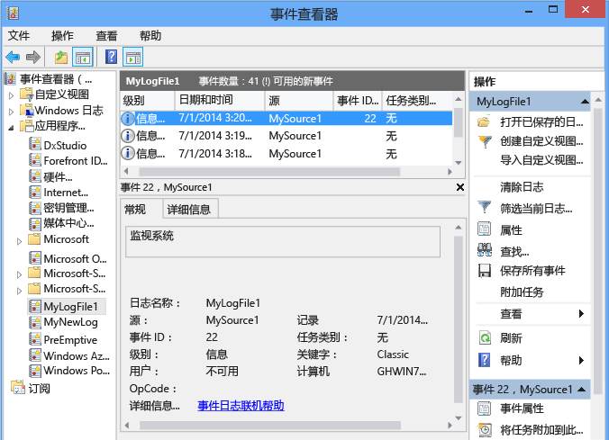

# <a name="walkthrough-creating-a-windows-service-application-in-the-component-designer"></a>演练：在组件设计器中创建 Windows 服务应用程序
本文演示了如何在 Visual Studio 中创建向事件日志中写入消息的简单 Windows 服务应用程序。 下面是创建和使用你的服务所执行的基本步骤：  
  
1.  [创建服务](#BK_CreateProject) 使用 **Windows 服务** 项目模板，并对其进行配置。 此模板为你创建一个从 <xref:System.ServiceProcess.ServiceBase?displayProperty=nameWithType> 继承的类，并编写大量基本服务代码，例如启动服务的代码。  
  
2.  [向服务添加功能](#BK_WriteCode) 针对 <xref:System.ServiceProcess.ServiceBase.OnStart%2A> 和 <xref:System.ServiceProcess.ServiceBase.OnStop%2A> 过程，重写任意你想要重新定义的其他方法。  
  
3.  [设置服务状态](#BK_SetStatus)。 默认情况下，用 <xref:System.ServiceProcess.ServiceBase?displayProperty=nameWithType> 创建的服务仅会实现可用状态标志的子集。 如果你的服务启动、暂停或停止所需的时间较长，你可以实施“启动挂起”或“停止挂起”等状态值，表示它正在运行。  
  
4.  [向服务添加安装程序](#BK_AddInstallers) 针对你的服务应用程序。  
  
5.  （可选） [设置启动参数](#BK_StartupParameters)，指定默认启动参数，并使用户在手动启动你的服务时能重写默认设置。  
  
6.  [生成服务](#BK_Build)。  
  
7.  [安装服务](#BK_Install) 在本地计算机上。  
  
8.  访问 Windows 服务控制管理器并 [启动和运行服务](#BK_StartService)。  
  
9. [卸载 Windwos 服务](#BK_Uninstall)。  
  
> [!WARNING]
>  Visual Studio 速成版中未提供本演练所需的 Windows 服务项目模板。  
  
 [!INCLUDE[note_settings_general](../../../includes/note-settings-general-md.md)]  
  
<a name="BK_CreateProject"></a>   
## <a name="creating-a-service"></a>创建服务  
 首先，创建项目并设置服务正常运行所必需的值。  
  
#### <a name="to-create-and-configure-your-service"></a>创建并配置服务  
  
1.  在 Visual Studio 中，在菜单栏上，选择 **“文件”**、 **“新建”**、 **“项目”**。  
  
     **“新建项目”** 对话框随即打开。  
  
2.  在 Visual Basic 或 Visual C# 项目模板列表中，选择“Windows 服务” ，然后对项目 **MyNewService**命名。 选择 **“确定”**。  
  
     项目模板自动添加从 `Service1` 继承的名为 <xref:System.ServiceProcess.ServiceBase?displayProperty=nameWithType> 的组件类。  
  
3.  在“编辑”  菜单上，依次选择“查找和替换” 、“在文件中查找”  （键盘：Ctrl+Shift+F）。 更改 `Service1` 到 `MyNewService`的所有匹配项。 你将在 Service1.cs、Program.cs 和 Service1.Designer.cs（或它们的 .vb 等效项）中找到实例。  
  
4.  在“Service1.cs [Design]”  或“Service1.vb [Design]”  的“属性” 窗口中，将`Service1`的 <xref:System.ServiceProcess.ServiceBase.ServiceName%2A> 和 **“(Name)”** 属性设置为 **MyNewService**（如果尚未设置）。  
  
5.  在解决方案资源管理器中，将 **Service1.cs** 重命名为 **MyNewService.cs**，或将 **Service1.vb** 重命名为 **MyNewService.vb**。  
  
<a name="BK_WriteCode"></a>   
## <a name="adding-features-to-the-service"></a>向服务添加功能  
 在本节中，你会添加自定义事件日志到 Windows 服务。 事件日志与 Windows 服务没有任何形式的关联。 此处， <xref:System.Diagnostics.EventLog> 组件用作可以添加到 Windows 服务的组件类型的示例。  
  
#### <a name="to-add-custom-event-log-functionality-to-your-service"></a>将自定义事件日志功能添加到服务中  
  
1.  在 **“解决方案资源管理器”** 中，打开 **MyNewService.cs** 或 **MyNewService.vb**的上下文菜单，然后选择 **“查看设计器”**。  
  
2.  从 **工具箱** 的 **“组件”** 部分，将 <xref:System.Diagnostics.EventLog> 组件拖动到设计器中。  
  
3.  在 **“解决方案资源管理器”** 中，打开 **MyNewService.cs** 或 **MyNewService.vb**的上下文菜单，然后选择 **“查看代码”**。  
  
4.  此时，类中 **已添加“eventLog”**`MyNewService` 对象的声明，位置紧随声明 `components` 变量的行后：  
  
     [!code-csharp[VbRadconService#16](../../../samples/snippets/csharp/VS_Snippets_VBCSharp/VbRadconService/CS/MyNewService.cs#16)]
     [!code-vb[VbRadconService#16](../../../samples/snippets/visualbasic/VS_Snippets_VBCSharp/VbRadconService/VB/MyNewService.vb#16)]  
  
5.  添加或编辑构造函数定义自定义事件日志：  
  
     [!code-csharp[VbRadconService#2](../../../samples/snippets/csharp/VS_Snippets_VBCSharp/VbRadconService/CS/MyNewService.cs#2)]
     [!code-vb[VbRadconService#2](../../../samples/snippets/visualbasic/VS_Snippets_VBCSharp/VbRadconService/VB/MyNewService.vb#2)]  
  
#### <a name="to-define-what-occurs-when-the-service-starts"></a>定义服务启动时发生的情况  
  
-   在代码编辑器中，找到你创建项目时自动改写的 <xref:System.ServiceProcess.ServiceBase.OnStart%2A> 方法，然后用以下代码替换该代码。 这会在服务开始运行时向事件日志添加条目：  
  
     [!code-csharp[VbRadconService#3](../../../samples/snippets/csharp/VS_Snippets_VBCSharp/VbRadconService/CS/MyNewService.cs#3)]
     [!code-vb[VbRadconService#3](../../../samples/snippets/visualbasic/VS_Snippets_VBCSharp/VbRadconService/VB/MyNewService.vb#3)]  
  
     服务应用程序设计为长时间运行的，所以它通常轮询或监视系统中的情况。 监视是在 <xref:System.ServiceProcess.ServiceBase.OnStart%2A> 方法中设置的。 但是， <xref:System.ServiceProcess.ServiceBase.OnStart%2A> 实际上不进行监视。 服务的操作开始之后， <xref:System.ServiceProcess.ServiceBase.OnStart%2A> 方法必须返回到操作系统。 它不能始终循环或阻止。 若要设置简单的轮询机制，可以使用 <xref:System.Timers.Timer?displayProperty=nameWithType> 组件，如下所示：在 <xref:System.ServiceProcess.ServiceBase.OnStart%2A> 方法中，在组件上设置参数，然后将 <xref:System.Timers.Timer.Enabled%2A> 属性设置为 `true`。 计时器定期在你的代码中引发事件，此时你的服务可以进行监视。 你可以使用以下代码来执行该操作：  
  
    ```csharp  
    // Set up a timer to trigger every minute.  
    System.Timers.Timer timer = new System.Timers.Timer();  
    timer.Interval = 60000; // 60 seconds  
    timer.Elapsed += new System.Timers.ElapsedEventHandler(this.OnTimer);  
    timer.Start();  
    ```  
  
    ```vb  
    ' Set up a timer to trigger every minute.  
    Dim timer As System.Timers.Timer = New System.Timers.Timer()  
    timer.Interval = 60000 ' 60 seconds  
    AddHandler timer.Elapsed, AddressOf Me.OnTimer  
    timer.Start()  
    ```  
     向类添加一个成员变量。 它将包含要写入事件日志的下一个事件的标识符。

    ```csharp
    private int eventId = 1;
    ```

    ```vb
    Private eventId As Integer = 1
    ```

     添加代码来处理计时器事件：  
  
    ```csharp  
    public void OnTimer(object sender, System.Timers.ElapsedEventArgs args)  
    {  
        // TODO: Insert monitoring activities here.  
        eventLog1.WriteEntry("Monitoring the System", EventLogEntryType.Information, eventId++);  
    }  
    ```  
  
    ```vb  
    Private Sub OnTimer(sender As Object, e As Timers.ElapsedEventArgs)  
        ' TODO: Insert monitoring activities here.  
        eventLog1.WriteEntry("Monitoring the System", EventLogEntryType.Information, eventId)  
        eventId = eventId + 1  
    End Sub  
    ```  
  
     你可能需要使用后台辅助线程来执行任务，而不是在主线程上运行所有工作。 有于此的示例，请参阅 <xref:System.ServiceProcess.ServiceBase?displayProperty=nameWithType> 引用页。  
  
#### <a name="to-define-what-occurs-when-the-service-is-stopped"></a>定义服务停止时发生的情况  
  
-   将 <xref:System.ServiceProcess.ServiceBase.OnStop%2A> 方法的代码替换为以下代码。 这会在服务停止时向事件日志添加条目：  
  
     [!code-csharp[VbRadconService#4](../../../samples/snippets/csharp/VS_Snippets_VBCSharp/VbRadconService/CS/MyNewService.cs#4)]
     [!code-vb[VbRadconService#4](../../../samples/snippets/visualbasic/VS_Snippets_VBCSharp/VbRadconService/VB/MyNewService.vb#4)]  
  
 在下一节中，你可以重写 <xref:System.ServiceProcess.ServiceBase.OnPause%2A>、 <xref:System.ServiceProcess.ServiceBase.OnContinue%2A>和 <xref:System.ServiceProcess.ServiceBase.OnShutdown%2A> 方法来为你的组件定义其他处理。  
  
#### <a name="to-define-other-actions-for-the-service"></a>定义服务的其他操作  
  
-   找到你想要处理的方法，然后改写它来定义你想要发生的操作。  
  
     下列代码显示你可如何改写 <xref:System.ServiceProcess.ServiceBase.OnContinue%2A> 方法：  
  
     [!code-csharp[VbRadconService#5](../../../samples/snippets/csharp/VS_Snippets_VBCSharp/VbRadconService/CS/MyNewService.cs#5)]
     [!code-vb[VbRadconService#5](../../../samples/snippets/visualbasic/VS_Snippets_VBCSharp/VbRadconService/VB/MyNewService.vb#5)]  
  
 <xref:System.Configuration.Install.Installer> 类安装 Windows 服务后，需要发生一些自定义操作。 Visual Studio 可以专门为 Windows 服务创建这些安装程序并将它们添加到项目中。  
  
<a name="BK_SetStatus"></a>   
## <a name="setting-service-status"></a>设置服务状态  
 服务向服务控制管理器报告其状态，以便用户可以判断服务是否运行正常。 默认情况下，从 <xref:System.ServiceProcess.ServiceBase> 继承的服务会报告有限的状态设置，包括已停止、已暂停和正在运行。 如果服务启动所需的时间很短，则可能对报告“启动挂起”状态有帮助。 你也可以通过添加调入 Windows [SetServiceStatus 函数](http://msdn.microsoft.com/library/windows/desktop/ms686241.aspx)的代码来实现“启动挂起”和“停止挂起”状态设置。  
  
#### <a name="to-implement-service-pending-status"></a>若要实现服务挂起状态  
  
1.  添加 `using` 语句或 `Imports` 声明到 MyNewService.cs 或 MyNewService.vb 文件中的 <xref:System.Runtime.InteropServices?displayProperty=nameWithType> 命名空间：  
  
    ```csharp  
    using System.Runtime.InteropServices;  
    ```  
  
    ```vb  
    Imports System.Runtime.InteropServices  
    ```  
  
2.  添加以下代码到 MyNewService.cs 以声明 `ServiceState` 值和添加你将在平台调用中使用的状态结构：  
  
    ```csharp  
    public enum ServiceState  
      {  
          SERVICE_STOPPED = 0x00000001,  
          SERVICE_START_PENDING = 0x00000002,  
          SERVICE_STOP_PENDING = 0x00000003,  
          SERVICE_RUNNING = 0x00000004,  
          SERVICE_CONTINUE_PENDING = 0x00000005,  
          SERVICE_PAUSE_PENDING = 0x00000006,  
          SERVICE_PAUSED = 0x00000007,  
      }  
  
      [StructLayout(LayoutKind.Sequential)]  
      public struct ServiceStatus  
      {  
          public int dwServiceType;  
          public ServiceState dwCurrentState;  
          public int dwControlsAccepted;  
          public int dwWin32ExitCode;  
          public int dwServiceSpecificExitCode;  
          public int dwCheckPoint;  
          public int dwWaitHint;  
      };  
    ```  
  
    ```vb  
    Public Enum ServiceState  
        SERVICE_STOPPED = 1  
        SERVICE_START_PENDING = 2  
        SERVICE_STOP_PENDING = 3  
        SERVICE_RUNNING = 4  
        SERVICE_CONTINUE_PENDING = 5  
        SERVICE_PAUSE_PENDING = 6  
        SERVICE_PAUSED = 7  
    End Enum  
  
    <StructLayout(LayoutKind.Sequential)>  
    Public Structure ServiceStatus  
        Public dwServiceType As Long  
        Public dwCurrentState As ServiceState  
        Public dwControlsAccepted As Long  
        Public dwWin32ExitCode As Long  
        Public dwServiceSpecificExitCode As Long  
        Public dwCheckPoint As Long  
        Public dwWaitHint As Long  
    End Structure  
    ```  
  
3.  现在，在 `MyNewService` 类中，使用平台调用声明 [SetServiceStatus 函数](http://msdn.microsoft.com/library/windows/desktop/ms686241.aspx) ：  
  
    ```csharp  
    [DllImport("advapi32.dll", SetLastError=true)]  
            private static extern bool SetServiceStatus(IntPtr handle, ref ServiceStatus serviceStatus);  
    ```  
  
    ```vb  
    Declare Auto Function SetServiceStatus Lib "advapi32.dll" (ByVal handle As IntPtr, ByRef serviceStatus As ServiceStatus) As Boolean  
    ```  
  
4.  若要实现“启动挂起”状态，请添加下列代码到 <xref:System.ServiceProcess.ServiceBase.OnStart%2A> 方法的开头：  
  
    ```csharp  
    // Update the service state to Start Pending.  
    ServiceStatus serviceStatus = new ServiceStatus();  
    serviceStatus.dwCurrentState = ServiceState.SERVICE_START_PENDING;  
    serviceStatus.dwWaitHint = 100000;  
    SetServiceStatus(this.ServiceHandle, ref serviceStatus);  
    ```  
  
    ```vb  
    ' Update the service state to Start Pending.  
    Dim serviceStatus As ServiceStatus = New ServiceStatus()  
    serviceStatus.dwCurrentState = ServiceState.SERVICE_START_PENDING  
    serviceStatus.dwWaitHint = 100000  
    SetServiceStatus(Me.ServiceHandle, serviceStatus)  
    ```  
  
5.  在 <xref:System.ServiceProcess.ServiceBase.OnStart%2A> 方法的末尾添加代码以将状态设置为“正在运行”。  
  
    ```csharp
    // Update the service state to Running.  
    serviceStatus.dwCurrentState = ServiceState.SERVICE_RUNNING;  
    SetServiceStatus(this.ServiceHandle, ref serviceStatus);  
    ```  
  
    ```vb  
    ' Update the service state to Running.  
    serviceStatus.dwCurrentState = ServiceState.SERVICE_RUNNING  
    SetServiceStatus(Me.ServiceHandle, serviceStatus)  
    ```  
  
6.  （可选）针对 <xref:System.ServiceProcess.ServiceBase.OnStop%2A> 方法重复此过程。  
  
> [!CAUTION]
>  服务的操作开始之后， [服务控制管理器](http://msdn.microsoft.com/library/windows/desktop/ms685150.aspx) 使用 `dwWaitHint` 和 `dwCheckpoint` 和 [dwCheckpoint](http://msdn.microsoft.com/library/windows/desktop/ms685996.aspx) 成员确定等待 Windows 服务启动或关闭需要多长时间。 如果你的 <xref:System.ServiceProcess.ServiceBase.OnStart%2A> 和 <xref:System.ServiceProcess.ServiceBase.OnStop%2A> 方法运行时间较长，你的服务可以使用递增的 [dwCheckPoint](http://msdn.microsoft.com/library/windows/desktop/ms686241.aspx) 值再次调用 `dwCheckPoint` 来请求更多时间。  
  
<a name="BK_AddInstallers"></a>   
## <a name="adding-installers-to-the-service"></a>向服务添加安装程序  
 在你能运行 Windows 服务之前，你需要先安装它，这会将其注册到服务控制管理器。 你可以将安装程序添加到处理注册详细信息的项目。  
  
#### <a name="to-create-the-installers-for-your-service"></a>为服务创建安装程序  
  
1.  在 **“解决方案资源管理器”** 中，打开 **MyNewService.cs** 或 **MyNewService.vb**的上下文菜单，然后选择 **“查看设计器”**。  
  
2.  单击设计器的背景以选择服务本身，而不是它的任何内容。  
  
3.  打开设计器窗口的上下文菜单（如果使用指针设备，在窗口中右键单击），然后选择 **“添加安装程序”**。  
  
     默认情况下，向你的项目添加一个包含两个安装程序的组件类。 将该组件命名为 **ProjectInstaller**，它包含的安装程序分别是服务的安装程序和服务关联进程的安装程序。  
  
4.  在 **ProjectInstaller** 的 **“设计”** 视图中，选择 **serviceInstaller1** （对于 Visual C# 项目）或 **ServiceInstaller1** （对于 Visual Basic 项目）。  
  
5.  在“属性”  窗口中，确保 <xref:System.ServiceProcess.ServiceInstaller.ServiceName%2A> 属性已设置为 **MyNewService**。  
  
6.  将 **“描述”** 属性设置为一些文本，比如“示例服务”。 该文本会显示在“服务”窗口中，帮助用户标识服务并理解其用处。  
  
7.  在 <xref:System.ServiceProcess.ServiceInstaller.DisplayName%2A> “名称” **列中将** 属性设置为你想要显示在“服务”窗口中的文本。 例如，你可以输入“MyNewService 显示名称”。 该名称可以不同于 <xref:System.ServiceProcess.ServiceInstaller.ServiceName%2A> 属性，它是系统使用的名称（例如，当你使用 `net start` 命令启动服务时）。  
  
8.  将 <xref:System.ServiceProcess.ServiceInstaller.StartType%2A> 属性设置为 <xref:System.ServiceProcess.ServiceStartMode.Automatic>。  
  
       
  
9. 在设计器中，选择 **serviceProcessInstaller1** （对于 Visual C# 项目）或 **ServiceProcessInstaller1** （对于 Visual Basic 项目）。 将 <xref:System.ServiceProcess.ServiceProcessInstaller.Account%2A> 属性设置为 <xref:System.ServiceProcess.ServiceAccount.LocalSystem>。 这将使得在本地服务帐户上安装和运行该服务。  
  
    > [!IMPORTANT]
    >  <xref:System.ServiceProcess.ServiceAccount.LocalSystem> 帐户具有广泛的权限，包括能够写入事件日志。 使用此帐户时要特别小心，因为它会增加你受到恶意软件攻击的风险。 对于其他任务，请考虑使用 <xref:System.ServiceProcess.ServiceAccount.LocalService> 帐户，该帐户用作本地计算机上的非特权用户，并向任意远程服务器提供匿名凭据。 如果你尝试使用 <xref:System.ServiceProcess.ServiceAccount.LocalService> 账户，此例子将失败，因为它需要写入事件日志的权限。  
  
     有关安装程序的详细信息，请参阅 [How to: Add Installers to Your Service Application](../../../docs/framework/windows-services/how-to-add-installers-to-your-service-application.md)。  
  
<a name="BK_StartupParameters"></a>   
## <a name="set-startup-parameters"></a>设置启动参数  
 Windows 服务像任何其他可执行文件一样，可以接受命令行参数或启动参数。 添加代码到进程启动参数后，用户可以使用 Windows 控制面板中的“服务”窗口，用他们自己的自定义启动参数启动你的服务。 但是，这些启动参数不会保留到下一次服务启动。 若要永久性设置启动参数，你可以按此步骤所示，在注册表中对它们进行设置。  
  
> [!NOTE]
>  在你决定添加启动参数前，考虑这是否是向你的服务传递信息的最好办法。 虽然启动参数易于使用和分析，而且用户可以轻松地改写它们，但是如果没有相关的文档说明，用户可能较难发现和使用它们。 通常情况下，如果你的服务需要不止几个启动参数，你应该考虑改为使用注册表或配置文件。 每个 Windows 服务都在 HKLM\System\CurrentControlSet\services 下有注册表项。 在服务的项下，你可以使用 **“参数”** 子项存储你的服务能访问的信息。 你可以使用 Windows 服务的应用程序配置文件,与使用其他类型的程序一样。 有关示例代码，请参阅 <xref:System.Configuration.ConfigurationManager.AppSettings%2A>。  
  
#### <a name="adding-startup-parameters"></a>添加启动参数  
  
1.  在 Program.cs 或 MyNewService.Designer.vb 中的 `Main` 方法中，添加命令行参数：  
  
```csharp  
static void Main(string[] args)
{
    ServiceBase[] ServicesToRun = new ServiceBase[] { new MyNewService(args) };
    ServiceBase.Run(ServicesToRun);
}
```  
  
```vb
Shared Sub Main(ByVal cmdArgs() As String)
    Dim ServicesToRun() As System.ServiceProcess.ServiceBase = New System.ServiceProcess.ServiceBase() {New MyNewServiceVB(cmdArgs)}
    System.ServiceProcess.ServiceBase.Run(ServicesToRun)
End Sub
```  
  
2.  按如下所示更改 `MyNewService` 构造函数：  
  
```csharp  
public MyNewService(string[] args)
{
    InitializeComponent();
    string eventSourceName = "MySource";
    string logName = "MyNewLog";
    if (args.Count() > 0) 
    {
        eventSourceName = args[0];
    }
    if (args.Count() > 1)
    {
        logName = args[1];
    }
    eventLog1 = new System.Diagnostics.EventLog();
    if (!System.Diagnostics.EventLog.SourceExists(eventSourceName))
    {
        System.Diagnostics.EventLog.CreateEventSource(eventSourceName, logName);
    }
    eventLog1.Source = eventSourceName;
    eventLog1.Log = logName;        
}
```  
  
```vb  
Public Sub New(ByVal cmdArgs() As String)
    InitializeComponent()
    Dim eventSourceName As String = "MySource"
    Dim logName As String = "MyNewLog"
    If (cmdArgs.Count() > 0) Then
        eventSourceName = cmdArgs(0)
    End If
    If (cmdArgs.Count() > 1) Then
        logName = cmdArgs(1)
    End If
    eventLog1 = New System.Diagnostics.EventLog()
    If (Not System.Diagnostics.EventLog.SourceExists(eventSourceName)) Then
        System.Diagnostics.EventLog.CreateEventSource(eventSourceName, logName)
    End If
    eventLog1.Source = eventSourceName
    eventLog1.Log = logName
End Sub  
```  
  
此代码根据提供的启动参数设置事件源和日志名称，或者如果没有提供参数就使用默认值。  
  
3. 若要指定命令行参数，请将下列代码添加到 ProjectInstaller.cs 或 ProjectInstaller.vb 的 `ProjectInstaller` 类中：  
  
```csharp  
protected override void OnBeforeInstall(IDictionary savedState)
{
    string parameter = "MySource1\" \"MyLogFile1";
    Context.Parameters["assemblypath"] = "\"" + Context.Parameters["assemblypath"] + "\" \"" + parameter + "\"";
    base.OnBeforeInstall(savedState);
}
```

```vb  
Protected Overrides Sub OnBeforeInstall(ByVal savedState As IDictionary)
    Dim parameter As String = "MySource1"" ""MyLogFile1"
    Context.Parameters("assemblypath") = """" + Context.Parameters("assemblypath") + """ """ + parameter + """"
    MyBase.OnBeforeInstall(savedState)
End Sub  
```  
  
此代码会通过添加默认参数值修改 **“ImagePath”** 注册表项，该注册表项通常包含 Windows 服务可执行文件的完整路径。 要正常启动服务需要使用引号将路径括起来（包围括住每个参数）。 若要更改该 Windows 服务的启动参数，用户可以更改 **ImagePath** 注册表项中给定的参数，然而更好的方式是以编程的方式对其进行更改，并以友好的方式（例如，在管理或配置实用工具中）向用户公开功能。  
  
<a name="BK_Build"></a>   
## <a name="building-the-service"></a>生成服务  
  
#### <a name="to-build-your-service-project"></a>生成服务项目  
  
1.  在 **“解决方案资源管理器”** 中，打开项目的上下文菜单，然后选择 **“属性”**。 出现项目的属性页面。  
  
2.  在应用程序选项卡上，在 **“启动对象”** 列表中，选择 **MyNewService.Program**。  
  
3.  在“解决方案资源管理器” 中，打开项目的上下文菜单，然后选择“生成”  以生成项目（键盘：Ctrl+Shift+B）。  
  
<a name="BK_Install"></a>   
## <a name="installing-the-service"></a>安装服务  
 由于已经生成了 Windows 服务，你现在可以安装它。 若要安装 Windows 服务，你必须拥有你将要安装服务的计算机的管理凭据。  
  
#### <a name="to-install-a-windows-service"></a>若要安装 Windows 服务  
  
1.  在 Windows 7 和 Windows Server 中，打开 **“开始”** 菜单中 **“Visual Studio 工具”** 下的 **“开发人员命令提示”** 。 在 Windows 8 或 Windows 8.1 中，选择 **“开始”** 屏幕上的 **“Visual Studio 工具”** 图块，然后使用管理凭据运行开发人员命令提示。 （如果使用鼠标，右键单击 **“开发人员命令提示”**，然后选择 **“以管理员身份运行”**。）  
  
2.  在命令提示窗口中，导航到包含项目输出的文件夹。 例如，在“我的文档”文件夹下，导航到 Visual Studio 2013\Projects\MyNewService\bin\Debug。  
  
3.  输入以下命令：  
  
    ```  
    installutil.exe MyNewService.exe  
    ```  
  
     如果服务成功安装，installutil.exe 将报告成功。 如果系统找不到 InstallUtil.exe,请确保它存在于你的计算机上。 此工具随 .NET Framework 安装到了 `%WINDIR%\Microsoft.NET\Framework[64]\`*framework_version*文件夹。 例如，32 位版本的 .NET Framework 4、4.5、4.5.1 和 4.5.2 的默认路径为 `C:\Windows\Microsoft.NET\Framework\v4.0.30319\InstallUtil.exe`。  
  
     如果 installutil.exe 进程报告失败，请查看安装日志以找出原因。 默认情况下，该日志与服务可执行文件位于同一文件夹中。 如果 `ProjectInstaller` 类上不存在 <xref:System.ComponentModel.RunInstallerAttribute> 类，或者该属性未设置为 `true`，或者 `ProjectInstaller` 类不是 `public`，则安装可能失败。  
  
     有关更多信息，请参见 [How to: Install and Uninstall Services](../../../docs/framework/windows-services/how-to-install-and-uninstall-services.md)。  
  
<a name="BK_StartService"></a>   
## <a name="starting-and-running-the-service"></a>启动和运行服务  
  
#### <a name="to-start-and-stop-your-service"></a>启动和停止服务  
  
1.  在 Windows 中，打开“开始”  屏幕或“开始”  菜单，然后键入 `services.msc`。  
  
     你应该会看见 **MyNewService** 列于 **“服务”** 窗口中。  
  
       
  
2.  在 **“服务”** 窗口中，打开你的服务的快捷菜，然后选择 **“启动”**。  
  
3.  打开该服务的快捷菜单，然后选择 **“停止”**。  
  
4.  （可选）你可以在命令行中使用 `net start``ServiceName` 和 `net stop``ServiceName` 命令来启动和停止你的服务。  
  
#### <a name="to-verify-the-event-log-output-of-your-service"></a>验证服务的事件日志输出  
  
1.  在 Visual Studio 中，打开“服务器资源管理器”  （键盘：Ctrl+Alt+S），并访问本地计算机的“事件日志”  节点。  
  
2.  找到 **MyNewLog** （或 **MyLogFile1**，如果你使用了可选步骤来添加命令行参数）列表并将它展开。 你会看到你的服务执行的两个操作（启动和停止）的条目。  
  
       
  
<a name="BK_Uninstall"></a>   
## <a name="uninstalling-a-windows-service"></a>卸载 Windwos 服务  
  
#### <a name="to-uninstall-your-service"></a>卸载服务  
  
1.  使用管理凭据打开开发人员命令提示。  
  
2.  在命令提示窗口中，导航到包含项目输出的文件夹。 例如，在“我的文档”文件夹下，导航到 Visual Studio 2013\Projects\MyNewService\bin\Debug。  
  
3.  输入以下命令：  
  
    ```  
    installutil.exe /u MyNewService.exe  
    ```  
  
     如果服务成功卸载，installutil.exe 将报告已成功移除服务。 有关更多信息，请参见 [How to: Install and Uninstall Services](../../../docs/framework/windows-services/how-to-install-and-uninstall-services.md)。  
  
## <a name="next-steps"></a>后续步骤  
 你可以创建其他人可以用来安装你的 Windows 服务的独立安装程序，但需要额外的步骤。 ClickOnce 不支持 Windows 服务，因此你无法使用发布向导。 可使用 InstallShield 的完整版（Microsoft 不提供）。 有关 InstallShield 的详细信息，请参阅 [InstallShield Limited Edition](/visualstudio/deployment/installshield-limited-edition)。 你也可以使用 [Windows Installer XML 工具集](http://go.microsoft.com/fwlink/?LinkId=249067) 来为 Windows 服务创建安装程序。  
  
 你可以浏览 <xref:System.ServiceProcess.ServiceController> 组件的用途，这将使你能发送命令到你已经安装的服务。  
  
 可以在安装应用程序时使用安装程序创建事件日志，而不是在运行应用程序时创建事件日志。 此外，在卸载应用程序时，事件日志将被安装程序删除。 有关详细信息，请参阅 <xref:System.Diagnostics.EventLogInstaller> 引用页。  
  
## <a name="see-also"></a>请参阅  
 [Windows 服务应用程序](../../../docs/framework/windows-services/index.md)  
 [Windows 服务应用程序介绍](../../../docs/framework/windows-services/introduction-to-windows-service-applications.md)  
 [如何：调试 Windows 服务应用程序](../../../docs/framework/windows-services/how-to-debug-windows-service-applications.md)  
 [服务 (Windows)](http://msdn.microsoft.com/library/windows/desktop/ms685141.aspx)
