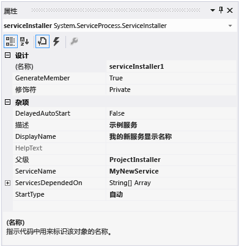

# <a name="walkthrough-create-a-windows-service-app"></a><span data-ttu-id="e5865-102">演练：创建 Windows 服务应用</span><span class="sxs-lookup"><span data-stu-id="e5865-102">Walkthrough: Create a Windows service app</span></span>

<span data-ttu-id="e5865-103">本文演示了如何在 Visual Studio 中创建可向事件日志中写入消息的简单 Windows 服务应用程序。</span><span class="sxs-lookup"><span data-stu-id="e5865-103">This article demonstrates how to create a simple Windows service app in Visual Studio that writes messages to an event log.</span></span>

## <a name="create-a-service"></a><span data-ttu-id="e5865-104">创建服务</span><span class="sxs-lookup"><span data-stu-id="e5865-104">Create a service</span></span>

<span data-ttu-id="e5865-105">首先，创建项目并设置服务正常运行所必需的值。</span><span class="sxs-lookup"><span data-stu-id="e5865-105">To begin, create the project and set values that are required for the service to function correctly.</span></span>

1. <span data-ttu-id="e5865-106">在 Visual Studio 中，在菜单栏上选择“文件” > “新建” > “项目”（或按 **Ctrl**+**Shift**+**N**）以打开“新建项目”对话框。</span><span class="sxs-lookup"><span data-stu-id="e5865-106">In Visual Studio, on the menu bar, choose **File** > **New** > **Project** (or press **Ctrl**+**Shift**+**N**) to open the **New Project** dialog.</span></span>

2. <span data-ttu-id="e5865-107">导航到并选择“Windows 服务”项目模板。</span><span class="sxs-lookup"><span data-stu-id="e5865-107">Navigate to and select the **Windows Service** project template.</span></span> <span data-ttu-id="e5865-108">展开“已安装”> [Visual C# 或 Visual Basic] >“Windows 桌面”，或在右上角的搜索框中键入“Windows 服务”。</span><span class="sxs-lookup"><span data-stu-id="e5865-108">Expand **Installed** > [**Visual C#** or **Visual Basic**] > **Windows Desktop**, or type **Windows Service** in the search box on the upper right.</span></span>

   

   > [!NOTE]
   > <span data-ttu-id="e5865-110">如果未看到“Windows 服务”模板，则可能需要安装“.NET 桌面开发”工作负荷。</span><span class="sxs-lookup"><span data-stu-id="e5865-110">If you don't see the **Windows Service** template, you may need to install the **.NET desktop development** workload.</span></span> <span data-ttu-id="e5865-111">在“新建项目”对话框中，单击左下角指示“打开 Visual Studio 安装程序”的链接。</span><span class="sxs-lookup"><span data-stu-id="e5865-111">In the **New Project** dialog, click the link that says **Open Visual Studio Installer** on the lower left.</span></span> <span data-ttu-id="e5865-112">在“Visual Studio 安装程序”中，选择“.NET 桌面开发”工作负荷，然后选择“修改”。</span><span class="sxs-lookup"><span data-stu-id="e5865-112">In **Visual Studio Installer**, select the **.NET desktop development** workload and then choose **Modify**.</span></span>

3. <span data-ttu-id="e5865-113">将项目命名为 **MyNewService**，然后选择“确定”。</span><span class="sxs-lookup"><span data-stu-id="e5865-113">Name the project **MyNewService**, and then choose **OK**.</span></span>

   <span data-ttu-id="e5865-114">项目模板包括从 <xref:System.ServiceProcess.ServiceBase?displayProperty=nameWithType> 继承的名为 `Service1` 的组件类。</span><span class="sxs-lookup"><span data-stu-id="e5865-114">The project template includes a component class named `Service1` that inherits from <xref:System.ServiceProcess.ServiceBase?displayProperty=nameWithType>.</span></span> <span data-ttu-id="e5865-115">它包括许多基本服务代码，例如用于启动服务的代码。</span><span class="sxs-lookup"><span data-stu-id="e5865-115">It includes much of the basic service code, such as the code to start the service.</span></span>

## <a name="rename-the-service"></a><span data-ttu-id="e5865-116">对服务进行重命名</span><span class="sxs-lookup"><span data-stu-id="e5865-116">Rename the service</span></span>

<span data-ttu-id="e5865-117">将服务从 **Service1** 重命名为 **MyNewService**。</span><span class="sxs-lookup"><span data-stu-id="e5865-117">Rename the service from **Service1** to **MyNewService**.</span></span>

1. <span data-ttu-id="e5865-118">在 Service1.cs（或 Service1.vb）的“设计”视图中，单击要切换到代码视图的链接。</span><span class="sxs-lookup"><span data-stu-id="e5865-118">In the **Design** view for Service1.cs (or Service1.vb), click the link to **switch to code view**.</span></span> <span data-ttu-id="e5865-119">右键单击 **Service1**，然后从上下文菜单中选择“重命名”。</span><span class="sxs-lookup"><span data-stu-id="e5865-119">Right-click on **Service1** and select **Rename** from the context menu.</span></span> <span data-ttu-id="e5865-120">输入 **MyNewService**，然后按 **Enter** 或单击“应用”。</span><span class="sxs-lookup"><span data-stu-id="e5865-120">Enter **MyNewService** and then press **Enter** or click **Apply**.</span></span>

2. <span data-ttu-id="e5865-121">在 **Service1.cs [Design]** 或 **Service1.vb [Design]** 的“属性”窗口中，将 **ServiceName** 值更改为 **MyNewService**。</span><span class="sxs-lookup"><span data-stu-id="e5865-121">In the **Properties** window for **Service1.cs [Design]** or **Service1.vb [Design]**, change the **ServiceName** value to **MyNewService**.</span></span>

3. <span data-ttu-id="e5865-122">在“解决方案资源管理器”中，将 **Service1.cs** 重命名为 **MyNewService.cs**，或将 **Service1.vb** 重命名为 **MyNewService.vb**。</span><span class="sxs-lookup"><span data-stu-id="e5865-122">In **Solution Explorer**, rename **Service1.cs** to **MyNewService.cs**, or rename **Service1.vb** to **MyNewService.vb**.</span></span>

## <a name="add-features-to-the-service"></a><span data-ttu-id="e5865-123">向服务添加功能</span><span class="sxs-lookup"><span data-stu-id="e5865-123">Add features to the service</span></span>

<span data-ttu-id="e5865-124">在本节中，你会添加自定义事件日志到 Windows 服务。</span><span class="sxs-lookup"><span data-stu-id="e5865-124">In this section, you add a custom event log to the Windows service.</span></span> <span data-ttu-id="e5865-125">事件日志与 Windows 服务没有任何形式的关联。</span><span class="sxs-lookup"><span data-stu-id="e5865-125">Event logs are not associated in any way with Windows services.</span></span> <span data-ttu-id="e5865-126">此处，<xref:System.Diagnostics.EventLog> 组件用作可以添加到 Windows 服务的组件类型的示例。</span><span class="sxs-lookup"><span data-stu-id="e5865-126">The <xref:System.Diagnostics.EventLog> component is used here as an example of the type of component you can add to a Windows service.</span></span>

### <a name="add-custom-event-log-functionality"></a><span data-ttu-id="e5865-127">添加自定义事件日志功能</span><span class="sxs-lookup"><span data-stu-id="e5865-127">Add custom event log functionality</span></span>

1. <span data-ttu-id="e5865-128">在 **“解决方案资源管理器”** 中，打开 **MyNewService.cs** 或 **MyNewService.vb**的上下文菜单，然后选择 **“查看设计器”**。</span><span class="sxs-lookup"><span data-stu-id="e5865-128">In **Solution Explorer**, open the context menu for **MyNewService.cs** or **MyNewService.vb**, and then choose **View Designer**.</span></span>

2. <span data-ttu-id="e5865-129">从 **工具箱** 的 **“组件”** 部分，将 <xref:System.Diagnostics.EventLog> 组件拖动到设计器中。</span><span class="sxs-lookup"><span data-stu-id="e5865-129">From the **Components** section of the **Toolbox**, drag an <xref:System.Diagnostics.EventLog> component to the designer.</span></span>

3. <span data-ttu-id="e5865-130">在 **“解决方案资源管理器”** 中，打开 **MyNewService.cs** 或 **MyNewService.vb**的上下文菜单，然后选择 **“查看代码”**。</span><span class="sxs-lookup"><span data-stu-id="e5865-130">In **Solution Explorer**, open the context menu for **MyNewService.cs** or **MyNewService.vb**, and then choose **View Code**.</span></span>

4. <span data-ttu-id="e5865-131">编辑构造函数以定义自定义事件日志：</span><span class="sxs-lookup"><span data-stu-id="e5865-131">Edit the constructor to define a custom event log:</span></span>

   ```csharp
   public MyNewService()
   {
        InitializeComponent();

        eventLog1 = new System.Diagnostics.EventLog();
        if (!System.Diagnostics.EventLog.SourceExists("MySource"))
        {
            System.Diagnostics.EventLog.CreateEventSource(
                "MySource", "MyNewLog");
        }
        eventLog1.Source = "MySource";
        eventLog1.Log = "MyNewLog";
    }
   ```

   [!code-vb[VbRadconService#2](../../../samples/snippets/visualbasic/VS_Snippets_VBCSharp/VbRadconService/VB/MyNewService.vb#2)]

### <a name="define-what-occurs-when-the-service-starts"></a><span data-ttu-id="e5865-132">定义服务启动时发生的情况</span><span class="sxs-lookup"><span data-stu-id="e5865-132">Define what occurs when the service starts</span></span>

<span data-ttu-id="e5865-133">在代码编辑器中，找到你创建项目时自动改写的 <xref:System.ServiceProcess.ServiceBase.OnStart%2A> 方法。</span><span class="sxs-lookup"><span data-stu-id="e5865-133">In the code editor, locate the <xref:System.ServiceProcess.ServiceBase.OnStart%2A> method that was automatically overridden when you created the project.</span></span> <span data-ttu-id="e5865-134">添加一行代码，以在服务启动时向事件日志写入一个条目：</span><span class="sxs-lookup"><span data-stu-id="e5865-134">Add a line of code that writes an entry to the event log when the service starts:</span></span>

[!code-csharp[VbRadconService#3](../../../samples/snippets/csharp/VS_Snippets_VBCSharp/VbRadconService/CS/MyNewService.cs#3)]
[!code-vb[VbRadconService#3](../../../samples/snippets/visualbasic/VS_Snippets_VBCSharp/VbRadconService/VB/MyNewService.vb#3)]

<span data-ttu-id="e5865-135">服务应用程序设计为长时间运行的，所以它通常轮询或监视系统中的情况。</span><span class="sxs-lookup"><span data-stu-id="e5865-135">A service application is designed to be long-running, so it usually polls or monitors something in the system.</span></span> <span data-ttu-id="e5865-136">监视是在 <xref:System.ServiceProcess.ServiceBase.OnStart%2A> 方法中设置的。</span><span class="sxs-lookup"><span data-stu-id="e5865-136">The monitoring is set up in the <xref:System.ServiceProcess.ServiceBase.OnStart%2A> method.</span></span> <span data-ttu-id="e5865-137">但是， <xref:System.ServiceProcess.ServiceBase.OnStart%2A> 实际上不进行监视。</span><span class="sxs-lookup"><span data-stu-id="e5865-137">However, <xref:System.ServiceProcess.ServiceBase.OnStart%2A> doesn’t actually do the monitoring.</span></span> <span data-ttu-id="e5865-138">服务的操作开始之后， <xref:System.ServiceProcess.ServiceBase.OnStart%2A> 方法必须返回到操作系统。</span><span class="sxs-lookup"><span data-stu-id="e5865-138">The <xref:System.ServiceProcess.ServiceBase.OnStart%2A> method must return to the operating system after the service's operation has begun.</span></span> <span data-ttu-id="e5865-139">它不能始终循环或阻止。</span><span class="sxs-lookup"><span data-stu-id="e5865-139">It must not loop forever or block.</span></span> <span data-ttu-id="e5865-140">若要设置简单的轮询机制，你可以使用 <xref:System.Timers.Timer?displayProperty=nameWithType> 组件，如下所示：在 <xref:System.ServiceProcess.ServiceBase.OnStart%2A> 方法中，在组件上设置参数，然后将 <xref:System.Timers.Timer.Enabled%2A> 属性设置为 `true`。</span><span class="sxs-lookup"><span data-stu-id="e5865-140">To set up a simple polling mechanism, you can use the <xref:System.Timers.Timer?displayProperty=nameWithType> component as follows: In the <xref:System.ServiceProcess.ServiceBase.OnStart%2A> method, set parameters on the component, and then set the <xref:System.Timers.Timer.Enabled%2A> property to `true`.</span></span> <span data-ttu-id="e5865-141">计时器定期在你的代码中引发事件，此时你的服务可以进行监视。</span><span class="sxs-lookup"><span data-stu-id="e5865-141">The timer raises events in your code periodically, at which time your service could do its monitoring.</span></span> <span data-ttu-id="e5865-142">你可以使用以下代码来执行该操作：</span><span class="sxs-lookup"><span data-stu-id="e5865-142">You can use the following code to do this:</span></span>

```csharp
// Set up a timer that triggers every minute.
System.Timers.Timer timer = new System.Timers.Timer();
timer.Interval = 60000; // 60 seconds
timer.Elapsed += new System.Timers.ElapsedEventHandler(this.OnTimer);
timer.Start();
```

```vb
' Set up a timer that triggers every minute.
Dim timer As System.Timers.Timer = New System.Timers.Timer()
timer.Interval = 60000 ' 60 seconds
AddHandler timer.Elapsed, AddressOf Me.OnTimer
timer.Start()
```

<span data-ttu-id="e5865-143">向类添加一个成员变量。</span><span class="sxs-lookup"><span data-stu-id="e5865-143">Add a member variable to the class.</span></span> <span data-ttu-id="e5865-144">它包含下一个要写入事件日志的事件的标识符。</span><span class="sxs-lookup"><span data-stu-id="e5865-144">It contains the identifier of the next event to write into the event log.</span></span>

```csharp
private int eventId = 1;
```

```vb
Private eventId As Integer = 1
```

<span data-ttu-id="e5865-145">添加新方法来处理计时器事件：</span><span class="sxs-lookup"><span data-stu-id="e5865-145">Add a new method to handle the timer event:</span></span>

```csharp
public void OnTimer(object sender, System.Timers.ElapsedEventArgs args)
{
    // TODO: Insert monitoring activities here.
    eventLog1.WriteEntry("Monitoring the System", EventLogEntryType.Information, eventId++);
}
```

```vb
Private Sub OnTimer(sender As Object, e As Timers.ElapsedEventArgs)
    ' TODO: Insert monitoring activities here.
    eventLog1.WriteEntry("Monitoring the System", EventLogEntryType.Information, eventId)
    eventId = eventId + 1
End Sub
```

<span data-ttu-id="e5865-146">你可能需要使用后台辅助线程来执行任务，而不是在主线程上运行所有工作。</span><span class="sxs-lookup"><span data-stu-id="e5865-146">You might want to perform tasks by using background worker threads instead of running all your work on the main thread.</span></span> <span data-ttu-id="e5865-147">有关更多信息，请参见<xref:System.ComponentModel.BackgroundWorker?displayProperty=fullName>。</span><span class="sxs-lookup"><span data-stu-id="e5865-147">For more information, see <xref:System.ComponentModel.BackgroundWorker?displayProperty=fullName>.</span></span>

### <a name="define-what-occurs-when-the-service-is-stopped"></a><span data-ttu-id="e5865-148">定义服务停止时发生的情况</span><span class="sxs-lookup"><span data-stu-id="e5865-148">Define what occurs when the service is stopped</span></span>

<span data-ttu-id="e5865-149">向 <xref:System.ServiceProcess.ServiceBase.OnStop%2A> 方法添加一行代码，以在服务停止时向事件日志添加一个条目：</span><span class="sxs-lookup"><span data-stu-id="e5865-149">Add a line of code to the <xref:System.ServiceProcess.ServiceBase.OnStop%2A> method that adds an entry to the event log when the service is stopped:</span></span>

```csharp
eventLog1.WriteEntry("In OnStop.");
```

[!code-vb[VbRadconService#4](../../../samples/snippets/visualbasic/VS_Snippets_VBCSharp/VbRadconService/VB/MyNewService.vb#4)]

### <a name="define-other-actions-for-the-service"></a><span data-ttu-id="e5865-150">定义服务的其他操作</span><span class="sxs-lookup"><span data-stu-id="e5865-150">Define other actions for the service</span></span>

<span data-ttu-id="e5865-151">可以重写 <xref:System.ServiceProcess.ServiceBase.OnPause%2A>、<xref:System.ServiceProcess.ServiceBase.OnContinue%2A> 和 <xref:System.ServiceProcess.ServiceBase.OnShutdown%2A> 方法来定义对组件的其他处理。</span><span class="sxs-lookup"><span data-stu-id="e5865-151">You can override the <xref:System.ServiceProcess.ServiceBase.OnPause%2A>, <xref:System.ServiceProcess.ServiceBase.OnContinue%2A>, and <xref:System.ServiceProcess.ServiceBase.OnShutdown%2A> methods to define additional processing for your component.</span></span> <span data-ttu-id="e5865-152">下列代码显示你可如何改写 <xref:System.ServiceProcess.ServiceBase.OnContinue%2A> 方法：</span><span class="sxs-lookup"><span data-stu-id="e5865-152">The following code shows how you can override the <xref:System.ServiceProcess.ServiceBase.OnContinue%2A> method:</span></span>

[!code-csharp[VbRadconService#5](../../../samples/snippets/csharp/VS_Snippets_VBCSharp/VbRadconService/CS/MyNewService.cs#5)]
[!code-vb[VbRadconService#5](../../../samples/snippets/visualbasic/VS_Snippets_VBCSharp/VbRadconService/VB/MyNewService.vb#5)]

<span data-ttu-id="e5865-153"><xref:System.Configuration.Install.Installer> 类安装 Windows 服务后，需要发生一些自定义操作。</span><span class="sxs-lookup"><span data-stu-id="e5865-153">Some custom actions have to occur when a Windows service is installed by the <xref:System.Configuration.Install.Installer> class.</span></span> <span data-ttu-id="e5865-154">Visual Studio 可以专门为 Windows 服务创建这些安装程序并将它们添加到项目中。</span><span class="sxs-lookup"><span data-stu-id="e5865-154">Visual Studio can create these installers specifically for a Windows service and add them to your project.</span></span>

## <a name="set-service-status"></a><span data-ttu-id="e5865-155">设置服务状态</span><span class="sxs-lookup"><span data-stu-id="e5865-155">Set service status</span></span>

<span data-ttu-id="e5865-156">服务向服务控制管理器报告其状态，以便用户可以判断服务是否运行正常。</span><span class="sxs-lookup"><span data-stu-id="e5865-156">Services report their status to the Service Control Manager, so that users can tell whether a service is functioning correctly.</span></span> <span data-ttu-id="e5865-157">默认情况下，从 <xref:System.ServiceProcess.ServiceBase> 继承的服务会报告有限的状态设置，包括已停止、已暂停和正在运行。</span><span class="sxs-lookup"><span data-stu-id="e5865-157">By default, services that inherit from <xref:System.ServiceProcess.ServiceBase> report a limited set of status settings, including Stopped, Paused, and Running.</span></span> <span data-ttu-id="e5865-158">如果服务启动所需的时间很短，则可能对报告“启动挂起”状态有帮助。</span><span class="sxs-lookup"><span data-stu-id="e5865-158">If a service takes a little while to start up, it might be helpful to report a Start Pending status.</span></span> <span data-ttu-id="e5865-159">也可通过添加调入 Windows [SetServiceStatus 函数](/windows/desktop/api/winsvc/nf-winsvc-setservicestatus)的代码来实现“启动挂起”和“停止挂起”状态设置。</span><span class="sxs-lookup"><span data-stu-id="e5865-159">You can also implement the Start Pending and Stop Pending status settings by adding code that calls into the Windows [SetServiceStatus function](/windows/desktop/api/winsvc/nf-winsvc-setservicestatus).</span></span>

<span data-ttu-id="e5865-160">实现服务挂起状态：</span><span class="sxs-lookup"><span data-stu-id="e5865-160">To implement service pending status:</span></span>

1. <span data-ttu-id="e5865-161">将 `using` 语句或 `Imports` 声明添加到 MyNewService.cs 或 MyNewService.vb 文件中的 <xref:System.Runtime.InteropServices?displayProperty=nameWithType> 命名空间：</span><span class="sxs-lookup"><span data-stu-id="e5865-161">Add a `using` statement or `Imports` declaration for the <xref:System.Runtime.InteropServices?displayProperty=nameWithType> namespace in the MyNewService.cs or MyNewService.vb file:</span></span>

    ```csharp
    using System.Runtime.InteropServices;
    ```

    ```vb
    Imports System.Runtime.InteropServices
    ```

2. <span data-ttu-id="e5865-162">添加以下代码到 MyNewService.cs 以声明 `ServiceState` 值和添加你将在平台调用中使用的状态结构：</span><span class="sxs-lookup"><span data-stu-id="e5865-162">Add the following code to MyNewService.cs to declare the `ServiceState` values and to add a structure for the status, which you'll use in a platform invoke call:</span></span>

    ```csharp
    public enum ServiceState
    {
        SERVICE_STOPPED = 0x00000001,
        SERVICE_START_PENDING = 0x00000002,
        SERVICE_STOP_PENDING = 0x00000003,
        SERVICE_RUNNING = 0x00000004,
        SERVICE_CONTINUE_PENDING = 0x00000005,
        SERVICE_PAUSE_PENDING = 0x00000006,
        SERVICE_PAUSED = 0x00000007,
    }

    [StructLayout(LayoutKind.Sequential)]
    public struct ServiceStatus
    {
        public int dwServiceType;
        public ServiceState dwCurrentState;
        public int dwControlsAccepted;
        public int dwWin32ExitCode;
        public int dwServiceSpecificExitCode;
        public int dwCheckPoint;
        public int dwWaitHint;
    };
    ```

    ```vb
    Public Enum ServiceState
        SERVICE_STOPPED = 1
        SERVICE_START_PENDING = 2
        SERVICE_STOP_PENDING = 3
        SERVICE_RUNNING = 4
        SERVICE_CONTINUE_PENDING = 5
        SERVICE_PAUSE_PENDING = 6
        SERVICE_PAUSED = 7
    End Enum

    <StructLayout(LayoutKind.Sequential)>
    Public Structure ServiceStatus
        Public dwServiceType As Long
        Public dwCurrentState As ServiceState
        Public dwControlsAccepted As Long
        Public dwWin32ExitCode As Long
        Public dwServiceSpecificExitCode As Long
        Public dwCheckPoint As Long
        Public dwWaitHint As Long
    End Structure
    ```

3. <span data-ttu-id="e5865-163">现在，在 `MyNewService` 类中，使用[平台调用](../interop/consuming-unmanaged-dll-functions.md)声明 [SetServiceStatus 函数](/windows/desktop/api/winsvc/nf-winsvc-setservicestatus)：</span><span class="sxs-lookup"><span data-stu-id="e5865-163">Now, in the `MyNewService` class, declare the [SetServiceStatus function](/windows/desktop/api/winsvc/nf-winsvc-setservicestatus) by using [platform invoke](../interop/consuming-unmanaged-dll-functions.md):</span></span>

    ```csharp
    [DllImport("advapi32.dll", SetLastError = true)]
    private static extern bool SetServiceStatus(System.IntPtr handle, ref ServiceStatus serviceStatus);
    ```

    ```vb
    Declare Auto Function SetServiceStatus Lib "advapi32.dll" (ByVal handle As IntPtr, ByRef serviceStatus As ServiceStatus) As Boolean
    ```

4. <span data-ttu-id="e5865-164">若要实现“启动挂起”状态，请添加下列代码到 <xref:System.ServiceProcess.ServiceBase.OnStart%2A> 方法的开头：</span><span class="sxs-lookup"><span data-stu-id="e5865-164">To implement the Start Pending status, add the following code to the beginning of the <xref:System.ServiceProcess.ServiceBase.OnStart%2A> method:</span></span>

    ```csharp
    // Update the service state to Start Pending.
    ServiceStatus serviceStatus = new ServiceStatus();
    serviceStatus.dwCurrentState = ServiceState.SERVICE_START_PENDING;
    serviceStatus.dwWaitHint = 100000;
    SetServiceStatus(this.ServiceHandle, ref serviceStatus);
    ```

    ```vb
    ' Update the service state to Start Pending.
    Dim serviceStatus As ServiceStatus = New ServiceStatus()
    serviceStatus.dwCurrentState = ServiceState.SERVICE_START_PENDING
    serviceStatus.dwWaitHint = 100000
    SetServiceStatus(Me.ServiceHandle, serviceStatus)
    ```

5. <span data-ttu-id="e5865-165">在 <xref:System.ServiceProcess.ServiceBase.OnStart%2A> 方法的末尾添加代码以将状态设置为“正在运行”。</span><span class="sxs-lookup"><span data-stu-id="e5865-165">Add code to set the status to Running at the end of the <xref:System.ServiceProcess.ServiceBase.OnStart%2A> method.</span></span>

    ```csharp
    // Update the service state to Running.
    serviceStatus.dwCurrentState = ServiceState.SERVICE_RUNNING;
    SetServiceStatus(this.ServiceHandle, ref serviceStatus);
    ```

    ```vb
    ' Update the service state to Running.
    serviceStatus.dwCurrentState = ServiceState.SERVICE_RUNNING
    SetServiceStatus(Me.ServiceHandle, serviceStatus)
    ```

6. <span data-ttu-id="e5865-166">（可选）针对 <xref:System.ServiceProcess.ServiceBase.OnStop%2A> 方法重复此过程。</span><span class="sxs-lookup"><span data-stu-id="e5865-166">(Optional) Repeat this procedure for the <xref:System.ServiceProcess.ServiceBase.OnStop%2A> method.</span></span>

> [!NOTE]
> <span data-ttu-id="e5865-167">[服务控制管理器](/windows/desktop/Services/service-control-manager)使用 [SERVICE_STATUS 结构](/windows/desktop/api/winsvc/ns-winsvc-_service_status)的 `dwWaitHint` 和 `dwCheckpoint` 成员来确定等待 Windows 服务启动或关闭所需的时间。</span><span class="sxs-lookup"><span data-stu-id="e5865-167">The [Service Control Manager](/windows/desktop/Services/service-control-manager) uses the `dwWaitHint` and `dwCheckpoint` members of the [SERVICE_STATUS structure](/windows/desktop/api/winsvc/ns-winsvc-_service_status) to determine how much time to wait for a Windows service to start or shut down.</span></span> <span data-ttu-id="e5865-168">如果你的 <xref:System.ServiceProcess.ServiceBase.OnStart%2A> 和 <xref:System.ServiceProcess.ServiceBase.OnStop%2A> 方法运行时间较长，服务可以使用递增的 `dwCheckPoint` 值再次调用 [SetServiceStatus](/windows/desktop/api/winsvc/nf-winsvc-setservicestatus) 来请求更多时间。</span><span class="sxs-lookup"><span data-stu-id="e5865-168">If your <xref:System.ServiceProcess.ServiceBase.OnStart%2A> and <xref:System.ServiceProcess.ServiceBase.OnStop%2A> methods run long, your service can request more time by calling [SetServiceStatus](/windows/desktop/api/winsvc/nf-winsvc-setservicestatus) again with an incremented `dwCheckPoint` value.</span></span>

## <a name="add-installers-to-the-service"></a><span data-ttu-id="e5865-169">向服务添加安装程序</span><span class="sxs-lookup"><span data-stu-id="e5865-169">Add installers to the service</span></span>

<span data-ttu-id="e5865-170">你需要先安装 Windows 服务然后才能运行，这会将其注册到服务控制管理器。</span><span class="sxs-lookup"><span data-stu-id="e5865-170">Before you can run a Windows service, you need to install it, which registers it with the Service Control Manager.</span></span> <span data-ttu-id="e5865-171">你可以将安装程序添加到处理注册详细信息的项目。</span><span class="sxs-lookup"><span data-stu-id="e5865-171">You can add installers to your project that handle the registration details.</span></span>

1. <span data-ttu-id="e5865-172">在 **“解决方案资源管理器”** 中，打开 **MyNewService.cs** 或 **MyNewService.vb**的上下文菜单，然后选择 **“查看设计器”**。</span><span class="sxs-lookup"><span data-stu-id="e5865-172">In **Solution Explorer**, open the context menu for **MyNewService.cs** or **MyNewService.vb**, and then choose **View Designer**.</span></span>

2. <span data-ttu-id="e5865-173">单击设计器的背景以选择服务本身，而不是它的任何内容。</span><span class="sxs-lookup"><span data-stu-id="e5865-173">Click the background of the designer to select the service itself, instead of any of its contents.</span></span>

3. <span data-ttu-id="e5865-174">打开设计器窗口的上下文菜单（如果使用指针设备，在窗口中右键单击），然后选择 **“添加安装程序”**。</span><span class="sxs-lookup"><span data-stu-id="e5865-174">Open the context menu for the designer window (if you’re using a pointing device, right-click inside the window), and then choose **Add Installer**.</span></span>

   <span data-ttu-id="e5865-175">默认情况下，向你的项目添加一个包含两个安装程序的组件类。</span><span class="sxs-lookup"><span data-stu-id="e5865-175">By default, a component class that contains two installers is added to your project.</span></span> <span data-ttu-id="e5865-176">将该组件命名为 **ProjectInstaller**，它包含的安装程序分别是服务的安装程序和服务关联进程的安装程序。</span><span class="sxs-lookup"><span data-stu-id="e5865-176">The component is named **ProjectInstaller**, and the installers it contains are the installer for your service and the installer for the service's associated process.</span></span>

4. <span data-ttu-id="e5865-177">在 **ProjectInstaller** 的 **“设计”** 视图中，选择 **serviceInstaller1** （对于 Visual C# 项目）或 **ServiceInstaller1** （对于 Visual Basic 项目）。</span><span class="sxs-lookup"><span data-stu-id="e5865-177">In **Design** view for **ProjectInstaller**, choose **serviceInstaller1** for a Visual C# project, or **ServiceInstaller1** for a Visual Basic project.</span></span>

5. <span data-ttu-id="e5865-178">在“属性”  窗口中，确保 <xref:System.ServiceProcess.ServiceInstaller.ServiceName%2A> 属性已设置为 **MyNewService**。</span><span class="sxs-lookup"><span data-stu-id="e5865-178">In the **Properties** window, make sure the <xref:System.ServiceProcess.ServiceInstaller.ServiceName%2A> property is set to **MyNewService**.</span></span>

6. <span data-ttu-id="e5865-179">将 **“描述”** 属性设置为一些文本，比如“示例服务”。</span><span class="sxs-lookup"><span data-stu-id="e5865-179">Set the **Description** property to some text, such as "A sample service".</span></span> <span data-ttu-id="e5865-180">该文本会显示在“服务”窗口中，帮助用户标识服务并理解其用处。</span><span class="sxs-lookup"><span data-stu-id="e5865-180">This text appears in the Services window and helps the user identify the service and understand what it’s used for.</span></span>

7. <span data-ttu-id="e5865-181">在 <xref:System.ServiceProcess.ServiceInstaller.DisplayName%2A> “名称” **列中将** 属性设置为你想要显示在“服务”窗口中的文本。</span><span class="sxs-lookup"><span data-stu-id="e5865-181">Set the <xref:System.ServiceProcess.ServiceInstaller.DisplayName%2A> property to the text that you want to appear in the Services window in the **Name** column.</span></span> <span data-ttu-id="e5865-182">例如，你可以输入“MyNewService 显示名称”。</span><span class="sxs-lookup"><span data-stu-id="e5865-182">For example, you can enter "MyNewService Display Name".</span></span> <span data-ttu-id="e5865-183">该名称可以不同于 <xref:System.ServiceProcess.ServiceInstaller.ServiceName%2A> 属性，它是系统使用的名称（例如，当你使用 `net start` 命令启动服务时）。</span><span class="sxs-lookup"><span data-stu-id="e5865-183">This name can be different from the <xref:System.ServiceProcess.ServiceInstaller.ServiceName%2A> property, which is the name used by the system (for example, when you use the `net start` command to start your service).</span></span>

8. <span data-ttu-id="e5865-184">将 <xref:System.ServiceProcess.ServiceInstaller.StartType%2A> 属性设置为 <xref:System.ServiceProcess.ServiceStartMode.Automatic>。</span><span class="sxs-lookup"><span data-stu-id="e5865-184">Set the <xref:System.ServiceProcess.ServiceInstaller.StartType%2A> property to <xref:System.ServiceProcess.ServiceStartMode.Automatic>.</span></span>

     <span data-ttu-id="e5865-185"></span><span class="sxs-lookup"><span data-stu-id="e5865-185"></span></span>

9. <span data-ttu-id="e5865-186">在设计器中，选择 **serviceProcessInstaller1** （对于 Visual C# 项目）或 **ServiceProcessInstaller1** （对于 Visual Basic 项目）。</span><span class="sxs-lookup"><span data-stu-id="e5865-186">In the designer, choose **serviceProcessInstaller1** for a Visual C# project, or **ServiceProcessInstaller1** for a Visual Basic project.</span></span> <span data-ttu-id="e5865-187">将 <xref:System.ServiceProcess.ServiceProcessInstaller.Account%2A> 属性设置为 <xref:System.ServiceProcess.ServiceAccount.LocalSystem>。</span><span class="sxs-lookup"><span data-stu-id="e5865-187">Set the <xref:System.ServiceProcess.ServiceProcessInstaller.Account%2A> property to <xref:System.ServiceProcess.ServiceAccount.LocalSystem>.</span></span> <span data-ttu-id="e5865-188">这会导致安装该服务并使用本地系统帐户运行服务。</span><span class="sxs-lookup"><span data-stu-id="e5865-188">This causes the service to be installed and to run using the local system account.</span></span>

    > [!IMPORTANT]
    > <span data-ttu-id="e5865-189"><xref:System.ServiceProcess.ServiceAccount.LocalSystem> 帐户具有广泛的权限，包括能够写入事件日志。</span><span class="sxs-lookup"><span data-stu-id="e5865-189">The <xref:System.ServiceProcess.ServiceAccount.LocalSystem> account has broad permissions, including the ability to write to the event log.</span></span> <span data-ttu-id="e5865-190">使用此帐户时要特别小心，因为它会增加你受到恶意软件攻击的风险。</span><span class="sxs-lookup"><span data-stu-id="e5865-190">Use this account with caution, because it might increase your risk of attacks from malicious software.</span></span> <span data-ttu-id="e5865-191">对于其他任务，请考虑使用 <xref:System.ServiceProcess.ServiceAccount.LocalService> 帐户，该帐户用作本地计算机上的非特权用户，并向任意远程服务器提供匿名凭据。</span><span class="sxs-lookup"><span data-stu-id="e5865-191">For other tasks, consider using the <xref:System.ServiceProcess.ServiceAccount.LocalService> account, which acts as a non-privileged user on the local computer and presents anonymous credentials to any remote server.</span></span> <span data-ttu-id="e5865-192">如果你尝试使用 <xref:System.ServiceProcess.ServiceAccount.LocalService> 账户，此例子将失败，因为它需要写入事件日志的权限。</span><span class="sxs-lookup"><span data-stu-id="e5865-192">This example fails if you try to use the <xref:System.ServiceProcess.ServiceAccount.LocalService> account, because it needs permission to write to the event log.</span></span>

<span data-ttu-id="e5865-193">有关安装程序的详细信息，请参阅[如何：将安装程序添加到服务应用程序](../../../docs/framework/windows-services/how-to-add-installers-to-your-service-application.md)。</span><span class="sxs-lookup"><span data-stu-id="e5865-193">For more information about installers, see [How to: Add Installers to Your service Application](../../../docs/framework/windows-services/how-to-add-installers-to-your-service-application.md).</span></span>

## <a name="optional-set-startup-parameters"></a><span data-ttu-id="e5865-194">（可选）设置启动参数</span><span class="sxs-lookup"><span data-stu-id="e5865-194">(Optional) Set startup parameters</span></span>

<span data-ttu-id="e5865-195">Windows 服务像任何其他可执行文件一样，可以接受命令行参数或启动参数。</span><span class="sxs-lookup"><span data-stu-id="e5865-195">A Windows service, like any other executable, can accept command-line arguments, or startup parameters.</span></span> <span data-ttu-id="e5865-196">添加代码到进程启动参数后，用户可以使用 Windows 控制面板中的“服务”窗口，用他们自己的自定义启动参数启动你的服务。</span><span class="sxs-lookup"><span data-stu-id="e5865-196">When you add code to process startup parameters, users can start your service with their own custom startup parameters by using the Services window in the Windows Control Panel.</span></span> <span data-ttu-id="e5865-197">但是，这些启动参数不会保留到下一次服务启动。</span><span class="sxs-lookup"><span data-stu-id="e5865-197">However, these startup parameters are not persisted the next time the service starts.</span></span> <span data-ttu-id="e5865-198">若要永久性设置启动参数，你可以按此步骤所示，在注册表中对它们进行设置。</span><span class="sxs-lookup"><span data-stu-id="e5865-198">To set startup parameters permanently, you can set them in the registry, as shown in this procedure.</span></span>

> [!NOTE]
> <span data-ttu-id="e5865-199">在你决定添加启动参数前，考虑这是否是向你的服务传递信息的最好办法。</span><span class="sxs-lookup"><span data-stu-id="e5865-199">Before you decide to add startup parameters, consider whether that is the best way to pass information to your service.</span></span> <span data-ttu-id="e5865-200">虽然启动参数易于使用和分析，而且用户可以轻松地改写它们，但是如果没有相关的文档说明，用户可能较难发现和使用它们。</span><span class="sxs-lookup"><span data-stu-id="e5865-200">Although startup parameters are easy to use and to parse, and users can easily override them, they might be harder for users to discover and use without documentation.</span></span> <span data-ttu-id="e5865-201">通常情况下，如果你的服务需要不止几个启动参数，你应该考虑改为使用注册表或配置文件。</span><span class="sxs-lookup"><span data-stu-id="e5865-201">Generally, if your service requires more than just a few startup parameters, you should consider using the registry or a configuration file instead.</span></span> <span data-ttu-id="e5865-202">每个 Windows 服务都在 **HKLM\System\CurrentControlSet\services** 下有注册表项。</span><span class="sxs-lookup"><span data-stu-id="e5865-202">Every Windows service has an entry in the registry under **HKLM\System\CurrentControlSet\services**.</span></span> <span data-ttu-id="e5865-203">在服务的项下，你可以使用 **“参数”** 子项存储你的服务能访问的信息。</span><span class="sxs-lookup"><span data-stu-id="e5865-203">Under the service's key, you can use the **Parameters** subkey to store information that your service can access.</span></span> <span data-ttu-id="e5865-204">你可以使用 Windows 服务的应用程序配置文件，与使用其他类型的程序一样。</span><span class="sxs-lookup"><span data-stu-id="e5865-204">You can use application configuration files for a Windows service the same way you do for other types of programs.</span></span> <span data-ttu-id="e5865-205">有关示例代码，请参阅 <xref:System.Configuration.ConfigurationManager.AppSettings%2A>。</span><span class="sxs-lookup"><span data-stu-id="e5865-205">For example code, see <xref:System.Configuration.ConfigurationManager.AppSettings%2A>.</span></span>

<span data-ttu-id="e5865-206">添加启动参数：</span><span class="sxs-lookup"><span data-stu-id="e5865-206">To add startup parameters:</span></span>

1. <span data-ttu-id="e5865-207">在 Program.cs 或 MyNewService.Designer.vb 的 `Main` 方法中，添加要传递到服务构造函数的输入参数：</span><span class="sxs-lookup"><span data-stu-id="e5865-207">In the `Main` method in Program.cs or in MyNewService.Designer.vb, add an input parameter to pass to the service constructor:</span></span>

   ```csharp
   static void Main(string[] args)
   {
       ServiceBase[] ServicesToRun;
       ServicesToRun = new ServiceBase[]
       {
           new MyNewService(args)
       };
       ServiceBase.Run(ServicesToRun);
   }
   ```

   ```vb
   Shared Sub Main(ByVal cmdArgs() As String)
       Dim ServicesToRun() As System.ServiceProcess.ServiceBase = New System.ServiceProcess.ServiceBase() {New MyNewServiceVB(cmdArgs)}
       System.ServiceProcess.ServiceBase.Run(ServicesToRun)
   End Sub
   ```

2. <span data-ttu-id="e5865-208">按如下所示更改 `MyNewService` 构造函数：</span><span class="sxs-lookup"><span data-stu-id="e5865-208">Change the `MyNewService` constructor as follows:</span></span>

   ```csharp
   public MyNewService(string[] args)
   {
       InitializeComponent();

        string eventSourceName = "MySource";
        string logName = "MyNewLog";

        if (args.Length > 0)
        {
            eventSourceName = args[0];
        }

        if (args.Length > 1)
        {
            logName = args[1];
        }

        eventLog1 = new System.Diagnostics.EventLog();

        if (!System.Diagnostics.EventLog.SourceExists(eventSourceName))
        {
            System.Diagnostics.EventLog.CreateEventSource(eventSourceName, logName);
        }

        eventLog1.Source = eventSourceName;
        eventLog1.Log = logName;
   }
   ```

   ```vb
   Public Sub New(ByVal cmdArgs() As String)
       InitializeComponent()
       Dim eventSourceName As String = "MySource"
       Dim logName As String = "MyNewLog"
       If (cmdArgs.Count() > 0) Then
           eventSourceName = cmdArgs(0)
       End If
       If (cmdArgs.Count() > 1) Then
           logName = cmdArgs(1)
       End If
       eventLog1 = New System.Diagnostics.EventLog()
       If (Not System.Diagnostics.EventLog.SourceExists(eventSourceName)) Then
           System.Diagnostics.EventLog.CreateEventSource(eventSourceName, logName)
       End If
       eventLog1.Source = eventSourceName
       eventLog1.Log = logName
   End Sub
   ```

   <span data-ttu-id="e5865-209">此代码根据提供的启动参数设置事件源和日志名称，或者如果没有提供参数就使用默认值。</span><span class="sxs-lookup"><span data-stu-id="e5865-209">This code sets the event source and log name according to the supplied startup parameters, or uses default values if no arguments are supplied.</span></span>

3. <span data-ttu-id="e5865-210">若要指定命令行参数，请将下列代码添加到 ProjectInstaller.cs 或 ProjectInstaller.vb 的 `ProjectInstaller` 类中：</span><span class="sxs-lookup"><span data-stu-id="e5865-210">To specify the command-line arguments, add the following code to the `ProjectInstaller` class in ProjectInstaller.cs or ProjectInstaller.vb:</span></span>

   ```csharp
   protected override void OnBeforeInstall(IDictionary savedState)
   {
       string parameter = "MySource1\" \"MyLogFile1";
       Context.Parameters["assemblypath"] = "\"" + Context.Parameters["assemblypath"] + "\" \"" + parameter + "\"";
       base.OnBeforeInstall(savedState);
   }
   ```

   ```vb
   Protected Overrides Sub OnBeforeInstall(ByVal savedState As IDictionary)
       Dim parameter As String = "MySource1"" ""MyLogFile1"
       Context.Parameters("assemblypath") = """" + Context.Parameters("assemblypath") + """ """ + parameter + """"
       MyBase.OnBeforeInstall(savedState)
   End Sub
   ```

   <span data-ttu-id="e5865-211">此代码会通过添加默认参数值修改 **ImagePath** 注册表项，该注册表项通常包含 Windows 服务可执行文件的完整路径。</span><span class="sxs-lookup"><span data-stu-id="e5865-211">This code modifies the **ImagePath** registry key, which typically contains the full path to the executable for the Windows service, by adding the default parameter values.</span></span> <span data-ttu-id="e5865-212">要正常启动服务需要使用引号将路径括起来（包围括住每个参数）。</span><span class="sxs-lookup"><span data-stu-id="e5865-212">The quotation marks around the path (and around each individual parameter) are required for the service to start up correctly.</span></span> <span data-ttu-id="e5865-213">若要更改该 Windows 服务的启动参数，用户可以更改 **ImagePath** 注册表项中给定的参数，然而更好的方式是以编程方式对其进行更改，并以友好的方式（例如，在管理或配置实用工具中）向用户公开功能。</span><span class="sxs-lookup"><span data-stu-id="e5865-213">To change the startup parameters for this Windows service, users can change the parameters given in the **ImagePath** registry key, although the better way is to change it programmatically and expose the functionality to users in a friendly way (for example, in a management or configuration utility).</span></span>

## <a name="build-the-service"></a><span data-ttu-id="e5865-214">生成服务</span><span class="sxs-lookup"><span data-stu-id="e5865-214">Build the service</span></span>

1. <span data-ttu-id="e5865-215">在 **“解决方案资源管理器”** 中，打开项目的上下文菜单，然后选择 **“属性”**。</span><span class="sxs-lookup"><span data-stu-id="e5865-215">In **Solution Explorer**, open the context menu for your project, and then choose **Properties**.</span></span>

   <span data-ttu-id="e5865-216">项目的属性页面会显示出来。</span><span class="sxs-lookup"><span data-stu-id="e5865-216">The property pages for your project appear.</span></span>

2. <span data-ttu-id="e5865-217">在“应用程序”选项卡上，在“启动对象”列表中，选择 **MyNewService.Program**。</span><span class="sxs-lookup"><span data-stu-id="e5865-217">On the **Application** tab, in the **Startup object** list, choose **MyNewService.Program**.</span></span>

3. <span data-ttu-id="e5865-218">在“解决方案资源管理器”中，打开项目的上下文菜单，然后选择“生成”以生成项目（或按 **Ctrl**+**Shift**+**B**）。</span><span class="sxs-lookup"><span data-stu-id="e5865-218">In **Solution Explorer**, open the context menu for your project, and then choose **Build** to build the project (or press **Ctrl**+**Shift**+**B**).</span></span>

## <a name="install-the-service"></a><span data-ttu-id="e5865-219">安装服务</span><span class="sxs-lookup"><span data-stu-id="e5865-219">Install the service</span></span>

<span data-ttu-id="e5865-220">由于已经生成了 Windows 服务，你现在可以安装它。</span><span class="sxs-lookup"><span data-stu-id="e5865-220">Now that you've built the Windows service, you can install it.</span></span> <span data-ttu-id="e5865-221">若要安装 Windows 服务，你必须在要安装此服务的计算机上拥有管理员凭据。</span><span class="sxs-lookup"><span data-stu-id="e5865-221">To install a Windows service, you must have administrator credentials on the computer on which you're installing it.</span></span>

1. <span data-ttu-id="e5865-222">使用管理凭据打开“Visual Studio 开发人员命令提示”。</span><span class="sxs-lookup"><span data-stu-id="e5865-222">Open **Developer Command Prompt for Visual Studio** with administrative credentials.</span></span> <span data-ttu-id="e5865-223">如果使用鼠标，在 Windows“开始”菜单中右键单击“VS 2017 开发人员命令提示”，然后选择“更多” > “以管理员身份运行”。</span><span class="sxs-lookup"><span data-stu-id="e5865-223">If you’re using a mouse, right-click on **Developer Command Prompt for VS 2017** in the Windows Start menu, and then choose **More** > **Run as Administrator**.</span></span>

2. <span data-ttu-id="e5865-224">在“开发人员命令提示”窗口中，导航到包含项目输出的文件夹（默认情况下，它是项目的 *\bin\Debug* 子目录）。</span><span class="sxs-lookup"><span data-stu-id="e5865-224">In the **Developer Command Prompt** window, navigate to the folder that contains your project's output (by default, it's the *\bin\Debug* subdirectory of your project).</span></span>

3. <span data-ttu-id="e5865-225">输入以下命令：</span><span class="sxs-lookup"><span data-stu-id="e5865-225">Enter the following command:</span></span>

    ```shell
    installutil.exe MyNewService.exe
    ```

    <span data-ttu-id="e5865-226">如果服务成功安装，**installutil.exe** 将报告成功。</span><span class="sxs-lookup"><span data-stu-id="e5865-226">If the service installs successfully, **installutil.exe** reports success.</span></span> <span data-ttu-id="e5865-227">如果系统找不到 **InstallUtil.exe**，请确保它存在于你的计算机上。</span><span class="sxs-lookup"><span data-stu-id="e5865-227">If the system could not find **InstallUtil.exe**, make sure that it exists on your computer.</span></span> <span data-ttu-id="e5865-228">此工具随 .NET Framework 安装在 *%windir%\Microsoft.NET\Framework[64]\\[framework version]* 文件夹下。</span><span class="sxs-lookup"><span data-stu-id="e5865-228">This tool is installed with the .NET Framework to the folder *%windir%\Microsoft.NET\Framework[64]\\[framework version]*.</span></span> <span data-ttu-id="e5865-229">例如，32 位版本的默认路径是 *%windir%\Microsoft.NET\Framework\v4.0.30319\InstallUtil.exe*。</span><span class="sxs-lookup"><span data-stu-id="e5865-229">For example, the default path for the 32-bit version is *%windir%\Microsoft.NET\Framework\v4.0.30319\InstallUtil.exe*.</span></span>

    <span data-ttu-id="e5865-230">如果 **installutil.exe** 进程报告失败，请查看安装日志以找出原因。</span><span class="sxs-lookup"><span data-stu-id="e5865-230">If the **installutil.exe** process reports failure, check the install log to find out why.</span></span> <span data-ttu-id="e5865-231">默认情况下，该日志与服务可执行文件位于同一文件夹中。</span><span class="sxs-lookup"><span data-stu-id="e5865-231">By default the log is in the same folder as the service executable.</span></span> <span data-ttu-id="e5865-232">如果 `ProjectInstaller` 类上不存在 <xref:System.ComponentModel.RunInstallerAttribute> 类、该属性未设置为 **true**，或者 `ProjectInstaller` 类不标记为 **public**，则安装可能失败。</span><span class="sxs-lookup"><span data-stu-id="e5865-232">The installation can fail if  the <xref:System.ComponentModel.RunInstallerAttribute> Class is not present on the `ProjectInstaller` class, if the attribute is not set to **true**, or if the `ProjectInstaller` class is not marked **public**.</span></span>

<span data-ttu-id="e5865-233">有关详细信息，请参阅[如何：安装和卸载服务](../../../docs/framework/windows-services/how-to-install-and-uninstall-services.md)。</span><span class="sxs-lookup"><span data-stu-id="e5865-233">For more information, see [How to: Install and Uninstall Services](../../../docs/framework/windows-services/how-to-install-and-uninstall-services.md).</span></span>

## <a name="start-and-run-the-service"></a><span data-ttu-id="e5865-234">启动并运行服务</span><span class="sxs-lookup"><span data-stu-id="e5865-234">Start and run the service</span></span>

1. <span data-ttu-id="e5865-235">在 Windows 中，打开“服务”桌面应用程序。</span><span class="sxs-lookup"><span data-stu-id="e5865-235">In Windows, open the **Services** desktop app.</span></span> <span data-ttu-id="e5865-236">按 **Windows**+**R** 以打开“运行”框，然后输入 **services.msc** 并按 **Enter** 或单击“确定”。</span><span class="sxs-lookup"><span data-stu-id="e5865-236">Press **Windows**+**R** to open the **Run** box, and then enter **services.msc** and press **Enter** or click **OK**.</span></span>

     <span data-ttu-id="e5865-237">你会看到“服务”中列出的服务按其设置的显示名称的字母顺序显示。</span><span class="sxs-lookup"><span data-stu-id="e5865-237">You should see your service listed in **Services**, displayed alphabetically by the display name that you set for it.</span></span>

     

2. <span data-ttu-id="e5865-239">在“服务”中，打开服务快捷菜单，然后选择“启动”。</span><span class="sxs-lookup"><span data-stu-id="e5865-239">In **Services**, open the shortcut menu for your service, and then choose **Start**.</span></span>

3. <span data-ttu-id="e5865-240">要停止服务，打开服务快捷菜单，然后选择“停止”。</span><span class="sxs-lookup"><span data-stu-id="e5865-240">To stop the service, open the shortcut menu for the service, and then choose **Stop**.</span></span>

4. <span data-ttu-id="e5865-241">（可选）你可以在命令行中使用 `net start ServiceName` 和 `net stop ServiceName` 命令来启动和停止服务。</span><span class="sxs-lookup"><span data-stu-id="e5865-241">(Optional) From the command line, you can use the commands `net start ServiceName` and `net stop ServiceName` to start and stop your service.</span></span>

### <a name="verify-the-event-log-output-of-your-service"></a><span data-ttu-id="e5865-242">验证服务的事件日志输出</span><span class="sxs-lookup"><span data-stu-id="e5865-242">Verify the event log output of your service</span></span>

1. <span data-ttu-id="e5865-243">通过开始在 Windows 任务栏上的搜索框中键入“事件查看器”并从搜索结果中选择“事件查看器”来打开“事件查看器”。</span><span class="sxs-lookup"><span data-stu-id="e5865-243">Open **Event Viewer** by starting to type **Event Viewer** in the search box on the Windows task bar, and then selecting **Event Viewer** from the search results.</span></span>

   > [!TIP]
   > <span data-ttu-id="e5865-244">在 Visual Studio 中，若要访问事件日志，可以打开“服务器资源管理器”（键盘：Ctrl+Alt+S），然后展开本地计算机的“事件日志”节点。</span><span class="sxs-lookup"><span data-stu-id="e5865-244">In Visual Studio, you can access event logs by opening **Server Explorer** (Keyboard: **Ctrl**+**Alt**+**S**) and expanding the **Event Logs** node for the local computer.</span></span>

2. <span data-ttu-id="e5865-245">在“事件查看器”中，展开“应用程序和服务日志”。</span><span class="sxs-lookup"><span data-stu-id="e5865-245">In **Event Viewer**, expand **Applications and Services Logs**.</span></span>

3. <span data-ttu-id="e5865-246">找到 **MyNewLog**（或 **MyLogFile1**，如果你使用了可选步骤来添加命令行参数）列表并将它展开。</span><span class="sxs-lookup"><span data-stu-id="e5865-246">Locate the listing for **MyNewLog** (or **MyLogFile1**, if you followed the optional procedure to add command-line arguments) and expand it.</span></span> <span data-ttu-id="e5865-247">你会看到你的服务所执行的两个操作（启动和停止）的条目。</span><span class="sxs-lookup"><span data-stu-id="e5865-247">You should see entries for the two actions (start and stop) that your service performed.</span></span>

     

## <a name="uninstall-the-service"></a><span data-ttu-id="e5865-249">卸载服务</span><span class="sxs-lookup"><span data-stu-id="e5865-249">Uninstall the service</span></span>

1. <span data-ttu-id="e5865-250">使用管理凭据打开“Visual Studio 开发人员命令提示”。</span><span class="sxs-lookup"><span data-stu-id="e5865-250">Open **Developer Command Prompt for Visual Studio** with administrative credentials.</span></span>

2. <span data-ttu-id="e5865-251">在命令提示窗口中，导航到包含项目输出的文件夹。</span><span class="sxs-lookup"><span data-stu-id="e5865-251">In the command prompt window, navigate to the folder that contains your project's output.</span></span>

3. <span data-ttu-id="e5865-252">输入以下命令：</span><span class="sxs-lookup"><span data-stu-id="e5865-252">Enter the following command:</span></span>

    ```shell
    installutil.exe /u MyNewService.exe
    ```

   <span data-ttu-id="e5865-253">如果服务成功卸载，**installutil.exe** 将报告已成功移除服务。</span><span class="sxs-lookup"><span data-stu-id="e5865-253">If the service uninstalls successfully, **installutil.exe** reports that your service was successfully removed.</span></span> <span data-ttu-id="e5865-254">有关详细信息，请参阅[如何：安装和卸载服务](../../../docs/framework/windows-services/how-to-install-and-uninstall-services.md)。</span><span class="sxs-lookup"><span data-stu-id="e5865-254">For more information, see [How to: Install and Uninstall Services](../../../docs/framework/windows-services/how-to-install-and-uninstall-services.md).</span></span>

## <a name="next-steps"></a><span data-ttu-id="e5865-255">后续步骤</span><span class="sxs-lookup"><span data-stu-id="e5865-255">Next steps</span></span>

<span data-ttu-id="e5865-256">创建服务后，你可能希望创建一个独立安装程序，以供其他人安装你的 Windows 服务。</span><span class="sxs-lookup"><span data-stu-id="e5865-256">Now that you've created the service, you might want to create a standalone setup program that others can use to install your Windows service.</span></span> <span data-ttu-id="e5865-257">ClickOnce 不支持 Windows 服务，但你可以使用 [WiX 工具集](http://wixtoolset.org/)为 Windows 服务创建安装程序。</span><span class="sxs-lookup"><span data-stu-id="e5865-257">ClickOnce doesn't support Windows services, but you can use the [WiX Toolset](http://wixtoolset.org/) to create an installer for a Windows service.</span></span> <span data-ttu-id="e5865-258">有关其他提示，请参阅[创建安装程序包](/visualstudio/deployment/deploying-applications-services-and-components#create-an-installer-package-windows-desktop)。</span><span class="sxs-lookup"><span data-stu-id="e5865-258">For other ideas, see [Create an installer package](/visualstudio/deployment/deploying-applications-services-and-components#create-an-installer-package-windows-desktop).</span></span>

<span data-ttu-id="e5865-259">你可能会探索 <xref:System.ServiceProcess.ServiceController> 组件的用法，以便将命令发送到已安装的服务。</span><span class="sxs-lookup"><span data-stu-id="e5865-259">You might explore the use of a <xref:System.ServiceProcess.ServiceController> component, which enables you to send commands to the service you've installed.</span></span>

<span data-ttu-id="e5865-260">可以在安装应用程序时使用安装程序创建事件日志，而不是在运行应用程序时创建事件日志。</span><span class="sxs-lookup"><span data-stu-id="e5865-260">You can use an installer to create an event log when the application is installed instead of creating the event log when the application runs.</span></span> <span data-ttu-id="e5865-261">此外，在卸载应用程序时，事件日志将被安装程序删除。</span><span class="sxs-lookup"><span data-stu-id="e5865-261">Additionally, the event log will be deleted by the installer when the application is uninstalled.</span></span> <span data-ttu-id="e5865-262">有关详细信息，请参阅 <xref:System.Diagnostics.EventLogInstaller> 引用页。</span><span class="sxs-lookup"><span data-stu-id="e5865-262">For more information, see the <xref:System.Diagnostics.EventLogInstaller> reference page.</span></span>

## <a name="see-also"></a><span data-ttu-id="e5865-263">请参阅</span><span class="sxs-lookup"><span data-stu-id="e5865-263">See also</span></span>

- [<span data-ttu-id="e5865-264">Windows 服务应用程序</span><span class="sxs-lookup"><span data-stu-id="e5865-264">Windows service applications</span></span>](../../../docs/framework/windows-services/index.md)
- [<span data-ttu-id="e5865-265">Windows 服务应用程序简介</span><span class="sxs-lookup"><span data-stu-id="e5865-265">Introduction to Windows service applications</span></span>](../../../docs/framework/windows-services/introduction-to-windows-service-applications.md)
- [<span data-ttu-id="e5865-266">如何：调试 Windows 服务应用程序</span><span class="sxs-lookup"><span data-stu-id="e5865-266">How to: Debug Windows service applications</span></span>](../../../docs/framework/windows-services/how-to-debug-windows-service-applications.md)
- [<span data-ttu-id="e5865-267">服务 (Windows)</span><span class="sxs-lookup"><span data-stu-id="e5865-267">Services (Windows)</span></span>](/windows/desktop/Services/services)
