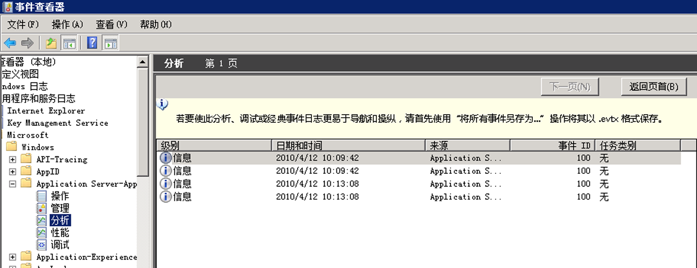

# <a name="configuring-tracking-for-a-workflow"></a>为工作流配置跟踪
工作流可以按以下三种方法执行：  
  
-   在 <xref:System.ServiceModel.Activities.WorkflowServiceHost> 中承载  
  
-   作为 <xref:System.Activities.WorkflowApplication> 执行  
  
-   使用 <xref:System.Activities.WorkflowInvoker> 直接执行  
  
 根据工作流承载选项的不同，可以通过代码或配置文件添加跟踪参与者。 本主题介绍如何通过向 <xref:System.Activities.WorkflowApplication> 和 <xref:System.ServiceModel.Activities.WorkflowServiceHost> 添加跟踪参与者来配置跟踪，并介绍在使用 <xref:System.Activities.WorkflowInvoker> 时如何启用跟踪。  
  
## <a name="configuring-workflow-application-tracking"></a>配置工作流应用程序跟踪  
 工作流可以使用 <xref:System.Activities.WorkflowApplication> 类运行。 本主题演示如何通过向 [!INCLUDE[netfx_current_long](../../../includes/netfx-current-long-md.md)] 工作流宿主添加跟踪参与者为 <xref:System.Activities.WorkflowApplication>工作流应用程序配置跟踪。 在这种情况下，工作流作为工作流应用程序运行。 通过代码（而不是通过配置文件）配置一个工作流应用程序，该工作流应用程序是一个使用 <xref:System.Activities.WorkflowApplication> 类的自承载的 .exe 文件。 跟踪参与者将作为 <xref:System.Activities.WorkflowApplication> 实例的扩展添加。 这是通过向 WorkflowApplication 实例的扩展集合添加 <xref:System.Activities.Tracking.TrackingParticipant> 来完成的。  
  
 对于工作流应用程序，您可以添加 <xref:System.Activities.Tracking.EtwTrackingParticipant> 行为扩展，如以下代码所示。  
  
```csharp  
LogActivity activity = new LogActivity();  
  
WorkflowApplication instance = new WorkflowApplication(activity);  
EtwTrackingParticipant trackingParticipant =  
    new EtwTrackingParticipant  
{  
  
        TrackingProfile = new TrackingProfile  
           {  
               Name = "SampleTrackingProfile",  
               ActivityDefinitionId = "ProcessOrder",  
               Queries = new WorkflowInstanceQuery  
               {  
                  States = { "*" }  
              }  
          }  
       };  
instance.Extensions.Add(trackingParticipant);  
```  
  
### <a name="configuring-workflow-service-tracking"></a>配置工作流服务跟踪  
 工作流可以公开为 WCF 服务中托管时<xref:System.ServiceModel.Activities.WorkflowServiceHost>服务主机。 <xref:System.ServiceModel.Activities.WorkflowServiceHost> 是基于工作流的服务的指定 .NET ServiceHost 实现。 本节介绍如何为在 [!INCLUDE[netfx_current_short](../../../includes/netfx-current-short-md.md)] 中运行的 <xref:System.ServiceModel.Activities.WorkflowServiceHost> 工作流服务配置跟踪。 通过在 Web.config 文件（对于 Web 承载的服务）或 App.config 文件（对于在独立的应用程序中承载的服务，例如在控制台应用程序中承载的服务）中指定服务行为，或通过使用代码向服务宿主的 <xref:System.ServiceModel.Description.ServiceDescription.Behaviors%2A> 集合中添加与跟踪相关的行为，可以完成上述配置。  
  
 对于 <xref:System.ServiceModel.WorkflowServiceHost> 中承载的工作流服务，您可以使用配置文件中的 <<xref:System.Activities.Tracking.EtwTrackingParticipant>> 元素添加 `behavior`，如以下示例所示。  
  
```xml  
<behaviors>  
   <serviceBehaviors>  
        <behavior>  
          <etwTracking profileName="Sample Tracking Profile" />  
        </behavior>              
   </serviceBehaviors>  
<behaviors>  
```  
  
 此外，对于 <xref:System.ServiceModel.WorkflowServiceHost> 中承载的工作流服务，您可以通过代码添加 <xref:System.Activities.Tracking.EtwTrackingParticipant> 行为扩展。 若要添加自定义跟踪参与者，请创建一个新的行为扩展并将其添加到 <xref:System.ServiceModel.ServiceHost> 中，如以下代码示例中所示。  
  
> [!NOTE]
>  如果你想要查看演示如何创建添加自定义跟踪参与者的自定义行为元素的示例代码，请参阅[跟踪](../../../docs/framework/windows-workflow-foundation/samples/tracking.md)示例。  
  
```  
ServiceHost svcHost = new ServiceHost(typeof(WorkflowService), new   
                                 Uri("http://localhost:8001/Sample"));  
EtwTrackingBehavior trackingBehavior =   
    new EtwTrackingBehavior  
    {  
        ProfileName = "Sample Tracking Profile"  
    };  
svcHost.Description.Behaviors.Add(trackingBehavior);  
svcHost.Open();  
```  
  
 跟踪参与者将作为行为的扩展添加到工作流服务主机中。  
  
 下面的这个代码示例演示如何从配置文件读取跟踪配置文件。  
  
```  
TrackingProfile GetProfile(string profileName, string displayName)  
        {  
            TrackingProfile trackingProfile = null;  
            TrackingSection trackingSection = (TrackingSection)WebConfigurationManager.GetSection("system.serviceModel/tracking");  
            if (trackingSection == null)   
            {  
                return null;  
            }  
  
            if (profileName == null)   
            {  
                profileName = "";  
            }  
  
            //Find the profile with the specified profile name in the list of profile found in config  
            var match = from p in new List<TrackingProfile>(trackingSection.TrackingProfiles)  
                        where (p.Name == profileName) && ((p.ActivityDefinitionId == displayName) || (p.ActivityDefinitionId == "*"))  
                        select p;  
  
            if (match.Count() == 0)  
            {  
                //return an empty profile  
                trackingProfile = new TrackingProfile()  
                {  
                    ActivityDefinitionId = displayName  
                };  
  
            }  
            else  
            {  
                trackingProfile = match.First();  
            }  
  
            return trackingProfile;  
```  
  
 此代码示例演示如何向工作流主机添加跟踪配置文件。  
  
```  
WorkflowServiceHost workflowServiceHost = serviceHostBase as WorkflowServiceHost;  
if (null != workflowServiceHost)  
{  
              string workflowDisplayName = workflowServiceHost.Activity.DisplayName;  
               TrackingProfile trackingProfile = GetProfile(this.profileName, workflowDisplayName);  
                workflowServiceHost.WorkflowExtensions.Add(()  => new EtwTrackingParticipant  {  
               TrackingProfile = trackingProfile  
                        });  
 }  
```  
  
> [!NOTE]
>  有关跟踪配置文件的详细信息，请参阅[跟踪配置文件](https://go.microsoft.com/fwlink/?LinkId=201310)。  
  
### <a name="configuring-tracking-using-workflowinvoker"></a>配置使用 WorkflowInvoker 的跟踪  
 若要对使用 <xref:System.Activities.WorkflowInvoker> 执行的工作流配置跟踪，请添加跟踪提供程序作为 <xref:System.Activities.WorkflowInvoker> 实例的扩展。 下面的代码示例摘自[自定义跟踪](../../../docs/framework/windows-workflow-foundation/samples/custom-tracking.md)示例。  
  
```  
WorkflowInvoker invoker = new WorkflowInvoker(BuildSampleWorkflow());  
invoker.Extensions.Add(customTrackingParticipant);  
invoker.Invoke();  
```  
  
### <a name="viewing-tracking-records-in-event-viewer"></a>在事件查看器中查看跟踪记录  
 在跟踪 WF 执行时有两种特殊的事件查看器日志可供查看 - 分析日志和调试日志。 这两者均驻留在 Microsoft&#124;Windows&#124;应用程序服务器-应用程序节点。  此部分内的日志包含来自单一应用程序的事件，而不包含对整个系统范围产生影响的事件。  
  
 调试跟踪事件将写入调试日志。 若要收集事件查看器中的 WF 调试跟踪事件，请启用调试日志。  
  
1.  若要打开事件查看器，请单击**启动**，然后单击**运行。** 在运行对话框中，键入`eventvwr`。  
  
2.  在事件查看器对话框中，展开**应用程序和服务日志**节点。  
  
3.  展开**Microsoft**， **Windows**，并**应用程序服务器-应用程序**节点。  
  
4.  右键单击**调试**节点下的**应用程序服务器-应用程序**节点，然后选择**启用日志**。  
  
5.  执行启用跟踪的应用程序以生成跟踪事件。  
  
6.  右键单击**调试**节点，然后选择**刷新。** 跟踪事件应显示在中心窗格中。  
  
 WF 4 提供跟踪参与者，可将跟踪记录写入 ETW（Windows 事件跟踪）会话。 ETW 跟踪参与者通过跟踪配置文件配置为订阅跟踪记录。  当启用跟踪时，向 ETW 发出错误跟踪记录。 与 ETW 跟踪参与者发出的跟踪事件相对应的 ETW 跟踪事件（范围介于 100 到 113 之间）将写入分析日志。   
  
 若要查看跟踪记录，请按照以下步骤操作。  
  
1.  若要打开事件查看器，请单击**启动**，然后单击**运行。** 在运行对话框中，键入`eventvwr`。  
  
2.  在事件查看器对话框中，展开**应用程序和服务日志**节点。  
  
3.  展开**Microsoft**， **Windows**，并**应用程序服务器-应用程序**节点。  
  
4.  右键单击**Analytic**节点下的**应用程序服务器-应用程序**节点，然后选择**启用日志**。  
  
5.  执行启用跟踪的应用程序以生成跟踪记录。  
  
6.  右键单击**Analytic**节点，然后选择**刷新。** 跟踪记录应会显示在中心窗格中。  
  
 下面的图像显示了事件查看器中的跟踪事件。  
  
   
  
### <a name="registering-an-application-specific-provider-id"></a>注册应用程序特定的提供程序 ID  
 如果需要将事件写入到特定的应用程序日志中，请按照以下步骤注册新的提供程序清单。  
  
1.  在应用程序配置文件中声明提供程序 ID。  
  
    ```xml  
    <system.serviceModel>  
        <diagnostics etwProviderId="2720e974-9fe9-477a-bb60-81fe3bf91eec"/>  
    </system.serviceModel>  
    ```  
  
2.  将清单文件从 %windir%\Microsoft.NET\Framework\\< 最新版本的[!INCLUDE[netfx_current_short](../../../includes/netfx-current-short-md.md)]> \Microsoft.Windows.ApplicationServer.Applications.man 到临时位置，其重命名为Microsoft.Windows.ApplicationServer.Applications_Provider1.man  
  
3.  将清单文件中的 GUID 更改为新的 GUID。  
  
    ```xml  
    <provider name="Microsoft-Windows-Application Server-Applications" guid="{2720e974-9fe9-477a-bb60-81fe3bf91eec}"  
    ```  
  
4.  如果您不想卸载默认提供程序，请更改提供程序名称。  
  
    ```xml  
    <provider name="Microsoft-Windows-Application Server-Applications" guid="{2720e974-9fe9-477a-bb60-81fe3bf91eec}"  
    ```  
  
5.  如果您在第一步中更改了提供程序名称，请将清单文件中的通道名称更改为新的提供程序名称。  
  
    ```xml  
    <channel name="Microsoft-Windows-Application Server-Applications_Provider1/Admin" chid="ADMIN_CHANNEL" symbol="ADMIN_CHANNEL" type="Admin" enabled="false" isolation="Application" message="$(string.MICROSOFT_WINDOWS_APPLICATIONSERVER_APPLICATIONS.channel.ADMIN_CHANNEL.message)" />  
    <channel name="Microsoft-Windows-Application Server-Applications_Provider1/Operational" chid="OPERATIONAL_CHANNEL" symbol="OPERATIONAL_CHANNEL" type="Operational" enabled="false" isolation="Application" message="$(string.MICROSOFT_WINDOWS_APPLICATIONSERVER_APPLICATIONS.channel.OPERATIONAL_CHANNEL.message)" />  
    <channel name="Microsoft-Windows-Application Server-Applications_Provider1/Analytic" chid="ANALYTIC_CHANNEL" symbol="ANALYTIC_CHANNEL" type="Analytic" enabled="false" isolation="Application" message="$(string.MICROSOFT_WINDOWS_APPLICATIONSERVER_APPLICATIONS.channel.ANALYTIC_CHANNEL.message)" />  
    <channel name="Microsoft-Windows-Application Server-Applications_Provider1/Debug" chid="DEBUG_CHANNEL" symbol="DEBUG_CHANNEL" type="Debug" enabled="false" isolation="Application" message="$(string.MICROSOFT_WINDOWS_APPLICATIONSERVER_APPLICATIONS.channel.DEBUG_CHANNEL.message)" />  
    <channel name="Microsoft-Windows-Application Server-Applications_Provider1/Perf" chid="PERF_CHANNEL" symbol="PERF_CHANNEL" type="Analytic" enabled="false" isolation="Application" message="$(string.MICROSOFT_WINDOWS_APPLICATIONSERVER_APPLICATIONS.channel.PERF_CHANNEL.message)" />  
    ```  
  
6.  按照以下这些步骤生成资源 DLL。  
  
    1.  安装 Windows SDK。 Windows SDK 包括消息编译器 ([mc.exe](https://go.microsoft.com/fwlink/?LinkId=184606)) 和资源编译器 ([rc.exe](https://go.microsoft.com/fwlink/?LinkId=184605))。  
  
    2.  在 Windows SDK 命令提示中，对新清单文件运行 mc.exe。  
  
        ```  
        mc.exe Microsoft.Windows.ApplicationServer.Applications_Provider1.man  
        ```  
  
    3.  对在上一步中生成的资源文件运行 rc.exe。  
  
        ```  
        rc.exe  Microsoft.Windows.ApplicationServer.Applications_Provider1.rc  
        ```  
  
    4.  创建一个名为 NewProviderReg.cs 的空 cs 文件。  
  
    5.  使用 C# 编译器创建一个资源 DLL。  
  
        ```  
        csc /target:library /win32res:Microsoft.Windows.ApplicationServer.Applications_Provider1.res NewProviderReg.cs /out:Microsoft.Windows.ApplicationServer.Applications_Provider1.dll  
        ```  
  
    6.  将清单文件中的资源和消息 dll 名称从 `Microsoft.Windows.ApplicationServer.Applications.Provider1.man` 更改为新的 dll 名称。  
  
        ```xml  
        <provider name="Microsoft-Windows-Application Server-Applications_Provider1" guid="{2720e974-9fe9-477a-bb60-81fe3bf91eec}" symbol="Microsoft_Windows_ApplicationServer_ApplicationEvents" resourceFileName="<dll directory>\Microsoft.Windows.ApplicationServer.Applications_Provider1.dll" messageFileName="<dll directory>\Microsoft.Windows.ApplicationServer.Applications_Provider1.dll">  
        ```  
  
    7.  使用[wevtutil](https://go.microsoft.com/fwlink/?LinkId=184608)注册清单。  
  
        ```  
        wevtutil im Microsoft.Windows.ApplicationServer.Applications_Provider1.man  
        ```  
  
## <a name="see-also"></a>请参阅  
 [Windows Server App Fabric 监视](https://go.microsoft.com/fwlink/?LinkId=201273)  
 [使用 App Fabric 监视应用程序](https://go.microsoft.com/fwlink/?LinkId=201275)
