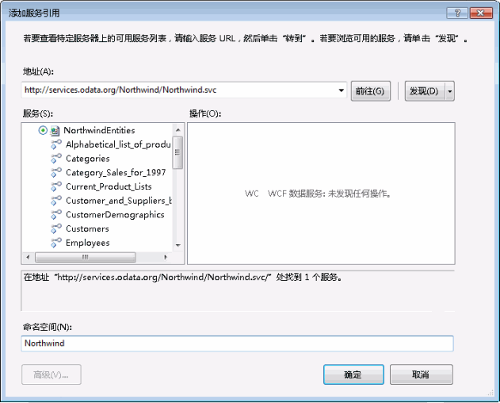

# 使用工作流中的 OData 源Consuming OData Feeds from a Workflow
WCF 数据服务是 [!INCLUDE[dnprdnshort](../../../includes/dnprdnshort-md.md)] 的一个组件，可以使用此组件创建一些服务，利用开放式数据协议 (OData) 来借助具象状态传输 (REST) 语义通过 Web 或 Intranet 公开和使用数据。WCF Data Services is a component of the [!INCLUDE[dnprdnshort](../../../includes/dnprdnshort-md.md)] that enables you to create services that use the Open Data Protocol (OData) to expose and consume data over the Web or intranet by using the semantics of representational state transfer (REST). OData 将数据公开为可通过 URI 进行寻址的资源。OData exposes data as resources that are addressable by URIs. 如果任一应用程序可发送 HTTP 请求并处理数据服务返回的 OData 源，则该应用程序可与基于 OData 的数据服务进行交互。Any application can interact with an OData-based data service if it can send an HTTP request and process the OData feed that a data service returns. 此外，WCF 数据服务包括多个客户端库，当从 [!INCLUDE[dnprdnshort](../../../includes/dnprdnshort-md.md)] 应用程序使用 OData 源时，这些客户端库会提供更丰富的编程体验。In addition, WCF Data Services includes client libraries that provide a richer programming experience when you consume OData feeds from [!INCLUDE[dnprdnshort](../../../includes/dnprdnshort-md.md)] applications. 本主题概述如何在使用/未使用客户端库的情况下，在工作流中使用 OData 源。This topic provides an overview of consuming an OData feed in a workflow with and without using the client libraries.  
  
## 使用示例 Northwind OData 服务Using the Sample Northwind OData Service  
 本主题中的示例使用 [http://services.odata.org/Northwind/Northwind.svc/](http://go.microsoft.com/fwlink/?LinkID=187426)上的示例 Northwind 数据服务。The examples in this topic use the sample Northwind data service located at [http://services.odata.org/Northwind/Northwind.svc/](http://go.microsoft.com/fwlink/?LinkID=187426). 此服务作为 [OData SDK](http://go.microsoft.com/fwlink/?LinkID=185248) 的一部分提供，它提供了对示例 Northwind 数据库的只读访问。This service is provided as part of the [OData SDK](http://go.microsoft.com/fwlink/?LinkID=185248) and provides read-only access to the sample Northwind database. 如果需要写权限或需要本地 WCF 数据服务，可按照 [WCF 数据服务快速入门](http://go.microsoft.com/fwlink/?LinkID=131076) 中的步骤执行操作，以创建可提供对 Northwind 数据库的访问的本地 OData 服务。If write access is desired, or if a local WCF Data Service is desired, you can follow the steps of the [WCF Data Services Quickstart](http://go.microsoft.com/fwlink/?LinkID=131076) to create a local OData service that provides access to the Northwind database. 如果按照该快速入门中的步骤执行操作，则会用本地 URI 代替本主题中的代码示例中提供的 URI。If you follow the quickstart, substitute the local URI for the one provided in the example code in this topic.  
  
## 通过客户端库使用 OData 源Consuming an OData Feed Using the Client Libraries  
 WCF 数据服务包括一些客户端库，使您能够通过 [!INCLUDE[dnprdnshort](../../../includes/dnprdnshort-md.md)] 和客户端应用程序更轻松地使用 OData 源。WCF Data Services includes client libraries that enable you to more easily consume an OData feed from [!INCLUDE[dnprdnshort](../../../includes/dnprdnshort-md.md)] and client applications. 这些库简化了 HTTP 消息的发送和接收。These libraries simplify sending and receiving HTTP messages. 它们还可将消息负载转换为代表实体数据的 CLR 对象。They also translate the message payload into CLR objects that represent entity data. 客户端库具有两个核心类 <xref:System.Data.Services.Client.DataServiceContext> 和 <xref:System.Data.Services.Client.DataServiceQuery%601>。The client libraries feature the two core classes <xref:System.Data.Services.Client.DataServiceContext> and <xref:System.Data.Services.Client.DataServiceQuery%601>. 通过使用这些类，可以查询数据服务，然后作为 CLR 对象使用返回的实体数据。These classes enable you to query a data service and then work with the returned entity data as CLR objects. 本节介绍了用于创建使用客户端库的活动的两种方法。This section covers two approaches to creating activities that use the client libraries.  
  
### 添加对 WCF 数据服务的服务引用Adding a Service Reference to the WCF Data Service  
 若要生成 Northwind 客户端库，可使用 **中的** “添加服务引用” [!INCLUDE[vs_current_long](../../../includes/vs-current-long-md.md)] 对话框添加对 Northwind OData 服务的引用。To generate the Northwind client libraries, you can use the **Add Service Reference** dialog box in [!INCLUDE[vs_current_long](../../../includes/vs-current-long-md.md)] to add a reference to the Northwind OData service.  
  
   
  
 请注意，此服务未公开任何服务操作，并且 **“服务”** 列表中包含表示由 Northwind 数据服务公开的实体的项目。Note that there are no service operations exposed by the service, and in the **Services** list there are items representing the entities exposed by the Northwind data service. 在添加服务引用时，将为这些实体生成类，并可在客户端代码中使用生成的类。When the service reference is added, classes will be generated for these entities and they can be used in the client code. 本主题中的示例使用这些类和 `NorthwindEntities` 类来执行查询。The examples in this topic use these classes and the `NorthwindEntities` class to perform the queries.  
  
> [!NOTE]
>  [!INCLUDE[crdefault](../../../includes/crdefault-md.md)][生成数据服务客户端库 （WCF 数据服务）](http://go.microsoft.com/fwlink/?LinkID=191611)。 [Generating the Data Service Client Library (WCF Data Services)](http://go.microsoft.com/fwlink/?LinkID=191611).  
  
### 使用异步方法Using Asynchronous Methods  
 若要解决在通过 Web 访问资源时可能发生的延迟问题，建议您异步访问 WCF 数据服务。To address possible latency issues that may occur when accessing resources over the Web, we recommend accessing WCF Data Services asynchronously. WCF 数据服务客户端库包括用于调用查询的异步方法，而 [!INCLUDE[wf](../../../includes/wf-md.md)] 提供了用于创作异步活动的 <xref:System.Activities.AsyncCodeActivity> 类。The WCF Data Services client libraries include asynchronous methods for invoking queries, and [!INCLUDE[wf](../../../includes/wf-md.md)] provides the <xref:System.Activities.AsyncCodeActivity> class for authoring asynchronous activities. 可写入<xref:System.Activities.AsyncCodeActivity> 派生的活动以利用具有异步方法的 [!INCLUDE[dnprdnshort](../../../includes/dnprdnshort-md.md)] 类，或者可将要异步执行的代码放入某个方法中并使用委托进行调用。<xref:System.Activities.AsyncCodeActivity> derived activities can be written to take advantage of [!INCLUDE[dnprdnshort](../../../includes/dnprdnshort-md.md)] classes that have asynchronous methods, or the code to be executed asynchronously can be put into a method and invoked by using a delegate. 本节提供了 <xref:System.Activities.AsyncCodeActivity> 派生的活动的两个示例；一个示例使用 WCF 数据服务客户端库的异步方法，另一个示例使用委托。This section provides two examples of an <xref:System.Activities.AsyncCodeActivity> derived activity; one that uses the asynchronous methods of the WCF Data Services client libraries and one that uses a delegate.  
  
> [!NOTE]
>  [!INCLUDE[crdefault](../../../includes/crdefault-md.md)][异步操作 （WCF 数据服务）](http://go.microsoft.com/fwlink/?LinkId=193396)和[创建异步活动](../../../docs/framework/windows-workflow-foundation/creating-asynchronous-activities-in-wf.md)。 [Asynchronous Operations (WCF Data Services)](http://go.microsoft.com/fwlink/?LinkId=193396) and [Creating Asynchronous Activities](../../../docs/framework/windows-workflow-foundation/creating-asynchronous-activities-in-wf.md).  
  
### 使用客户端库异步方法Using Client Library Asynchronous Methods  
 <xref:System.Data.Services.Client.DataServiceQuery%601> 类提供 <xref:System.Data.Services.Client.DataServiceQuery%601.BeginExecute%2A> 和 <xref:System.Data.Services.Client.DataServiceQuery%601.EndExecute%2A> 方法来异步查询 OData 服务。The <xref:System.Data.Services.Client.DataServiceQuery%601> class provides <xref:System.Data.Services.Client.DataServiceQuery%601.BeginExecute%2A> and <xref:System.Data.Services.Client.DataServiceQuery%601.EndExecute%2A> methods for querying an OData service asynchronously. 这些方法可从 <xref:System.Activities.AsyncCodeActivity.BeginExecute%2A> 派生的类的 <xref:System.Activities.AsyncCodeActivity.EndExecute%2A> 和 <xref:System.Activities.AsyncCodeActivity> 重写调用。These methods can be called from the <xref:System.Activities.AsyncCodeActivity.BeginExecute%2A> and <xref:System.Activities.AsyncCodeActivity.EndExecute%2A> overrides of an <xref:System.Activities.AsyncCodeActivity> derived class. 当 <xref:System.Activities.AsyncCodeActivity> <xref:System.Activities.AsyncCodeActivity.BeginExecute%2A> 重写返回时，工作流会进入空闲状态（但不保持）；当完成异步工作时，运行时将调用 <xref:System.Activities.AsyncCodeActivity.EndExecute%2A> 。When the <xref:System.Activities.AsyncCodeActivity> <xref:System.Activities.AsyncCodeActivity.BeginExecute%2A> override returns, the workflow can go idle (but not persist), and when the asynchronous work is completed, <xref:System.Activities.AsyncCodeActivity.EndExecute%2A> is invoked by the runtime.  
  
 下面的示例中定义了一个含有两个输入参数的 `OrdersByCustomer` 活动。In the following example, an `OrdersByCustomer` activity is defined that has two input arguments. `CustomerId` 参数表示标识要返回的订单的客户，`ServiceUri` 参数表示要查询的 OData 服务的 URI。The `CustomerId` argument represents the customer who identifies which orders to return, and the `ServiceUri` argument represents the URI of the OData service to be queried. 由于活动派生自 `AsyncCodeActivity<IEnumerable<Order>>` ，因此还有一个用于返回查询结果的 <xref:System.Activities.Activity%601.Result%2A> 输出参数。Because the activity derives from `AsyncCodeActivity<IEnumerable<Order>>` there is also a <xref:System.Activities.Activity%601.Result%2A> output argument that is used to return the results of the query. <xref:System.Activities.AsyncCodeActivity.BeginExecute%2A> 重写创建了一个用于选择指定客户的所有订单的 LINQ 查询。The <xref:System.Activities.AsyncCodeActivity.BeginExecute%2A> override creates a LINQ query that selects all orders of the specified customer. 此查询将指定为已传递的 <xref:System.Activities.AsyncCodeActivityContext.UserState%2A> 的 <xref:System.Activities.AsyncCodeActivityContext>，然后将调用此查询的 <xref:System.Data.Services.Client.DataServiceQuery%601.BeginExecute%2A> 方法。This query is specified as the <xref:System.Activities.AsyncCodeActivityContext.UserState%2A> of the passed <xref:System.Activities.AsyncCodeActivityContext>, and then the query's <xref:System.Data.Services.Client.DataServiceQuery%601.BeginExecute%2A> method is called. 请注意，传递到查询的 <xref:System.Data.Services.Client.DataServiceQuery%601.BeginExecute%2A> 中的回调和状态是传递到活动的 <xref:System.Activities.AsyncCodeActivity.BeginExecute%2A> 方法中的回调和状态。Note that the callback and state that are passed into the query's <xref:System.Data.Services.Client.DataServiceQuery%601.BeginExecute%2A> are the ones that are passed in to the activity's <xref:System.Activities.AsyncCodeActivity.BeginExecute%2A> method. 在执行完查询后，将调用 <xref:System.Activities.AsyncCodeActivity.EndExecute%2A> 方法。When the query has finished executing, the activity's <xref:System.Activities.AsyncCodeActivity.EndExecute%2A> method is invoked. 从 <xref:System.Activities.AsyncCodeActivityContext.UserState%2A>中检索查询，然后调用查询的 <xref:System.Data.Services.Client.DataServiceQuery%601.EndExecute%2A> 方法。The query is retrieved from the <xref:System.Activities.AsyncCodeActivityContext.UserState%2A>, and then the query's <xref:System.Data.Services.Client.DataServiceQuery%601.EndExecute%2A> method is called. 此方法将返回指定的实体类型的 <xref:System.Collections.Generic.IEnumerable%601> ；此示例中为 `Order`。This method returns an <xref:System.Collections.Generic.IEnumerable%601> of the specified entity type; in this case `Order`. 由于 `IEnumerable<Order>` 是 <xref:System.Activities.AsyncCodeActivity%601>的泛型类型，因此 `IEnumerable` 将设置为活动的 <xref:System.Activities.Activity%601.Result%2A> <xref:System.Activities.OutArgument%601> 。Since `IEnumerable<Order>` is the generic type of the <xref:System.Activities.AsyncCodeActivity%601>, this `IEnumerable` is set as the <xref:System.Activities.Activity%601.Result%2A> <xref:System.Activities.OutArgument%601> of the activity.  
  
 [!code-csharp[CFX_WCFDataServicesActivityExample#100](../../../samples/snippets/csharp/VS_Snippets_CFX/CFX_WCFDataServicesActivityExample/cs/Program.cs#100)]  
  
 在下面的示例中， `OrdersByCustomer` 活动将检索指定客户的订单列表，然后 <xref:System.Activities.Statements.ForEach%601> 活动将枚举返回的订单并将每份订单的日期写入控制台。In the following example, the `OrdersByCustomer` activity retrieves a list of orders for the specified customer, and then a <xref:System.Activities.Statements.ForEach%601> activity enumerates the returned orders and writes the date of each order to the console.  
  
 [!code-csharp[CFX_WCFDataServicesActivityExample#10](../../../samples/snippets/csharp/VS_Snippets_CFX/CFX_WCFDataServicesActivityExample/cs/Program.cs#10)]  
  
 调用该工作流时，会将以下数据写入控制台：When this workflow is invoked, the following data is written to the console:  
  
 **Calling WCF Data Service...****Calling WCF Data Service...**  
**8/25/1997** **8/25/1997**   
**10/3/1997** **10/3/1997**   
**10/13/1997** **10/13/1997**   
**1/15/1998** **1/15/1998**   
**3/16/1998** **3/16/1998**   
**4/9/1998****4/9/1998**    
> [!NOTE]
>  如果无法建立与 OData 服务器的连接，则您将收到与以下异常类似的异常：If a connection to the OData server cannot be established, you will get an exception similar to the following exception:  
>   
>  未经处理的异常: System.InvalidOperationException: 处理此请求时出错。Unhandled Exception: System.InvalidOperationException: An error occurred while processing this request. ---> System.Net.WebException: 无法连接到远程服务器 ---> System.Net.Sockets.SocketException: 连接方在一段时间后未正确响应而导致连接尝试失败，或者连接的主机未能响应而导致已建立的连接失败。---> System.Net.WebException: Unable to connect to the remote server ---> System.Net.Sockets.SocketException: A connection attempt failed because the connected party did not properly respond after a period of time, or established connection failed because connected host has failed to respond.  
  
 如果需要对查询返回的数据进行任何其他处理，则可在活动的 <xref:System.Activities.AsyncCodeActivity%601.EndExecute%2A> 重写中执行此操作。If any additional processing of the data returned by the query is required, it can be done in the activity's <xref:System.Activities.AsyncCodeActivity%601.EndExecute%2A> override. <xref:System.Activities.AsyncCodeActivity%601.BeginExecute%2A> 和 <xref:System.Activities.AsyncCodeActivity%601.EndExecute%2A> 都是通过使用工作流线程调用的，并且这些重写中的任何代码都不会异步运行。Both <xref:System.Activities.AsyncCodeActivity%601.BeginExecute%2A> and <xref:System.Activities.AsyncCodeActivity%601.EndExecute%2A> are invoked by using the workflow thread, and any code in these overrides does not run asynchronously. 如果其他处理的量很大或运行时间较长，或者查询结果已分页，则应考虑下一节中讨论的方法，该方法使用委托来执行查询并异步执行其他处理。If the additional processing is extensive or long-running, or the query results are paged, you should consider the approach discussed in the next section, which uses a delegate to execute the query and perform additional processing asynchronously.  
  
### 使用委托Using a Delegate  
 除了调用 [!INCLUDE[dnprdnshort](../../../includes/dnprdnshort-md.md)] 类的异步方法之外，基于 <xref:System.Activities.AsyncCodeActivity>的活动还可定义其某个方法中的异步逻辑。In addition to invoking the asynchronous method of a [!INCLUDE[dnprdnshort](../../../includes/dnprdnshort-md.md)] class, an <xref:System.Activities.AsyncCodeActivity>-based activity can also define the asynchronous logic in one of its methods. 此方法是通过使用活动的 <xref:System.Activities.AsyncCodeActivity.BeginExecute%2A> 重写中的委托来指定的。This method is specified by using a delegate in the activity's <xref:System.Activities.AsyncCodeActivity.BeginExecute%2A> override. 当此方法返回时，运行时将调用活动的 <xref:System.Activities.AsyncCodeActivity.EndExecute%2A> 重写。When the method returns, the runtime invokes the activity's <xref:System.Activities.AsyncCodeActivity.EndExecute%2A> override. 当从工作流调用 OData 服务时，此方法可用于查询服务和提供任何其他处理。When calling an OData service from a workflow, this method can be used to query the service and provide any additional processing.  
  
 下面的示例定义了一个 `ListCustomers` 活动。In the following example, a `ListCustomers` activity is defined. 此活动将查询示例 Northwind 数据服务并返回一个包含 Northwind 数据库中的所有客户的 `List<Customer>` 。This activity queries the sample Northwind data service and returns a `List<Customer>` that contains all of the customers in the Northwind database. 异步工作由 `GetCustomers` 方法执行。The asynchronous work is performed by the `GetCustomers` method. 此方法将查询所有客户的服务，然后将这些客户复制到 `List<Customer>`。This method queries the service for all customers, and then copies them into a `List<Customer>`. 然后，此方法会检查结果是否已分页。It then checks to see if the results are paged. 如果结果已分页，则此方法会查询下一页结果的服务，再将这些结果添加到列表，然后继续操作直到检索到所有客户数据。If so, it queries the service for the next page of results, adds them to the list, and continues until all of the customer data has been retrieved.  
  
> [!NOTE]
>  [!INCLUDE[crabout](../../../includes/crabout-md.md)]WCF 数据服务中的分页，请参阅。 paging in WCF Data Services, see . [如何：加载分页结果（WCF 数据服务）](http://go.microsoft.com/fwlink/?LinkId=193452)。[How to: Load Paged Results (WCF Data Services)](http://go.microsoft.com/fwlink/?LinkId=193452).  
  
 在添加所有客户后，将返回该列表。Once all customers are added, the list is returned. 活动的 `GetCustomers` 重写中指定了 <xref:System.Activities.AsyncCodeActivity.BeginExecute%2A> 方法。The `GetCustomers` method is specified in the activity's <xref:System.Activities.AsyncCodeActivity.BeginExecute%2A> override. 由于该方法具有一个返回值，因此将创建一个 `Func<string, List<Customer>>` 来指定该方法。Since the method has a return value, a `Func<string, List<Customer>>` is created to specify the method.  
  
> [!NOTE]
>  如果执行异步工作的方法不具有返回值，则使用 <xref:System.Action> 而非 <!--zz <xref:System.Func> --> `System.Func`。If the method that performs the asynchronous work does not have a return value, an <xref:System.Action> is used instead of a <!--zz <xref:System.Func> --> `System.Func`. 创建异步示例使用这两种方法的示例，请参阅[创建异步活动](../../../docs/framework/windows-workflow-foundation/creating-asynchronous-activities-in-wf.md)。For examples of creating an asynchronous example using both approaches, see [Creating Asynchronous Activities](../../../docs/framework/windows-workflow-foundation/creating-asynchronous-activities-in-wf.md).  
  
 将此 <!--zz <xref:System.Func> --> `System.Func` 分配给 <xref:System.Activities.AsyncCodeActivityContext.UserState%2A>，然后调用 `BeginInvoke` 。This <!--zz <xref:System.Func> --> `System.Func` is assigned to the <xref:System.Activities.AsyncCodeActivityContext.UserState%2A>, and then `BeginInvoke` is called. 由于要调用的方法无法访问活动的参数环境，因此 `ServiceUri` 参数的值将作为第一个参数与已传入 <xref:System.Activities.AsyncCodeActivity.BeginExecute%2A>中的回调和状态一起传递。Since the method to be invoked does not have access to the activity's environment of arguments, the value of the `ServiceUri` argument is passed as the first parameter, together with the callback and state that were passed into <xref:System.Activities.AsyncCodeActivity.BeginExecute%2A>. 当 `GetCustomers` 返回时，运行时将调用 <xref:System.Activities.AsyncCodeActivity.EndExecute%2A>。When `GetCustomers` returns, the runtime invokes <xref:System.Activities.AsyncCodeActivity.EndExecute%2A>. <xref:System.Activities.AsyncCodeActivity.EndExecute%2A> 中的代码将从 <xref:System.Activities.AsyncCodeActivityContext.UserState%2A>中检索委托，调用 `EndInvoke`并返回结果，该结果是从 `GetCustomers` 方法返回的客户列表。The code in <xref:System.Activities.AsyncCodeActivity.EndExecute%2A> retrieves the delegate from the <xref:System.Activities.AsyncCodeActivityContext.UserState%2A>, calls `EndInvoke`, and returns the result, which is the list of customers returned from the `GetCustomers` method.  
  
 [!code-csharp[CFX_WCFDataServicesActivityExample#200](../../../samples/snippets/csharp/VS_Snippets_CFX/CFX_WCFDataServicesActivityExample/cs/Program.cs#200)]  
  
 在下面的示例中， `ListCustomers` 活动将检索一个客户列表，然后 <xref:System.Activities.Statements.ForEach%601> 活动将枚举这些客户并将每个客户的公司名称和联系人姓名写入控制台。In the following example, the `ListCustomers` activity retrieves a list of customers, and then a <xref:System.Activities.Statements.ForEach%601> activity enumerates them and writes the company name and contact name of each customer to the console.  
  
 [!code-csharp[CFX_WCFDataServicesActivityExample#20](../../../samples/snippets/csharp/VS_Snippets_CFX/CFX_WCFDataServicesActivityExample/cs/Program.cs#20)]  
  
 调用此工作流时，会将以下数据写入控制台。When this workflow is invoked, the following data is written to the console. 由于此查询返回了多个客户，因此这里只显示部分输出。Since this query returns many customers, only part of the output is displayed here.  
  
 **Calling WCF Data Service...****Calling WCF Data Service...**  
**Alfreds Futterkiste, Contact: Maria Anders** **Alfreds Futterkiste, Contact: Maria Anders**   
**Ana Trujillo Emparedados y helados, Contact: Ana Trujillo** **Ana Trujillo Emparedados y helados, Contact: Ana Trujillo**   
**Antonio Moreno Taquería，联系人： Antonio Moreno** **Antonio Moreno Taquería, Contact: Antonio Moreno**   
**Around the Horn, Contact: Thomas Hardy** **Around the Horn, Contact: Thomas Hardy**   
**Berglunds snabbköp，联系人： Christina Berglund** **Berglunds snabbköp, Contact: Christina Berglund**   
**...****...**    
## 在不使用客户端库的情况下使用 OData 源Consuming an OData Feed Without Using the Client Libraries  
 OData 将数据公开为可通过 URI 进行寻址的资源。OData exposes data as resources that are addressable by URIs. 在使用客户端库时，将为您创建这些 URI，但您不必使用客户端库。When you use the client libraries these URIs are created for you, but you do not have to use the client libraries. 如果需要，可在不使用客户端库的情况下直接访问 OData 服务。If desired, OData services can be accessed directly without using the client libraries. 当不使用客户端库时，服务的位置和所需数据将由 URI 指定，并将返回结果以响应 HTTP 请求。When not using the client libraries the location of the service and the desired data are specified by the URI and the results are returned in the response to the HTTP request. 然后，可按所需方式处理或操作此原始数据。This raw data can then be processed or manipulated in the desired manner. 检索 OData 查询的结果的一种方法是使用 <xref:System.Net.WebClient> 类。One way to retrieve the results of an OData query is by using the <xref:System.Net.WebClient> class. 在此示例中，将检索由键 ALFKI 表示的客户的联系人姓名。In this example, the contact name for the customer represented by the key ALFKI is retrieved.  
  
 [!code-csharp[CFX_WCFDataServicesActivityExample#2](../../../samples/snippets/csharp/VS_Snippets_CFX/CFX_WCFDataServicesActivityExample/cs/Program.cs#2)]  
  
 在运行此代码时，会将以下输出显示到控制台：When this code is run, the following output is displayed to the console:  
  
 **返回的原始数据：****Raw data returned:**  
**\<？ xml 版本 ="1.0"encoding ="utf-8"独立 ="yes"？ >** **\<?xml version="1.0" encoding="utf-8" standalone="yes"?>**   
**\<ContactName xmlns ="http://schemas.microsoft.com/ado/2007/08/dataservices"> Maria Anders\</ContactName >**在工作流中此示例中的代码无法合并到<xref:System.Activities.CodeActivity.Execute%2A>重写<xref:System.Activities.CodeActivity>-基于自定义活动，但也可以通过使用来完成相同的功能<xref:System.Activities.Expressions.InvokeMethod%601>活动。**\<ContactName xmlns="http://schemas.microsoft.com/ado/2007/08/dataservices">Maria Anders\</ContactName>**  In a workflow, the code from this example could be incorporated into the <xref:System.Activities.CodeActivity.Execute%2A> override of a <xref:System.Activities.CodeActivity>-based custom activity, but the same functionality can also be accomplished by using the <xref:System.Activities.Expressions.InvokeMethod%601> activity. 利用 <xref:System.Activities.Expressions.InvokeMethod%601> 活动，工作流作者可调用类的静态和实例方法，并可选择异步调用指定方法。The <xref:System.Activities.Expressions.InvokeMethod%601> activity enables workflow authors to invoke static and instance methods of a class, and also has an option to invoke the specified method asynchronously. 在下面的示例中，将配置 <xref:System.Activities.Expressions.InvokeMethod%601> 活动以调用 <xref:System.Net.WebClient.DownloadString%2A> 类的 <xref:System.Net.WebClient> 方法并返回一个客户列表。In the following example, an <xref:System.Activities.Expressions.InvokeMethod%601> activity is configured to call the <xref:System.Net.WebClient.DownloadString%2A> method of the <xref:System.Net.WebClient> class and return a list of customers.  
  
 [!code-csharp[CFX_WCFDataServicesActivityExample#3](../../../samples/snippets/csharp/VS_Snippets_CFX/CFX_WCFDataServicesActivityExample/cs/Program.cs#3)]  
  
 <xref:System.Activities.Expressions.InvokeMethod%601> 可调用类的静态和实例方法。<xref:System.Activities.Expressions.InvokeMethod%601> can call both static and instance methods of a class. 由于 <xref:System.Net.WebClient.DownloadString%2A> 是 <xref:System.Net.WebClient> 类的一个实例方法，因此将为 <xref:System.Net.WebClient> 指定 <xref:System.Activities.Expressions.InvokeMethod%601.TargetObject%2A>类的一个新实例。Since <xref:System.Net.WebClient.DownloadString%2A> is an instance method of the <xref:System.Net.WebClient> class, a new instance of the <xref:System.Net.WebClient> class is specified for the <xref:System.Activities.Expressions.InvokeMethod%601.TargetObject%2A>. `DownloadString` 将指定为 <xref:System.Activities.Expressions.InvokeMethod%601.MethodName%2A>，将在 <xref:System.Activities.Expressions.InvokeMethod%601.Parameters%2A> 集合中指定包含查询的 URI，并会将返回值分配给 <xref:System.Activities.Activity%601.Result%2A> 值。`DownloadString` is specified as the <xref:System.Activities.Expressions.InvokeMethod%601.MethodName%2A>, the URI that contains the query is specified in the <xref:System.Activities.Expressions.InvokeMethod%601.Parameters%2A> collection, and the return value is assigned to the <xref:System.Activities.Activity%601.Result%2A> value. <xref:System.Activities.Expressions.InvokeMethod%601.RunAsynchronously%2A> 值将设置为 `true`，这意味着方法调用将根据工作流异步运行。The <xref:System.Activities.Expressions.InvokeMethod%601.RunAsynchronously%2A> value is set to `true`, which means that the method invocation will run asynchronously with regard to the workflow. 在下面的示例中，将构造一个工作流（该工作流使用 <xref:System.Activities.Expressions.InvokeMethod%601> 活动来查询特定客户的订单列表的示例 Northwind 数据服务），然后将返回的数据写入控制台。In the following example, a workflow is constructed that uses the <xref:System.Activities.Expressions.InvokeMethod%601> activity to query the sample Northwind data service for a list of orders for a specific customer, and then the returned data is written to the console.  
  
 [!code-csharp[CFX_WCFDataServicesActivityExample#1](../../../samples/snippets/csharp/VS_Snippets_CFX/CFX_WCFDataServicesActivityExample/cs/Program.cs#1)]  
  
 调用该工作流时，会将以下输出显示到控制台。When this workflow is invoked, the following output is displayed to the console. 由于此查询返回了多份订单，因此这里只显示部分输出。Since this query returns several orders, only part of the output is displayed here.  
  
 **Calling WCF Data Service...****Calling WCF Data Service...**  
**Raw data returned:** **Raw data returned:**   
**\<？ xml 版本 ="1.0"encoding ="utf-8"独立 ="yes"？ >** **\<?xml version="1.0" encoding="utf-8" standalone="yes"?>**   
**\<源** **\<feed**   
 **xml:base ="http://services.odata.org/Northwind/Northwind.svc/"****xml:base="http://services.odata.org/Northwind/Northwind.svc/"**  
 **xmlns:d ="http://schemas.microsoft.com/ado/2007/08/dataservices"****xmlns:d="http://schemas.microsoft.com/ado/2007/08/dataservices"**  
 **xmlns:m ="http://schemas.microsoft.com/ado/2007/08/dataservices/metadata"****xmlns:m="http://schemas.microsoft.com/ado/2007/08/dataservices/metadata"**  
 **xmlns ="http://www.w3.org/2005/Atom">****xmlns="http://www.w3.org/2005/Atom">**  
 **\<标题类型 ="text"> 订单 \< /t >****\<title type="text">Orders\</title>**  
 **\<id > http://services.odata.org/Northwind/Northwind.svc/Customers('ALFKI')/订单\</id >****\<id>http://services.odata.org/Northwind/Northwind.svc/Customers('ALFKI')/Orders\</id>**  
 **\<更新 > 2010年-05-19T19:37:07Z\</ 更新 >****\<updated>2010-05-19T19:37:07Z\</updated>**  
 **\<k rel ="自助"title ="Orders"href ="Orders"/ >****\<link rel="self" title="Orders" href="Orders" />**  
 **\<条目 >****\<entry>**  
 **\<id > http://services.odata.org/Northwind/Northwind.svc/Orders (10643)\</id >****\<id>http://services.odata.org/Northwind/Northwind.svc/Orders(10643)\</id>**  
 **\<标题类型 ="text"> \< /t >****\<title type="text">\</title>**  
 **\<更新 > 2010年-05-19T19:37:07Z\</ 更新 >****\<updated>2010-05-19T19:37:07Z\</updated>**  
 **\<作者 >****\<author>**  
 **\<名称 / >****\<name />**  
 **\<创作/>****\</author>**  
 **\<k rel ="edit"title ="Order"href="Orders(10643)"/ >****\<link rel="edit" title="Order" href="Orders(10643)" />**  
 **\<k rel ="http://schemas.microsoft.com/ado/2007/08/dataservices/related/Customer"****\<link rel="http://schemas.microsoft.com/ado/2007/08/dataservices/related/Customer"**  
 **类型 ="应用程序/atom + xml; 键入 = entry"title ="客户"href ="订单 （10643）/客户"/ >****type="application/atom+xml;type=entry" title="Customer" href="Orders(10643)/Customer" />**  
**...**本示例提供了一个方法，工作流应用程序作者可通过该方法使用从 OData 服务返回的原始数据。**...**  This example provides one method that workflow application authors can use to consume the raw data returned from an OData service. [!INCLUDE[crabout](../../../includes/crabout-md.md)] 使用 URI 访问 WCF 数据服务的详细信息，请参阅 [访问数据服务资源（WCF 数据服务）](http://go.microsoft.com/fwlink/?LinkId=193397) 和 [OData：URI 约定](http://go.microsoft.com/fwlink/?LinkId=185564)。 accessing WCF Data Services using URIs, see [Accessing Data Service Resources (WCF Data Services)](http://go.microsoft.com/fwlink/?LinkId=193397) and [OData: URI Conventions](http://go.microsoft.com/fwlink/?LinkId=185564).
