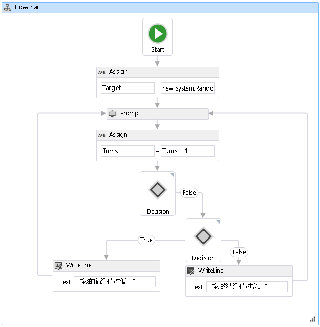

# <a name="how-to-create-a-flowchart-workflow"></a><span data-ttu-id="bfcd9-102">如何：创建 Flowchart 工作流</span><span class="sxs-lookup"><span data-stu-id="bfcd9-102">How to: Create a Flowchart Workflow</span></span>
<span data-ttu-id="bfcd9-103">工作流可基于内置活动以及自定义活动来构造。</span><span class="sxs-lookup"><span data-stu-id="bfcd9-103">Workflows can be constructed from built-in activities as well as from custom activities.</span></span> <span data-ttu-id="bfcd9-104">本主题将指导逐步创建如使用这两个内置的活动的工作流<xref:System.Activities.Statements.Flowchart>活动，并从以前的自定义活动[如何： 创建活动](../../../docs/framework/windows-workflow-foundation/how-to-create-an-activity.md)主题。</span><span class="sxs-lookup"><span data-stu-id="bfcd9-104">This topic steps through creating a workflow that uses both built-in activities such as the <xref:System.Activities.Statements.Flowchart> activity, and the custom activities from the previous [How to: Create an Activity](../../../docs/framework/windows-workflow-foundation/how-to-create-an-activity.md) topic.</span></span> <span data-ttu-id="bfcd9-105">该工作流模拟猜数游戏。</span><span class="sxs-lookup"><span data-stu-id="bfcd9-105">The workflow models a number guessing game.</span></span>  
  
> [!NOTE]
>  <span data-ttu-id="bfcd9-106">入门教程中的每个主题都依赖于前面的主题。</span><span class="sxs-lookup"><span data-stu-id="bfcd9-106">Each topic in the Getting Started tutorial depends on the previous topics.</span></span> <span data-ttu-id="bfcd9-107">若要完成本主题，必须先完成[如何： 创建活动](../../../docs/framework/windows-workflow-foundation/how-to-create-an-activity.md)。</span><span class="sxs-lookup"><span data-stu-id="bfcd9-107">To complete this topic, you must first complete [How to: Create an Activity](../../../docs/framework/windows-workflow-foundation/how-to-create-an-activity.md).</span></span>  
  
> [!NOTE]
>  <span data-ttu-id="bfcd9-108">若要下载本教程的完整的版本，请参阅[Windows Workflow Foundation (WF45)-入门教程](https://go.microsoft.com/fwlink/?LinkID=248976)。</span><span class="sxs-lookup"><span data-stu-id="bfcd9-108">To download a completed version of the tutorial, see [Windows Workflow Foundation (WF45) - Getting Started Tutorial](https://go.microsoft.com/fwlink/?LinkID=248976).</span></span>  
  
### <a name="to-create-the-workflow"></a><span data-ttu-id="bfcd9-109">创建工作流</span><span class="sxs-lookup"><span data-stu-id="bfcd9-109">To create the workflow</span></span>  
  
1.  <span data-ttu-id="bfcd9-110">右键单击**NumberGuessWorkflowActivities**中**解决方案资源管理器**，然后选择**添加**，**新项**。</span><span class="sxs-lookup"><span data-stu-id="bfcd9-110">Right-click **NumberGuessWorkflowActivities** in **Solution Explorer** and select **Add**, **New Item**.</span></span>  
  
2.  <span data-ttu-id="bfcd9-111">在中**已安装**，**常见项**节点中，选择**工作流**。</span><span class="sxs-lookup"><span data-stu-id="bfcd9-111">In the **Installed**, **Common Items** node, select **Workflow**.</span></span> <span data-ttu-id="bfcd9-112">选择**活动**从**工作流**列表。</span><span class="sxs-lookup"><span data-stu-id="bfcd9-112">Select **Activity** from the **Workflow** list.</span></span>  
  
3.  <span data-ttu-id="bfcd9-113">类型`FlowchartNumberGuessWorkflow`成**名称**框，然后单击**添加**。</span><span class="sxs-lookup"><span data-stu-id="bfcd9-113">Type `FlowchartNumberGuessWorkflow` into the **Name** box and click **Add**.</span></span>  
  
4.  <span data-ttu-id="bfcd9-114">拖动**流程图**活动从**流程图**一部分**工具箱**放到**在此处放置活动**上的标签工作流设计图面。</span><span class="sxs-lookup"><span data-stu-id="bfcd9-114">Drag a **Flowchart** activity from the **Flowchart** section of the **Toolbox** and drop it onto the **Drop activity here** label on the workflow design surface.</span></span>  
  
### <a name="to-create-the-workflow-variables-and-arguments"></a><span data-ttu-id="bfcd9-115">创建工作流变量和自变量</span><span class="sxs-lookup"><span data-stu-id="bfcd9-115">To create the workflow variables and arguments</span></span>  
  
1.  <span data-ttu-id="bfcd9-116">双击**FlowchartNumberGuessWorkflow.xaml**中**解决方案资源管理器**如果未显示在设计器中，显示工作流。</span><span class="sxs-lookup"><span data-stu-id="bfcd9-116">Double-click **FlowchartNumberGuessWorkflow.xaml** in **Solution Explorer** to display the workflow in the designer, if it is not already displayed.</span></span>  
  
2.  <span data-ttu-id="bfcd9-117">单击**自变量**左下角的工作流设计器，以显示**自变量**窗格。</span><span class="sxs-lookup"><span data-stu-id="bfcd9-117">Click **Arguments** in the lower-left side of the workflow designer to display the **Arguments** pane.</span></span>  
  
3.  <span data-ttu-id="bfcd9-118">单击**创建参数**。</span><span class="sxs-lookup"><span data-stu-id="bfcd9-118">Click **Create Argument**.</span></span>  
  
4.  <span data-ttu-id="bfcd9-119">类型`MaxNumber`成**名称**框中，选择**中**从**方向**下拉列表中，选择**Int32**从**自变量类型**下拉列表，然后按 ENTER 保存该自变量。</span><span class="sxs-lookup"><span data-stu-id="bfcd9-119">Type `MaxNumber` into the **Name** box, select **In** from the **Direction** drop-down list, select **Int32** from the **Argument type** drop-down list, and then press ENTER to save the argument.</span></span>  
  
5.  <span data-ttu-id="bfcd9-120">单击**创建参数**。</span><span class="sxs-lookup"><span data-stu-id="bfcd9-120">Click **Create Argument**.</span></span>  
  
6.  <span data-ttu-id="bfcd9-121">类型`Turns`成**名称**低于新添加的框`MaxNumber`参数中，选择**Out**从**方向**下拉列表中选择**Int32**从**自变量类型**下拉列表，然后按 ENTER。</span><span class="sxs-lookup"><span data-stu-id="bfcd9-121">Type `Turns` into the **Name** box that is below the newly added `MaxNumber` argument, select **Out** from the **Direction** drop-down list, select **Int32** from the **Argument type** drop-down list, and then press ENTER.</span></span>  
  
7.  <span data-ttu-id="bfcd9-122">单击**自变量**左下角的活动设计器，以关闭**自变量**窗格。</span><span class="sxs-lookup"><span data-stu-id="bfcd9-122">Click **Arguments** in the lower-left side of the activity designer to close the **Arguments** pane.</span></span>  
  
8.  <span data-ttu-id="bfcd9-123">单击**变量**左下角的工作流设计器，以显示**变量**窗格。</span><span class="sxs-lookup"><span data-stu-id="bfcd9-123">Click **Variables** in the lower-left side of the workflow designer to display the **Variables** pane.</span></span>  
  
9. <span data-ttu-id="bfcd9-124">单击**创建的变量**。</span><span class="sxs-lookup"><span data-stu-id="bfcd9-124">Click **Create Variable**.</span></span>  
  
    > [!TIP]
    >  <span data-ttu-id="bfcd9-125">如果没有**创建变量**框中显示，请单击<xref:System.Activities.Statements.Flowchart>活动工作流设计器图面以将其选中。</span><span class="sxs-lookup"><span data-stu-id="bfcd9-125">If no **Create Variable** box is displayed, click the <xref:System.Activities.Statements.Flowchart> activity on the workflow designer surface to select it.</span></span>  
  
10. <span data-ttu-id="bfcd9-126">类型`Guess`成**名称**框中，选择**Int32**从**变量类型**下拉列表，然后按 ENTER 保存该变量。</span><span class="sxs-lookup"><span data-stu-id="bfcd9-126">Type `Guess` into the **Name** box, select **Int32** from the **Variable type** drop-down list, and then press ENTER to save the variable.</span></span>  
  
11. <span data-ttu-id="bfcd9-127">单击**创建的变量**。</span><span class="sxs-lookup"><span data-stu-id="bfcd9-127">Click **Create Variable**.</span></span>  
  
12. <span data-ttu-id="bfcd9-128">类型`Target`成**名称**框中，选择**Int32**从**变量类型**下拉列表，然后按 ENTER 保存该变量。</span><span class="sxs-lookup"><span data-stu-id="bfcd9-128">Type `Target` into the **Name** box, select **Int32** from the **Variable type** drop-down list, and then press ENTER to save the variable.</span></span>  
  
13. <span data-ttu-id="bfcd9-129">单击**变量**左下角的活动设计器，以关闭**变量**窗格。</span><span class="sxs-lookup"><span data-stu-id="bfcd9-129">Click **Variables** in the lower-left side of the activity designer to close the **Variables** pane.</span></span>  
  
### <a name="to-add-the-workflow-activities"></a><span data-ttu-id="bfcd9-130">添加工作流活动</span><span class="sxs-lookup"><span data-stu-id="bfcd9-130">To add the workflow activities</span></span>  
  
1.  <span data-ttu-id="bfcd9-131">拖动**分配**活动从**基元**部分**工具箱**并将它悬停**启动**节点，即在顶部流程图。</span><span class="sxs-lookup"><span data-stu-id="bfcd9-131">Drag an **Assign** activity from the **Primitives** section of the **Toolbox** and hover it over the **Start** node, which is at the top of the flowchart.</span></span> <span data-ttu-id="bfcd9-132">当**分配**活动位于**启动**节点，周围会出现三个三角形**启动**节点。</span><span class="sxs-lookup"><span data-stu-id="bfcd9-132">When the **Assign** activity is over the **Start** node, three triangles will appear around the **Start** node.</span></span> <span data-ttu-id="bfcd9-133">Drop**分配**下方的三角形上的活动**启动**节点。</span><span class="sxs-lookup"><span data-stu-id="bfcd9-133">Drop the **Assign** activity on the triangle that is directly below the **Start** node.</span></span> <span data-ttu-id="bfcd9-134">这将两个项一起链接并将指定**分配**流程图中的第一个活动的活动。</span><span class="sxs-lookup"><span data-stu-id="bfcd9-134">This will link the two items together and designates the **Assign** activity as the first activity in the flowchart.</span></span>  
  
    > [!NOTE]
    >  <span data-ttu-id="bfcd9-135">也还可以通过手动将活动链接到开始节点而将活动指示为流程图中的起始活动。</span><span class="sxs-lookup"><span data-stu-id="bfcd9-135">Activities can also be indicated as the starting activity in the workflow by manually linking them activity to the start node.</span></span> <span data-ttu-id="bfcd9-136">若要执行此操作，将鼠标悬停**启动**节点中，单击鼠标位于上方时出现的矩形之一**启动**节点，，然后将连接至所需的活动并将其放置在其中一个出现的矩形。</span><span class="sxs-lookup"><span data-stu-id="bfcd9-136">To do this, hover the mouse over the **Start** node, click one of the rectangles that appear when the mouse is over the **Start** node, and drag the connecting line down to the desired activity and drop it on one of the rectangles that appear.</span></span> <span data-ttu-id="bfcd9-137">此外可以指定和作为通过右键单击，然后选择启动活动的活动**设置为开始节点**。</span><span class="sxs-lookup"><span data-stu-id="bfcd9-137">You can also designate and activity as the starting activity by right-clicking the it and choosing **Set as Start Node**.</span></span>  
  
2.  <span data-ttu-id="bfcd9-138">类型`Target`成**到**框中，以下表达式**输入 C# 表达式**或**输入 VB 表达式**框。</span><span class="sxs-lookup"><span data-stu-id="bfcd9-138">Type `Target` into the **To** box and the following expression into the **Enter a C# Expression** or **Enter a VB expression** box.</span></span>  
  
    ```vb  
    New System.Random().Next(1, MaxNumber + 1)  
    ```  
  
    ```csharp  
    new System.Random().Next(1, MaxNumber + 1)  
    ```  
  
    > [!TIP]
    >  <span data-ttu-id="bfcd9-139">如果**工具箱**不显示窗口中，选择**工具箱**从**视图**菜单。</span><span class="sxs-lookup"><span data-stu-id="bfcd9-139">If the **Toolbox** window is not displayed, select **Toolbox** from the **View** menu.</span></span>  
  
3.  <span data-ttu-id="bfcd9-140">拖动**提示**活动从**NumberGuessWorkflowActivities**一部分**工具箱**，删除以下**分配**活动从上一个步骤，并连接**Prompt**活动**分配**活动。</span><span class="sxs-lookup"><span data-stu-id="bfcd9-140">Drag a **Prompt** activity from the **NumberGuessWorkflowActivities** section of the **Toolbox**, drop it below the **Assign** activity from the previous step, and connect the **Prompt** activity to the **Assign** activity.</span></span> <span data-ttu-id="bfcd9-141">可通过三种方法来连接这两个活动。</span><span class="sxs-lookup"><span data-stu-id="bfcd9-141">There are three ways to connect the two activities.</span></span> <span data-ttu-id="bfcd9-142">第一种方法是将它们连接，如拖放**提示**上工作流的活动。</span><span class="sxs-lookup"><span data-stu-id="bfcd9-142">The first way is to connect them as you drop the **Prompt** activity on the workflow.</span></span> <span data-ttu-id="bfcd9-143">如您拖动**Prompt**到工作流活动悬停**分配**活动放到出现时的四个三角形之一**提示**活动是通过**分配**活动。</span><span class="sxs-lookup"><span data-stu-id="bfcd9-143">As you are dragging the **Prompt** activity to the workflow, hover it over the **Assign** activity and drop it onto one of the four triangles that appear when the **Prompt** activity is over the **Assign** activity.</span></span> <span data-ttu-id="bfcd9-144">第二种方法是删除**提示**活动拖动到所需的位置处的工作流。</span><span class="sxs-lookup"><span data-stu-id="bfcd9-144">The second way is to drop the **Prompt** activity onto the workflow at the desired location.</span></span> <span data-ttu-id="bfcd9-145">然后，将鼠标悬停**分配**活动，并将其中一个向下出现的矩形**提示**活动。</span><span class="sxs-lookup"><span data-stu-id="bfcd9-145">Then, hover the mouse over the **Assign** activity and drag one of the rectangles that appears down to the **Prompt** activity.</span></span> <span data-ttu-id="bfcd9-146">拖动鼠标，使连接线从**分配**活动连接到的矩形之一**提示**活动，然后松开鼠标按钮。</span><span class="sxs-lookup"><span data-stu-id="bfcd9-146">Drag the mouse so that the connecting line from the **Assign** activity connects to one of the rectangles of the **Prompt** activity, and then release the mouse button.</span></span> <span data-ttu-id="bfcd9-147">第三种方法是非常类似于第一种方法，不同之处在于而不是拖动**Prompt**活动从**工具箱**，将其从其位置拖动工作流设计图面上，悬停**分配**活动，放到出现的三角形之一。</span><span class="sxs-lookup"><span data-stu-id="bfcd9-147">The third way is very similar to the first way, except that instead of dragging the **Prompt** activity from the **Toolbox**, you drag it from its location on the workflow design surface, hover it over the **Assign** activity, and drop it onto one of the triangles that appears.</span></span>  
  
4.  <span data-ttu-id="bfcd9-148">在中**属性窗口**有关**提示**活动中，键入`"EnterGuess"`包括引号**BookmarkName**属性值框。</span><span class="sxs-lookup"><span data-stu-id="bfcd9-148">In the **Properties Window** for the **Prompt** activity, type `"EnterGuess"` including the quotes into the **BookmarkName** property value box.</span></span> <span data-ttu-id="bfcd9-149">类型`Guess`成**结果**属性值框中，并键入以下表达式**文本**属性框。</span><span class="sxs-lookup"><span data-stu-id="bfcd9-149">Type `Guess` into the **Result** property value box, and type the following expression into the **Text** property box.</span></span>  
  
    ```vb  
    "Please enter a number between 1 and " & MaxNumber  
    ```  
  
    ```csharp  
    "Please enter a number between 1 and " + MaxNumber  
    ```  
  
    > [!TIP]
    >  <span data-ttu-id="bfcd9-150">如果**属性窗口**未显示，选择**属性窗口**从**视图**菜单。</span><span class="sxs-lookup"><span data-stu-id="bfcd9-150">If the **Properties Window** is not displayed, select **Properties Window** from the **View** menu.</span></span>  
  
5.  <span data-ttu-id="bfcd9-151">拖动**分配**活动从**基元**一部分**工具箱**并将其使用，以便它低于上一步中所述的方法之一连接**提示**活动。</span><span class="sxs-lookup"><span data-stu-id="bfcd9-151">Drag an **Assign** activity from the **Primitives** section of the **Toolbox** and connect it using one of the methods described in the previous step so that it is below the **Prompt** activity.</span></span>  
  
6.  <span data-ttu-id="bfcd9-152">类型`Turns`成**到**框和`Turns + 1`到**输入 C# 表达式**或**输入 VB 表达式**框。</span><span class="sxs-lookup"><span data-stu-id="bfcd9-152">Type `Turns` into the **To** box and `Turns + 1` into the **Enter a C# expression**  or **Enter a VB expression** box.</span></span>  
  
7.  <span data-ttu-id="bfcd9-153">拖动**FlowDecision**从**流程图**一部分**工具箱**并将其连接下**分配**活动。</span><span class="sxs-lookup"><span data-stu-id="bfcd9-153">Drag a **FlowDecision** from the **Flowchart** section of the **Toolbox** and connect it below the **Assign** activity.</span></span> <span data-ttu-id="bfcd9-154">在中**属性窗口**，键入以下表达式**条件**属性值框。</span><span class="sxs-lookup"><span data-stu-id="bfcd9-154">In the **Properties Window**, type the following expression into the **Condition** property value box.</span></span>  
  
    ```vb  
    Guess = Target  
    ```  
  
    ```csharp  
    Guess == Target  
    ```  
  
8.  <span data-ttu-id="bfcd9-155">将另一个**FlowDecision**活动从**工具箱**并将其放置第一个文本框下方。</span><span class="sxs-lookup"><span data-stu-id="bfcd9-155">Drag another **FlowDecision** activity from the **Toolbox** and drop it below the first one.</span></span> <span data-ttu-id="bfcd9-156">连接两个活动通过将从标记为的矩形拖**False**顶部**FlowDecision**向该矩形顶部的第二个活动**FlowDecision**活动。</span><span class="sxs-lookup"><span data-stu-id="bfcd9-156">Connect the two activities by dragging from the rectangle that is labeled **False** on the top **FlowDecision** activity to the rectangle at the top of the second **FlowDecision** activity.</span></span>  
  
    > [!TIP]
    >  <span data-ttu-id="bfcd9-157">如果没有看到 **，则返回 True**并**False**标签上**FlowDecision**，将鼠标悬停**FlowDecision**。</span><span class="sxs-lookup"><span data-stu-id="bfcd9-157">If you do not see the **True** and **False** labels on the **FlowDecision**, hover the mouse over the **FlowDecision**.</span></span>  
  
9. <span data-ttu-id="bfcd9-158">单击第二个**FlowDecision**活动以选择它。</span><span class="sxs-lookup"><span data-stu-id="bfcd9-158">Click the second **FlowDecision** activity to select it.</span></span> <span data-ttu-id="bfcd9-159">在中**属性窗口**，键入以下表达式**条件**属性值框。</span><span class="sxs-lookup"><span data-stu-id="bfcd9-159">In the **Properties Window**, type the following expression into the **Condition** property value box.</span></span>  
  
    ```
    Guess < Target  
    ```  
  
10. <span data-ttu-id="bfcd9-160">将两个**WriteLine**中的活动**基元**一部分**工具箱**并将它们放以便并排显示两个**FlowDecision**活动。</span><span class="sxs-lookup"><span data-stu-id="bfcd9-160">Drag two **WriteLine** activities from the **Primitives** section of the **Toolbox** and drop them so that they are side by side below the two **FlowDecision** activities.</span></span> <span data-ttu-id="bfcd9-161">连接 **，则返回 True**操作的底部**FlowDecision**到最左边的活动**WriteLine**活动中，并**False**操作保存到最右侧**WriteLine**活动。</span><span class="sxs-lookup"><span data-stu-id="bfcd9-161">Connect the **True** action of the bottom **FlowDecision** activity to the leftmost **WriteLine** activity, and the **False** action to the rightmost **WriteLine** activity.</span></span>  
  
11. <span data-ttu-id="bfcd9-162">单击最左边**WriteLine**活动以选择它，并键入以下表达式**文本**属性值框中**属性窗口**。</span><span class="sxs-lookup"><span data-stu-id="bfcd9-162">Click the leftmost **WriteLine** activity to select it, and type the following expression into the **Text** property value box in the **Properties Window**.</span></span>  
  
    ```
    "Your guess is too low."  
    ```  
  
12. <span data-ttu-id="bfcd9-163">连接**WriteLine**左侧和右侧的向**提示**其上面的活动。</span><span class="sxs-lookup"><span data-stu-id="bfcd9-163">Connect the **WriteLine** to the left side of the **Prompt** activity that is above it.</span></span>  
  
13. <span data-ttu-id="bfcd9-164">单击最右侧**WriteLine**活动以选择它，并键入以下表达式**文本**属性值框中**属性窗口**。</span><span class="sxs-lookup"><span data-stu-id="bfcd9-164">Click the rightmost **WriteLine** activity to select it, and type the following expression into the **Text** property value box in the **Properties Window**.</span></span>  
  
    ```
    "Your guess is too high."  
    ```  
  
14. <span data-ttu-id="bfcd9-165">连接**WriteLine**活动的右侧**提示**其上方的活动。</span><span class="sxs-lookup"><span data-stu-id="bfcd9-165">Connect the **WriteLine** activity to the right side of the **Prompt** activity above it.</span></span>  
  
     <span data-ttu-id="bfcd9-166">下面的示例阐释已完成的工作流。</span><span class="sxs-lookup"><span data-stu-id="bfcd9-166">The following example illustrates the completed workflow.</span></span>  
  
     <span data-ttu-id="bfcd9-167"></span><span class="sxs-lookup"><span data-stu-id="bfcd9-167"></span></span>  
  
### <a name="to-build-the-workflow"></a><span data-ttu-id="bfcd9-168">生成工作流</span><span class="sxs-lookup"><span data-stu-id="bfcd9-168">To build the workflow</span></span>  
  
1.  <span data-ttu-id="bfcd9-169">按 Ctrl+Shift+B 生成解决方案。</span><span class="sxs-lookup"><span data-stu-id="bfcd9-169">Press CTRL+SHIFT+B to build the solution.</span></span>  
  
     <span data-ttu-id="bfcd9-170">有关如何运行工作流，说明，请参阅下一主题[如何： 运行工作流](../../../docs/framework/windows-workflow-foundation/how-to-run-a-workflow.md)。</span><span class="sxs-lookup"><span data-stu-id="bfcd9-170">For instructions on how to run the workflow, please see the next topic, [How to: Run a Workflow](../../../docs/framework/windows-workflow-foundation/how-to-run-a-workflow.md).</span></span> <span data-ttu-id="bfcd9-171">如果你已完成[如何： 运行工作流](../../../docs/framework/windows-workflow-foundation/how-to-run-a-workflow.md)使用不同样式的工作流步骤并希望使用此步骤中的流程图工作流运行它，请直接跳转到[生成并运行应用程序](../../../docs/framework/windows-workflow-foundation/how-to-run-a-workflow.md#BKMK_ToRunTheApplication)一节[如何： 运行工作流](../../../docs/framework/windows-workflow-foundation/how-to-run-a-workflow.md)。</span><span class="sxs-lookup"><span data-stu-id="bfcd9-171">If you have already completed the [How to: Run a Workflow](../../../docs/framework/windows-workflow-foundation/how-to-run-a-workflow.md) step with a different style of workflow and wish to run it using the flowchart workflow from this step, skip ahead to the [To build and run the application](../../../docs/framework/windows-workflow-foundation/how-to-run-a-workflow.md#BKMK_ToRunTheApplication) section of [How to: Run a Workflow](../../../docs/framework/windows-workflow-foundation/how-to-run-a-workflow.md).</span></span>  
  
## <a name="see-also"></a><span data-ttu-id="bfcd9-172">请参阅</span><span class="sxs-lookup"><span data-stu-id="bfcd9-172">See Also</span></span>  
 <xref:System.Activities.Statements.Flowchart>  
 <xref:System.Activities.Statements.FlowDecision>  
 [<span data-ttu-id="bfcd9-173">Windows Workflow Foundation 编程</span><span class="sxs-lookup"><span data-stu-id="bfcd9-173">Windows Workflow Foundation Programming</span></span>](../../../docs/framework/windows-workflow-foundation/programming.md)  
 [<span data-ttu-id="bfcd9-174">设计工作流</span><span class="sxs-lookup"><span data-stu-id="bfcd9-174">Designing Workflows</span></span>](../../../docs/framework/windows-workflow-foundation/designing-workflows.md)  
 [<span data-ttu-id="bfcd9-175">入门教程</span><span class="sxs-lookup"><span data-stu-id="bfcd9-175">Getting Started Tutorial</span></span>](../../../docs/framework/windows-workflow-foundation/getting-started-tutorial.md)  
 [<span data-ttu-id="bfcd9-176">如何：创建活动</span><span class="sxs-lookup"><span data-stu-id="bfcd9-176">How to: Create an Activity</span></span>](../../../docs/framework/windows-workflow-foundation/how-to-create-an-activity.md)  
 [<span data-ttu-id="bfcd9-177">如何：运行工作流</span><span class="sxs-lookup"><span data-stu-id="bfcd9-177">How to: Run a Workflow</span></span>](../../../docs/framework/windows-workflow-foundation/how-to-run-a-workflow.md)
