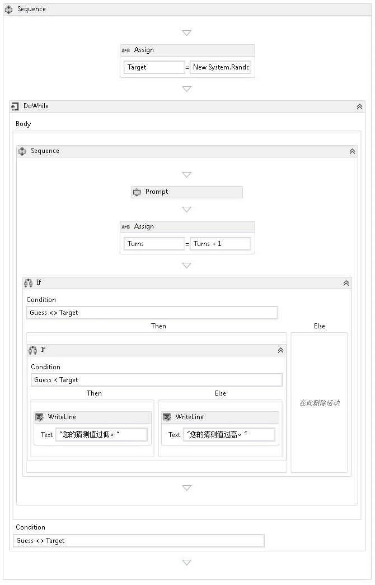

# <a name="how-to-create-a-sequential-workflow"></a><span data-ttu-id="4f3b7-102">如何：创建顺序工作流</span><span class="sxs-lookup"><span data-stu-id="4f3b7-102">How to: Create a Sequential Workflow</span></span>
<span data-ttu-id="4f3b7-103">工作流可基于内置活动以及自定义活动来构造。</span><span class="sxs-lookup"><span data-stu-id="4f3b7-103">Workflows can be constructed from built-in activities as well as from custom activities.</span></span> <span data-ttu-id="4f3b7-104">本主题将指导逐步创建如使用这两个内置的活动的工作流<xref:System.Activities.Statements.Sequence>活动，并从以前的自定义活动[如何： 创建活动](../../../docs/framework/windows-workflow-foundation/how-to-create-an-activity.md)主题。</span><span class="sxs-lookup"><span data-stu-id="4f3b7-104">This topic steps through creating a workflow that uses both built-in activities such as the <xref:System.Activities.Statements.Sequence> activity, and the custom activities from the previous [How to: Create an Activity](../../../docs/framework/windows-workflow-foundation/how-to-create-an-activity.md) topic.</span></span> <span data-ttu-id="4f3b7-105">该工作流模拟猜数游戏。</span><span class="sxs-lookup"><span data-stu-id="4f3b7-105">The workflow models a number guessing game.</span></span>  
  
> [!NOTE]
>  <span data-ttu-id="4f3b7-106">入门教程中的每个主题都依赖于前面的主题。</span><span class="sxs-lookup"><span data-stu-id="4f3b7-106">Each topic in the Getting Started tutorial depends on the previous topics.</span></span> <span data-ttu-id="4f3b7-107">若要完成本主题，必须先完成[如何： 创建活动](../../../docs/framework/windows-workflow-foundation/how-to-create-an-activity.md)。</span><span class="sxs-lookup"><span data-stu-id="4f3b7-107">To complete this topic, you must first complete [How to: Create an Activity](../../../docs/framework/windows-workflow-foundation/how-to-create-an-activity.md).</span></span>  
  
> [!NOTE]
>  <span data-ttu-id="4f3b7-108">若要下载本教程的完整的版本，请参阅[Windows Workflow Foundation (WF45)-入门教程](https://go.microsoft.com/fwlink/?LinkID=248976)。</span><span class="sxs-lookup"><span data-stu-id="4f3b7-108">To download a completed version of the tutorial, see [Windows Workflow Foundation (WF45) - Getting Started Tutorial](https://go.microsoft.com/fwlink/?LinkID=248976).</span></span>  
  
### <a name="to-create-the-workflow"></a><span data-ttu-id="4f3b7-109">创建工作流</span><span class="sxs-lookup"><span data-stu-id="4f3b7-109">To create the workflow</span></span>  
  
1.  <span data-ttu-id="4f3b7-110">右键单击**NumberGuessWorkflowActivities**中**解决方案资源管理器**，然后选择**添加**，**新项**。</span><span class="sxs-lookup"><span data-stu-id="4f3b7-110">Right-click **NumberGuessWorkflowActivities** in **Solution Explorer** and select **Add**, **New Item**.</span></span>  
  
2.  <span data-ttu-id="4f3b7-111">在中**已安装**，**常见项**节点中，选择**工作流**。</span><span class="sxs-lookup"><span data-stu-id="4f3b7-111">In the **Installed**, **Common Items** node, select **Workflow**.</span></span> <span data-ttu-id="4f3b7-112">选择**活动**从**工作流**列表。</span><span class="sxs-lookup"><span data-stu-id="4f3b7-112">Select **Activity** from the **Workflow** list.</span></span>  
  
3.  <span data-ttu-id="4f3b7-113">类型`SequentialNumberGuessWorkflow`成**名称**框，然后单击**添加**。</span><span class="sxs-lookup"><span data-stu-id="4f3b7-113">Type `SequentialNumberGuessWorkflow` into the **Name** box and click **Add**.</span></span>  
  
4.  <span data-ttu-id="4f3b7-114">拖动**序列**活动从**控制流**一部分**工具箱**放到**在此处放置活动**上的标签工作流设计图面。</span><span class="sxs-lookup"><span data-stu-id="4f3b7-114">Drag a **Sequence** activity from the **Control Flow** section of the **Toolbox** and drop it onto the **Drop activity here** label on the workflow design surface.</span></span>  
  
### <a name="to-create-the-workflow-variables-and-arguments"></a><span data-ttu-id="4f3b7-115">创建工作流变量和自变量</span><span class="sxs-lookup"><span data-stu-id="4f3b7-115">To create the workflow variables and arguments</span></span>  
  
1.  <span data-ttu-id="4f3b7-116">双击**SequentialNumberGuessWorkflow.xaml**中**解决方案资源管理器**如果未显示在设计器中，显示工作流。</span><span class="sxs-lookup"><span data-stu-id="4f3b7-116">Double-click **SequentialNumberGuessWorkflow.xaml** in **Solution Explorer** to display the workflow in the designer, if it is not already displayed.</span></span>  
  
2.  <span data-ttu-id="4f3b7-117">单击**自变量**左下角的工作流设计器，以显示**自变量**窗格。</span><span class="sxs-lookup"><span data-stu-id="4f3b7-117">Click **Arguments** in the lower-left side of the workflow designer to display the **Arguments** pane.</span></span>  
  
3.  <span data-ttu-id="4f3b7-118">单击**创建参数**。</span><span class="sxs-lookup"><span data-stu-id="4f3b7-118">Click **Create Argument**.</span></span>  
  
4.  <span data-ttu-id="4f3b7-119">类型`MaxNumber`成**名称**框中，选择**中**从**方向**下拉列表中，选择**Int32**从**自变量类型**下拉列表，然后按 ENTER 保存该自变量。</span><span class="sxs-lookup"><span data-stu-id="4f3b7-119">Type `MaxNumber` into the **Name** box, select **In** from the **Direction** drop-down list, select **Int32** from the **Argument type** drop-down list, and then press ENTER to save the argument.</span></span>  
  
5.  <span data-ttu-id="4f3b7-120">单击**创建参数**。</span><span class="sxs-lookup"><span data-stu-id="4f3b7-120">Click **Create Argument**.</span></span>  
  
6.  <span data-ttu-id="4f3b7-121">类型`Turns`成**名称**低于新添加的框`MaxNumber`参数中，选择**Out**从**方向**下拉列表中选择**Int32**从**自变量类型**下拉列表，然后按 ENTER。</span><span class="sxs-lookup"><span data-stu-id="4f3b7-121">Type `Turns` into the **Name** box that is below the newly added `MaxNumber` argument, select **Out** from the **Direction** drop-down list, select **Int32** from the **Argument type** drop-down list, and then press ENTER.</span></span>  
  
7.  <span data-ttu-id="4f3b7-122">单击**自变量**左下角的活动设计器，以关闭**自变量**窗格。</span><span class="sxs-lookup"><span data-stu-id="4f3b7-122">Click **Arguments** in the lower-left side of the activity designer to close the **Arguments** pane.</span></span>  
  
8.  <span data-ttu-id="4f3b7-123">单击**变量**左下角的工作流设计器，以显示**变量**窗格。</span><span class="sxs-lookup"><span data-stu-id="4f3b7-123">Click **Variables** in the lower-left side of the workflow designer to display the **Variables** pane.</span></span>  
  
9. <span data-ttu-id="4f3b7-124">单击**创建的变量**。</span><span class="sxs-lookup"><span data-stu-id="4f3b7-124">Click **Create Variable**.</span></span>  
  
    > [!TIP]
    >  <span data-ttu-id="4f3b7-125">如果没有**创建变量**显示框中，单击**序列**活动工作流设计器图面以将其选中。</span><span class="sxs-lookup"><span data-stu-id="4f3b7-125">If no **Create Variable** box is displayed, click the **Sequence** activity on the workflow designer surface to select it.</span></span>  
  
10. <span data-ttu-id="4f3b7-126">类型`Guess`成**名称**框中，选择**Int32**从**变量类型**下拉列表，然后按 ENTER 保存该变量。</span><span class="sxs-lookup"><span data-stu-id="4f3b7-126">Type `Guess` into the **Name** box, select **Int32** from the **Variable type** drop-down list, and then press ENTER to save the variable.</span></span>  
  
11. <span data-ttu-id="4f3b7-127">单击**创建的变量**。</span><span class="sxs-lookup"><span data-stu-id="4f3b7-127">Click **Create Variable**.</span></span>  
  
12. <span data-ttu-id="4f3b7-128">类型`Target`成**名称**框中，选择**Int32**从**变量类型**下拉列表，然后按 ENTER 保存该变量。</span><span class="sxs-lookup"><span data-stu-id="4f3b7-128">Type `Target` into the **Name** box, select **Int32** from the **Variable type** drop-down list, and then press ENTER to save the variable.</span></span>  
  
13. <span data-ttu-id="4f3b7-129">单击**变量**左下角的活动设计器，以关闭**变量**窗格。</span><span class="sxs-lookup"><span data-stu-id="4f3b7-129">Click **Variables** in the lower-left side of the activity designer to close the **Variables** pane.</span></span>  
  
### <a name="to-add-the-workflow-activities"></a><span data-ttu-id="4f3b7-130">添加工作流活动</span><span class="sxs-lookup"><span data-stu-id="4f3b7-130">To add the workflow activities</span></span>  
  
1.  <span data-ttu-id="4f3b7-131">拖动**分配**活动从**基元**一部分**工具箱**放到**序列**活动。</span><span class="sxs-lookup"><span data-stu-id="4f3b7-131">Drag an **Assign** activity from the **Primitives** section of the **Toolbox** and drop it onto the **Sequence** activity.</span></span> <span data-ttu-id="4f3b7-132">类型`Target`成**到**框中，以下表达式**输入 C# 表达式**或**输入 VB 表达式**框。</span><span class="sxs-lookup"><span data-stu-id="4f3b7-132">Type `Target` into the **To** box and the following expression into the **Enter a C# expression** or **Enter a VB expression** box.</span></span>  
  
    ```vb  
    New System.Random().Next(1, MaxNumber + 1)  
    ```  
  
    ```csharp  
    new System.Random().Next(1, MaxNumber + 1)  
    ```  
  
    > [!TIP]
    >  <span data-ttu-id="4f3b7-133">如果**工具箱**不显示窗口中，选择**工具箱**从**视图**菜单。</span><span class="sxs-lookup"><span data-stu-id="4f3b7-133">If the **Toolbox** window is not displayed, select **Toolbox** from the **View** menu.</span></span>  
  
2.  <span data-ttu-id="4f3b7-134">拖动**DoWhile**活动从**控制流**一部分**工具箱**并将其放置在工作流，以便它低于**分配**活动。</span><span class="sxs-lookup"><span data-stu-id="4f3b7-134">Drag a **DoWhile** activity from the **Control Flow** section of the **Toolbox** and drop it on the workflow so that it is below the **Assign** activity.</span></span>  
  
3.  <span data-ttu-id="4f3b7-135">将以下表达式键入**DoWhile**活动的**条件**属性值框。</span><span class="sxs-lookup"><span data-stu-id="4f3b7-135">Type the following expression into the **DoWhile** activity’s **Condition** property value box.</span></span>  
  
    ```vb  
    Guess <> Target  
    ```  
  
    ```csharp  
    Guess != Target  
    ```  
  
     <span data-ttu-id="4f3b7-136"><xref:System.Activities.Statements.DoWhile> 活动执行其子活动，然后计算其 <xref:System.Activities.Statements.DoWhile.Condition%2A>。</span><span class="sxs-lookup"><span data-stu-id="4f3b7-136">A <xref:System.Activities.Statements.DoWhile> activity executes its child activities and then evaluates its <xref:System.Activities.Statements.DoWhile.Condition%2A>.</span></span> <span data-ttu-id="4f3b7-137">如果 <xref:System.Activities.Statements.DoWhile.Condition%2A> 的计算结果为 `True`，则再次执行 <xref:System.Activities.Statements.DoWhile> 中的活动。</span><span class="sxs-lookup"><span data-stu-id="4f3b7-137">If the <xref:System.Activities.Statements.DoWhile.Condition%2A> evaluates to `True`, then the activities in the <xref:System.Activities.Statements.DoWhile> execute again.</span></span> <span data-ttu-id="4f3b7-138">在此示例中，将计算用户的猜测值，并且 <xref:System.Activities.Statements.DoWhile> 继续执行，直到猜测值正确。</span><span class="sxs-lookup"><span data-stu-id="4f3b7-138">In this example, the user’s guess is evaluated and the <xref:System.Activities.Statements.DoWhile> continues until the guess is correct.</span></span>  
  
4.  <span data-ttu-id="4f3b7-139">拖动**提示**活动从**NumberGuessWorkflowActivities**一部分**工具箱**并将其放置**DoWhile**活动从上一步。</span><span class="sxs-lookup"><span data-stu-id="4f3b7-139">Drag a **Prompt** activity from the **NumberGuessWorkflowActivities** section of the **Toolbox** and drop it in the **DoWhile** activity from the previous step.</span></span>  
  
5.  <span data-ttu-id="4f3b7-140">在中**属性窗口**，类型`"EnterGuess"`包括引号**BookmarkName**属性值框**提示**活动。</span><span class="sxs-lookup"><span data-stu-id="4f3b7-140">In the **Properties Window**, type `"EnterGuess"` including the quotes into the **BookmarkName** property value box for the **Prompt** activity.</span></span> <span data-ttu-id="4f3b7-141">类型`Guess`成**结果**属性值框中，并键入以下表达式**文本**属性框。</span><span class="sxs-lookup"><span data-stu-id="4f3b7-141">Type `Guess` into the **Result** property value box, and type the following expression into the **Text** property box.</span></span>  
  
    ```vb  
    "Please enter a number between 1 and " & MaxNumber  
    ```  
  
    ```csharp  
    "Please enter a number between 1 and " + MaxNumber  
    ```  
  
    > [!TIP]
    >  <span data-ttu-id="4f3b7-142">如果**属性窗口**未显示，选择**属性窗口**从**视图**菜单。</span><span class="sxs-lookup"><span data-stu-id="4f3b7-142">If the **Properties Window** is not displayed, select **Properties Window** from the **View** menu.</span></span>  
  
6.  <span data-ttu-id="4f3b7-143">拖动**分配**活动从**基元**部分**工具箱**并将其放置**DoWhile**活动以便它**提示**活动。</span><span class="sxs-lookup"><span data-stu-id="4f3b7-143">Drag an **Assign** activity from the **Primitives** section of the **Toolbox** and drop it in the **DoWhile** activity so that it follows the **Prompt** activity.</span></span>  
  
    > [!NOTE]
    >  <span data-ttu-id="4f3b7-144">当 drop**分配**活动，请注意如何在工作流设计器会自动添加**序列**活动，使之同时包含**提示**活动和新添加**分配**活动。</span><span class="sxs-lookup"><span data-stu-id="4f3b7-144">When you drop the **Assign** activity, note how the workflow designer automatically adds a **Sequence** activity to contain both the **Prompt** activity and the newly added **Assign** activity.</span></span>  
  
7.  <span data-ttu-id="4f3b7-145">类型`Turns`成**到**框和`Turns + 1`到**输入 C# 表达式**或**输入 VB 表达式**框。</span><span class="sxs-lookup"><span data-stu-id="4f3b7-145">Type `Turns` into the **To** box and `Turns + 1` into the **Enter a C# expression** or **Enter a VB expression** box.</span></span>  
  
8.  <span data-ttu-id="4f3b7-146">拖动**如果**活动从**控制流**部分**工具箱**并将其放置**序列**活动以便它新添加的**分配**活动。</span><span class="sxs-lookup"><span data-stu-id="4f3b7-146">Drag an **If** activity from the **Control Flow** section of the **Toolbox** and drop it in the **Sequence** activity so that it follows the newly added **Assign** activity.</span></span>  
  
9. <span data-ttu-id="4f3b7-147">将以下表达式键入**如果**活动的**条件**属性值框。</span><span class="sxs-lookup"><span data-stu-id="4f3b7-147">Type the following expression into the **If** activity’s **Condition** property value box.</span></span>  
  
    ```vb  
    Guess <> Target  
    ```  
  
    ```csharp  
    Guess != Target  
    ```  
  
10. <span data-ttu-id="4f3b7-148">将另一个**如果**活动从**控制流**一部分**工具箱**并将其放置**然后**部分中的第一个**如果**活动。</span><span class="sxs-lookup"><span data-stu-id="4f3b7-148">Drag another **If** activity from the **Control Flow** section of the **Toolbox** and drop it in the **Then** section of the first **If** activity.</span></span>  
  
11. <span data-ttu-id="4f3b7-149">以下表达式键入新添加**如果**活动的**条件**属性值框。</span><span class="sxs-lookup"><span data-stu-id="4f3b7-149">Type the following expression into the newly added **If** activity’s **Condition** property value box.</span></span>  
  
    ```
    Guess < Target  
    ```  
  
12. <span data-ttu-id="4f3b7-150">将两个**WriteLine**中的活动**基元**部分**工具箱**并将它们放这样一个都位于**然后**部分新添加**如果**活动和一个处于**Else**部分。</span><span class="sxs-lookup"><span data-stu-id="4f3b7-150">Drag two **WriteLine** activities from the **Primitives** section of the **Toolbox** and drop them so that one is in the **Then** section of the newly added **If** activity, and one is in the **Else** section.</span></span>  
  
13. <span data-ttu-id="4f3b7-151">单击**WriteLine**中的活动**然后**部分以选中它，并键入以下表达式**文本**属性值框。</span><span class="sxs-lookup"><span data-stu-id="4f3b7-151">Click the **WriteLine** activity in the **Then** section to select it, and type the following expression into the **Text** property value box.</span></span>  
  
    ```vb  
    "Your guess is too low."  
    ```  
  
14. <span data-ttu-id="4f3b7-152">单击**WriteLine**中的活动**Else**部分以选中它，并键入以下表达式**文本**属性值框。</span><span class="sxs-lookup"><span data-stu-id="4f3b7-152">Click the **WriteLine** activity in the **Else** section to select it, and type the following expression into the **Text** property value box.</span></span>  
  
    ```vb  
    "Your guess is too high."  
    ```  
  
     <span data-ttu-id="4f3b7-153">下面的示例阐释已完成的工作流。</span><span class="sxs-lookup"><span data-stu-id="4f3b7-153">The following example illustrates the completed workflow.</span></span>  
  
     <span data-ttu-id="4f3b7-154"></span><span class="sxs-lookup"><span data-stu-id="4f3b7-154"></span></span>  
  
### <a name="to-build-the-workflow"></a><span data-ttu-id="4f3b7-155">生成工作流</span><span class="sxs-lookup"><span data-stu-id="4f3b7-155">To build the workflow</span></span>  
  
1.  <span data-ttu-id="4f3b7-156">按 Ctrl+Shift+B 生成解决方案。</span><span class="sxs-lookup"><span data-stu-id="4f3b7-156">Press CTRL+SHIFT+B to build the solution.</span></span>  
  
     <span data-ttu-id="4f3b7-157">有关如何运行工作流，说明，请参阅下一主题[如何： 运行工作流](../../../docs/framework/windows-workflow-foundation/how-to-run-a-workflow.md)。</span><span class="sxs-lookup"><span data-stu-id="4f3b7-157">For instructions on how to run the workflow, please see the next topic, [How to: Run a Workflow](../../../docs/framework/windows-workflow-foundation/how-to-run-a-workflow.md).</span></span> <span data-ttu-id="4f3b7-158">如果你已完成[如何： 运行工作流](../../../docs/framework/windows-workflow-foundation/how-to-run-a-workflow.md)使用不同样式的工作流步骤并希望使用此步骤中的顺序工作流运行它，请直接跳转到[生成并运行应用程序](../../../docs/framework/windows-workflow-foundation/how-to-run-a-workflow.md#BKMK_ToRunTheApplication)一节[如何： 运行工作流](../../../docs/framework/windows-workflow-foundation/how-to-run-a-workflow.md)。</span><span class="sxs-lookup"><span data-stu-id="4f3b7-158">If you have already completed the [How to: Run a Workflow](../../../docs/framework/windows-workflow-foundation/how-to-run-a-workflow.md) step with a different style of workflow and wish to run it using the sequential workflow from this step, skip ahead to the [To build and run the application](../../../docs/framework/windows-workflow-foundation/how-to-run-a-workflow.md#BKMK_ToRunTheApplication) section of [How to: Run a Workflow](../../../docs/framework/windows-workflow-foundation/how-to-run-a-workflow.md).</span></span>  
  
## <a name="see-also"></a><span data-ttu-id="4f3b7-159">请参阅</span><span class="sxs-lookup"><span data-stu-id="4f3b7-159">See Also</span></span>  
 <xref:System.Activities.Statements.Flowchart>  
 <xref:System.Activities.Statements.FlowDecision>  
 [<span data-ttu-id="4f3b7-160">Windows Workflow Foundation 编程</span><span class="sxs-lookup"><span data-stu-id="4f3b7-160">Windows Workflow Foundation Programming</span></span>](../../../docs/framework/windows-workflow-foundation/programming.md)  
 [<span data-ttu-id="4f3b7-161">设计工作流</span><span class="sxs-lookup"><span data-stu-id="4f3b7-161">Designing Workflows</span></span>](../../../docs/framework/windows-workflow-foundation/designing-workflows.md)  
 [<span data-ttu-id="4f3b7-162">入门教程</span><span class="sxs-lookup"><span data-stu-id="4f3b7-162">Getting Started Tutorial</span></span>](../../../docs/framework/windows-workflow-foundation/getting-started-tutorial.md)  
 [<span data-ttu-id="4f3b7-163">如何：创建活动</span><span class="sxs-lookup"><span data-stu-id="4f3b7-163">How to: Create an Activity</span></span>](../../../docs/framework/windows-workflow-foundation/how-to-create-an-activity.md)  
 [<span data-ttu-id="4f3b7-164">如何：运行工作流</span><span class="sxs-lookup"><span data-stu-id="4f3b7-164">How to: Run a Workflow</span></span>](../../../docs/framework/windows-workflow-foundation/how-to-run-a-workflow.md)
