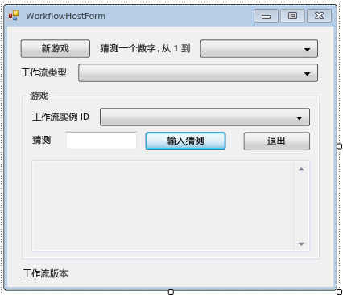

# <a name="how-to-create-and-run-a-long-running-workflow"></a>How to: Create and Run a Long Running Workflow
Windows Workflow Foundation (WF) 的主要功能之一是保留和卸载到数据库的空闲工作流运行时的功能。 中的步骤[如何： 运行工作流](../../../docs/framework/windows-workflow-foundation/how-to-run-a-workflow.md)演示工作流承载的控制台应用程序的基础知识。 示例演示了启动工作流、工作流生命周期处理程序和恢复书签。 为了有效演示工作流持久性，需要一个支持启动和恢复多个工作流实例的更为复杂的工作流主机。 教程中此步骤演示了如何创建 Windows 窗体主机应用程序，此 Windows 窗体主机应用程序支持启动和恢复多个工作流实例、工作流持久性，并为高级功能（如在后续教程步骤中演示的跟踪和版本控制）提供基础。  
  
> [!NOTE]
>  此教程步骤和后续步骤使用中的所有三个工作流类型[如何： 创建工作流](../../../docs/framework/windows-workflow-foundation/how-to-create-a-workflow.md)。 如果未完成所有三种类型可以下载完整的版本中的步骤[Windows Workflow Foundation (WF45)-入门教程](https://go.microsoft.com/fwlink/?LinkID=248976)。  
  
> [!NOTE]
>  若要下载完整的版本或观看教程视频演练，请参阅[Windows Workflow Foundation (WF45)-入门教程](https://go.microsoft.com/fwlink/?LinkID=248976)。  
  
## <a name="in-this-topic"></a>在本主题中  
  
-   [若要创建持久性数据库](../../../docs/framework/windows-workflow-foundation/how-to-create-and-run-a-long-running-workflow.md#BKMK_CreatePersistenceDatabase)  
  
-   [若要添加对 DurableInstancing 程序集的引用](../../../docs/framework/windows-workflow-foundation/how-to-create-and-run-a-long-running-workflow.md#BKMK_AddReference)  
  
-   [若要创建工作流主机窗体](../../../docs/framework/windows-workflow-foundation/how-to-create-and-run-a-long-running-workflow.md#BKMK_CreateForm)  
  
-   [若要添加的属性和帮助器方法的窗体](../../../docs/framework/windows-workflow-foundation/how-to-create-and-run-a-long-running-workflow.md#BKMK_AddHelperMethods)  
  
-   [若要配置实例存储、 工作流生命周期处理程序和扩展](../../../docs/framework/windows-workflow-foundation/how-to-create-and-run-a-long-running-workflow.md#BKMK_ConfigureWorkflowApplication)  
  
-   [若要启用启动和恢复多个工作流类型](../../../docs/framework/windows-workflow-foundation/how-to-create-and-run-a-long-running-workflow.md#BKMK_WorkflowVersionMap)  
  
-   [若要启动新工作流](../../../docs/framework/windows-workflow-foundation/how-to-create-and-run-a-long-running-workflow.md#BKMK_StartWorkflow)  
  
-   [若要恢复的工作流](../../../docs/framework/windows-workflow-foundation/how-to-create-and-run-a-long-running-workflow.md#BKMK_ResumeWorkflow)  
  
-   [终止工作流](../../../docs/framework/windows-workflow-foundation/how-to-create-and-run-a-long-running-workflow.md#BKMK_TerminateWorkflow)  
  
-   [若要生成并运行应用程序](../../../docs/framework/windows-workflow-foundation/how-to-create-and-run-a-long-running-workflow.md#BKMK_BuildAndRun)  
  
###  <a name="BKMK_CreatePersistenceDatabase"></a> 若要创建持久性数据库  
  
1.  打开 SQL Server Management Studio 并连接到本地服务器，例如 **。 \SQLEXPRESS**。 右键单击**数据库**节点，本地服务器，然后选择**新数据库**。 新数据库命名**WF45GettingStartedTutorial**，接受所有其他值，然后选择**确定**。  
  
    > [!NOTE]
    >  请确保已**Create Database**本地服务器上创建数据库前的权限。  
  
2.  选择**开放**，**文件**从**文件**菜单。 浏览到以下文件夹：`C:\Windows\Microsoft.NET\Framework\v4.0.30319\sql\en`  
  
     选择以下两个文件，然后单击**打开**。  
  
    -   SqlWorkflowInstanceStoreLogic.sql  
  
    -   SqlWorkflowInstanceStoreSchema.sql  
  
3.  选择**SqlWorkflowInstanceStoreSchema.sql**从**窗口**菜单。 絋粄**WF45GettingStartedTutorial**中选择**可用数据库**下拉列表中，选择**Execute**从**查询**菜单。  
  
4.  选择**SqlWorkflowInstanceStoreLogic.sql**从**窗口**菜单。 絋粄**WF45GettingStartedTutorial**中选择**可用数据库**下拉列表中，选择**Execute**从**查询**菜单。  
  
    > [!WARNING]
    >  请务必按正确顺序执行前面两个步骤。 如果不按顺序执行查询，系统会发生错误，并且持久性数据库会配置不正确。  
  
###  <a name="BKMK_AddReference"></a> 若要添加对 DurableInstancing 程序集的引用  
  
1.  右键单击**NumberGuessWorkflowHost**中**解决方案资源管理器**，然后选择**添加引用**。  
  
2.  选择**程序集**从**添加引用**列表中，然后键入`DurableInstancing`到**搜索程序集**框。 这将筛选程序集，使您更易于选择所需引用。  
  
3.  旁边的复选框**System.Activities.DurableInstancing**并**System.Runtime.DurableInstancing**从**搜索结果**列表，然后单击**确定**。  
  
###  <a name="BKMK_CreateForm"></a> 若要创建工作流主机窗体  
  
> [!NOTE]
>  此过程中的步骤描述了如何手动添加和配置窗体。 如果需要，您可以下载教程的解决方案文件并将完成后的窗体添加到项目。 若要下载教程文件，请参阅[Windows Workflow Foundation (WF45)-入门教程](https://go.microsoft.com/fwlink/?LinkID=248976)。 一旦下载文件，右键单击**NumberGuessWorkflowHost** ，然后选择**添加引用**。 添加对的引用**System.Windows.Forms**并**System.Drawing**。 如果添加新的窗体中，将自动添加这些引用**外**，**新项**菜单中，但导入窗体时必须手动添加。 添加引用后，右键单击**NumberGuessWorkflowHost**中**解决方案资源管理器**，然后选择**添加**，**现有项**。 浏览到`Form`文件夹中的项目文件，选择**WorkflowHostForm.cs** (或**WorkflowHostForm.vb**)，然后单击**添加**。 如果您选择导入窗体，则可以跳到下一节[若要添加的属性和帮助器方法的窗体](../../../docs/framework/windows-workflow-foundation/how-to-create-and-run-a-long-running-workflow.md#BKMK_AddHelperMethods)。  
  
1.  右键单击**NumberGuessWorkflowHost**中**解决方案资源管理器**，然后选择**添加**，**新项**。  
  
2.  在中**已安装**模板列表中，选择**Windows 窗体**，类型`WorkflowHostForm`中**名称**框中，然后单击**添加**。  
  
3.  在窗体上配置以下属性。  
  
    |属性|值|  
    |--------------|-----------|  
    |FormBorderStyle|FixedSingle|  
    |MaximizeBox|False|  
    |大小|400, 420|  
  
4.  按照指定顺序将以下控件添加到窗体，并根据指示配置这些属性。  
  
    |控件|属性： 值|  
    |-------------|---------------------|  
    |**Button**|名称： NewGame<br /><br /> 位置： 13、 13<br /><br /> 大小： 75 23<br /><br /> 文本： 新游戏|  
    |**标签**|位置： 94、 18<br /><br /> 文本： 猜测一个数字，从 1 到|  
    |**组合框**|名称： NumberRange<br /><br /> DropDownStyle: DropDownList<br /><br /> 项： 10、 100、 1000<br /><br /> 位置： 228、 12<br /><br /> 大小： 143、 21|  
    |**标签**|位置： 13、 43<br /><br /> 文本： 工作流类型|  
    |**组合框**|名称： WorkflowType<br /><br /> DropDownStyle: DropDownList<br /><br /> 项： StateMachineNumberGuessWorkflow，FlowchartNumberGuessWorkflow，SequentialNumberGuessWorkflow<br /><br /> 位置： 94 40<br /><br /> 大小： 277、 21|  
    |**标签**|名称： WorkflowVersion<br /><br /> 位置： 13、 362<br /><br /> 文本： 工作流版本|  
    |**GroupBox**|位置： 13 67<br /><br /> 大小： 358、 287<br /><br /> 文本： 游戏|  
  
    > [!NOTE]
    >  在添加以下控件时，请将其放入 GroupBox。  
  
    |控件|属性： 值|  
    |-------------|---------------------|  
    |**标签**|位置： 7、 20<br /><br /> 文本： 工作流实例 Id|  
    |**组合框**|名称： InstanceId<br /><br /> DropDownStyle: DropDownList<br /><br /> 位置： 121、 17<br /><br /> 大小： 227、 21|  
    |**标签**|位置： 7、 47<br /><br /> 文本： 猜测|  
    |**文本框**|名称： 猜测<br /><br /> 位置： 50 44<br /><br /> 大小： 65 20|  
    |**Button**|名称： EnterGuess<br /><br /> 位置： 121、 42<br /><br /> 大小： 75 23<br /><br /> 文本： 输入猜测|  
    |**Button**|名称： QuitGame<br /><br /> 位置： 274、 42<br /><br /> 大小： 75 23<br /><br /> 文本： 退出|  
    |**文本框**|名称： 工作流状态<br /><br /> 位置： 10、 73<br /><br /> 多行： True<br /><br /> ReadOnly: True<br /><br /> 滚动条： 垂直<br /><br /> 大小： 338、 208|  
  
5.  设置**AcceptButton**到窗体的属性**EnterGuess**。  
  
 以下示例展示了完成的窗体。  
  
   
  
###  <a name="BKMK_AddHelperMethods"></a> 若要添加的属性和帮助器方法的窗体  
 本节的步骤将属性和帮助器添加至窗体类，此窗体类将配置窗体的 UI，以支持运行和恢复数字猜测工作流。  
  
1.  右键单击**WorkflowHostForm**中**解决方案资源管理器**，然后选择**查看代码**。  
  
2.  在包含其他 `using`（或 `Imports`）语句的文件的顶部添加以下 `using`（或 `Imports`）语句。  
  
    ```vb  
    Imports System.Windows.Forms  
    Imports System.Activities.DurableInstancing  
    Imports System.Activities  
    Imports System.Data.SqlClient  
    Imports System.IO  
    ```  
  
    ```csharp  
    using System.Windows.Forms;  
    using System.Activities.DurableInstancing;  
    using System.Activities;  
    using System.Data.SqlClient;  
    using System.IO;  
    ```  
  
3.  添加到以下成员声明**WorkflowHostForm**类。  
  
    ```vb  
    Const connectionString = "Server=.\SQLEXPRESS;Initial Catalog=WF45GettingStartedTutorial;Integrated Security=SSPI"  
    Dim store As SqlWorkflowInstanceStore  
    Dim WorkflowStarting As Boolean  
    ```  
  
    ```csharp  
    const string connectionString = "Server=.\\SQLEXPRESS;Initial Catalog=WF45GettingStartedTutorial;Integrated Security=SSPI";  
    SqlWorkflowInstanceStore store;  
    bool WorkflowStarting;  
    ```  
  
    > [!NOTE]
    >  如果您的连接字符串不同，请更新 `connectionString` 引用数据库。  
  
4.  将 `WorkflowInstanceId` 属性添加到 `WorkflowFormHost` 类中。  
  
    ```vb  
    Public ReadOnly Property WorkflowInstanceId() As Guid  
        Get  
            If InstanceId.SelectedIndex = -1 Then  
                Return Guid.Empty  
            Else  
                Return New Guid(InstanceId.SelectedItem.ToString())  
            End If  
        End Get  
    End Property  
    ```  
  
    ```csharp  
    public Guid WorkflowInstanceId  
    {  
        get  
        {  
            return InstanceId.SelectedIndex == -1 ? Guid.Empty : (Guid)InstanceId.SelectedItem;  
        }  
    }  
    ```  
  
     `InstanceId`组合框显示的持久化工作流实例 id 的列表和`WorkflowInstanceId`属性返回当前所选的工作流。  
  
5.  为窗体 `Load` 事件添加处理程序。 若要添加处理程序，请切换到**设计视图**窗体中，单击**事件**顶部的图标**属性**窗口中，然后双击**负载**.  
  
    ```vb  
    Private Sub WorkflowHostForm_Load(sender As Object, e As EventArgs) Handles Me.Load  
  
    End Sub  
    ```  
  
    ```csharp  
    private void WorkflowHostForm_Load(object sender, EventArgs e)  
    {  
  
    }  
    ```  
  
6.  将下列代码添加到 `WorkflowHostForm_Load`。  
  
    ```vb  
    'Initialize the store and configure it so that it can be used for  
    'multiple WorkflowApplication instances.  
    store = New SqlWorkflowInstanceStore(connectionString)  
    WorkflowApplication.CreateDefaultInstanceOwner(store, Nothing, WorkflowIdentityFilter.Any)  
  
    'Set default ComboBox selections.  
    NumberRange.SelectedIndex = 0  
    WorkflowType.SelectedIndex = 0  
  
    ListPersistedWorkflows()  
    ```  
  
    ```csharp  
    // Initialize the store and configure it so that it can be used for  
    // multiple WorkflowApplication instances.  
    store = new SqlWorkflowInstanceStore(connectionString);  
    WorkflowApplication.CreateDefaultInstanceOwner(store, null, WorkflowIdentityFilter.Any);  
  
    // Set default ComboBox selections.  
    NumberRange.SelectedIndex = 0;  
    WorkflowType.SelectedIndex = 0;  
  
    ListPersistedWorkflows();  
    ```  
  
     窗体加载时，将配置 `SqlWorkflowInstanceStore`，范围和工作流类型组合框将设置为默认值，持久性工作流实例将添加到 `InstanceId` 组合框。  
  
7.  为 `SelectedIndexChanged` 添加 `InstanceId` 处理程序。 若要添加处理程序，请切换到**设计视图**窗体中，选择`InstanceId`组合框中，单击**事件**顶部的图标**属性**窗口中，并双击**SelectedIndexChanged**。  
  
    ```vb  
    Private Sub InstanceId_SelectedIndexChanged(sender As Object, e As EventArgs) Handles InstanceId.SelectedIndexChanged  
  
    End Sub  
    ```  
  
    ```csharp  
    private void InstanceId_SelectedIndexChanged(object sender, EventArgs e)  
    {  
  
    }  
    ```  
  
8.  将下列代码添加到 `InstanceId_SelectedIndexChanged`。 只要用户使用组合框选择一个工作流，此处理程序就会更新状态窗口。  
  
    ```vb  
    If InstanceId.SelectedIndex = -1 Then  
        Return  
    End If  
  
    'Clear the status window.  
    WorkflowStatus.Clear()  
  
    'Get the workflow version and display it.  
    'If the workflow is just starting then this info will not  
    'be available in the persistence store so do not try and retrieve it.  
    If Not WorkflowStarting Then  
        Dim instance As WorkflowApplicationInstance = _  
            WorkflowApplication.GetInstance(WorkflowInstanceId, store)  
  
        WorkflowVersion.Text = _  
            WorkflowVersionMap.GetIdentityDescription(instance.DefinitionIdentity)  
  
        'Unload the instance.  
        instance.Abandon()  
    End If  
    ```  
  
    ```csharp  
    if (InstanceId.SelectedIndex == -1)  
    {  
        return;  
    }  
  
    // Clear the status window.  
    WorkflowStatus.Clear();  
  
    // Get the workflow version and display it.  
    // If the workflow is just starting then this info will not  
    // be available in the persistence store so do not try and retrieve it.  
    if (!WorkflowStarting)  
    {  
        WorkflowApplicationInstance instance =  
            WorkflowApplication.GetInstance(this.WorkflowInstanceId, store);  
  
        WorkflowVersion.Text =  
            WorkflowVersionMap.GetIdentityDescription(instance.DefinitionIdentity);  
  
        // Unload the instance.  
        instance.Abandon();  
    }  
    ```  
  
9. 将下面的 `ListPersistedWorkflows` 方法添加到窗体类中。  
  
    ```vb  
    Private Sub ListPersistedWorkflows()  
        Using localCon As New SqlConnection(connectionString)  
            Dim localCmd As String = _  
                "Select [InstanceId] from [System.Activities.DurableInstancing].[Instances] Order By [CreationTime]"  
  
            Dim cmd As SqlCommand = localCon.CreateCommand()  
            cmd.CommandText = localCmd  
            localCon.Open()  
            Using reader As SqlDataReader = cmd.ExecuteReader(CommandBehavior.CloseConnection)  
  
                While (reader.Read())  
                    'Get the InstanceId of the persisted Workflow.  
                    Dim id As Guid = Guid.Parse(reader(0).ToString())  
                    InstanceId.Items.Add(id)  
                End While  
            End Using  
        End Using  
    End Sub  
    ```  
  
    ```csharp  
    using (SqlConnection localCon = new SqlConnection(connectionString))  
    {  
        string localCmd =  
            "Select [InstanceId] from [System.Activities.DurableInstancing].[Instances] Order By [CreationTime]";  
  
        SqlCommand cmd = localCon.CreateCommand();  
        cmd.CommandText = localCmd;  
        localCon.Open();  
        using (SqlDataReader reader = cmd.ExecuteReader(CommandBehavior.CloseConnection))  
        {  
            while (reader.Read())  
            {  
                // Get the InstanceId of the persisted Workflow  
                Guid id = Guid.Parse(reader[0].ToString());  
                InstanceId.Items.Add(id);  
            }  
        }  
    }  
    ```  
  
     `ListPersistedWorkflows` 查询持久性工作流实例的实例存储，并将实例 ID 添加到 `cboInstanceId` 组合框。  
  
10. 将下面的 `UpdateStatus` 方法和对应的委托添加到窗体类中。 此方法使用当前正在运行的工作流的状态来更新窗体上的状态窗口。  
  
    ```vb  
    Private Delegate Sub UpdateStatusDelegate(msg As String)  
    Public Sub UpdateStatus(msg As String)  
        'We may be on a different thread so we need to  
        'make this call using BeginInvoke.  
        If InvokeRequired Then  
            BeginInvoke(New UpdateStatusDelegate(AddressOf UpdateStatus), msg)  
        Else  
            If Not msg.EndsWith(vbCrLf) Then  
                msg = msg & vbCrLf  
            End If  
  
            WorkflowStatus.AppendText(msg)  
  
            'Ensure that the newly added status is visible.  
            WorkflowStatus.SelectionStart = WorkflowStatus.Text.Length  
            WorkflowStatus.ScrollToCaret()  
        End If  
    End Sub  
    ```  
  
    ```csharp  
    private delegate void UpdateStatusDelegate(string msg);  
    public void UpdateStatus(string msg)  
    {  
        // We may be on a different thread so we need to  
        // make this call using BeginInvoke.  
        if (InvokeRequired)  
        {  
            BeginInvoke(new UpdateStatusDelegate(UpdateStatus), msg);  
        }  
        else  
        {  
            if (!msg.EndsWith("\r\n"))  
            {  
                msg += "\r\n";  
            }  
            WorkflowStatus.AppendText(msg);  
  
            WorkflowStatus.SelectionStart = WorkflowStatus.Text.Length;  
            WorkflowStatus.ScrollToCaret();  
        }  
    }  
    ```  
  
11. 将下面的 `GameOver` 方法和对应的委托添加到窗体类中。 工作流完成后，此方法更新窗体用户界面通过删除已完成的工作流的实例 id 从**InstanceId**组合框。  
  
    ```vb  
    Private Delegate Sub GameOverDelegate()  
    Private Sub GameOver()  
        If InvokeRequired Then  
            BeginInvoke(New GameOverDelegate(AddressOf GameOver))  
        Else  
            'Remove this instance from the InstanceId combo box.  
            InstanceId.Items.Remove(InstanceId.SelectedItem)  
            InstanceId.SelectedIndex = -1  
        End If  
    End Sub  
    ```  
  
    ```csharp  
    private delegate void GameOverDelegate();  
    private void GameOver()  
    {  
        if (InvokeRequired)  
        {  
            BeginInvoke(new GameOverDelegate(GameOver));  
        }  
        else  
        {  
            // Remove this instance from the combo box  
            InstanceId.Items.Remove(InstanceId.SelectedItem);  
            InstanceId.SelectedIndex = -1;  
        }  
    }  
    ```  
  
###  <a name="BKMK_ConfigureWorkflowApplication"></a> 若要配置实例存储、 工作流生命周期处理程序和扩展  
  
1.  向窗体类添加 `ConfigureWorkflowApplication` 方法。  
  
    ```vb  
    Private Sub ConfigureWorkflowApplication(wfApp As WorkflowApplication)  
  
    End Sub  
    ```  
  
    ```csharp  
    private void ConfigureWorkflowApplication(WorkflowApplication wfApp)  
    {      
    }  
    ```  
  
     此方法配置 `WorkflowApplication`、添加所需扩展并添加工作流生命周期事件的处理程序。  
  
2.  在 `ConfigureWorkflowApplication` 中，指定 `SqlWorkflowInstanceStore` 的 `WorkflowApplication`。  
  
    ```vb  
    'Configure the persistence store.  
    wfApp.InstanceStore = store  
    ```  
  
    ```csharp  
    // Configure the persistence store.  
    wfApp.InstanceStore = store;  
    ```  
  
3.  接下来，创建一个 `StringWriter` 实例，并将它添加到 `Extensions` 的 `WorkflowApplication` 集合中。 当`StringWriter`添加到扩展它会捕获所有`WriteLine`活动输出。 当工作流进入空闲状态时，`WriteLine` 输出可从 `StringWriter` 提取并显示在窗体上。  
  
    ```vb  
    'Add a StringWriter to the extensions. This captures the output  
    'from the WriteLine activities so we can display it in the form.  
    Dim sw As New StringWriter()  
    wfApp.Extensions.Add(sw)  
    ```  
  
    ```csharp  
    // Add a StringWriter to the extensions. This captures the output  
    // from the WriteLine activities so we can display it in the form.  
    StringWriter sw = new StringWriter();  
    wfApp.Extensions.Add(sw);  
    ```  
  
4.  为 `Completed` 事件添加以下处理程序。 在工作流成功完成时，执行猜测数字的轮数会显示到状态窗口。 如果工作流终止，系统会显示导致终止的异常信息。 在处理程序结尾处调用了 `GameOver` 方法，该方法从工作流列表中删除已完成的工作流。  
  
    ```vb  
    wfApp.Completed = _  
        Sub(e As WorkflowApplicationCompletedEventArgs)  
            If e.CompletionState = ActivityInstanceState.Faulted Then  
                UpdateStatus(String.Format("Workflow Terminated. Exception: {0}" & vbCrLf & "{1}", _  
                    e.TerminationException.GetType().FullName, _  
                    e.TerminationException.Message))  
            ElseIf e.CompletionState = ActivityInstanceState.Canceled Then  
                UpdateStatus("Workflow Canceled.")  
            Else  
                Dim Turns As Integer = Convert.ToInt32(e.Outputs("Turns"))  
                UpdateStatus(String.Format("Congratulations, you guessed the number in {0} turns.", Turns))  
            End If  
            GameOver()  
        End Sub  
    ```  
  
    ```csharp  
    wfApp.Completed = delegate(WorkflowApplicationCompletedEventArgs e)  
    {  
        if (e.CompletionState == ActivityInstanceState.Faulted)  
        {  
            UpdateStatus(string.Format("Workflow Terminated. Exception: {0}\r\n{1}",  
                e.TerminationException.GetType().FullName,  
                e.TerminationException.Message));  
        }  
        else if (e.CompletionState == ActivityInstanceState.Canceled)  
        {  
            UpdateStatus("Workflow Canceled.");  
        }  
        else  
        {  
            int Turns = Convert.ToInt32(e.Outputs["Turns"]);  
            UpdateStatus(string.Format("Congratulations, you guessed the number in {0} turns.", Turns));  
        }  
        GameOver();  
    };  
    ```  
  
5.  添加以下 `Aborted` 和 `OnUnhandledException` 处理程序。 `GameOver` 方法不从 `Aborted` 处理程序中调用，因为在工作流实例中止时，它并未终止，且以后可能恢复实例。  
  
    ```vb  
    wfApp.Aborted = _  
        Sub(e As WorkflowApplicationAbortedEventArgs)  
            UpdateStatus(String.Format("Workflow Aborted. Exception: {0}" & vbCrLf & "{1}", _  
                e.Reason.GetType().FullName, _  
                e.Reason.Message))  
        End Sub  
  
    wfApp.OnUnhandledException = _  
        Function(e As WorkflowApplicationUnhandledExceptionEventArgs)  
            UpdateStatus(String.Format("Unhandled Exception: {0}" & vbCrLf & "{1}", _  
                e.UnhandledException.GetType().FullName, _  
                e.UnhandledException.Message))  
            GameOver()  
            Return UnhandledExceptionAction.Terminate  
        End Function  
    ```  
  
    ```csharp  
    wfApp.Aborted = delegate(WorkflowApplicationAbortedEventArgs e)  
    {  
        UpdateStatus(string.Format("Workflow Aborted. Exception: {0}\r\n{1}",  
                e.Reason.GetType().FullName,  
                e.Reason.Message));  
    };  
  
    wfApp.OnUnhandledException = delegate(WorkflowApplicationUnhandledExceptionEventArgs e)  
    {  
        UpdateStatus(string.Format("Unhandled Exception: {0}\r\n{1}",  
                e.UnhandledException.GetType().FullName,  
                e.UnhandledException.Message));  
        GameOver();  
        return UnhandledExceptionAction.Terminate;  
    };  
    ```  
  
6.  添加以下 `PersistableIdle` 处理程序。 此处理程序检索添加的 `StringWriter` 扩展，提取 `WriteLine` 活动的输出，并将它显示在状态窗口中。  
  
    ```vb  
    wfApp.PersistableIdle = _  
        Function(e As WorkflowApplicationIdleEventArgs)  
            'Send the current WriteLine outputs to the status window.  
            Dim writers = e.GetInstanceExtensions(Of StringWriter)()  
            For Each writer In writers  
                UpdateStatus(writer.ToString())  
            Next  
            Return PersistableIdleAction.Unload  
        End Function  
    ```  
  
    ```csharp  
    wfApp.PersistableIdle = delegate(WorkflowApplicationIdleEventArgs e)  
    {  
        // Send the current WriteLine outputs to the status window.  
        var writers = e.GetInstanceExtensions<StringWriter>();  
        foreach (var writer in writers)  
        {  
            UpdateStatus(writer.ToString());  
        }  
        return PersistableIdleAction.Unload;  
    };  
    ```  
  
     <xref:System.Activities.PersistableIdleAction> 枚举有三个值：<xref:System.Activities.PersistableIdleAction.None>、 <xref:System.Activities.PersistableIdleAction.Persist> 和 <xref:System.Activities.PersistableIdleAction.Unload>。 <xref:System.Activities.PersistableIdleAction.Persist> 会导致工作流持久保存，但不会导致工作流卸载。 <xref:System.Activities.PersistableIdleAction.Unload> 会导致工作流持久保存并卸载。  
  
     以下示例是完成的 `ConfigureWorkflowApplication` 方法。  
  
    ```vb  
    Private Sub ConfigureWorkflowApplication(wfApp As WorkflowApplication)  
        'Configure the persistence store.  
        wfApp.InstanceStore = store  
  
        'Add a StringWriter to the extensions. This captures the output  
        'from the WriteLine activities so we can display it in the form.  
        Dim sw As New StringWriter()  
        wfApp.Extensions.Add(sw)  
  
        wfApp.Completed = _  
            Sub(e As WorkflowApplicationCompletedEventArgs)  
                If e.CompletionState = ActivityInstanceState.Faulted Then  
                    UpdateStatus(String.Format("Workflow Terminated. Exception: {0}" & vbCrLf & "{1}", _  
                        e.TerminationException.GetType().FullName, _  
                        e.TerminationException.Message))  
                ElseIf e.CompletionState = ActivityInstanceState.Canceled Then  
                    UpdateStatus("Workflow Canceled.")  
                Else  
                    Dim Turns As Integer = Convert.ToInt32(e.Outputs("Turns"))  
                    UpdateStatus(String.Format("Congratulations, you guessed the number in {0} turns.", Turns))  
                End If  
                GameOver()  
            End Sub  
  
        wfApp.Aborted = _  
            Sub(e As WorkflowApplicationAbortedEventArgs)  
                UpdateStatus(String.Format("Workflow Aborted. Exception: {0}" & vbCrLf & "{1}", _  
                    e.Reason.GetType().FullName, _  
                    e.Reason.Message))  
            End Sub  
  
        wfApp.OnUnhandledException = _  
            Function(e As WorkflowApplicationUnhandledExceptionEventArgs)  
                UpdateStatus(String.Format("Unhandled Exception: {0}" & vbCrLf & "{1}", _  
                    e.UnhandledException.GetType().FullName, _  
                    e.UnhandledException.Message))  
                GameOver()  
                Return UnhandledExceptionAction.Terminate  
            End Function  
  
        wfApp.PersistableIdle = _  
            Function(e As WorkflowApplicationIdleEventArgs)  
                'Send the current WriteLine outputs to the status window.  
                Dim writers = e.GetInstanceExtensions(Of StringWriter)()  
                For Each writer In writers  
                    UpdateStatus(writer.ToString())  
                Next  
                Return PersistableIdleAction.Unload  
            End Function  
    End Sub  
    ```  
  
    ```csharp  
    private void ConfigureWorkflowApplication(WorkflowApplication wfApp)  
    {  
        // Configure the persistence store.  
        wfApp.InstanceStore = store;  
  
        // Add a StringWriter to the extensions. This captures the output  
        // from the WriteLine activities so we can display it in the form.  
        StringWriter sw = new StringWriter();  
        wfApp.Extensions.Add(sw);  
  
        wfApp.Completed = delegate(WorkflowApplicationCompletedEventArgs e)  
        {  
            if (e.CompletionState == ActivityInstanceState.Faulted)  
            {  
                UpdateStatus(string.Format("Workflow Terminated. Exception: {0}\r\n{1}",  
                    e.TerminationException.GetType().FullName,  
                    e.TerminationException.Message));  
            }  
            else if (e.CompletionState == ActivityInstanceState.Canceled)  
            {  
                UpdateStatus("Workflow Canceled.");  
            }  
            else  
            {  
                int Turns = Convert.ToInt32(e.Outputs["Turns"]);  
                UpdateStatus(string.Format("Congratulations, you guessed the number in {0} turns.", Turns));  
            }  
            GameOver();  
        };  
  
        wfApp.Aborted = delegate(WorkflowApplicationAbortedEventArgs e)  
        {  
            UpdateStatus(string.Format("Workflow Aborted. Exception: {0}\r\n{1}",  
                    e.Reason.GetType().FullName,  
                    e.Reason.Message));  
        };  
  
        wfApp.OnUnhandledException = delegate(WorkflowApplicationUnhandledExceptionEventArgs e)  
        {  
            UpdateStatus(string.Format("Unhandled Exception: {0}\r\n{1}",  
                    e.UnhandledException.GetType().FullName,  
                    e.UnhandledException.Message));  
            GameOver();  
            return UnhandledExceptionAction.Terminate;  
        };  
  
        wfApp.PersistableIdle = delegate(WorkflowApplicationIdleEventArgs e)  
        {  
            // Send the current WriteLine outputs to the status window.  
            var writers = e.GetInstanceExtensions<StringWriter>();  
            foreach (var writer in writers)  
            {  
                UpdateStatus(writer.ToString());  
            }  
            return PersistableIdleAction.Unload;  
        };  
    }  
    ```  
  
###  <a name="BKMK_WorkflowVersionMap"></a> 若要启用启动和恢复多个工作流类型  
 要恢复工作流实例，主机必须提供工作流定义。 在此教程中有三个工作流类型，且后续教程步骤会介绍这些类型的多个版本。 主机应用程序可通过 `WorkflowIdentity` 将标识信息与持久化工作流实例相关联。 本节中的步骤演示了如何创建一个实用工具类，以帮助将工作流标识从持久化工作流实例映射到对应的工作流定义。 有关详细信息`WorkflowIdentity`和版本控制，请参阅[使用 WorkflowIdentity 和版本控制](../../../docs/framework/windows-workflow-foundation/using-workflowidentity-and-versioning.md)。  
  
1.  右键单击**NumberGuessWorkflowHost**中**解决方案资源管理器**，然后选择**添加**，**类**。 类型`WorkflowVersionMap`成**名称**框，然后单击**添加**。  
  
2.  在包含其他 `using` 或 `Imports` 语句的文件的顶部添加以下 `using` 或 `Imports` 语句。  
  
    ```vb  
    Imports NumberGuessWorkflowActivities  
    Imports System.Activities  
    ```  
  
    ```csharp  
    using NumberGuessWorkflowActivities;  
    using System.Activities;  
    ```  
  
3.  使用以下声明替换 `WorkflowVersionMap` 类声明。  
  
    ```vb  
    Public Module WorkflowVersionMap  
        Dim map As Dictionary(Of WorkflowIdentity, Activity)  
  
        'Current version identities.  
        Public StateMachineNumberGuessIdentity As WorkflowIdentity  
        Public FlowchartNumberGuessIdentity As WorkflowIdentity  
        Public SequentialNumberGuessIdentity As WorkflowIdentity  
  
        Sub New()  
            map = New Dictionary(Of WorkflowIdentity, Activity)  
  
            'Add the current workflow version identities.  
            StateMachineNumberGuessIdentity = New WorkflowIdentity With  
            {  
                .Name = "StateMachineNumberGuessWorkflow",  
                .Version = New Version(1, 0, 0, 0)  
            }  
  
            FlowchartNumberGuessIdentity = New WorkflowIdentity With  
            {  
                .Name = "FlowchartNumberGuessWorkflow",  
                .Version = New Version(1, 0, 0, 0)  
            }  
  
            SequentialNumberGuessIdentity = New WorkflowIdentity With  
            {  
                .Name = "SequentialNumberGuessWorkflow",  
                .Version = New Version(1, 0, 0, 0)  
            }  
  
            map.Add(StateMachineNumberGuessIdentity, New StateMachineNumberGuessWorkflow())  
            map.Add(FlowchartNumberGuessIdentity, New FlowchartNumberGuessWorkflow())  
            map.Add(SequentialNumberGuessIdentity, New SequentialNumberGuessWorkflow())  
        End Sub  
  
        Public Function GetWorkflowDefinition(identity As WorkflowIdentity) As Activity  
            Return map(identity)  
        End Function  
  
        Public Function GetIdentityDescription(identity As WorkflowIdentity) As String  
            Return identity.ToString()  
        End Function  
    End Module  
    ```  
  
    ```csharp  
    public static class WorkflowVersionMap  
    {  
        static Dictionary<WorkflowIdentity, Activity> map;  
  
        // Current version identities.  
        static public WorkflowIdentity StateMachineNumberGuessIdentity;  
        static public WorkflowIdentity FlowchartNumberGuessIdentity;  
        static public WorkflowIdentity SequentialNumberGuessIdentity;  
  
        static WorkflowVersionMap()  
        {  
            map = new Dictionary<WorkflowIdentity, Activity>();  
  
            // Add the current workflow version identities.  
            StateMachineNumberGuessIdentity = new WorkflowIdentity  
            {  
                Name = "StateMachineNumberGuessWorkflow",  
                Version = new Version(1, 0, 0, 0)  
            };  
  
            FlowchartNumberGuessIdentity = new WorkflowIdentity  
            {  
                Name = "FlowchartNumberGuessWorkflow",  
                Version = new Version(1, 0, 0, 0)  
            };  
  
            SequentialNumberGuessIdentity = new WorkflowIdentity  
            {  
                Name = "SequentialNumberGuessWorkflow",  
                Version = new Version(1, 0, 0, 0)  
            };  
  
            map.Add(StateMachineNumberGuessIdentity, new StateMachineNumberGuessWorkflow());  
            map.Add(FlowchartNumberGuessIdentity, new FlowchartNumberGuessWorkflow());  
            map.Add(SequentialNumberGuessIdentity, new SequentialNumberGuessWorkflow());  
        }  
  
        public static Activity GetWorkflowDefinition(WorkflowIdentity identity)  
        {  
            return map[identity];  
        }  
  
        public static string GetIdentityDescription(WorkflowIdentity identity)  
        {          
            return identity.ToString();  
       }  
    }  
    ```  
  
     `WorkflowVersionMap` 包含与此教程中的三个工作流定义对应的三个工作流标识，并在以下各节中工作流启动和恢复时使用。  
  
###  <a name="BKMK_StartWorkflow"></a> 若要启动新工作流  
  
1.  为 `Click` 添加 `NewGame` 处理程序。 若要添加处理程序，请切换到**设计视图**的窗体，然后双击`NewGame`。 此时将添加 `NewGame_Click` 处理程序，视图将切换为窗体的代码视图。 每当用户单击此按钮时，就会启动新工作流。  
  
    ```vb  
    Private Sub NewGame_Click(sender As Object, e As EventArgs) Handles NewGame.Click  
  
    End Sub  
    ```  
  
    ```csharp  
    private void NewGame_Click(object sender, EventArgs e)  
    {  
  
    }  
    ```  
  
2.  将以下代码添加到 click 处理程序。 此代码创建工作流输入参数的字典，以变量名称作为键。 此字典有一个条目，其中包含从范围组合框检索到的随机生成的数字范围。  
  
    ```vb  
    Dim inputs As New Dictionary(Of String, Object)()  
    inputs.Add("MaxNumber", Convert.ToInt32(NumberRange.SelectedItem))  
    ```  
  
    ```csharp  
    var inputs = new Dictionary<string, object>();  
    inputs.Add("MaxNumber", Convert.ToInt32(NumberRange.SelectedItem));  
    ```  
  
3.  接下来，添加以下用于启动工作流的代码。 对应于所选工作流类型的 `WorkflowIdentity` 和工作流定义通过 `WorkflowVersionMap` 帮助器类进行检索。 接下来，将使用工作流定义、`WorkflowApplication` 和输入变量字典创建新的 `WorkflowIdentity` 实例。  
  
    ```vb  
    Dim identity As WorkflowIdentity = Nothing  
    Select Case WorkflowType.SelectedItem.ToString()  
        Case "SequentialNumberGuessWorkflow"  
            identity = WorkflowVersionMap.SequentialNumberGuessIdentity  
  
        Case "StateMachineNumberGuessWorkflow"  
            identity = WorkflowVersionMap.StateMachineNumberGuessIdentity  
  
        Case "FlowchartNumberGuessWorkflow"  
            identity = WorkflowVersionMap.FlowchartNumberGuessIdentity  
    End Select  
  
    Dim wf As Activity = WorkflowVersionMap.GetWorkflowDefinition(identity)  
  
    Dim wfApp = New WorkflowApplication(wf, inputs, identity)  
    ```  
  
    ```csharp  
    WorkflowIdentity identity = null;  
    switch (WorkflowType.SelectedItem.ToString())  
    {  
        case "SequentialNumberGuessWorkflow":  
            identity = WorkflowVersionMap.SequentialNumberGuessIdentity;  
            break;  
  
        case "StateMachineNumberGuessWorkflow":  
            identity = WorkflowVersionMap.StateMachineNumberGuessIdentity;  
            break;  
  
        case "FlowchartNumberGuessWorkflow":  
            identity = WorkflowVersionMap.FlowchartNumberGuessIdentity;  
            break;  
    };  
  
    Activity wf = WorkflowVersionMap.GetWorkflowDefinition(identity);  
  
    WorkflowApplication wfApp = new WorkflowApplication(wf, inputs, identity);  
    ```  
  
4.  接下来，添加以下代码，此代码将工作流添加到工作流列表中，并在窗体上显示工作流的版本信息。  
  
    ```vb  
    'Add the workflow to the list and display the version information.  
    WorkflowStarting = True  
    InstanceId.SelectedIndex = InstanceId.Items.Add(wfApp.Id)  
    WorkflowVersion.Text = identity.ToString()  
    WorkflowStarting = False  
    ```  
  
    ```csharp  
    // Add the workflow to the list and display the version information.  
    WorkflowStarting = true;  
    InstanceId.SelectedIndex = InstanceId.Items.Add(wfApp.Id);  
    WorkflowVersion.Text = identity.ToString();  
    WorkflowStarting = false;  
    ```  
  
5.  调用 `ConfigureWorkflowApplication` 为此 `WorkflowApplication` 实例配置实例存储、扩展以及工作流生命周期处理程序。  
  
    ```vb  
    'Configure the instance store, extensions, and   
    'workflow lifecycle handlers.  
    ConfigureWorkflowApplication(wfApp)  
    ```  
  
    ```csharp  
    // Configure the instance store, extensions, and   
    // workflow lifecycle handlers.  
    ConfigureWorkflowApplication(wfApp);  
    ```  
  
6.  最后，调用 `Run`。  
  
    ```vb  
    'Start the workflow.  
    wfApp.Run()  
    ```  
  
    ```  
    // Start the workflow.  
    wfApp.Run();  
    ```  
  
     以下示例是完成的 `NewGame_Click` 处理程序。  
  
    ```vb  
    Private Sub NewGame_Click(sender As Object, e As EventArgs) Handles NewGame.Click  
        'Start a new workflow.  
        Dim inputs As New Dictionary(Of String, Object)()  
        inputs.Add("MaxNumber", Convert.ToInt32(NumberRange.SelectedItem))  
  
        Dim identity As WorkflowIdentity = Nothing  
        Select Case WorkflowType.SelectedItem.ToString()  
            Case "SequentialNumberGuessWorkflow"  
                identity = WorkflowVersionMap.SequentialNumberGuessIdentity  
  
            Case "StateMachineNumberGuessWorkflow"  
                identity = WorkflowVersionMap.StateMachineNumberGuessIdentity  
  
            Case "FlowchartNumberGuessWorkflow"  
                identity = WorkflowVersionMap.FlowchartNumberGuessIdentity  
        End Select  
  
        Dim wf As Activity = WorkflowVersionMap.GetWorkflowDefinition(identity)  
  
        Dim wfApp = New WorkflowApplication(wf, inputs, identity)  
  
        'Add the workflow to the list and display the version information.  
        WorkflowStarting = True  
        InstanceId.SelectedIndex = InstanceId.Items.Add(wfApp.Id)  
        WorkflowVersion.Text = identity.ToString()  
        WorkflowStarting = False  
  
        'Configure the instance store, extensions, and   
        'workflow lifecycle handlers.  
        ConfigureWorkflowApplication(wfApp)  
  
        'Start the workflow.  
        wfApp.Run()  
    End Sub  
    ```  
  
    ```csharp  
    private void NewGame_Click(object sender, EventArgs e)  
    {  
        var inputs = new Dictionary<string, object>();  
        inputs.Add("MaxNumber", Convert.ToInt32(NumberRange.SelectedItem));  
  
        WorkflowIdentity identity = null;  
        switch (WorkflowType.SelectedItem.ToString())  
        {  
            case "SequentialNumberGuessWorkflow":  
                identity = WorkflowVersionMap.SequentialNumberGuessIdentity;  
                break;  
  
            case "StateMachineNumberGuessWorkflow":  
                identity = WorkflowVersionMap.StateMachineNumberGuessIdentity;  
                break;  
  
            case "FlowchartNumberGuessWorkflow":  
                identity = WorkflowVersionMap.FlowchartNumberGuessIdentity;  
                break;  
        };  
  
        Activity wf = WorkflowVersionMap.GetWorkflowDefinition(identity);  
  
        WorkflowApplication wfApp = new WorkflowApplication(wf, inputs, identity);  
  
        // Add the workflow to the list and display the version information.  
        WorkflowStarting = true;  
        InstanceId.SelectedIndex = InstanceId.Items.Add(wfApp.Id);  
        WorkflowVersion.Text = identity.ToString();  
        WorkflowStarting = false;  
  
        // Configure the instance store, extensions, and   
        // workflow lifecycle handlers.  
        ConfigureWorkflowApplication(wfApp);  
  
        // Start the workflow.  
        wfApp.Run();  
    }  
    ```  
  
###  <a name="BKMK_ResumeWorkflow"></a> 若要恢复的工作流  
  
1.  为 `Click` 添加 `EnterGuess` 处理程序。 若要添加处理程序，请切换到**设计视图**的窗体，然后双击`EnterGuess`。 每当用户单击此按钮时，就会恢复工作流。  
  
    ```vb  
    Private Sub EnterGuess_Click(sender As Object, e As EventArgs) Handles EnterGuess.Click  
  
    End Sub  
    ```  
  
    ```csharp  
    private void EnterGuess_Click(object sender, EventArgs e)  
    {  
  
    }  
    ```  
  
2.  添加以下代码，以确保在工作流列表中选择了一个工作流，且用户的猜测有效。  
  
    ```vb  
    If WorkflowInstanceId = Guid.Empty Then  
        MessageBox.Show("Please select a workflow.")  
        Return  
    End If  
  
    Dim userGuess As Integer  
    If Not Int32.TryParse(Guess.Text, userGuess) Then  
        MessageBox.Show("Please enter an integer.")  
        Guess.SelectAll()  
        Guess.Focus()  
        Return  
    End If  
    ```  
  
    ```csharp  
    if (WorkflowInstanceId == Guid.Empty)  
    {  
        MessageBox.Show("Please select a workflow.");  
        return;  
    }  
  
    int guess;  
    if (!Int32.TryParse(Guess.Text, out guess))  
    {  
        MessageBox.Show("Please enter an integer.");  
        Guess.SelectAll();  
        Guess.Focus();  
        return;  
    }  
    ```  
  
3.  接下来，检索持久化工作流实例的 `WorkflowApplicationInstance`。 `WorkflowApplicationInstance` 表示尚未与工作流定义关联的持久化工作流实例。 `DefinitionIdentity` 的 `WorkflowApplicationInstance` 包含持久化工作流实例的 `WorkflowIdentity`。 本教程中使用 `WorkflowVersionMap` 实用工具类，将 `WorkflowIdentity` 映射到正确的工作流定义。 检索工作流定义后，即使用正确的工作流定义创建 `WorkflowApplication`。  
  
    ```vb  
    Dim instance As WorkflowApplicationInstance = _  
        WorkflowApplication.GetInstance(WorkflowInstanceId, store)  
  
    'Use the persisted WorkflowIdentity to retrieve the correct workflow  
    'definition from the dictionary.  
    Dim wf As Activity = _  
        WorkflowVersionMap.GetWorkflowDefinition(instance.DefinitionIdentity)  
  
    'Associate the WorkflowApplication with the correct definition  
    Dim wfApp As WorkflowApplication = _  
        New WorkflowApplication(wf, instance.DefinitionIdentity)  
    ```  
  
    ```csharp  
    WorkflowApplicationInstance instance =  
        WorkflowApplication.GetInstance(WorkflowInstanceId, store);  
  
    // Use the persisted WorkflowIdentity to retrieve the correct workflow  
    // definition from the dictionary.  
    Activity wf =  
        WorkflowVersionMap.GetWorkflowDefinition(instance.DefinitionIdentity);  
  
    // Associate the WorkflowApplication with the correct definition  
    WorkflowApplication wfApp =  
        new WorkflowApplication(wf, instance.DefinitionIdentity);  
    ```  
  
4.  创建 `WorkflowApplication` 后，请调用 `ConfigureWorkflowApplication` 以配置实例存储、工作流生命周期处理程序以及扩展。 每次创建新 `WorkflowApplication` 时都必须执行这些步骤，并且必须在将工作流实例加载到 `WorkflowApplication` 中之前完成。 在加载工作流后，此工作流通过用户的猜测恢复执行。  
  
    ```vb  
    'Configure the extensions and lifecycle handlers.  
    'Do this before the instance is loaded. Once the instance is  
    'loaded it is too late to add extensions.  
    ConfigureWorkflowApplication(wfApp)  
  
    'Load the workflow.  
    wfApp.Load(instance)  
  
    'Resume the workflow.  
    wfApp.ResumeBookmark("EnterGuess", userGuess)  
    ```  
  
    ```csharp  
    // Configure the extensions and lifecycle handlers.  
    // Do this before the instance is loaded. Once the instance is  
    // loaded it is too late to add extensions.  
    ConfigureWorkflowApplication(wfApp);  
  
    // Load the workflow.  
    wfApp.Load(instance);  
  
    // Resume the workflow.  
    wfApp.ResumeBookmark("EnterGuess", guess);  
    ```  
  
5.  最后，清除猜测文本框，并使窗体准备接受其他猜测。  
  
    ```vb  
    'Clear the Guess textbox.  
    Guess.Clear()  
    Guess.Focus()  
    ```  
  
    ```csharp  
    // Clear the Guess textbox.  
    Guess.Clear();  
    Guess.Focus();  
    ```  
  
     以下示例是完成的 `EnterGuess_Click` 处理程序。  
  
    ```vb  
    Private Sub EnterGuess_Click(sender As Object, e As EventArgs) Handles EnterGuess.Click  
        If WorkflowInstanceId = Guid.Empty Then  
            MessageBox.Show("Please select a workflow.")  
            Return  
        End If  
  
        Dim userGuess As Integer  
        If Not Int32.TryParse(Guess.Text, userGuess) Then  
            MessageBox.Show("Please enter an integer.")  
            Guess.SelectAll()  
            Guess.Focus()  
            Return  
        End If  
  
        Dim instance As WorkflowApplicationInstance = _  
            WorkflowApplication.GetInstance(WorkflowInstanceId, store)  
  
        'Use the persisted WorkflowIdentity to retrieve the correct workflow  
        'definition from the dictionary.  
        Dim wf As Activity = _  
            WorkflowVersionMap.GetWorkflowDefinition(instance.DefinitionIdentity)  
  
        'Associate the WorkflowApplication with the correct definition  
        Dim wfApp As WorkflowApplication = _  
            New WorkflowApplication(wf, instance.DefinitionIdentity)  
  
        'Configure the extensions and lifecycle handlers.  
        'Do this before the instance is loaded. Once the instance is  
        'loaded it is too late to add extensions.  
        ConfigureWorkflowApplication(wfApp)  
  
        'Load the workflow.  
        wfApp.Load(instance)  
  
        'Resume the workflow.  
        wfApp.ResumeBookmark("EnterGuess", userGuess)  
  
        'Clear the Guess textbox.  
        Guess.Clear()  
        Guess.Focus()  
    End Sub  
    ```  
  
    ```csharp  
    private void EnterGuess_Click(object sender, EventArgs e)  
    {  
        if (WorkflowInstanceId == Guid.Empty)  
        {  
            MessageBox.Show("Please select a workflow.");  
            return;  
        }  
  
        int guess;  
        if (!Int32.TryParse(Guess.Text, out guess))  
        {  
            MessageBox.Show("Please enter an integer.");  
            Guess.SelectAll();  
            Guess.Focus();  
            return;  
        }  
  
        WorkflowApplicationInstance instance =  
            WorkflowApplication.GetInstance(WorkflowInstanceId, store);  
  
        // Use the persisted WorkflowIdentity to retrieve the correct workflow  
        // definition from the dictionary.  
        Activity wf =  
            WorkflowVersionMap.GetWorkflowDefinition(instance.DefinitionIdentity);  
  
        // Associate the WorkflowApplication with the correct definition  
        WorkflowApplication wfApp =  
            new WorkflowApplication(wf, instance.DefinitionIdentity);  
  
        // Configure the extensions and lifecycle handlers.  
        // Do this before the instance is loaded. Once the instance is  
        // loaded it is too late to add extensions.  
        ConfigureWorkflowApplication(wfApp);  
  
        // Load the workflow.  
        wfApp.Load(instance);  
  
        // Resume the workflow.  
        wfApp.ResumeBookmark("EnterGuess", guess);  
  
        // Clear the Guess textbox.  
        Guess.Clear();  
        Guess.Focus();  
    }  
    ```  
  
###  <a name="BKMK_TerminateWorkflow"></a> 终止工作流  
  
1.  为 `Click` 添加 `QuitGame` 处理程序。 若要添加处理程序，请切换到**设计视图**的窗体，然后双击`QuitGame`。 每当用户单击此按钮，即终止当前选择的工作流。  
  
    ```vb  
    Private Sub QuitGame_Click(sender As Object, e As EventArgs) Handles QuitGame.Click  
  
    End Sub  
    ```  
  
    ```csharp  
    private void QuitGame_Click(object sender, EventArgs e)  
    {  
  
    }  
    ```  
  
2.  将以下代码添加到 `QuitGame_Click` 处理程序。 此代码首先进行检查，以确保在工作流列表中选择了一个工作流。 然后，它将该持久化实例加载到 `WorkflowApplicationInstance` 中，使用 `DefinitionIdentity` 确定正确的工作流定义，然后初始化 `WorkflowApplication`。 接下来，通过调用 `ConfigureWorkflowApplication` 来配置扩展和工作流生命周期处理程序。 `WorkflowApplication` 配置好后，将加载它，然后调用 `Terminate`。  
  
    ```vb  
    If WorkflowInstanceId = Guid.Empty Then  
        MessageBox.Show("Please select a workflow.")  
        Return  
    End If  
  
    Dim instance As WorkflowApplicationInstance = _  
        WorkflowApplication.GetInstance(WorkflowInstanceId, store)  
  
    'Use the persisted WorkflowIdentity to retrieve the correct workflow  
    'definition from the dictionary.  
    Dim wf As Activity = WorkflowVersionMap.GetWorkflowDefinition(instance.DefinitionIdentity)  
  
    'Associate the WorkflowApplication with the correct definition.  
    Dim wfApp As WorkflowApplication = _  
        New WorkflowApplication(wf, instance.DefinitionIdentity)  
  
    'Configure the extensions and lifecycle handlers.  
    ConfigureWorkflowApplication(wfApp)  
  
    'Load the workflow.  
    wfApp.Load(instance)  
  
    'Terminate the workflow.  
    wfApp.Terminate("User resigns.")  
    ```  
  
    ```csharp  
    if (WorkflowInstanceId == Guid.Empty)  
    {  
        MessageBox.Show("Please select a workflow.");  
        return;  
    }  
  
    WorkflowApplicationInstance instance =  
        WorkflowApplication.GetInstance(WorkflowInstanceId, store);  
  
    // Use the persisted WorkflowIdentity to retrieve the correct workflow  
    // definition from the dictionary.  
    Activity wf = WorkflowVersionMap.GetWorkflowDefinition(instance.DefinitionIdentity);  
  
    // Associate the WorkflowApplication with the correct definition  
    WorkflowApplication wfApp =  
        new WorkflowApplication(wf, instance.DefinitionIdentity);  
  
    // Configure the extensions and lifecycle handlers  
    ConfigureWorkflowApplication(wfApp);  
  
    // Load the workflow.  
    wfApp.Load(instance);  
  
    // Terminate the workflow.  
    wfApp.Terminate("User resigns.");  
    ```  
  
###  <a name="BKMK_BuildAndRun"></a> 若要生成并运行应用程序  
  
1.  双击**Program.cs** (或**Module1.vb**) 中**解决方案资源管理器**以显示其代码。  
  
2.  在包含其他 `using`（或 `Imports`）语句的文件的顶部添加以下 `using`（或 `Imports`）语句。  
  
    ```vb  
    Imports System.Windows.Forms  
    ```  
  
    ```csharp  
    using System.Windows.Forms;  
    ```  
  
3.  删除或注释掉现有的工作流承载代码从[如何： 运行工作流](../../../docs/framework/windows-workflow-foundation/how-to-run-a-workflow.md)，并替换为以下代码。  
  
    ```vb  
    Sub Main()  
        Application.EnableVisualStyles()  
        Application.Run(New WorkflowHostForm())  
    End Sub  
    ```  
  
    ```csharp  
    static void Main(string[] args)  
    {  
        Application.EnableVisualStyles();  
        Application.Run(new WorkflowHostForm());  
    }  
    ```  
  
4.  右键单击**NumberGuessWorkflowHost**中**解决方案资源管理器**，然后选择**属性**。 在中**应用程序**选项卡上，指定**Windows 应用程序**有关**输出类型**。 此步骤是可选的，但如果不执行此步骤，则除了窗体之外还会显示控制台窗口。  
  
5.  按 Ctrl+Shift+B 生成应用程序。  
  
6.  絋粄**NumberGuessWorkflowHost**是设置为启动应用程序，然后按 Ctrl + F5 启动应用程序。  
  
7.  选择一个范围的猜测和类型的工作流开始，然后单击**新游戏**。 输入在猜测**猜测**框，然后单击**转**提交该值。 请注意，`WriteLine` 活动的输出将显示在窗体上。  
  
8.  开始使用不同的工作流类型和数字范围的多个工作流，输入一些猜测值，并通过从选择的工作流之间进行切换**工作流实例 Id**列表。  
  
     请注意，当切换到新工作流时，状态窗口中不会显示以前的猜测值和工作流进度。 状态不可用的原因是未将它捕获并保存在任何位置。 本教程中，在下一步[如何： 创建自定义跟踪参与者](../../../docs/framework/windows-workflow-foundation/how-to-create-a-custom-tracking-participant.md)，创建一个自定义跟踪参与者，它将保存此信息。
