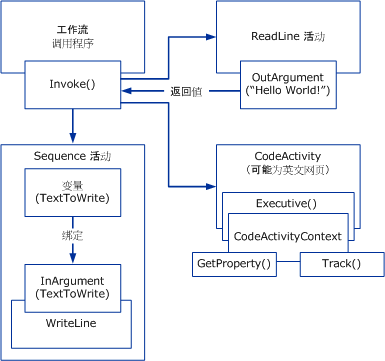

# Windows 工作流概述Windows Workflow Overview
工作流是一套调用的基本单元*活动*存储为模型，它描述实际进程。A workflow is a set of elemental units called *activities* that are stored as a model that describes a real-world process. 工作流提供了一种方法，用于描述多项短期运行或长期运行的工作之间的执行顺序和依赖关系。Workflows provide a way of describing the order of execution and dependent relationships between pieces of short- or long-running work. 此工作从头到尾地贯穿模型，并且活动可以人工执行或由系统功能执行。This work passes through the model from start to finish, and activities might be executed by people or by system functions.  
  
## 工作流运行时引擎Workflow Run-time Engine  
 每个正在运行的工作流实例都是由进程内运行时引擎创建和维护的，宿主进程通过以下类之一与其交互：Every running workflow instance is created and maintained by an in-process run-time engine that the host process interacts with through one of the following:  
  
-   <xref:System.Activities.WorkflowInvoker>，它像调用方法一样调用工作流。A <xref:System.Activities.WorkflowInvoker>, which invokes the workflow like a method.  
  
-   <xref:System.Activities.WorkflowApplication>，用于对单个工作流实例的执行进行显式控制。A <xref:System.Activities.WorkflowApplication> for explicit control over the execution of a single workflow instance.  
  
-   <xref:System.ServiceModel.WorkflowServiceHost>，用于多实例方案中基于消息的交互。A <xref:System.ServiceModel.WorkflowServiceHost> for message-based interactions in multi-instance scenarios.  
  
 上述每个类对表示为负责活动执行的 <xref:System.Activities.ActivityInstance> 的核心活动运行时进行包装。Each of these classes wraps the core activity runtime represented as a <xref:System.Activities.ActivityInstance> responsible for activity execution. 在一个应用程序域中可以并发运行多个 <xref:System.Activities.ActivityInstance> 对象。There can be several <xref:System.Activities.ActivityInstance> objects within an application domain running concurrently.  
  
 上述三个宿主交互对象中的每一个都是从称为工作流程序的活动树中创建的。Each of the preceding three host interaction objects is created from a tree of activities referred to as a workflow program. 使用这些类型或对 <xref:System.Activities.ActivityInstance> 进行包装的自定义宿主，可以在包括控制台应用程序、基于窗体的应用程序、Windows 服务、[!INCLUDE[vstecasp](../../../includes/vstecasp-md.md)] 网站和 [!INCLUDE[indigo1](../../../includes/indigo1-md.md)] 服务在内的任何 Windows 进程内执行工作流。Using these types or a custom host that wraps <xref:System.Activities.ActivityInstance>, workflows can be executed inside any Windows process including console applications, forms-based applications, Windows Services, [!INCLUDE[vstecasp](../../../includes/vstecasp-md.md)] Web sites, and [!INCLUDE[indigo1](../../../includes/indigo1-md.md)]services.  
  
   
托管进程中的工作流组件Workflow components in the host process  
  
## 工作流组件之间的交互Interaction between Workflow Components  
 下图演示工作流组件彼此之间如何进行交互。The following diagram demonstrates how workflow components interact with one another.  
  
   
  
 在上图中，<xref:System.Activities.WorkflowInvoker.Invoke%2A> 类的 <xref:System.Activities.WorkflowInvoker> 方法用于调用多个工作流实例。In the preceding diagram, the <xref:System.Activities.WorkflowInvoker.Invoke%2A> method of the <xref:System.Activities.WorkflowInvoker> class is used to invoke several workflow instances. <xref:System.Activities.WorkflowInvoker> 用于不需要由宿主管理的轻型工作流；需要由宿主管理的工作流（如 <xref:System.Activities.Bookmark> 恢复）必须改用 <xref:System.Activities.WorkflowApplication.Run%2A> 来执行。<xref:System.Activities.WorkflowInvoker> is used for lightweight workflows that do not need management from the host; workflows that need management from the host (such as <xref:System.Activities.Bookmark> resumption) must be executed using <xref:System.Activities.WorkflowApplication.Run%2A> instead. 无需等待一个工作流实例完成即可调用下一个工作流实例；运行时引擎支持同时运行多个工作流实例。It isn’t required to wait for one workflow instance to complete before invoking another; the runtime engine supports running multiple workflow instances simultaneously.  调用的工作流如下：The workflows invoked are as follows:  
  
-   一个包含 <xref:System.Activities.Statements.Sequence> 子活动的 <xref:System.Activities.Statements.WriteLine> 活动。A <xref:System.Activities.Statements.Sequence> activity that contains a <xref:System.Activities.Statements.WriteLine> child activity. 父活动的 <xref:System.Activities.Variable> 绑定到子活动的 <xref:System.Activities.InArgument>。A <xref:System.Activities.Variable> of the parent activity is bound to an <xref:System.Activities.InArgument> of the child activity. [!INCLUDE[crabout](../../../includes/crabout-md.md)]在变量、 自变量和绑定，请参阅[变量和自变量](../../../docs/framework/windows-workflow-foundation/variables-and-arguments.md)。 on variables, arguments, and binding, see [Variables and Arguments](../../../docs/framework/windows-workflow-foundation/variables-and-arguments.md).  
  
-   一个调用 `ReadLine` 的自定义活动。A custom activity called `ReadLine`. 将 <xref:System.Activities.OutArgument> 活动的 `ReadLine` 返回给调用 <xref:System.Activities.WorkflowInvoker.Invoke%2A> 方法。An <xref:System.Activities.OutArgument> of the `ReadLine` activity is returned to the calling <xref:System.Activities.WorkflowInvoker.Invoke%2A> method.  
  
-   一个派生自 <xref:System.Activities.CodeActivity> 抽象类的自定义活动。A custom activity that derives from the <xref:System.Activities.CodeActivity> abstract class. <xref:System.Activities.CodeActivity> 可以使用作为 <xref:System.Activities.CodeActivityContext> 方法的参数提供的 <xref:System.Activities.CodeActivity.Execute%2A> 访问运行时功能（如跟踪和属性）。The <xref:System.Activities.CodeActivity> can access run-time features (such as tracking and properties) using the <xref:System.Activities.CodeActivityContext> that is available as a parameter of the <xref:System.Activities.CodeActivity.Execute%2A> method. [!INCLUDE[crabout](../../../includes/crabout-md.md)]这些运行时功能，请参阅[工作流跟踪](../../../docs/framework/windows-workflow-foundation/workflow-tracking-and-tracing.md)和[工作流执行属性](../../../docs/framework/windows-workflow-foundation/workflow-execution-properties.md)。 these run-time features, see [Workflow Tracking and Tracing](../../../docs/framework/windows-workflow-foundation/workflow-tracking-and-tracing.md) and [Workflow Execution Properties](../../../docs/framework/windows-workflow-foundation/workflow-execution-properties.md).  
  
## 另请参阅See Also  
 [BizTalk Server 2006 或 WF？为你的项目中选择适当的工作流工具BizTalk Server 2006 or WF? Choosing the Right Workflow Tool for Your Project](http://go.microsoft.com/fwlink/?LinkId=154901)
