# <a name="windows-workflow-foundation-4-performance"></a>Windows Workflow Foundation 4 性能
Dustin Metzgar  
  
 Wenlong Dong  
  
 Microsoft Corporation，2010 年 9 月  
  
 Microsoft [!INCLUDE[netfx40_long](../../../includes/netfx40-long-md.md)] 包括一个 [!INCLUDE[wf](../../../includes/wf-md.md)] 主要修订版，这一版本在性能方面进行了大量的投资。  与 .NET Framework 3.0 和 [!INCLUDE[wf1](../../../includes/wf1-md.md)] 中附带的前两版 [!INCLUDE[netfx35_short](../../../includes/netfx35-short-md.md)] 相比，新修订版在设计上进行了重大的更改。 新版本对编程模型内核、运行时和工具均重新进行了架构设计，从而极大地提升了性能和可用性。 本主题会展示这些修订版的重要性能特征，并将它们与之前的版本进行比较。  
  
 在 WF3 和 WF4 之间，单个工作流组件的性能也都得到了几个数量级的提升。  这使手工编写的 [!INCLUDE[indigo1](../../../includes/indigo1-md.md)] 服务和 [!INCLUDE[indigo2](../../../includes/indigo2-md.md)] 工作流服务之间的差距变得相当微小。  在 WF4 中，工作流延迟也得到了显著的降低。  暂留性能提高了 2.5 至 3.0 倍。  采用工作流跟踪方式的运行状况监视显著降低了开销。  这些就是迁移到或在应用程序中采用 WF4 的令人心动的原因。  
  
## <a name="terminology"></a>术语  
 在本文的剩余部分，[!INCLUDE[wf1](../../../includes/wf1-md.md)] 中推出的 [!INCLUDE[netfx40_short](../../../includes/netfx40-short-md.md)] 版本将称作 WF4。  [!INCLUDE[wf1](../../../includes/wf1-md.md)] 在 .Net 3.0 中推出，并通过 [!INCLUDE[netfx35_short](../../../includes/netfx35-short-md.md)] SP1 推出了一些次要修订版。 在本文的剩余部分，Workflow Foundation 的 [!INCLUDE[netfx35_short](../../../includes/netfx35-short-md.md)] 版本将称作 WF3。 [!INCLUDE[netfx40_short](../../../includes/netfx40-short-md.md)] 中同时附带了 WF3 和 WF4。 [!INCLUDE[crabout](../../../includes/crabout-md.md)]请参阅将 WF3 项目迁移到 WF4: [Windows Workflow Foundation 4 迁移指南](http://go.microsoft.com/fwlink/?LinkID=153313)  
  
 [!INCLUDE[indigo1](../../../includes/indigo1-md.md)] 是 Microsoft 为构建面向服务的应用程序而提供的统一编程模型。 它最初和 WF3 一起随 .Net 3.0 推出，目前已成为 [!INCLUDE[dnprdnshort](../../../includes/dnprdnshort-md.md)] 的关键组件之一。  
  
 Windows Server AppFabric 是一组集成技术。您可以利用这些技术更轻松地生成、缩放和管理在 IIS 上运行的 Web 应用程序和复合应用程序。 它提供用于监视和管理服务与工作流的工具。 [!INCLUDE[crdefault](../../../includes/crdefault-md.md)][Windows Server AppFabric](http://msdn.microsoft.com/windowsserver/ee695849.aspx)  
  
## <a name="goals"></a>目标  
 本主题的目标是使用为不同方案测得的数据显示 WF4 的性能特征。 本文还提供 WF4 与 WF3 之间的详细比较，从而展示在新修订版中所做的重大改进。 本文所展示的方案和数据量化了 WF4 和 WF3 在不同方面的基础成本。 这些数据有助于了解 WF4 的性能特征，并有助于规划从 WF3 到 WF4 的迁移或在应用程序开发中使用 WF4。 但是，应当关注根据本文展示的数据所得出的结论。 复合工作流应用程序的性能高度依赖于工作流的实现方式和不同组件的集成方式。 必须测量每个应用程序，才能确定该应用程序的性能特征。  
  
## <a name="overview-of-wf4-performance-enhancements"></a>WF4 性能增强功能的概述  
 WF4 经过严谨的设计和实现，具有以下各节中描述的高性能和可伸缩性。  
  
### <a name="wf-runtime"></a>WF 运行时  
 [!INCLUDE[wf1](../../../includes/wf1-md.md)] 运行时的核心是一个异步计划程序，能够驱动工作流中活动的执行。 它为活动提供了可预测的高性能执行环境。 该环境有一个对执行、延续、完成、取消、异常的完善约定，和一个可预测的线程模型。  
  
 与 WF3 相比，WF4 运行时具有更有效的计划程序。 它利用 [!INCLUDE[indigo2](../../../includes/indigo2-md.md)] 所使用的同一 I/O 线程池，该线程池在执行成批工作项时十分有效。 内部工作项计划程序队列已针对最常用的使用模式进行了优化。 WF4 运行时还以一种十分轻型的方式来管理执行状态，这种方式只使用极少的同步和事件处理逻辑，而 WF3 则依靠重型的事件注册和调用来执行状态转换的复杂同步。  
  
### <a name="data-storage-and-flow"></a>数据存储和流动  
 在 WF3 中，与活动相关的数据通过 <xref:System.Windows.DependencyProperty> 类型实现的依赖属性进行建模。 依赖属性模式是在 [!INCLUDE[avalon1](../../../includes/avalon1-md.md)] 中推出的。 总体上，这种模式十分灵活，能够支持轻松的数据绑定和其他 UI 功能。 但是，这种模式需要将属性定义为工作流定义中的静态字段。 当 [!INCLUDE[wf1](../../../includes/wf1-md.md)] 运行时设置或获取属性值时，它会涉及重型的查找逻辑。  
  
 WF4 使用清晰的数据范围逻辑，显著改进了在工作流中处理数据的方式。 它使用下面两种不同的概念将存储在活动中的数据与在活动边界之间流动的数据区分开来：变量和自变量。 通过使用清晰的分层范围变量和"In/Out/InOut"自变量，大幅减少，活动的数据使用复杂程度，并还会自动确定数据的生存期范围。 活动具有由其自变量描述的定义完善的签名。 通过简单地检查活动，您可以确定它将会接收的数据，以及它执行后将会产生的数据。  
  
 在 WF3 中，创建工作流时即会初始化活动。 在 WF 4 中，只有在执行活动时，才会初始化相应的活动。 这样，在创建新工作流实例时，因为无需执行初始化/取消初始化操作，活动的生命周期将更为简单，并因此能获得更高的效率  
  
### <a name="control-flow"></a>控制流  
 和所有编程语言一样，[!INCLUDE[wf1](../../../includes/wf1-md.md)] 通过引入了一组用于排序、循环、分支和其他模式的控制流活动，为工作流定义提供了控制流支持。 在 WF3 中，当需要重新执行相同的活动时，会通过基于 <xref:System.Workflow.ComponentModel.ActivityExecutionContext> 的重型序列化和反序列化逻辑创建一个新的 <xref:System.Runtime.Serialization.Formatters.Binary.BinaryFormatter>，并克隆该活动。 通常，迭代控制流的性能要比执行一个活动序列慢得多。  
  
 WF4 以完全不同的方式处理这种情况。 它采用活动模板，创建一个新的 ActivityInstance 对象并将其添加到计划程序队列中。 整个过程只涉及显式的对象创建，并且十分轻型。  
  
### <a name="asynchronous-programming"></a>异步编程  
 使用异步编程时，应用程序对长时间运行的阻止操作（如 I/O）或分布式计算操作通常会表现出更佳的性能和可伸缩性。 WF4 通过基础活动类型 <xref:System.Activities.AsyncCodeActivity> 和 <xref:System.Activities.AsyncCodeActivity%601> 提供异步支持。 运行时本身就了解异步活动，因此可以在异步工作未处理时，自动将实例放入非持久性区域中。 自定义活动可以从这些类型派生，从而无需保留工作流计划程序线程和阻止能够并行运行的任何活动，即可执行异步工作。  
  
### <a name="messaging"></a>消息传送  
 最初，WF3 通过外部事件或 Web 服务调用提供相当有限的消息传送支持。 在 .Net 3.5 中，工作流可通过 [!INCLUDE[indigo2](../../../includes/indigo2-md.md)] 和 [!INCLUDE[indigo2](../../../includes/indigo2-md.md)] 实现为 <xref:System.Workflow.Activities.SendActivity> 客户端或公开为 <xref:System.Workflow.Activities.ReceiveActivity> 服务。 在 WF4 中，通过将 [!INCLUDE[indigo2](../../../includes/indigo2-md.md)] 消息传送逻辑紧密集成到 WF 中，基于工作流的消息传送编程概念已得到进一步的强化。  
  
 .Net 4 中 [!INCLUDE[indigo2](../../../includes/indigo2-md.md)] 所提供的统一消息处理管道使 WF4 服务能够超越 WF3 服务，具有更卓越的性能和可伸缩性。 WF4 还提供了更丰富的消息传送编程支持，可以对复杂消息交换模式 (MEP) 进行建模。 开发人员可以使用类型化的服务协定实现简单的编程，也可以使用非类型化的服务协定获得更好的性能，而无需付出序列化成本。 WF4 中通过 <xref:System.ServiceModel.Activities.SendMessageChannelCache> 类提供的客户端通道缓存支持可帮助开发人员以最小的工作量构建快速应用程序。 [!INCLUDE[crdefault](../../../includes/crdefault-md.md)][更改的缓存共享级别为发送活动](../../../docs/framework/wcf/feature-details/changing-the-cache-sharing-levels-for-send-activities.md)。  
  
### <a name="declarative-programming"></a>声明性编程  
 WF4 提供一个清楚、简单的声明性编程框架，用以对业务流程和服务进行建模。 无需任何其他代码，该编程模型支持完全声明性地编写活动，极大地简化了工作流的创作。 在 [!INCLUDE[netfx40_short](../../../includes/netfx40-short-md.md)] 中，基于 XAML 的声明性编程框架已统一为既支持 WPF 又支持 WF 的单个程序集 System.Xaml.dll。  
  
 在 WF4 中，在 XAML 提供真正的声明性经验，并允许用 XML 标记定义工作流的整个定义，并引用使用 .NET 构建的活动和类型。 这在使用 XOML 的 WF3 中则很难实现，因为这种格式没有自定义的代码隐藏逻辑。 .Net 4 中新的 XAML 堆栈在序列化/反序列化工作流项目时具有更好的性能，并能使声明性编程更具吸引力，也更加稳定。  
  
### <a name="workflow-designer"></a>工作流设计器  
 WF4 的完全声明性编程和支持对于大型工作流的设计时性能明确提出了更高的要求。 与 WF3 相比，WF4 中的工作流设计器对于大型工作流来说，具有更佳的可伸缩性。 有了 UI 虚拟化支持，设计器在几秒钟内就能轻松加载包括 1000 个活动的大型工作流，而在 WF3 设计器中，加载包括数百个活动的工作流几乎都是件不可能完成的任务。  
  
## <a name="component-level-performance-comparisons"></a>组件级性能比较  
 本节包括对 WF3 和 WF4 工作流中的单个活动进行直接比较的相关数据。  与单个活动组件相比，暂留这样的关键方面对于性能的影响更加深远。  但是，因为 WF4 中单个组件目前的速度足以与手工编码的业务流程逻辑相媲美，所以这些组件的性能改进也非常重要。  在下一节中介绍它的一个示例:"服务组合方案"。  
  
### <a name="environment-setup"></a>环境设置  
 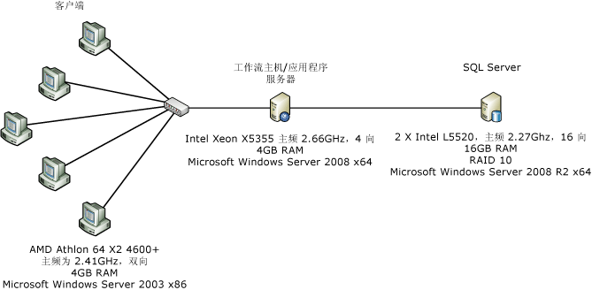  
  
 上图显示了用于组件级性能测量的计算机配置。 一台服务器和五台客户端通过一个 1 Gbps 以太网网络接口连接在一起。 为了简化测量，服务器配置为使用运行 Windows Server 2008 x86 的双处理器/四核服务器中的一个内核。 系统 CPU 利用率保持在接近 100%。  
  
### <a name="test-details"></a>测试详细信息  
 WF3，<xref:System.Workflow.Activities.CodeActivity> 可能是可以在 WF3 工作流中使用的最简单的活动。  该活动在工作流程序员可以放入自定义代码的代码隐藏文件中调用一个方法。  在 WF4 中，没有与 WF3 <xref:System.Workflow.Activities.CodeActivity> 提供相同功能的类似项目。  注意，WF4 中有一个 <xref:System.Activities.CodeActivity> 基类，但它与 WF3 <xref:System.Workflow.Activities.CodeActivity> 没有关联。  建议工作流作者创建自定义活动并构建仅 XAML 的工作流。  在下面的测试中，在 WF4 工作流中使用名为 `Comment` 的活动代替空 <xref:System.Workflow.Activities.CodeActivity>。  `Comment` 活动中的代码如下所示：  
  
```  
[ContentProperty("Body")]  
    public sealed class Comment : CodeActivity  
    {  
        public Comment()  
            : base()  
        {  
        }  
  
        [DefaultValue(null)]  
        public Activity Body  
        {  
            get;  
            set;  
        }  
  
        protected override void Execute(CodeActivityContext context)  
        {  
        }  
    }  
```  
  
### <a name="empty-workflow"></a>空工作流  
 此测试使用一个没有子活动的序列工作流。  
  
### <a name="single-activity"></a>单个活动  
 工作流是包含一个子活动的序列工作流。  该活动在 WF3 中是没有代码的 <xref:System.Workflow.Activities.CodeActivity>，而在 WF4 中是 `Comment` 活动。  
  
### <a name="while-with-1000-iterations"></a>While 搭配 1000 次迭代  
 序列工作流包含一个 <xref:System.Activities.Statements.While> 活动，该活动在循环中有一个不执行任何工作的子活动。  
  
### <a name="replicator-compared-to-parallelforeach"></a>Replicator 与 ParallelForEach 的比较  
 WF3 中的 <xref:System.Workflow.Activities.ReplicatorActivity> 具有顺序和并行两种执行模式。  在顺序模式中，活动的性能与 <xref:System.Workflow.Activities.WhileActivity> 类似。  <xref:System.Workflow.Activities.ReplicatorActivity> 最适用于并行执行。  WF4 中与此类似的是 <xref:System.Activities.Statements.ParallelForEach%601> 活动。  
  
 下图显示了此测试使用的工作流。 左侧为 WF3 工作流，右侧为 WF4 工作流。  
  
 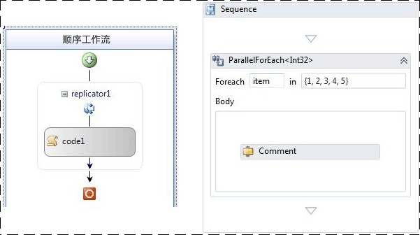  
  
### <a name="sequential-workflow-with-five-activities"></a>包含五个活动的顺序工作流  
 此测试的目的是为了显示在序列中执行几个活动的效果。  序列中有五个活动。  
  
### <a name="transaction-scope"></a>事务范围  
 事务范围测试与其他侧试略有不同，不会为每次迭代创建一个新的工作流实例。  相反，工作流的结构是一个包含 <xref:System.Activities.Statements.TransactionScope> 活动的 while 循环，而该活动包含一个不执行任何工作的活动。  每次通过 while 循环运行一批 50 个迭代，计为一个单独的操作。  
  
### <a name="compensation"></a>补偿  
 WF3 工作流有一个名为 `WorkScope` 的可补偿活动。  该活动只实现 <xref:System.Workflow.ComponentModel.ICompensatableActivity> 接口：  
  
```  
class WorkScope :   
        CompositeActivity, ICompensatableActivity  
    {  
        public WorkScope() : base() { }  
  
        public WorkScope(string name)  
        {  
            this.Name = name;  
        }  
  
        public ActivityExecutionStatus Compensate(  
            ActivityExecutionContext executionContext)  
        {  
            return ActivityExecutionStatus.Closed;  
        }  
    }  
```  
  
 错误处理程序以 `WorkScope` 活动为目标。WF4 工作流同样很简单。  <xref:System.Activities.Statements.CompensableActivity> 有一个 Body 和一个补偿处理程序。  序列中随后是一个显式的补偿。  Body 活动和补偿处理程序活动都是空实现：  
  
```  
public sealed class CompensableActivityEmptyCompensation : CodeActivity  
    {  
        public CompensableActivityEmptyCompensation()  
            : base() { }  
  
        public Activity Body { get; set; }  
  
        protected override void Execute(CodeActivityContext context) { }  
    }  
    public sealed class CompensableActivityEmptyBody : CodeActivity  
    {  
        public CompensableActivityEmptyBody()  
            : base() { }  
  
        public Activity Body { get; set; }  
  
        protected override void Execute(CodeActivityContext context) { }  
    }  
```  
  
 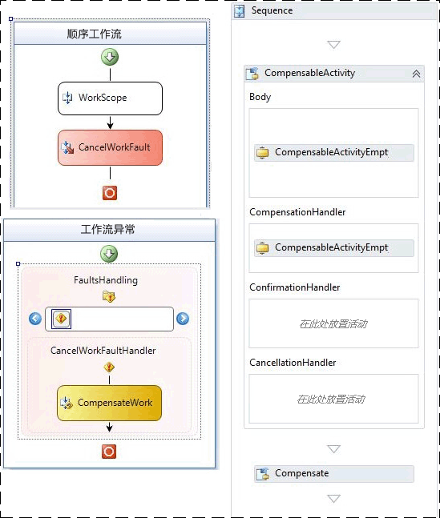  
  
 图 2 — WF3（左）和 WF4（右）的基本补偿工作流  
  
### <a name="performance-test-results"></a>性能测试结果  
 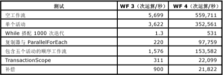  
  
   
  
 除事务范围测试外，会以秒为单位在工作流中测量所有测试。  如上文所见，[!INCLUDE[wf1](../../../includes/wf1-md.md)] 运行时性能已得到全面提升，特别是在像 while 循环这样需要多次执行同一活动的方面。  
  
## <a name="service-composition-scenario"></a>服务撰写方案  
 如所示在前面的部分中，"组件级性能比较"已显著降低了 WF3 和 WF4 之间的开销。  [!INCLUDE[indigo2](../../../includes/indigo2-md.md)] 工作流服务目前的性能几乎与手工编码的 [!INCLUDE[indigo2](../../../includes/indigo2-md.md)] 服务相当，但同时仍具备 [!INCLUDE[wf1](../../../includes/wf1-md.md)] 运行时的所有优点。  此测试方案会将 [!INCLUDE[indigo2](../../../includes/indigo2-md.md)] 服务与 WF4 中的 [!INCLUDE[indigo2](../../../includes/indigo2-md.md)] 工作流服务进行比较。  
  
### <a name="online-store-service"></a>在线商店服务  
 [!INCLUDE[wf2](../../../includes/wf2-md.md)] 的优势之一是能够使用几个服务撰写流程。  本例为一个在线商店服务，该服务会协调两个服务调用以采购订单。  第一步是使用订单验证服务验证订单。  第二步是使用仓库服务填写订单。  
  
 订单验证服务和仓库服务这两个后端服务在两项测试中保持不变。  发生变化的部分是执行业务流程的在线商店服务。  在一种方案中，服务手工编码为 [!INCLUDE[indigo2](../../../includes/indigo2-md.md)] 服务。  而在另一种方案中，服务编写为 WF4 中的 [!INCLUDE[indigo2](../../../includes/indigo2-md.md)] 工作流服务。 在此项测试中，[!INCLUDE[wf1](../../../includes/wf1-md.md)] 特定的功能（如跟踪和暂留）都会关闭。  
  
### <a name="environment"></a>环境  
   
  
 多个计算机通过 HTTP 对在线商店服务发出客户端请求。  一台计算机承载了全部三个服务。  在线商店服务和后台服务之间的传输层是 TCP 或 HTTP。  每秒操作数的测量以对在线商店服务完成的 `PurchaseOrder` 调用数为基础。  通道池是 WF4 的一项新功能。  在本测试的 [!INCLUDE[indigo2](../../../includes/indigo2-md.md)] 部分，通道池不是一项现成的功能，所以在线商店服务中使用的是简单池技术的手工编码实现。  
  
### <a name="performance"></a>性能  
 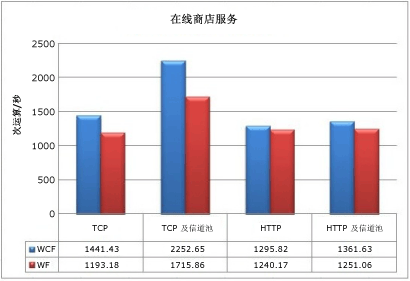  
  
 如果连接后端 TCP 服务时不使用通道池，则 [!INCLUDE[wf1](../../../includes/wf1-md.md)] 服务对吞吐量有 17.2% 的影响。  如果使用通道池，则损失大约为 23.8%。  对于 HTTP，影响要少得多：不使用池时为 4.3%，使用池时为 8.1%。  另外要特别注意的是，使用 HTTP 时通道池提供的好处比较少。  
  
 在此测试中，尽管与手工编码的 [!INCLUDE[indigo2](../../../includes/indigo2-md.md)] 服务相比 WF4 运行时仍有开销，但是可以将其视为一种最坏的情况。  此测试中的两个后端服务执行的工作很少。  在实际的端到端方案中，这些服务将会执行更加昂贵的操作，如数据库调用，使传输层的性能影响显得更加微小。  再加上 WF4 所提供功能的优点，使 Workflow Foundation 成为创建业务流程服务的可行选择。  
  
## <a name="key-performance-considerations"></a>关键的性能注意事项  
 除 Interop 外，本节所述的功能在 WF3 和 WF4 之间已有显著的更改。  这会对工作流应用程序的设计以及性能产生影响。  
  
#### <a name="workflow-activation-latency"></a>工作流激活延迟  
 在 [!INCLUDE[indigo2](../../../includes/indigo2-md.md)] 工作流服务应用程序中，启动新工作流或加载现有工作流的延迟十分重要，因为工作流可能遭到阻止。  此测试会测量典型方案中的 WF3 XOML 主机与 WF4 XAMLX 主机。  
  
##### <a name="environment-setup"></a>环境设置  
 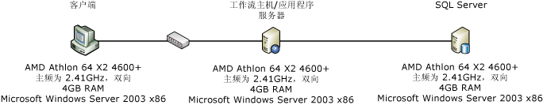  
  
##### <a name="test-setup"></a>测试设置  
 在本案例中，客户端计算机使用基于上下文的相关来联系 [!INCLUDE[indigo2](../../../includes/indigo2-md.md)] 工作流服务。  上下文相关需要特殊的上下文绑定，并使用上下文标头或 Cookie 将消息与正确的工作流实例相关联。  它具有一定的性能优势，因为关联 ID 位于消息标头中，所以不需要解析消息正文。 [!INCLUDE[crabout](../../../includes/crabout-md.md)]请参阅上下文相关[上下文交换相关](../../../docs/framework/wcf/feature-details/context-exchange-correlation.md)  
  
 该服务将根据请求创建新工作流，并发送即时响应，以使测量到的延迟不包括运行工作流所用的时间。  WF3 工作流是有隐藏代码的 XOML，而 WF4 工作流则是完全的 XAML。  WF4 工作流如下所示：  
  
 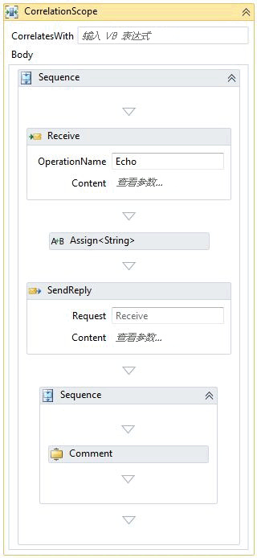  
  
 <xref:System.ServiceModel.Activities.Receive> 活动创建工作流实例。  传入收到的消息的值在回复消息中回显。  回复之后的序列包含工作流的剩余部分。  在上述情况下，只会显示一个 Comment 活动。  Comment 活动的数量会发生变化，以模拟工作流的复杂程度。  Comment 活动相当于不执行任何工作的 WF3 <xref:System.Workflow.Activities.CodeActivity>。 [!INCLUDE[crabout](../../../includes/crabout-md.md)]comment 活动，请参阅本文前面部分的"组件级性能比较"一节。  
  
##### <a name="test-results"></a>测试结果  
 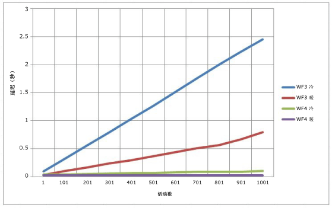  
  
 图 3 — WCF 工作流服务的冷延迟和热延迟  
  
 在上图中，“冷”表示给定工作流没有现有 <xref:System.ServiceModel.WorkflowServiceHost>。  换言之，冷延迟是第一次使用工作流和需要编译 XOML 或 XAML 的时间。  热延迟是当工作流类型已经编译时创建新工作流实例的时间。  在 WF4 中，工作流的复杂程度只有细微的变化，但在 WF3 中，则呈现线性发展态势。  
  
#### <a name="correlation-throughput"></a>相关吞吐量  
 WF4 采用一种新的基于内容的相关功能。  WF3 只提供基于上下文的相关。  基于上下文的相关只能通过特定 [!INCLUDE[indigo2](../../../includes/indigo2-md.md)] 通道绑定进行。  使用这些绑定时，工作流 ID 会插入消息标头。  WF3 运行时只能通过工作流 ID 来识别工作流。使用基于内容的相关性，工作流作者可以创建相关键相关如帐号或客户 id。 的数据片段外[!INCLUDE[crabout](../../../includes/crabout-md.md)]基于内容的相关性，请参阅[内容基于相关](../../../docs/framework/wcf/feature-details/content-based-correlation.md)。  
  
 基于上下文的相关的性能优势在于，相关键位于消息标头中。  无需反序列化或复制消息，就可以从消息中读取键。  在基于内容的相关中，相关键存储在消息正文中。  会使用 XPath 表达式来定位键。  这一额外处理所需的成本取决于消息的大小、键在正文中的深度和键的数量。  此测试比较基于上下文的相关和基于内容的相关，并显示使用多个键时的性能下降。  
  
#### <a name="environment-setup"></a>环境设置  
   
  
#### <a name="test-setup"></a>测试设置  
 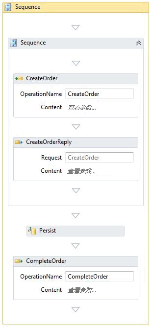  
  
 在下面的"持久性"一节中使用的同一上面所示的工作流。  对于不使用暂留的相关测试，未在运行时中安装暂留提供程序。  相关发生在两个位置：CreateOrder 和 CompleteOrder。  
  
#### <a name="test-results"></a>测试结果  
 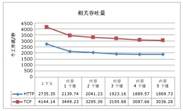  
  
 此图显示随着基于内容的相关中使用的键数的增加，所发生的性能下降。  TCP 和 HTTP 之间曲线的相似度表示与这些协议相关的开销。  
  
#### <a name="correlation-with-persistence"></a>使用暂留的关联  
 对于暂留的工作流，基于内容的相关产生的 CPU 压力从工作流运行时转移到 SQL 数据库。  SQL 暂留提供程序中的存储过程执行匹配键以找到相应工作流的工作。  
  
   
  
 基于上下文的相关仍比基于内容的相关速度快。  但是，因为暂留比相关对性能的影响大，所以这种差别并不明显。  
  
### <a name="complex-workflow-throughput"></a>复杂工作流吞吐量  
 工作流的复杂程度不能只通过活动数来衡量。  复合活动可以包含多个子活动，这些子活动可能也是复合活动。  随着嵌套层数的增加，当前处于执行状态的活动数，以及处于活动状态的变量数也会不断增加。  此测试对执行复杂工作流时 WF3 和 WF4 之间的吞吐量进行比较。  
  
### <a name="test-setup"></a>测试设置  
 这些测试都是在运行 Windows Server 2008 x64、具有 4 GB RAM 且采用 Intel Xeon X 5355（速度 2.66GHz）的 4 路计算机上执行的。  测试代码在一个进程中以每个线程一个内核的方式运行，从而实现 100% 的 CPU 利用率。  
  
 为此测试生成的工作流有两个主要的变量：深度和每个序列中的活动数。  每个深度级别都包括并行活动、while 循环、决策、分配和序列。  在下面图示的 WF4 设计器中，描绘的是顶级流程图。  每个流程图活动都与主流程图类似。  您可以将此工作流想像成一个分形，其中的深度受限于测试的参数。  
  
 给定的测试中的活动数由深度和每个序列的活动数决定。  以下公式会计算 WF4 测试中的活动数：  
  
   
  
 由于有一个额外的序列，所以计算 WF3 测试活动计数的等式可能会稍有不同：  
  
   
  
 其中 d 代表深度，a 代表每个序列的活动数。  这些公式背后的逻辑在于，第一个常量（会乘以 a）是序列数，而第二个常量是当前级别中的静态活动数。  每个流程图中有三个流程图子活动。  在底部的深度级别，这些流程图都是空的，但在其他级别，它们是主流程图的副本。  每个测试变体的工作流定义中的活动数如下表所示：  
  
 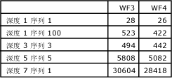  
  
 工作流定义中的活动数随着每个深度级别而急剧增加。  但是，在给定工作流实例中，每个决策点只会执行一条路径，所以只会执行实际活动的一小部分。  
  
 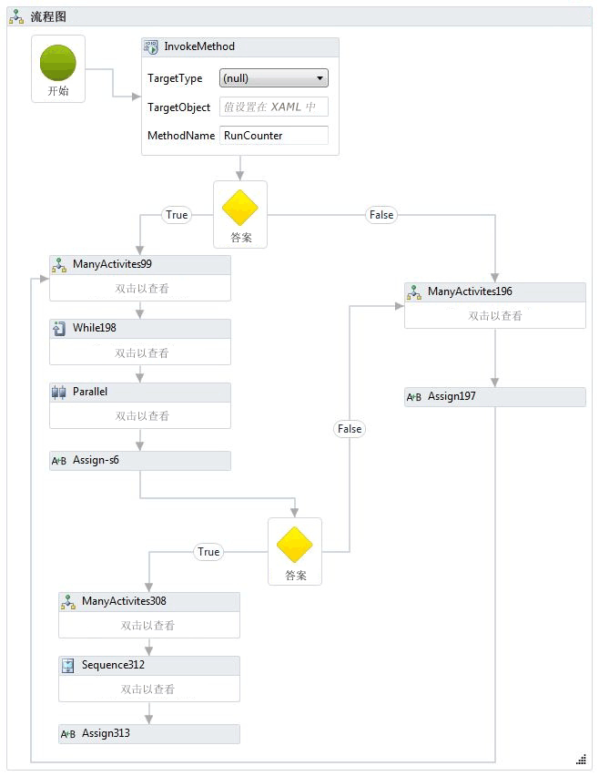  
  
 为 WF3 创建了一个等效的工作流。 WF3 设计器在设计区域显示整个工作流，而不是显示嵌套结构，因此由于它过大而未在本主题中显示。 下面显示了工作流的一个代码段。  
  
   
  
 为了演练极端情况下的嵌套，此测试包括的另一个工作流使用了 100 个嵌套的序列。  最内层的序列中是一个 `Comment` 或 <xref:System.Workflow.Activities.CodeActivity>。  
  
   
  
 此测试中不会使用跟踪和暂留。  
  
### <a name="test-results"></a>测试结果  
 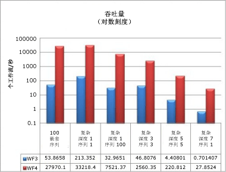  
  
 即使是具有许多深度和大量活动的复杂工作流，性能结果仍与本文前面显示的吞吐量数字一致。  WF4 的吞吐量速度呈现几个数量级的增长，必须在对数刻度上进行比较。  
  
### <a name="memory"></a>内存  
 Windows Workflow Foundation 的内存开销从两个主要方面进行测量：工作流复杂程度和工作流定义数。  内存测量是在 Windows 7 64 位工作站上进行的。  有多种方法可以获得的工作集大小，如监视性能计数器、 轮询 Environment.WorkingSet，或使用 vmmap 可从工具[VMMap](http://technet.microsoft.com/sysinternals/dd535533.aspx)。 使用各种方法的组合来获得并验证每个测试的结果。  
  
### <a name="workflow-complexity-test"></a>工作流复杂程度测试  
 工作流复杂程度测试根据工作流的复杂程度测试工作集的差异。  除了上一节中使用的复杂工作流外，还添加了新的变种以覆盖两种基本情况：单个活动工作流和包含 1000 个活动的序列。  对于这些测试，这些工作流在一分钟的时间里，在单个序列循环中初始化并执行完成。  每个测试变体都运行三次，记录的数据是这三次运行的平均值。  
  
 两个新的基本测试的工作流与下面显示的工作流类似：  
  
 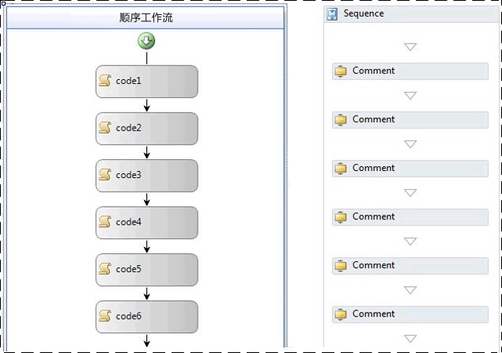  
  
 在上面显示的 WF3 工作流中，使用了空 <xref:System.Workflow.Activities.CodeActivity> 活动。  上面的 WF4 工作流使用 `Comment` 活动。  本文前面的“组件级性能比较”一节对 `Comment` 活动进行了介绍。  
  
 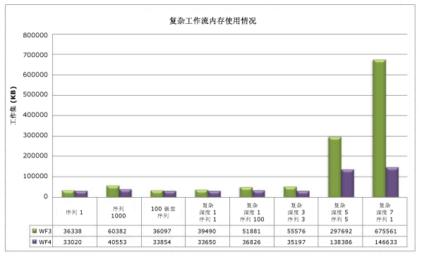  
  
 需要注意此图形中一个明显的趋势，即在 WF3 和 WF4 中，嵌套对内存使用量的影响都相对较低。  最大的内存影响来自给定工作流中的活动数。  若采用序列 1000 的数据，复杂深度 5、序列 5，复杂深度 7、序列 1 这两个变体，如果活动数达到几千时，则内存使用量会出现明显的增长。  在有大约 29000 个活动的极端情况下（深度 7、序列 1），WF4 使用的内存几乎要比 WF3 少 79%。  
  
### <a name="multiple-workflow-definitions-test"></a>多个工作流定义测试  
 测量每个工作流定义的内存分为两个不同的测试，原因是 WF3 和 WF4 中可用于承载工作流的选项有所不同。  这些测试与工作流复杂程度测试采用不同的运行方式，给定工作流对于每个定义只实例化和执行一次。  这是因为工作流定义和它的主机在 AppDomain 的生存期内会保留在内存中。  运行给定的工作流实例使用的内存应当在垃圾回收期间清理。  WF4 的迁移指南包含承载选项的更多详细信息。 [!INCLUDE[crdefault](../../../includes/crdefault-md.md)][WF 迁移实用手册： 工作流承载](http://go.microsoft.com/fwlink/?LinkID=153313)。  
  
 为工作流定义测试创建多个工作流定义，可以通过多种方式完成。  例如，可以使用代码生成创建一组除名称外完全相同的 1000 个工作流，并将这些工作流中的每一个都保存到单独的文件中。  对于控制台承载的测试采取了这种方法。  在 WF3 中，<xref:System.Workflow.Runtime.WorkflowRuntime>类用于运行工作流定义。  WF4 可使用 <xref:System.Activities.WorkflowApplication> 创建单个工作流实例，也可以直接使用 <xref:System.Activities.WorkflowInvoker> 运行活动，如同它是方法调用一样。  <xref:System.Activities.WorkflowApplication> 是单个工作流实例的主机，并与 <xref:System.Workflow.Runtime.WorkflowRuntime> 具有相近功能，所以在此测试中进行了使用。  
  
 在 IIS 中承载工作流时，可以使用 <xref:System.Web.Hosting.VirtualPathProvider> 创建新的 <xref:System.ServiceModel.WorkflowServiceHost>，而不是生成所有 XAMLX 或 XOML 文件。  <xref:System.Web.Hosting.VirtualPathProvider>处理传入的请求和响应的"虚拟文件"可从数据库加载或，在这种情况下，动态生成。  这样就不必创建 1000 个物理文件了。  
  
 在控制台测试中使用的工作流定义是具有单个活动的简单顺序工作流。  单个活动对于 WF3 是空 <xref:System.Workflow.Activities.CodeActivity>，对于 WF4 是 `Comment` 活动。  IIS 承载情况下使用的工作流在接收消息时启动，在发送回复时结束：  
  
 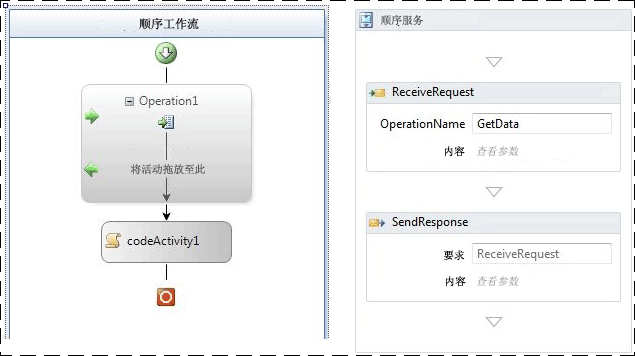  
  
 图 4 — 使用 ReceiveActivity 的 WF3 工作流和使用请求/响应模式的 WF4 工作流  
  
 下表显示单个工作流定义和 1001 个定义之间的工作集增量：  
  
|宿主选项|WF3 工作集增量|WF4 工作集增量|  
|---------------------|---------------------------|---------------------------|  
|控制台应用程序承载的工作流|18 MB|9 MB|  
|IIS 承载的工作流服务|446 MB|364 MB|  
  
 由于 <xref:System.ServiceModel.WorkflowServiceHost>、详细 [!INCLUDE[indigo2](../../../includes/indigo2-md.md)] 服务项目和与主机相关的消息处理逻辑，在 IIS 中承载工作流定义使用的内存要多得多。  
  
 对于 WF3 中的控制台承载，工作流在代码中实现，而不是在 XOML 中实现。  在 WF4 中，默认为使用 XAML。  XAML 作为嵌入资源存储在程序集中并在运行时期间编译，以提供工作流的实现。  此过程会有一些相关的开销。  为了在 WF3 和 WF4 之间进行公平比较，使用的是编码的工作流，而不是 XAML。  下面显示了一个 WF4 工作流示例：  
  
```  
public class Workflow1 : Activity  
{  
    protected override Func<Activity> Implementation  
    {  
        get  
        {  
            return new Func<Activity>(() =>  
            {  
                return new Sequence  
                {  
                    Activities = {  
                        new Comment()  
                    }  
                };  
            });  
        }  
        set  
        {  
            base.Implementation = value;  
        }  
    }  
}  
```  
  
 还有许多其他因素可以影响内存消耗。 相同的建议也适用于所有托管的程序。  在 IIS 承载的环境中，为工作流定义创建的 <xref:System.ServiceModel.WorkflowServiceHost> 对象保留在内存中，直到应用程序池被回收。  编写扩展时应当记住这一点。  此外，最好避免"全局"变量 （作用域为整个工作流的变量），并尽可能限制变量的范围。  
  
## <a name="workflow-runtime-services"></a>工作流运行时服务  
  
### <a name="persistence"></a>持久性  
 WF3 和 WF4 都附带 SQL 暂留提供程序。  WF3 SQL 暂留提供程序是序列化工作流实例并将它存储在 blob 中的简单实现。  因此，此提供程序的性能主要取决于工作流实例的大小。  在 WF3 中，如本文前面所述，实例大小可能因为多种原因而增加。  许多用户选择不使用默认的 SQL 暂留提供程序，因为在数据库中存储序列化实例会导致无法看见工作流的状态。  为了在不知道工作流 ID 的情况下找到特定工作流，必须反序列化每个暂留的实例，并检查内容。  许多开发人员喜欢编写自己的暂留提供程序以克服这些障碍。  
  
 WF4 SQL 暂留提供程序已尝试解决这些困挠。  暂留表公开特定的信息，如活动的书签和可提升的属性。  WF4 中的新的基于内容的相关功能在使用 WF3 SQL 暂留方法时可能无法正常执行，因为它为使暂留的工作流实例的组织产生变化。  这使暂留提供程序的作业更为复杂，并为数据库施加了额外的压力。  
  
### <a name="environment-setup"></a>环境设置  
   
  
### <a name="test-setup"></a>测试设置  
 因为有了改进的功能集和更好的并行处理，所以 WF4 中的 SQL 暂留提供程序要比 WF3 中的提供程序更快。  为了展示这一点，下面比较 WF3 和 WF4 中基本执行相同操作的两个工作流。  
  
 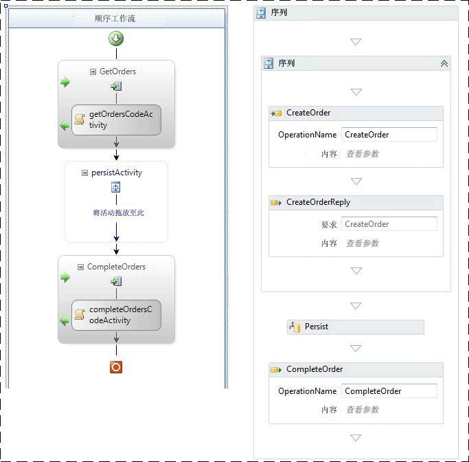  
  
 图 5 — 左侧为 WF3 中的暂留工作流，右侧为 WF4 中的暂留工作流  
  
 两个工作流均通过收到的消息创建。  在发送初始答复后，会暂留工作流。  在 WF3 中，会使用空 <xref:System.Workflow.ComponentModel.TransactionScopeActivity> 来启动暂留。  相同可在 WF3 中实现，标记将活动作为"将保留在关闭"。  另一个关联的消息会完成工作流。  该工作流暂留下来，但不会卸载。  
  
### <a name="test-results"></a>测试结果  
 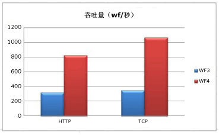  
  
 客户端和中间层之间的传输使用 HTTP 时，WF4 中的暂留会出现 2.6 倍的提升。  TCP 传输会将提升增加到 3.0 倍。  在所有情况下，中间层上的 CPU 使用率都等于或高于 98%。  WF4 吞吐量更大的原因是由于工作流运行时的速度更快。  这两种情况的序列化实例都不大，所以在这种情况下实例大小不是主要的影响元素。  
  
 此测试中的 WF3 和 WF4 工作流都使用活动显式指出应当发生暂留的时间。  它的好处是不用卸载工作流，而是暂留它。  在 WF3 中，还可以使用 <xref:System.ServiceModel.Activities.Description.WorkflowIdleBehavior.TimeToUnload%2A> 功能进行暂留，但这会从内存中卸载工作流实例。  如果使用 WF3 的开发人员想要确保在特定时间点暂留工作流，则他们要么必须修改工作流定义，要么必须付出卸载并重新加载工作流实例的成本。  WF4 中的一项新功能使无需卸载就进行暂留成为可能： <xref:System.ServiceModel.Activities.Description.WorkflowIdleBehavior.TimeToPersist%2A>。  此功能允许在工作流实例闲置时将其暂留，但仍将其保存在内存中，直到达到 <xref:System.ServiceModel.Activities.Description.WorkflowIdleBehavior.TimeToUnload%2A> 阈值或恢复执行。  
  
 注意，WF4 SQL 暂留提供程序在数据库层会执行较多的工作。  由于 SQL 数据库可能成为瓶颈，所以务必要监视该处的 CPU 和磁盘使用情况。  在对工作流应用程序进行性能测试时，务必包括 SQL 数据库中的下列性能计数器：  
  
-   PhysicalDisk\\磁盘读取时间百分比  
  
-   PhysicalDisk\\磁盘时间百分比  
  
-   PhysicalDisk\\磁盘写入时间百分比  
  
-   PhysicalDisk\\%avg.Disk Queue Length  
  
-   PhysicalDisk\Avg.Disk Read Queue Length  
  
-   PhysicalDisk\Avg.Disk Write Queue Length  
  
-   PhysicalDisk\Current Disk Queue Length  
  
-   处理器信息\\处理器时间百分比  
  
-   SQLServer:Latches\Average Latch Wait Time (ms)  
  
-   SQLServer:Latches\Latch Waits/sec  
  
### <a name="tracking"></a>跟踪  
 跟踪工作流可用于跟踪工作流的进度。  跟踪事件中所包含的信息由跟踪配置文件决定。  跟踪配置文件越复杂，跟踪的成本就越高。  
  
 WF3 附带了一个基于 SQL 的跟踪服务。  此服务可以在批处理和非批处理模式下工作。  在非批处理模式下，跟踪事件直接写入数据库。  在批处理模式下，会将跟踪事件与工作流实例状态收集到同一个批次中。  批处理模式具有最佳的性能，适合各种工作流设计。  但是，如果工作流运行许多活动但不使用暂留，并且要跟踪这些活动，则批处理可能对性能产生负面影响。  这通常会发生在循环中，若要避免这种情况，最好的方法来设计大型循环，以包含暂留点。  在循环中引入暂留点也会对性能产生负面影响，所以必须测量每项的成本并找出平衡。  
  
 WF4 未附带 SQL 跟踪服务。  将跟踪信息记入 SQL 数据库可能更适合从应用程序服务器处理，而不是内置到 [!INCLUDE[dnprdnshort](../../../includes/dnprdnshort-md.md)] 中。 因此，SQL 跟踪目前由 AppFabric 处理。  WF4 中现成的跟踪提供程序以 Windows 事件跟踪 (ETW) 为基础。  
  
 ETW 是 Windows 中内置的内核级低延迟事件系统。  它使用提供者/使用者模型，使之能在有实际使用者时才使事件跟踪产生负面影响。  除了处理器、磁盘、内存和网络使用情况等内核事件外，许多应用程序也利用 ETW。  ETW 事件比性能计数器更强大，因为可以根据应用程序自定义事件。  事件可以包含文本，如工作流 ID 或信息性消息。  此外，还会用位掩码对事件进行分类，这样，使用特定的事件子集要比捕获所有事件所产生的性能影响更低。  
  
 使用 ETW 跟踪代替 SQL 跟踪的好处包括：  
  
-   跟踪事件的收集可以分散到其他进程。  这就为记录事件的方式提供了更大的灵活性。  
  
-   ETW 跟踪事件能够轻松地与 [!INCLUDE[indigo2](../../../includes/indigo2-md.md)] ETW 事件或其他 ETW 提供程序（如 SQL Server 或内核提供程序）结合。  
  
-   工作流作者无需更改工作流，就能很好地使用特定的跟踪实现，如 WF3 SQL 跟踪服务的批处理模式。  
  
-   管理员无需回收主机进程就可以打开或关闭跟踪。  
  
 ETW 跟踪的种种性能优势也带来了一个缺点。  如果系统受到密集的资源压力，ETW 事件可能会丢失。  处理事件的目的不是为了阻止正常的程序执行，因此不能保证所有 ETW 事件都会广播至其订阅者。  这使 ETW 跟踪非常适合运行状况监视，但不适合审核。  
  
 虽然 WF4 没有 SQL 跟踪提供程序，但是 AppFabric 有。  AppFabric 的 SQL 跟踪方法是使用 Windows 服务订阅 ETW 事件，该服务将事件分批，并将它们写入专门用于快速插入的 SQL 表中。  另一个作业从此表中抽取数据，并将其转换为可以在 AppFabric 仪表板上查看的报表。  这意味着一批跟踪事件会与其来源的工作流分开处理，因此不用等待暂留点就可以进行记录。  
  
 ETW 事件可以使用 logman 或 xperf 之类的工具进行记录。  可以使用 xperfview 之类的工具查看压缩的 ETL 文件，也可以使用 tracerpt 将其转换为更容易读取的格式，如 XML。  在 WF3 中，不使用 SQL 数据库而获得跟踪事件的唯一方法是创建自定义跟踪服务。 [!INCLUDE[crabout](../../../includes/crabout-md.md)]ETW，请参阅[WCF 服务和 Windows 事件跟踪](../../../docs/framework/wcf/samples/wcf-services-and-event-tracing-for-windows.md)和[Windows 事件跟踪](http://msdn.microsoft.com/library/ff190903.aspx\))。  
  
 启用工作流跟踪将不同程度地影响性能。  下面的基准测试使用 logman 工具来使用 ETW 跟踪事件并将它们记录到 ETL 文件中。  AppFabric 中 SQL 跟踪的成本不在本文的讨论范围内。  基本跟踪配置文件（也会在 AppFabric 中使用）会在此基准测试中显示。  此外，还会包括只跟踪运行状况监视事件的成本。  这些事件有助于解决疑难问题和确定系统的平均吞吐量。  
  
### <a name="environment-setup"></a>环境设置  
   
  
### <a name="test-results"></a>测试结果  
 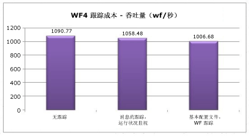  
  
 运行状况监视对吞吐量大约有 3% 的影响。  基本配置文件的成本大约为 8%。  
  
## <a name="interop"></a>Interop  
 WF4 几乎是对 [!INCLUDE[wf1](../../../includes/wf1-md.md)] 完全重写，因此 WF3 工作流和活动不能与 WF4 直接兼容。  采用的许多客户[!INCLUDE[wf2](../../../includes/wf2-md.md)]尽早将有内部或第三方工作流定义和自定义活动的 WF3。  为了简化向 WF4 的迁移，一种方法是使用 Interop 活动，这种活动可以从 WF4 工作流中执行 WF3 活动。  建议仅在必要时才使用 <xref:System.Activities.Statements.Interop> 活动。 [!INCLUDE[crabout](../../../includes/crabout-md.md)]迁移到 WF4 签出[WF4 迁移指南](http://go.microsoft.com/fwlink/?LinkID=153313)。  
  
### <a name="environment-setup"></a>环境设置  
   
  
### <a name="test-results"></a>测试结果  
 下表显示了在各种不同的配置中，运行包含一个序列、序列中包含五个活动的工作流的结果。  
  
|测试|吞吐量（工作流/秒）|  
|----------|-----------------------------------|  
|WF3 运行时中的 WF3 序列|1,576|  
|使用 Interop 的 WF4 运行时中的 WF3 序列|2,745|  
|WF4 序列|153,582|  
  
 可以注意到，使用 Interop 与直接使用 WF3 相比有显著的性能提升。  但是，与 WF4 活动比较后，增加则可以忽略不计。  
  
## <a name="summary"></a>摘要  
 WF4 对性能的巨大投资在许多重要的方面得到了回报。  由于更接近 [!INCLUDE[wf1](../../../includes/wf1-md.md)] 运行时，所以 WF4 中单个工作流组件性能在某些情况下能比 WF3 快数百倍。  延迟数字也得到显著改善。  这意味着，考虑到使用 [!INCLUDE[wf1](../../../includes/wf1-md.md)] 所获得的好处，使用 [!INCLUDE[indigo2](../../../includes/indigo2-md.md)] 与使用手工编码的 [!INCLUDE[wf1](../../../includes/wf1-md.md)] 工作流程相比，产生的负面影响非常小。  暂留性能提高了 2.5 至 3.0 倍。  采用工作流跟踪方式的运行状况监视目前的开销非常低。  我们为那些考虑从 WF3 迁移到 WF4 的用户提供了一套全面的迁集指南。  所有这些使 WF4 成为您编写复杂应用程序的必备之选。  
  
## <a name="acknowledgements"></a>致谢  
 非常感谢以下供稿人员和校对人员的努力工作：  
  
-   Leon Welicki，Microsoft Corporation  
  
-   Ryszard Kwiecinski，Microsoft Corporation  
  
-   Emil Velinov，Microsoft Corporation  
  
-   Nate Talbert，Microsoft Corporation  
  
-   Bob Schmidt，Microsoft Corporation  
  
-   Stefan Batres，Microsoft Corporation
