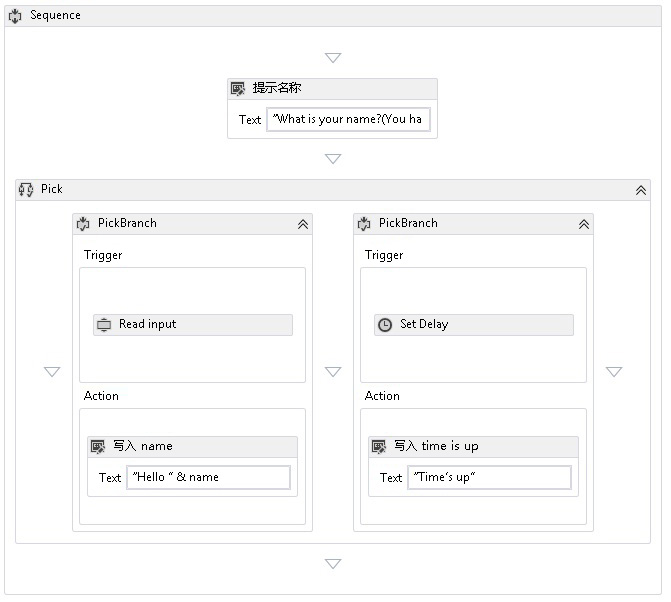

# <a name="pick-activity"></a>Pick 活动
<xref:System.Activities.Statements.Pick> 活动简化了对一组事件触发器（后跟其相应的处理程序）的建模。  <xref:System.Activities.Statements.Pick> 活动包含 <xref:System.Activities.Statements.PickBranch> 活动的集合，其中每个 <xref:System.Activities.Statements.PickBranch> 都是一个 <xref:System.Activities.Statements.PickBranch.Trigger%2A> 活动与一个 <xref:System.Activities.Statements.PickBranch.Action%2A> 活动之间的配对。  执行时，并行执行所有分支的触发器。  在一个触发器完成之后，将执行其相应的操作，并且取消所有其他触发器。  [!INCLUDE[netfx_current_short](../../../includes/netfx-current-short-md.md)]<xref:System.Activities.Statements.Pick> 活动的行为与 [!INCLUDE[netfx35_short](../../../includes/netfx35-short-md.md)]<xref:System.Workflow.Activities.ListenActivity> 活动类似。  
  
 来自[使用 Pick 活动](./samples/using-the-pick-activity.md) SDK 示例的以下屏幕快照显示了具有两个分支的 Pick 活动。  一个分支具有一个名为 **Read input** 的触发器，它是从命令行读取输入的自定义活动。 另一个分支具有一个 <xref:System.Activities.Statements.Delay> 活动触发器。 如果**Read input**活动收到数据之前<xref:System.Activities.Statements.Delay>活动完成<xref:System.Activities.Statements.Delay>延迟将被取消，并且将向控制台写入一条问候信息。  否则，如果 **Read input** 活动未在分配的时间内收到数据，则将取消该活动并向控制台写入一条超时消息。  这是用来向任何操作添加超时的通用模式。  
  
   
  
## <a name="best-practices"></a>最佳实践  
 使用 Pick 时，执行的分支是首先完成其触发器的分支。  从概念上讲，所有触发器都并行执行，并且一个触发器会在由于另一个触发器完成而被取消之前执行它的大部分逻辑。  记住这一点，使用 Pick 活动时要遵循的一般规则是将触发器视为表示一个事件，并且在该事件中放置尽可能少的逻辑。  理想情况下，触发器应只包含足够的逻辑来接收某个事件，并且该事件的所有处理都应属于分支的操作。  此方法最大程度地减少了执行触发器之间的重叠量。  例如，假设有一个具有两个触发器的 <xref:System.Activities.Statements.Pick>，其中每个触发器包含一个后跟附加逻辑的 <xref:System.ServiceModel.Activities.Receive> 活动。  如果附加逻辑引入一个空闲点，则这两个 <xref:System.ServiceModel.Activities.Receive> 活动可能都会成功完成。  一个触发器将完成全部，而另一个触发器将完成一部分。  在某些情况下，接受消息，然后完成其一部分处理是不可接受的。  因此，使用 WF 内置的消息传递活动（如 <xref:System.ServiceModel.Activities.Receive> 和 <xref:System.ServiceModel.Activities.SendReply>）时，尽管通常在触发器中使用 <xref:System.ServiceModel.Activities.Receive>，但如有可能应将 <xref:System.ServiceModel.Activities.SendReply> 和其他逻辑放入操作中。  
  
## <a name="using-the-pick-activity-in-the-designer"></a>在设计器中使用 Pick 活动  
 若要在设计器中使用 Pick，请在工具箱中找到 **Pick** 和 **PickBranch**。  将 **Pick** 拖放到画布上。  默认情况下，设计器中新的 **Pick** 活动将包含两个分支。  若要添加其他分支，请拖动 **PickBranch** 活动并将其放置到现有分支旁。 可将活动拖放到 **Pick** 活动上任何 **PickBranch** 的“触发器”区域或“操作”区域中。  
  
## <a name="using-the-pick-activity-in-code"></a>在代码中使用 Pick 活动  
 使用 <xref:System.Activities.Statements.Pick> 活动的方法是用 <xref:System.Activities.Statements.Pick.Branches%2A> 活动填充它的 <xref:System.Activities.Statements.PickBranch> 集合。 每个 <xref:System.Activities.Statements.PickBranch> 活动都有一个类型为 <xref:System.Activities.Statements.PickBranch.Trigger%2A> 的 <xref:System.Activities.Activity> 属性。 当指定的活动完成执行后，将执行 <xref:System.Activities.Statements.PickBranch.Action%2A>。  
  
 下面的代码示例演示如何使用 <xref:System.Activities.Statements.Pick> 活动为从控制台读取一行的某个活动实现超时。  
  
```csharp  
Sequence body = new Sequence()  
{  
    Variables = { name },  
    Activities =   
   {  
       new System.Activities.Statements.Pick  
        {  
           Branches =   
           {  
               new PickBranch  
               {  
                   Trigger = new ReadLine  
                   {  
                      Result = name,  
                      BookmarkName = "name"  
                   },  
                   Action = new WriteLine   
                   {   
                       Text = ExpressionServices.Convert<string>(ctx => "Hello " +   
                           name.Get(ctx))   
                   }  
               },  
               new PickBranch  
               {  
                   Trigger = new Delay  
                   {  
                      Duration = new TimeSpan(0, 0, 5)  
                   },  
                   Action = new WriteLine  
                   {  
                      Text = "Time is up."  
                   }  
               }  
           }  
       }  
   }  
};  
```  
  
```xaml  
<Sequence xmlns="http://schemas.microsoft.com/netfx/2009/xaml/activities" xmlns:x="http://schemas.microsoft.com/winfx/2006/xaml">  
  <Sequence.Variables>  
    <Variable x:TypeArguments="x:String" Name="username" />  
  </Sequence.Variables>  
  <Pick>  
    <PickBranch>  
      <PickBranch.Trigger>  
        <ReadLine BookmarkName="name" Result="username" />  
      </PickBranch.Trigger>  
      <WriteLine>[String.Concat("Hello ", username)]</WriteLine>  
    </PickBranch>  
    <PickBranch>  
      <PickBranch.Trigger>  
        <Delay>00:00:05</Delay>  
      </PickBranch.Trigger>  
      <WriteLine>Time is up.</WriteLine>  
    </PickBranch>  
  </Pick>  
</Sequence>  
```
