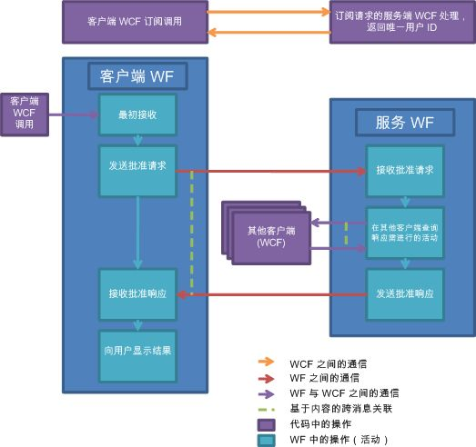

# 文档审批过程Document Approval Process
此示例演示在一起的许多 Windows Workflow Foundation (WF) 和 Windows Communication Foundation (WCF) 功能的使用。This sample demonstrates the use of many Windows Workflow Foundation (WF) and Windows Communication Foundation (WCF) features together. 这些功能一起使用实现一个文档审批过程方案。Together they implement a document approval process scenario. 客户端应用程序既可提交等待审批的文档，也可批准文档。A client application can submit documents for approval and approve documents. 有一个审批管理器应用程序，可用于促进客户端之间的通信和强制执行审批过程的规则。An approval manager application exists to facilitate communications between clients and to enforce the rules of the approval process. 审批过程是一个可执行多种类型的审批的工作流。The approval process is a workflow that can execute several types of approval. 存在多个活动来获取个人审批过程、团体审批过程（一定百分比的审批者）和复合审批过程（由团体审批和个人审批按顺序组成）。Activities exist to get a single approval, a quorum approval (a percentage of set of approvers), and a complex approval process that consists of a quorum and single approval in a sequence.  
  
> [!IMPORTANT]
>  您的计算机上可能已安装这些示例。The samples may already be installed on your machine. 在继续操作之前，请先检查以下（默认）目录：Check for the following (default) directory before continuing.  
>   
>  `<InstallDrive>:\WF_WCF_Samples`  
>   
>  如果此目录不存在，请转到[Windows Communication Foundation (WCF) 和针对.NET Framework 4 的 Windows Workflow Foundation (WF) 示例](http://go.microsoft.com/fwlink/?LinkId=150780)下载所有 Windows Communication Foundation (WCF) 和[!INCLUDE[wf1](../../../../includes/wf1-md.md)]示例。If this directory does not exist, go to [Windows Communication Foundation (WCF) and Windows Workflow Foundation (WF) Samples for .NET Framework 4](http://go.microsoft.com/fwlink/?LinkId=150780) to download all Windows Communication Foundation (WCF) and [!INCLUDE[wf1](../../../../includes/wf1-md.md)] samples. 此示例位于以下目录：This sample is located in the following directory.  
>   
>  `<InstallDrive>:\WF_WCF_Samples\WF\Application\DocumentApprovalProcess`  
  
## 示例详细信息Sample Details  
 下图演示文档审批过程工作流。The following graphic demonstrates the document approval process workflow.  
  
   
  
 从客户端的角度来看，审批过程的工作方式如下：From the client's perspective, the approval process functions as follows:  
  
1.  客户端申请成为审批过程系统中的用户。A client subscribes to be a user in the approval process system.  
  
2.  WCF 客户端将发送到审批管理器应用程序承载的 WCF 服务。A WCF client sends to a WCF service hosted by the approval manager application.  
  
3.  将唯一的用户 ID 返回到客户端。A unique user ID is returned to the client. 此时，客户端可参与审批过程。The client can now participate in approval processes.  
  
4.  客户端在加入后可发送文档以通过个人审批过程、团体审批过程或复合审批过程进行审批。Once joined, a client can send a document for approval using single, quorum or complex approval processes.  
  
5.  单击客户端界面中的按钮，在客户端工作流服务主机中启动工作流实例。A button in the client’s interface is clicked, starting a workflow instance in a client Workflow Service Host.  
  
6.  工作流将审批请求发送到审批管理器应用程序。The workflow sends an approval request to the approval manager application.  
  
7.  工作流管理器启动其自身的工作流以表示审批过程。The workflow manager starts a workflow on its own side to represent an approval process.  
  
8.  一旦执行管理器审批工作流，就会将结果发送回客户端。Once the manager approval workflow executes, the results are sent back to the client.  
  
9. 客户端显示结果。The client displays the results.  
  
10. 客户端可以随时接收审批请求并对其做出响应。A client may receive an approval request and respond to the request at any point in time.  
  
11. 客户端上承载的 WCF 服务可接收来自审批管理器应用程序的批准请求。A WCF service hosted on the client can receive an approval request from the approval manager application.  
  
12. 客户端上将呈现文档信息以供审阅。The document information is presented on the client for review.  
  
13. 用户可以批准或拒绝文档。The user can approve or reject the document.  
  
14. WCF 客户端用于批准将响应发送回审批管理器应用程序。A WCF client is used to send an approval response back to the approval manager application.  
  
 从审批管理器应用程序的角度来看，审批过程的工作方式如下：From the approval manager application’s point of view, the approval process functions as follows:  
  
1.  客户端请求加入审批过程系统。A client requests to participate to the approval process system.  
  
2.  审批管理器上的 WCF 服务收到的请求成为审批过程系统的一部分。A WCF service on the approval manager receives a request to be part of the approval process system.  
  
3.  为客户端生成唯一的 ID。A unique ID is generated for the client. 将用户信息存储在数据库中。The user information is stored in a database.  
  
4.  将唯一的 ID 发送回用户。The unique ID is sent back to the user.  
  
5.  接收审批请求。An approval request is receive. 审批管理器执行审批过程。The approval manager executes an approval process.  
  
6.  审批管理器接收审批请求，启动新的工作流。An approval request is received by the approval manager, starting a new workflow.  
  
7.  根据请求的类型（个人、团体或复合）来执行不同的活动。Depending on the type of request (simple, quorum, or complex) a different activity is executed.  
  
8.  发送和接收相关的活动，这些活动用于向客户端发送供审阅的审批请求和从客户端接收响应。Send and Receive activities with correlation are used to send the approval request to the client for review and receive the response.  
  
9. 将审批过程工作流的结果发送到客户端。The result of the approval process workflow is sent to the client.  
  
## 使用示例Using the Sample  
  
##### 安装数据库To set up the database  
  
1.  从使用管理员特权打开的 [!INCLUDE[vs2010](../../../../includes/vs2010-md.md)] 命令提示中，导航到此 DocumentApprovalProcess 文件夹并运行 Setup.cmd。From a [!INCLUDE[vs2010](../../../../includes/vs2010-md.md)] command prompt opened with Administrator privileges, navigate to this DocumentApprovalProcess folder and run Setup.cmd.  
  
##### 设置应用程序To set up the application  
  
1.  使用 [!INCLUDE[vs2010](../../../../includes/vs2010-md.md)] 打开 DocumentApprovalProcess.sln 解决方案文件。Using [!INCLUDE[vs2010](../../../../includes/vs2010-md.md)], open the DocumentApprovalProcess.sln solution file.  
  
2.  要生成解决方案，按 Ctrl+Shift+B。To build the solution, press CTRL+SHIFT+B.  
  
3.  若要运行解决方案，启动审批管理器应用程序，通过右键单击中的 ApprovalManager 项目**解决方案资源管理器**并单击**调试**->**启动**从右键单击菜单的新实例。To run the solution, launch the Approval Manager Application by right-clicking the ApprovalManager project in the **Solution Explorer** and clicking **Debug**->**Start** new instance from the right-click menu.  
  
     等待管理器的输出指示已做好准备工作。Wait for the manager’s output to let you know that it is ready.  
  
##### 运行个人审批方案To run the single approval scenario  
  
1.  使用管理员权限打开命令提示符。Open a command prompt with administrator permission.  
  
2.  导航到包含解决方案的目录。Navigate to the directory that contains the solution.  
  
3.  导航到 ApprovalClient\Bin\Debug 文件夹并执行两个 ApprovalClient.exe 实例。Navigate to the ApprovalClient\Bin\Debug folder and execute two instances of ApprovalClient.exe.  
  
4.  单击**发现**，请等待，直到**订阅**按钮处于启用状态。Click **discover**, wait until the **subscribe** button is enabled.  
  
5.  键入任意用户名，然后单击**订阅**。Type any user name and click **subscribe**. 对于一个客户端，使用 `UserType1` 和其他类型 `UserType2`。For one client, use `UserType1` and the other type `UserType2`.  
  
6.  在 `UserType1` 客户端中，从下拉菜单中选择个人审批类型，然后键入文档名称和内容。In the `UserType1` client, select the single approval type from the drop down menu and type a document name and content. 单击**请求批准**。Click **Request Approval**.  
  
7.  在 `UserType2` 客户端中，将显示等待审批的文档。In the `UserType2` client, a document awaiting approval appears. 选择它，然后按**批准**或**拒绝**。Select it and press **approve** or **reject**. 结果将显示在 `UserType1` 客户端中。The results should show in the `UserType1` client.  
  
##### 运行团体审批方案To run the quorum approval scenario  
  
1.  使用管理员权限打开命令提示符。Open a command prompt with administrator permission.  
  
2.  导航到包含解决方案的目录。Navigate to the directory that contains the solution.  
  
3.  导航到 ApprovalClient\Bin\Debug 文件夹并执行三个 ApprovalClient.exe 实例。Navigate to the ApprovalClient\Bin\Debug folder and execute three instances of ApprovalClient.exe.  
  
4.  单击**发现**，请等待，直到**订阅**按钮处于启用状态。Click **discover**, wait until the **subscribe** button is enabled.  
  
5.  键入任意用户名，然后单击**订阅**。Type any user name and click **subscribe**. 对于一个客户端，使用 `UserType1` 和其他两个类型 `UserType2`。For one client use `UserType1` and the other two type `UserType2`.  
  
6.  在 `UserType1` 客户端中，从下拉菜单中选择团体审批类型，然后键入文档名称和内容。In the `UserType1` client, select the quorum approval type from the drop down menu and type a document name and content. 单击**请求批准**。Click **Request Approval**. 这将请求两个 `UserType2` 客户端批准或拒绝该文档。This requests that the two `UserType2` clients approve or reject the document. 虽然两个 `UserType2` 客户端都必须做出响应，但只需一个客户端批准文档即可使文档获得审批。While both `UserType2` clients must respond, only one client must approve the document for it to be approved.  
  
7.  在 `UserType2` 客户端中，将显示等待审批的文档。In the `UserType2` clients, a document awaiting approval appears. 选择它，然后按**批准**或**拒绝**。Select it and press **approve** or **reject**. 结果将显示在 `UserType1` 客户端中。The results should show in the `UserType1` client.  
  
##### 运行复合审批方案To run the complex approval scenario  
  
1.  使用管理员权限打开命令提示符。Open a command prompt with administrator permission.  
  
2.  导航到包含解决方案的目录。Navigate to the directory that contains the solution.  
  
3.  导航到 ApprovalClient\Bin\Debug 文件夹并执行四个 ApprovalClient.exe 实例。Navigate to the ApprovalClient\Bin\Debug folder and execute four instances of ApprovalClient.exe.  
  
4.  单击**发现**，请等待，直到**订阅**按钮处于启用状态。Click **discover**, wait until the **subscribe** button is enabled.  
  
5.  键入任意用户名，然后单击**订阅**。Type any user name and click **subscribe**. 为第一个客户端使用 `UserType1`，为第二个客户端使用 `UserType2`，为最后一个客户端使用 `UserType3`。For one client use `UserType1`, in two uses type `UserType2`, and in the last use `UserType3`.  
  
6.  在 `UserType1` 客户端中，从下拉菜单中选择个人审批类型，然后键入文档名称和内容。In the `UserType1` client, select the single approval type from the drop down menu and type a document name and content. 单击**请求批准**。Click **Request Approval**.  
  
7.  在 `UserType2` 客户端中，将显示等待审批的文档。In the `UserType2` clients, a document awaiting approval appears. 选择它，然后按**批准**，该文档传递给`UserType3`客户端。Select it and press **approve**, the document is passed to the `UserType3` client.  
  
     如果第一个 `UserType2` 团体批准该文档，则该文档将传递到 `UserType3` 客户端。If the document is approved by the first `UserType2` quorum, the document is passed to the `UserType3` client.  
  
8.  批准或拒绝来自 `UserType3` 客户端的文档。Approve or reject the document from the `UserType3` client. 结果将显示在 `UserType1` 客户端中。The results should show in the `UserType1` client.  
  
##### 清理To clean up  
  
1.  在 [!INCLUDE[vs2010](../../../../includes/vs2010-md.md)] 命令提示符下，导航到 DocumentApprovalProcess 文件夹并运行 Cleanup.cmd。From a [!INCLUDE[vs2010](../../../../includes/vs2010-md.md)] command prompt, navigate to the DocumentApprovalProcess folder and run Cleanup.cmd.