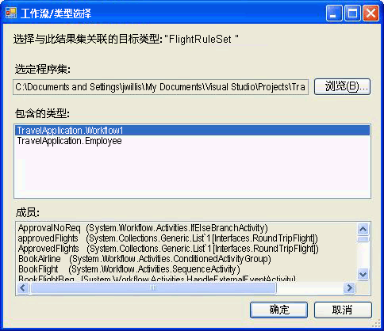

# <a name="external-ruleset-toolkit"></a><span data-ttu-id="6eff4-102">外部 RuleSet 工具包</span><span class="sxs-lookup"><span data-stu-id="6eff4-102">External Ruleset Toolkit</span></span>

<span data-ttu-id="6eff4-103">通常在工作流应用程序中使用规则时，这些规则就是程序集的一部分。</span><span class="sxs-lookup"><span data-stu-id="6eff4-103">Normally when rules are used within a workflow application, the rules are part of the assembly.</span></span> <span data-ttu-id="6eff4-104">在某些情况下，您可能希望将 RuleSet 和程序集分开维护，这样就可以在不重新生成和部署工作流程序集的情况下更新 RuleSet。</span><span class="sxs-lookup"><span data-stu-id="6eff4-104">In some scenarios, you may want to maintain the RuleSets separately from the assembly so that they can be updated without rebuilding and deploying the workflow assembly.</span></span> <span data-ttu-id="6eff4-105">此示例使您可以在数据库中管理和编辑 RuleSet，并在运行时从工作流访问这些 RuleSet。</span><span class="sxs-lookup"><span data-stu-id="6eff4-105">This sample allows you to manage and edit RuleSets in a database and access those RuleSets from a workflow at runtime.</span></span> <span data-ttu-id="6eff4-106">这样正在运行的工作流实例就能够自动合并 RuleSet 更改。</span><span class="sxs-lookup"><span data-stu-id="6eff4-106">This enables running workflow instances to automatically incorporate RuleSet changes.</span></span>

<span data-ttu-id="6eff4-107">外部 RuleSet 工具包示例包含一个基于 Windows 窗体的工具，您可以使用它来管理和编辑数据库中的 RuleSet 版本。</span><span class="sxs-lookup"><span data-stu-id="6eff4-107">The External RuleSet Toolkit sample contains a Windows Forms-based tool that you can use to manage and edit RuleSet versions in a database.</span></span> <span data-ttu-id="6eff4-108">它还包括一个活动和一个宿主服务，用以执行这些规则。</span><span class="sxs-lookup"><span data-stu-id="6eff4-108">It also includes an activity and a host service for executing those rules.</span></span>

> [!NOTE]
> <span data-ttu-id="6eff4-109">此示例要求[Microsoft SQL Server](https://go.microsoft.com/fwlink/?LinkId=96181)。</span><span class="sxs-lookup"><span data-stu-id="6eff4-109">This sample requires [Microsoft SQL Server](https://go.microsoft.com/fwlink/?LinkId=96181).</span></span>

<span data-ttu-id="6eff4-110">Visual Studio 提供了一个 RuleSet 编辑器，Windows Workflow Foundation (WF) 的一部分。</span><span class="sxs-lookup"><span data-stu-id="6eff4-110">Visual Studio provides a RuleSet editor as part of the Windows Workflow Foundation (WF).</span></span> <span data-ttu-id="6eff4-111">双击工作流中的 `Policy` 活动可以启动此编辑器。它将已定义的 RuleSet 对象序列化为与工作流相关联的 .rules 文件（`Policy` 活动依据工作流运行 RuleSet 实例）。</span><span class="sxs-lookup"><span data-stu-id="6eff4-111">You can start this editor by double-clicking the `Policy` activity in a workflow; it serializes the defined RuleSet object to the .rules file associated with the workflow (a `Policy` activity runs a RuleSet instance against the workflow).</span></span> <span data-ttu-id="6eff4-112">在生成工作流项目时，此 .rules 文件将作为资源编译到程序集中。</span><span class="sxs-lookup"><span data-stu-id="6eff4-112">The .rules file is compiled into the assembly as a resource when you build the workflow project.</span></span>

<span data-ttu-id="6eff4-113">此示例包括的组件有：</span><span class="sxs-lookup"><span data-stu-id="6eff4-113">The components of this sample include:</span></span>

- <span data-ttu-id="6eff4-114">一个 RuleSet 图形用户界面工具，您可以使用它来编辑和管理数据库中的 RuleSet 版本。</span><span class="sxs-lookup"><span data-stu-id="6eff4-114">A RuleSet graphical user interface tool that you can use to edit and manage RuleSet versions in the database.</span></span>

- <span data-ttu-id="6eff4-115">一项 RuleSet 服务，该服务在主机应用程序上进行配置，并从数据库访问 RuleSet。</span><span class="sxs-lookup"><span data-stu-id="6eff4-115">A RuleSet service that is configured on the host application and accesses RuleSets from the database.</span></span>

- <span data-ttu-id="6eff4-116">一个 `ExternalPolicy` 活动，该活动从 RuleSet 服务请求 RuleSet，并依工作流运行 RuleSet。</span><span class="sxs-lookup"><span data-stu-id="6eff4-116">An `ExternalPolicy` activity that requests a RuleSet from the RuleSet service and runs the RuleSet against the workflow.</span></span>

<span data-ttu-id="6eff4-117">组件的交互是在下图中所示。</span><span class="sxs-lookup"><span data-stu-id="6eff4-117">The interaction of the components is shown in the following image.</span></span> <span data-ttu-id="6eff4-118">后面几节将对每个组件进行描述。</span><span class="sxs-lookup"><span data-stu-id="6eff4-118">The sections that follow describe each component.</span></span>


> [!IMPORTANT]
> <span data-ttu-id="6eff4-120">您的计算机上可能已安装这些示例。</span><span class="sxs-lookup"><span data-stu-id="6eff4-120">The samples may already be installed on your machine.</span></span> <span data-ttu-id="6eff4-121">在继续操作之前，请先检查以下（默认）目录：</span><span class="sxs-lookup"><span data-stu-id="6eff4-121">Check for the following (default) directory before continuing.</span></span>
>
> `<InstallDrive>:\WF_WCF_Samples`
>
> <span data-ttu-id="6eff4-122">如果此目录不存在，请转到[Windows Communication Foundation (WCF) 和.NET Framework 4 的 Windows Workflow Foundation (WF) 示例](https://go.microsoft.com/fwlink/?LinkId=150780)若要下载所有 Windows Communication Foundation (WCF) 和[!INCLUDE[wf1](../../../../includes/wf1-md.md)]示例。</span><span class="sxs-lookup"><span data-stu-id="6eff4-122">If this directory does not exist, go to [Windows Communication Foundation (WCF) and Windows Workflow Foundation (WF) Samples for .NET Framework 4](https://go.microsoft.com/fwlink/?LinkId=150780) to download all Windows Communication Foundation (WCF) and [!INCLUDE[wf1](../../../../includes/wf1-md.md)] samples.</span></span> <span data-ttu-id="6eff4-123">此示例位于以下目录：</span><span class="sxs-lookup"><span data-stu-id="6eff4-123">This sample is located in the following directory.</span></span>
>
> `<InstallDrive>:\WF_WCF_Samples\WF\Scenario\ExternalRuleSetToolKit`

## <a name="ruleset-tool"></a><span data-ttu-id="6eff4-124">RuleSet 工具</span><span class="sxs-lookup"><span data-stu-id="6eff4-124">RuleSet Tool</span></span>

<span data-ttu-id="6eff4-125">下图是 RuleSet 工具的屏幕截图。</span><span class="sxs-lookup"><span data-stu-id="6eff4-125">The following image is a screenshot of the RuleSet tool.</span></span> <span data-ttu-id="6eff4-126">从**规则存储**菜单中，可以从数据库加载可用的 Ruleset，并将修改过的 Ruleset 保存回存储区。</span><span class="sxs-lookup"><span data-stu-id="6eff4-126">From the **Rule Store** menu, you can load the available RuleSets from the database and save modified RuleSets back to the store.</span></span> <span data-ttu-id="6eff4-127">应用程序配置文件为 RuleSet 数据库提供了数据库连接字符串。</span><span class="sxs-lookup"><span data-stu-id="6eff4-127">An application configuration file provides a database connection string for the RuleSet database.</span></span> <span data-ttu-id="6eff4-128">启动工具时，它会从已配置的数据库自动加载 RuleSet。</span><span class="sxs-lookup"><span data-stu-id="6eff4-128">When you start the tool, it automatically loads the RuleSets from the configured database.</span></span>


<span data-ttu-id="6eff4-130">RuleSet 工具将主版本号和次版本号应用到 RuleSet，使您可以同时维护和存储多个版本（除了提供版本管理功能之外，此工具还提供无锁定或其他配置管理功能）。</span><span class="sxs-lookup"><span data-stu-id="6eff4-130">The RuleSet tool applies major and minor version numbers to the RuleSets, allowing you to simultaneously maintain and store multiple versions (the tool provides no locking or other configuration management features in addition to the versioning capability).</span></span> <span data-ttu-id="6eff4-131">使用这个工具，您可以创建新的 RuleSet 版本或删除现有版本。</span><span class="sxs-lookup"><span data-stu-id="6eff4-131">Using the tool, you can create new RuleSet versions or delete existing versions.</span></span> <span data-ttu-id="6eff4-132">当您单击**新建**，该工具创建新的 RuleSet 名称并应用 1.0 版。</span><span class="sxs-lookup"><span data-stu-id="6eff4-132">When you click **New**, the tool creates a new RuleSet name and applies version 1.0.</span></span> <span data-ttu-id="6eff4-133">复制版本时，此工具会为选定的 RuleSet 版本（包括所包含的规则）创建一个副本，并分配唯一的新版本号。</span><span class="sxs-lookup"><span data-stu-id="6eff4-133">When you copy a version, the tool creates a copy of the selected RuleSet version, including the contained rules, and assigns new, unique version numbers.</span></span> <span data-ttu-id="6eff4-134">这些版本号基于现有的 RuleSet 版本号。</span><span class="sxs-lookup"><span data-stu-id="6eff4-134">These version numbers are based on the version numbers of existing RuleSets.</span></span> <span data-ttu-id="6eff4-135">您可以使用窗体上相关联的字段，更改 RuleSet 的名称和版本号。</span><span class="sxs-lookup"><span data-stu-id="6eff4-135">You can change the RuleSet name and version numbers using the associated fields on the form.</span></span>

<span data-ttu-id="6eff4-136">当您单击**编辑规则**，启动 RuleSet 编辑器，如在下图中所示：</span><span class="sxs-lookup"><span data-stu-id="6eff4-136">When you click **Edit Rules**, the RuleSet editor starts, as shown in the following image:</span></span>


<span data-ttu-id="6eff4-138">这是重新承载的是 Windows Workflow Foundation Visual Studio 外接程序的一部分编辑器对话框。</span><span class="sxs-lookup"><span data-stu-id="6eff4-138">This is a re-hosting of the editor dialog that is part of the Windows Workflow Foundation Visual Studio add-in.</span></span> <span data-ttu-id="6eff4-139">它可提供相同的功能，包括 Intellisense 支持。</span><span class="sxs-lookup"><span data-stu-id="6eff4-139">It provides the same functionality, including Intellisense support.</span></span> <span data-ttu-id="6eff4-140">规则是根据与工具; 中 RuleSet 相关联的目标类型 （如工作流） 创作当您单击**浏览**主工具对话框中**工作流/类型选择器**对话框出现，如图 4 所示。</span><span class="sxs-lookup"><span data-stu-id="6eff4-140">The rules are authored against a target type (such as a workflow) that is associated with the RuleSet in the tool; when you click **Browse** in the main tool dialog, the **Workflow/Type Selector** dialog appears, as shown in Figure 4.</span></span>

<span data-ttu-id="6eff4-141"></span><span class="sxs-lookup"><span data-stu-id="6eff4-141"></span></span>

<span data-ttu-id="6eff4-142">图 4：工作流/类型选择器</span><span class="sxs-lookup"><span data-stu-id="6eff4-142">Figure 4: Workflow/Type Selector</span></span>

<span data-ttu-id="6eff4-143">可以使用**工作流/类型选择器**对话框来指定程序集和该程序集内的特定类型。</span><span class="sxs-lookup"><span data-stu-id="6eff4-143">You can use the **Workflow/Type Selector** dialog to specify an assembly and a specific type within that assembly.</span></span> <span data-ttu-id="6eff4-144">这个类型是创作（和运行）规则所依据的目标类型。</span><span class="sxs-lookup"><span data-stu-id="6eff4-144">This type is the target type against which the rules are authored (and run).</span></span> <span data-ttu-id="6eff4-145">在很多情况下，目标类型会是工作流或某些其他活动类型。</span><span class="sxs-lookup"><span data-stu-id="6eff4-145">In many cases, the target type is a workflow or some other activity type.</span></span> <span data-ttu-id="6eff4-146">但是，您可以依据任何 .NET 类型运行 RuleSet。</span><span class="sxs-lookup"><span data-stu-id="6eff4-146">However, you can run a RuleSet against any .NET type.</span></span>

<span data-ttu-id="6eff4-147">程序集文件和类型的路径`name are stored with the`数据库中的规则集，以便从数据库检索 RuleSet 时工具将尝试自动加载目标类型。</span><span class="sxs-lookup"><span data-stu-id="6eff4-147">The path to the assembly file and the type `name are stored with the` RuleSet in the database, so that when the RuleSet is retrieved from the database, the tool attempts to automatically load the target type.</span></span>

<span data-ttu-id="6eff4-148">当您单击**确定**中**工作流/类型选择器**对话框中，它会验证所选的类型与规则集，以确保目标类型具有规则所引用的所有成员。</span><span class="sxs-lookup"><span data-stu-id="6eff4-148">When you click **OK** in the **Workflow/Type Selector** dialog, it validates the selected type against the RuleSet, to ensure that the target type has all the members referenced by the rules.</span></span> <span data-ttu-id="6eff4-149">错误将显示在**验证错误**对话框。</span><span class="sxs-lookup"><span data-stu-id="6eff4-149">Errors are shown in a **Validation Errors** dialog.</span></span> <span data-ttu-id="6eff4-150">您可以选择继续此更改忽略错误，或单击**取消**。</span><span class="sxs-lookup"><span data-stu-id="6eff4-150">You can choose to continue with the change despite the errors, or click **Cancel**.</span></span> <span data-ttu-id="6eff4-151">从**工具**主工具对话框中的菜单，单击**验证**来重新验证 RuleSet 版本依据目标活动。</span><span class="sxs-lookup"><span data-stu-id="6eff4-151">From the **Tools** menu in the main tool dialog, you can click **Validate** to re-validate the RuleSet version against the target activity.</span></span>


<span data-ttu-id="6eff4-153">从**数据**菜单在工具中，您可以导入和导出 Ruleset。</span><span class="sxs-lookup"><span data-stu-id="6eff4-153">From the **Data** menu in the tool, you can import and export RuleSets.</span></span> <span data-ttu-id="6eff4-154">当您单击**导入**，此时将显示文件选择器对话框，您可以从中选择.rules 文件。</span><span class="sxs-lookup"><span data-stu-id="6eff4-154">When you click **Import**, a file-chooser dialog appears, from which you can select a .rules file.</span></span> <span data-ttu-id="6eff4-155">这可能会也可能不是最初在 Visual Studio 中创建的文件。</span><span class="sxs-lookup"><span data-stu-id="6eff4-155">This may or may not be a file initially created in Visual Studio.</span></span> <span data-ttu-id="6eff4-156">此 .rules 文件应包含一个序列化的 `RuleDefinitions` 实例，该实例包含一个条件集合和一个 RuleSet 集合。</span><span class="sxs-lookup"><span data-stu-id="6eff4-156">The .rules file should contain a serialized `RuleDefinitions` instance that contains a collection of conditions and a collection of RuleSets.</span></span> <span data-ttu-id="6eff4-157">该工具不使用条件集合，但它使用`RuleDefinitions`.rules 格式，以允许与 Visual Studio 环境进行交互。</span><span class="sxs-lookup"><span data-stu-id="6eff4-157">The tool does not use the conditions collection, but it does use the `RuleDefinitions` .rules format to allow interaction with the Visual Studio environment.</span></span>

<span data-ttu-id="6eff4-158">选择.rules 文件后**RuleSet 选择器**此时将显示对话框。</span><span class="sxs-lookup"><span data-stu-id="6eff4-158">After selecting a .rules file, a **RuleSet Selector** dialog appears.</span></span> <span data-ttu-id="6eff4-159">您可以使用此对话框，从文件中选择想要导入的 RuleSet（默认指定的是所有 RuleSet）。</span><span class="sxs-lookup"><span data-stu-id="6eff4-159">You can use the dialog to select the RuleSets from the file that you want to import (the default specifies all RuleSets).</span></span> <span data-ttu-id="6eff4-160">由于 WF 项目中的版本和程序集的版本相同，所以此 .rules 文件中的 RuleSet 没有版本号。</span><span class="sxs-lookup"><span data-stu-id="6eff4-160">RuleSets in the .rules file do not have version numbers, because their versioning within a WF project is the same as the version of the assembly.</span></span> <span data-ttu-id="6eff4-161">在导入过程中，该工具会自动分配的下一步提供主版本号 （其中可以更改导入后）;您可以看到已分配的版本号**RuleSet 选择器**列表。</span><span class="sxs-lookup"><span data-stu-id="6eff4-161">During the importing process, the tool automatically assigns the next available major version number (which you can change after importing); you can see the assigned version numbers in the **RuleSet Selector** list.</span></span>

<span data-ttu-id="6eff4-162">对于导入的每个 RuleSet，工具都会尝试基于 RuleSet 中使用的成员，从 .rules 文件（如果存在）位置下面的 bin\Debug 文件夹查找关联类型。</span><span class="sxs-lookup"><span data-stu-id="6eff4-162">For each RuleSet it imports, the tool attempts to locate the associated type from the bin\Debug folder under the location of the .rules file (if it exists), based on the members used in the RuleSet.</span></span> <span data-ttu-id="6eff4-163">如果工具找到多个匹配的类型，它将尝试基于 .rules 文件名称和类型名称之间的匹配（例如，`Workflow1` 类型与 Workflow1.rules 相对应）选择一种类型。</span><span class="sxs-lookup"><span data-stu-id="6eff4-163">If the tool finds multiple matching types, it attempts to choose a type based on a match between the .rules file name and the type name (for example, the `Workflow1` type corresponds to Workflow1.rules).</span></span> <span data-ttu-id="6eff4-164">如果存在多个匹配，系统会提示您选择类型。</span><span class="sxs-lookup"><span data-stu-id="6eff4-164">If multiple matches exist, you are prompted to select the type.</span></span> <span data-ttu-id="6eff4-165">如果此自动标识机制无法找到匹配的程序集或类型，则在导入后，你可以单击**浏览**上主工具对话框以导航到相关联的类型。</span><span class="sxs-lookup"><span data-stu-id="6eff4-165">If this auto-identification mechanism fails to locate a matching assembly or type, then after importing you can click **Browse** on the main tool dialog to navigate to the associated type.</span></span> <span data-ttu-id="6eff4-166">下图显示了 RuleSet 选择器：</span><span class="sxs-lookup"><span data-stu-id="6eff4-166">The following image shows the RuleSet Selector:</span></span>


<span data-ttu-id="6eff4-168">当您单击**数据导出**从主工具菜单**RuleSet 选择器**对话框会再次出现，从中您可以确定从数据库应导出的 Ruleset。</span><span class="sxs-lookup"><span data-stu-id="6eff4-168">When you click **Data-Export** from the main tool menu, the **RuleSet Selector** dialog appears again, from which you can determine the RuleSets from the database that should be exported.</span></span> <span data-ttu-id="6eff4-169">当您单击**确定**即**保存文件**对话框出现时，可以在其中指定的名称和生成的.rules 文件的位置。</span><span class="sxs-lookup"><span data-stu-id="6eff4-169">When you click **OK**, a **Save File** dialog appears, in which you can specify the name and location of the resulting .rules file.</span></span> <span data-ttu-id="6eff4-170">由于此 .rules 文件不包含版本信息，因此您只能选择一个具有给定 RuleSet 名称的 RuleSet 版本。</span><span class="sxs-lookup"><span data-stu-id="6eff4-170">Because the .rules file does not contain version information, you can only select one RuleSet version with a given RuleSet name.</span></span>

## <a name="policyfromservice-activity"></a><span data-ttu-id="6eff4-171">PolicyFromService 活动</span><span class="sxs-lookup"><span data-stu-id="6eff4-171">PolicyFromService Activity</span></span>

<span data-ttu-id="6eff4-172">`PolicyFromService` 活动的代码非常简单。</span><span class="sxs-lookup"><span data-stu-id="6eff4-172">The code for the `PolicyFromService` activity is straightforward.</span></span> <span data-ttu-id="6eff4-173">其工作方式与随 WF 提供的 `Policy` 活动非常相似，但它不会从 .rules 文件检索目标 RuleSet，而是调用宿主服务获取 RuleSet 实例。</span><span class="sxs-lookup"><span data-stu-id="6eff4-173">It works much like the `Policy` activity provided with WF, but instead of retrieving the target RuleSet from the .rules file, it calls a host service to obtain the RuleSet instance.</span></span> <span data-ttu-id="6eff4-174">然后依据根工作流活动实例运行 RuleSet。</span><span class="sxs-lookup"><span data-stu-id="6eff4-174">It then runs the RuleSet against the root workflow activity instance.</span></span>

<span data-ttu-id="6eff4-175">若要在工作流中使用活动，请从工作流项目中添加对 `PolicyActivities` 和 `RuleSetService` 程序集的引用。</span><span class="sxs-lookup"><span data-stu-id="6eff4-175">To use the activity in a workflow, add a reference to the `PolicyActivities` and `RuleSetService` assemblies from your workflow project.</span></span> <span data-ttu-id="6eff4-176">有关如何将活动添加到工具箱的讨论，请参见本主题最后讨论的过程。</span><span class="sxs-lookup"><span data-stu-id="6eff4-176">See the procedure at the end of this topic for a discussion of how to add the activity to the toolbox.</span></span>

<span data-ttu-id="6eff4-177">将活动置于工作流中后，必须提供要运行的 RuleSet 名称。</span><span class="sxs-lookup"><span data-stu-id="6eff4-177">After placing the activity in your workflow, you must provide the name of the RuleSet to be run.</span></span> <span data-ttu-id="6eff4-178">您可以输入名称作为一个文本值或绑定到另一个活动的工作流变量或属性。</span><span class="sxs-lookup"><span data-stu-id="6eff4-178">You can enter the name as a literal value, or bind to a workflow variable or property of another activity.</span></span> <span data-ttu-id="6eff4-179">或者，您可以选择为应该运行的特定 RuleSet 输入版本号。</span><span class="sxs-lookup"><span data-stu-id="6eff4-179">Optionally, you can enter version numbers for the specific RuleSet that should be run.</span></span> <span data-ttu-id="6eff4-180">如果您保留主版本号和次版本号的默认值 (0)，则数据库中最新的版本号将自动提供给活动。</span><span class="sxs-lookup"><span data-stu-id="6eff4-180">If you leave the default value of 0 for the major and minor version numbers, the latest version number in the database is automatically provided for the activity.</span></span>

## <a name="ruleset-service"></a><span data-ttu-id="6eff4-181">规则集服务</span><span class="sxs-lookup"><span data-stu-id="6eff4-181">RuleSet Service</span></span>

<span data-ttu-id="6eff4-182">此服务负责从数据库中检索指定的 RuleSet 版本，并将其返回到调用活动中。</span><span class="sxs-lookup"><span data-stu-id="6eff4-182">The service is responsible for retrieving the specified RuleSet version from the database and returning it to the calling activity.</span></span> <span data-ttu-id="6eff4-183">如前所述，如果在 `GetRuleSet` 调用中传递的主版本和次版本值均为 0，则该服务将检索最新版本。</span><span class="sxs-lookup"><span data-stu-id="6eff4-183">As previously discussed, if the major and minor version values passed in the `GetRuleSet` call are both 0, the service retrieves the latest version.</span></span> <span data-ttu-id="6eff4-184">此时并不存在 RuleSet 定义或实例的缓存；同样也不存在将 RuleSet 版本标记为“已部署”，以将它们与正在进行的 RuleSet 区分开来的功能。</span><span class="sxs-lookup"><span data-stu-id="6eff4-184">At this point, there is no caching of RuleSet definitions or instances; similarly, there are no features for marking RuleSet versions as "deployed" to differentiate them from in-progress RuleSets.</span></span>

<span data-ttu-id="6eff4-185">应该使用应用程序配置文件，在主机上配置该服务要访问的数据库。</span><span class="sxs-lookup"><span data-stu-id="6eff4-185">The database to be accessed by the service should be configured on the host using an application configuration file.</span></span>

#### <a name="to-run-the-tool"></a><span data-ttu-id="6eff4-186">运行此工具</span><span class="sxs-lookup"><span data-stu-id="6eff4-186">To run the tool</span></span>

1. <span data-ttu-id="6eff4-187">设置由工具和服务使用的 RuleSet 表的文件夹包含一个 Setup.sql 文件。</span><span class="sxs-lookup"><span data-stu-id="6eff4-187">The folder that sets up the RuleSet table used by the tool and the service contains a Setup.sql file.</span></span> <span data-ttu-id="6eff4-188">您可以在 SQL Express 上运行 Setup.cmd 批处理文件来创建 Rules 数据库，并对 RuleSet 表进行设置。</span><span class="sxs-lookup"><span data-stu-id="6eff4-188">You can run the Setup.cmd batch file to create the Rules database on SQL Express and to set up the RuleSet table.</span></span>

2. <span data-ttu-id="6eff4-189">如果您编辑批处理文件或 Setup.sql，并指定不使用 SQL Express 或不将表置于名称非 `Rules` 的数据库中，则应当使用相同的信息，对 RuleSet 工具和 `UsageSample` 项目中的应用程序配置文件进行编辑。</span><span class="sxs-lookup"><span data-stu-id="6eff4-189">If you edit the batch file or Setup.sql and specify not to use SQL Express or to place the table in a database named something other than `Rules`, the application configuration files in the RuleSet tool and `UsageSample` projects should be edited with the same information.</span></span>

3. <span data-ttu-id="6eff4-190">运行 Setup.sql 脚本后可以生成 `ExternalRuleSetToolkit` 解决方案，然后可以从 ExternalRuleSetTool 项目启动 RuleSet 工具。</span><span class="sxs-lookup"><span data-stu-id="6eff4-190">After you run the Setup.sql script, you can build the `ExternalRuleSetToolkit` solution and then launch the RuleSet tool from the ExternalRuleSetTool project.</span></span>

4. <span data-ttu-id="6eff4-191">`RuleSetToolkitUsageSample` 顺序工作流控制台应用程序解决方案包括一个示例工作流。</span><span class="sxs-lookup"><span data-stu-id="6eff4-191">The `RuleSetToolkitUsageSample` Sequential Workflow Console Application solution includes a sample workflow.</span></span> <span data-ttu-id="6eff4-192">此工作流由一个 `PolicyFromService` 活动和两个变量 `orderValue` 和 `discount` 组成，它是目标 RuleSet 运行时依据的工作流。</span><span class="sxs-lookup"><span data-stu-id="6eff4-192">The workflow consists of a `PolicyFromService` activity and two variables, `orderValue` and `discount`, against which the target RuleSet runs.</span></span>

5. <span data-ttu-id="6eff4-193">若要使用示例，请生成 `RuleSetToolkitUsageSample` 解决方案。</span><span class="sxs-lookup"><span data-stu-id="6eff4-193">To use the sample, build the `RuleSetToolkitUsageSample` solution.</span></span> <span data-ttu-id="6eff4-194">然后从 RuleSet 工具主菜单中，单击**数据导入**并指向 RuleSetToolkitUsageSample 文件夹中的 DiscountRuleSet.rules 文件。</span><span class="sxs-lookup"><span data-stu-id="6eff4-194">Then from the RuleSet tool main menu, click **Data-Import** and point to the DiscountRuleSet.rules file in the RuleSetToolkitUsageSample folder.</span></span> <span data-ttu-id="6eff4-195">单击**规则存储区保存**菜单选项将导入的 RuleSet 保存到数据库。</span><span class="sxs-lookup"><span data-stu-id="6eff4-195">Click the **Rule Store-Save** menu option to save the imported RuleSet to the database.</span></span>

6. <span data-ttu-id="6eff4-196">由于 `PolicyActivities` 程序集是从示例工作流项目中进行引用的，因此 `PolicyFromService` 活动将出现在工作流中。</span><span class="sxs-lookup"><span data-stu-id="6eff4-196">Because the `PolicyActivities` assembly is referenced from the sample workflow project, the `PolicyFromService` activity appears in the workflow.</span></span> <span data-ttu-id="6eff4-197">但是，默认情况下它不出现在工具箱中。</span><span class="sxs-lookup"><span data-stu-id="6eff4-197">It does not, however, appear in the toolbox by default.</span></span> <span data-ttu-id="6eff4-198">若要将它添加到工具箱，可以执行以下操作：</span><span class="sxs-lookup"><span data-stu-id="6eff4-198">To add it to the toolbox, do the following:</span></span>

    - <span data-ttu-id="6eff4-199">右键单击工具箱并选择**选择项**（这可能需要一段时间）。</span><span class="sxs-lookup"><span data-stu-id="6eff4-199">Right-click the toolbox and select **Choose Items** (this may take a while).</span></span>

    - <span data-ttu-id="6eff4-200">当**选择工具箱项**对话框出现后，单击**活动**选项卡。</span><span class="sxs-lookup"><span data-stu-id="6eff4-200">When the **Choose Toolbox Items** dialog appears, click the **Activities** tab.</span></span>

    - <span data-ttu-id="6eff4-201">浏览到`PolicyActivities`中的程序集`ExternalRuleSetToolkit`解决方案，单击**打开**。</span><span class="sxs-lookup"><span data-stu-id="6eff4-201">Browse to the `PolicyActivities` assembly in the `ExternalRuleSetToolkit` solution and click **Open**.</span></span>

    - <span data-ttu-id="6eff4-202">絋粄`PolicyFromService`中选择活动**选择工具箱项**对话框，然后再单击**确定**。</span><span class="sxs-lookup"><span data-stu-id="6eff4-202">Ensure that the `PolicyFromService` activity is selected in the **Choose Toolbox Items** dialog and then click **OK**.</span></span>

    - <span data-ttu-id="6eff4-203">该活动应会显示在工具箱中**RuleSetToolkitUsageSample 组件**类别。</span><span class="sxs-lookup"><span data-stu-id="6eff4-203">The activity should now appear in the toolbox in the **RuleSetToolkitUsageSample Components** category.</span></span>

7. <span data-ttu-id="6eff4-204">已经使用 Program.cs 中的下列语句在控制台应用程序主机上对 RuleSet 服务进行了配置。</span><span class="sxs-lookup"><span data-stu-id="6eff4-204">The RuleSet service is already configured on the console application host using the following statement in Program.cs.</span></span>

    ```csharp
    workflowRuntime.AddService(new RuleSetService());
    ```

8. <span data-ttu-id="6eff4-205">您也可以使用配置文件在主机上配置该服务。有关详细信息，请参见 SDK 文档。</span><span class="sxs-lookup"><span data-stu-id="6eff4-205">You can also configure the service on the host using a configuration file; see the SDK documentation for details.</span></span>

9. <span data-ttu-id="6eff4-206">工作流项目中添加了一个应用程序配置文件，以便为服务要使用的数据库指定连接字符串。</span><span class="sxs-lookup"><span data-stu-id="6eff4-206">An application configuration file is added to the workflow project to specify the connection string for the database to be used by the service.</span></span> <span data-ttu-id="6eff4-207">这个连接字符串应与 RuleSet 工具使用的相同，它指向包含 RuleSet 表的数据库。</span><span class="sxs-lookup"><span data-stu-id="6eff4-207">This should be the same connection string used by the RuleSet tool, which points to the database that contains the RuleSet table.</span></span>

10. <span data-ttu-id="6eff4-208">您现在可以像运行任何其他工作流控制台应用程序一样运行 `RuleSetToolkitUsageSample` 项目。</span><span class="sxs-lookup"><span data-stu-id="6eff4-208">You can now run the `RuleSetToolkitUsageSample` project as you would any other workflow console application.</span></span> <span data-ttu-id="6eff4-209">按 F5 或 Ctrl + F5 在 Visual Studio 中或直接运行 RuleSetToolkitUsageSample.exe 文件。</span><span class="sxs-lookup"><span data-stu-id="6eff4-209">Press F5 or Ctrl+F5 within Visual Studio or run the RuleSetToolkitUsageSample.exe file directly.</span></span>

    > [!NOTE]
    > <span data-ttu-id="6eff4-210">因为 RuleSet 工具会加载用法示例程序集，所以您必须关闭该工具才能重新编译用法示例。</span><span class="sxs-lookup"><span data-stu-id="6eff4-210">You must close the RuleSet tool to recompile the usage sample, because the tool loads the usage sample assembly.</span></span>
